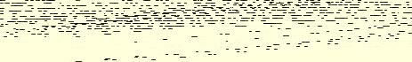

喝的，后一种是给病人喝的）。就此搁笔，再给小杜西[^1]附去几张邮票。

#### 你的弗·恩·

有许多邮票是双份的。重复的邮票在这里可以交换。我可以大量供给意大利、瑞士、挪威和德国的某些邮票。

### １９３

## 恩格斯致马克思

### 伦敦

> １８６３年５月２０日于曼彻斯特

老摩尔，老摩尔，

大胡子的老摩尔！

你出了什么事，怎么听不到你一点消息？你有什么不幸，你在做什么事情？你是病了？还是陷入了你的政治经济学的深渊？还是你已任命了小杜西做你的通信秘书？还是别的什么？

你对我们在柏林的那些好汉们怎么看，他们得出这样的结论， 即如果一个大臣宣称整个议院对他的情况了如指掌云云，那末议长是否有权要求他遵守秩序３２８，是一个问题。还没有一届议会这样顽固地和不适时宜地坚持这种原则，即资产阶级的反对派在同专制制度和容克奸党的斗争中负有挨揍的义务。这仍然是我们１８４８ 年那些老朋友。而这次却碰上了另一个时代。

拉萨尔的事件以及因此在德国引起的争吵开始变得不愉快

> 恩格斯１８６３年５月２０日给马克思的信的第一页了。３２９现在到时候了，你应该写完自己的著作，哪怕只是为了我们能有另一种通俗宣传员。此外，因为用这样的办法可以重新争取到进行反对资产阶级活动的地盘，这是很好的；糟糕的只是，这个臭名远扬的伊戚希这时也将给自己树立地位。不过，我们对此决不能加以阻挠，正象我们不能阻挠卡尔·布林德在公众面前对巴登大公[^2]摆出英勇好斗的姿态一样。

然而，即使在完全脱离政治的领域内，新的科学发现需要经过多少时间才能为自己开辟道路，关于这一点可以看赖尔的《人类古代》一书。早在１８３４年，施梅林在柳提赫[^3]就发现了恩吉斯人的头骨化石，并给赖尔看过；当时他还发表了一大本书[^4]。而尽管这样， 到目前为止，还没有一个人认为值得花力气多少认真地研究一下这个问题。同样，布歇·德·佩尔特早在１８４２年就在松姆河流域的阿勃维尔发现了燧石工具，并且正确地确定了它们的地质年代； 但是他的发现一直到五十年代末才得到承认。这些微不足道的人却是科学的维护者。

鲁普斯的痛风病又发作得很厉害，但已复元了。

我在努力学塞尔维亚语，主要在学武克·斯蒂凡诺维奇·卡腊季奇搜集的民歌集。它对我来说，要比其他任何一种斯拉夫语容易些。

再附上几张邮票。在这方面，现在办事处里是盗窃成风。

#### 你的弗·恩·

[^1]: 爱琳娜·马克思。—— 编者注

[^2]: 弗里德里希一世。—— 编者注比利时称作：列日。原稿为：“１８４３年”。—— 编者注

[^3]: 

[^4]: 菲·沙·施梅林《关于在列日地区山洞中发现的骨化石的科学研究著作》。—— 编者注