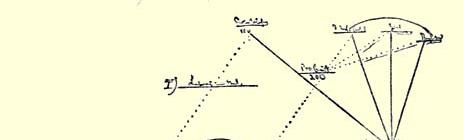
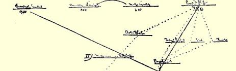
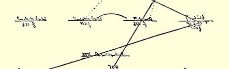
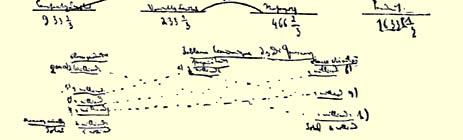
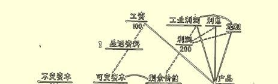
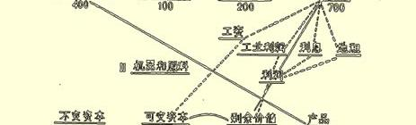
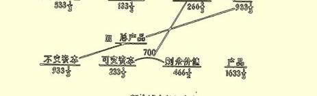
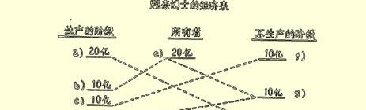

六月的群众性起义—— 遭受失败，

３３８原因显然是缺乏武器，如果不出现外部纠葛，现在也免不了要逐渐衰落下去。

你对伊戚希[^1]的策略完全正确。这个家伙在关键时刻可能为形势所迫而和我们同行，也可能成为我们公开的敌人，对他采取宽容态度，能有什么结果呢。容忍这个蠢才从智力上长年剥削，而且为了对此表示感谢，还必须不顾他的种种蠢事而去维护他，这真是太过分了。

有人在找我，就此搁笔。

#### 你的弗·恩·

### ２００

## 马克思致恩格斯

### 曼彻斯特

> １８６３年７月６日于伦敦

亲爱的恩格斯：

首先非常感谢你的二百五十英镑。德朗克大约四个月以前寄来过五十英镑，今天寄来了二百英镑。

小燕妮可惜一直没有复元。咳嗽还没有好，她太“虚弱”了。学期一结束，我马上把她和其他孩子们一起送到浴场去。我虽然很信任艾伦，但还是非常希望**龚佩尔特**（在度假的时候他大概会到大陆去的）到这里来看看我们，给小燕妮诊断一下，对我谈谈自己的意见。老实告诉你说，我对这个孩子非常担心。我觉得，在这样的年纪消瘦得这样厉害，很危险。

帕麦斯顿在波兰事件上玩弄他的老手法。交给俄国人的照会， 其原件是从彼得堡送到伦敦的。帕麦斯顿**收买了**乌尔卡尔特那里的**亨尼西**，给这个爱尔兰流氓在法国的一条英法合资经营的铁路上找了一个肥缺（一个高薪的闲职）。此地政客们**卖身投靠的行径**， 远非大陆上所能比拟。不论我们或法国人，都想象不到会有这样恬不知耻的情况。关于“扎莫伊斯基伯爵”，我已经向乌尔卡尔特分子再三谈过，说这个家伙在１８３０年至１８３１年间出卖了波兰人，他派一个满员的军，不是去**对付**俄国，而是**越过了**奥地利的边境。由于他老是私人同帕姆搞阴谋诡计，现在这些人终于对他产生了怀疑。３３９

南军对北军的征讨

３４０，我看是里士满的报纸及其追随者掀起的叫嚣迫使李进行的。我认为这是一种绝望的举动。不过，这场战争会拖下去，而且从**欧洲的**利益来看是很合心意的。

伊戚希给我寄来了一本他新出的小册子—— 他在美因河畔法兰克福的演说３４１。我现在每天必须花十个小时去搞政治经济学，所以不能要求我把自己余下的时间消磨在阅读他的小学生练习上。 因此，暂时只能放在一边。有空时我研究微积分。顺便说说，我有许多关于这方面的书籍，如果你愿意研究，我准备寄给你一本。我认为这对你的军事研究几乎是必不可缺的。况且，这个数学部门 （仅就技术方面而言），例如同高等代数比起来，要容易得多。除了普通代数和三角以外，并不需要先具备什么知识，但是必须对圆锥曲线有一个一般的了解。

请你对附去的“鲁西荣公爵”的小册子为我写一个多少有点论据的评论，—— 他以前的名字叫“彼”，这你大概想得起来，—— 因为他每天都写信来纠缠我，要我作出“裁决”。

附上一份“**经济表**”，这是我用来代替魁奈的表３４２的，天气很热，但是你如果有可能，就仔细看一看，如有意见就告诉我。这个表包括全部再生产过程。

你知道，**亚当·斯密**认为，“**自然价格**”或“**必要价格**”由工资、 利润（利息）和地租构成，也就是全部分解为收入。李嘉图也承袭了这种谬论，不过他把地租当作只是偶然的现象排除出去了。几乎**所有的**经济学家都接受了斯密的这种见解，而那些持不同见解的人， 又陷入了另一种荒唐见解之中。

斯密自己也感到，把社会**总产品**分解为**单纯的收入**（可能每年都被消费掉）是荒谬的，而他在**每一个单个**的生产部门中，把价格分解为**资本**（原料、机器等等）和**收入**（工资、利润、地租）。果真是这样，社会就必须每年都在**没有资本**的情况下从头开始。

至于讲到我的表（这表将作为**概括**插在我著作最后某一章当中），要了解它，必须注意以下几点：

１．数字一律以百万为单位。

２．**生活资料**在这里是指每年列入**消费基金**的**一切东西**（或指可以列入消费基金而**不积累起来**的东西，积累**不包括**在这表里）。

在第部类（生活资料）里，**全部产品**（７００）都是由**生活资料**组成，按其性质来说**不**属于**不变资本**（原料和机器、建筑物等等）。同样，在第部类里，**全部产品**都是由构成**不变资本**的商品组成，就是说，由作为原料和机器重新进入再生产过程的商品组成。

３．**上升的**线用**虚线**表示，**下降的**线用**实线**表示。

４．**不变资本**是由原料和机器组成的那一部分资本。**可变资本** 是换取劳动的那一部分资本。

５．例如在农业等等中，同一种产品中的一部分（例如小麦）构成生活资料，而另一部分（还是以小麦为例）又以它的自然形式（例如作为**种子**）作为原料进入再生产。但是，这丝毫没有改变事情的本身，因为这样的生产部门，按一种性质来说，属于第部类，而按另一种性质来说，则属于第部类。

６．因此，整个事情的要点是：

**第部类**，**生活资料**。

劳动材料和机器（就是**机器中**作为**损耗**包括在年产品中的部分；没有消费掉的部分**不**列入表内），例如＝４００英镑。用于换取劳动的可变资本＝１００英镑，它再生产出来时成为３００英镑。其中 １００英镑补偿产品中的工资，２００英镑是剩余价值（**无酬的剩余劳动**）。产品＝７００，其中４００是不变资本的价值，但是它已经完全转移在产品中，所以必须予以补偿。

在可变资本和剩余价值的这种比例中，是假定工人用１

３工作日为自己工作，２

３工作日为自己的“天然首长”工作。

因此，如虚线所表示的，１００（可变资本）是作为工资用货币付出的；工人用这１００（用下降的线表示）购买本类的**产品**，即购买价值为１００的生活资料，因此，货币又回到第部类资本家那里。

剩余价值２００在它的一般形式上＝利润，而利润分解为**产业利润**（包括**商业利润**），以及产业资本家用货币支付的**利息**和他同样用货币支付的**地租**。支付产业利润、利息和地租这种货币，由于用来购买第部类的产品，又流了回来（用下降的线表示）。这样， 由于全部产品７００中的３００是由工人、企业家、货币资本家和地主消费掉的，因此在第部类中由产业资本家花费的全部货币就流回到他那里。第部类的产品（生活资料）的**剩余**为４００，而不变资本则缺少了４００。

**第部类**，**机器和原料**。

因为**这一部类的全部产品**（不仅是产品中补偿不变资本的那部分，而且也包括代表工资的等价物和剩余价值的那部分）是由**原料**和**机器**组成的，所以这一部类的收入不能在它自己的产品中实现，而只能在第部类的产品中实现。如果象这里所做的那样，撇开积累不谈，那末第部类只能按它补偿它的不变资本所需的量， 从第部类购买东西，而第部类也只能把自己产品中代表工资和剩余价值（收入）的那一部分用在第部类的产品上。所以第部类的工人把货币＝１３３１

３用在购买第部类的产品上。第部类中的剩余价值的情况也是这样，它也象在第部类中一样，分解为产业利润、利息和地租。这样一来，这４００就以货币的形式从第部类流到第部类的产业资本家那里；而后者由此把自己的价值４００的剩余产品卖给了前者。

第部类用这４００（以货币形式）从第部类购买那些为补偿它的不变资本＝４００所必需的东西，所以，第部类用在工资和消费（产业资本家本身、货币资本家和地主）上的货币以这种方式又流回第部类。这样，在第３，它就

部类的全部产品中还余５３３１ 是用这些来补偿自己所损耗的不变资本。

部分发生在第部类内部、部分发生在第部类和第部类之间的运动，同时表明了货币怎样流回这两部类中相应的产业资本家那里，他们又重新拿这些货币来支付工资、利息和地租。

**第部类**表明了全部再生产。

第部类的全部产品在这里表现为整个社会的不变资本，而第部类的全部产品，则表现产品中补偿可变资本（工资总额）和

[^1]: 拉萨尔。—— 编者注