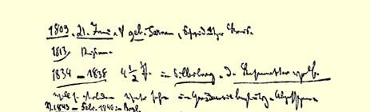
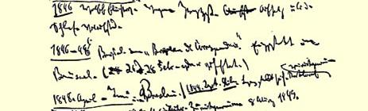
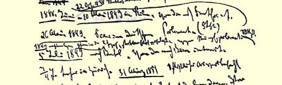
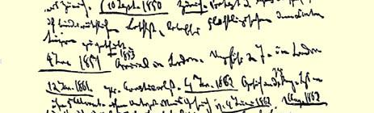

领高加索这两件事，我认为是１８１５年以来最严重的欧洲事件。帕姆和波拿巴现在可以说，他们并没有白白地进行统治，如果说什列斯维希—霍尔施坦战争３６０只是为了转移德国和法国对这些重大事件的注意，那末不管伦敦会议３７６的结局如何，这个战争对俄国人来说已经完全完成了它的任务。从李卜克内西的信中你可以看出，普鲁士自由派的报纸太怯懦了，甚至连普鲁士不断引渡波兰逃亡者这样的事实都不敢确认。俾斯麦用什列斯维希一霍尔施坦事件把他们的嘴完全堵住了。

美国的消息我觉得非常好；特别使我开心的是《**泰晤士报**》今天的社论，它要证明，格兰特总是挨打，而且由于他的失败，他可能会受到夺得里士满的“惩罚”。

祝好。

#### 你的摩尔

### ２２４

## 恩格斯致马克思

### 伦敦

> １８６４年６月９日于曼彻斯特

亲爱的摩尔：

电报收到了，随信附上五英镑银行券的后半截。银版相片[^1]我稍微擦了一下，现在我觉得它很好了；今晚将拿给龚佩尔特和他的夫人看。

李卜克内西住在柏林对我们来说自然有十分重要的意义，这

> 马克思１８６４年６月写的威廉·沃尔弗的简历３９１ 会使我们有可能把伊戚希[^2]打个措手不及，并且在适当的时机向工人说明我们对他所持的立场。我们无论如何必须让他留在那里， 并且给予他一些帮助。你要是现在给他寄钱去，这会使他感到很大鼓舞，如果你认为有必要再这样做，那就来信告诉我，我将托你转寄给他五英镑银行券。

关于哀悼鲁普斯的文章。我们应该写点传记一类的东西；我以为会许可把它用小册子的形式在德国印出来，并附上全部议会报告。３８９不要延误这件事情。

关于苏伊士运河现在的情况，波克罕报道了些什么？是否确实已经作出了一些成绩，可以指望很快峻工？

我很想知道，弗吉尼亚的战事将怎样发展。双方的力量似乎仍然接近平衡，但是如果发生一点小小的意外，如果南军能够单独地击败格兰特的某一个军，那末李就又可能占上风。里士满附近的战斗就会在完全另外一种条件下进行；因为巴特勒确实比博雷加德弱，否则他是不会让自己被迫采取守势的；而且即使双方势均力敌，李在里士满和博雷加德会合后仍然比格兰特和巴特勒会合后要强些；因为李从他的营垒可以用他的全部兵力向詹姆士河任何一岸出动，而格兰特必须分出一部分兵力（到河的南岸）。但是我希望，格兰特仍然能把他的事情干好。无论如何，这一点是确实的：在维耳德纳斯第一次会战３９０以后，李很少表现出有在开阔地进行决战的意图，相反地，他把他的主力经常留在筑垒阵地内，只敢进行一些短促的攻击战斗。我也喜欢格兰特的作战方法。对于这样的地形和这样的敌人，这是唯一正确的方法。

[^1]: 见本卷第４００页。—— 编者注

[^2]: 拉萨尔。—— 编者注