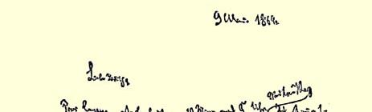
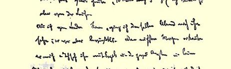
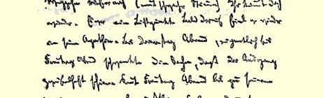
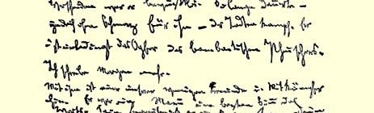
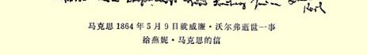

### １０１

## 马克思致燕妮·马克思

### 伦敦

> １８６４年５月９日［于曼彻斯特］

亲爱的燕妮：

可怜的鲁普斯今天下午五点十分去世了。我刚从死者那里回来。

从伦敦到达这里以后，当天晚上我就去看他，但是他当时昏迷不醒。第二天早晨，他认出了我。当时恩格斯和两位医生[^1]在场。 我们离开时，他（用微弱的声音）叫住我们说：“你们还来吗？”这是他神智清醒过来的时候。此后，他很快又陷入衰竭状态。到星期四晚上，甚至到星期五晚上，病情仍然不明朗，结局如何，很难判断。从星期五晚上起一直到死，他都昏迷不醒。与死亡的斗争拖了很久—— 诚然，这对他是没有痛苦的。他无疑是夸夸其谈的庸医[^2]的牺牲品。明天给你多写些。

我们为数不多的朋友和战友中的一个，就这样离开我们去了。 他是一个最完美的人。葬礼定于星期五举行。

#### 你的卡尔

> 马克思１８６４年５月９日就威廉·沃尔弗逝世一事
>
> 给燕妮·马克思的信

[^1]: 博尔夏特和龚佩尔特。—— 编者注

[^2]: 博尔夏特。—— 编者注