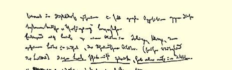
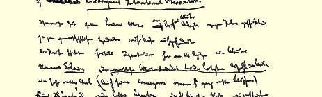
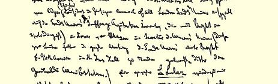
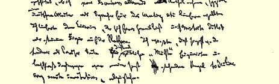

总之，他是十六年来我所见到的少数几个没有退步、反而有所进步的人当中的一个。我还同他谈论了关于乌尔卡尔特的揭发。 （顺便说一下，国际协会大概会造成我同这些朋友的决裂！１９）他很详细地问到你和鲁普斯[^1]。当我告诉他鲁普斯已去世的时候，他马上说，运动失去了一个不可缺少的人。

（４）**危机**。在大陆上它还远没有结束（特别是在法国）。此外， 现在危机经常发生，这就部分地弥补了它不够强烈这一缺陷。

祝好。

#### 你的卡·马·

### ４

## 恩格斯致马克思

### 伦敦

> １８６４年１１月７日于曼彻斯特

亲爱的摩尔：

你对于弗里西安文的解释，除了一个字以外，是完全对的。北弗里西安文Ｋｉｍｍａｎｇ的意思是：目光、眼睛。这些北弗里西安人的天性是思辨的，他们以**内部的**视野代替外部的视野，就象瓦盖纳现在需要“内部的杜佩尔”２０一样。这是一句古老的水手用语。

海尔维格和哈茨费尔特的作品寄还给你。你所说的后来拉萨尔对瓦拉几亚人[^2]提出的而且被恩玛隐瞒了的挑衅是什么呢？拉

[^1]: 威廉·沃尔弗。—— 编者注

[^2]: 腊科维茨。—— 编者注