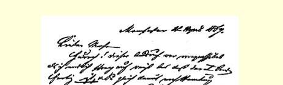
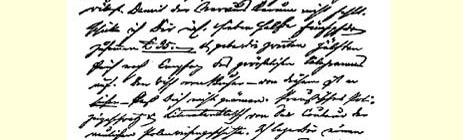
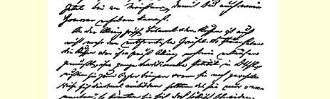
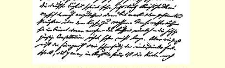

### １４９

## 马克思致恩格斯

### 曼彻斯特

> １８６７年４月２４日于汉诺威

亲爱的弗雷德：

我在库格曼医生这里作客已经有一星期了。为了印书[^1]的事情，我不得不留在汉堡或汉堡附近。情况就是这样。迈斯纳想在四五个星期里就把事情办妥，这就不能在汉堡印刷，因为汉堡印刷工人不够，校对员也缺少训练。因此他要送到奥托·维干德那里去印刷（更确切些说，是送到他的儿子[^2]那里去印刷，因为这只妄自尊大的老狗只是名义上参与营业而已）。一星期以前，他把手稿送到莱比锡去了。现在他希望我就**在他身边**，以便校对头两个印张，**同时确定一下**，**如果我亲自校对一遍**，**“能” 否**加快印刷。 要是那样，全部工作可望在四五个星期里告成。但是，那个时候复活节周却到了。小维干德写信给迈斯纳说，他只有在**本**星期末才能开始。鉴于这个情况，我便应库格曼的坚决邀请（从经济上考虑，这样也好些）到他这儿来度过这段时间。在谈到“此地的事情” 之前还要告诉你一件事情：迈斯纳希望你并且通过我请求你写一篇**对俄国的警告**，同时要友好地对待德国和法国。如果你同意写的话，他希望能快一点拿到。不过他宁愿你能**多**写一些，因为薄薄的小册子从出版观点讲是不大合算的。关于条件，你在寄

 的想法。他们公开表示自己的愿望——** 跟法国人走**。当人们向他们指出，这是不爱国的行为，他们就说：“普鲁士人所干的也是一样，他们经过这里的时候，军官们带头吹嘘法国的援助—— 如果必要的话。”韦纳的父亲在这里很受尊敬，也被认为是韦耳夫派３００。 昨天俾斯麦派了他的一名爪牙瓦尔内博耳德律师到我这儿来（**不要告诉别人**）。他希望“利用我和我的大才为德国人民谋福利”。冯 ·卞尼格先明天也要来访问我。

我们两个人在德国，尤其是在“有教养的”官场中的地位，跟我们所想象的完全不同。例如，本市统计局局长梅尔克耳访问我， 说他研究货币流通问题多年，但徒劳无功，而我却一下子就把问题彻底搞清楚了。他对我说：“不久以前，我在柏林的同事恩格尔当着王室的面对你的德奥古利—— 恩格斯—— 作了应有的赞扬。” 这些都是琐事，但是对于我们却是重要的。我们对于这些官员的影响比对庸人的影响要大些。

我被邀请加入“欧洲人”协会。在这里，人们这样称呼那些仇视普鲁士的北德意志民族联盟１５１盟员。蠢驴！

本地铁路管理局局长（如施梯伯所说的主脑３０１）也邀请我到他家作客。我去了，他有甘醇的葡萄酒和“热忱的夫人”，在离开的时候，他感谢我给与他的“无上的光荣”。

我必须向我们委员会[^3]的委员、“帝国保险公司”经理威勒尔先生偿还**十英镑**的名誉债款。如果你能以我的委托把钱寄给他，那我就十分感谢，他的地址是：（伦敦）“**东中央区**格雷沙姆街２７号**乔治·威勒尔**先生亲启”。我也很担心我在伦敦的家陷入极端困境。

[^1]: 《资本论》第一卷。—— 编者注

[^2]: 胡果·维干德。—— 编者注

[^3]: 国际工人协会总委员会。—— 编者注