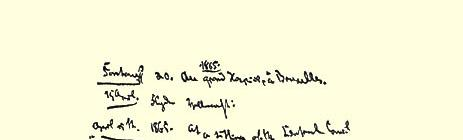
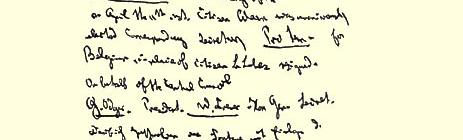
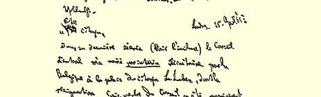
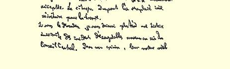

### ２７

## 马克思致莱昂·封丹４６５

### 布鲁塞尔

> **［草稿］**
>
> １８６５年４月１５日于伦敦

亲爱的公民：

在中央委员会最近一次会议上（见附件），我被任命为比利时 **临时**书记，以代替公民勒·吕贝，他辞去总委员会委员职务一事已被一致通过。由公民杜邦接替他担任法国书记。

如果您愿意，我以后可以简单地跟您谈谈中央委员会里存在的一些不愉快的事件。我认为，一切事情的真正的罪魁就是同我们总委员会作梗的那个自命为意大利爱国者的、但是又同无产阶级利益顽固敌对的人[^1]，而如果不保卫无产阶级的利益，共和主义就只不过是资产阶级专制主义的新形式。据他的最盲目的工具之一[^2]供认，难道他不是竟然要求从我们的**《宣言》**[^3]的意大利译文中删去所有敌视资产阶级的句子吗？

尽管有这些痛心的事件，尽管有些人多少是自愿地辞了职，我们的协会仍然在胜利地前进。它存在才几个月，仅仅在英国就已经有将近一万二千名会员。

倘蒙您把关于**我们协会目前在比利时的状况的正式报告**寄给我，中央委员会将十分感激。

> 马克思１８６５年４月１５日给封丹的信的草稿
>
> １８６４—１８６５年马克思的笔记本中的一页

[^1]: 马志尼。—— 编者注方塔纳。—— 编者注

[^2]: 

[^3]: 卡·马克思《国际工人协会成立宣言》。—— 编者注