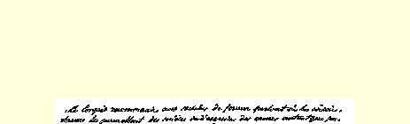
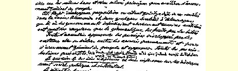
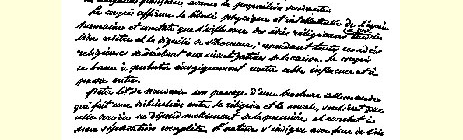
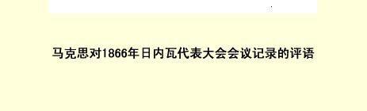

### ６２

## 马克思致路德维希·库格曼

### 汉诺威

> １８６６年１０月[^1]９日于伦敦
>
> 哈佛斯托克小山梅特兰公园路
>
> 莫丹那别墅１号

亲爱的朋友：

我希望我不必根据您长久不来信得出结论说，我的上一封信[^2]在某一点上得罪了您。事情恰好相反。一个人在处于绝望的境地时，有时是会感到有必要向人倾吐胸怀的。但是他只是对他特别信任的人才会这样做。我对您说实话，我日常生活中的一些麻烦事所以使我感到恼火，主要是因为这些事情妨碍我去最后完成我的著作[^3]，而不是由于任何个人的或家庭的原因。如果明天我愿意去找一个有收入的职业，而不为我们的事业工作的话，那末明天我就能结束这种状况。我也希望您不要因为无法帮助我解决这种困难而烦恼。这是一个完全不成理由的理由。

现在来谈谈某些一般的情况。

我曾经很为第一次日内瓦代表大会２７０担心。可是从整个情况看，结果比我预期的来得好。在法国、英国和美国的影响是出乎意料的。我不能够，也不愿意到那里去，但是给伦敦代表拟定了一

> 马克思对１８６６年日内瓦代表大会会议记录的评语个纲领[^4]。我故意把纲领局限于这样几点，这几点使工人能够直接达成协议和采取共同行动，而对阶级斗争和把工人组织成为阶级的需要则给以直接的滋养和推动。巴黎的先生们满脑袋都是蒲鲁东的空洞词句。他们高谈科学，但什么也不懂。他们轻视一切**革命的**、即产生于阶级斗争本身的行动，轻视一切集中的、社会的、因而也是可以通过**政治手段**（例如，**从法律上**缩短工作日）来实现的运动；在**自由**和反政府主义或反权威的个人主义的**幌子**下，这些先生们—— 他们十六年来一直泰然自若地忍受并且现在还忍受着最可耻的专制制度！—— 实际上在宣扬庸俗的资产阶级的生意经，只不过按蒲鲁东的精神把它理想化了！蒲鲁东造成了很大的祸害。受到他对空想主义者的假批判和假对立的迷惑和毒害的（他自己只是一个小资产阶级空想主义者，而在傅立叶、欧文等人的乌托邦里却有对新世界的预测和幻想的描述），首先是“优秀的青年”、大学生，其次是工人，尤其是从事奢侈品生产的巴黎工人，他们不自觉地强烈地倾向于这堆陈腐的垃圾。愚昧、虚荣、傲慢、饶舌、唱高调， 他们几乎把一切都败坏了，因为他们出席大会的人数同他们的会员人数是根本不相称的。在报告中我将要不指名地谴责他们几句。

同时在巴尔的摩召开的美国工人代表大会使我感到很高兴。 那里的口号是组织起来对资本作斗争，而且令人惊讶的是，在那里，我为日内瓦提出的大部分要求由于工人的正确本能也同样被提出来了。４９４

由我们中央委员会在这里掀起（此事我有大功[^5]）的改革运

[^1]: 原稿为：“１１月”。—— 编者注见本卷第５２２—５２３页。—— 编者注

[^2]: 

[^3]: 《资本论》。—— 编者注

[^4]: 卡·马克思《临时中央委员会就若干问题给代表的指示》。—— 编者注

[^5]: 味吉尔《亚尼雅士之歌》第２卷。—— 编者注