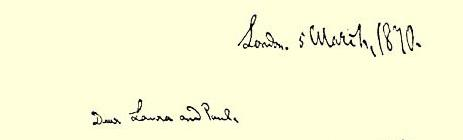
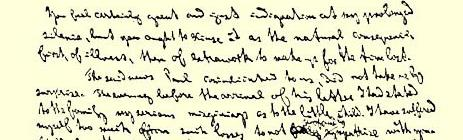
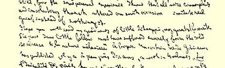
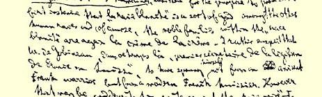
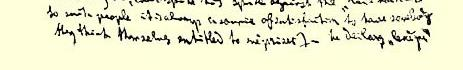

入俾斯麦手中[^1]。）我根本不读所有这些东西，更少和什么个人有来往。据我所知，库尔黑森人[^2]住在伦敦郊区某地，并且又当了 “丈夫”。因为你……[^3]

### ６７

## 马克思致劳拉·拉法格和保尔·拉法格

### 巴黎

> １８７０年３月５日于伦敦

亲爱的劳拉和保尔：

你们一定对我长期不写信很不满意，这是完全应该的，但是你们应当原谅我，首先是因为生病，其次是我需要用加倍的工作来补偿失去的时间。

保尔通知我们的可悲消息，我并不感到意外。[^4]在收到他来信的前一天晚上，我向家里人说，我很为小孩担心。我自己为这种损失忍受的痛苦够多了，因此我深深同情你们。但是，我根据亲身的体验也知道，在这种情况下，一切好听的老生常谈和宽慰话只能加重真正的痛苦，而不会减轻它。

我希望得到你们关于小施纳普斯[^5]、我最宠爱的宝贝的好消息。这个可怜又可爱的小家伙可能冻得够厉害的，因为寒冷对“黑

> 马克思１８７０年３月５日给劳拉·拉法格和
>
> 保尔·拉法格的信的第一页肤色血统的人”５４７是非常有害的。顺便提一下，有一个叫德·戈宾诺的先生，大约十年前发表过一部四卷本的著作：《**论人种的不平等**》，他写这本书首先是要证明，“白种人”仿佛是其余的人的上帝， 而“白种人”中的“高贵”家庭则自然是这些上帝的选民中的精华之精华。我认为完全有可能，当时任“法国驻瑞士外交使团一等秘书”的戈宾诺先生不是某个古代法兰克军人的后裔，而是一个现代法国看门人的后裔。不管怎么样，他尽管仇视“黑种人”（对这样的人来说，认为自己有权鄙视别人始终是他们得到满足的源泉），却宣布“黑人”或“黑色血统”是艺术的物质来源，而“白色民族”的一切艺术作品都取决于这些民族同“黑色血统”的混合。

我亲爱的前任秘书[^6]的最近一封来信使我非常高兴，保尔关于在穆瓦兰家里开会情况的描述也使人非常开心５４８。

这个“未经公认的大人物” 看来终究找到了“沽名钓誉” 的诀窍。以往每当他快要捞到名誉的时候，名誉就狡猾地从他的手中滑掉了。他发现，为了征服世界，只要用自己的四堵墙把这个世界围起来就行了，在这个围墙内他可以自封为总统，可以拥有一批用师长的语言[^7]发誓的听众。

这里家中情况你们非常清楚，芬尼亚社社员占绝对统治地位。 杜西是他们的“首脑”５４９之一。燕妮代表他们用燕·威廉斯的笔名给《**马赛曲报**》写文章。我不仅就这个题目在布鲁塞尔《**国际报**》上发表了文章[^8]，而且在总委员会内争取到通过了一项反对他们的狱吏的决议３３８。在总委员会给我们在各个国家的委员会的通告信中，我阐述了爱尔兰问题的意义[^9]。

你们当然了解，我不仅仅是从人道出发的。除此以外还有其他一些原因。为了加速欧洲的社会发展，必须加速官方英国的崩溃。为此就必须在爱尔兰对它进行打击。这是它的最薄弱的环节。 爱尔兰丧失了，不列颠“帝国” 也就完蛋了，这样至今一直处于昏睡缓滞状态中的英国阶级斗争，将会激烈起来。要知道，英国是全世界大地主所有制和资本主义的大本营。

听到布朗基的什么消息没有？他是否在巴黎？

你们没有听到我的翻译凯先生[^10]的任何消息吗？我依然处于困境。

弗列罗夫斯基的书《俄国工人阶级的状况》是一部卓越的著作。我很高兴，现在能够查着字典相当快地阅读它。这本书里第一次充分地描述了俄国的经济状况。这是一部非常认真的著作。作者在十五年中周游全国，从西部边境到西伯利亚东部，从白海到里海，唯一目的是研究事实，揭露传统的谎言。当然，他对俄罗斯民族的“无限完善的能力” 和俄国形式的**公社所有制**的天意性质还抱有一些幻想。但这不是主要的。在研究了他的著作之后可以深信，波澜壮阔的社会革命在俄国是不可避免的，并在日益临近，自然是具有同俄国当前发展水平相应的初级形式。这是好消息。俄国和英国是现代欧洲体系的两大支柱。其余一切国家，甚至包括美丽的法国和有教养的德国在内，都只具有次要意义。

恩格斯打算离开曼彻斯特，于今年８月初定居伦敦。这对我将是很大的幸福。

[^1]: 见本卷第２８７页。—— 编者注

[^2]: 比斯康普。—— 编者注

[^3]: 信的结尾部分残缺。—— 编者注

[^4]: 见本卷第４３９页。—— 编者注

[^5]: 沙尔·埃蒂耶纳·拉法格。—— 编者注

[^6]: 劳拉·拉法格。—— 编者注

[^7]: 贺雷西《书信集》第１册第１封信。—— 编者注

[^8]: 卡·马克思《英国政府和被囚禁的芬尼亚社社员》。—— 编者注

[^9]: 卡·马克思《总委员会致瑞士罗曼语区联合会委员会》第五点。—— 编者注

[^10]: 凯累尔（见本卷第６２２—６２３页）。—— 编者注