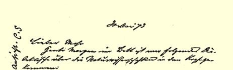
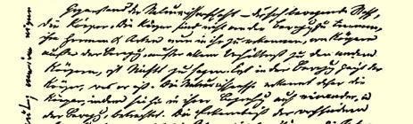
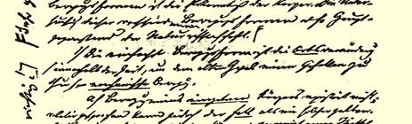
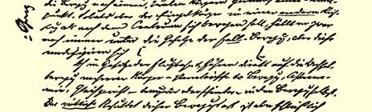
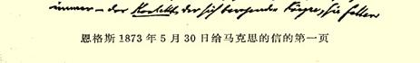

得适合于实行波拿巴式的政变。那时，一切都将取决于军队，而麦克马洪，不管他过去怎样，无疑会尽一切努力，而且会很熟练地为此目的而对军队严加训练。如今，梯也尔变得比任何时候都更受欢迎，而甘必大重新退居次要地位，所以，一旦再发生风暴， 那末，从梯也尔到费里克斯·皮阿就会被列入重新使自己声誉扫地的人的行列。

使我特别高兴的是，麦克马洪再一次向梯也尔证明，这些正直的**武夫**恰恰是多么恶劣的坏蛋。

问候穆尔和肖莱马。

#### 你的弗·恩·

### ３９

## 恩格斯致马克思８９

### 曼彻斯特

> １８７３年５月３０日［于伦敦］

亲爱的摩尔：

今天早晨躺在床上，我脑子里出现了下面这些关于自然科学的辩证思想。

自然科学的对象是运动着的物质，物体。物体和运动是不可分的，各种物体的形式和种类只有在运动中才能认识，离开运动， 离开同其他物体的一切关系，就谈不到物体。物体只有在运动中才显示出它是什么。因此，自然科学只有在物体的相互关系中，在运动中观察物体，才能认识物体。对运动的各种形式的认识，就是对物体的认识。所以，对这些不同的运动形式的探讨，就是自然科

> 恩格斯１８７３年５月３０日给马克思的信的第一页学的主要对象。[^1]

１．最简单的运动形式是**位置**移动（是在时间之中的—— 为了使老黑格尔高兴）——** 机械**运动。

（ａ）**单个**物体的运动是不存在的；但是相对地说，可以把**下落** 看做这样的运动。向着许多物体所共有的一个中心点运动。但是， 只要单个物体不是向着中心而是向着**另外的**一个方向运动，那末虽然它还是受**落体**定律的支配，但是这些定律已经变化成为[^2]

（ｂ）抛物线定律并直接导致几个物体的相互运动—— 行星等等的运动，天文学，平衡—— 在运动本身中的暂时的或外表上的平衡。但是，这种运动的**真正**结果最终总是运动着的诸物体的**接触**，一些物体落到另一些物体上面。

（ｃ）接触的力学—— 相互接触的物体。普通力学，杠杆、斜面等等。但是**接触的作用并不仅限于此**。接触直接表现为两种形式：摩擦和碰撞。二者都具有这样一种特性：在一定的强度和一定的条件下产生**新的**、不再仅仅是力学的作用，即产生**热**、**光**、 **电**、**磁**。

２．**本义上的物理学**—— 研究这些运动形式的科学，它逐一研究了每种运动形式之后确认，在一定的条件下这些运动形式**互相转化**；并且最后发现，所有这些运动形式在一定的强度（因运动着的物体而异）下就产生超出物理学范围的作用，即物体内部构造的变化——** 化学**作用。

３．**化学**。对于研究上述运动形式来说，无论它研究的是有生

[^1]: 卡·肖莱马在这段的页边上写着：“很好，这也是我个人的意见。—— 卡·肖·”。—— 编者注

[^2]: 卡·肖莱马在这段的页边上写着：“完全正确！”—— 编者注