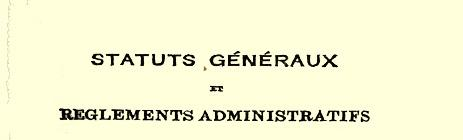
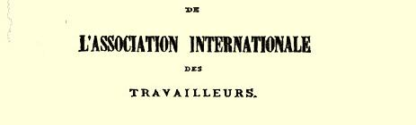
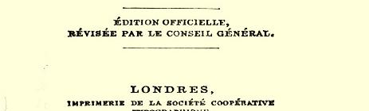
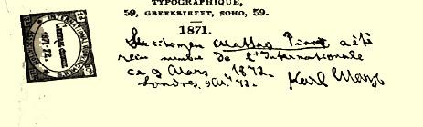

我们将在日内瓦出版一本篇幅同《内战》差不多的反对分裂主义者的小册子[^1]。在此期间，他们却竭力使尖锐的论战缓和下来，在他们最近发表的通告里已有所收敛４３４。

匆匆草此。

#### 您的卡·马克思

### １６８

## 马克思致艾米尔·埃德

### 伦敦

> １８７２年３月９日［于伦敦］

亲爱的埃德：

在您还没有把自己的家具从住宅里搬出时，什么也别对您的房东讲。否则他会把家具扣押下来，给您造成种种麻烦。

#### 您的卡尔·马克思

### １６９

## 恩格斯致保尔·拉法格

### 马德里

> １８７２年３月１１日于伦敦

亲爱的拉法格：

如果您愿意把您的事情委托给我，我是乐于接受的。您只须

> 一份国际工人协会共同章程的扉页
>
> 上面有马克思的题字：公民马提奥·皮罗
>
> 于１８７２年３月９日被接受为国际会员。
>
> 卡尔·马克思１８７２年３月９日于伦敦写信给您的代理人，要他把您将交给我一并保存的股票和债券按我的地址—— 瑞琴特公园路１２２号—— 用***保价*信**寄给**我**就行了。 至于息票、股息和利息，在我没有查看票据之前，无法向您说什么，不过，处理这些事情是毫无困难的。至于现金，我想您最好用**汇票**寄到马德里，存到当地的银行家那里，在当地不会找不到可以接受这一委托的人。不过，如果您愿意把这笔款子也交给我， 那就请您**明确**指出，把这笔款子换成**由我*在伦敦*提取的期票**（或支票），也用保价信寄来。无论是哪种情况，期票一定要**短期**的。 或者您把这笔款子分开，吩咐您的代理人把一部分寄往马德里，另一部分寄给我。您看怎么合适就怎么办。无论如何，寄期票比寄银行券要方便得多。用这两种办法都会丢失，不过用期票丢失的可能性要小些；再说，万一被盗窃，银行券是丢定了的，但窃贼要把期票兑现就有困难，在这种情况下，可以通知停付。

即使是保价信，从一个国家寄到另一个国家，总要冒一定的风险，但我不知道有什么别的办法能把您的股票等等弄到我这里来。最近我们多次使用保价信，因为我们的信件不寄保价就往往收不到，而到目前为止，我们的保价信却一封不差地都收到了。

我曾从这里寄给您不少报纸，如**２月１４日**寄去《东邮报》、《人民国家报》、苏黎世《哨兵报》和纽约《社会主义者报》的四份剪报。

**２月２１日**寄去《东邮报》、《社会主义者报》和章程的法文本 （是给《解放报》的）。

明天我将寄给您两号《东邮报》。遗憾的是，两个老太太的通信地址是**我们仅有**的两个地址，能再有一个寄信和寄报纸的地址 **十分重要**，因为原来的地址肯定会引起怀疑。

我很明白，我们在那里的朋友们处理问题确实比他们在报上所表现出来的要实际得多，我也完全清楚这是什么原因。例如，我完全相信，当他们要求在发生重大事件之后立即把土地和劳动工具交给应该拥有这些东西的人时，他们十分清楚，这是办不到的， 但是为了表示其一贯的主张，他们不得不提出这种要求。我们应该充分考虑到他们的处境。巴枯宁主义这堆垃圾不可能在一天内清除掉，但清除工作终于认真地开始了，这就很不错。

您大概已从最近的汝拉通告里看出，那个荒唐可笑的运动是怎样以彻底失败而告终的４３４。不过，总委员会的答复通告[^2]正在印刷，您还可以让我们在当地的朋友思想上有所准备，我们对这伙人是很不客气的，我们要把我们知道的有关他们的全部事实—— 这些事太卑鄙了—— 向协会宣布。我们现在必须彻底粉碎这个宗派。最近几个月来，我和摩尔把时间完全花在这些事情上了，再不能这样下去了。昨天，我才把这本驳斥他们的谬论的写了满满十二页的小册子寄到那不勒斯去。在那不勒斯，他们**所有的人**都是巴枯宁分子，其中只有卡菲埃罗一人至少是善意的，我和他在通信。

关于其他事情，我将给您夫人[^3]写信。

我的妻子向你们俩问好。

#### 忠实于您的将军[^4]

[^1]: 卡·马克思和弗·恩格斯《所谓国际内部的分裂》。—— 编者注

[^2]: 卡·马克思和弗·恩格斯《所谓国际内部的分裂》。—— 编者注劳拉·拉法格。—— 编者注

[^3]: 

[^4]: 恩格斯的绰号。—— 编者注