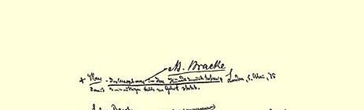
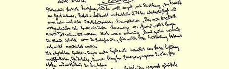
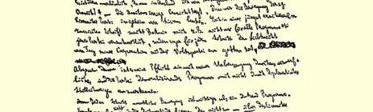
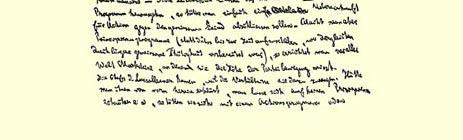

比哥特弗利德更为可取。如果您愿意采纳这个方案的话，亨利希 ·欧门立即会到您那里去，您就可以更进一步地了解这个人，并且更确切地向他了解他的计划的细节。

一句话，请您考虑这件事并把您的决定尽快告诉我；看来，亨利希不可能拖延很长时间不对哥特弗利德做出最后决定。

衷心问候玛蒂尔达[^1]、孩子们和你自己。

#### 你的弗里德里希

莱茵的恩格斯们真可恶透了：我是因为相信那许许多多答应迅速付款的保证，才办理了各种业务，而现在却弄得进退两难。

### １０

## 马克思致威廉·白拉克２１８

### 不伦瑞克

> １８７５年５月５日于伦敦

亲爱的白拉克：

对合并纲领的下列批评意见，请您阅后转交盖布和奥艾尔、倍倍尔和李卜克内西过目。[^2]我工作太忙，已经不得不远远超过医生给我规定的工作时间。所以，写这么多张纸，对我来说决不是一种“享受”。但是，为了使党内的朋友们—— 而这些意见就是为他们写的—— 以后不致误解我这方面不得不采取的步骤，这是必要的。这里指的是，在合并大会以后，恩格斯和我将要发表的一个简短的声明，声明的内容是：我们和上述原则性纲领毫不相干，我们和它毫无共同之点。

这样做是必要的，因为在国外有一种为党的敌人所热心支持的见解—— 一种完全荒谬的见解，仿佛我们在这里秘密地领导所谓爱森纳赫党的运动。例如巴枯宁还在他新近出版的一本俄文著作２１５里要我不仅为这个党的所有纲领等等负责，甚至要为李卜克内西自从和人民党２０８合作以来所采取的每一个步骤负责。

此外，我的义务也不容许我即使只用外交式的沉默方法来承认一个我认为极其糟糕的、会使党堕落的纲领。

一步实际运动比一打纲领更重要。所以，既然不可能—— 而局势也不容许这样做——** 超过**爱森纳赫纲领２０７，那就干脆缔结一个反对共同敌人的行动协定好了。但是，制定一个原则性纲领 （应该是把这件事情推迟到由较长时间的共同工作准备好了的时候再做），这就是在全世界面前树立起一些可供人们用以判定党的运动水平的界碑。

拉萨尔派的领袖们之所以跑来靠拢我们，是因为他们为形势所迫。如果一开始就向他们声明决不会拿原则来做交易，那末他们就**只好**满足于一个行动纲领或共同行动的组织计划了。可是并没有这样做，反而允许他们拿着委托书来出席，并且自己承认他们的这种委托书是有约束力的，就是说，向那些本身需要援助的人们无条件投降。２１９不仅如此，他们甚至**在召开妥协的代表大会以前**就召开代表大会，而自己的党却只是在**事后**才召开自己的代表大会。２２０ 人们显然是想杜绝一切批评，不让自己的党有一个深思的机会。大家知道，合并这一事实本身是使工人感到满意的；但是，如果有人

> 马克思１８７５年５月５日给白拉克的信的第一页

[^1]: 玛·恩格斯。—— 编者注

[^2]: 信的开头注明：“注意。信稿必须退回到您手中，以便在必要时我可以使用它。”—— 编者注