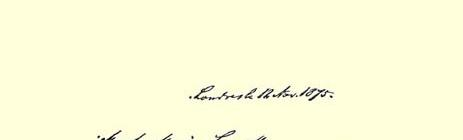
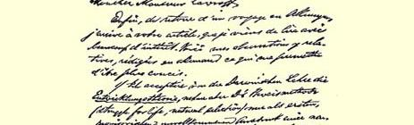
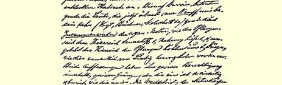
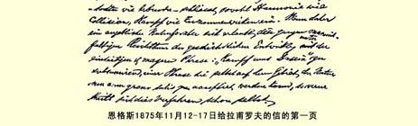

（２）《行动中的巴枯宁主义者》；

（３）《论俄国的社会问题》（包裹纸上有未收入小册子的第一篇文章的版样）２４８；

（４）《德国农民战争》；

（５）《萨瓦、尼斯与莱茵》（１８６０年），是我写的；

（６）《共产党宣言》，是马克思和我写的；

（７）《揭露科伦共产党人案件》，是马克思写的（１８５１年）２４９。

希望这些都能寄到。

再一次致衷心的问候。

#### 您的弗·恩格斯

### ３０

## 恩格斯致鲁道夫·恩格斯

### 巴门

> １８７５年１１月９日于伦敦

亲爱的鲁道夫：

可惜保尔[^1]从旅行中毫无收获，也许到明年能够好些。

上星期六我同妻子从海得尔堡回来了，我们去那里是送我们的小女孩[^2]去上一年寄宿中等学校。２４７在回来的路上，我们在“大旅馆” 喝了上等的上英格耳海姆酒；我当时就订购了几瓶，现在请你劳驾代我付给科伦“大旅馆” 泰奥多尔·梅茨先生**三十五塔勒**＝一百零五马克，这笔钱记在我的账上。

科伦是一座怪事之城。举例来说，在大教堂和中央车站之间的路上，我碰到一位先生，他的样子和海尔曼[^3]一模一样。不过他的身材略为高些，白胡须多些，紧绷着脸儿。我本想等他的面孔一换成另外一种表情，就上去拥抱他，可惜白等。这件怪事发生在上星期五早上十点到十一点之间。

代我向玛蒂尔达[^4]和孩子们衷心问好。

#### 你的弗里德里希

> 恩格斯１８７５年１１月１２—１７日给拉甫罗夫的信的第一页

[^1]: 保·恩格斯。—— 编者注

[^2]: 玛丽·艾伦·白恩士。—— 编者注

[^3]: 海·恩格斯。—— 编者注

[^4]: 玛·恩格斯。—— 编者注