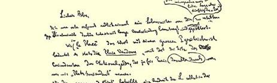
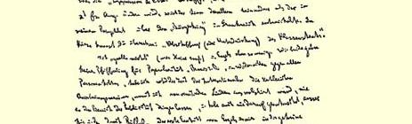
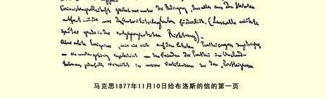

### １２５

## 马克思致威廉·布洛斯

### 汉堡

> １８７７年１１月１０日于伦敦
>
> 西北区梅特兰公园路４１号

亲爱的布洛斯：

我很高兴，你（这个“你” 字是自然而然地从我笔下滑出来的，那末，今后就不用再称“您” 了）终于有了信息。至于令人讨厌的伊佐尔德[^1]，我早就坚决主张辞退她，而且为此叫嚷过，但是毫无用处。

《ｌａ Ｐｌａｃｅ》一词凡是用大写字母起头的都是指 Ｐｌａｃｅ Ｖｅｎ －ｄｏｍｅ[^2]，因为那里曾经是国民自卫军司令（当时在巴黎相当于我们现在所说的“卫戍司令”）的官邸所在地。

至于《ｓｕｐｐｒｅｓｓｉｏｎ ｄｅ ｌＥｔａｔ》[^3]这一说法（利沙加勒本人在法文第二版[^4]中将予以修改），其含义同我的小册子《法兰西内战》中所发挥的完全一样。３５４你可以简单地译为：“废除（或消灭） 阶级国家”。

我“不生气”（正如海涅所说的）[^5]，恩格斯也一样。３５５我们两

> 马克思１８７７年１１月１０日给布洛斯的信的第一页人都把声望看得一钱不值。举一个例子就可证明：由于厌恶一切个人迷信，在国际存在的时候，我从来都不让公布那许许多多来自各国的、使我厌烦的歌功颂德的东西；我甚至从来也不予答复， 偶尔答复，也只是加以斥责。恩格斯和我最初参加共产主义者秘密团体[^6]时的必要条件是：摒弃章程３５６中一切助长迷信权威的东西。（后来，拉萨尔的所做所为却恰恰相反）。

但是，最近一次党的代表大会上所发生的那类事件９２，—— 它们一定会被党在国外的敌人充分利用—— 毕竟使我们要小心对待“德国的党内同志”。

我的健康状况迫使我把医生给我限定的工作时间全都用于完成我的著作[^7]；恩格斯现在正忙于写几部篇幅较大的著作，同时仍在继续为《前进报》写文章[^8]。

关于我“和贝克斯神父的配合”３５７，我想了解得更详细一些，我觉得这很有趣。

恩格斯日内将给你写信。

我的妻子和女儿爱琳娜向你衷心问好。

#### 完全属于你的卡尔·马克思

[^1]: 伊·库尔茨。—— 编者注旺多姆广场。—— 编者注

[^2]: “废除国家”。—— 编者注

[^3]: 普·利沙加勒《一八七一年公社史》。—— 编者注

[^4]: 

[^5]: 海涅的诗集《抒情间奏曲》第１８首。—— 编者注

[^6]: 共产主义者同盟。—— 编者注卡·马克思《资本论》。—— 编者注

[^7]: 

[^8]: 弗·恩格斯《反杜林论》第三编。—— 编者注