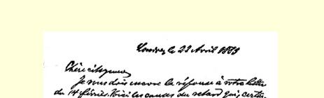
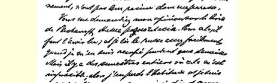
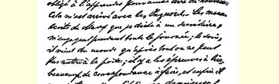
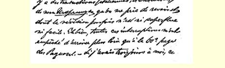

### １６２

## 致维拉·伊万诺夫娜·查苏利奇

### 日内瓦

> １８８５年４月２３日于伦敦

亲爱的女公民：

我还没有答复您２月１４日的来信。担搁当然不是由于我懒， 而是由于如下原因：

您征求我对普列汉诺夫的《我们的意见分歧》一书的意见。为此我得把书看一遍。如果我有一个星期对俄语下一点功夫，我读起来就会相当容易，可是我往往一连半年都找不到这样的机会；于是语言就生疏了，我不得不重新学习。看《意见分歧》一书的情况就是这样。我向秘书[^1]口授马克思的手稿，要占去我整个白天的时间；晚上有客人来，总不能把他们拒之于门外；还要看校样，写大量的信，最后，还有我的《起源》[^2]的译文（意大利文的、丹麦文的等等）要我校阅；而校订译文有时决不是一件多余的和轻而易举的工作。由于这种种打扰，《意见分歧》我只看了六十页。假如我能有三天空闲时间，这件事也就做完了，而且我还可以温习一下我的俄语。

但是，我想，这本书就我所看过的这么一点也足以使我多少知道所谈的[^3]意见分歧了。

首先，我再对您说一遍，我感到自豪的是，在俄国青年中有一派真诚地、无保留地接受了马克思的伟大的经济理论和历史理论，并坚决地同他们前辈的一切无政府主义的和带有一点斯拉夫主义的传统决裂。如果马克思能够多活几年，那他本人也同样会以此自豪的。这是一个对俄国革命运动发展具有重大意义的进步。 在我看来，马克思的历史理论是任何**坚定不移**和**始终一贯的**革命策略的基本条件；为了找到这种策略，需要的只是把这一理论应用于本国的经济条件和政治条件。

但是，要做到这一点，就必须了解这些条件；至于我，对俄国现状知道得太少，不能冒昧地对那里在某一时期所应采取的策略的细节作出判断。此外，对俄国革命派内部的秘密的事情，特别是近几年的事情，我几乎一无所知。我在民意党人中的朋友从来没有对我谈过这类事情。而这是得出肯定意见的必不可少的条件。

我所知道的或者我自以为知道的俄国情况，使我产生如下的想法：这个国家正在接近它的１７８９年。革命**一定**会在某一时刻爆发；它每天都**可能**爆发。在这种情况下，这个国家就象一颗装上炸药的地雷，所差的就是点导火线了。从３月１３日２９７以来更是如此。 这是一种例外情况，在这种情况下，很少几个人就能**制造出**一场革命来，换句话说，只要轻轻一撞就能使处于极不稳定的平衡状态 （用普列汉诺夫的比喻来说）２９８的整个制度倒塌，只要采取一个本身是无足轻重的行动，就能迸发出一种后来无法控制的爆炸力。如果说布朗基主义的幻想（通过小小的密谋活动震撼整个社会）曾经有某种理由的话，那这肯定是在彼得堡[^4]。只要火药一点着，只要力量一迸发出来，只要人民的能量由位能变为动能（仍然是普列汉诺夫爱用的、而且用得很妙的比喻）２９９，那末，点燃导火线的人们就会被炸得粉身碎骨，因为这种爆炸力将比他们强一千倍，它将以经济力和经济阻力为转移尽可能给自己寻找出路。

假定这些人设想能够抓到政权，那有什么关系呢？如果他们凿穿堤坝引起决堤，那急流本身很快就会把他们的幻想冲得一干二净。但即使这种幻想偶然赋予他们更大的意志力，这有什么值得抱怨的呢？那些自夸**制造出**革命的人，在革命的第二天总是看到，他们不知道他们做的是什么，**制造出的**革命根本不象他们原来打算的那个样子。这就是黑格尔所说的历史的讽刺３００，免遭这种讽刺的历史活动家为数甚少。您不妨看看违反自己意志的革命者俾斯麦，看看到头来竟同自己所崇拜的沙皇[^5]闹得不可开交的格莱斯顿。

据我看来，最重要的是：在俄国能有一种推动力，能爆发革命。 至于是这一派还是那一派发出信号，是在这面旗帜下还是那面旗帜下发生，我认为是无关紧要的。如果这是[^6]一场宫廷阴谋，那它在第二天就会被一扫而光。在这个国家里，形势这样紧张，革命的因素积累到这样的程度，广大人民群众的经济状况日益变得无法忍受，社会发展的各个阶段—— 从原始公社到现代大工业和金融寡头—— 都存在，所有这一切矛盾都被无与伦比的专制制度用强力压制着，这种专制制度日益使那些体现了民族智慧和民族尊严的青年们忍无可忍了，—— 在这样的国家里，如果１７８９年一开始，

> 恩格斯１８８５年４月２３日给查苏利奇的信的第一页

[^1]: 艾森加尔滕。—— 编者注弗·恩格斯《家庭、私有制和国家的起源》。—— 编者注

[^2]: 

[^3]: 草稿中这里删去了：“你们这一派和民意党人之间的”。—— 编者注

[^4]: 草稿中这里删去了：“我不说是在俄国，因为在远离行政中心的省份，这样的打击是无法进行的。”—— 编者注

[^5]: 亚历山大三世。—— 编者注

[^6]: 草稿中这里删去了：“贵族集团或交易所集团，—— 好吧，祝你成功！—— 一直到”。—— 编者注