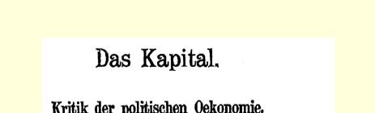
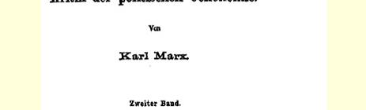
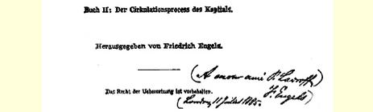
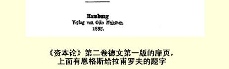

我自己在颇大程度上也是瞎摸的。只要《资本论》第三册没有口授完，白天我得从十点工作到五点，而晚上，除了接待客人，我还要答复日益增加的许许多多的来信，而且还要通读口授稿，校订我们的著作的法译文、意大利译文、丹麦译文和英译文（包括 《资本论》的英译文），我真不知道到哪里去找时间再来做其他工作。所以，您应注意到，我只能做最迫切的工作。

除了上述那一个版本的《共产党人案件》以外，请寄给我：

三本马克思的小册子《雇佣劳动与资本》；

六本苏黎世版的《共产党宣言》，这些书的费用请记在我的账上。同时希望能抄给我一份账单，好知道账目情况。两种尺寸的马克思的照片，这里还有一些。

附去的信请转交爱德。

致友好的问候。

#### 您的弗·恩格斯

### １７７

## 致奥古斯特·倍倍尔

### 德勒斯顿—普劳恩

> １８８５年６月２２—２４日于伦敦
>
> 西北区瑞琴特公园路１２２号

亲爱的倍倍尔：

你１９日的来信，今天早晨收到，现在立即回信，以便在你动身远行之前能够收到。

对于最近的事件，至少对于公开的言论，大体上我是知道的， 因此，我也阅读了盖泽尔和弗罗梅的种种喋喋不休的言论以及你的简短而令人信服的回答。３３２

所以会出现这一切乌七八糟的东西，我们大部分要归功于李卜克内西，他总是偏袒那些有教养的自命不凡的人和在资产阶级圈子里占有一定地位的人，因为可以拿这些人物在庸人面前炫耀。 对于那些向社会主义献媚的文人和商人，他顶不住。但正是在德国，这是一些最危险的人物，所以马克思和我从１８４５年起就不断地同他们进行斗争。这些人既然进入党内，在党内到处钻营，那就应当不断地排挤他们，因为他们的小资产阶级观点，往往同无产阶级群众的观点不一致，或者他们企图歪曲这些观点。然而，我确信在真正决定性的关头，李卜克内西将会站在我们这一边，并且还会肯定地说：他一直是这么说的，是我们早先妨碍了他投入战斗。不过，他得到一个小小的教训倒是好事。

分裂无疑要发生，但我仍然主张，在实行反社会党人法２３的条件下，我们不应挑起分裂。如果有人把分裂强加于我们，那也毫无办法；对此应当事先作好准备，而且依我看，我们无论如何必须保住三个阵地：（１）苏黎世的印刷所和出版社；（２）《社会民主党人报》 编辑部；（３）《新时代》编辑部。这是现在我们还掌握在自己手中的仅有的一些阵地，为了同党保持联系，即使在反社会党人法的条件下，有了这些阵地也就足够了。所有其他的报刊阵地，都被小市民先生们占去了，但是它们远远抵不上我们这三个阵地。你对许多反对我们的计划最好能加以阻止，并且我认为，你得尽一切努力，无论如何要保证我们掌握住这三个阵地。至于怎么做到这一点，你比我知道得更清楚。爱德和考茨基在自己的编辑岗位上显然感到极没有信心，需要加以鼓励。有人竭力耍阴谋反对他

> 《资本论》第二卷德文第一版的扉页，
>
> 上面有恩格斯给拉甫罗夫的题字们两个人，这是显而易见的。他们二人都是很正派和有用的人。爱德在理论上思路开阔，而且敏锐机智。他就是缺乏自信心，这在今天真是少有的现象。在甚至微不足道的笨蛋学者都普遍具有夸大狂的时候，在一定意义上说，这还是个优点。考茨基在几个大学里，什么乱七八糟的东西都学过，但他正在竭力设法把它们忘掉。他们二人都经得住坦率的批评，正确领会最主要的东西，值得信赖。和那种粘在党身上的糟糕透顶的青年文人相比，这两个人倒是真珠子。

你对我们整个国会议员的看法，以及关于在目前这样的和平时期不可能建立真正无产阶级的议会代表团的看法，我是完全同意的。那些必然或多或少是资产阶级的议员，也是一种避免不了的祸害，就象党从那些遭到资产阶级排斥而失业的工人中不得不接受下来的职业鼓动家一样。后面这种情况在１８３９—１８４８年在宪章派中间就很普遍，当时我就有机会注意到了。如果实行议员薪金制，那末这样的工人就会同占优势的资产阶级议员和小资产阶级议员，即“有教养的”议员同流合污。不过这一切都会克服的。 我对我国无产阶级绝对信任，就象我对一切堕落的德国小市民极不信任一样。一旦更为活跃的时刻到来，那时，斗争就会尖锐化， 可以把斗争全力进行下去；那时，为一些琐事和市侩行为而产生的苦恼，就会在大规模的斗争中消失，而这些琐事和市侩行为你现在还得天天与之作斗争，我凭老经验对这些东西也是很熟悉的； 那时，我们在国会里就会有真正的人了。诚然，我在这里发发议论是容易的，可是你得应付这一切令人厌恶的麻烦事，这确实不是开玩笑。不管怎样，我很高兴，你现在又感到自己的身体不错。 为了更美好的时刻，珍惜自己的神经吧，这对于我们还是有用的。