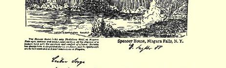
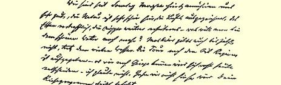
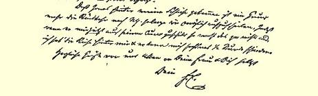

我想是不去。如果不去，那就会准确地执行你订的旅行计划。

至于说约纳斯识破了我的诡计，那又是一条理由，更可以尽量推迟回纽约的时间了。其实，他要是**现在**就把他的库诺派到我这儿来，那也不要紧，我已经旅行完了，他最多可以折磨我半小时。

我们大家衷心问候你的夫人和你本人。

#### 你的弗·恩·

### ４９

## 致弗里德里希·阿道夫·左尔格

### 霍布根

> １８８８年９月１０日于蒙雷阿勒市
>
> 黎塞留旅馆[^1]

亲爱的左尔格：

我们昨天到这里。由于一场暴风雨（刮最厉害的风），我们不得不在多伦多和金斯敦之间返回来，在侯普港停泊了一下。因此， 从多伦多到这里平常是两天的航程，我们却花了**三**天。圣劳伦斯河和它的激流很美。加拿大的破房子比除爱尔兰以外的任何国家都多。我们想在这里听懂加拿大人的法语，这种话比美国佬的英语还强。今晚动身去普拉茨堡，然后去阿德朗达克山脉，如果可能，也要去卡次基尔山脉，因此，星期日[^2]以前我们未必能回纽约。 因为星期二[^3]晚我们得上船，而在纽约我们还有许多地方要游览，

> 恩格斯１８８８年９月４日给左尔格的信

[^1]: 这封信是用旅馆信笺写的。—— 编者注９月１６日。—— 编者注

[^2]: 

[^3]: ９月１８日。—— 编者注