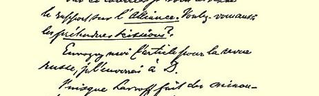
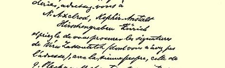
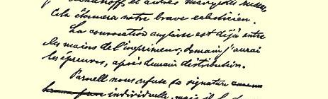

当多的动摇分子，并且还要去动摇那些已经投到敌人一边的人 —— 这是可能做到的——，所以在这里应当发动进攻。

我想明天总可以做一些反驳海德门的事。２１２我今天为通知书英文本张罗，四处奔波了一整天。

里昂来信我是夹在信封里的，我把它寄给您是想请您辨认发信人的地址和姓名。１８２他们向我要几本我的作品。而您已经收到了附有里昂来信的那封信，我在那封信中就向您提出这一请求了。

匆此。

祝好。

#### 弗·恩·

我们一定要知道法尔雅是同意还是反对—— 他或许在表决前就走了吧？２０７

### １１２

## 致弗里德里希·阿道夫·左尔格

### 霍布根

> １８８９年６月８日于伦敦

亲爱的左尔格：

我几乎感到遗憾，你对威士涅威茨基夫妇如此认真，竟同他们断交了。我很乐意使他们满意，让他们用**他**不来看我这种方式向我表示**他们的**极端不满。但是我认为，是他行为不检点迫使你这样做的。

你写信时流露的对代表大会的那种心情，我在３月中到几乎是５月中这段时间也曾经有过。现在一切都奇迹般地挽回了，这可以从寄给你的关于召开代表大会的第二个呼吁书中看出来，这个呼吁书几乎全欧洲都签了名（在今天寄出的伯恩施坦的第二本小册子[^1]的附录中又有增加）。

由伯恩施坦署名的第一本小册子[^2]，正象一切有关这个问题的**用英文**发表的东西一样，是经我校订过的。你可能认为应当加以指责的那一点，从当地的角度来看是必要的，特别是对可能派的揭露，即你所认为的攻击。但是最必要的是公布海牙的决议１６５，这些决议是海牙的那些聪明人决定保守**秘密**的，而且还要无限期保守下去。幸好，无论这里或巴黎，谁也不知道这个英明的决定，所以我们就着手工作了，因为可能派及其在这里的信徒恰恰天天利用这些决议，散布关于这些决议的弥天大谎，等等。

在可能派表示拒绝之后，自然应当采取有力的行动。但是，本应同瑞士人一起召开代表大会的比利时人却毫无动静。他们要把事情拖延到他们复活节在若利蒙召开的代表大会，１６９想用那里通过的决议来掩护自己。而瑞士人中，舍雷尔也有点迟疑，借口要在李卜克内西的同意下，“越过布鲁斯一伙”把可能派的**群众**拉到我们这边来！！李卜克内西在瑞士发表纪念演说２０５，而倍倍尔了解情况太差，李卜克内西不在时，他不能独立行动。

**这里**是真正的战场。伯恩施坦的第一本小册子在这里就象一个晴天霹雳。人们看到，他们被海德门之流无耻地欺骗了。如果我们的代表大会立即召开，那末大家都会支持我们，而海德门和布鲁斯就会孤立。这里工联中的不满分子１６６向我们德国人、荷兰

恩格斯１８８９年５月２７日给拉法格的信的第一页人、比利时人和丹麦人打听，但是谁也没有答复，究竟在什么时候、在什么地方和在什么情况下召开**我们的**代表大会。对他们来说，最主要的是派代表参加代表大会，不管哪个代表大会都行，以便反对布罗德赫斯特和希普顿之流。所以他们就支持**已经宣布召开的**那个代表大会。

这样，我们一步步失去了这里的阵地。我们在这里激进报刊上的阵地也大大动摇了。最后，比利时的代表大会的决定也来了， 说各派一个代表参加**两个**代表大会。甚至在德国的党报上，奥艾尔和席佩耳主张：即使为了表明不是对法国人采取沙文主义的敌视态度，也应当参加可能派的代表大会。１７６总之，我认为这件事失败了，至少在英国是这样。

但是，我立即写信给法国人[^3]（他们从一开始就坚决主张，代表大会要**和可能派的代表大会同时**在７月１４—２１日召开，否则就不值得召开），说比利时的决定使他们恢复了行动自由，他们应当立即在预定的日期召开代表大会。而李卜克内西先生在奥艾尔和席佩耳的文章触动之下，现在恍然大悟，是他把事情耽误了，现在应当迅速行动，于是他向法国人提了同样的建议[^4]。接着发了召开代表大会的呼吁书。出乎一切意料之外，效果非常好，表示支持的声明纷纷而来，而且还在不断地来。甚至在我们这里，也不是仅仅靠声望获得成功，签名发表后到现在还在这里起作用。甚至在这里，社会民主联盟６８（正在急剧衰败）以外的所有人都支持我们，一部分还在联盟内的人也同情我们。要知道，伦敦郡参议会２１３社会主义者议员约翰·白恩士和整个巴特西支部２１４很可能要同社会民主联盟决裂，或者已经决裂。他和帕涅尔（已在我们的通知书上签名）已被推选为参加可能派代表大会的代表，他们会在那里**为我们**起作用。

除社会民主联盟外，可能派**在整个欧洲没有得到一个社会主义组织的拥护**。所以他们只得回到非社会主义的工联方面去，而且会牺牲一切来争取这里的旧工联，即布罗德赫斯特之流，可是伦敦这里１１月发生的事情１０５已经使这些人够受的了。从美国来参加他们大会的只有一个“劳动骑士”２１５的代表。

问题主要是在于：过去国际中的分裂和以前在海牙的斗争２１６， 又提到日程上来了。这也是我大力进行工作的原因。对手还是过去那个，只是无政府主义者的旗帜已经换成了可能派的旗帜：同样是向资产阶级出卖原则，以换取小小的让步，主要是为几个领导人谋取一些肥缺（市参议员、劳动介绍所的领导人员等等）； 而策略也还是过去那一套。显然是由布鲁斯写的《社会民主联盟宣言》，只不过是桑维耳耶通告２１７的再版而已。布鲁斯也知道这一点：他毕竟还是以同样的造谣诽谤来攻击权威的马克思主义，而海德门则随声附和。关于国际和马克思的政治活动的一些消息主要是在这里的总委员会中的不满分子埃卡留斯和荣克之流传出来的。

可能派和社会民主联盟结成的同盟，本来应当成为预定在巴黎成立的一个新国际的核心；德国人如果愿意作为“第三个同盟者”[^5]参加的话，那就和他们联合，否则就反对他们。因此就接连不断地召开了许多小型的代表大会；因此同盟的参加者断然宣布法国和英国的其他一切派别都是不存在的；因此就进行阴谋活动， 特别是想勾结巴枯宁所依靠的那些小民族。可是，当德国人在圣加伦决议２１８后十分天真地（一点也不知道其他地方发生些什么事情）也加入了争取召开代表大会的运动时，这样做就困难了。由于这些小人宁愿反对德国人，而不愿同他们合作—— 因为觉得他们受马克思主义的影响太深——，斗争就成为不可避免的了。你简直想象不到德国人幼稚到何等地步。我要花很大的力气才能解释清楚这究竟是怎么一回事，我连向倍倍尔说明问题所在，也花了很大力气，虽然可能派对这一点知道得很清楚，并且天天都在谈论它。在存在着这一切错误的情况下，我很少希望事情会有好的结局，内在的理性（它在这一历史的进程中正在逐渐认识自己）现在就会取得胜利。尤其使我高兴的是，象１８７３年和１８７４年那样的事情现在已经证明不可能再发生了。阴谋家现在已经破产， 代表大会的意义（不管它是否会引起另一次代表大会）就在于：欧洲的各社会主义政党将在全世界面前显示出它们的同心同德，而几个阴谋家会遭到摈弃，如果他们不服从的话。

在其他方面来说，代表大会的意义很小。当然，我不会去那里，我不能再长期地去做鼓动工作。可是人们又**愿意**再一次演代表大会的戏，那最好不让布鲁斯和海德门导演。正好现在还有时间去制止他们。

很想知道伯恩施坦的第二本小册子[^6]影响如何。我希望这本小册子是这个问题的最后一个文件。

这里的其他事情平平常常。我必须戒烟，因为抽烟对神经不

[^1]: 《一八八九年国际工人代表大会。Ⅱ．答〈社会民主联盟宣言〉》。—— 编者注

[^2]: 《一八八九年国际工人代表大会。答〈正义报〉》。—— 编者注

[^3]: 见本卷第１８２—１８５页。—— 编者注

[^4]: 见本卷第１８７页。—— 编者注

[^5]: 席勒《人质之歌》。—— 编者注

[^6]: 《一八八九年国际工人代表大会。Ⅱ．答〈社会民主联盟宣言〉》。—— 编者注