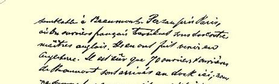
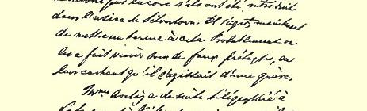
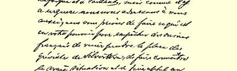
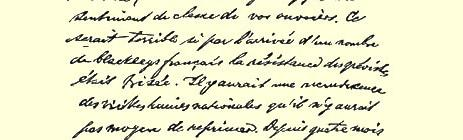

代尼姆和我拥抱劳拉。尼姆身体很好。

祝好。

#### 弗·恩·

### １４９

## 致茹尔·盖得

### 巴黎

> １８８９年１１月２０日于伦敦
>
> 西北区瑞琴特公园路１２２号

亲爱的公民盖得：

我刚刚接到了艾威林夫人的信，她说，如果我有您的地址的话，请我给您写封信。正好博尼埃把您的地址告诉了我，于是我就马上动笔。事情是这样的。

在伦敦郊区银镇的一家生产橡胶制品等等的工厂（属于西尔弗公司），正在举行罢工，领导这次罢工的是艾威林夫人，２８０罢工已经延续十个星期了，参加罢工的有三千男女工人。这次罢工很有可能取得胜利。这次罢工取得胜利很重要，不然的话，从码头工人罢工２３８以来工人们所取得的一连串的胜利就将中断，而英国企业主老爷们的胜利将会使他们几乎已经失去的信心又恢复起来。

几天前，西尔弗公司接受了一些非常紧急的定货，要完成这些定货是不可能的，因为三千五百个工人中就有三千多人举行罢工。 此外，大批水底电缆的定货需要分配给西尔弗公司所属的四个工厂。如果罢工继续下去的话，它们就会失去这个机会。工厂曾向

> 恩格斯１８８９年１１月２０日给盖得的信的第二页一些罢工者提出了诱骗性的建议，但是没有结果。于是它们便采取了它们最后的一个手段。

西尔弗（股份公司用这个名字开办）公司在巴黎近郊的博蒙 —佩桑也有这样一个企业。在那里，法国工人是由英国工头带领工作的。他们把法国工人运往英国。据悉，有七十个男女工人已经从博蒙来到了这里的码头。我们还不知道，他们是否已经被运到了银镇的工厂。现在就是必须制止这种做法。可能他们是受骗到这里来的，向他们隐瞒了正在罢工的消息。

艾威林夫人马上就给拉法格和瓦扬打了电报，但是由于事情很紧急，我们也向您求援。我们请求您尽一切力量阻止法国工人到这里来顶替银镇的罢工工人，向他们说明事情的真相，激发你们工人的阶级感情。如果由于法国工贼的到来而破坏了罢工者的反抗， 那是非常糟糕的。这会使旧的民族仇恨重新抬头，要扑灭这种民族仇恨将是不可能的。已经有四个月了，伦敦东头的工人们不仅以全部身心投入了运动，而且在组织纪律、自我牺牲和英勇顽强等方面给世界各国的同志们作出了榜样。可以与之媲美的只有巴黎人在遭到普鲁士人包围时的那种行为。２８１现在，请设想一下，正是在斗争激烈进行的时刻，如果他们发现法国工人在英国资产阶级的旗帜下战斗，那将会出现什么样的情况！不，这是不可能的，只要在法国使人们都知道事情的真相，一切就将起变化：正是由于法国无产者的作用，英国罢工工人一定会取得胜利。

当码头工人罢工时，这里给安塞尔打电报说，企业主在招募比利时工人，安塞尔马上就采取了一些必要的措施，—— 无论是他的信件或者是他的电报都大大地鼓舞了那些有时开始气馁的罢工工人。