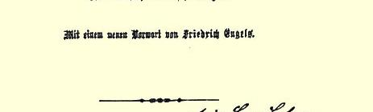
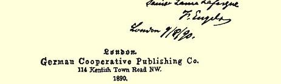

普鲁士妥协，这样，它们每一国都会把自己的盟国当作牺牲品。

拉法格在《新时代》上关于法国的运动的文章[^1]很好，写得很漂亮，但我宁愿要爱德·伯恩施坦而不要考茨基来翻译这篇文章， 因为考茨基的翻译太罗嗦。

刚刚收到了几本新的德文版《宣言》[^2]，同这封信一起寄给你一本。

肖莱马和我向你的夫人、向你和施留特尔夫妇衷心问候。

#### 你的弗·恩格斯

### ２１０

## 致威廉·李卜克内西

### 莱比锡

> １８９０年８月１０日于伦敦

亲爱的李卜克内西：

我所以在这里耽搁，是因为我住的房子转给了另一个主人。我们预计星期四才能动身，可能去福克斯顿。我把我们的地址留在这里的邮局，留在肯提希镇[^3]，并将写信到莱比锡告诉你。我希望你一到就去海滨找我们。既然你写信说１５日**以前**不能来这里，我便敢断定（至少根据最近一再拖延的类似情况推测），１５日**以后**你也不能立即脱身。这样，如果你能在９月１日左右或者稍晚一些时候来，那你还可以在我们这里呆一些时间，然后同我们**一起**（大约在 ９月１１日）回伦敦，这里我们保证你有住的地方。

我们离家后，房子将进行修理。今年要撤去地毯，还要换糊墙纸，粉刷天花板。此外，在花钱方面不愉快的经验，迫使我在离家期间对女佣人采用给伙食费的办法，就是说，我每星期给她一定数目的钱，伙食由她自理。这样安排有个不方便的地方，就是在这个期间不仅不能接待客人，连自己也不能在家里住。如果你来得早了，大概就只好接受莫特勒的邀请了。但是我想你会按我上面的建议来安排的。

无论如何，我希望在代表大会召开前见到你。你们的草案３８０有很多缺点；其中最大的缺点就是执行委员会**自己**给自己规定工资， 虽然也得到党团的同意。依我看，你们根本不该以此给人提供无穷责难的借口。我今天收到了《萨克森工人报》，文学家先生们在该报批评了这个草案。这种批评很多纯粹是幼稚，但是，个别的弱点被他们本能地嗅出来了。譬如**每个**选区可以至多派三名代表。 这样一来，随便哪一个人，巴耳曼也好，赫希柏格也好，只要敢花这笔钱，就能从那些我们勉强得一千票的选区，各提出三名代表。当然，钱的问题通常会对代表团的组成起**间接**调整的作用。但是，使代表人数同他们所代表的党员人数之间的比例完全取决于这个问题，我认为是愚蠢的。

其次，根据第二条——** 就其直接意义来讲**，—— 在穷乡僻壤的某个由三人组成的小组，就可以把你开除出党，除非党的执行委员会恢复你的党籍。相反，党的代表大会却不能开除任何人，而只能起上诉审的作用。

在**任何一个**有议会代表的积极的政党里，党团是很重要的力量。不管章程中是否直接予以承认，党团都拥有这种力量。在这

> 《共产党宣言》德文第四版扉页
>
> 上面有恩格斯给劳拉·拉法格的题字种情况下，在章程中另外再规定党团处于绝对控制执行委员会的地位，如第十五—— 十八条所规定的那样，试问：这样做是否聪明？对执行委员会进行监督—— 很好，但是，由具有决定权的独立委员会来处理申诉，也许会更好。

三年来，你们得到了大发展，增加了上百万人。在实施反社会党人法１０的条件下，这些新人没有可能充分阅读书报和听到鼓动， 所以没有达到老党员的水平。他们之中很多人只有善良的愿望和美好的意图，可是大家知道，这往往会把人引入地狱。如果他们连一切新教徒的那种热忱也没有，那倒是怪事。因此，他们是一种很容易受反对你们的那些钻到前面去的文学家和大学生的影响和利用的材料。例如在马格德堡就证明有这种情况。这是一种不容忽视的危险。当然，很清楚，在**这次**代表大会上你们将毫不费力地克服这种危险。但是要注意，不要为**未来的**困难撒下种子。不要造成不必要的牺牲者，要表明你们那里充满着批评的自由，**如果**非开除不可，那只有举出昭然若揭、证据确凿的卑鄙行为和叛变行为的**事实**（明显的行为），才能开除。我的意见就是这些。详情面谈。

#### 你的弗·恩·

多多问候你的夫人和泰奥多尔[^4]。

[^1]: 保·拉法格《法国的社会主义运动》。—— 编者注卡·马克思和弗·恩格斯《共产党宣言》。—— 编者注

[^2]: 

[^3]: 即在《社会民主党人报》编辑部。—— 编者注

[^4]: 李卜克内西的儿子。—— 编者注