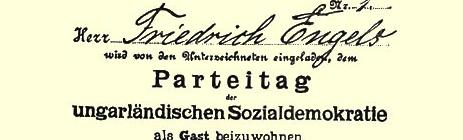
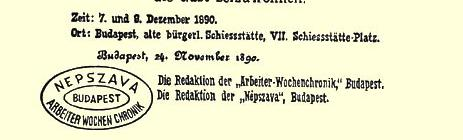

我对荷兰军队中士兵的状况也了解得很少，而这一点同样很有关系。在德国，我们的人都是优秀的士兵。

衷心问候。

#### 您的弗·恩格斯

在您的比雷菲尔德案件之后，您大概不会很快地想再去访问普鲁士民族的神圣德意志帝国吧！

### ２４６

## 致阿曼特·戈克

### 伦兴（巴登）

> １８９０年１２月４日于伦敦

亲爱的戈克：

非常感谢你的友好祝贺。我们这些老年人还健在的不多了。因此，我的亲爱的琳蘅的去世，对我又是一次令人痛苦的警告。不过，我还能活一些时间，我希望能好好地加以利用。

#### 你的老弗·恩格斯

> 邀请弗·恩格斯参加匈牙利社会民主党代表大会的请柬４１９