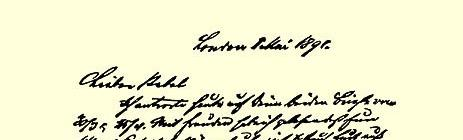
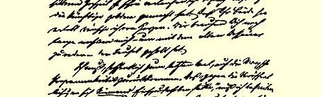
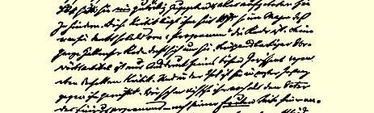
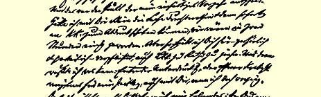

### ４６

## 致奥古斯特·倍倍尔

### 柏林

> １８９１年５月１—２日于伦敦

亲爱的倍倍尔：

我今天答复你３月３０日和４月２５日的两封来信１００。欣悉你们美满地度过了银婚，并产生了对未来欢庆金婚的憧憬。衷心预祝你们俩如愿以偿。在我—— 用德骚老人[^1]的话来讲—— 被魔鬼抓走之后，我们还长久地需要你。

我不得不再一次—— 但愿是最后一次—— 谈谈马克思的纲领批判[^2]。“对发表纲领批判这件事本身，**谁也**不会反对”—— 我不同意这种说法。李卜克内西**永远**也不会甘心情愿地同意发表，而且还要千方百计地加以阻挠。１８７５年以来，这个批判对他一直是如鲠在喉，只要一提到《纲领》，他就想起这个批判。他在哈雷的讲话７ 通篇都是围绕着这个批判的。他在《前进报》上发表的那篇华而不实的文章４５，只不过表明他对这个批判心怀鬼胎。的确，这个批判首先是针对他的。根据这个合并纲领３４的**腐朽的**特点，我们过去认为他是该纲领的炮制者，而且我至今还这样认为。正是这一点使我毅然采取单独行动。如果我能只同你一人讨论这个文件，然后立即把它寄给卡尔·考茨基发表，我们两小时就能谈妥。但我认为，在这种情况下，从个人关系和党的关系来说，你也必须征求李卜克内西的意见。而这会引起什么后果，我也是清楚的。或者是文件不能发表，或者，如果我仍然把它发表的话，那就要发生公开争吵，至少是在一个时期内，而且和你也要争吵。我并没有说错，下述一点可以证明：你是４月１日出狱的，而文件上所注的日期是５月５日， 所以，如果没有其他的解释，那显然是**有意**向你**隐瞒了**这个文件， 而这**只能是李卜克内西**干的。但是，你为了和睦相处竟允许他散布谣言，说你因为坐牢而没有看到这个文件。１０１同样，为了避免在执行委员会发生争执，这个文件发表以前，看来你也得考虑李卜克内西的意见。我认为这是完全可以理解的，但是，希望你也注意到，我考虑了事情可能发生的变化。

我刚才又把这篇东西读了一遍。也许再删去一些也无碍大体。 但可删的肯定**不多**。当时的情况怎样呢？草案一经你们的全权代表通过，**事情就已成定局**，对这一点，我们了解得并不比你们差，也不比譬如我查到的１８７５年３月９日《法兰克福报》所了解的差。因此，马克思写这个批判只是为了拯救良心，丝毫不指望有什么效果，正如结尾的一句话所说的：我已经说了，我已经拯救了自己的灵魂。所以，李卜克内西大肆宣扬的“绝对不行”１０２只不过是夸口而已，这一点他本人也很清楚。既然你们在推选你们的代表时疏忽大意了，继而为了不损害整个合并事业又只得吞下这个纲领，那末你们确实也不能反对在**十五年后**的今天把你们在最后决定以前得到的警告公诸于众。这样做，既不会使你们成为蠢人，也不会使你们成为骗子，除非你们奢望你们的正式言行绝对不犯错误。

诚然，你没有读过这一警告。而且报刊也谈到过这一点，因此， 比起读过这个警告而仍然同意接受该草案的那些人，你的处境就非常有利。

我认为附信

３４十分重要，信中阐述了唯一正确的政策。在一定的试行期间采取共同行动，这是唯一能使你们避免拿原则做交易的办法。但是李卜克内西无论如何不想放弃促成合并的荣誉，令人诧异的只是，他那时候没有做出更大的让步。他早就从资产阶级民主派那里接受了地地道道的合并狂，并且一直抱住不放。

拉萨尔分子所以靠拢我们，是因为他们**不得不**这样做，是因为他们的党已全部瓦解，是因为他们的首领都是些无赖或蠢驴，群众不愿意再跟他们走了，—— 所有这一切今天都可以用适当的缓和的形式讲出来。他们的“严密组织”已自然而然地彻底崩溃。因此， 李卜克内西以拉萨尔分子牺牲了他们的严密组织为理由—— 事实上他们已没有什么可牺牲的了—— 来替自己全盘接受拉萨尔信条进行辩解，这是很可笑的！

纲领中这些含糊和混乱的词句是从哪里来的，你感到奇怪。其实，所有这些词句正是李卜克内西的化身。为此，我们跟他已争论了多年，他对这些词句非常欣赏。他在理论问题上从来是含糊不清的，而我们的尖锐措词直到今天还使他感到恐惧。可是，他作为人民党４０的前党员，至今仍然喜欢那些包罗万象而又空洞无物的响亮词句。过去，法国人、英国人和美国人，由于不善于更好地表达自己的思想，措词含糊地把工人**阶级**的解放说成“劳动的解放”，甚至国际的文件有些地方也不得不使用文件对象的语言，这就成了李卜克内西强使德国党沿用陈旧用语的充足根据。绝对不能说他这是“违背自己的见解”，因为他确实也没有更多的见解，而且他现在是否就不处于这种状态，我也没有把握。总之，他至今还常常使用那些陈旧的含糊不清的术语，—— 自然，这种术语用来夸夸其谈倒是方便得多。由于他确认他自以为十分通晓的基本民主要求至少

> 恩格斯１８９１年５月１—２日给奥·倍倍尔的信的第一页象他不完全懂得的经济学原理同样重要，所以，他的确真诚地相信：他同意接受拉萨尔信条，以换取基本民主要求，是做了一件大好事。

至于谈到对拉萨尔的攻击，我已经说过，对我来说这也是极为重要的。由于接受了拉萨尔经济学的**全部**基本用语和要求，爱森纳赫派**事实上已成了拉萨尔派**，至少从他们的纲领来看是如此３４。拉萨尔派所能够保留的东西一点也没有牺牲，的确一点也没有牺牲。 为了使他们获得圆满的胜利，你们采用了奥多尔夫先生用来赞扬拉萨尔的歌功颂德的押韵词句[^3]做你们的党歌。在反社会党人法３８ 实施的十三年内，在党内反对对拉萨尔的迷信当然没有任何可能。 但是，这种状况必须结束，而我已经着手进行。我再也不容许**靠损害马克思**来维持和重新宣扬拉萨尔的虚假声誉。同拉萨尔有过个人交往并崇拜他的人已经寥寥无几，而所有其他的人对拉萨尔的迷信**纯系人为的**，是由于我们违背自己的信念对它采取沉默和容忍的态度造成的。因此，这种迷信甚至也不能以个人感情来解释。 既然手稿是发表在《**新时代**》上，也就充分照顾了缺乏经验的和新的党员。但是，我决不能同意：在十五年的耐心等待之后，为了照顾情面和避免党内可能出现的不满而把这些问题上的历史真相掩盖起来。这样做，每次总得要触犯一些善良的人，这是不可避免的，正如他们对此要大发怨言一样。在此以后，如果他们说什么马克思妒嫉拉萨尔，而德国报刊甚至（！！）芝加哥《先驱报》（该报是为在芝加哥的地道的拉萨尔派办的，他们的数目比在整个德国还要多）也都随声附和，这对我也没有什么了不起，还抵不上跳蚤咬一口。他们公开指责我们的岂止这些，而我们还是该做什么就做什么。马克思严厉地谴责了神圣的斐迪南·拉萨尔，为我们提供了范例，这在目前已经足够了。

再者，你们曾企图强行阻止这篇文章发表，并向《新时代》提出警告：如再发生类似情况，可能就得把《新时代》移交给党的最高权力机关管理并进行检查，从那时起，由党掌握你们的全部刊物的措施，不由地使我感到离奇。既然你们在自己的队伍中实施反社会党人法，那你们和普特卡默有什么区别呢？其实这对我个人来说，倒是无关紧要的：如果我要讲话，任何国家的任何党都不能迫使我沉默。不过，我还是要你们想一想，不要那么器量狭小，在行动上少来点普鲁士作风，岂不更好？你们—— 党—— **需要**社会主义科学，而这种科学没有发展的自由是不能存在的。这样，对种种不愉快的事，只好采取容忍态度，而且最好泰然处之， 不要急躁。在德国党和德国社会主义科学之间哪怕是有一点不协调，都是莫大的不幸和耻辱，更不用说分离了。执行委员会和你本人对《新时代》以及所有出版物保持着并且应该保持相当大的 **道义上的**影响，这是不言而喻的。但是，你们也应该而且可以以此为满足。《前进报》总是夸耀不可侵犯的辩论自由，但是很少使人感觉到这一点。你们根本想象不到，那种热衷于强制手段的做法，在国外这里给人造成何等奇怪的印象，在这里，毫不客气地向党的最老的领导人追究党内责任（例如伦道夫·邱吉尔勋爵向托利党政府追究责任），已是司空见惯的事。同时，你们不要忘记： 一个大党的纪律无论如何不可能象一个小宗派那样严厉，而且使拉萨尔派和爱森纳赫派合在一起（在李卜克内西看来，这却是他那个了不起的纲领促成的！）并使他们如此紧密联合起来的反社会党人法，如今已不复存在了。

哎！这些烦人的往事似乎已经说完，现在可以谈谈别的了。在你们那里的上层人物中好象出现了一些趣闻。１０３这倒不坏。国家机器普遍紊乱的形势，对我们是会有利的。但愿由于对战争结局的普遍恐惧而使和平得以维持！而目前，随着毛奇的死去，肆意调换指挥官以致使军队陷于瓦解的道路上的最后一个障碍，也消失了；今后，胜利会一年比一年渺茫，而失败的可能则越来越大。我虽然毫不希望再来一次色当，但也不期望俄国人及其同盟者获胜， 即使他们是共和派，而且有理由对法兰克福和约１０４表示不满。

你们在修改工商业条例方面所付出的力量没有白费。这是再好没有的宣传了。我们曾以极大的兴趣关注事态的发展，并对那些成功的演说１０５感到高兴。我不禁想起了老弗里茨的一句话：“总之，我们士兵的天才就是善于进攻，仅仅这一点就很了不起”。还有哪一个政党在拥有同等数量议员的情况下，能从中推选出这样多坚定的、善于战斗的演说家呢？好啊，年轻人！

鲁尔的矿工罢工９９，对你们来说，当然是很不合时宜的，但又有什么办法呢？轻率的、自发的罢工，—— 这在目前，正是新的广大工人群众靠拢我们的通常的途径。我觉得《前进报》对**这一** 情况在论述时没有给以足够的注意。１０６李卜克内西总是走极端，—— 在他看来，要么全是黑的，要么全是白的；如果他认为自己有责任向全世界证明，我们的党并没有挑起这次罢工，甚至还进行过劝阻，那这些可怜的罢工者就倒霉了，他们就不会得到应有的关心，以便使他们尽快地靠拢我们。不过，他们终究是要到我们这方面来的。顺便问一下，《前进报》出了什么事？我这位李卜克内西足有两天没有露面了，使人颇感寂寞。想必是他外出了。今天，５月２日，他又精力充沛地出现了。

#### ５月２日

矿工罢工大概很快就会沉寂下来。看来，这不过是一次有限的、局部性的罢工，而绝不象代表会议上所宣称和保证的那样。这倒也好。我毫不怀疑，有人很想动刀枪。

**五一节**过得很好。维也纳又占了第一位。巴黎的庆祝活动因为纠纷远未平息，有些冷冷清清。在那里，大家都有错误。我们的人受到在利尔和加来通过的一种固定的示威游行方式１０７的约束：派代表团赴众议院。他们没有征得布朗基派的同意。阿列曼派３３后来才加入示威游行筹备委员会。布朗基派和阿列曼派双方都对这种方式有意见；议院里有从布朗基派分裂出来的分子，他们是在布朗热的庇护下当选的，又有阿列曼派的一个对手—— 布鲁斯分子３０，所以不论是布朗基派或是阿列曼派，都不愿在这些人面前以请愿者身分出现。我们的人建议向巴黎市二十个区政府派代表团，并召集各有关区的市参议员去听取“人民的意愿”，也得到同样的结果。最后，事情闹到了分裂和我们的人退出的地步， 示威游行也随之分为三四起单独举行。我接到拉法格昨天下午的报道，他对在当地条件下能举行那样的示威游行尚感满意，但又说，巴黎将不如外省。选择５月３日的国家—— 德国和英国，天气如果不太坏的话，将能动员数量可观的群众。目前看来，这是没有问题的。今天，这里的天气很糟，风雨交加，只是偶尔露出一线阳光。

费舍大概已收到《雇佣劳动与资本》所必需的一切[^4]。《发展》[^5]数日后随即送去。但是今后，一切要求都不要再提了。我答应准备《起源》 [^6]新版已有一年了，这是应当完成的，在此以后，整理完《资本论》第三卷手稿之前，我**绝不着手任何新的工作**。这是**必须**完成的。因此，如果有谁再想占用我的时间，就请代为解释。我还要把自己的各种通信减少到最低限度，只有一个例外，就是和你的通信。通过你，最便于和德国党保持联系，而且坦率地说，和你通信是我最愉快的事。一俟第三卷付印，便可做别的事情了，首先是修订《农民战争》。如果我能摆脱其他事务，大概年内即可完成第三卷。

衷心问候你的夫人[^7]、保尔[^8]、费舍、李卜克内西及其他人。

#### 你的弗·恩·

> **［路·考茨基的附笔］** 亲爱的奥古斯特：
>
> 衷心感谢你的亲切来信；一有机会，我便作复，并把你感兴趣的事告诉你。你知道吗，当《每日新闻》把你吹嘘得天花乱坠的时候，我们，即联合起来的国际社会民主党人，例如：杜西（代表法国和英国）、爱德[^9]（代表爱尔兰）、爱德[^10]（代表柏林人）、吉娜[^11]（代表波兹南）和我（代表奥地利和意大利），要对你投不信任票。丢脸！奥古斯特，我至少没有想到你会这样。
>
> 衷心问候你和你的夫人。
>
> 您的 **穆玛**
>
> 很快就给你写一封详细的信。

[^1]: 列奥波特，安哈尔特－德骚王。—— 编者注

[^2]: 卡·马克思《哥达纲领批判》。—— 编者注

[^3]: 雅·奥多尔夫《德国工人之歌》。—— 编者注

[^6]: 弗·恩格斯《卡·马克思〈雇佣劳动与资本〉１８９１年单行本导言》。—— 编者注

[^7]: 弗·恩格斯《社会主义从空想到科学的发展》。—— 编者注

[^8]: 弗·恩格斯《家庭、私有制和国家的起源》。—— 编者注

[^9]: 尤莉娅·倍倍尔。—— 编者注

[^10]: 辛格尔。—— 编者注

[^11]: 艾威林。—— 编者注

[^x]: 伯恩施坦。—— 编者注

[^x]: 雷吉娜·伯恩施坦。—— 编者注