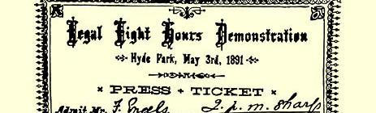
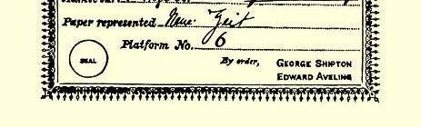

### ４７

## 致劳拉·拉法格

### 勒－佩勒

> １８９１年５月４日于伦敦

亲爱的小劳拉：

昨天，无论从天气或是从游行来看，都好极了。路易莎、赛姆· 穆尔和我，是两点钟去的１０８，许多讲台在公园[^1]里排成一个大弧形。游行队伍两点半开始入场，四点一刻还没有结束，直到五点仍有新的队伍陆续到来。我和赛姆在爱德华的讲台上，路易莎在杜西的讲台上。人很多，大致同去年一样，也许还要多些。

现在谈一谈示威游行的筹备经过。这次游行几乎完全是爱德华和杜西努力的结果；他们自始至终都得为此进行斗争。当然，发生过不少摩擦，但是由于去年９月在利物浦举行的工联代表大会９１和已经起了变化的多数（赞成在法律上规定八小时工作日）， 事情就好办多了。希普顿对爱德华非常客气，但在许多小事情上却从中刁难，并威胁说，如果有人对他充任游行总指挥的（神圣的？） 权利提出异议，他便什么也不管了。好吧，他们就让他干了；这也许是他最后一次“耀武扬威”了。

最主要的是，决议按照我们的人提出的那样通过了，并且成立了联合委员会（工联理事会７３五人，示威游行筹备委员会五人）。

再来讲一讲有关社会民主联盟９的可笑的事。最初，他们派了三名代表参加爱德华担任主席的示威游行筹备委员会。但是过了不久，他们就不出席该委员会的会议了，因而被除了名。后来，社会民主联盟要求工联理事会象去年一样，给它提供两个讲台。然而， 希普顿自己建议联合委员会无论如何不要答应，于是这一要求便遭到拒绝，理由是：如果那样，每个工联都可以要两个讲台。这时社会民主联盟便在他们办的通报[^2]上宣称，他们要举行自己的集会， 设四个讲台，并布置红旗。１０９可惜的是，他们的队伍不得不从滨河路就并入我们的行列，以便有秩序地、有声势地进入公园；但是一进去，他们便到离我们一百码的地方去举行他们所说的集会—— 但没有象样的讲台；我们有大板车，他们只有椅子。他们离我们刚好近到可以指望我们这里容纳不下的人到那里去凑数，同时又相当远，以至我们可以看到，他们拉去的人是多么的少。

对他们来说，具有决定意义的是示威游行筹备委员会的一项决议：凡参加委员会的团体，应**为自己的每一分部**交纳五先令以应付总的开支。这样一来，社会民主联盟要么就得为他们在《通报》上吹嘘过的许多假分部每个交纳五先令，要么就得承认这些分部是假的。这就决定了他们最终不得不退却。

人们让他们感觉到了他们所处的实际地位，是德国人在美国社会主义工人党１８中的那种地位，即一个**宗派**的地位。他们的地位就是这样，尽管他们是本地英国人。对盎格鲁撒克逊民族及其独特的发展方式来说，非常突出的是，在这里和美国，凡是或多或少懂得一些正确的理论——** 这是就其条文而言**—— 的人，都只能成为一个宗派，因为他们不能理解活的行动理论，即同工人阶级在其每个可能的发展阶段一道工作的理论，而只把理论当作一堆应当熟记和背诵的教条，象魔术师的咒语或天主教的祷词一样。因此，真正的运动是在这个宗派之外进行的，而且离它越来越远。联盟的坎宁镇分部不顾海德门的反对，支持爱德华和杜西，同我们的人一道前进，而且这是他们最强大的一个分部。码头工人罢工７４以来，社会民主联盟一度从社会主义运动的普遍高涨中得到了好处，但是现在这已成为过去了。他们难以支付滨河路新址的费用，于是又走下坡路了。由于他们的朋友以及同盟者—— 可能派３０正力图尽快相互吞并，所以连它那可观的对外联系也无从夸耀了。

赛姆·穆尔对他离开两年期间这里取得的巨大进展，感到十分惊异。顺便告诉你，他的身体很好。他非常喜欢那里的气候和安逸的生活。可以肯定，不久他就会怀念非洲的。

在我们的讲台上（第六号，爱德华的讲台，请看《纪事报》１１０）， 我见到肯宁安－格莱安；但是关于巴黎的情况，他能告诉我的比保尔星期五[^3]下午来信讲的多不了许多。总之，希望委员会组织的晚间游行**没有**象格莱安所说的布鲁斯派的示威游行那样，是一个失败。尽管我们不能一致行动，但都希望把示威游行搞得尽可能的好。

事情既已发生，惋惜是没有用的，但我还是不能不想到，法国人往往容易对力量的对比做出错误的估计，我们的朋友也因此犯了一个不大的错误。尽管这有时表现为勇敢的精神，“但这还不是作战”１１１。我们还是想和布朗基派象往常一样合作的，而**他们**不受在加来和利尔通过的决议１０７的约束。这些决议只能约束我们的

> １８９１年５月３日海德公园示威游行集会时
>
> 弗里德里希·恩格斯上讲台的记者证人；布朗基派本来也可以通过一些有关庆祝五一节的决议，然后宣称受那些决议的约束。我们为什么要不顾自己仅有的同盟者，事先自行决定在我们目前显然处于少数的**巴黎**怎样进行示威游行呢？ 为什么要这样得罪我们仅有的同盟者呢？尤其是，为什么要提出派代表团到区政府去并召集所有的市参议员到那里同代表们会面的计划，提出这种他们显然不能同意的计划来得罪他们呢？因此，他们后来投进阿列曼派３３的怀抱，我丝毫也不感到惊奇。至少，我根据现有的材料可以得出这样的看法。也许事情还有另一方面，那我就不知道了。

来自德国的消息，我们今天得到的还很少。汉堡举行了一次出色的游行，据《每日电讯》报道，有八万人参加。柏林没有什么消息， 柏林哈瓦斯通讯社的沃尔弗奉政府之命，任何消息不予透露，而伦敦的记者们都受自由思想党１１２的影响，也采取了同样的做法。

昨晚，回到家里，我们以畅饮五月混合酒结束了这一天，酒里的车叶草是派尔希从赖德寄来的。用了四瓶摩塞尔酒、两瓶红葡萄酒和香槟酒，我们、伯恩施坦夫妇、杜西和她丈夫[^4]，都给喝光了。 夜晚，肯宁安－格莱安来了，他也喝了两三杯—— 看来，他在丹吉尔就已经不戒酒了。今晚，我们喝了一瓶比尔森啤酒，保持着一种相当舒适的醉意。

保尔为什么没有来？格莱安说他太疲倦了；他的名字列在第八号讲台的讲演人名单上，同约翰·白恩士在一起。

路易莎向你多多问好。

#### 你的老弗·恩·

[^1]: 海德公园。—— 编者注

[^2]: 通报，即正式机关报。这里是指《正义报》。—— 编者注

[^3]: ５月１日。—— 编者注

[^4]: 爱·艾威林。—— 编者注