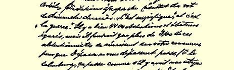
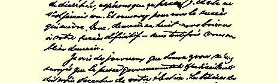
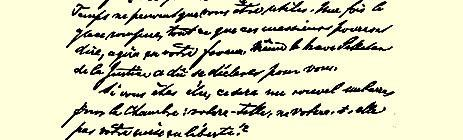

> ……当它有天然物产的时候，
>
> 为什么不需要黄金。
>
> 父亲不能理解他，
>
> 还是拿土地做抵押。[^1]

#### 忠实于您的派·怀·罗舍[^2]

下星期一，我又要着手第三卷[^3]的工作了，但愿能一气完成， 不再中断。

因为有事耽搁，这封信直到今天，１０月３１日才写完。

### ８８

## 致保尔·拉法格

### 勒－佩勒

> １８９１年１０月３１日于伦敦

亲爱的拉法格：

路易莎和我，为上星期日[^4]的选举结果，向您表示衷心祝贺。 “这是壮观的”，而且这是“作战”。１９４不错，有四千四百名选民弃权和受蒙蔽，然而，要使德帕斯的票数超过您而被通过[^5]（噢，双关语！腹泻时才会这样通畅，但愿这次也能通过！），就得把这些弃权者中的三千一百多人联合在您的竞选对手周围。这是前所未有的！ 您的成就简直令人陶醉。总之，八天后我们将为您的最后胜利干杯，—— 不过明天我们也决不会把您忘掉。

我从劳拉和您寄来的报纸上发现，政府的激进化报刊最终不得不报道你们的选举。《时报》的胡言乱语，只会有利于您。冰层既已破开，无论这些先生们说些什么，对您只会有益无损。连《正义报》的勇士佩尔坦也迫不得已替您讲话。

您如当选，议院将面临一个新的难题：是否把赞成释放您的问题付诸表决？

众议院的激进派中，以米勒兰、奥韦拉克、莫罗为一方，以支持克列孟梭的多数为另一方，正酝酿着一场新的分裂，这是怎么回事呢？您提到同前一部分人建立联盟的可能性。１９５但他们能同你们一道走多远呢？据我所知，众议院中那些名义上被认为是“社会主义者”的激进派，迄今只不过是蒲鲁东主义的残余而已，而且他们这些蒲鲁东主义的残余，公开反对生产资料归社会公有。我看，同这些甚至在原则上也不承认这一点的人，不可能实行联合，不可能建立统一的**派别**。换句话说，我认为同他们建立比较短暂的联盟是允许的，但不能实行联合。不过，既然看来有了一些新的进展，—— 对此我还不清楚，—— 我得等您提供情况，然后才能发表意见。事实上，假如众议院中的激进派开始转向我们，这当然不坏，—— 多么好的征兆呵！

劳拉和您觉得我的文章[^6]很好并具有现实意义，我很高兴，但 《年鉴》[^7]的另一些人—— 阿尔吉里阿德斯们及其一伙会说些什么呢。我总觉得，自己无力满足这些普天下之友先生们的愿望，我为他们撰写的预约文章全然不是他们所希望的。要是同贝努瓦·马隆先生和巴黎社会主义的其他泰斗们那些词藻华丽的作品放在一起，这篇文章几乎是无法接受的。一开始，我就对劳拉说过，在当前情况下，我不得不写一些使许多人不愉快的东西，既然她想要，我就依从了。我很清楚，《社会主义者报》将会毫不迟疑地刊用此文， 而《年鉴》则是另一回事了。但不管怎样，我们将发表这篇东西，而且，看来它会引起喧嚣。

在爱尔福特一切都很顺利。１６６反对派的那些蠢驴在全党的代表们面前表明，他们确实是丝毫不值得同情的蠢驴和懦夫。这些人若不是糊涂虫，便是隐蔽的无政府主义者，或者是警探。昨晚在柏林举行了集会，代表们要在会上做报告；反对派先生们谅已被击溃。另一方面，福尔马尔不仅在爱尔福特被迫后退，而且在慕尼黑１９６，当他向自己的选举者发表讲话，而这些选举者否决了他提出的决议案时，这种后退就更加明显。在该决议案中，福尔马尔没有直接攻击爱尔福特针对他通过的各项决定，而企图塞进一些反映了他在几次反动讲话中所坚持的观点的词句。福尔马尔不得不自己提出新的决议案：无条件地服从爱尔福特的各项决定。这个决议案被一致通过。情况正象倍倍尔在给我的信中所说的那样，凡是退党或被开除出党的人，都要成为政治僵尸１９７，而福尔马尔先生对此是一清二楚的，所以没有采取势必会使自己落到同样下场的行动。尽管如此，他仍然是我们党内最危险的阴谋家。

总之，在德国，事情在前进中，你们那里很快也会走上轨道。我们或许能够避免一场战争，而由于我们不慌不忙、有条不紊，这可能给法国人以机会猛冲向前，再次超越我们。“世纪末”将是错不

> 恩格斯１８９１年１０月３１日给保·拉法格的信的第一页

[^1]: 引自普希金《叶甫盖尼·奥涅金》。—— 编者注恩格斯的化名。—— 编者注

[^2]: 《资本论》。—— 编者注

[^3]: １０月２５日。—— 编者注

[^4]: 

[^5]: 俏皮话：德帕斯这个姓的原文是《Ｄｅｐａｓｓｅ》，同“超过”（ｄéｐａｓｓｅｒ）、“通过”（ｐａｓｓｅｒ）的发音相近。—— 编者注

[^6]: 弗·恩格斯《德国的社会主义》。—— 编者注

[^7]: 《工人党年鉴》。—— 编者注