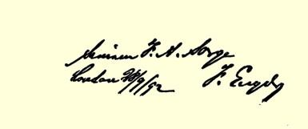

诉过法国人，而法国人对这一说明感到满意。

这就使他们没有任何抱怨的权利。后来我告诉他，既然巴黎有巴拿马事件，柏林有军事问题４４２，再加上普遍的工业危机，也许我们在五一节应当采取更好的行动，而不示威游行。我想，这一点，他在巴黎总该会理解的。这个人有最好的意愿，但是，如果真想积极参加三个国家的工人运动，那就不应当住在牛津。

衷心问候你们大家。

#### 你的弗·恩·

> **［路·考茨基的附笔］** 亲爱的娜塔利亚夫人：
>
> 您允许我赞同将军的信和祝愿吗？我对这个问题的回答是，您是会同意的。我向您、您亲爱的丈夫和孩子们衷心地祝贺新年。
>
> 致衷心的问候。
>
> 您的 **路易莎·考茨基**

### ２５４

## 致弗里德里希·阿道夫·左尔格

### 霍布根

> １８９２年１２月３１日于伦敦

亲爱的左尔格：

在旧的一年结束之前，再给你写几行。你１１月１８日和１２月 １６日的来信已收到，非常感谢。９月间寄给你的一包书收到了没有？内有：新版的《工人阶级状况》和艾威林译的、并有我写的导言的《空想的社会主义和科学的社会主义》[^1]。如果没有收到，我再用挂号寄一次。

在这里，在古老的欧洲，比你们那个还没有能摆脱少年时代的 “年轻的”国家，倒是更活跃一些。在这样一个从未经历过封建主义、一开始就在资产阶级基础上发展起来的年轻的国家里，资产阶级的偏见在工人阶级中也那样根深蒂固，这是令人奇怪的，虽然这也是十分自然的。美国工人正因为反抗了还披着封建外衣的宗主国，便以为传统的资产阶级经济天然就是，而且任何时候都是先进的、优越的、无与伦比的。同在新英格兰完全一样，清教主义这一整个殖民地产生的根源，也正**因为**如此而成了地方爱国主义的传统的、继承下来的、几乎不可分割的一部分。无论美国人在那里多么神气和执拗，也不能把他们那个确实宏伟的未来象期票一样贴现； 他们必须等到支付日期，正因为他们的未来是如此远大，他们现在主要的是要为这个未来进行准备；而这一工作正如在每一个年轻的国家里那样，首先是物质方面的，它会造成人们思想上某种程度的落后，使人们留恋同新民族的形成相联系的传统。盎格鲁撒克逊种族—— 这些可恶的什列斯维希—霍尔施坦人，马克思总是这样称呼他们—— 本来就脑筋迟钝，而他们在欧洲和美洲的历史（经济上的成就和政治上的主要是和平的发展），使他们的这一特点变本加厉。在这里，只有发生重大事变，才能有所帮助；如果目前在国有土地差不多已经转为私有的情况下，还能在不太狂暴的关税政策下扩展工业，并夺取国外市场，那末，你们那里的一切也就好办了。 阶级斗争在英国这里也是在大工业的**发展时期**比较剧烈，而恰好

## ＳＯＣＩＡＬＩＳＭ

### ＵＴＯＰＩＡＮＡＮＤＳＣＩＥＮＴＩＦＩＣ

> 《社会主义从空想到科学的发展》１８９２年英文版衬页
>
> 上面有恩格斯给左尔格的题字是在英国工业无可争辩地在世界上占统治地位的时候沉寂下去的。在德国也是随着１８５０年开始的大工业的发展出现了社会主义运动的高涨，美国的情况大概也不会有什么两样。**日益发展的**工业使一切传统的关系革命化，而这种革命化又促使头脑革命化。

此外，美国人早就向欧洲世界证明，资产阶级共和国就是资本主义生意人的共和国；在那里，政治同其他一切一样，只不过是一种买卖；法国人通过巴拿马丑闻４３２也终于在本国范围内开始领悟这个道理，那里当权的资产阶级政治家早就懂得了这一点，并且不声不响地在付诸行动。而那些立宪君主国无须过分夸耀自己的道德，它们个个都有自己的小巴拿马：英国有建筑公司丑闻，其中有一个“解放者公司”，把小存户从八百万英镑的存款中彻底 “解放了”，德国有巴雷丑闻和勒韦的犹太枪丑闻（这证明，有一个普鲁士军官仍在偷窃，不过是零星地干的—— 这是他唯一有节制的表现）；意大利有罗马银行４５９，它已经可以和真正的巴拿马媲美了，它贿赂了约一百五十名众议员和参议员；我听说，关于这件事的文件不久将在瑞士发表。希望施留特尔注意报纸上有关罗马银行的一切消息。而在神圣的罗斯，有古老俄罗斯公爵称号的美舍尔斯基，由于在俄国对揭发出的巴拿马事件无动于衷而大动肝火，他认为这只能说明俄国的道德已经被法国的榜样败坏了，而且“我们自己家里不止有一个巴拿马”。

但是，巴拿马事件毕竟是资产阶级共和国结局的开始，而且很快会使我们处于举足轻重的地位。**整个**机会主义集团以及激进集团３１的大部分人已名誉扫地，政府极力要暗中了结这件丑事，但这是枉费心机；确凿的证据已经掌握在这样一些人的手中，这些人**渴望**推翻当前的统治者，即：（１）奥尔良王朝；（２）孔斯旦部长，已被赶下台，并由于丑恶的过去被揭露而声名狼藉；（３）罗什弗尔和布朗热派；（４）科尼利乌斯·海尔茨，他本人同各种诈骗案有极密切的关系，他躲到伦敦显然只是为了自己摆脱此事，而使别人牵连进去。他们这些人都掌握关于盗窃集团的极为充分的罪证，但是现在却存而不用，首先是免得一下子把弹药打光，其次是为了使政府， 还有**司法部门**完全陷于窘境。这对我们只会有利，这样可以让越来越多的新材料充分涌现出来，导致群情激愤，使统治者更加不知所措。此外，这样一来，这些丑闻本身和对丑闻的揭露，在议院势必解散和新选举到来之前，就有可能影响到国家的边远地区；这里需要的是这种选举**不过早地**举行。

十分明显，事态越来越接近这样一种时刻，到那时，我们的人在法国将成为国家唯一可能的领导者。只是希望这一时刻不要来得太快；在法国，我们的人远没有成熟到夺取政权的程度。然而，目前的情况是：这个间隔时期要包括哪些间隔阶段，完全无法预料。 老共和党已丢尽了脸，保皇派和教权派曾大量出售巴拿马彩票４５７， 因而处境也十分尴尬。布朗热这头蠢驴如果不自杀，现在就会成为左右局势的人物。我很想知道，法国历史上那种由来已久的未被认识的逻辑这次是不是也会发生作用。意外的事将是层出不穷的。但愿不要在某一间歇时刻，情况尚未弄清，就有哪位将军出来夺取政权，并挑起战争；这是唯一的危险。

在德国，党正在不断地、不可遏止地稳步前进。到处都取得了一些小的成绩，这说明在继续发展。如果军事法案４４２基本上通过， 那就会又有成批不满意的人靠拢我们；如果该法案遭到否决，帝国国会解散，并准备进行新的选举，那我们至少可以得到五十个席

[^1]: 弗·恩格斯《社会主义从空想到科学的发展》一书英文版。—— 编者注