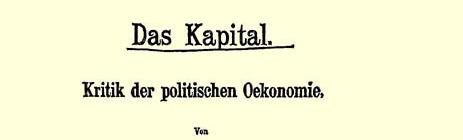
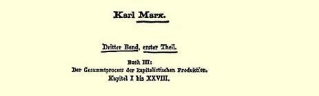
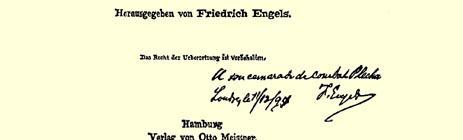

说出了痛苦的但是必然的真理。这比他的反对者的机会主义更加适时[^1]。

#### 忠实于您的弗·恩·

请注意地址的改变。

### １８０

## 致弗里德里希·阿道夫·左尔格

### 霍布根

> １８９４年１２月１２日于伦敦

亲爱的左尔格：

今天用挂号印刷品邮件寄给你一本马克思的《资本论》第三卷，希望你能收到。

小威廉[^2]竟让追究我们在**帝国国会**里的人坐着不动２７８便是 “侮辱陛下”，我真想不通我们为什么该享受这种不适称的荣幸。给我们效劳莫过于此了。小威廉和“越来越疯狂的冯·克勒尔先生”，看来是败坏一切而对我们有利的最搭配的一对。

倍倍尔胜利了。第一，在倍倍尔的文章２７６之后，福尔马尔停止了讨论；第二，他向党的执行委员会提出的申诉已被完全断然驳回；第三，他向党团申诉，但被倍倍尔宣布为不合格的党团承认自己是不合格的；这么一来，问题要提交下届党代表大会审理，那时倍倍尔**肯定**拥有三分之二到四分之三的多数票。

这已是福尔马尔第三次在党内和在巴伐利亚之外争取领导地位了。第一次他要求我们积极支持卡普里维并使自己变成政府社会主义者。２７９第二次说我们应当实行国家社会主义并帮助现今的德意志帝国搞社会主义试验。２８０头两次他都失败了。现在又干。

党团在帝国国会里坐着不动的情景，给法国人留下的印象比党三十年的工作都深刻。老实说，巴黎人—— 我不想说法国人，而只是巴黎人——** 严重地**堕落了。这种说空话和崇拜各种传奇剧式的行为，越来越不可忍受。

愿你和你的夫人健康。

衷心问候你们俩。

#### 你的弗·恩·

为了答谢送给我的《统计调查》１７２，我用挂号印刷品邮件寄给施留特尔一本第三卷[^3]。但是我不知道华盛顿９３５号的地址是否仍然有效，所以我用了《人民报》的地址：纽约市，１５１２号信箱。 是否麻烦你将此事通知他？

> 《资本论》第三卷的扉页，上面有恩格斯给普列汉诺夫的题字

[^1]: 俏皮话：“适时”的原文是《ｌｏｐｐｏｒｔｕｎ》，“机会主义”的原文是《Ｉ’ｏｐｐｏｒｔｕｎｉｓｍｅ》。—— 编者注

[^2]: 威廉二世。—— 编者注

[^3]: 指《资本论》。—— 编者注