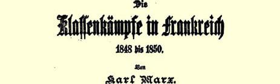
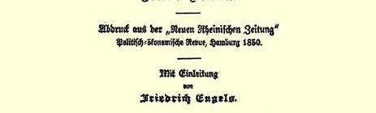
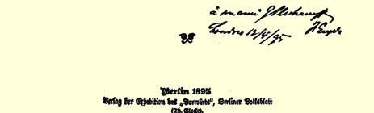

### ２３８

## 致保尔·拉法格

### 勒－佩勒

> １８９５年４月３日于伦敦
>
> 西北区瑞琴特公园路４１号

亲爱的拉法格：

我还没有读完您那半本书２３６就收到了考茨基的《社会主义运动史》３８０第一卷、拉布里奥拉寄来的涉及洛里亚的各种意大利杂志和尼·丹尼尔逊寄来的一大堆俄国杂志。邮包把我埋住了。但我还是把您的书看完了。全书文笔漂亮，历史事例非常鲜明，见解正确并有独到之处，而最大的优点是，它不象德国教授写的书那样：正确的见解不是独到的，独到的见解却不正确。主要的缺点是您似乎结束得太仓促了；这本书的文字，尤其是关于封建的和资本主义的所有制的那几章，可以更严谨些，特别是考虑到巴黎的读者习惯于轻松读物，甚至是适合于懒惰读者的轻松读物；“巴黎人”也是坚持自己的懒惰权３９１的。不少很好的段落可能失去一部分效果，因为它们好象被放在括弧里一样，要么就是因为您过多地让读者自己去作结论和总结。

至于内容本身，我主要对氏族共产主义一章有不同意见。我觉得您过分强调这个阶段**在法国**保留到我们时代的那种形式和这个阶段在这个国家解体的形式。氏族公社在法国借以长期保存下来的ｐａｒ汅ｏｎｎｅｒｉｅ〔土地共同继承〕形式，本身已经是以塞尔维亚和保加利亚的**扎德鲁加**的形式存在到今天的古代**大**家庭公社的一个**分支**。这种形式看来在俄国和德国等国家都先于**农民公社**；斯拉夫的扎德鲁加、德国的家庭公社（阿勒曼尼法３９２中的亲属制度） 解体以后就过渡到了由单个的家庭组成的公社（或者是最早很常见而现在在俄国还有的ｐａｒ汅ｏｎｎｅｒｉｅｓ），田地**分散耕种**，但必须**定期重新分配**，—— 换句话说，从所有这一切产生了俄国的**村社**和国的**马尔克公社**。在法国保存下来的范围更狭小的由几个家庭组成的公社，在我看来只是马尔克公社的组成部分，至少在北部 （**法兰克**地区）是这样；在南部（过去的阿克维塔尼亚）它可能是一种联合体，这种联合体占有土地（土地的最高个人所有者是**领主**），不受农村**公社**的管辖。正是这种纯法兰西的形式可以在解体的时候立即过渡到土地个体所有制。

这是个还需要好好研究的问题。我从您那里了解到法国的氏族共产主义的这种独特性质，既然您全心全意埋头于此，那您就只有把这一很有希望的研究继续下去。[^1]

几个小错误：

第３３８页，使秘鲁导水槽的水**上升**；而秘鲁只是“在山的中心”有水，您的导水槽是专门为了往那里引水而修的，我想那是海水吧？

第３５４页，Ｔｅｒｒａｓａｌｉｃａ。盖拉尔认为这个词来源于ｓａｌａ（房子），这就大错特错了。３９３那就是说，撒利法兰克人是住在房子里的法兰克人？他们叫做ｓａｌｉｅｎｓ，ｓａｌｉｑｕｅｓ〔撒利〕是因为荷兰境内的一个小地区叫做撒兰德，在这里组成了征服比利时以及阿登和卢瓦尔之间的法兰西的集团。这个名称今天也还存在着。在撒利法典 ３９４颁布的时候（约４００年），ｓａｌａ是（您自己也指出了这一点）日耳曼人的**动产**。

第３８６页，“另一种人喜欢下套索和收拾**蝗虫**（ｓａｕｔｅｒｒｅｌｌｅｓ）”。 难道１７８７年在贝里人们还吃蝗虫？—— 我在我的字典里查出： ｓａｕｔｅｒｏｌｌｅ是捕鸟圈套。

第３９３页，“土地平分”—— 俄文ｔｓｃｈｏｒｎｏｌ[^2]，黑色的，用作 **肮脏的**，以及人民的、一般的、普通的意思。Ｔｓｃｈｏｒｎｏｌｎａｒｏｄ[^3]， ｌｅｐｅｕｐｌｅｎｏｉｒ＝人民群众，“老百姓”。Ｔｓｃｈｏｒｎｏｌｐｅｒｅｄｉｅｌ[^4]，ｌｅ ｐａｒｔａｇｅ ｎｏｉｒ，意思更象是指普遍的、全体的、所有的人直到最穷的人都参加的分配。瑞士的一家**民粹派**（民粹派—— 农民之友）报纸就是在这个意义上取名为《土地平分社》，这里的含义应该是农民平分**贵族的领地**。

这就是我看到的全部问题，而对您来说，这就够了。至于伊夫·居奥，我就不予过问了。

李卜克内西刚刚和我开了一个很妙的玩笑。３８８他从我给马克思关于１８４８—１８５０年的法国的几篇文章写的导言中，摘引了所有能为他的、无论如何是和平的和反暴力的策略进行辩护的东西。近来，特别是目前柏林正在准备非常法２７０的时候，他喜欢宣传这个策略。但我谈的这个策略仅仅是针对**今天的德国**，而且**还有重大的附带条件**。对法国、比利时、意大利、奥地利来说，这个策略就不能整个采用。就是对德国，明天它也可能就不适用了。所以我请您等到全篇文章发表后再作评论（文章大概将登在《新时代》 上），我天天等着小册子的样书。可惜李卜克内西看到的只是白或黑，色调的差别对他来说是不存在的。

> 马克思的《１８４８年至１８５０年的法兰西阶级斗争》一书的扉页，
>
> 上面有恩格斯给普列汉诺夫的题字

[^1]: 必须严格分清法国的三个部分：到卢瓦尔河为止的法兰西本部，日耳曼的影响很深；索恩河和罗尼河以东的勃艮第地区，日耳曼化的程度较轻；海和卢瓦尔河以及罗尼河之间的阿克维塔尼亚，日耳曼的影响最少。（恩格斯原注）

[^2]: 这是恩格斯按照俄语发音用拉丁字母拼写的。—— 编者注