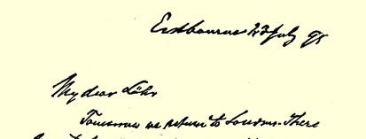
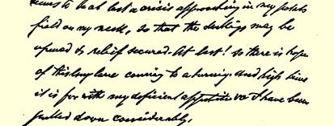
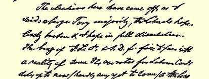
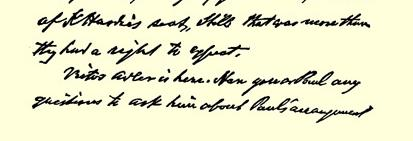
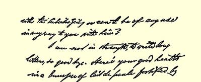
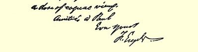

### ２６５

## 致菲力浦·屠拉梯

### 米兰

> １８９５年７月４日于伊斯特勃恩市
>
> 皇家大校场４号

来信收到。

祝您健康。

再见。

#### 弗·恩格斯

### ２６６

## 致安东尼奥·拉布里奥拉

### 罗马

> １８９５年７月８日以前
>
> ［于伊斯特勃恩］

全部都很好，只不过有几处事实稍有出入，开头部分的一些用语有些费解。很希望看到其余的全部。４２３

> 恩格斯１８９５年７月２３日给劳拉·拉法格的信
>
> （恩格斯的最后一封亲笔信）
>
> （第一页）

> 恩格斯１８９５年７月２３日给劳拉·拉法格的信
>
> （恩格斯的最后一封亲笔信）
>
> （第二页）