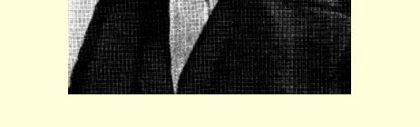
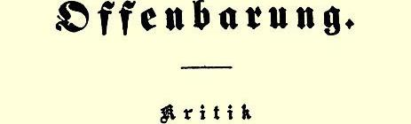
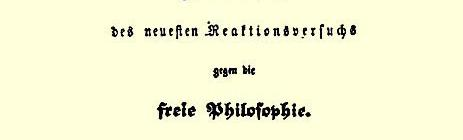
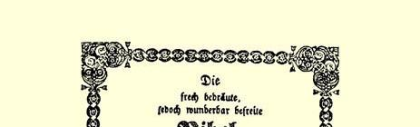
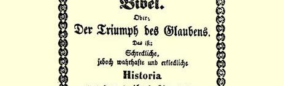
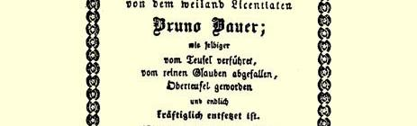
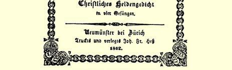

## 说明

本卷收入了恩格斯早期的著作、书信和文学习作等。全书共分四部分。第一部分是１８３８年至１８４４年的著作；第二部分是１８３８ 年至１８４２年的书信；第三部分是１８３３年至１８４１年的几篇文学习作；第四部分是附录。这些著述和书信是对《马克思恩格斯全集》第一卷和第二十七卷的补充。它们反映出青年恩格斯的思想政治观点发展的过程，他在１８４４年同马克思合作以前从唯心主义转向唯物主义、从革命民主主义转向共产主义的初步过程。

恩格斯从十八岁起就开始为一些报刊撰稿，发表了不少通讯、 政论文章、文学评论、哲学论述以及诗歌等等。《贝都英人》这首诗， 是恩格斯第一次发表的作品（写于１８３８年９月），诗中闪耀着作者憧憬自由的精神。

１８３９年春天，恩格斯感到“青年德意志”作家们提出的关于实行宪政、出版自由、反对宗教强制、妇女解放等要求，同他自己爱好自由的思想是相通的。他开始为“青年德意志”运动的机关报《德意志电讯》撰稿。《乌培河谷来信》（见《马克思恩格斯全集》中文版第一卷）是他撰写的第一篇政论文章。他在《德国民间故事书》一文中提出文学要用来教育人民群众的思想，反对文学纵容伪善、对贵族卑躬屈膝、姑息虔诚主义。他指出民间故事书的使命是：适应自己的时代，使人民有明确的道德感，意识到自己的力量、自己的权利和自己的自由，激发人民的勇气和唤起对祖国的热爱。

以后，恩格斯又相继撰写了《卡尔·倍克》、《普拉滕》、《伊默曼的〈回忆录〉》等文章。这些文章表明恩格斯已经意识到文学同社会生活的关系。他在谈到卡·倍克的诗歌时，强调指出诗歌的特征不应当是表现无益的悲伤厌世的情绪，而应当为争取自由，反对专制制度进行斗争。他对于这种“时髦的”悲观主义曾不止一次地加以嘲笑。他在１８４０年３月至５月写的《现代文学生活》中日益明显地表现出对“青年德意志”运动的批判。他指出“青年德意志”的作家思想上不统一，彼此之间进行无原则的争论。

恩格斯于１８３９年秋后，开始自修黑格尔的哲学。他如饥似渴地读了黑格尔的《历史哲学》，并且注意从黑格尔的博大精深的体系中汲取精华。从《时代的倒退征兆》这篇文章中可以看出，恩格斯比黑格尔前进了一步。黑格尔认为历史发展的进程到君主立宪制就结束了，而恩格斯则把历史的进程比作螺线。他认为螺线在运行时不时擦过自己的旧路程，又不时穿过旧路程，每转一圈就更接近于无限。他坚持历史是不会停滞不动的，不会是旧事物的简单重复，人类的进步是无止境的。

１８４０年４月发表的恩格斯的《为德国〈贵族报〉作的追思弥撒》反映出他接受了黑格尔关于世界历史是自由概念的实现这一思想，同时表明他不同意黑格尔的等级观点。例如，他嘲笑《贵族报》提出的“贵族应该打仗，市民应该思考，农民应该种田”的反动等级制思想。他坚决抨击维护等级制和贵族特权的德国封建君主立宪制度。

《恩斯特·莫里茨·阿伦特》这篇文章表明恩格斯在思想上、 政治上更趋激进，革命民主主义的思想日益坚定。他赞扬了阿伦特这一代爱国者在反对拿破仑的解放斗争中所起的作用，同时坚决谴责德国贵族们对十八世纪法国资产阶级革命的民主主义原则所抱的褊狭的仇恨心理—— 条顿狂。他以较多的篇幅分析了条顿狂的民族局限性，他深刻地指出，条顿狂由于力图使德国摆脱一切外来的政治、精神和道德的影响，而把德意志民族拖进了民族偏见的死胡同。条顿狂的“整个世界观在哲学上是站不住脚的，因为按照这种观点，整个世界就是为德国人创造的，而德国人自己早就达到了发展的最高阶段”。他强调民族平等，认为每一个民族都对世界文明作出过自己的贡献。恩格斯在批判这种把德意志民族置于同其他民族对立的地位的做法时，也注意批评那种无视民族差别、民族利益和民族要求的世界自由主义倾向。此外，恩格斯在文章中还提出了在德国进行民主改革的纲领（见本卷第１５９—１６０页）。

１８４１年秋，恩格斯在柏林服兵役，同时作为旁听生在柏林大学听哲学课。当时，柏林是不同哲学派别的斗争场所。恩格斯参加了激进的青年黑格尔派的柏林小组。不久，他就积极投入了在柏林开展的激烈的思想争论，主要是反对谢林哲学的争论。谢林当时在思想上、政治上已经转到右翼，在哲学上宣扬神秘主义的反动“启示哲学”，并接受普鲁士国王的聘请，到柏林大学讲学。

恩格斯这段时期主要是针对谢林的哲学，先后发表了《谢林论黑格尔》、《谢林和启示》以及《谢林—— 基督哲学家》等三篇论文。 恩格斯在前两篇著作中，满腔义愤地揭露谢林妄想贬低黑格尔哲学的企图。他既维护黑格尔哲学的进步方面，也指出黑格尔的“非静止的辩证法”同他那带有复辟时期烙印的政治观点之间的矛盾 （见本卷第２１１—２１２页），指出黑格尔的哲学，正如他自己曾经断言的，“只不过是在思想上反映出来的时代内容”。这时，恩格斯在布鲁诺·鲍威尔有关早期基督教史的许多著作以及费尔巴哈著作的影响下，已经彻底摆脱了传统的宗教观，站在激进的无神论立场，批判了谢林晚期哲学中反动的宗教神秘主义。他在《谢林和启示》一文中指出，谢林在柏林大学讲课的内容是“自从１８３１年以来就以同样的方式”在慕尼黑宣讲过的启示哲学，是“源远流长”的神话哲学。他揭示出谢林的思维方式缺乏逻辑性，谢林的学说缺乏牢固的基础，时而在随心所欲的、没有意义的思维中寻求支持，时而在毫不真实的、遭到批驳的神的启示中寻求支持。恩格斯称这种学说是“撒但学”，即魔鬼学。在《谢林—— 基督哲学家》一文中，恩格斯摹拟基督教徒的口吻，以辛辣的笔触批判谢林把科学同宗教信仰调和起来，讥笑谢林是基督哲学家，指出谢林为普鲁士专制制度的需要而维护自己的体系，使自己的哲学成了神学的奴仆。

总的说来，恩格斯这时还是站在黑格尔哲学的唯心主义立场上的。但是，由于受费尔巴哈《基督教的本质》一书的影响，他在谈到理性同自然的关系时已经含有唯物主义的因素。

恩格斯在柏林期间还同埃·鲍威尔合写了论战性的讽刺长诗 《横遭灾祸但又奇迹般地得救的圣经》，积极参加了反对宗教蒙昧主义、反对普鲁士的神学教授的斗争。与此同时，恩格斯已经感到青年黑格尔派中不少成员多尚革命空谈，不能把理论同实践结合起来。他认为，仅仅进行理论批判是不够的，还必须进行从根本上改革现存社会制度的实际斗争。从这首长诗中可以看出，恩格斯对当时真正具有革命民主主义倾向的思想家是另眼看待的。例如，他在诗中对还没有见过面的青年马克思的描述就给人以深刻的印象 （见本卷第３６３—３６４页）。

１８４２年春，恩格斯陆续为《莱茵报》撰写了许多篇文章，如《北德意志自由主义和南德意志自由主义》、《一个旁听生的日记》、《时文评注》、《普鲁士出版法批判》。这些文章表明恩格斯同“青年德意志”运动已经彻底决裂，坚决主张改革现存社会制度，维护言论出版自由，反对自由派的保守思想。

１８４２年秋天发表的恩格斯《集权和自由》一文，表明恩格斯坚信自由主义思想有其局限性，他认为这种自由主义无论对德国以至对欧洲各国都是有害的。他在文章中强烈反对基佐政府践踏人民主权、出版自由、司法独立等原则，他历史地分析了官僚集权同专制国家的联系，说明了集权和自由的关系。

本卷第一部分以１８４４年恩格斯给《新道德世界》编辑的两封信作为结束。这时，恩格斯的思想经历了从唯心主义转向唯物主义、从革命民主主义转向共产主义的发展过程，已经初步站到了唯物主义和共产主义的立场上。

本卷第二部分是恩格斯给同学格雷培兄弟、妹妹玛丽亚以及作家莱文·许金的书信，约占全书三分之一篇幅。从这些书信中可以看出，青年恩格斯的精神世界十分丰富，他思想敏锐活泼，对生活有广泛的兴趣，对文学艺术有强烈的爱好。

从恩格斯给格雷培兄弟的书信中，我们看到恩格斯为了寻求真理、摆脱自幼接受的传统宗教观念的束缚，怎样通过阅读神学、 基督教史等著作，特别是阅读大卫·施特劳斯《耶稣传》这本书，通过同格雷培兄弟的讨论、探索，终于认识到，宗教信仰原来就象海绵一样漏洞百出，圣经中存在着无法解决的矛盾，信仰和理性是不相容的。

恩格斯在书信中，比较自由地谈论自己的思想政治观点的发展，表述自己的革命情绪。他向格雷培兄弟谈述自己对“青年德意志”作家们的看法，对施特劳斯、黑格尔等人的学说的认识。他毫不隐讳地表示对普鲁士专制制度的仇恨。他坦率地表明他对革命在改造社会中的作用的认识。他在１８３９年底—１８４０年初的一封信中写道：“我可以给你讲一大堆关于国君爱自己臣民这一主题的滑稽故事。只有国君被人民打了耳光而脑袋嗡嗡响时，只有他的宫殿的窗户被革命的鹅卵石砸得粉碎时，我才能期待国君做些好事。” （见本卷第５５０页）

恩格斯１８３８年至１８４２年的书信，使我们看到他爱好文学，博览群书，好学不倦。他喜欢写诗，有的诗还具有革命意义。如１８３９ 年夏天，恩格斯在给弗·格雷培的信中就写了一首纪念１８３０年法国七月革命的诗，歌颂人民的力量。恩格斯还翻译诗。他给作家莱文·许金的信中，曾谈到出版英国诗人雪莱诗作译文的计划。但是这个计划未能实现。

从恩格斯给妹妹玛丽亚的书信中，我们还看到他酷爱音乐，甚至尝试谱曲。他对贝多芬的交响乐更是推崇备至（见本卷第５９５ 页）。

青年恩格斯在语言学方面的非凡才智，在书信中也表现得很突出。当时，他已通晓多种外语。１８３９年４月底，恩格斯在给威· 格雷培的一封信中就使用了九种文字（见本卷第４８７—４９２页）。

这些书信使我们能具体地了解青年恩格斯热爱生活的性格。 他对骑马、击剑、游泳、旅行等活动无不爱好。书信中的不少插画， 说明他对绘画也很有兴趣。

本卷第三部分把恩格斯的早期文学习作，作为遗稿收入。它们在一定程度上反映出恩格斯早期在文学创作上的尝试。在《科拉· 迪·里恩齐》这一未完成的歌剧手稿中，可以看出恩格斯在探索如何歌颂人民的力量。

第四部分收入的传记材料，有助于我们了解恩格斯青少年时代生活和学习的情况。

本卷以《马克思恩格斯全集》俄文第二版第四十一卷为依据， 一部分著作是根据原文译校的。

##### 中共中央马克思恩格斯列宁斯大林著作编译局

## 目录

> 说明
>
> ……………………………………………………………………—

#### 弗·恩格斯著作

##### （１８３８—１８４４年） 贝都英人…………………………………………………………………３—５ 致敌人……………………………………………………………………６—７ 《致市信使报》………………………………………………………………８ 给龙克尔博士的公开信……………………………………………９—１０ 弗·威·克鲁马赫尔关于约书亚的讲道……………………………１１ 寄自爱北斐特…………………………………………………………１２—１３ 德国民间故事书……………………………………………………１４—２３ 卡尔·倍克……………………………………………………………２４—３０ 时代的倒退征兆……………………………………………………３１—３７ 普拉滕…………………………………………………………………３８—４０ 咏印刷术的发明……………………………………………………４１—５０ 约艾尔·雅科比……………………………………………………５１—５４ 为德国《贵族报》作的追思弥撒…………………………………５５—６０ 现代文学生活…………………………………………………………６１—８９

> 剧作家卡尔·谷兹科夫…………………………………………６１
>
> 现代的论战………………………………………………………７４ 关于阿纳斯塔西乌斯·格律恩………………………………………９０ 风景……………………………………………………………………９１—９９ 不来梅通讯…………………………………………………………１００—１０５
>
> 剧院。出版节…………………………………………………………１００
>
> 刊物……………………………………………………………………１０３

黄昏…………………………………………………………………１０６—１１３ 不来梅通讯…………………………………………………………１１４—１２３

> 不来梅港纪行…………………………………………………………１１４

弗·威·克鲁马赫尔的两篇讲道稿…………………………１２４—１２５ 悼伊默曼之死………………………………………………………１２６—１２９ 不来梅通讯…………………………………………………………１３０—１３５

> 唯理论和虔诚主义……………………………………………………１３０
>
> 航行规划。剧院。军事演习…………………………………………１３３

圣海伦岛……………………………………………………………１３６—１３７ 齐格弗里特的故乡………………………………………………１３８—１４３ 恩斯特·莫里茨·阿伦特………………………………………１４４—１６０ 夜行…………………………………………………………………１６１—１６３ 皇帝遗骸的迁葬…………………………………………………１６４—１６６ 伊默曼的《回忆录》………………………………………………１６７—１７６ 不来梅通讯…………………………………………………………１７７—１８３

> 教会论争………………………………………………………………１７７
>
> 和文学的关系。音乐…………………………………………………１８１
>
> 低地德意志方言………………………………………………………１８２

漫游伦巴第…………………………………………………………１８４—１９６

> 翻越阿尔卑斯山！………………………………………………１８４ 谢林论黑格尔………………………………………………………１９７—２０５ 谢林和启示…………………………………………………………２０６—２６９ 谢林—— 基督哲学家，或世俗智慧变为上帝智慧…………２７０—２９３ 北德意志自由主义和南德意志自由主义……………………２９４—２９７ 一个旁听生的日记………………………………………………２９８—３０４
>
> ………………………………………………………………………２９８
>
> ………………………………………………………………………３０１

莱茵省的节日………………………………………………………３０５—３０７ 时文评注……………………………………………………………３０８—３１２ 同莱奥论战…………………………………………………………３１３—３１６ 参加巴登议会的辩论……………………………………………３１７—３１８ 《施本纳报》的自由思想…………………………………………３１９—３２０ 《刑法报》停刊………………………………………………………３２１—３２２ 普鲁士出版法批判………………………………………………３２３—３３１ 横遭灾祸但又奇迹般地得救的圣经，或信仰的胜利………………………………………………………………３３２—３８７

> 第一章…………………………………………………………………３３２
>
> 第二章…………………………………………………………………３４９
>
> 第三章…………………………………………………………………３６０
>
> 第四章…………………………………………………………………３７５

弗·威·安德烈埃和《德国的高等贵族》……………………３８８—３８９ 柏林杂记……………………………………………………………３９０—３９１ 集权和自由…………………………………………………………３９２—３９７ 《泰晤士报》论德国共产主义３９８—４０２ 法国共产主义……………………………………………………………４０３

#### 弗·恩格斯书信

##### （１８３８—１８４２年） １８３８年 １．致玛丽亚·恩格斯（８月２８—２９日）………………………………４０７ ２．致弗里德里希·格雷培和威廉·格雷培

> （９月１日）………………………………………………………………４１１

３．致玛丽亚·恩格斯（９月１１日）……………………………………４１３ ４．致弗里德里希·格雷培和威廉·格雷培

> （９月１７—１８日）………………………………………………………４１６

５．致玛丽亚·恩格斯（１０月９—１０日）………………………………４２６ ６．致玛丽亚·恩格斯（１１月１３日）…………………………………４３０ ７．致玛丽亚·恩格斯（１２月底）………………………………………４３２

##### １８３９年 ８．致玛丽亚·恩格斯（１月７日）……………………………………４３４ ９．致弗里德里希·格雷培（１月２０日）……………………………４３７ １０．致弗里德里希·格雷培（２月１９日）……………………………４４７ １１．致海尔曼·恩格斯（３月１１—１２日）………………………………４５２ １２．致玛丽亚·恩格斯（３月１２日）……………………………………４５３ １３．致弗里德里希·格雷培（４月８—９日）…………………………４５５ １４．致玛丽亚·恩格斯（４月１０日）……………………………………４６０ １５．致弗里德里希·格雷培（４月２３日左右—５月１日）……………４６２ １６．致玛丽亚·恩格斯（４月２８日）……………………………………４８１ １７．致威廉·格雷培（４月２８日左右—３０日）…………………………４８７ １８．致玛丽亚·恩格斯（５月２３日）……………………………………４９３ １９．致威廉·格雷培（５月２４日—６月１５日）…………………………４９４ ２０．致弗里德里希·格雷培（６月１５日）……………………………４９９ ２１．致弗里德里希·格雷培（７月１２—２７日）………………………５０４ ２２．致弗里德里希·格雷培（７月底或８月初）………………………５１２ ２３．致威廉·格雷培（７月３０日）………………………………………５１４ ２４．致玛丽亚·恩格斯（９月２８日）……………………………………５２０ ２５．致威廉·格雷培（１０月８日）………………………………………５２２ ２６．致威廉·格雷培（１０月２０—２１日）………………………………５２６ ２７．致弗里德里希·格雷培（１０月２９日）……………………………５２８ ２８．致威廉·格雷培（１１月１３—２０日）………………………………５３５ ２９．致弗里德里希·格雷培（１８３９年１２月９日—

> １８４０年２月５日）………………………………………………………５４２

##### １８４０年 ３０．致莱文·许金（６月１８日）…………………………………………５５１ ３１．致莱文·许金（７月２日）……………………………………………５５３ ３２．致玛丽亚·恩格斯（７月７—９日）…………………………………５５６ ３３．致玛丽亚·恩格斯（８月４日）……………………………………５５９ ３４．致玛丽亚·恩格斯（８月２０—２５日）………………………………５６２ ３５．致玛丽亚·恩格斯（９月１８—１９日）………………………………５６７ ３６．致玛丽亚·恩格斯（１０月２９日）…………………………………５７０ ３７．致威廉·格雷培（１１月２０日）……………………………………５７４ ３８．致玛丽亚·恩格斯（１２月６—９日）………………………………５７８ ３９．致玛丽亚·恩格斯（１２月２１—２８日）……………………………５８２

##### １８４１年 ４０．致玛丽亚·恩格斯（２月１８日）……………………………………５８６ ４１．致弗里德里希·格雷培（２月２２日）……………………………５８９ ４２．致玛丽亚·恩格斯（３月８—１１日）………………………………５９３ ４３．致玛丽亚·恩格斯（４月５日）……………………………………５９６ ４４．致玛丽亚·恩格斯（约５月初）……………………………………５９７ ４５．致玛丽亚·恩格斯（约８月底）……………………………………５９９ ４６．致玛丽亚·恩格斯（９月９日）……………………………………６００

##### １８４２年 ４７．致玛丽亚·恩格斯（１月５—６日）…………………………………６０２ ４８．致玛丽亚·恩格斯（４月１４—１６日）………………………………６０６ ４９．致玛丽亚·恩格斯（夏）……………………………………………６０９ ５０．致玛丽亚·恩格斯（７月２日）……………………………………６１０ ５１．致玛丽亚·恩格斯（８月２—８日）…………………………………６１２

#### 弗·恩格斯的遗稿

##### （１８３３—１８４１年早期文学、诗歌和剧本习作） 献给我的外祖父…………………………………………………………６２６ １８３６年的诗………………………………………………………６２４—６２５ 约写于１８３７年初的诗……………………………………………６２６—６２７ 海盗的故事…………………………………………………………６２８—６４３ 伊托克列斯和波吕涅克斯决斗………………………………６４４—６４７ 科拉·迪·里恩齐………………………………………………６４８—６８３

#### 附录

> 弗里德里希·恩格斯出生证明书…………………………………………６８７ 弗里德里希·恩格斯受洗证明书…………………………………………６８８ 老弗里德里希·恩格斯致伊丽莎白·恩格斯 （１８３５年８月２７日）………………………………………………６８９—６９１ 中学高年级学生弗里德里希·恩格斯的肄业证书…………………６９２—６９３ 一年制志愿兵弗里德里希·恩格斯的品行证书…………………………６９４ 注释…………………………………………………………………６９７—７３５ 人名索引……………………………………………………………７３６—７７０ 期刊索引……………………………………………………………７７１—７７５

#### 插图

> 弗里德里希·恩格斯（四十年代中） 小册子《谢林和启示》的扉页………………………………………………２０７ 小册子《横遭灾祸但又奇迹般地得救的圣经，或信仰的胜利》的封面……………………………………………………………３３３

弗·恩格斯诗剧《科拉·迪·里恩齐》手稿的一页………………６５６—６５７

# 弗·恩格斯著作

## （１８３８—１８４４年）

# 贝都英人

# 贝都英人１

铃声一响，

丝幕徐升；

人人凝神静等，

鸦雀无声。

科采布今天没来

逗引诸位发出隆隆的笑声，

席勒这回也不登台

倾吐玉语金声。

沙漠之子骄傲而自由，

到这儿来为诸位解闷，

他们的豪情和自由，

恰似春梦无痕。

他们跳舞是为了挣钱，

少年就这样在沙漠欢跳，

所有的人都默默无言，

只有一个人歌声哀哀。

观众拍手不已，

昨天科采布在这里插科打诨，

今天人们又在这里，

向贝都英人报以雷鸣般的掌声。

沙漠之子敏捷而矫健，

你们顶着正午的炎炎烈日，

穿过摩洛哥的漠漠沙土，

走遍温和的海枣山谷！

你们驰入比莱德－杰里德[^1]，

穿越那里的园庭。

勇敢地去袭击，

战马踩征尘！

你们沐浴着月光，

坐在棕榈树的清泉旁，

听一张可爱的嘴，

为你们编出美妙故事的彩色花环。

你们安睡在狭窄的帐幕里，

寻求好梦于爱的怀抱，

直到天际出现晨曦，

骆驼叫声阵阵！

他们跳舞是为了挣钱，

不是为了自然的迫切要求，

无怪乎你们目光黯淡，默默无言，

只有一个人歌声哀哀。

> 弗·恩格斯写于１８３８年９月上半月原文是德文载于１８３８年９月１６日《不来梅杂谈》 杂志第４０期，未署名

# 致敌人

> ２

难道你们不能把真话

注入心田，

让真话不受恶意摧残，

自由发展？

我看你们歪曲思想，

确实内行；

你们可以善恶不分，

但要以恶为善却是妄想！

你们常常咒骂别人，

决无好处，

获得荣誉靠的是劳动，

而非对别人的凌辱！

你们想飞黄腾达？

那就请拿出意志、力量和智慧，

步人后尘却又蔑视人，

不会捞到半点油水！

说吧，不论你们设下多少圈套，

《信使报》[^2]岂会迷航改道？

还是让它走自己的路，

把消息传递到各处！

真理永远是真理，

真理比谎言更有力，

俗话说得好：

“真话自能服人！”

> 弗·恩格斯写于１８３９年２月２４日左右原文是德文载于１８３９年２月２４日《不来梅市信使报》 第４号署名：泰奥多尔·希·

# 《致市信使报》

> ３

喂，《信使报》，听我说，别气恼：

我曾长时间把你讥诮；

你活该受到我的嘲笑，

朋友，你本来就是个大草包。

从你开始写报道，

乌云就在你头上笼罩；

你自己讲过的话儿，

我还要你细细咀嚼。

如果我需要题材，

亲爱的，我就从你那里索讨，

用你的话编成打油诗，

又在字里行间把你讥笑。

只要去掉韵脚，抛开格律，

就能认出你的面貌。

如果你现在怒火中烧，

就请咒骂随时准备为你效劳的

#### 希尔德布兰特。

> 写于１８３９年４月２７日左右原文是德文载于１８３９年４月２７日《不来梅杂谈报》 第３４号署名：泰奥多尔·希尔德布兰特

# ［给龙克尔博士的公开信］

> ４

**爱北斐特**５月６日。**致爱北斐特的龙克尔博士先生**。您在贵报激烈地攻击我和我的《乌培河谷来信》。您指责我蓄意歪曲事实、不了解情况，指责我进行人身攻击、甚至说谎。您称我为青年德意志派５，这我并不介意，因为我不同意您对青年文学的种种责难，而且我没有荣幸属于青年文学。到目前为止我只是把您当作一位作家和政论家来尊敬，并且在该文的第二篇中表明了这一看法，而对您发表在《莱茵音乐堂》的诗则故守缄默，因为我实在无法赞扬这些诗６。可以指责任何一个作者蓄意歪曲事实，但这通常都是当作者的叙述不符合读者的偏见时的做法。您为什么拿不出一件事实来证明？至于说不了解情况，那么，我要是不知道这句空话在缺乏更令人信服的论据时已成为多么通用的辞令，我根本想不到会有这样的指责。我在乌培河谷度过的时间大概比您多一倍； 我在爱北斐特和巴门住过，并且具备了十分有利的条件去仔细观察各阶层的生活。

龙克尔先生，我丝毫不象您所指责的那样，有想成为天才的奢望。但是，确实需要有特殊的蠢才，才能做到在这样的环境中而不了解情况，特别是当一个人很想了解情况的时候就更需要有这样的蠢才。人身攻击吗？传教士、教师和作家一样，也是社会活动家，您是否也要把转述他们的公开讲演叫作人身攻击呢？我在什么地方谈过私人的事情，而且还是那些一提起来便要我说出自己名字的事情？我在什么地方嘲笑过私人的事情？至于硬说我杜撰捏造，那么，不管我多么想避免任何争论，甚至想避免任何争吵，我都不得不要求您—— 为了既不损害《电讯》[^3]的声誉，也不损害我这个匿名作者的名誉—— 从“大量的错误”中哪怕指出一个错误也行。说实话，文章中的确有两个错误：没有逐字逐句引用施梯尔改写的诗７；有关埃根先生的旅行并非如此之糟。但务请您把第三个错误指出来吧！其次，您说我一点儿也没有指出该地光明的一面。 这是对的。就局部而言，我承认各方面都有好的东西（我只是没有描述施梯尔先生在神学方面的重要性，对此我感到十分遗憾），但是，在总的方面，我找不到一件完全光明的事物，这种完全光明的事物，我同样期待您来描述。因此，我也不想说，红色的乌培河在巴门附近又变得清澈了。这毕竟是无稽之谈：难道乌培河往山上流吗？最后，请您在读完全文以后再作判断，而且今后要逐字引用但丁的话，否则就根本不要引用。他所说的不是“这里是走进无穷的痛苦的入口”，而是“通过我走进无穷的痛苦”（《地狱》第３篇第２行）。[^4]

#### 《乌培河谷来信》作者

> 弗·恩格斯写于１８３９年５月６日原文是德文载于１８３９年５月９日《爱北斐特日报》 第１２７号

# ［弗·威·克鲁马赫尔关于约书亚的讲道］

约书亚记第十章第十二节和第十三节[^5]中谈到约书亚使日头停留。克鲁马赫尔不久前在爱北斐特的一次讲道中就此发表了颇为有趣的论断，说所有虔诚的基督教徒即选民都不应该根据这一说法就认为似乎约书亚迎合了百姓的看法，而是必须相信**地球是不动的**，**太阳围绕地球旋转**。为了证实自己的论断，他宣称整本圣经都是这样说的。选民要欣然把世人因此会给他们扣上的傻瓜帽子连同那许多已被他们接受了的一起装进口袋。

我们将乐于接受对这一来源确凿的可悲的轶闻提出的反驳。

> 弗·恩格斯写于１８３９年５月原文是德文载于１８３９年５月《德意志电讯》杂志第８４期，未署名

# 寄自爱北斐特

从某个时候起人们就发出怨言，痛苦地抱怨怀疑论的可悲的作用；到处都忧郁地注视着业已崩溃的旧信仰的大厦，忐忑不安地期望着遮住未来天国的乌云赶快消散。我也怀着同样忧郁的心情放下手中的《亡友之歌》８。这是一个已故的、真正的乌培河谷基督教徒的诗歌。诗中缅怀幸福的时刻，那时对于一种在目前看来其矛盾已了如指掌的学说还可以抱有幼稚的信仰；那时宗教的自由思想遇到的是使人发笑或者羞得脸红的神圣的激动。—— 诗集的印刷地点本身就证明不能用一般标准去对待这些诗，诗中找不到闪光的思想，找不到热情奔放的自由精神。甚至除了虔诚主义９的果实以外，对它要求其他任何东西都是不对的。—— 昔日的乌培河谷文学已经为这些诗规定了唯一正确的范围；关于乌培河谷文学，我已经充分发泄了自己的愤怒之情１０，但愿这次能以新的态度对待它的一部作品。不可否认，这本诗集表现了一定的进步。 这些诗尽管看来是出自一个受教育不多的世俗人之手，但至少在内容上并不比传教士德林和保尔的诗逊色，有时甚至可以感到一丝浪漫主义的气息，可以同加尔文教教义１１并驾齐驱。至于形式， 无可争辩，这些诗是迄今为止乌培河谷所提供的最佳作品；常常碰到颇具匠心的新颖或罕见的韵脚；作者甚至达到了二行诗和自由颂诗的高度。不过，这种体裁对他来说未免太高级了。克鲁马赫尔[^6]的影响是无可怀疑的；到处都运用他的语汇和隐喻。但是， 当诗人吟道：

**朝圣者**：基督羊群中可怜的羔羊啊，

> 在你身上看不到基督的华丽装饰，
>
> 可是你，羔羊啊，是那样温顺！
>
> **羔 羊**：我在这里受苦的时光不长，
>
> 就要升入极乐的天堂；
>
> 别作声，朝圣者，做一只驯服的羔羊，
>
> 躬身走进那狭窄的门，
>
> 别作声，虔心祈祷，做一只驯服的羔羊！

这已经不是仿效克鲁马赫尔，而就是他自身了！然而这些诗中有个别地方由于感情真挚而使读者感动，—— 但是，哦，决不要忘记，这种感情多半是病态的！就是在这里也暴露出当宗教真正成为心灵的事业时，即使在痛苦绝望的边缘，它也处处起着使人刚强和令人宽慰的作用。

亲爱的读者，请原谅我用一本可能你认为索然无味的书打扰了你。你不是在乌培河谷出生，你也许从未攀登过那里的山峦并俯瞰过你脚下的那两座城市[^7]。但是，你毕竟也有故乡，也许在对故乡的全部缺点倾泄了自己的愤怒之余，也会象我一样热爱她那些很一般的特色。

> 弗·恩格斯写于１８３９年秋原文是德文载于１８３９年１１月《德意志电讯》杂志第１７８期署名：Ｓ．奥斯渥特

# 德国民间故事书

一本书能被称为民间故事书，称为德国民间故事书，这难道不是对它的高度赞扬吗？但是，正因为如此，我们就有权对这类书寄予更大的希望；也正因为如此，这类书就应当满足一切合理的要求并且在各个方面都称得上是尽善尽美的。民间故事书的使命是使农民在繁重的劳动之余，傍晚疲惫地回到家里时消遣解闷，振奋精神，得到慰藉，使他忘却劳累，把他那块贫瘠的田地变成芳香馥郁的花园；它的使命是把工匠的作坊和可怜的徒工的简陋阁楼变幻成诗的世界和金碧辉煌的宫殿，把他那身体粗壮的情人变成体态优美的公主。但是民间故事书还有一个使命，这就是同圣经一样使农民有明确的道德感，使他意识到自己的力量、自己的权利和自己的自由，激发他的勇气并唤起他对祖国的热爱。

因此，一般说来，如果我们可以正当地要求民间故事书内容应富有诗意、饶有谐趣和道德的纯洁，要求德国民间故事书具有健康的、真实的**德意志**精神，即具有一切时代所共有的特点，那么， 我们也还有权要求民间故事书适应自己的时代，否则它就不成其为民间的了。如果我们着重考察一下目前的状况，考察一下造成当代一切现象的争取自由的斗争，即日益发展的立宪主义，对贵族压迫的反抗，智慧同虔诚主义９的斗争，乐观精神同阴郁的禁欲主义残余的斗争，那么，我就看不出我们为什么不该要求民间故事书在这方面帮助没有文化教养的人，向他们指出—— 自然不能采取直接推论的方式—— 这些动向的真实性和合理性，而决不是去纵容伪善，鼓励人们对贵族卑躬屈膝，姑息虔诚主义。但是，不言而喻，民间故事书对那些在今天看来毫无意义或者甚至是错误的旧时代的习俗是不相容的。

我们可以而且也有必要根据上述原则来评价目前真正是德国的民间故事书以及通常统称为德国民间故事书的书籍。这类书一部分是中世纪日耳曼语族的或罗马语族的诗歌的产物，一部分是民间迷信的产物。它们起初遭到上等阶层蔑视、嘲笑，后来，如所周知，由浪漫主义作家发掘出来，进行改写甚至加以颂扬。但是，浪漫主义作家看到的仅仅是诗的内容，而对它们作为民间故事书所具有的意义毫无认识，这一点**哥雷斯**在论述这个问题的著作１２中已经指明了。还是在最近我们才弄明白：哥雷斯的全部评价都是**幻想的结果**。虽然如此，但对这些书的习惯看法仍然以他那本书作为依据，连**马尔巴赫**在他的出版说明里所依据的也是这种看法。鉴于这些民间故事书最近有三种改写本，即马尔巴赫的散文体、**济姆罗克** 的散文体和诗歌体，而其中两种还是供大众阅读的，这就需要对这些改写本的主题再认真审查一下它们对人民的意义。１３

当评价整个中世纪诗歌时，只要还存在重大的分歧，就必须让每个读者去评论这类书的诗的价值；当然，谁也不会否认它们确实具有纯真的诗意。所以，即使这些书不能被公认为民间故事书，它们的诗的内容总会完整无损地保存下来，何况照席勒的话说：

> 诗歌里永远不朽的东西，

在生活中注定要灭亡[^8]， 也许有些诗人会找个理由，用改写的方法为诗歌保存那种在人民中间不能持久的东西。

在源于日耳曼语族的故事和源于罗马语族的故事之间，有一个很明显的区别：日耳曼语族的故事是真正的民间传说，突出的是积极活动的男人；罗马语族的故事所突出的是女人—— 不是受凌辱的女人（如盖诺费法），便是正在恋爱着但对爱的激情抱消极态度的女人。只有《海蒙的儿子》和《福尔土纳特》这两个罗马语族的故事是例外，不过它们也属于民间传说，而《屋大维》和《梅卢齐娜》 等是宫廷诗歌作品，只是由于后来改写成散文，才流传到民间。喜剧作品中，也只有《索洛蒙和莫罗尔夫》不是直接源于日耳曼语族， 而《欧伦施皮格尔》和《席尔达人》等等无疑都是我们的作品。

如果把这类书全部考察一下并根据本文开头提出的原则来评价，那就很清楚，它们只在一个方面符合这些要求：书中诗意盎然， 妙趣横生，而且它们的形式，即使毫无文化教养的人大体上也能完全接受；在其他方面，这些书却根本不能使我们满意。有些书的性质同我们的要求正相反，另一些书只是部分地符合我们的要求。 既然它们是中世纪的作品，自然就完全偏离了我们的时代可能向它们提出的特殊目标。所以不管这个文学部门表面上如何丰富多彩，也不管蒂克和哥雷斯讲得如何头头是道，它们也还有许多有待改进的地方。至于说是否会在将来某个时候填补这个空白，那是另一个问题，我不打算回答。

现在分别谈谈几部作品，可以说，其中最重要的无疑是《***刀枪不入的齐格弗里特的故事*》**。—— 我喜欢这本书。这是一个完美的故事；书中充满了优美的诗意，时而是天真无邪，时而是绝妙的幽默；书中妙语连篇—— 那段描写两个胆小鬼相斗的精彩情节不是脍炙人口吗？书中刻画了一个无所顾忌的具有年轻人朝气的人物，他是任何一个奔走四方的手工业帮工效法的榜样，尽管今天他已经用不着同龙和巨人搏斗了。只要改正印刷错误（我手头的这个版本即科伦版１４印刷错误特别多），校正标点符号，那么，在这个真正的通俗风格的范本面前，施瓦布１５和马尔巴赫的改写本也就黯然失色了。人民对这本书还是表示感激的：在民间故事书中，我没有见过哪本书是象这本书这样的。

《***狮子亨利公爵***》。—— 这本书的老版本可惜我没有找到，在艾恩贝克印刷的新版本１６看来已经完全代替了老版本。书的开头部分是截至１７３５年为止的不伦瑞克世系，接着是根据历史编写的亨利公爵传，然后是民间传说。书中还收进了一篇同狮子亨利这一民间传说相似的描述布尔昂的哥特弗里德的故事，一篇关于奴隶安德罗尼库斯的故事，据说是出自巴勒斯坦修道院院长盖拉齐米之手，其结尾部分改动很大；还有一首是新浪漫派的诗，作者我不记得了，诗中再次重复了关于狮子的传说。由于精明的出版商不惜笔墨大量增补，作为民间故事书基础的传说本身也就失去了本色。传说本身是十分优美的，其余的东西则索然无味，—— 不伦瑞克的历史同士瓦本人有什么关系呢？有了风格朴素的民间故事书，再发表冗长的现代叙事诗还有什么意思呢？就连这种风格也消失了。有一位天才的改写者（我估计他是上一世纪末的一个传教士或教员）这样写道：

> “这样，旅程的目的地已经达到，眼前就是圣地，人们就可以踏上这块同宗教史上最重要的回忆有联系的土地了！热切盼望着这块土地的虔诚纯朴的心灵，在这里变为热烈的祈祷，在这里得到了充分的满足，成了主最大的喜悦。”

应当恢复传说的古老语言，应当增添其他真正的民间传说来充实一本书，然后把它送到人民中间去，这样，传说才能保持它的诗意，而照它现在这种样子是不值得在人民中间流传的。

《***恩斯特大公***》。—— 本书的作者并不是一个特别著名的诗人，因为他的全部诗歌素材都取自东方的童话。不过这本书写得很好，引人入胜，但也仅此而已。由于毕竟不会再有人相信书中那些幻想形象的真实性，这本书在人民手中就原封不动地保存下来了。

现在我要谈谈由德国人民创作并且在创作过程中得到进一步发展的两部传说，各民族的民间诗歌中最深刻的两部传说。我指的是***浮士德***的传说和***永世流浪的犹太人***的传说。它们是取之不尽、用之不竭的传说；每个时代都可以采用它们而不改变其实质； 歌德以后的浮士德传说，也如荷马以后的《伊利亚特》一样，虽然几经改写，总是揭示出某些新的东西，至于亚哈随鲁的传说对于现代诗歌的重要意义，那就不必说了。可是，这两部传说在民间故事书里变成了什么样子呵！它们根本不是自由幻想的作品，不是的，而是奴隶式迷信的产物。永世流浪的犹太人一书甚至要人们对它的内容抱宗教信仰，它试图用圣经和一些荒诞无稽的神话来证明这种信仰是对的；在这本书里，传说只剩下一层最表面的外壳，而里面却包含着关于犹太人亚哈随鲁的冗长枯燥的基督教训诫。浮士德的传说被降低为用一般妖术轶闻进行渲染的陈腐无味的巫婆故事；甚至连民间喜剧里保存下来的那么一点诗意，也几乎绝迹了。这两本书不仅不能使人得到诗的享受，它们现在这种形式只会使旧的迷信死灰复燃、变本加厉，除此之外，对这类鬼玩意儿还能有什么指望呢？看来，对传说及其内容的理解，在人民中间也完全消失了。浮士德成了一个很普通的巫师，亚哈随鲁被看成是继加略人犹大之后最大的恶棍。难道就不能挽救德国 **人民**的这两部传说，恢复它们固有的纯洁性，鲜明地表达它们的实质，从而使没有文化教养的人也不至于无法理解传说所包含的深刻意义？马尔巴赫和济姆罗克还没有对这些传说进行改写，在这方面希望他们能够接受明智的批评！

我们面前还有另一类民间故事书，即笑话读物：《***欧伦施皮格尔*》**、**《*索洛蒙和莫罗尔夫*》**、**《*卡伦贝格的神父*》**、**《*七个士瓦本人*》**、 **《*席尔达人*》**。只有少数几个民族有这类书。书中那种谐谑，那种构思和手法的得之自然，处处带有辛辣的嘲笑却又不算过分的善意的幽默，那种惊人的喜剧场面，—— 所有这些确实使我们很大一部分文学作品相形见绌。当代哪一位作者能有如此丰富的想象力， 写出象《席尔达人》这样一本书呢？你把蒙特的幽默同《七个士瓦本人》的幽默比较一下，就会看出前者是多么平淡无奇！当然，创作这样的东西，需要比我们的时代更平静的时代，而我们的时代就象一个闲不住的商人，总是唠叨那些必须回答的重要问题，然后才顾得上别的事。至于这几本书的形式，如果将几处不得体的俏皮话删去，并且把有损原意的文风改正过来，那么，书中要改动的地方就不多了。关于《欧伦施皮格尔》，应当指出，盖上普鲁士书报检查机关大印的那些版本并不完替，一开头就缺乏俚俗的谐谑，而马尔巴赫的一幅出色的版画倒把这一点表现出来了。

同这些作品形成强烈对照的是关于***盖诺费法***、***格丽泽尔迪丝*** 和***希尔兰达***的故事，这是三本源于罗马语族的书，主人公都是妇女，而且又都是受凌辱的妇女。书中描述了中世纪对待宗教的态度，而且颇有诗意；只是《盖诺费法》和《希尔兰达》写得过于雷同。 不过，天哪，这在今天同德国人民有什么关系呢？当然，满可以把格丽泽尔迪丝这个形象想象成德国人民，把瓦尔特边区侯爵这个形象想象成公爵，但是，如果这样，喜剧的结局就与民间故事书的结局迥然不同了；对于这样的比较，双方都会表示反对，而且在某种程度上不无道理。如果《格丽泽尔迪丝》还算作民间故事书，那么， 在我看来，它就应当是递交给高贵的德意志联邦议会的一份关于妇女解放的请愿书。而四年前，这类象小说似的请愿书１７的遭遇如何，我们也不是不知道，所以马尔巴赫后来未被列入“青年德意志”５，我是感到很奇怪的。人民扮演格丽泽尔迪丝和盖诺费法这种角色的时间已经够长了，但愿他们现在扮演齐格弗里特和雷纳尔多，哪怕一次也好。但是，难道对这些宣扬逆来顺受的旧传说表示赞许，是引导他们做到这一点的正当途径吗？

***屋大维皇帝***一书的前半部也是同一类型，后半部就内容而言属于爱情故事。***海伦娜***的故事不过是《屋大维》的仿制品，也可能两者是同一传说的不同写法。《屋大维》的后半部是优秀的民间故事书，只有它能与《齐格弗里特》媲美。蒂克对弗洛伦斯以及对他的养父克雷门斯的刻画，还有对克劳狄乌斯的刻画，都很出色，他在这里没有遇到任何困难。１８可是，贯穿全书的难道不正是主张贵族的血液比平民的血液高贵的思想吗？而这样的思想我们在人民自己身上也是屡见不鲜的！如果不把这种思想从《屋大维》里去掉，—— 我认为这一点是不可能的，—— 如果考虑到，在应当建立立宪制度的地方首先就必须铲除**这种思想**，那么，不管这本书怎样富有诗意，我认为，迦太基必须被消灭。

同上述三个饱含辛酸泪的故事形成鲜明对照的是另外三本歌颂爱情的书。这就是《***玛格洛娜*》**、**《*梅卢齐娜*》和《*特里斯坦***》。我最喜欢《玛格洛娜》这本民间故事书。《梅卢齐娜》尽是荒诞无稽的怪物和想入非非的夸张，所以，从中可以看到类似唐·吉诃德一样的行径，而且我必须再问一次：这对德国人民有什么用？再看看关于特里斯坦和伊佐尔达的故事吧，—— 我不想涉及这个故事的文学价值，因为我喜欢斯特拉斯堡的哥特弗里德那个出色的改写本１９， 尽管也可以在叙述上找出某些不足之处，—— 不过没有哪一本书比它更不宜于推荐给人民了。诚然，这里又碰到一个当代的问题 —— 妇女解放问题。在今天，一个才思敏捷的诗人当他改写《特里斯坦》时，只要他没有陷入那种矫揉造作和枯燥无味而带倾向性的诗中，这个问题在他的作品里就不可能撇开不谈。但是在根本不提这个问题的民间故事书里，整个叙述就是为破坏夫妻间的忠诚进行辩护，把这样的民间故事书交给人民是很成问题的。而且，这类书几乎已完全失传了，现在我们很难得遇到这样一本书。

《***海蒙的儿子***》和《***福尔土纳特***》也是两本真正的民间故事书， 我们在书中再一次见到男人处于活动的中心。在《福尔土纳特》 里，吸引我们的是福尔土纳特的儿子经历种种奇遇时所表现的十分欢畅的幽默；在《海蒙的儿子》里，感人的是无所顾忌的倔强性格，是以血气方刚的劲头反抗查理大帝的专制暴政，甚至不怕当着帝王的面亲手为所受的屈辱复仇的那种不受约束的反抗精神。在民间故事书里，占主导地位的应该是这种年轻人的精神，只要有这种精神，许多缺点都可以不去计较。但在《格丽泽尔迪丝》和相近的作品里，哪里有这种精神呢？

最后是一些妙不可言的东西，即别出心裁的《百年***历书***》、聪明过头的《***占梦书***》、屡试不爽的《***幸福轮***》以及诸如此类乌七八糟的迷信的荒唐产物。不论是谁，哪怕只是浏览一下哥雷斯的书，都会知道他采用了多么可怜的诡辩来为这类无聊的东西辩护。所有这些毫无价值的书都承蒙普鲁士书报检查机关盖了章。这些东西既不象白尔尼的书信２０那样，具有革命内容，又不象人们批评《瓦莉》２１时所说的那样，淫秽下流。我们可以看出，指责普鲁士书报检查机关如何如何严厉，那是不对的。这类无聊的东西是否应当在人民中间传播，我大可不必为此多费笔墨。

其余的民间故事书就不必谈了：关于***庞图斯***和***菲埃拉布拉斯*** 等等故事早已被人们忘记了，因此也就称不上是民间故事书了。 但是我认为，如果是从人民的利益而不是从诗歌的角度来评价这种文学，我的上述几点意见就已经表明这种文学是多么不能令人满意。这种文学需要的是经过精选以后的改写本，同时，非必要时不改动古老的词语，印刷装订应精致，这样才能在人民中间传播。 对于经不起批评的书强行剔除，这样做既有困难也不明智；只有确实宣扬迷信的书，书报检查机关才可以不予批准。其余的都会自行消失。《格丽泽尔迪丝》现在已经很少见到，《特里斯坦》差不多完全绝迹了。有些地区，例如在乌培河谷，民间故事书一本也找不到；另一些地区，例如在科伦、不来梅等地，几乎每个小店主都在橱窗里陈列着供进城的农民选购的民间故事书。

但是为德国人民着想，难道不值得从这类书中选出最优秀的， 经过精心修改再出版吗？当然，不是任何人都能完成这种改写工作的。据我所知，只有两个人在选择时具备足够的批判的敏锐洞察力和鉴别力并且在改写时善于运用古老的风格，这就是**格林**兄弟，但他们是否有兴趣有时间从事这项工作呢？马尔巴赫的改写本对人民完全不适合。既然他一写就从《格丽泽尔迪丝》开始，对他还能指望什么呢？他不但毫无批判能力，而且一个劲地把那些根本不该删减的地方删掉；另外，他还把文风改得非常呆板，毫无生气—— 只要把《刀枪不入的齐格弗里特》这本民间故事书或任何一本别的书同他的改写本加以比较，就足以证明以上的看法。 在他的改写本里，只是一些互不关联的句子、一些颠来倒去的单词，马尔巴赫先生所以这样做，无非由于他缺乏其他独创精神而又力图在这里装出一点有独创性的样子。要不然又是什么促使他去改动民间故事书中最优美的地方并且加上不必要的标点符号呢？在不了解民间故事书的人看来，马尔巴赫改写的故事挺不错， 但是只要把两种版本作一番比较，就会看到，马尔巴赫的全部功劳就是改正了印刷上的错误。他的版画，好坏相差悬殊。济姆罗克的改写本，还远没有达到可以对它进行评价的地步，但是，我对济姆罗克的信任远远超过对他的竞争者的信任，他的版画一般都比马尔巴赫的好。

这些古老的民间故事书虽然语言陈旧、印刷有错误、版画拙劣，对我来说却有一种不平常的诗一般的魅力。它们把我从我们这种混乱的现代“制度、纠纷和居心险恶的相互关系”中带到一个跟大自然近似的世界里。但这个问题在这里就不谈了。蒂克的主要论据正在于这种诗一般的魅力，可是，如果这种论据同理性相矛盾，而且问题涉及**德国人民**时，那么，蒂克、哥雷斯以及其他一切浪漫主义作家的威信又算得了什么呢？

> 弗·恩格斯写于１８３９年秋原文是德文载于１８３９年１１月《德意志电讯》杂志第１８６、１８８、１８９、１９０和１９１期署名：弗里德里希·奥斯渥特

# 卡尔·倍克

> 我是粗犷、豪放的苏丹，
>
> 我的诗歌是披甲戴盔的大军；
>
> 忧伤在我的前额添上许多神秘的皱纹，
>
> 宛如缠了一条头巾。[^9]

倍克先生就是以这样夸张的词句，怀着要求得到认可的愿望， 跨入德国诗人的行列；他的目光流露出自命不凡的高傲神情，嘴角浮现出当前流行的悲伤厌世的皱纹。他就是这样把手伸向桂冠的。从那时以来，两年过去了；这顶桂冠是否仍然宽容地遮盖着他前额上“神秘的皱纹”？

他的第一部诗集充满了大无畏精神。《披甲戴盔的歌》、《新圣经》、《年轻的巴勒斯坦》２２—— 一个二十岁的诗人刚出校门就青云直上！这是一团火，长久没有烧旺的火，这团火浓烟滚滚，因为烧的是青枝嫩叶。

青年文学如此迅速而光华四射地发展起来，以致它的对手都懂得，傲慢地加以否认或谴责是得不偿失的。研究它并且批评它的真正弱点，现在是时候了。但这样一来，自然也就承认青年文学平分秋色。不久就发现了相当多这样的弱点，—— 不管是真正的弱点还是表面上的弱点，这对我们无关紧要；但是有人声嘶力竭地宣称：以前的“青年德意志”５要消灭抒情诗。的确，海涅同士瓦本派作过斗争２３；文巴尔克辛辣地批评过单调的抒情诗和诗中千篇一律的陈词滥调。蒙特反对过各种抒情诗，认为它们都不合时宜，并且预言散文这个文学救世主必将来临。这都太过分了。我们德国人向来以自己的诗歌自豪；如果法国人曾经夸耀他们自己争得的宪章并且嘲笑我们的书报检查制度，那么我们也曾经自豪地历数从康德到黑格尔的哲学，从《路易之歌》２４到尼古劳斯·莱诺的许多诗歌。难道这个抒情诗宝库竟要毁在我们手上？你看，拥有弗兰茨·丁盖尔施泰特，恩斯特·冯·德尔·海德，泰奥多尔·克赖策纳赫和卡尔·倍克的“青年文学”的抒情诗出现了！

在弗莱里格拉特的诗集２５问世前不久，倍克的《夜》发表了。 大家知道，这两部诗集多么轰动一时。两个青年抒情诗人出现了， 在当时青年人中没有谁能和他们相提并论。奎纳在《雅士报》上以自己在《性格》一书中所运用的、已经为人熟悉的写作手法把倍克和弗莱里格拉特作了对比。２６我想引用文巴尔克在谈到古· 普菲策尔时说的话２７来谈谈这个评论。

《夜》是一部混乱的诗集。一切都纷纭杂乱地交织在一起。描写常常是用笔大胆有如奇峰异石；未来生活的萌芽淹没在辞藻的海洋里；随处可见一朵花儿含苞未放，一个岛屿正在出现，结晶层正在形成。但是，一切仍然是乱七八糟，杂乱无章。下面的诗句用于白尔尼并不合适，用于倍克本人倒是恰如其分：

狂乱和闪光的形象

> 在我怒火燃烧的头脑中奔驰！[^10]

倍克在他的第一篇论白尔尼的试作中向我们提供的形象，是惊人地歪曲了的和不真实的；这里奎纳的影响不容忽视。且不说白尔尼从来没有说过这样的话，就连倍克强加于他的那种绝望的悲伤厌世也是他所不了解的。难道这是开朗的白尔尼，一个具有坚强不屈性格的人？—— 他的爱使人感到温暖，却没有把人烧伤， 至少是没有把他本人烧伤。不，这不是白尔尼，这只是用海涅的卖弄风骚和蒙特的华丽辞藻拼凑而成的一个现代诗人的模糊理想。愿上帝保佑，这种理想千万不要实现！白尔尼头脑中从来没有“狂乱和闪光的形象奔驰”，他也从来没有“怒冲冲地”诅咒上天；他的心中从来没有午夜，而永远是早晨；他的天空不是血红色的，而永远是蔚蓝色的。幸而白尔尼还不致绝望到写出《第十八夜》这样的作品。如果倍克不是喋喋不休地谈论他在描写白尔尼时如何呕心沥血，我会以为他没有读过《吞食法国人的人》２８。即使倍克从《吞食法国人的人》中取出最悲伤的一页，同他的装腔作势的“暴风雨之夜的”绝望相比，这一页仍然象明朗的白天。难道白尔尼本身缺乏诗意，还要为他添上这种时髦的悲伤厌世吗？我说它时髦，因为我决不相信这类东西是真正的**现代**诗歌应有的特征。要知道白尔尼的伟大就在于，他不屑使用可怜的华丽辞藻和当今文学行帮惯用的词汇。

在人们对倍克的《夜》还未能作出定论之前，倍克已经发表了许多新诗；《**浪游诗人**》２９使我们看到了他的另一方面。暴风雨停息了，混乱状态开始有了秩序。过去根本无法料想会出现象第一首歌和第二首歌中那样出色的描写，也不相信席勒和歌德在落入我们的学究美学的利爪之后，还能够为象第三首歌中那样富有诗章的对比提供材料；不相信倍克的诗的反响会象它现在的实际情况一样，安然地几乎是很平凡地回荡在瓦特堡的上空。

倍克由于写了《浪游诗人》而正式登上了文坛。倍克宣布 《**静静的歌**》即将问世，而报刊上报道说他正在创作悲剧《失去了的灵魂》。

一年过去了，除了零星几首诗外，倍克毫无动静。《静静的歌》没有出版，《失去了的灵魂》也没有一点确切的消息。[^11]最后， 《雅士报》发表了他写的《**短篇集**》３０。这样一位作者的散文试作， 无论如何是能引起注意的。但是，我怀疑，即使崇拜倍克诗才的朋友也未必会对这部试作感到满意。从某些形象上还可以认出昔日的倍克；如果倍克能更精雕细刻，风格是不错的，不过对这种简短的故事叙述所能说的好话也就仅此而已。无论就深刻的思想，还是就诗意的发挥来看，作品都没有超出庸俗的消遣文学的水平；构思相当刻板，甚至晦涩不明，叙述平淡无奇。

在一次音乐会上，一位朋友告诉我，倍克的《静静的歌》３１好象已经出版了。这时恰好在演奏贝多芬的一首交响曲的柔板。我想，倍克的诗也是这样的吧；但是我受骗了，诗中象贝多芬那样的格调很少，而贝利尼的哀调倒很多。当我把小册子拿到手时，大吃了一惊。第一首歌就平庸透顶，手法低下，只是由于用了一些文雅的词句才貌似别具一格！

这些诗歌与《夜》的相似之处仅在于不着边际的梦幻。“夜”里做了许多梦，这是情有可原的；对于《浪游诗人》，人们也可以谅解， 但是倍克先生到现在怎么也醒不过来。从第三页起他就做梦了， 第四、八、九、十五、十六、二十三、三十一、三十三、三十四、三十五、 四十等页到处是梦境。以后还是一连串的梦。这种情况即使不是可悲的，也会是可笑的。如果撇开某些新的韵律不谈，那么，就是想创新这么一点愿望也终成泡影了。为此使我们在这一点上得到补偿的是海涅式的余韵和无限**孩提般的天真**，而这种天真几乎是所有这些诗歌的特点，它们给人以非常讨厌的印象。在第一部： 《爱情之歌。她的日记》中这种毛病特别突出。倍克想成为熊熊的火焰和高尚而强大的神灵，我没有想到从这种火焰和神灵那里得到的竟是一碗淡而无味、令人讨厌的稀粥。只有两三首歌还差强人意。《他的日记》略微好些，这里有时总还能看到一首真正的诗歌，在看了大量庸俗和无聊的东西之后，它使我们得到了补偿。在 《他的日记》中最无聊的是《泪》。以前倍克在泪的诗歌方面写了些什么，这是大家都知道的。他在诗中让“痛苦象一艘野蛮的、血腥的海盗船航行在静静的泪海上”[^12]，让“烦恼象一尾沉默、冷漠的鱼”在泪海中拍打着浪花；现在他流下了更多的泪：

我的泪啊，如潮涌，

> 没有白流！
>
> 我生命的幸福
>
> 充盈在**你的胸怀**（！）
>
> 你胸中充盈着那么多、那么多
>
> 我的琴音和我的情爱。
>
> 我的泪啊，如潮涌，
>
> 没有白流！[^13]

这一切多么荒谬！在整个诗集里，《梦境》倒还有一些较好的诗歌， 有几首至少是真挚的。《安睡吧！》尤其如此，根据它在《雅士报》第一次发表的日期来判断，它应该是这些诗中写得较早的一首。３２最后一首也是比较好的，只是词句有些空泛，而且结尾又是“泪，世界精神的坚强盾牌”[^14]。

诗集的最后几篇是叙事诗习作。《**茨冈王**》开头部分的写法很象弗莱里格拉特的风格，这篇习作同莱诺笔下的茨冈生活的生动画面相比就显得逊色，那些冗长的句子本来想使我们感到他的诗新颖有力，结果却更加令人讨厌。相反，《蔷薇》所描写的瞬间倒挺动人。《**匈牙利的哨所**》和《茨冈王》属于同一类型。这个诗集的最后一篇叙事诗是一个例子，它说明一首诗可以词句流畅、音韵铿锵，而且辞藻华丽，却不能留下特别的印象。昔日的倍克只要用三两笔就可以比较生动地勾画出亚诺什克这个阴险的强盗的形象。而现在的倍克最后偏要在倒数第二页上让亚诺什克**做起梦来**，于是诗集到此结束。但是诗本身并没有完，要在第二卷中继续下去。这是什么意思呢？难道诗作也要象杂志上的文章一样，用 “持续”这样的字眼来结尾吗？

据说，在几个剧院的导演认为《失去了的灵魂》不宜作为戏剧上演之后，作者就把它销毁了。现在他好象正在写另一部悲剧《扫罗》；至少《雅士报》已登载了该剧的第一幕，《戏剧汇闻》杂志对这一悲剧作了详细的介绍。这一幕戏还在这些报刊上讨论过。３３遗憾的是，我只能同意报刊上的说法。倍克的无拘无束、捉摸不定的幻想使他不善于塑造人物性格，他让剧中所有的登场人物都用**同样的台词**。倍克对白尔尼的看法就暴露了他极不善于理解人物的性格，更不用说去创造性格了，因此，他想要写个悲剧，这可是最不妙的想法了。倍克**只好**不由自主地借用他刚描写过的某个典型人物，只好强迫大卫和米拉用《她的日记》中的哭调讲话，只好用年市上的滑稽戏的笨拙手法来描述扫罗内心的情绪变化。我们听了摩押的话，才理解在另一部作品中所描绘的押尼珥这个典型人物的作用３４；这个摩押，是一个粗暴的、血腥的摩洛赫崇拜者，说他象人，不如说象野兽，难道他就是扫罗的“恶神”吗？自然的人还不是野兽，因而反对祭司的扫罗对于拿人作祭品不能感到满意。 此外，对白也十分呆板，语言毫无生气，只有几个场面还勉强过得去，但是这也不能为这一幕悲剧增添光彩，只能使我们想起倍克先生那些看来无法实现的希望。３５

> 弗·恩格斯写于１８３９年１１月—１２月初原文是德文载于１８３９年１２月《德意志电讯》杂志第 ２０２和２０３期署名：弗里德里希·奥斯渥特

# 时代的倒退征兆

普天下没有什么新东西！这是一条走运的伪真理。这类真理有过锦绣前程，由于众口相传，胜利地游遍全球，历经数百年，仍然不时为人津津乐道，仿佛刚刚问世。真正的真理却很难这样走运； 它们必须奋斗，必须忍耐，它们受到残酷折磨，被活活埋葬，而且每一个人都按照自己的心意塑造它们。普天下没有什么新东西！不， 新东西多的是，然而，它们如果不属于那种圆通的伪真理就要受到压制；而伪真理总是备有“这就是说，云云”之类一本正经的附带说明，并且象突然闪现的北极光一样，很快又让位于黑夜。但是，一旦新的真正的真理象曙光一样在地平线上升起，黑夜之子就会清楚地知道他们的王国受到灭亡的威胁，就会拿起武器。要知道，北极光总是在晴空中闪耀，而曙光通常是在云天中出现的，曙光应当驱散天空的黑暗，或者用自己的火焰把黑暗照亮。现在我们就来考察一下笼罩着我们时代的曙光的那些**乌云**吧！

或者，让我们从另一个角度谈谈这个题目吧！大家知道，有人试图把历史的进程比作一条线。在一篇针对黑格尔历史哲学的睿智卓绝的文章中，我们读到：

> “历史的形式不是上升和下降，不是同心圆或螺线，而是一种带有时而合拢〈这个词在这里也许比“吻合”要恰当些〉[^15]、时而分开的线条的史诗式的 [^16] 本卷引文中凡是尖括号〈 〉内的话都是恩格斯加的。—— 译者注平行现象。”３６

但是，我宁愿把历史比作信手画成的螺线，它的弯曲绝不是很精确的。历史从看不见的一点徐徐开始自己的行程，缓慢盘旋移动；但是，它的圈子越转越大，飞行越来越迅速、越来越灵活， 最后，简直象耀眼的彗星一样，从一个星球飞向另一个星球，不时擦过它的旧路程，又不时穿过旧路程。而且，每转一圈就更加接近于无限。谁能预见到终点呢？就在历史仿佛转回到它的旧路程的那些地方，自以为是的鼠目寸光的人站出来洋洋得意地喊道， 你们看到吗，他就曾经有过这样的思想！于是，我们又听到：普天下没有什么新东西！我们那些难以理解的裹足不前的英雄好汉们，我们那些开倒车的达官显贵们欢天喜地，企图把整整三百年当作进入禁区的大胆旅行、当作热病的臆语从世界历史的年表中一笔勾销，—— 他们看不到，历史只是沿着最短的路程奔向新的灿烂的思想星座，这一星座不久就会以其太阳般的威力使他们呆滞的眼睛昏花迷乱。

我们现在就处在这样的历史转折点上。自查理大帝以来登上舞台的各种思想，五百年间不断相互排斥的各种风尚，都企图把自己的消亡了的权利再次强加于现代。中世纪的封建主义和路易十四的专制制度、罗马的教阶制度和上一世纪的虔诚主义９，相互争夺消灭自由思想的荣誉！请允许我对这些事不再多谈了；因为， 谁想在自己的盾牌上装饰这样一条格言，马上就有成千上万把寒光闪闪的剑，全都比我的更加锋利的剑向他刺去；而且我们知道， 所有这些旧思想由于相互冲突必将化为灰烬，并将被向前推进的时代的金刚石般的步伐踏得粉碎。但是，与教会生活和国家生活中这些强大的反动现象相适应的是文学艺术中一些**不明显的**倾向，是向过去几世纪的**不知不觉的**倒退，它们即使对时代本身没有威胁，对时代风尚也是有威胁的；而且，奇怪的是，任何地方都还没有把这些倾向加以比较！

根本不需要到远处去，就可以碰到这类现象。你只要拜访一下有现代化陈设的沙龙，就会看到，你周围那些陈设的式样是谁的精神产物。极端专制时代的各种洛可可式[^17]的丑陋形象重新被抬出来，为的是把那些使“朕即国家”[^18]这样的制度感到舒适自在的式样强加于我们的时代精神。我们的沙龙用文艺复兴时期风格的椅子、桌子、橱柜和沙发装饰起来了，要使文艺复兴时期全面恢复， 就只差给海涅戴上假发、给蓓蒂娜[^19]穿上裙环了。

布置这样一间房间，当然是为了在那里读一读**冯·施特恩堡** 先生的对曼特农夫人时代抱有极大偏爱的小说。人们谅解施特恩堡这位奇才的任性并试图为它找出某些更有力的根据，这自然是徒劳无益的。但是，我敢断言，正是施特恩堡小说的这种特点，也许目前能推动小说的传播，但非常不利于它们今后持续流传。何况，诗歌作品的美，绝对不会由于它不断求助于贫乏枯燥、毫无诗意的时代而显得更加出色，而且这一时代反复无常、浮动不定、拥有充当习俗的傀儡；相形之下，我们的时代及其产物显得还自然一些。要知道，我们太习惯于用讽刺的眼光看待这个时代，以致长期以来它使我们不能对另外的阐述感到满意，事实上，使人感到十分厌烦的是在施特恩堡的每一部小说中，总有那样一种任性。这种倾向，至少在我看来，无非就是任性。所以在这一点上，它是没有更深刻的理由的。不过，我认为，应该到“上流社会”的生活中去找它的连结点。冯·施特恩堡先生无疑就是为这样的社会而造就出来的，因此他怡然自得地周旋其中；在这个圈子里，他也许找到了自己真正的故乡。那个时代的各种社会形态同现实的各种社会形态相比，虽然更呆板和更乏味，却明确和完善得多，如果说他对那个时代含情脉脉就不足为奇了。时代精神在自己的故乡巴黎的表现要比在冯·施特恩堡先生那里勇敢得多，因为它在巴黎企图认真地从浪漫主义者手中把他们刚刚赢得的胜利重新夺过来。维克多·雨果出现了，亚历山大·大仲马出现了，同他们一起出现的还有他们的一帮模仿者；伊菲姬尼娅们和阿塔莉们的矫揉造作让位于卢克丽霞·波尔查的矫揉造作，激昂焦躁代替了僵硬刻板；法国古典作家对古代作家的剽窃被揭穿了，—— 这时，拉舍尔小姐出场了，于是，雨果和大仲马，卢克丽霞·波尔查，以及那些剽窃来的作品统统被人遗忘了；费德拉和西得漫步舞台，步伐匀称，说话用的是过分修饰的亚历山大里亚诗体，阿基里斯摆出伟大的路易的神态，在舞台上昂首阔步，而鲁伊·布拉斯和贝尔岛小姐刚从后台出现，马上就在德国文艺翻译工厂和德国民族舞台上寻找出路。对正统主义者来说，当他们观看拉辛的戏剧时能忘掉革命、忘掉拿破仑和伟大的一周３７，必定感到欣慰之至。Ａｎｃｉｅｎｒéｇｉｍｅ[^20]的光辉复苏了，世俗的沙龙挂上了织花壁毯，独裁者路易身穿锦缎背心、头戴蓬松假发，漫步在凡尔赛的修剪整齐的林荫道上，宠姬的那把万能扇子统治着幸福的宫廷和不幸的法兰西。

即使在这种情况下，过去时代的再现也没有越出法兰西本身的界限，而上一世纪法国文学的一个特点仿佛正开始再现于当前的德国文学中。我指的是哲学上的玩物主义，它在百科全书派身上表现出来，同样也在现代某些作家身上表现出来。在前者那里由唯物主义占领的地方，在后者这里正开始被黑格尔占领。**蒙特** 是第一个—— 用他自己的话来说—— 把黑格尔范畴引进文学的人。**奎纳**始终没有忘记跟在他后面，写了《疯人院里的隔离》３８，虽然《性格》２６第二卷证明他已经部分地摈弃了黑格尔，但是他在第一卷的很多地方试图把黑格尔的作品翻译成现代语。遗憾的是， 这些译文全都是离开了原文便无法理解的东西。

这种类比是否定不了的；上面提到的那个作者根据上一世纪哲学上的玩物主义的遭遇得出了一个结论，认为死亡的萌芽随同体系被带进了文学，这个结论是否对当代文学也还是正确的呢？诗才所耕耘的土地会不会被一个比先前的一切体系更加彻底的体系的根子弄得坑坑洼洼呢？或者这些现象只不过是这样一种爱：哲学用它来迎合文学，而且它的成果在霍托、勒特舍尔、施特劳斯、 罗生克兰茨等人的著作和《哈雷年鉴》中得到出色的表现？如果是那样，当然就得改变观点，我们也就有权期待科学和生活、哲学和现代倾向、白尔尼和黑格尔的相互影响，—— 我们所期待的相互影响的酝酿，早已被所谓“青年德意志”５的一部分人注意到了。除了这些道路之外，剩下的就只有一条路了，这一条路与前面两条路比起来，确实有一点可笑，也就是说，这条道路是以黑格尔对文艺的影响毫无意义作为前提的。不过，我认为，只有为数不多的人能下决心选择这一条道路。

但是，我们必须追溯得更远，追溯到百科全书派和曼特农夫人之前的时代。杜勒、弗莱里格拉特和倍克在我们的文学中则充当十七世纪第二西里西亚派

３９的代表人物。《锁链和王冠》、《反基督者》、《洛约拉》、《皇帝和教皇》—— 杜勒的这些作品在表现手法上怎能使人不想起已故的齐格勒·冯·克利普豪森的《亚细亚的巴尼萨》或者洛恩施坦的《阿尔米纽斯王和图斯涅尔达王妃殿下》这两本书中的巨大激情？４０而倍克在玩弄辞藻方面甚至超过这些善良的人；他的诗篇中有些地方几乎被看成是浸在现代的悲伤厌世溶液中的十七世纪产物；弗莱里格拉特有时也不善于把玩弄辞藻同诗歌语言区别开来，他恢复了亚历山大里亚诗体[^21]，乞灵于外国辞藻，这样就完全倒退到霍夫曼斯瓦尔道的时代。但是，应该相信他会把这些连同他那异国题材一起丢掉：

风沙飞扬，棕榈枯凋，

> 诗人投身祖国的怀抱，
>
> 纵有异样，仍然旧时风骚！[^22]

如果弗莱里格拉特不这样做，那么，真的，他的诗在百年之后将被当作植物标本或撒沙匣[^23]之类的东西，而且，如同拉丁语诗律一样，还会用来在学校讲授自然史。就让某个劳帕赫去指望自己的抑扬格的史诗享有这种实际的不朽声誉吧，但是应该相信弗莱里格拉特也会给我们写出完全无愧于十九世纪的诗歌作品。不过， 在再现浪漫派时期以来的旧题材的我国文学中，我们已经从十二世纪上升到十七世纪，这难道不令人感动吗？这样一来，哥特谢德大概也不会让我们久等的。

说实在的，当我打算把这许多个别现象归纳到一起的时候，感到十分困难；必须承认，我失去了把它们同滚滚向前的时代洪流联系起来的线索。也许，它们还没有成熟到可以给予确切评价的地步，在规模和数量上还会继续增加。不管怎样，值得注意的是：这一**反动**无论在生活中还是在文学艺术中都有表现；内阁报纸的抱怨大概已在那几堵还听到“朕即国家”这个公式的墙壁上得到了反响；在一部分德国最新诗歌中占统治地位的愚昧和无知，是同另一部分现代蒙昧主义者的大喊大叫相呼应的。

> 弗·恩格斯写于１８３９年１１月—原文是德文 １８４０年１月载于１８４０年２月《德意志电讯》杂志第２６、２７和２８期署名：弗里德里希·奥斯渥特

# 普拉滕

在复辟王朝时期４１的产儿、诗人—— 他们的力量没有由于 １８３０年的雷鸣电闪而陷于瘫痪，他们的声誉只是在当代文学时期才确立起来—— 中间，有三个人由于有明显的相似之处而著称，他们是：伊默曼、夏米索和普拉滕。这三个人都有鲜明的个性、杰出的品格以及至少同他们的诗才相称的理性力量。在夏米索的作品中，占主导地位的有时是幻想和感情，有时是冷静的理性；特别是他的三韵句诗，表面上十分冷漠和富于理性，但是在字里行间却可以听到一颗高尚的心在跳动；在伊默曼的作品中，这两种特性互相斗争并且形成一种他本人也认可的二元论，他的坚强的个性虽然能够使两个极端有所接近，但是不能使它们统一；最后，在普拉滕的作品中，诗的力量放弃了自己的独立性，轻易地屈服于强有力的理性的统治。假如普拉滕的幻想不能依靠这种理性和他的卓越的性格，他就不会这样闻名。因此，他是诗歌中理性原则的代表，是形式的代表；因此，他想用一部杰作来结束自己生涯的愿望也就未能实现。当然，他清楚地知道，要使自己的声誉永存就需要这样一部巨著，但是他也感到，要做到这一点，他的力量目前还不够，所以寄希望于将来，寄希望于自己正在酝酿的作品。然而时间流逝，他没有能够从正在酝酿的作品中解脱出来，终于去世了。

普拉滕的幻想胆怯地跟随着他那理性的大胆步伐；当需要天才的作品时，当需要做出理性所做不到的大胆跳跃时，幻想就不得不胆怯地退却了。由此产生了普拉滕的谬误：把自己理性的产物当作诗。他的诗的创作力足以写出阿那克里翁风格的抒情诗[^24]， 这种力量有时也在他的喜剧中象流星似地一闪而过；但是我们应该承认，能作为普拉滕的特征的东西，大部分是理性的产物，而且将永远被认为是这样的。他的矫揉造作的抒情诗，他那讲究修辞的颂诗令人感到厌倦，他的喜剧中的辩论大部分是不合情理的， 但是，对他的风趣的对话、高雅的独白，必须给予应有的评价，至于他的片面性，则必须在他的非凡的性格中寻找根据。普拉滕在社会舆论中享有的文学声誉将发生变化，他将更加远离歌德，更加接近白尔尼。

他的一些见解也是接近白尔尼的，除了喜剧中的很多隐喻外， 他的文集４２中的一些诗也证实了这一点，我只想提一提其中一首献给查理十世的颂诗。他在波兰解放斗争的鼓舞下所写的歌词没有被收入这个文集，虽然这些歌词对于说明普拉滕的性格是十分重要的。现在，这些歌词作为文集的补遗４３另行出版了。我认为，这些歌词可以证实我对普拉滕的看法。他的思想和性格在这些歌词里比在他的其他作品中更有力和更突出地代替了诗。因此，普拉滕不善于写简朴的歌词，喜欢写冗长的、每一节都包含一个完整的思想的诗，或者写一些矫揉造作的颂诗韵律，这些颂诗的庄严而有节奏的调子看来要求讲究修辞的内容。在普拉滕那里，思想是同诗的艺术一起出现的，这就是他的诗的理性根源的最有力证据。 凡是向普拉滕提出其他要求的人，对这些波兰歌词是不会感到满意的，然而，凡是抱着这些期望拿到这本书的人，在感到书中缺少诗的芳香的同时，却会由于在崇高性格的土壤上成长起来的那许多高尚思想，以及在序文中恰如其分地表达的“伟大的热情”，而得到充分的补偿。遗憾的是，这些诗没有在德国民族意识奋起反抗帝俄欧洲的五头政治４４的前几个月发表，否则这些诗就是对五头政治的最好的回答。而且，五头政治拥护者４５在这里为自己的著作找到的也许就不仅仅是一句格言。

> 弗·恩格斯写于１８３９年１２月原文是德文载于１８４０年２月《德意志电讯》杂志第３１期署名：弗里德里希·奥斯渥特

# ［咏印刷术的发明］

> ４６

在神灵居住的天上，

荣誉的号声欢快嘹亮，

难道统治者的宝座或血腥战争的火光，

还值得诗人赞美歌唱？

你们把天才的瑰宝、荣誉的光辉，

白白地糟蹋在被历史永远唾弃的恶棍身上，

这样做你们怎不感到羞愧难当？

啊，觉醒吧！

虔诚的颂歌空前雄壮，

让它直向云端飞扬！

你们若想让那不朽的花冠，

在你们的前额吐艳开放，

你们就要纵情歌唱，

让歌声在全世界到处回荡！

古时候从不滥烧神圣的香火，

它始终供奉在有益的发明与智慧的祭坛上。

司农神萨图恩降临人间，

用巨犁揭开大地母亲的胸膛，

于是人们看到：

种子在贫瘠的土地上发芽成长。

胜利的颂歌响彻天堂，

萨图恩成为神就在这欢乐的时光。

你不也是神吗？

你在数百年前给予思想和言语以躯体，

你用印刷符号锁住了言语的生命，

要不它会逃得无踪无影。

如果没有你哟，

时间也会吞噬自身，

永远葬身于忘却之坟。

但是你终于降临，

思想冲破了藩篱，在它的襁褓时代就

长久地限制着它的藩篱，

终于展翅飞向遥远的世界，

在那里，正进行着郑重的对话，

这就是过去和未来。

你是启蒙者，

你这崇高的天神，

现在应该得到赞扬和荣誉，

不朽的神，

你为赞扬和光荣而高兴吧！

而大自然，仿佛是通过你表明，

它还蕴藏着多么神奇的力量，

可是从此以后，它休息了，十分悭吝，

再没有将这种奇迹赐予世人。

它终于起身了，显示出强大的新符号，

冰冷的莱茵河看到了谷登堡。

“无谓的劳动啊，你写写抄抄，

赋予思想以生命，

这真是白白操劳！

因为思想必逝：

模糊的帷幕、忘却的阴影已把它笼罩！

什么样的器皿能容纳大洋的汹涌波涛？

禁锢在独卷手抄书内的思想，

无法传扬到四面八方！

还缺少什么？飞翔的本事？

大自然按照一个模型，

创造出无数不朽的生命，

跟它学吧！我的发明！

让真理之声四处传扬，

千千万万回声在山谷震荡，

鼓着灵感的双翼，青云直上！”

谷登堡说罢，——

印刷术问世流行，

看，刹那间，欧罗巴吵吵嚷嚷，

多么激动，多么震惊；

熊熊的火焰，

宛若狂飚，喷射而出，

它曾在黑暗的地心沉睡，

它曾在高耸的熔炉藏身。

啊！凶恶的城堡！

狂怒的暴君为掩盖愚昧把它建造。

炽热的火山从深处爆发，

震撼了你的基石！

这征兆，这蒙昧的产物，

这恶煞凶神，

究竟是何人？

它寡廉鲜耻，为自己建立起血腥的宝座，

统治着崩塌了的卡皮托里山，

它以尘世的死亡威胁世人！

虽然它生命犹存，

魔力已不似当年之盛：

顶端崩塌，

极目四望，唯残垣断壁。

只有那悬崖峭壁上的孤塔，

俯瞰群山。

战争的子孙在那里扎寨安身；

在可耻的斗争中，

他们用夺来的实力，大声呐喊着

成群地投入战斗。

现在只有那孤塔孑然而立，被人遗忘，

它忧郁消沉，老态龙钟，

但依然和旧时一样，

了望四方——

钟声响了，它必将倒塌；

到那时，广袤的平原

将在残砖碎瓦下呻吟，

从此后，它仍然象树林中的稻草人，

象妖怪，

使人烦恼和胆战心惊。

那是最先给理性戴上的月桂，

它大胆地唤醒了智慧，

它如饥似渴地寻求精神的食粮，

环绕着世界展翅飞翔。

哥白尼飞上星光灿烂的苍穹，

那儿曾一度充满稠密的以太，

他透过无垠的太空，

观察那把光明带给我们的最耀眼的星球。

伽利略感觉到地球在脚下转动，

惊惶失措的罗马，

却把他投入牢笼。

但地球一如既往地飞行，不知疲劳，

在无边的宇宙大海中飘浮，

光辉灿烂的诸天体同它一起

在火光中下停地飞翔。

这时又来了牛顿的敏捷精灵，

紧跟着它们，

他指出他描绘的运动永远循环不停。

你征服太空，

你发现支配着水与风的规律，

你分析不可捉摸的光线，

为了寻找黄金和水晶的摇篮，

你将大地掘通。

这样做又有什么用？

啊，高傲的智慧，

快回到同伴的行列中！

它的回答却充满委屈苦痛：

“智慧与愚昧的斗争多么长久，

暴政在狂怒中锻造的锒铛锁链

又是多么沉重！

从一个边疆到一个边疆，

从一个世纪到一个世纪，

它把被奴隶的命运弄得疲惫不堪的人

按倒在临死前睡的床上！

够了！”

这激昂的话语，暴君听在耳中，

他认定火与剑是他的忠实仆从。

“无知的狂人！这烈焰熊熊的火刑柴堆，

狂怒地用死亡向我威胁，

其实是带着真理为我去战斗，

那是带来光明的火炬，

断言世界将为真理所驾驭！

我的心哟，怀着爱情和悲伤，

任凭灵感支配，

凝视着真理，同它形影不离，

我既不怕烈火，也不怕死亡，

难道我还要受到怀疑？

或者说，我可能向后退让？

塔霍河的波浪，

既然涌入大海，

难道还会倒流？

纵然迎面耸立着崇山峻岭，

也挡不住奔驰的飓风，

命运带着它越过重重障碍，

送往那汹涌澎湃的海洋。”

伟大的日子终于来临：

死者从万丈深渊中自豪地奋起，

满怀着愤怒的心情；

人是自由的！

这强有力的呼声，

响彻辽阔的天空。

神圣的召唤从空中掠过，

把一切障碍全部扫清；

回声鼓动起谷登堡创造的神翼，

挟着它神速飞行；

它振翅直上，自由地乘着长风，

刹那间盘旋在浪尖的顶峰。

暴君的吼叫吓不倒它，

“人是自由的！”

—— 天地间激荡着理性的强音。

啊，自由，自由！多么甜蜜的字眼，

听到你的声音，胸怀舒畅；怦然心动；

我的心被你燃烧，

我的心被神圣的灵感渗透，

它展开火焰般的翅膀，

欢乐地在云间遨游。

你们在倾听我的歌，

平凡的人们啊，你们在何处？

我从高处看到，命运的铜门已经敞开，

时代的帷幕已经升起，

光辉的未来展现在我的前头！

我看清了，从今以后，

地球不再是任凭战争和忌妒肆虐的

贫困的星球。

这两个恶魔永远消失，

只要山上刮来一阵凛冽的阿奎隆，

可怕的流行病从此绝迹，

万恶的黑死病无影无踪。

从此后，人们一律平等，

沉重的枷锁被砸碎，

欢乐的喊声响彻云空：

没有暴君了，也没有奴隶了！

爱情与和平普降大地，

大地呼吸着爱情与和平，

远方响起了雷鸣般的声音——“爱情与和平！”

天上的神灵坐在黄金宝座上，

伸下权杖向人们祝愿，

把欢乐和喜悦赐予人间，

仿佛在遥远的古代

滔滔洪水把大地席卷。

你们可曾看见这根石柱，

这座庄严雄伟的纪念碑？

它宛若红日放射着光辉，

奴隶建造的金字塔

没有这样威武：

它在奴隶的棒槌前震惊地低下了头！

石碑前散发出芳香，经久不退，

人们惊喜地把它奉献给谷登堡，表示敬佩。

赞美他吧！

是他把傲慢的黑暗势力化为灰烬，

是他载着智慧的凯歌穿越无垠的天陲；

真理歌他胜利归来，

赋予他无穷的才智！

将无数赞歌献给为幸福而斗争的战士！

> 于不来梅弗·恩格斯译于１８４０年初原文是德文载于《谷登堡纪念册》１８４０年不伦瑞克版署名：弗里德里希·恩格斯

# 约艾尔·雅科比

哥雷斯杂技团找到了**约艾尔·雅科比**这样一个难能可贵的搭档。小丑的角色过去是由格维多·哥雷斯先生本人扮演的，但是他的滑稽表演不太受观众欢迎。而杂技团这位新演员不久前在他的《斗争与胜利》[^25]中再一次令人惊异地表明他适合担任这一角色。此人多才多艺，既适合于扮演头戴红尖帽身穿紫袍的大卫，又适合于扮演渴慕升官的身穿燕尾服的候补官和身穿粗布衣服的新教徒；现在他又乐意担任活广告，胸前挂着一期《柏林政治周刊》， 背上披着累根斯堡的曼茨出版社的书目，这种人是什么角色都能胜任的。现在他又第一次扮演一个新角色而毫无窘态；“他绘声绘色地讲述拯救与和平、斗争与胜利”４７，同时一只眼睛瞟着红鹰勋章，另一只眼睛瞟着主教冠。

他问观众：“要我做点什么使诸位开开心呢？”“诸位喜欢哪一年的作品：１８３２年的还是１８３４年的，１８３６年的还是１８３９年的？诸位要我朗诵哪一个人的作品？马拉的还是雅尔克的？大卫的还是哥雷斯的，还是黑格尔的？”可是，他很慷慨，把他空虚的头脑里所能想到的种种模糊回忆的杂烩都给了我们，而且，他确实也提供了一些使我们开心的东西。

应当如何对待这种无稽之谈，实在令人疑惑不解。我无需对思想的诡诈多变、概念的混乱不清—— 这些也是作者这本小册子的特点—— 作详细的研究。我们看到的就是那么一个半疯半傻的人，在他的头脑中，他自己的不成形的思想萌芽同从别人那里移植的概念一起毫无约束地肆意纵横！如果我们这位诗人自称是个“稳重的人”，那么，譬如，他对自己的过去又有什么样的看法呢？一个人在八年内不停地大叫大嚷，疯狂地、起劲地拥护革命，又反对革命，拥护普鲁士，又拥护教皇。这样的人能算稳重的人吗？这种人的抱怨往往又是对别人的告发[^26]，这种人是天生的告密者，他怀疑的人总是一批又一批，难道能把这种人列入我国稳重的公民吗？

弗兰茨·卡尔·约艾尔·雅科比在语言上的混乱是同他思想上的混乱完全一致的。我决不相信，德语能够这样贴切地把混乱不堪的概念表达出来。从来没见过的词语现在堆砌在一起了，相互排斥的概念现在也被某一个万能的动词联结在一起了。最最美好的、最最纯朴的语句突然出现在约艾尔革命年代的模糊回忆中， 出现在门采尔、莱奥和哥雷斯的值得怀疑的话语中，出现在被曲解了的黑格尔的思想中。诗人在这一切的上空挥舞自己的猎鞭，于是这群野兽就跌跌撞撞，踉踉跄跄地向前狂奔，最后，在唯一能拯救世人的教会的怀抱里得到了安宁。

这部杰作是用假平行主义精神，用陈旧的“一切都重复两遍 （有时是三遍或六遍）的堂皇笔法”写成的，其真正内容是犹太教徒和改宗信徒的抒情的抱怨，其次是天主教徒的抱怨。作者通过这些抱怨超越了片面的抒情主观主义的界限，展示出一个纯粹的现代剧本。这剧本的中心是作者的刚毅的个性披上了悲剧的外衣 （至少看上去是相当悲痛的），而最后，在他的忧伤的混乱的上空， 升起了天主教会的中世纪曙光。新的预言家约艾尔从现代的一片混乱之中拔地而起，并且预言：一切革命的、自由的、黑格尔门徒４８ 的和新教的意图都将破灭，它们应当让位于蒙昧无知的新时代。 一切不听从主教权杖指挥的东西都应当受到诅咒；只有“普鲁士祖国”获得虔诚的祝愿。相反，卡洛斯派的巴斯克人和“比利时的夜莺”都以一死来取悦于主子洛约拉。４９显然，雅科比先生对雅各宾时期５０的恐怖主义记忆犹新。对耶稣教和君主制原则的一切敌人， 首先是对新哲学家进行血腥的镇压，这些新哲学家佩带着用混乱概念做刀鞘的匕首，而在他们花花搭搭的破布衣下是众所周知的白色裹尸布（至少雅科比先生很早就十分了解这一点），传教士和君主一同在这白色裹尸布里长眠。但是新预言者了解哲学家们， 他自己说：“我一向是理解你们的。”他为导师[^27]本人进行辩解，因为导师的某些思想象雪花一样纷纷落到雅科比先生发热的头上， 当然，也就在那里化成了水。面对着随之而来的老鹰和猫头鹰的大合唱，面对着恶魔似的欢呼，批评自然也就停止了。

在约艾尔·雅科比身上所表现的那种骇人听闻的极端，是一切愚蠢的骑士最终也必然要陷入的极端。对自由思想的任何敌视态度，对精神的绝对权力所持的任何反对态度，最终都必然陷入那种极端，不管这种态度表现为野蛮的不守法纪的长裤汉主义，还是表现为无聊可耻的奴颜婢膝；表现为虔诚派的留分头，还是表现为天主教神父的削发圆顶。约艾尔·雅科比是一个活的战利品，是思维着的精神获得的胜利的标志。凡是捍卫十九世纪的人，都可以用胜利者的眼光看着这位遭到惨败的当代诗人，因为本世纪的一切敌人迟早会遭到和这个诗人同样的下场。

> 弗·恩格斯写于１８４０年１—３月原文是德文载于１８４０年４月《德意志电讯》杂志第５５期署名：弗里德里希·奥斯渥特

# 为德国《贵族报》作的追思弥撒

> ５１
>
> 震怒的一天，这一天，
>
> 世界将变成灰烬。[^28]

一天，路德拿出《新约》的原文并借助这股希腊火把中世纪的数百年，连同这数百年领主统治的无上权力和农奴的无权地位，连同这数百年的诗歌和愚昧一并化为灰烬，这一天以及随之而来的三百年终于产生了一个时代，

> “在这个时代，主导地位完全属于社会舆论，关于这个时代，拿破仑—— 尽管在人们的心目中，特别是在德国人的心目中，他的品质有许多应受指摘的地方，他那罕见的洞察力却是不容抹煞的—— 曾经说过：‘新闻事业是力量’”。

我在这里引用这段话，是为了指出《贵族报》的创刊广告５２ —— 这段话就是从这里援引的—— 是多么缺乏中世纪精神，就是说，是多么愚昧。德国《贵族报》理应给社会舆论加冕并使它觉醒，因为很清楚：谷登堡发明印刷术不是为了帮助某个从事蛊惑宣传的白尔尼，或者帮助黑格尔（海涅证明他正面是奴颜婢膝的， 而舒巴特５３证明他反面是革命的），或者帮助其他某个市民把混乱思想传播于世。不，他发明印刷术仅仅是为创办《贵族报》提供可能。**让它安息吧**，**它已经与世长辞了**！它仅仅向这个可恶的、非中世纪的世界胆怯地窥视了一下，面对一片荒凉景象，面对民主主义平民的诽谤，面对那些无法进入宫廷者的令人吃惊的高傲，面对那些一在贵族城堡门口出现就会受到皮鞭欢迎的当代种种悲惨状况、相互关系和混乱现象，它那纯洁的处女灵魂，或者勿宁说，高贵处女的灵魂，就恐惧地躲开了。让它安息吧，它已经与世长辞了， 再也见不到民主的空洞无物，见不到现存事物的动荡不定，见不到豪门显贵的眼泪，它已经长眠了。

> 主啊，让它永远安息吧！

由于它的逝世，我们毕竟失去了很多东西！在所有那些起码要有十六代祖宗的大人先生们才能出入的沙龙里曾是多么愉快啊！在正统贵族阶级那已经丧失了一半的前哨上又曾是多么欢呼雀跃啊！瞧，在那把祖传的安乐椅上坐着一位仁慈的老丈，周围有一群爱犬，他右手拿着祖传的烟斗，左手握着祖传的短柄长鞭， 虔诚地研究着摩西一经所载的洪水泛滥前的家谱。这时，门户大开，有人给他送来一份《贵族报》创刊广告。这位显贵一见到用大号字印刷的**贵族**这个词，就连忙正了正眼镜，怡然自得地看起报来。他发现这家新创办的报纸也为家庭新闻开辟了一块园地， 想到人们将来给他写的讣闻（他要是能亲自读到这篇悼词，该多么有意思啊！），不禁感到乐滋滋的，那时，他将和自己的祖先团聚喽。可是，这时有几位年轻的大少爷骑着马进了城堡大门，老头连忙派人去请他们。泰奥德里希·“冯·德尔·奈格”[^29]先生用鞭子把马赶进马厩；济格瓦特先生撞倒了几个仆人，一脚踩在猫尾巴上，大摆骑士威风，把一个前来哀求而遭到拒绝的老农推到一边；吉瑟莱尔先生用体罚威胁仆人，要他们仔细地做好打猎的一切准备；最后，年轻的贵族们吵吵嚷嚷地走进大厅。狗叫着向他们扑去，但挨了一顿鞭子，又被赶到桌子底下。济格瓦特·冯 ·德尔·奈格先生用他尊贵的腿踢了一下自己的爱犬，让它安静下来，这一回，他没有遭到他满心欢喜的父亲往往在这种情况下投来的白眼。泰奥德里希先生除了读圣经和家谱以外，还读百科辞典上的一点东西，因而他的外语发音最准确。他本应当把创刊广告大声念完，但是老头流着欣喜的眼泪，竟把有关缴纳赎金的指令和向贵族征收赋税的事给忘了。

一位仁慈的太太骑着白纸溜蹄马，多么彬彬有礼、端庄谦逊、 温文尔雅地来到这个现代世界，她的两个骑士多么勇敢地眺望着这个世界！俩人都是彻头彻尾的男爵，都是嫡传的六十四次门当户对的婚姻的结晶，俩人的每一瞥都是一次挑战！第一个是冯· **阿尔文斯累本**先生，从前他曾骑着他那骑士的战马，驰骋于法国长篇小说和回忆录的贫瘠草原上，如今竟敢攻打粗野的市民了。他的盾牌上写着一句格言：“以正当手段取得的权力决不会是非正义的。”他向全世界大声疾呼：“过去，贵族们可以引以为荣的是建立功勋，现在却躺在功劳簿上，或者说得清楚些，现在闲散起来了； 贵族曾大力保卫了诸侯，**从而也保卫了人民**，所以我关心的是这些伟大的功绩不要被忘记了，而我所钟爱的《贵族报》—— 愿它安息 —— 是世界上最美丽的女士，谁否认这一点，谁就……”

但是这位高贵的英雄突然从马上摔了下来，接替他的弗里德里希·拉**莫特·富凯**男爵先生，摇摇晃晃地来到竞技场上。“浅棕色的”老马洛西南特，由于长期拴在马厩里，马掌都脱落了。这匹天马即使在自己的黄金时代也没上过膘，并且早已不在北方勇士的马鞍下浪漫地跳跃了，现在却突然踢蹬土地。冯·富凯先生忘记了对《柏林政治周刊》作一年一度的诗歌评论，吩咐把铠甲洗刷干净，牵出那匹瞎眼的老马，以单枪匹马的英雄气概踏上时代思想的十字军远征的征途。但是，为了让沽名钓誉的市民阶层别以为老勇士那支折断了的长矛是对准他们的，富凯便掷给他们一篇敬告读者５４。这种体谅民情的好意倒是值得研究的。

这篇文章教导我们，世界历史的存在，并不象黑格尔极端错误地认为的那样，是为了实现自由的概念，而仅仅是为了证实三个等级的存在是必不可免的：贵族应该打仗，市民应该思考，农民应该种田。不过这不应该成为等级差别；等级之间应该互相支持，互相更新，但不是通过门第不相称的婚姻，而是通过晋升等级来进行。 当然，令人难以理解的是，贵族这个由强盗山寨的高地涌出的清泉汇集而成的“澄澈如泉水的湖”，竟还需要某种清新的补充物。但是，尊贵的男爵会允许人们，不仅允许市民，而且允许“骑士的马夫”，**甚至也可能允许裁缝的学徒**来更新贵族阶级。不过，富凯先生没有说明其他阶层应该如何由贵族阶级来更新。也许是通过贵族队伍中没落的人来更新吧；或者，由于富凯先生大发慈悲，甘愿承认贵族的内心世界其实并不比平民美，因而对于贵族来说，晋升为市民阶层或者甚至晋升为农民阶层，也许就象贵族的证书对于市民一样光荣吧？在富凯先生的国家中，人们关心的就是不让哲学太占上风。康德及其永久和平的思想５５在这个国度里会受到火刑， 因为有了永久和平，贵族们也许就不能打仗了，顶多只有手工业帮工能干这种事。

毫无疑问，富凯先生由于认真钻研历史和国家体制，理应晋升为有思想的阶层，即市民阶层。他善于在匈奴人和阿瓦尔人中间， 在巴什基里亚人和马喜坎人中间，甚至还在洪水泛滥前的人们中间，不仅发现可敬的公众，而且发现显赫的贵族。此外，他还有一个崭新的发现：在中世纪，当农民还是农奴的时候，他们便受到其他两个阶层的钟爱和厚遇，而且报之以同样的钟爱和厚遇。他的语言是无与伦比的，他把“扣人心弦的诗句”投向读者，并且“善于从最黑暗的**自在**现象（黑格尔—— 先知中的扫罗）中淘取黄金”。

让永恒的光辉照耀着他们吧—— 他们真正需要的就是这个。

已经寿终正寝的《贵族报》还有许多很妙的思想，诸如关于贵族的土地所有制的思想以及成百上千的其他思想，要对这些思想全部赞颂一番是不可能的事。不过，它最妙的思想还是在创刊号的许多启事中刊登了一桩**门第不相称的婚姻**。它是否准备以同样的仁慈把冯·路特希尔德先生也算作德国贵族，这一点倒是没有说。愿上帝抚慰悲伤的父母，愿已故者都晋升为天国的伯爵。

让它安息吧，

> 直到末日审判！——

不过，要象正直的市民尽义务那样，我们将给它高唱追思弥撒，发表墓前演说。

号角长鸣，阵阵奇声，

> 遍传普世，万国故冢，
>
> 召唤众民，驱往主座。

难道你没有听见那使墓石倒塌、使大地欢乐地震动、因而使茔墓迸裂的号角声吗？审判的日子，再也没有黑夜相继的日子已经来临； 精神，这永恒的君主已经登上了自己的宝座；他的脚下聚集着芸芸众生，都想汇报自己一生的言行。新的生活正在向全世界渗透，各族人民这棵古树正在清晨的微风中愉快地摇晃着自己繁茂的树枝，抖落枯叶任凭大风摆布；大风就把残叶卷往上帝亲自用闪电点燃的一个大火堆。对世界上几代人的审判已经结束，往日的子孙们可能会象**中止**遗产诉讼那样高兴地中止这种审判；但是，永恒的法官用他犀利的目光严峻地逼视着他们，人们尚未施展的才能被夺走了，而且他们被推入黑暗的深渊，那里没有一线精神的光辉使他们感到快慰。

> 弗·恩格斯写于１８４０年１—４月原文是德文载于１８４０年４月《德意志电讯》杂志第５９和６０期署名：弗里德里希·奥斯渥特

# 现代文学生活

> ５６

## 剧作家卡尔·谷兹科夫

可以预期，在《文学年鉴》发表谷兹科夫那篇著名的文章５７以后，他的对手，除了已经被草草清算过的奎纳以外，都会迫不及待地燃起高尚的复仇欲望。但是，如果期待我们的文学家们也有类似的表示，那就是对他们的利己主义太不了解了。最值得注意的是，《电讯》[^30]在其文学行情表中把每个作家的自我评价当作标准牌价。因此可以预料，从这方面来看，谷兹科夫那些最新作品不会特别受欢迎。

但是，在我们的批评家中，有些人夸耀自己对谷兹科夫持公正态度，另一些人则承认他们十分赏识谷兹科夫的写作活动。后一种人对他的《理查·萨维奇》５８，即对他在十二天内怀着狂热的冲动匆匆草就的《萨维奇》推崇备至；而对作家倾注了如此多的爱、给予了如此精心培育的《扫罗》５９，却只是敷衍几句表示认可。当《萨维奇》在各剧院上演，取得辉煌的成就，而且所有的杂志都纷纷发表评论时，没有机会了解这个剧本的人也应该探讨一下谷兹科夫在已经出版的《扫罗》中所表现的戏剧才能。可是很少有报纸就这部悲剧刊登一篇哪怕是肤浅的评论！如果人们把这种轻蔑的态度同倍克的《浪游诗人》２９所引起的辩论比较一下，真不知会对我们的文学事业产生什么看法。倍克的诗比起谷兹科夫的《扫罗》，距离典范的古典作品确实更远更远。

但是，在分析这个剧本以前，我们要研究一下《**草稿集**》６０中的两篇戏剧习作。未完成的悲剧《马里诺·法利埃里》的第一幕表明，谷兹科夫多么善于对单独的一幕进行加工，使它臻于完善，多么精于运用对白的技巧，使对白洗练、优美、妙趣横生。但是这一幕情节比较简单，它的内容用三言两语就可以说完，因此，演出时连善于鉴赏表演艺术美的人也感到乏味。要想在这里作什么修改，当然是困难的，因为剧情是这样安排的：不能把第二幕中的任何东西搬到第一幕而又不损害第二幕。然而，一个真正的剧作家的本事也正表现在这里，如果谷兹科夫确实是这样的剧作家，而我是确信这一点的，那么他会在已经答应写并且可望在不久的将来就能完成的剧本中从整体上来成功地解决这个问题。

**《维滕贝格的哈姆雷特》**为我们提供了总的轮廓。谷兹科夫在这里还是只提供轮廓为好；否则最成功的那场戏，即莪菲莉霞出场的那场戏，如果着笔比较细腻，会伤害我们的感情。但是，我完全不理解，谷兹科夫怎么会为了让哈姆雷特心中产生怀疑，即德国人的本质特征，而把他和浮士德放在一起。完全没有必要从外部把这种倾向带进哈姆雷特的心中，因为它早已在那里，而且是他生来就有的。否则，莎士比亚一定会对此专门提出论证。谷兹科夫在这里引证了白尔尼的话，然而正是白尔尼在论述哈姆雷特的双重性格的同时，强调了他的性格的完整性。

６１那么，谷兹科夫是怎样使这些本质特征渗进哈姆雷特的精神世界的呢？也许是通过浮士德对年轻的丹麦人的诅咒吧？这种ｄｅｕｓｅｘｍａｃｈｉｎａ[^31]的手法也许会把任何具有戏剧性冲突的诗作都变得不象样子。或者是通过哈姆雷特偷听到的浮士德与靡菲斯特斐勒司的谈话吧？第一，在这种场合下，诅咒会失去意义；第二，从莎士比亚笔下的哈姆雷特的这种性格中引出的线索，常常微弱到难以觉察的地步；第三， 难道哈姆雷特在这以后会立即无动于衷地谈论与此无关的事情吗？莪菲莉霞出场的情况就不同了。这里，谷兹科夫要么是对莎士比亚有透彻的理解，要么是对他作了补充。这也象是一种机智果断；在评论家们对此争论不休达两百年之久以后，现在总算解决了，解决得那样新颖，富有诗意，而且大概是唯一可能的解决办法。 这场戏写得也很出色。有人看过《瓦莉》的一场戏６２以后还不相信谷兹科夫善于运用想象力，还不相信他并不是一个冷静的重理智的人，现在该懂得这一点了。莪菲莉霞的轻盈身姿所散发的那种柔和、诗一般的气息，比简单的勾勒更加感人。—— 靡菲斯特斐勒司说出来的那些诗句纯属败笔。要仿效歌德《浮士德》的语言， 仿效他那些貌似打油诗所发出的和谐的音调，就必须成为第二个歌德；这种轻松的诗句一假他人之手就会变得呆板、沉闷。这里， 我不打算同谷兹科夫争论有关恶的原则的概念。

现在来谈谈我们要谈的主要作品**《扫罗王》**。有人指责谷兹科夫，说他在《萨维奇》出版以前，就多次在《电讯》上连篇累牍地大吹大擂，尽管这一片鼓噪仅仅是两三篇短评引起的。而对于其他人雇一班吹鼓手来颂扬自己的作品，则没有人在意。可是，因为是谷兹科夫对这一个人当面说出了粗俗的真理，也许对另一个人有点不公平，这样他就被认为罪莫大焉。对**《扫罗王》**，这些指责完全是无的放矢。剧本未出预告就问世了，既未刊登过一篇报纸短评，也没有在《电讯》上发表剧本的片断。剧本本身也是同样朴实的：既没有象火山岛从乏味对话的汪洋大海中出现时那样产生雷鸣电闪般的舞台效果，也没有吟诵辞藻华丽的独白，以其令人兴奋或感动的雄辩术来掩饰剧本的那些破绽；剧中的一切都是平稳地、有机地发展的，一种可以意识到的富有诗意的力量把剧情稳步地导向结局。难道我们的批评界会**在什么时候**把这样的作品读完，然后写一篇文章，靠文章的雄辩术开出的睿智花朵立即把哺育这些花朵的贫瘠沙土暴露出来？我认为《扫罗王》的巨大功绩恰恰在于，它的美不是在表面上，而是需要去挖掘，并且初次阅读剧本的时候，也许会鄙视地把它扔到一旁。姑且让一个有教养的人忘掉索福克勒斯的声望，并建议他在《安提戈尼》和《扫罗》之间作出选择。我相信，他第一次阅读的时候，会宣布两部作品同样拙劣。 当然，我不想以此说明可以把《扫罗》同这位最伟大的希腊人的最伟大的作品相提并论。我只想表明，轻率肤浅地作出判断是多么反常。可笑的是，作者的某些誓不两立的敌人突然认为他们取得了前所未有的辉煌胜利，欣喜若狂地指出，《扫罗》是谷兹科夫平庸无能、不懂艺术的纪念碑；他们完全不知道怎样理解撒母耳，却说他经常讲这句话：“我不知道他是活着还是死了。”可笑的是，妙就妙在他们不知不觉地把自己的极为肤浅的见解展示了出来。但是，谷兹科夫可以放心，他以前的先知先觉们的遭遇也是这样的， 而他的扫罗最终也将被列为先知先觉。在文巴尔克

２７没有打开他们的眼界时，他们对路德维希·乌朗特的剧作也是鄙视的。正是乌朗特的戏剧在简朴的形式上与**《扫罗》**有许多相似之处。

为什么能这么轻易地用这种肤浅的见解就把《扫罗》打发了， 其中另一个原因就是对历史传说的独特理解。对于那些象撒母耳记上卷那样名闻遐迩的、众说纷纭的历史作品，每个人都有自己的观点，并且希望当它被改写成诗歌作品时，自己的观点能在作品中得到重视，哪怕是部分地受到注意也好。有人赞成扫罗，有人赞成大卫，还有人赞成撒母耳。每一个人，无论他怎样郑重其事地保证，打算尊重作家的观点，如果他个人的观点被忽视了，总是感到自己受了委屈。但是谷兹科夫的作法十分正确，他不走陈旧的大车仍在那里沿着车辙行进的那条老路。我真想看到有人能在一部悲剧中塑造一个真正的、历史上的扫罗的形象。迄今为止那些想把扫罗的故事放回到纯历史的基础上去的种种尝试，都不能使我满意。对于旧约的历史批判还没有脱离业已过时的唯理论的范围。如果有某一个施特劳斯来做这件事，他就得做许多工作，以便准确地区分哪些是虚构的故事，哪些是历史，以及哪些是被传教士歪曲了的。其次，难道成千次失败的尝试还没有证明，对戏剧来说东方本身是多么贫瘠的土壤吗？在历史上，哪有什么地方当不合时宜的人遭到失败的时候一个更崇高的人物取得了胜利呢？别是大卫吧？他象过去一样仍然受着传教士的影响，而且充其量也只是圣经中用非历史观点来表现的给人以深刻印象的英雄。因此，谷兹科夫在这方面不仅享有每个诗人所具有的权利，而且消除了妨碍诗歌描写的障碍。那么，纯粹历史上的扫罗穿上了时代和民族性赋予他的服饰会是什么样子呢？请设想一下，他怎样用希伯来语的排比句表达意思，他的一切思想怎样同耶和华联系在一起，他的所有形象怎样同希伯来人的宗教礼拜联系在一起；请设想一个用赞美诗的语言说话的历史上的大卫，—— 要设想一个历史上的撒母耳更谈不上，—— 然后自问一下，能否允许这样的人物在剧中出现？在这里，应当抛弃时代和民族性的范畴，对于在圣经史和迄今为止的批评中提供的人物性格的轮廓，应当作一些必要的修改。在这里，许多在历史上仅仅是个谜或者最多也不过是个模糊的概念的东西，需要逐步有个清楚的概念。因此，诗人完全有权允许自己的人物具有例如教会的概念。—— 在这方面，当人们看到谷兹科夫如何解决自己的课题时，给予他的只能是他当之无愧的最热烈的赞扬。构成他的角色的那些线索，都有源头可寻，虽然这些线索看上去十分紊乱；他必须抽出和丢弃某些线索，但是只有最不公平的批评家才会指责他夹带了某种异己的东西—— 非利士人的那场戏除外。

剧本的中心有三个角色，谷兹科夫对他们的独特的描写，使题材真的成为悲剧性的了。在这里表现出他的真正富有诗意的历史观。无论如何也不能使我相信，一个“冷静的重理智的人”，一个 “爱争论的人”，从杂乱的叙述中所汲取的会是导致高度悲剧性结局的东西。这三个角色就是扫罗、撒母耳和大卫。扫罗结束了希伯来人的历史时期，结束了法官时代和英雄传说时代。扫罗是那个时代—— 他不理解那个时代，那个时代也不理解他—— 的一代勇士中幸存下来的最后一个以色列的尼贝龙根。扫罗在那个朦胧的神话时代一开始便注定了是个刀光剑影的追随者。他的不幸在于，他生在一个文化传播的时代，一个同他格格不入、注定使他的宝剑生锈的时代，因此，他企图使这个时代倒退。总之，他是一个高尚的人，任何合乎人性的东西对他都不是格格不入的；但是，他不知道什么是爱情，当爱情穿着新时代的服装向他走来时，他不认识它。他认为这个新的时代及其种种表现是祭司的产物。其实，祭司们仅仅为这个新时代作了准备，他们不过是历史手中的工具而已；从历史播种的教阶制中，从未见过的幼苗生长出来了。扫罗反对新时代，而新时代却越过了他，一下子就获得巨大的力量，摧毁一切反抗它的东西，也包括伟大的、高尚的扫罗。

撒母耳正处于向文化过渡的边缘。祭司作为享有受教育的特权的人，在这里，也象在各处一样，在粗野人当中准备向文化过渡， 但是，教育正在深入民众，祭司为了维护自己的影响，不得不拿起另一种武器来与民众抗衡。撒母耳是个真正的祭司，他认为教阶制是最神圣的。他坚信自己的神圣使命。他深信，如果祭司的权力被推翻，耶和华就会向民众发怒。他恐惧地看到，既然民众需要国王，那他们懂得的就太多了。他发现，道德力量，以及曾经使人肃然起敬的神圣的法衣，对于民众已经失去了作用。他不得不把明智作为武器，悄悄地变成耶稣会士。但是，他现在所选择的弯曲道路是国王深恶痛绝的。国王对祭司从无好感。在斗争中扫罗的目光对于祭司的诡计很快就明察秋毫，而对于时代的表征却视而不见。

第三个角色是这场斗争中出现的胜利者—— 大卫。他是新的历史时代的代表，在这个时代，犹太教上升到它的意识的新阶段。 就人性来说，他与扫罗相同，但是对时代的理解大大超过了扫罗。 起初，他是作为撒母耳的学生出现的，那时他刚刚走出校门。但是他没有使自己的理性过分屈从于权威，以致使它失去弹性，理性激发并恢复了大卫的独立性。尽管撒母耳个人仍想博得他的敬仰， 理性还是始终不渝地帮助他克服这种影响，不管撒母耳怎样咒骂他，富有诗意的幻想又为他创造一个新的耶路撒冷。扫罗不可能同他和解，因为这两个人的目标是对立的。如果他说他痛恨大卫的只是祭司们用欺骗方法注入大卫灵魂中的那些东西，那么，他又把祭司的贪权的结果与新时代的特征混为一谈了。我们眼看着大卫从一个一无所知的孩子成长为整个时代的代表，这样，他的形象中似乎存在的矛盾也就消失了。

为了不致中断这三个角色的发展，我故意避开了一个问题，这是好不容易把《扫罗》读了一遍的一切批评家所提出的一个问题： 是否撒母耳要作为一个有血有肉的人在女巫那场戏以及在戏剧的结尾出现；或者，是否撒母耳的鬼魂要在那里说出预定要他讲的话。我们可以假定，在这出戏中，这个问题不仅不容易得到答案， 也许根本不可能得到满意的答案；难道这就是很大的缺点吗？我看根本不是：您把他当作什么人都可以，只要您愿意，那就请您在这个问题上进行最无聊的辩论吧。其实，在描述哈姆雷特的疯狂方面，莎士比亚也有这样的情况，关于哈姆雷特的疯狂，所有的批评家和注释家整整两个世纪以来都在“不厌其烦地、而且总是从各个角度”６３发表议论，从各个方面进行考察。然而，谷兹科夫并没有把问题弄得如此复杂。他早已知道，光天化日之下出现鬼魂是多么荒谬可笑，《奥尔良的姑娘》[^32]中出现黑骑士是多么不妥。就是《扫罗》里的鬼魂也完全是不恰当的。特别在女巫那场戏中很容易看出是谁隐藏在面具之后。在谈到撒母耳之死以前，就连祭司长也还没有以这样的方式出现。

在剧本的其他角色中，刻画得最好的是押尼珥。他由于满怀信念和心灵充满和谐而对撒母耳忠心耿耿；在他身上，军人以及祭司的敌人完全把人降到了次要的地位。相形之下，刻画得最差的是约拿单和米甲。约拿单自始至终侈谈友谊，倾诉自己对大卫的爱，但是仅此而已，不见行动。他陷入对大卫的友谊而不能自拔，因此丧失了一切勇气和一切力量。他的顺从和软弱甚至不能称之为性格。谷兹科夫在这里感到棘手，不知该如何处理约拿单。 无论如何，约拿单不应该是这种样子。米甲被塑造得十分模糊，只在一定程度上刻画了他对大卫的爱。从这两个人谈论大卫的那场戏中可以最清楚不过地看出，这两个形象是不成功的。他们有关爱情和友谊的对话，全然失去了我们在谷兹科夫那里已经见惯的那种惊人的敏锐，那种思想的丰富性，而尽是些既不完全真实又不完全虚假的话。没有任何典型的东西，没有任何突出的东西。—— 洗鲁雅是和犹滴一样的人。我不知道是谷兹科夫还是奎纳曾经说过，犹滴同任何冲破女性局限性的妇女一样，在完成自己的事业后，应该死掉，免得出现不成体统的形象；洗鲁雅也应当照此办理，—— 对非利士人的君王们的刻画本身是出色的，而且具有可贵的特点。这在作品中是否合适，是我们将在下面探讨的另一个问题。

我相信读者会原谅我不对剧本的结构作进一步的分析。但是，总还有些东西是必须注意的，即剧本的开头部分。这一部分优美而富有特色，根据这些特色可以准确无误地看出谷兹科夫富有戏剧天才。民众只在一些简短的场次中出现，这完全符合谷兹科夫狂热而易于冲动的性格。大规模的群众场面隐含着某种危险： 在不具备莎士比亚或歌德的天才的人的笔下，这种场面必然会写得庸俗陈腐、毫无意义。其实，借助一些军人或其他一些群众的几句对话，往往就能收到较大的效果，并且完全能达到自己的目的： 用一些个别的细节表达社会舆论。这种方法可以采用得更多一些，而不会使人感到乏味和厌倦。第一幕的第一场和第四场就是这样处理的。第二场和第三场包括扫罗的独白以及他同撒母耳的对话，这是剧中最精彩最富有诗意的地方。对话中古希腊罗马式的恰如其分的激情体现了写作全剧的精神。这几场戏简略地勾画出剧情的梗概；然后，在第五场，约拿单和大卫之间的对话，引导我们深入细节。这场戏的缺陷在于思路有些紊乱，对话的线索几次中断。这无疑是由于对约拿单的描写从一开始就不成功。然而，这一幕的最后一场却安排得十分巧妙。我们对主要角色已经有了某些了解；在这场戏里，他们一起上场了。大卫和扫罗怀着认真的和解愿望彼此迎面走来。在这场戏中，作者要揭示他们性格上的全部差异，揭示他们两人的势不两立；作者不是把他们引向预定的和解，而是引向不可避免的冲突。这个任务解决得十分完美，这需要对现实有非常生动的了解，要善于极其敏锐地刻画性格的差异，要准确无误地洞察人的内心世界。扫罗的思绪从一个极端向另一个极端的转变是那样切合他的心理状态，那样有根有据，尽管描写女婿的场面是不成功的，我仍不能不认为这是全剧中最精彩的一场戏。

第二幕中，非利士人的那场戏令人钦佩，或者如奎纳所说，“新颖风趣”。但是，这场戏的精彩机智的台词本身未必能说明它适于在悲剧中出现。如果谷兹科夫使他的扫罗超出他那个时代的思想水平，并且把他所没有的意识加到他的身上，那么，这样做还是有道理的。但是这场戏中掺进了一个纯粹是现代的概念：大卫在这里被移植于**德国的**土壤。这至少对于悲剧来说是有损无益的。喜剧场面，一般倒也可以有，但是这应当是另一种类型。悲剧之中有喜剧因素，这决不象那种立论肤浅的评论所认为的那样，是为了多样化和对比，不如说是为了提供一幅把严肃与诙谐揉合在一起的比较真实的生活画面。但是，我怀疑莎士比亚是否满足于这样一些理由。难道生活中最深刻的悲剧有时不是穿着喜剧的服装出现的吗？我只指出这样一个角色，虽然他是在小说中出现的，而且是应当出现的，但是我以为他是最富有悲剧性的。我指的是唐·吉诃德。一个人，出于对人类的纯洁的爱，做出许多可笑的蠢事而不为同时代人所理解，—— 还有什么人比他更具有悲剧性呢？更富有悲剧性的人物是布拉泽多，一个后来的唐·吉诃德。他的意识比他的原型成熟得多。顺便说一下，这里我要为布拉泽多辩护，要驳斥《莱茵年鉴》上一篇总的来说言之有理的评论６４，评论指责谷兹科夫用喜剧的形式阐明悲剧的思想。**应当**象描写唐·吉诃德一样，以喜剧来描写布拉泽多。如果对他采取严肃的态度，他就会是一个最平庸的、内心矛盾的悲伤厌世的先知。如果抛去小说中那些喜剧性的陪衬，它就会成为模糊不清的、不能令人满足的作品之一，现代文学就是从这些作品开始的。不，《布拉泽多》，这是第一个可靠的标志，它标志着青年文学已经超越了一个的确是难以避免的失望的时期，即超越了《瓦莉》和“用心血写成的”《夜》２２的时期。悲剧之中真正的喜剧因素表现于《李尔王》中的丑角形象和 《哈姆雷特》中有掘墓人出场的几场戏中。[^33]

剧作家容易碰到的暗礁是最后两幕，这两幕作者写得并不十分成功。第四幕的内容仅仅是几个决定：扫罗作出决定，阿斯塔罗特两次作出决定，洗鲁雅、大卫也作出决定。其次便是巫婆的一场戏，这场戏也是效果甚微。第五幕仅仅由格斗和冥想组成。作为英雄，扫罗的冥想也许有点过分了；作为诗人，大卫的冥想太过分了。 有时感到，你听到的不是诗人—**英雄**的声音，而是诗人—**思想家**的声音，象是泰奥多尔·蒙特。总之，谷兹科夫剧中的独白一般是比较逊色的，原因是念独白时有其他角色在场。因为类似的独白很少能导致作出决定，并且都是单纯的内省，所以多半不成其为真正的独白。

正象我们期待于谷兹科夫的那样，我们所分析的剧本的语言是富有独创性的。我们在剧本中又一次遇到谷兹科夫散文作品中所特有的形象，它使人完全觉察不到从质朴无华的散文向绚丽多彩的现代风格的过渡。我们还遇到许多往往类似谚语的简练精确的语句。谷兹科夫在展开情节时被抒情灵感所支配，并且他可以在散文中抒发这种灵感。如果撇开抒情成分，谷兹科夫就不是一个抒情诗人。因此，他笔下的大卫唱出的唱词，要么很不成功，要么毫无意义。这便是大卫对非利士人说的话：

> 为了你们，我要把诗编成花冠，
>
> 开开玩笑，决没有其他的打算。[^34]

应该怎样理解呢？这种歌词的基本思想往往非常好，但是写出来总是败笔。其实，从风格上也可以明显看出，谷兹科夫写诗的技巧并不熟练，但是，这毕竟要比创作平庸陈腐、内容空泛的蹩脚诗所采用的手法好得多。

作者也没有完全避免塑造一些不成功的形象。例如第７页上就是这样：

> 那便是祭司的愤懑，
>
> 人民先从他的手里夺去王冠，
>
> 而王冠在人民枯瘦的手上，
>
> 会成为揍他的棍棒。[^35]

在这里，**王冠**已经是国王权力的形象，无论如何也不可能成为第二个形象—— 棍棒—— 的抽象基础。令人更吃惊的是：要避免错误是很容易的，所以这就明显地证明，谷兹科夫写诗还是费劲的。

有一些情况妨碍我了解**《理查·萨维奇》**。不过我承认，该剧最初几次上演所获得的意外成功使我对剧本产生怀疑。同时我想起了三年前《格丽泽尔迪丝》的遭遇。６５从那以后出现了许多篇持反对意见的文章，而其中第一篇—— 因为即使不了解作品本身，也可以根据杂志上的摘录作出判断—— 是主要的一篇，它竟奇怪地发表在政治杂志《德意志信使》上。６６我大可不必去评论这部作品， 因为哪家报纸不议论它呢？所以，我们还是等着这部作品在报刊上发表吧。

谷兹科夫的最新作品**《威纳尔》**６７在汉堡获得同样的赞扬。根据初步的意见判断，这部作品本身不仅具有重要意义，实质上也是第一部现代悲剧。值得注意的是，对现代悲剧有过不少议论的奎纳，本来应当自己创作一部类似的作品，现在却让谷兹科夫领先了。难道奎纳不觉得自己应当在戏剧方面一试身手吗？

但愿为青年文学开辟了一条通向戏剧舞台的道路的谷兹科夫，继续以他独树一帜、充满生活气息的戏剧作品，把那些非法窃据舞台的鄙陋庸俗的货色赶下台去。无论批评有多么大的摧毁力量，我们相信，仅有批评是达不到这个目的的。谷兹科夫得到具有同样倾向的人的大力支持，这使我们对德国戏剧和德国剧院的繁荣抱有许多新的希望。

## 现代的论战

青年文学有一种武器，这种武器使它不可战胜，并将一切青年天才集合于它的旗帜下。我指的是现代风格。现代风格生动具体， 措辞锋利，色调丰富，因而为每个青年作家自由发展各自的才能 —— 不管是小溪还是大河—— 开辟了天地，而不使他们自己的特色，只要他们具有这种特色，掺杂太多的别人的东西，诸如海涅的尖酸，或谷兹科夫的讥讽。令人高兴的是看到每个青年作者都力求把握住具有傲然飞腾着的激情焰火的现代风格，焰火到达顶点后，洒下阵阵五彩缤纷的、富有诗意的火花雨，或者迸射出劈啪作响的智慧火星。在这方面具有重大意义的是我的第一篇文章中所提到的[^36]《莱茵年鉴》上的那几点评论。这些评论是新的文学时代对完全没有德国诗歌的莱茵地区所产生的影响的第一个表征。这里，整个现代风格有明有暗，有其首创的然而恰当的特征，有笼罩着它的彩虹般的富有诗意的霞光。

在这种情况下关于我们的作家就不仅可以说：ｌｅｓｔｙｌｅｅ′ｅｓｔＩ′ ｈｏｍｍｅ，而且可以说：ｌｅｓｔｙｌｅｃ′ｅｓｔｌａｌｉｔｔéｒａｔｕｒｅ[^37]。现代风格，如同路·维尔不久前所指出的，不仅带有以往的文学巨匠们各种风格相互渗透的烙印，而且带有艺术创作和评论、诗歌和散文相互渗透的烙印。我们发现在文巴尔克的《当代剧作家》２７中这些成分相互渗透得最深。在这里诗人变成了批评家。对奎纳的《性格》２６的第二卷也可以作同样的评价，如果它的风格能更好地保持下去的话。 德国的风格经历了一个辩证的间接表现的过程；从我们的散文的朴素直率中产生了理性的语言，这种语言的顶峰就是**歌德**的有如大理石那样优雅精妙的风格，还产生了幻想和激情的语言，**让·保尔**向我们展示了这种语言的全部光辉。**白尔尼**是间接表现手法的创始人，尽管他的作品中，特别是在《巴黎来信》２０中，理性的成分还占主导地位；而**海涅**在诗的方面是自由的。间接表现手法在现代风格中已经形成。幻想和理性如果没有意识的参与就不会交融在一起，但也不会尖锐地相互对立；它们结合于风格之中，就象结合于人的心灵之中一样。由于这种结合是自觉的，因而是牢固的、 真正的结合。因此，我不赞同维尔的看法，维尔总是硬说现代风格具有偶然性。我认为它是有机的、符合历史规律的发展。

在文学中也正在产生同样的间接表现手法；这里几乎找不到一个作者不把艺术创作同评论结合在一起。就是抒情诗人克赖策纳赫也创作了《士瓦本的阿波罗》，而倍克写了论匈牙利文学的文章。６８指责青年文学沉湎于评论之中，其根据与其说是评论家太多，不如说是评论文章太多。难道谷兹科夫、劳贝、蒙特、奎纳的艺术作品，无论在数量上还是在质量上，都没有大大超过这些作者的评论文章吗？这样，现代风格仍然是文学的一面镜子。但是，风格有一个方面始终体现着风格本质的典型特征，这就是论战。古希腊人的论战体现在诗歌中，并且由于阿里斯托芬而富有表现力。 在古罗马人那里，论战被赋予普遍适用的六步韵诗的形式，而抒情诗人贺雷西就是借助于抒情诗把论战变为讽刺诗的。在中世纪，在抒情诗的鼎盛时期，论战在普罗旺斯人那里是以西尔文诗和抒情曲的形式体现出来的，而在德国人那里则体现为歌谣。当纯粹的理性在十七世纪诗歌中称雄的时候，为了强调论战的尖锐性，古罗马晚期的讽刺短诗被搬了出来。法国古典主义所特有的模仿倾向产生了贺雷西式的布瓦洛的讽刺作品。当德国的诗歌尚未走上完全独立发展的道路的时候，继承了以往一切传统的上一世纪，在德国试行过种种论战的形式，当时莱辛的古希腊罗马文化书简６９还没有在散文中开辟出适合于论战最自由地发展的领域。 伏尔泰一有机会便给敌手以打击，他的战术是纯法国式的。贝朗热也可以说是这样，他谁也不放过，以同样的法国方式在歌曲中发泄一切。那么，现代的论战怎样呢？

原谅我吧，读者，你大概早就猜到，这种严厉苛刻的批评用意何在。要知道，我毕竟是一个德国人，我不能摈弃德国人从亚当那里延续下来的天性。现在我想更直率地说出自己的意见。谈谈现代文学中的纠纷、各家所持的理由，首先是构成其他一切问题中心的争论；谈谈**谷兹科夫**同**蒙特**之间的争论，或者依目前情况来说， 谷兹科夫同**奎纳**之间的争论。这场争论在我们的文学运动中占有主要地位已经两年了，它对文学运动不会不产生影响，有的是有利的影响，有的是不利的影响。说不利的影响，是因为当文学变为个人的好恶和特异反应的斗争场所时，它的平静的发展过程总是被打破。说有利的影响，是因为，按照黑格尔的说法，文学超越了文学作为一派人所固有的片面性，甚至它的崩溃本身也证明了它的胜利；其次是因为，同许多人的期待相反，“年轻的新手”哪一边也不参与，而是抓住时机摆脱各种外来的影响，走上了独立发展的道路。如果有人站到这一边或另一边，这仅仅证明，他们多么缺乏自信，文学并不需要他们。

是谷兹科夫第一个抛出了石头，还是蒙特第一个拔出了利剑， 可以暂且不予理会。总之，石头已经抛出，利剑已经出鞘。应当把这场迟早总要爆发的争论的更深刻的原因揭示出来。因为目睹事件全过程的任何一个公正的见证人都决不相信，主观的动因、阴险的忌妒、轻率的好斗会在争论的任何一方占优势。只有奎纳一个人认为，他与蒙特的私交是促使他接受谷兹科夫挑战的动机，而这动机本身并无不可告人之处。

**谷兹科夫**的文学创作和抱负具有鲜明地表现个性的特征。他的为数众多的作品中，只有极少数给人留下满意的印象，但终究不能否认，这些作品属于自从１８３０年以来德国文学中最杰出的作品。怎样解释这一点呢？我认为，这位作家具有二元论，它同谷兹科夫本人最初所揭示的伊默曼精神上的两重性有许多相似之处。 所有德国作者，不言而喻，即所有的文学家，都承认，谷兹科夫具有巨大的理性力量；他作出自己的判断从不感到困难；他的眼光毫不费力地洞察着种种极为错综复杂的现象。在他身上，除了这种理性，还有如此强烈的激情；这种激情在他的作品中表现为灵感，并且把他的想象力引入一种几乎可说是兴奋的状态，只有在这种状态下才能从事精神创作。谷兹科夫的作品，即便是长期构思的作品，都是一挥而就的。如果说，一方面，在作品中可以看出创作时的灵感，那么，另一方面，这种匆匆草就往往妨碍对细节的冷静推敲。因此，这些作品，就象《瓦莉》一样，仅仅是草稿而已。他最近写的小说就比较沉着，特别是《布拉泽多》，给人以富有表现力的印象，这在谷兹科夫那里是前所未有的。他以往的主人公与其说是性格的生动体现，不如说是性格的描写。如卡尔·格律恩所说，这些主人公高不可攀，盘旋于天地之间。但是，谷兹科夫有时不能阻止自己的灵感给理性让位；他的作品中有些地方就是在这种情绪下写出来的，它们给人以上面已经提到的不愉快的印象。奎纳使用侮辱性的语言，称之为“老年人的唠叨”。

但是，谷兹科夫的激情往往使他因区区小事而发怒；那时，他的论战就会怒火四溅、粗暴激烈，事后他当然会因此而悔恨，因为他不可能不懂得，发狂时的行为是多么不明智。从《文学年鉴》上那篇著名的文章—— 他以其公正不阿而自诩—— 可以看出，他意识到了这一点，也就是说，他知道他的论战没有摆脱过去的影响。 看来，谷兹科夫至今还没有使他思想上的这两个方面和谐地统一起来，而且还加上一种不加约束的追求独立的欲望。他容不得一点儿束缚，无论是铁制的镣铐，还是蜘蛛织的网。不粉碎这种束缚，他不会罢休。当有人违反他的意愿，把他同海涅、文巴尔克、劳贝和蒙特一起列入“青年德意志”５，而“青年德意志”又开始蜕变为一个集团时，他感到尴尬，这种感觉直到他同劳贝和蒙特公开决裂时才消失。但是，这种追求独立的欲望能如此使他免受外来的影响，也能很容易地使他把一切异己物排斥在外，使他同外界隔绝，使他沉溺于近似自私的自尊之中。我完全不是硬说谷兹科夫有独霸文坛的意愿，但是他有时所使用的一些词句，使他的敌人借此谴责他有利己主义。单是他的激情就使他充分显出他是怎样一个人。因此，在他的作品中，可以立即看出这个人的全貌。对这种独特的精神特征，还要加上近四年来书报检查的剪刀不断给他造成的种种创伤和警察机关为他在文学上的自由发展所设置的重重障碍。我想，对谷兹科夫文学个性的主要特征的描述可以告一段落了。

谷兹科夫向我们显示的是十分独特的性格，而在**蒙特**那里我们发现一切精神力量的可喜的和谐，这种和谐是一个幽默作家所具备的首要条件：冷静的理性，德国人善良的心地以及必不可少的想象力。蒙特是个地道的德国人，但正因为如此，他很少翱翔于一般风格之上，往往遨游于毫无诗意的语句之中。他和蔼可亲，有德国人的认真精神、正直实在，但这不是一位热中于从事艺术再现的诗人。蒙特在《圣母》以前所写的作品是微不足道的，《现代生活的漩涡》充满了善意的幽默和有艺术趣味的细节；７０但是作为一部艺术作品是没有价值的，作为一部小说则枯燥无味。而在《圣母》中， 倾心于新思想的激情在他身上达到了前所未见的高潮。然而，这个高潮所产生的仍然不是艺术作品，而只是许多善良的念头和令人惊叹的画面的堆砌。但是《圣母》毕竟是蒙特的优秀作品，因为此后不久，德国文学天空密布的乌云按照德国雷神宙斯的意志突然降下倾盆大雨，这使蒙特的激情一落千丈。７１谦逊的德国哈姆雷特坚信，创作一些不得罪人的短篇小说是无害的；在这些短篇小说中，时代的思想蓄着修剪过的胡子，留着梳得溜光的头发，穿着请愿者的燕尾服，呈上效忠君主的请愿书，请求大发慈悲，实现时代的思想。《爱好的喜剧》７２损害了他作为一个诗人的荣誉，他并不想通过创作新的更完美流畅的诗歌，而是想用《世界漫游》７３来弥补这个损失。如果蒙特不以往日的激情从事创作，如果他不用创作诗歌来取代撰写游记和杂志文章，人们很快就不会再来谈论诗人蒙特了。蒙特在风格方面又明显地后退了一步。他对于他所认为的德国第一流修辞学家万哈根的偏爱促使他去模仿这位作者的外交辞令、矫揉造作的词句和抽象的华丽辞藻。这样，蒙特便不知不觉地破坏了现代风格—— 具体生动和富有生活气息—— 的基本原则。

除了争论的双方具有不同的特点外，他们的思想形成过程还有一些根本的差别。谷兹科夫从一开始就表现出对“现代摩西”白尔尼的狂热，这种推崇备至的感情直到今天还保留在他的心中。 而蒙特却躲在黑格尔体系这棵大树所投下的充满希望的荫影里， 长期以来就表现出大多数黑格尔分子所特有的傲慢。这位哲学钵谛沙赫[^38]的定理宣称，自由和必然是同一的，南德意志自由主义的倾向有片面性；这个定理在蒙特从事文学活动的初期束缚了他的政治观点。谷兹科夫对柏林的环境不满而离开了那里，他在斯图加特衷心爱慕南德意志，这种爱慕之情至今不衰。而蒙特却感到在柏林很自在，很乐意参加唯美主义者的茶会，在柏林的精神活动中汲取他的《个性和环境》７４的思想，这是一棵温室中的文学幼苗， 它窒息了蒙特和其他许多人的诗歌创作的任何自由。可悲的是： 蒙特在１８３８年的《自由港》杂志第二期上批判地分析明希的作品时７５，对于描写这样的个性是那么高兴，从来还没有哪一篇诗歌使他这样高兴过。柏林的环境—— 这个词仿佛是专门为柏林而想出来的—— 使他把其他一切置之脑后，而且就象我们在《圣母》中所看到的那样，他对于大自然美的蔑视甚至达到了滑稽可笑的地步。

当谷兹科夫和蒙特各自所走的道路突然在时代的思想上交叉时，他们就是这样彼此对立的。他们会很快就再次分道扬镳，也许会远远地相互挥手致意，愉快地追忆往日的相遇，幸好“青年德意志”的形成和最英明的联邦议会的Ｒｏｍａｌｏｃｕｔａｅｓｔ[^39]１７迫使他们联合起来。这在本质上使事物的状况发生了变化。共同的命运责成谷兹科夫和蒙特在相互评价时表现出克制，然而他们最终不可能不感到长此下去是不可忍受的。“青年德意志”，或者青年文学—— 这是“从上面”降下灾难后，它为了不致排斥有类似倾向的信徒而给自己起的一个比较通俗的名字，—— 违背自己的意愿，几乎蜕变为一个小集团。各方面都发现有必要拒绝对立的倾向，掩饰弱点， 大力强调共同的看法。这种反常的、迫不得已的虚伪作法是不可能持久的。“青年德意志”最杰出的人物文巴尔克离开了。劳贝一开始就反对当局擅自作出的结论。海涅只身远在巴黎，因而不可能向现代文学射出他那智慧的电火花。我倒想说，谷兹科夫和蒙特彼此似有约定，他们的坦率态度足以打破停止争论的状态。

蒙特很少参加论战，也未大做文章，但有一次他让自己卷入一场应该受到最严厉的谴责的论战中去了。他在《哥雷斯和天主教世界观》（１８３８年《自由港》第２期）７６这篇文章的末尾宣称，如果德国宗教界丝毫也不愿对“青年德意志”有所了解，那么，“青年德意志”已经非常清楚地表明，在它的行列中有不少宗教方面的腐朽分子。非常明显，他所指的，除去我们在这里并未涉及到的海涅以外，就是谷兹科夫了。即使这个指责是公正的，蒙特至少也应当对自己患难与共的同志有足够的尊重，而不致去为那些管窥之见、庸俗行为和虔诚主义９助长声势。蒙特的做法确实够恶劣的，因为他以虚伪的得意口吻说：感谢你，主啊，我不是海涅、劳贝和谷兹科夫这样的人，即使德意志联邦７７不尊重我，德国宗教界也会在一定程度上尊重我！

与此相反，谷兹科夫在论战中获得了真正的乐趣。他把一切音域都用上了，从《文学中的爱尔菲神》７８的中速快板立即转向小品文的急速快板。他比蒙特优越的地方就在于他能十分明确地揭露蒙特在文学上的离奇想法，并将这种离奇想法置于他那些总是装着机智炮弹的大炮的射程之内。几乎每一个星期他都在《电讯》杂志上给蒙特以打击，哪怕是打击一次。他知道拥有一份经常出版的杂志就为他提供了全部优势以压倒只掌握了一份季刊和自己的作品的那个对手。特别值得注意的是，谷兹科夫不断地磨锐他的论战的锋芒，他对蒙特的文学才能的鄙视是一步一步表现出来的，而蒙特却不遵守逐步转变的方法，一经宣战，便把谷兹科夫当成次要人物看待。

政治性报纸惯用的手法是在其他刊物上推荐同一倾向的文章，在以貌似公允的推崇和赞扬文章的幌子下，偷偷地塞进许多暗钉子，等等，所有这一切都被搬到文学界的这次争论中来了。当然不能说，打着外地通讯的招牌出现的个人的文章，在这种情况下是否就传播开了，因为许多甘愿效劳、不知姓名的帮手从一开始就加入了某一方，如果把他们的作品当成是统率他们的将军的文章，他们会感到不胜荣幸。这些居间帮忙的人准备以效忠为代价给自己买一篇赞许的小品文，马格拉夫正是把激烈争论的大部分罪过归咎于这些人

７９。

１８３８年底，第三个参加争论的人登上了舞台。这个人的装备， 我们现在应该注意。此人就是**奎纳**。他是蒙特个人的旧交，毫无疑问，就是蒙特在《圣母》中一度提到的那个古斯达夫。他的文学创作的特点中，有许多同蒙特相近的地方，虽然从另一方面来说，他在本质上无疑具有某种法国人的本质特征。把他和蒙特联系在一起的特别是俩人共同的思想形成过程：都受过黑格尔的影响，经历过柏林的社会生活，这种生活使得奎纳也迷恋个性和环境，而且迷恋这种文学混合物的真正的发明家万哈根·冯·恩赛。奎纳也属于颂扬万哈根风格的那种人，他没有注意到，这种风格中唯一好的方面其实就是对歌德的模仿。

奎纳的文学形象的核心是机智聪明，是那种发明创造同生动的想象结合在一起的纯法国式的才智。这种才智的极端表现就是奎纳对于华丽的辞藻非但不陌生，反而具有驾驭它的罕见的技巧。 例如，他那些关于蒙特的《漫游》第二册（１８３８年５月《雅士报》）的评论文章，读来不无某种快感。当然，这种文字游戏造成不愉快的印象，也是常有的事，而且会不由地想起靡菲斯特斐勒司的准确的、虽然是陈旧的词句８０。这种过尚辞藻的玩意儿也许为某种杂志所喜爱，但是，如果在象《性格》等作品中遇到这种地方，即使读来悦耳动听，实际上感觉不到有任何现实的根据，而且还不止一次地有这种感觉，那么这证明创作手法的选择是过于轻率了。另一方面，正是这种法国式的轻松使奎纳成为我们优秀的新闻记者之一， 毫无疑问，他无须付出特别的劳动，稍加努力就能使《雅士报》大大超过它目前的水平。但是奇怪的是，奎纳在这里并没有表现出机敏，这种机敏似乎特别同他身上那种象劳贝一样的机智相适应。

作为一个评论家，奎纳特别鲜明地表现了在莱茵河东岸出生的人的特点。谷兹科夫不弄清事物的本质就不罢休，并且完全根据事物的实质提出自己的见解，不考虑任何有利的、起缓和作用的次要情况，而奎纳却以其敏锐思想的光辉照亮事物，这种思想确实多半产生于对客体的直观。如果说，谷兹科夫有片面性，那只是因为他公正地提出了见解，更多考虑的是客体的弱点，而不是它的长处；只是因为他要求倍克这样的青年诗人写出经典作品。 如果说，奎纳是片面的，那是因为他竭力从一个不是最高的、最有启发性的观点出发来把握自己的客体的各个方面，他为倍克的 《静静的歌》３１的诙谐戏谑辩解时用了这样一句十分恰当的话：他是个抒情的音乐家。

其次，应当把奎纳的创作分为两个时期：在他的文学生涯的开初阶段，他为黑格尔学说所俘虏，而且我认为他崇拜蒙特，或者说赞成蒙特的观点，因而不能总是保持独立性。《隔离》３８表明了他为摆脱这些影响而迈出的第一步；奎纳的世界观只是在１８３６年后的文学动荡中才完成。为了对奎纳和谷兹科夫的诗歌倾向进行比较，自然会想到两部同时写成的作品《疯人院里的隔离》和《赛拉芬》８１。每一部都完整地反映了作者的个性。在阿瑟和埃德蒙的形象上，谷兹科夫体现出自己性格中深明事理及和蔼可亲这两个方面。奎纳是个刚开始写作的作家，他更加直截了当地使自己完全进入了《隔离》的主人公，这表明他正在黑格尔体系的迷宫中寻找出路。象往常一样，谷兹科夫在锐敏地刻画内心世界方面，在心里因素的形成方面是出类拔萃的，几乎整部小说都是讲内心的感受。 出于纯粹的误会而对各种动机作出这种理性的比较，其后果是把一切宁静的享受，以至对插入小说中的田园情景的享受都化为乌有了。不管从一个方面看《赛拉芬》是多么完美，从另一个方面看， 它是不成功的。—— 相反，奎纳一直对黑格尔、德国人的沉思冥想和莫扎特的音乐发出巧妙的议论；他的一本书有四分之三的篇幅充满这样的议论，其结果无非是使读者深感无聊，从而毁了他的小说。《赛拉芬》中没有一个完美的人物。谷兹科夫本想致力于显示自己描写妇女性格的才能，但是在这方面却最不成功。他所有的小说中的女性，或者象《布拉泽多》里的策琳达那样庸俗，或者象瓦莉那样失去真正的女性的气质，或者象赛拉芬那样因为缺乏内心的和谐而不讨人喜欢。他本人几乎也象是要理解这一点了，因为在《扫罗》中他借米甲的口说出这样一段话：

你能象解剖人的大脑一样，

> 解剖女人的心。
>
> 你能展示是什么构成了女人的心，
>
> 但是女人心中的生命火花，
>
> 用小刀还是用讽刺比喻都无从知道。[^40]

《隔离》中同样也缺乏鲜明的特征。它的主人公是个不完整的人物，只不过是现代意识的过渡时期的个性的体现，因此便失去了任何的个人特点。其他形象几乎都是模糊不清的，其中只有极少数可以有充分理由说是成功的或是不成功的。

谷兹科夫早就向奎纳挑战了，但奎纳只是间接地以多谈蒙特的优点和少提谷兹科夫来应战。不过，最后奎纳还是行动起来了， 起先是平心静气地，与其说是论战，不如说是评论。他把谷兹科夫称为论战的爱好者，不再承认谷兹科夫在文学上的功绩。但是奎纳很快就写了《谷兹科夫的最新小说》

８２一文，以任何人也没有料到的这种方式转入了进攻。他以讽刺的手法十分巧妙地描绘出谷兹科夫的二元论，并引用谷兹科夫的作品为例证。但是与此同时， 他用了一大堆不体面的攻击词汇、一大堆没有根据的论点和欲盖弥彰、匆忙炮制出来的结论，这只能使谷兹科夫在论战中获得优势。他用摘自１８３９年《文学年鉴》（１８４０年的年鉴为什么至今尚未问世？）的简短引文作为回击，该年鉴刊登了他一篇论述最近文学上的分歧的文章。以不偏不倚的调子来争取同情，这种策略是相当聪明的，而谷兹科夫在这篇文章中所表现的克制态度是必须承认的。即使这篇文章的一切并不都是十分令人满意，即使谷兹科夫很容易就对付了奎纳，—— 不能否认，奎纳对当前的文学有巨大的影响，不能否认，他在历史小说方面具有无可怀疑的才能，虽然这种才能在《修道院的故事》８３中还没有充分表现出来，—— 而在这方面，谷兹科夫是情有可原的，因为他的对手也是这样做的，甚至还超过了他。

但是这一卷《文学年鉴》包藏着新的分裂苗头，这就是**海涅**的 《士瓦本的镜子》８４。这是怎样发生的，当事人中只有少数人知道。 最好还是用沉默来回避整个这件使人难堪的事情。难道海涅最近不能凑够所需要的印张数量以便出版一本不受书报检查的、可以把《士瓦本的镜子》全部收进去的书吗？那时，至少可以看出，萨克森书报检查机关认为什么是应当删去的，以及是否确实可以把书籍被删改得支离破碎这一点归咎于书报检查机关。够了，战火又被重新煽起，而奎纳的表现是不理智的，他接受了一篇最愚蠢的论 《萨维奇》的文章，并且在发表维尔博士的声明（在《雅士报》上出现这篇声明，就象如果倍克给《电讯》奇去一篇反对谷兹科夫的声明一样，也是意想不到的）时还发表了一篇狗叫似的讽刺文，该文也同样遭到对方狂吠般的驳斥。８５这种狗咬狗的事件是整个现代争论中最可耻的污点。如果我们的文学家开始象野兽一样彼此相待， 并且在实践中运用自然历史的规律，那么德国文学很快就会象动物园了，期待已久的文学救世主就会同马丁和范·安堡称兄道弟了。

为了不使已经松劲的论战沉寂下去，有个恶魔又在谷兹科夫和**倍克**之间煽起争端。关于倍克，我已在其他地方[^41]阐明了自己的观点，但是我坦率地承认，并不是没有偏向的。倍克在《扫罗》和 《静静的歌》中所表现的倒退，使我对《夜》和《浪游诗人》抱怀疑的和不公正的态度。我本不该写那篇文章，更不该送到杂志上去发表。为了纠正我的看法，我可以说，倍克过去的作品—— 《夜》和《浪游诗人》，我当然是承认的。但是，如果我不指出他的 《静静的歌》和《扫罗》的第一幕是倒退，我就违背了自己作为一个评论者的良心。倍克头两部作品中的缺陷是由于他年轻所致。可以把他头脑中涌现的那些形象和尚未完全成熟的、在一时冲动下出现的思想看作是精力过剩的表现，而且无论如何这里存在着一种大有希望的才能。——《静静的歌》中没有那些火一般的形象、 那种奔放的青春活力，代替它们的是松弛、颓废，而这些在倍克那里是难以预料的。《扫罗》的第一幕同样也是无力的。不过也许这种软弱无力只是过分紧张所带来的自然的、暂时的结果。《扫罗》 的后面几幕戏可能会弥补第一幕的所有不足之处。不，倍克是个诗人，当进行最严厉而公正的指责时，批评应当慎重地考虑到他未来的创作。每一个真正的诗人都应当受到这种尊重。而且，我决不想被看作是倍克的敌人，因为我乐于承认，我的各种持久的振奋应当归功于他的诗作。

谷兹科夫和倍克本来可以避免进行这场争论。不能否认，倍克在写作《扫罗》时当然是无意中在某种程度上追随了谷兹科夫， 而受损失的决不是他的正派作风，只是他的独创精神。谷兹科夫不该因此恼怒，而应当感到受宠若惊。倍克则应当象我们所希望的那样，修改自己剧本的第一幕，而不是强调谁也没有怀疑过的剧中人物形象的独创性，虽然他不得不—— 正象他已经做了的那样—— 接受挑战。

谷兹科夫现在采取了同莱比锡所有的文学家相敌对的立场， 并且用他的锋利的小品文刺得他们坐立不安。他把他们看成是千方百计对他、对文学进行迫害的有组织的匪帮。但是，他既然不想放弃这场斗争，那么，如果用另一种方式同他们进行战斗，他确实会做得更好一些。个人关系以及这种关系对社会舆论的影响，在莱比锡文学界是不可避免的。但愿谷兹科夫能扪心自问，他是否每次都摆脱了这种有时可惜是不可避免的罪过，或者我有无必要使他想起他的某些法兰克福朋友？如果《北极光》、《雅士报》和《铁路》的见解有时是一致的，这有什么可大惊小怪的呢？在这些场合， 使用**集团**这个词是完全不合适的。

目前的情形就是这样。蒙特已经退出，不再参加争论了。奎纳也对这场旷日持久的论战感到十分厌倦。大概谷兹科夫很快也会懂得，他的论战终究会使公众感到无聊。他们逐渐开始用小说和戏剧来彼此挑战，他们发觉，锋利的小品文并不是评价杂志的标准，德国有教养的人宁可奖赏一位优秀的诗人，也不奖赏一个最激烈的争论家。他们将习惯于和平相处，也许重新学会互相尊重。但愿他们以海涅的行为作榜样，尽管他和谷兹科夫有分歧，但是并不掩饰自己对谷兹科夫的尊敬。但愿他们在相互对比，评价自己的长处时，遵循的不是主观的尺度，而是青年的态度，文学迟早是属于青年的。但愿他们从《哈雷年鉴》那里学习到，论战只针对往日的遗毒和死者的幽灵。要让他们记住，如果不是这样，在汉堡和莱比锡之间就可能有一种文学力量崛起，压住他们的论战的火光。 处于最新的、自由的发展中的黑格尔学派以及主要是所谓的青年一代正走向联合，这种联合将对文学的发展产生极其重大的影响。 这种联合在莫里茨·卡利埃尔和卡尔·格律恩身上已经实现了。

> 弗·恩格斯写于１８４０年３—５月原文是德文载于１８４０年《知识界午夜报》第５１—５４号 （３月２６、２７、３０日和３１日）和第８３—８７号 （５月２１、２２、２５、２６日和２８日） 署名：弗里德里希·奥斯渥特

# ［关于阿纳斯塔西乌斯·格律恩］

现在，阿纳斯塔西乌斯·格律恩正在谋求侍卫官的职位，这不禁使我想起两年前他发表在《雅士报》上的一首诗，题为《背叛》８６， 诗的最后几行是：

只要我还健壮，

> 在**那面**旗帜下，
>
> 你就永远见不到我……
>
> 对！对！
>
> 如果你见到我，
>
> 我已是病魔缠身，或是死亡。
>
> 你最好把我看作一具僵尸，
>
> 因为让活着的人走过
>
> 我的墓碑旁，
>
> 心情更加惆怅。

这些诗句几乎是一种预感。

> 弗·恩格斯写于１８４０年４月上半月原文是德文载于１８４０年４月《德意志电讯》杂志第６１期署名：弗·奥·

# 风景

古希腊很幸运地看到，它的风景的特点在它的居民的宗教里被意识到了。古希腊是一个泛神论的国家。它的全部风景镶在，至少可以说曾经镶在和谐的框子里。它的每一棵树，每一泓泉水，每一座山都太引人注目了，它的天空过分蔚蓝，它的阳光过分灿烂， 它的海洋过分浩瀚，所以它们不能满足于雪莱所颂扬的自然精神[^42]的纯朴神化，不能满足于包罗万象的帕恩神的纯朴神化；大自然的每一个完美无缺的单独部分都要求有自己的神，每一条河有自己的河泽女神，每一片树林有自己的森林女神，古希腊人的宗教就是这样创立起来的。其他地区没有这样幸运，没有一个民族把景物作为自己信仰的基础，它们只好等待诗人来唤醒沉睡在它们之中的宗教神灵。当你站在宾根郊区的德拉亨费尔斯或罗胡斯贝格的高峰上，越过葡萄藤飘香的莱茵河谷眺望同地平线融成一片的远远的青山、洒满金色阳光的郁郁葱葱的田野和葡萄园、河里倒映的蓝天，—— 你会觉得明朗的天空向大地倾垂，并且在大地上反映出来，精神沉浸于物质之中，言语有血有肉了并且生存于我们中间—— 这就是具体化了的基督教。北德意志荒原同这种情景完全相反，那里无非是干枯的草茎和意识到自己柔弱而不敢从地面挺立起来的羞怯的欧石南；有些地方可以见到原来是坚韧挺拔而现在被雷电劈倒的树木；天空越是晴朗，它就越是洋洋自得地远离躺在它面前的颓丧悲凉的该诅咒的贫瘠大地，就越是会用它的眼睛，太阳，怒视着光秃秃的不毛的沙地：这里就表现了犹太人的世界观。

不少人咒骂荒原，整个文学[^43]充满了对它的诅咒，普拉滕在 《奥狄浦斯》８７中也仅仅把荒原当作讽刺的陪衬。但是，不知是什么原因，人们不屑于探寻荒原上那罕见的迷人的特征、揭示它那隐蔽的诗一般的魅力。其实，只有生长在风光明媚的地方，生长在葱郁苍茫的崇山峻岭的人，才能真正感觉到北德意志撒哈拉的恐怖和绝望，也才能有兴趣去寻找这块地方那种隐蔽的、象利比亚的海市蜃楼那样不常见的美。只有易北河右岸的马铃薯田才蕴藏着德意志的真正的单调平凡。而功绩最大的德意志部族萨克森人的故乡，即使是一片荒凉也是富有诗意的。在暴风雨之夜，云象魅影似地在月亮四周飘浮，远处犬吠不已，你可以跨上烈马奔向茫茫荒原，在风化的花岗岩石块和巨大的坟丘之间纵马驰骋。远处，沼泽地的水洼映着月光，磷火在它的上空闪耀，暴风雨的呼啸声在辽阔的平原上震荡，大地在你的脚下颤动，你会感到好象进入了德国民间传说中的境域。只有当我熟悉了北德意志荒原，我才真正懂得了格林兄弟的《儿童和家庭童话集》８８。所有这些童话几乎都发生在这里：夜幕降临，人间的一切都消失了，而民间幻想中令人恐惧的、不成形的东西在大地上空一掠而过，荒凉的大地即使在晴朗的白天也使人胆寒。这些故事表现了荒原上一个孤独的居民在暴风雨之夜在自己乡土上漫步或从高塔上眺望荒凉的原野时的种种感情。于是，童年时代留下的荒原上暴风雨之夜的印象又在他的眼前重新浮现，并且形成了童话。在莱茵河流域或在士瓦本，你们听不到民间童话产生的秘密。然而在这里，每一个闪电之夜—— 按劳贝的说法，电光**闪闪**之夜—— 都以阵阵雷鸣叙述着这一点。

我为荒原辩护而倾吐的蛛丝，若不是缠在倒霉的、涂着汉诺威国旗颜色[^44]的路标上，也许会随风飘游，继续编织下去。我久久地思索着这些颜色的意义。普鲁士王国国旗的颜色固然不能说明蒂尔施在自己拙劣的普鲁士歌曲８９中想从这些颜色里找到的东西， 但是，无论如何这些颜色的平淡无奇仍然使人想起了冷酷无情的官僚制度，想起了普鲁士主义中远非莱茵省居民所喜欢的东西。 可以看出，黑白之间的尖锐对比，犹如君主专制中君臣之间的关系一样分明。既然按照牛顿的说法，白与黑原来根本不是颜色，那么它们的含意就可能是：君主专制下奉公守法的思想方法根本不是带有任何色彩的东西。汉撒各城市居民的鲜明的红白旗至少在过去是合适的；法兰西的智慧在三色旗上大放异彩，连淡漠的荷兰也把这个旗子的颜色据为己有，看来，这大概是为了自我嘲笑吧；但是在所有这一切中，最美丽、最有意义的，无疑还是倒霉的德意志三色旗。可是汉诺威旗子的颜色呢！请设想一下，一个身穿白色裤子的纨裤子弟整小时地拚命在渠边和刚刚犁过的土地上奔跑，请设想一下罗得的盐柱９０—— 昔日的汉诺威的Ｎｕｎｑｕａｍ ｒｅｔｒｏｒｓｕｍ[^45]的例子，很多人都可引为鉴戒，—— 请设想一下，一个没有教养的贝都英青年向这个高贵的纪念物抛掷土块，那你就可以得到一根绘有汉诺威纹章的界桩了。也许，白色表示清白无瑕的国家根本大法，而黄色表示某些御用文人用来溅脏根本大法的污泥吧？

如果要指明某地的宗教特点，那么**荷兰**的风景实质上是加尔文派的。远望荷兰风景的十分单调平凡、没有灵性，以及唯一与之相适应的灰色天空，这一切给我们的印象，就象多尔德雷赫特正教最高会议９１绝对正确的决议给我们留下的印象一样。风车，这个在风景中唯一活动着的东西，使人想起命运所选定的东西，它只是靠神恩的气息才能转动；其他一切都处于“精神死亡”的状态。莱茵河，它象活跃的生气勃勃的基督教精神，在干涸的正统思想里失去了自己的肥沃大地的力量，它变得完全被泥沙淤积了！隔河相望， 对面荷兰那边的河岸就是这样；据说，该国的其他地方更美，可是我不熟悉这些地方。—— 鹿特丹绿树成荫的沿岸大街、运河和舟楫，在来自德意志内地的小城市居民看来就是一片绿洲了；在这里你会懂得，弗莱里格拉特的幻想也会随着离去的三桅舰奔向远方， 奔向更繁茂的河岸。往前又是讨厌的西兰岛，除了芦苇和堤坝、风车、钟声和鸣的教堂尖塔，就什么也没有了。轮船时时穿行于这些岛屿之间！

最后，当我们走下庸人思想的堤坝，从令人窒息的加尔文教派的正统思想束缚下冲出来，进入自由精神的广阔天地时，我们感到多么幸福啊！赫尔弗特斯莱斯港消失了，伐耳河的左右两岸都淹没在澎湃欢腾的浪涛之中，含沙的黄水变成一片绿色，让我们现在忘掉留在我们后面的东西，兴高采烈地奔向碧透澄澈的河水！

你还是把加在你身上的痛苦

统统忘掉！

一心一意地走上

广阔的自由大道。

苍穹低垂，

与大海拥抱；

你被分成两半，

海空之间哪有通路可找？

苍穹低垂，

抚慰着美丽的寰宇；

它拥抱寰宇，

陶醉于它美丽的肢体。

爱情的波涛，

急剧涌起；

你啊，你被分成两半，

怎能把自己的行程坚持到底？

爱啊，爱的上帝

降临凡尘，

而人是

爱情永驻的保证！

上帝不正是

在你心中长存？

你要象对待贵重的器皿一样，

爱护上帝的精神！

你攀上船头桅杆的大缆，望一望被船的龙骨划破的波浪，怎样溅起白色的泡沫，从你头顶高高地飞过；你再望一望那遥远的绿色海面，那里，波涛汹涌，永不停息，那里，阳光从千千万万舞动着的小明镜中反射到你的眼里，那里，海水的碧绿同天空明镜般的蔚蓝以及阳光的金黄色交融成一片奇妙的色彩；—— 那时候，你的一切无谓的烦恼、对俗世的敌人和他们的阴谋诡计的一切回忆都会消失，并且你会融合在自由的无限精神的自豪意识之中！我只有过**一次**印象是能够同这种体验相比的：当最了不起的一位哲学家[^46]的神的观念，十九世纪最宏伟的思想，第一次呈现在我面前的时候， 一阵幸福的战栗在我身上掠过，宛如从晴空飘来的一阵清新的海风吹拂在我身上；思辨哲学的深邃，宛如无底的大海展现在我面前，使那穷根究底的视线，怎么也无法从海上移开。我们是在神的怀抱中生活着，行动着，存在着！在海上，我们开始意识到这一点； 我们感到周围的一切和我们自己都充满了神的气息；整个大自然使我们感到如此亲切，波涛是如此亲密地向我们频频点头，天空是如此可爱地舒展在大地之上，太阳闪烁着非笔墨所能形容的光辉， 仿佛用双手就可以把它抓住。

太阳正在西北角徐徐沉落；在太阳左面，有闪闪发光的长条从海上升起，这是肯特州的海岸，是太晤士河南岸。暮霭笼罩着大海，只是在西方，天空和大海泼上了一层傍晚的紫红色；东方的天空闪耀着深蓝色，在那上面金星已经熠熠发光；在西南方，沿地平线伸展着马尔吉特，它的一幢幢房子的窗户上映着晚霞，象一条射出迷人光辉的金色长带。现在，你可以挥舞帽子，并且斟满酒杯，愉快地欢呼，向自由的英国致敬吧。晚安，祝你愉快地醒来时已到了伦敦！

你们这些从来没有见到过铁路，却抱怨铁路单调平凡的人，现在就请坐一坐从伦敦开往利物浦的列车吧。如果说世界上有一个可以乘火车穿越全国的国家，这就是英国。这里没有令人眩惑的美丽景色，没有崇山峻岭，但是这个到处都是缓缓起伏的丘陵的国家，在不太明亮的英国式阳光的照耀下却有着神奇的魅力。你会对一些由简单的、起陪衬作用的因素结合而成的各种形状感到惊讶；大自然用几座小丘、一片田野、一些树木和放牧的牛羊制作出千万幅优美的风景。田野上零散的和成片的树木显得异常美丽， 使得整个这块地区就象一座花园。接着是隧道，它使火车在黑暗中行驶几分钟以后进入峡谷，从这里出来你又会突然置身于欢乐的阳光灿烂的田野上。有个地方，铁路要经过一座架在很宽的河谷上的旱桥，紧底下是城市和村庄，树林和牧场，有一条小河弯弯曲曲流经其间，左右两边都是逐渐在后面消失的山峦，而诱人的峡谷则沐浴着迷人的阳光—— 一半是云雾，一半是阳光。但是你刚刚来得及看一下这奇妙的地方，你已经离开了它而进入光秃秃的峡谷，于是你有时间在想象中去回忆这幅神奇的画面。就这样一直继续到夜幕降临，睡魔也不能使你闭上因眺望而感到疲倦的眼睛！啊，不列颠内地蕴含着多么丰富的诗意啊！你常常会觉得自己是生活在欢乐的英国的黄金时代，觉得自己见到莎士比亚背着猎枪在灌木丛中悄悄地寻找野物，或者你会感到奇怪，在这块绿色草地上竟然没有真正演出莎士比亚的一出神妙的喜剧。因为不管剧中的情节发生在什么地方—— 在意大利，在法国，或在纳瓦腊，—— 其实展现在我们眼前的基本上总是欢乐的英国，莎士比亚笔下古怪的乡巴佬、精明过人的学校教师、可爱又乖僻的妇女全都是英国的，总之，你会感到，这样的情节只有在英国的天空下才能发生。只有在《仲夏夜之梦》这样一些喜剧里，才会使人强烈地感觉到象《罗密欧与朱丽叶》中那样的南方气候的影响，就连剧中人的性格也是这样。

现在，让我们回到自己的祖国来吧！风景如画并富于浪漫色彩的威斯特伐里亚对自己的儿子弗莱里格拉特大为生气。弗莱里格拉特由于莱茵省更是风景如画、更富于浪漫色彩而完全忘了威斯特伐里亚；让我们好言相慰吧，免得它在第二分册９２出版之前失去耐心。威斯特伐里亚因群山环抱而同德国的其余部分隔开来， 只有朝向荷兰的那一面是敞开的，就好象把它从德国推了出去似的。但是它的儿女们毕竟是真正的萨克森人，是忠诚善良的德国人。这些山全都有令人神往的地方：南面是鲁尔河谷和累内河谷， 东面是威悉河谷，北面是从明登到鄂斯纳布鲁克的山脉，到处都是极其瑰丽的景色，只有在威斯特伐里亚的中部常常有单调的沙地从草原和耕地中显露出来。再往前是古老美丽的城市，首先是明斯特，这里有哥特式的教堂，有市场的拱廊，这里还住着安奈特 ·伊丽莎白·冯·德罗斯特－许尔斯霍夫和莱文·许金。我有幸在这里和莱文·许金相识，他好心地把上面提到的那位女士的长诗９３给我看，而我是不能错过这个机会的，我可不愿意去分担德国读者在对待这些诗的问题上所犯的过失。这里再一次证明，备受赞扬的德国人的认真态度在对待诗的评价上是十分轻率的。他们翻阅诗集，单看韵脚是否完美，诗句是否流畅，内容是否易懂，诗中是否有许多刚强的、至少是动人的形象，—— 就凭这些作出判断。 但是，在描写大自然方面表现出感情深切、楚楚动人、独具一格的这样一些诗，并不亚于雪莱的诗；大胆的拜伦式的幻想披上了略嫌生硬的形式而且没有摆脱方言；这样一些作品却没有引起人们的注意；谁愿意比平常更有耐心地读这些诗呢？本来人们只是在午间休息的时候才拿一本诗来读读，而诗写得美也许会驱走睡意！何况，我们的女诗人是个虔诚的天主教徒，新教徒怎么能允许自己对这样的作者发生兴趣！但是问题在于，如果虔诚主义使阿尔伯特· 克纳普这个男子汉、硕士、首席副牧师显得可笑，那么，幼稚的信仰对冯·德罗斯特女士倒很相称。宗教的自由思想对妇女来说是危险的东西。象乔治·桑和雪莱的夫人[^47]这样的妇女是罕见的。怀疑心太容易挫伤妇女的性情，它赋予理智的力量之大，不适合于任何女性。但是，如果我们这些新时代的儿女们为之奋斗的思想是真理，那么，妇女的心很快也将为现代精神的思想之花而热烈跳动， 就象为教父的虔诚信仰而热烈地跳动一样；—— 只有到那时，年轻的一代才会同吮吸母乳一起吮吸新事物，新事物的胜利才会到来。

> 弗·恩格斯写于１８４０年６月底—７月原文是德文载于１８４０年７月和８月《德意志电讯》 杂志第１２２和１２３期署名：弗里德里希·奥斯渥特

# ［不来梅通讯］

## 剧院。出版节

> **７月于不来梅**

据我所知，没有一家有名气的杂志在不来梅有固定通讯员。 根据这种普遍的一致，不难得出结论：这里没有什么可写的。然而，情况并不是这样。我们这里有一家剧院，还在不久前，阿格奈莎·舍贝斯特、卡罗琳·鲍威尔、蒂夏切克、施勒德尔－德弗里恩特夫人曾接连在这里巡回演出。他们的剧目，就内容丰富来说，可以同其他一些比较著名的演员的剧目媲美。谷兹科夫的《理查· 萨维奇》５８和勃鲁姆的《时髦的狂热》９４已在这里上演过。对这两个剧本的前一个已经谈论得够多了。我认为，不久前在《哈雷年鉴》 上出现的一篇有关这个剧本的评论９５，除去常见的攻击外，包含着不少真实的东西，即作品的主要缺点在于母亲和孩子的关系不是无约束的，所以决不能把它作为戏剧的基础。也许谷兹科夫早已看到自己的错误；不过他并没有因此而放弃上演该剧本，他这样做是正确的。因为，如果他想用唯一的一个剧本为自己铺设一条通向舞台的道路，他就要向戏剧界业已根深蒂固的清规戒律作出让步，以后如果他的计划得以实现，那时他总是能挽回这些让步的。 他应当把自己的剧本建筑在创新的基础上，尽管这个基础会经受不住文艺批评，尽管他的一些戏剧会变成情节戏和追求效果的戏。 可以批评《理查·萨维奇》，可以把它否定，但也必须承认，谷兹科夫在剧本中显示了自己的戏剧天才。至于勃鲁姆的《时髦的狂热》，要不是许多杂志到处鼓吹这是个“现代”剧，我是不想说什么的。其实，无论是剧中的人物性格，无论是情节，无论是对话，都毫无现代的东西可言。诚然，勃鲁姆的功绩在于，他颇有勇气把虔诚主义９搬上舞台。但是，用这样轻率的态度是对付不了基督教的这种反常现象的。已经到了不能再把虔诚主义视为欺骗、贪婪或风雅的肉欲的时候了。真正的虔诚主义坚决摈弃在科尼斯堡出现的这种夸张和极端，摈弃德勒斯顿的斯蒂凡的这种任意妄为。当斯蒂凡及其不幸的伙伴们在这里准备乘船到新奥尔良去，而且还没有人在道德上对他有丝毫怀疑的时候，我就亲眼看到，当地的虔诚主义者是多么不信任他。谁希望描写这个派别，那就让他随便什么时候到当地人称之为“战栗教派”那儿去一趟吧，他会看到，这些人相遇时多么亲热，在两个彼此除了同是“信徒”以外便毫无了解的陌生人之间多么快就建立了友谊，他们多么自信、多么坚定、 多么坚决地走自己的道路，他们多么善于小心翼翼地揭示自己的一切细微的缺点，—— 我相信，他不会再去写《时髦的狂热》了。这出戏对虔诚主义滥加指责是不对的，正如虔诚主义对待当代自由思想的态度是不对的一样。因此，当地的虔诚主义在这个剧本中唯一关注的问题就是：剧中是否有“罪恶的语言”？

在这里，在德国文化的ｕｌｔｉｍａＴｈｕｌｅ〔遥远的图勒〕[^48]也纪念了谷登堡节，而且比其他两个汉撒城市更加欢乐。印刷工人多年来每星期都要从自己工资中攒下一点钱，以便好好地纪念这个隆重的日子。事先就把委员会成立起来了，但是由于城邦的原因，这里过节总是遇到麻烦。出现了一些大多同个别人物有关的小小的阴谋—— 在这样一些小邦里不搞阴谋是不行的。关于整个纪念活动，有一段时间根本没有听人谈起，于是造成这样一种印象，似乎最多不过有个“手工业者节日”而已。直到节日前夕，大家才有了过节的兴趣，才有了一个计划。威廉·恩斯特·韦伯教授，这位以出色地翻译古代经典作家的作品和评注德国诗人的作品而闻名的人物在大礼堂发表了演说，引起了大家对第二天的节日的关心，致使商行的老板们犹豫不决：明天是否要给办事员们放半天假。节日到了，威悉河上的船只全部升起旗帜，在该城最低的一头停泊着两条船，桅樯顶端由无数旗帜构成的彩条连接起来，就象一座巨大的凯旋门。其中一条船上立着仅有的一门大炮，在这一天它从早到晚地整天发射。委员会偕同全体印刷工人组成了一支盛大的游行队伍，向教堂进发，从那里再向刚建成的“谷登堡号”轮船前进， 这条在雪白的船身上有着镀金装饰的轮船，是在威悉河航行的最漂亮的轮船。为了它的首航，轮船被花环和旗帜装饰得如同过节一般。参加游行的人登上甲板，在乐曲和歌声中，乘船沿威悉河溯流而上，然后在一座桥旁停下，在那里演唱了赞美诗，一个印刷工人发表了演说。该船的一位船主，费格萨克的朗格先生向参加庆祝节日的人供应早餐，当他们在甲板上用餐时，“谷登堡号”以其为船只建造者赢得荣誉的速度驶过由旗帜组成的凯旋门，抵达该城靠河流下游的娱乐场之一兰凯瑙，这时桥上和沿岸大街上许许多多的人在它后面欢呼。由于盛大的游行和威悉河上的航行，使庆祝具有了人民节日的性质，而更多的是由于，为举行晚会而专门租用的张灯结彩的公园的门票，起先是有限制地发放，后来便敞开发放了；节日的午餐以后，委员会的成员都去游园了。节日是在音乐声中，在灿烂的灯光中，在畅饮上索泰恩酒、圣茹利安酒和香槟酒中结束的。

## 刊物

> **７月于不来梅**

在其他方面，这里的生活是一种相当单调的、典型的小城市生活。夏天，上等人物，即贵族和金钱贵族的家庭，到自己的庄园去， 中间等级的太太们即使在一年中这样美好的季节也不能离开她们那一群在茶会上打牌、聊天的朋友；商人们却天天参观博物馆、出入交易所或自己的商会，在那里谈论咖啡、烟草的价格，谈论与关税同盟９６谈判的情况。剧院上座情况不佳。我们整个祖国目前的文学活动，这里的人是不参加的，他们主要是抱有这样的看法，歌德和席勒已经在德国文学的拱门上安放了拱顶石，虽然他们也承认， 后来的浪漫派作家曾对这个拱门做过一点修饰。人们参加读书会，部分是为了赶时髦，部分是为了有一本杂志在手能舒舒服服地度过炎热的中午。然而，只有丑闻和报上一切有关不来梅的消息才能引起兴趣。多数有教养者的这种冷漠态度，当然是由于没有闲暇，特别是商人不得不经常考虑自己的事务，他们的剩余时间都为大量亲友之间的礼尚往来和访亲问友等等占用了。但是，这里也有一种独特的刊物；其中一些小册子的大部分内容是有关神学争论的，还有一些是畅销的期刊。消息十分灵通的、编辑得体的 《不来梅报》在广大读者中享有盛誉。但近来，由于该报无意地干预了邻邦的政治生活，读者范围缩小了。报上以西欧为题的文章写得机智锐敏，尽管并没有什么特别的自由思想。报纸的附刊《不来梅杂谈》杂志企图在德国当前的文学中充当不来梅的代表，刊登了**韦伯**教授和奥登堡的**施塔尔**博士的才华横溢的文章。诗歌是由天才的青年语文学家尼古劳斯·**德利乌斯**提供的，他可以逐渐为自己赢得诗人的声誉。但是，在本市以外去招聘几个出色的撰稿人是非常困难的。由于缺乏稿源，杂志停刊了。另一家杂志《爱国者》，曾力求成为探讨本地问题的权威刊物，同时它力求在美学方面比一些地方小报发挥更大的作用。这家杂志由于处于既象小说出版物又象地方报纸这种两可的状况而夭折了。靠丑闻、演员之间不和、街谈巷议的飞短流长等等为消息来源的地方小报倒可以夸耀其经久不衰。特别是《杂谈报》[^49]，由于撰稿人众多（几乎每一个办事员都可以夸耀，自己曾经为《杂谈报》写过几行字的稿子）而成为无所不知者。如果剧院的座椅上露出一枚钉子，如果有一种小册子在商会中没人买，如果一个喝得醉醺醺的烟厂工人深更半夜在大街上自寻开心，如果排水沟没有打扫干净，—— 那么最先注意到这些事情的就是《杂谈报》。如果国民近卫军的军官认为自己大权在握，可以在人行道上骑马，那么他可以相信，在该报的下一号将会提出一个问题：国民近卫军的军官是否有权在人行道上骑马。这家优秀的报纸可以称为不来梅的上帝。报纸的主要撰稿人是克里善·特里普斯太特。该报以这个笔名刊登了用低地德意志方言写的诗歌。对于低地德意志方言来说，与其让克里善·特里普斯太特在他的诗歌中随意滥用，还不如象文巴尔克所要求的那样，把这种方言彻底废除。其他的地方报刊水平太低，它们的名字在广大读者面前都不值得一提。不同于这些报刊的是一家宣传虔诚主义—禁欲主义的杂志——《不来梅教会信使》，它是由三个传教士编辑的，有名的寓言作者克鲁马赫尔[^50]偶尔也为该杂志撰稿。这家杂志办得十分热心，以致检查机关不得不时常进行干预。 然而这只有在万不得已时才发生，因为杂志的总方向是得到上层的赞同的。该杂志经常与“现代泛神论之父”黑格尔和“他的冷若冰霜的学生施特劳斯”进行论战，同时也和在方圆十英里之内出现的每一个唯理论者论战。９７下一次，我将谈点不来梅港的情况和不来梅的社会环境。

> 弗·恩格斯写于１８４０年７月原文是德文载于１８４０年７月３０日和３１日 《知识界晨报》第１８１和１８２号署名：弗·奥·

# 黄昏

> 明天一定会到来！
>
> —— 雪莱[^51]

### １

我坐在花园里，——

夕阳突然落入波涛，

金色的余辉

在云间欢腾跳跃。

花儿忧郁地垂下眼帘，

明朗的阳光已经消失。

只有无忧无虑的鸟儿，

在黄昏的林间轻快地合唱。

远渡重洋的海轮，

静止在汹涌的波峰上；

行人拖着疲乏的步子，

走过摇晃的小桥，

在浓雾中隐没。

高脚杯里酒浆泛着泡沫，

我翻阅着卡德尤的剧作。

我一向贪杯，

美酒和妙语使我陶醉，

使我感到力量充沛。

### ２

西方的霞光已经泛白，再等一等，——

自由曙光就会出现；

黑夜正在消失，带走了它的苦难，

旭日东升，喷吐出不灭的火焰。

那时，不仅在我们撒种的地方

初生的蓓蕾竞相开放，

整个大地都变成花园，

万紫千红吐露芬芳。

苍翠的草木把山河面貌改变，

和平的棕榈给北国换上新颜，

爱情的玫瑰把冰冻的原野修饰打扮；

橡树加快步伐迈向明朗的南方

挥舞树枝当棍棒，把暴君砸烂

谁使不幸的国家重享和平，

它就给谁戴上自己的叶片。

芦荟到处茁壮成长，

人民的精神就象它一样坚强。

人民也是那样生性憨厚，

那样淳朴、多刺，那样粗壮；

暗中燃烧着的自由火焰，

一旦冲破障碍，

发出隆隆巨响，

它将在谄媚者烧香之前，

向上帝奉献自己的芬芳。

只有失去昔日光荣的柏树，

在橡树林中被人永世遗忘。

### ３

鸟儿在高高的绿树梢头，

迎着晨曦齐声歌唱，

它们知道，浓雾一旦沉入谷底，

太阳就重新升起在宝座之上，——

吟游诗人也是这样；

自由的风儿把他们的诗句传向四方，

这风儿和自由的诗句一齐飞翔。

歌手们不是站在宫殿的塔楼旁，

因为宫殿早已在废墟中埋葬；

他们在不畏风暴的橡树林梢，

欢乐地眺望着太阳，——

尽管那渴望已久的光芒，

驱散云雾，照得他们头眩眼花。

我就是这样一个自由的歌手，

#### 白尔尼就是那株巨橡，

当压迫者给德意志戴上枷锁，横加蹂躏时，

我曾依偎在它的枝干上。

是的，我就是这样一只勇敢的小鸟，

在自由的以太大海中翱翔；

尽管在他们眼中我只是一只雀儿，——

但我宁愿做一只遨游世界的雀儿，

也不愿做一只笼中的夜莺，

为老爷们寻欢作乐而歌唱。

### ４

那时候，大船乘风破浪，

不是为财主运载储存的财货，

不是为商人运载致富的商品，

只是运载幸福和自由的美果。

那是一匹后腿直立的骏马，

马背上的骑士给伪善者带来死亡，

那是一个使人感到快慰的使者，

他宣传思想自由、生活自由和斗争自由的信仰。

船旗上不再有使船员们惊恐的国王徽号，

闪电驱散了云层，

万里晴空出现缔造和平的长虹，

五彩缤纷，变幻无穷。

### ５

爱情架起一座心心相联的无形桥梁，

那飞逝的岁月象一股急流，

不可遏制地在桥下奔腾呼啸，

沸腾的激情喷射出来的泉水，

怎能使这金刚石的桥梁摇晃；

自由的大旗在桥的上空飘扬，

人在桥上行走；

不论他把和善的目光投向何方，

不论他在那里停留，

在兄弟的家园，

在好客的故乡，

总能找到安身的地方；

只要他闭上困倦的双眼，

即使夜色茫茫，

也象在家里一样。

一座新桥直通云端，

从此，人类将迈着沉着自豪的步伐，

坚定地走向天堂，

去洞察所有神灵的本来形象。

莫非人类来自天堂？

会不会再把人类接回天堂？

人们象神灵的锁链上的环节，

牢牢扣住物质永远不放！

### ６

杯中斟满新酿的美酒，

这自由之酒，格外浓烈，

它不会麻痹我们的感情，

它只会在感情深处注入新的意境。

你在一片寂静中聚精会神，

聆听着天球的声音。

血液在脉管中象清泉一样奔流，

它象炽热的以太

充满着整个乾坤。

如果你眺望那亘古长存的太空，

就能征服高空的星座。

昔日的悲伤象若隐若现的磷火，

只有在梦里闪过。

### ７

那时又将出现卡德龙的新作９８，

一个在灵感的大海里捕捞珍珠的人，

他的洪亮有力的声音，

象祈祷时雪松在祭祀的火焰上发出的呻吟；

他的歌声响亮，琴声动人，

预言要推翻暴政，

人们倾听那支胜利的赞歌，

对未来的世界衷心欢迎。

他唱出了人民的洪流

如何冲过密集的长矛，

把暴君们的淫威消灭干净，

#### 如何越过曼蒂布勒桥[^52]，

进入自由的仙境；

如何在复仇怒火的爆发中，

#### 成为讲信誉的医生[^53]， 他象坚毅的亲王[^54]，

带着镣铐，期待着解放。

#### 那时，天国的女儿[^55]——自由

从以太的天空下降，

她的七弦琴弹得那样迷人，

#### 人生若美梦[^56]，

和平的酒杯重新斟满，

溢出闪闪发光的酒浆；

太阳正在冉冉升起，

#### 把温柔的四五月的清晨[^57]照亮。

### ８

但是，新太阳何时升起，

旧世界何时化成废墟？

我们目送旧太阳西沉，

难道黑夜茫茫无尽期？

忧伤的月儿凝视着原野，

灰雾覆盖着丘陵，

疲惫的大地在雾中沉睡不醒，

我们虽然睁着眼睛，

仍象盲人一样摸索途径；

但是朝露欢乐地升起，

吓退了遮掩天空的乌云，

飘进山谷的灰雾，——

不过是苏醒过来的精灵的环舞。

星星在群山中跳跃，闪烁，

灿烂的星光穿破乌云，

看！花儿已经争艳怒放；

听！鸟儿正在齐声欢唱。

耀眼的光芒映红了半边天，

皑皑雪山象钻石一样闪闪发光，

金色的云朵在朝霞的映照下，

犹如太阳马的鬃毛一样，——

看那光芒四射的远处，

一轮旭日正升起在东方！

> 弗·恩格斯写于１８４０年７月原文是德文载于１８４０年８月《德意志电讯》杂志第１２５期署名：弗里德里希·奥斯渥特

# ［不来梅通讯］

## 不来梅港纪行９９

> **７月于不来梅**

清晨六时，“罗兰号”就要启航了。我倚立在驾驶台，从挤着登上轮船的人群中寻找熟人。今天组织了一次到不来梅港去的星期日旅游活动，而且船票减价，因此每个人都想趁此机会就近瞧一瞧大海，看一看巨轮。奇怪的是，贪财逐利一向是为金钱贵族效劳的，这次竟向平等相待作了一些让步。降低票价使那些钱少的人可以加入这次旅游活动，而且，取消一等舱和二等舱的价格差别， 这对于不来梅—— 在这里，“上层等级”最怕的就是人群混杂—— 是意味深长的。这样一来，船上挤满了人。人群的核心是土生土长的“不来梅市民”，他们有生以来从未迈出这座自由的汉撒城市１００ 的门坎一步，现在却想让自己的家人看一看港湾了。箍桶匠、侨民和帮工也很多；这里、那里总是见到交易所的一位经纪人，他离开人群站在一边，因为他是上流社会的代表了；办事员到处都有，在商业城市这个棋盘上，这是些始终被驱赶着向前走的卒子。他们又可分为店员、大学徒和小学徒。店员认为自己已经是重要人物， 只差一步就可以独挡一面了。他是公司的主要助手，通晓自己商行的全部业务，熟悉市场行情，在交易所，经纪人都围着他转。大学徒认为自己的地位稍低一些。他与老板的关系虽不象店员那样接近，但是已经能够出色地同经纪人打交道，特别是同箍桶匠或船夫打交道。如果老板和店员都不在，他就以商行代表自居，装出一副样子，似乎全商行的信用都取决于他。小学徒就倒霉了，充其量也不过是在商品包装工人面前和商行所在地区的邮差面前成为商行的代表。他不仅要抄写全部商务信函和票据，分送和支付账单， 而且常常充当跑腿，寄送信件，捆扎包裹，在包装箱上标明符号，从邮局取回信件。每天中午，这些“小学徒”挤满了邮局，等候汉堡的邮件。但是，最糟糕的是，小学徒要为商行出现的每一笔款项上的疏忽承担过错，因为充当全商行的替罪羊是他的义务。这三种人在公共场合的表现也迥然不同：小学徒多数还没有脱离童年时代， 他们在大声欢笑和无谓的喧闹中寻找乐趣；大学徒们热烈地谈论一位糖商最近做成的大宗买卖，而且对这件事各人有各人的见解； 店员们听到一些不宜张扬的俏皮话而露出得意的笑容，并且能说出有关在场的太太们的几件趣闻。

船离岸了。虽然不来梅的居民每天都有机会观赏这种场面， 然而这一次，不来梅人的好奇心仍然驱使一大群人从堤岸的每一个高地观看我们开船。—— 但是，天气不佳：虽然我们的头上是同样熟悉的、荷马所描绘的苍天，可是向着我们的这半边天，因为没有按照不朽的众神的旨意每天擦洗，明显地蒙上了一层锈斑。 我的雪茄烟不止一次落上雨点，咝咝地就灭了。那些一直拿着雨衣的公子哥儿，只好把雨衣穿上；太太们也撑开了伞。—— 要是从威悉河上望去，当轮船驶离时，不来梅的景色显得十分秀丽：左面是新建的城市及其长长的、种满树木的“拦河坝”；右面是一条向威悉河延伸的河堤，尽头是一座巨大的风车。往下就是不来梅荒地；右边和左边都有柳树丛、沼泽草地、马铃薯地和许多红甘蓝菜园。红甘蓝是不来梅人爱吃的蔬菜。

一个细高身材的海上保险公司助理经纪人，不顾雨骤风急，站在驾驶台上同安闲地喝着咖啡的船长用低地德意志方言交谈。然后他又急忙下了驾驶台，来到二等商人中间，向他们报告船长的重要通知，店员和大学徒们差点儿为这样一位重要人物打起架来，但是他连头也没有转向他们，因为他今天只同那些可靠的商行对话。 这会儿，他已经匆匆忙忙下了驾驶台并报告说：“再过一刻钟，我们就要到达费格萨克。”“费格萨克！”听到的人都兴奋地重复道。费格萨克是不来梅荒地中的一块绿洲。那里有高达六十英尺的山峦，不来梅人很喜欢把这里叫作“费格萨克的瑞士”。费格萨克确实风景如画，或者，就象这里的人所形容的那样，是一幅“绝妙的”或 “甜蜜的”图画，他们这样说的时候，大概是想起了新近出售的一批获得赢利的哈瓦那黄砂糖。从威悉河上望去，这地方非常迷人，河上帆樯林立，遥遥可见，一部分船已陈旧过时，一部分是当地新建造的。莱苏姆河就在这里注入威悉河，绝妙的、丘陵起伏的河岸镶嵌在河的两侧，就象一位来自费格萨克近郊格龙村的教师以荣誉向我担保的那样，看上去甚至富有浪漫色彩。一过费格萨克便是一片沙海，但见它沙浪起伏，陡直地伸入威悉河。这里分布着一座座不来梅贵族的别墅。苍翠的树木，确实使一小段威悉河岸增添了秀色。然后，又是一如既往的乏味的景色。—— 我来到下层甲板，在一间紧靠船舱的小房间里，发现一群“大学徒”正在竭力用恰当的方式逗引裁缝的三个漂亮女儿。一群“小学徒”挤在门口，聚精会神地听大学徒们闲聊。在他们后面站着这几个妇女的荣誉卫士—— 她们家里的老朋友，他正被这种胡闹气得直嘟哝。这种谈话使我感到无聊，我又向上走去，并且登上驾驶台。这样高高地站在人群之上，看着他们熙来攘往，听着下面传来的嗡嗡的说话声， 没有比这更有趣的了。站在上面，尤感清风宜人。连这里的雨水也凉爽一些，无论如何总比从某一个庸夫俗子的雨伞上溅到你衣领里的水滴要惬意得多。

最后，驶过一些平淡无奇的汉诺威式和奥登堡式的乡村以后， 又出现喜人的变化—— 布拉克自由港。这里的房屋和树木为停泊在威悉河上的船只构成了一幅动人的背景。这里经常有相当大型的海轮驶进来。再往下，特别是在没有岛屿隔开的地方，威悉河变得宽广多了。——  轮船经过短暂停留以后继续前进，一个半小时后，我们到达了目的地，航程历时共约六小时。当不来梅港要塞呈现在我们眼前时，我所熟悉的一位书商吟咏了席勒的诗句，海上保险公司经纪人在阅读《远洋运输和贸易报》，有一个商人在翻阅最近一期的进口通报。轮船绕了一个大弯子，驶入盖斯特河；这条小河在不来梅港附近注入威悉河。旅客们不顾船长的警告，挤在船头，结果，不来梅独立的代表—— “罗兰号”因潮水退到最低水平而突然搁浅了。旅客散开了，机器开倒车，“罗兰号”顺利地脱离了浅滩。

不来梅港是个新开辟的地方。１８２７年，不来梅向汉诺威购买了一小块土地，花费巨款在那里建造了一个港口。大批不来梅移民渐次迁居到这里，目前该城居民还在继续增加。因此，这里的一切，从房屋建筑式样到居民的低地德意志方言，都是不来梅式的。老派的不来梅人，也许对于用巨额捐款购买这块土地曾经表示不满，现在看到这里如此美丽，如此合乎理想和如此富有不来梅特色，也就无法掩饰自己喜悦的心情了。从轮船码头上极目眺望， 整个地区一览无遗：美丽宽阔的沿岸大街，中央耸立着不太成功地仿照古希腊罗马建筑式样建造的港口大厦；港湾里停满了船只；左边，港湾的那边，有一座不大的要塞，里面驻扎着汉诺威的士兵；要塞的砖墙极其明显地证明，它在这里不过是装装样子而已。因此， 十分清楚，在这里谁也不能获准到要塞里面去，而这在任何普鲁士城堡是不难做到的。——  我们冒雨顺着沿岸大街走去。城里的情景不时通过一侧的小街映入我们的眼帘：一切都是按直角形排列的，街道笔直，许多房屋尚未竣工。这种现代的城市规划是这个城市同不来梅的唯一区别。由于天气不佳，加上教堂礼拜还未结束，大街上和不来梅一样，也是静悄悄的。

我来到一艘大型的三桅舰上。舰甲板上有许多侨民在观看起吊“舢板”。这里把有龙骨的因而适宜于航海的各种小艇都统称为 “舢板”。人们在没有离别祖国的海岸时，心情还是愉快的。但是， 当他们真正要永远离开德国土地时，当船舷上站满旅客的船只缓缓地由港湾向停泊场开去并且在那儿扬帆出海时，我看出他们的心情是沉重的。他们大部分是德国人，有着诚实开朗而毫不虚伪的面孔，坚强有力的双手。只要在这些人中间呆上一分钟，只要看一看他们彼此之间那种亲切的关系，就足以明白，离别自己的祖国，移居到金元和原始森林之国去的人的确不是最坏的人。圣训说：留在家园，诚实地谋生。[^58]这句话仿佛是特意为德国人说的。但实际上事情并不是这样，那些想诚实谋生的人至少往往是到美国去。驱使这些人到异乡去的决不总是饥饿，更不用说是利欲；驱使他们前往的是德国农民处于农奴依附地位和自由之间的不稳定境况，是世代相传的屈从地位以及世袭法庭１０１的专横暴戾；这一切使得农民在下决心离开祖国以前饮食无味，梦寐不安。

乘这艘船走的是萨克森人。我们顺着扶梯走下去，想看一看船内的情况。休息室里的陈设极为优雅、舒适：四四方方的小房间，一切摆设都象贵族沙龙里那样雅致，都是红木描金的。休息室对面一间间小巧舒适的船舱里是旅客铺位。一股火腿味从仓库透过敞着的门向我们扑来。我们只好又回到上层甲板，想顺着另一架梯子到中间一层甲板上去。“可是，那儿底下是可怕的”[^59]，—— 当我们重新回到上面来的时候，我的旅伴们一直在念着这句诗。 在中层甲板的底下有一群贫民，他们付不起九十塔勒的船舱费；还有一群人，在他们面前人们是不脱帽的，有人说他们举止粗野，有人说他们没有教养。另外就是平民，他们一无所有，却是一个国王在自己的国家中所能拥有的精华，也恰恰是他们在美国原封不动地保存了德国人的气质。是城市里的德国人使美国人对我们民族抱有一种鄙视的怜悯心。德国商人引以自豪的就是他抛弃了一切德国的东西，成为一个十足的模仿美国佬的人。如果人们不再把这班卑劣的家伙当作德国人，他们会感到幸运，他们甚至用英语和自己的同胞说话，当他们回到德国时，就更是把自己装扮得象美国佬，不来梅大街上常常可以听到英语，但是如果把讲英语的人当成英国人或美国佬，那就大错特错了；英国人或美国佬到德国时，为了学习我们的困难的语言，倒总是讲德语的，而那些讲英语的都是在美国呆过的德国人。只有德国的农民，也许还有沿海城市的手工业者，才非常固执地保持着自己的民族习俗和语言。原始森林、 阿勒格尼山脉和大江大河把他们同美国佬隔开，他们在合众国的心脏地区建设一个新的、自由的德意志。在肯塔基州、俄亥俄州和宾夕法尼亚州的西部，只有城里才讲英语，而在乡下所有的人都讲德语。德国人在自己的新的祖国获得了新的道德，同时也没有抛弃旧有的道德。德国人的行会精神在这里发展成为政治上自由的协作精神，它坚决要求政府在德国人居住区的诉讼程序中使用德语。他们创办了一份又一份德文报纸，报纸一致赞同审慎地、 冷静地争取发展现有的自由因素。他们的力量的最好标志是，他们使曾经遍布各州的“土著美国人”党１０２又抬头了；这个党竭力阻挠外国移民入境，不给移民以公民权。

“可是，那儿底下是可怕的”。中间一层甲板上放满了铺位，一张紧挨着一张，甚至一张摞着一张。舱里，男人、妇女和小孩，象马路上的石块并排躺着，病人挨着健康的人，空气窒闷。每动一步都会碰上一堆堆衣服、家用杂物之类的东西。这里小孩哭，那边有人从铺上抬起头。一片悲惨的景象！假如持续不断的暴风雨搅得海天不分，海浪冲过上层甲板，以致连唯一透入新鲜空气的舷窗也不能打开，那将会出现什么样的情景啊！而在不来梅的船上，一切安排得多少还让人呆得下去。途经哈佛尔的大多数人情况如何是众所周知的。接着，我们走访了另一艘美国船。船上正在做饭，站在旁边的一个德国妇女看着糟糕的食品以及更糟糕的烹调方法，痛苦地流着泪说，早知如此，还不如留在家里好。

我们回到了旅馆。角落里坐着我们剧院的主要女演员和她的丈夫—— 该剧院的一个了不起的人，以及其他几个演员。其余都是些很普通的人。我开始翻阅放在桌上的报刊，其中最有意思的是不来梅商业年报。我拿来看了一下，读到下面一段话：

> “对于咖啡豆的需求，是在夏天和秋天，直至冬天市场开始出现比较萧条的**情绪**。砂糖销路稳定，但与此有关的真实**思想**只是在更大宗货物到达时才出现。”

当一个可怜的作家看到交易所经纪人的文体中夹杂有不仅来自现代小说，而且还有来自哲学的表达方式时，他该说些什么啊！ 谁能料到，在商业报告中竟会出现情绪和思想呢！我翻过一页，发现了这样的说明：

> “优质、中等、普通、地道的多米尼加咖啡豆。”

我请教了在场的一个不来梅大船主的雇员，问他优质这个标志是什么意思。他回答说：“请看一看样品，这是我刚从我们的一批进货中拿出来的。这个名称是同这种商品大致相符的。”我立刻断定，优质、中等、普通、地道的多米尼加咖啡豆是一种产自海地岛的咖啡豆，淡灰绿色，一磅咖啡豆里有十五洛特好豆粒，十洛特黑豆粒和七洛特的土、小石子以及其他杂质。这样，我又了解了海尔梅斯的许多其他奥秘。中午以前的这段时间我就这样度过了。午餐极为平常。饭后，铃声召唤我们回到船上。雨终于停了。船离开盖斯特，刚“进入航道”时，乌云消散，阳光灿烂，晒着我们仍然湿漉漉的衣服。大家感到惊奇的是，船没有溯流而上， 却向着下游，向着一艘傲慢的三桅船刚刚抛锚的停泊场开去。我们一到河中心，浪就大了，船明显地摇晃起来。当大海已经临近的最初征兆出现时，凡是在海上呆过的人，有谁不感到自己的心脏在剧烈地跳动啊！一瞬间，你仿佛又来到咆哮的汪洋大海，置身于深沉碧透的海波之中，进入这太阳、蓝天、碧海交相辉映的绝妙的天光水色之中，情不自禁地又随着轮船摆动的节奏而摇晃起来。女士们的看法却不同，她们吓得面面相觑，脸色苍白；这时轮船如同英国人所形容的那样，“大献殷勤”，在一艘新到的船旁边绕了半个圈，并在船上接待了该船的船长。当船长一登上轮船舷梯，海上保险公司助理经纪人对几个站在船头想看而又看不到船名的旅客说，根据船旗上的号码判断，这艘船是“玛丽亚号”，船长是勒伊特尔，而且根据劳埃德船舶保险公司的登记簿就可以知道， 该船是哪一天从古巴的特里尼达开出的。我们这位海上保险公司助理经纪人迎着船长走去，以一副保护者的姿态握了握他的手，打听他的航向、运载的货物，用低地德意志方言和他闲聊了很长时间，这时我却听着一个书商在对裁缝的那几个半是幼稚、半是卖弄风骚的女儿百般恭维。

夕阳西下，瑰丽壮观。太阳宛如一个通红的火球挂在云丝织成的网上；网线仿佛已经燃烧起来了，因此时刻都可以预料：云网就要烧毁，太阳就要咝咝作响地掉进水中！可是，它却安然落在树丛后面了，那树丛犹如摩西所见的烧不坏的荆棘１０３一样。确实，这里也和那儿一样，听到了上帝的大声呼叫！但是，一个有反对派情绪的不来梅人却妄图以其乌鸦般的沙哑叫声来压倒上帝。这位贤哲竭力向自己身旁的一个人证明，把威悉河河道加深，让大型船只也能通过，要比建设不来梅港更加合理，遗憾的是，在这里反对派的不断出现，与其说这是由于认识到贵族阶级阻挠建立一个理性国家，不如说是由于他们忌妒贵族掌权。而且反对派如此目光短浅，同他们谈论不来梅的事情，就象同最严酷的上院拥护者谈论不来梅的事情一样困难。—— 两派越来越相信，象不来梅这样一些小邦已经过时了，它们即使加入一个强大的联邦，也不得不过着一种外表上是依附的、内里则是毫无生气的老朽的生活。—— 瞧， 我们已经到达不来梅了。与我们的“教会纠纷”有牵连的圣安斯加里乌斯教堂的高高的塔楼矗立在沼泽和荒原的上空。我们很快来到绵延于威悉河右岸的高大的货栈面前。

> 弗·恩格斯写于１８４０年７月原文是德文载于１８４１年８月１７—２１日《知识界晨报》 第１９６、１９７、１９８、１９９和２００号，未署名

# ［弗·威·克鲁马赫尔的两篇讲道稿］

我们前面放着两篇讲道稿，它们激怒了一向笃信上帝的不来梅人，致使他们不准爱北斐特的热诚信仰者**弗·威·克鲁马赫尔** 继续在圣安斯加里乌斯教堂讲道。１０４如果说，在仅仅称上帝为**宇宙之父和最高存在**的一般讲道稿中常常可以发现水分太多，那么在克鲁马赫尔的上述演说中却含有碱，明矾，甚至还有硝酸。这些演说读起来之所以有趣，是因为在这里也发生了传教士从讲坛上向教友呼吁的创举，它们表明，克鲁马赫尔是一个非常机智的、富有创造性的、想象力丰富的狂信者。他这些激烈的言词是否出自他对基督教的真正坚如磐石的信念，—— 这值得怀疑。我们认为，克鲁马赫尔不是一个伪君子，他只是出于爱好才使用这种方式讲道， 而且不能放弃这种方式，因为福音派牧师细声细语谈论爱的时候惯用的腔调和传教士讲道时惯用妇女爱听的腔调都是十分庸俗的。如果克鲁马赫尔把讲坛变成宗教裁判者的宝座，他就歪曲了这个讲坛的意义，这一点是很清楚的。他的教友能从这种讲道中得到什么呢？除了虔诚主义９极端厌恶的**宗教傲慢**之外，什么也得不到。谁对自己的教友仅仅要求他们有**信念**，谁只用一些同义词来说明这条不可违背的训诫，而把讲道稿的其余部分用来辩论当前的问题，那他就是在散布自负、高傲、正统的僵化思想，也就很少去宣讲基督教的教义了。这就造成一种印象，似乎克鲁马赫尔正在有条不紊地完成一项任务：把基督教的淳朴变成高傲。聪明、才智、幻想、诗才、艺术和科学在上帝面前都是微不足道的，—— 这种说法在他看来是老生常谈。

他说：

> “天国感到高兴的不是诗人的诞生，而是误入歧途者的觉醒。”

他向自己教友中精神最贫乏的人描绘他所能具有的**重要性**： 这种人必然觉得自己比克鲁马赫尔在讲道中动辄予以革出教门的康德、黑格尔、施特劳斯等人更高尚和更聪明。克鲁马赫尔的最隐秘的实质不就是由被抑制的虚荣心和出人头地的意图形成的吗？ 有许多人想往高处走，过去依靠勤奋、劳动和天才未能达到，现在就希望以非常**虔诚的信仰**来达到这永恒的顶峰。有些人正是想这样来说明克鲁马赫尔在不断地抨击**世界上著名的**一切事物。十分遗憾的是，这两篇讲道稿中很少有**使人变温和的成分**，很少有动人之处、亲切的话语、真正的痛苦等等。这样一个倔强和热诚的人不可能熟悉爱的主题。同时，我们在这两篇讲道稿中还找到一些段落，使我们再次谅解这个人的奇怪性格。在我们这里，如此妙语连篇的讲道是少见的，例如：

> “是的，朋友们，在那遥远的海岸上暴风雨怒吼的地方，在那忧郁的月亮升起、静静的繁星悲伤地望着大地的地方，世界还没有终止。在这个世界的外面还有一个遥远的、光明的世界。啊，那里比这儿美好。那里再也没有人要拿着玫瑰花去扫墓，那里爱情再也不遭受离别之苦，那里欢乐的杯子里已经没有一滴苦酒。这样一个世界存在着，就象**眼见到**〈？〉耶稣基督升天一样真实。” 弗·恩格斯写于１８４０年９月初原文是德文载于１８４０年９月《德意志电讯》杂志第１４９期，未署名

# 悼伊默曼之死

我们高唱着德国的壮歌，

饮着西班牙的美酒，

远处的田野现出微明，

彻夜不眠的双眼疲惫困倦。

初现的阳光投入帐篷，

照见我们的酒杯空空……

是时候了，辽阔的大地又在向我们召唤，

骏马驮着我们，继续朝前赶。

我们赶回自己的家园，

沁人的晨风把深夜的乌烟浊气驱散，

歌声还回响在耳边，

新的一天还未被烦恼纠缠。

圣洁的阳光照亮了潺潺流水，

照亮了树木和绿草如茵的草甸；

目光贪婪地仰望着初升的太阳，

深情脉脉地注视着苍天。

马儿顷刻间把我们送到了家，

又开始了一天沉重的苦役……

拿报来！我从人民生活的源泉中，

汲取新的勇气。

俄罗斯人、布列吞人和永处困境的土耳其人与我何干——

德意志啊，你用什么把我款待？

啊，他死了！我不相信自己的双眼……

我的伊默曼，你竟把我们抛开！

刚强的满腔义愤的心上人啊！

正当我们获知你有光辉的才干，

而对你佩服得五体投地；

正当你象席勒一样，

由于人民的爱戴而得到普遍称赞；

正当你那不朽的美的形象，

在人们的心田大放异彩，

为什么你却永远安息，离开人间？

你独自生活在诗歌的森林之中，

远离那尘世的喧嚷，

你独自在莱茵河上，

为人民谱写了多少瑰丽的诗章。

你摆脱了尘世的浮华，

你花园中的花儿向你致意，

你在世时就成了传说，

渺小的人们已把你遗忘。

芸芸众生，

根本不懂那使诗人激动的魅力，

你说，他们又怎能关心

是谁在开辟自己的途径？

啊！你现在已经死去，

你与自身进行了残酷的斗争；

你在内讧中成长，

你又同内讧进行了单枪匹马的、勇敢的斗争。

长夜漫漫，

德国诗坛一片黑暗，

照耀我们的曙光还未出现，

你就在与自身斗争，通宵达旦。

七月的惊雷[^60]

震撼着你寓所的墙垣，

你为了埋葬痛苦的往事，

创造了《模仿者》１０５这样的长篇。

为了下一代，

你献出一腔不灭的热情，

他们承认你才华横溢，

为你的创作拍手欢迎。

我们怀着敬仰的心情来到你的身边，

默默不语地坐在你的脚下，

聆听着你清泉般的诗歌，

凝视着你那饱含激情的眼睛。

人民来到你的面前，

鞠躬致敬，衷心怀念，

把鲜艳的花环奉献，

我的伊默曼啊！

你隐在何方？

永别了，没有你，我们多么孤单！

你知道，谁能和你媲美！

但是我立誓要做一个象你这样的德国人，

坚定、刚强。

> 弗·恩格斯写于１８４０年９月原文是德文载于１８４０年１０月１０日《知识界晨报》 第２４３号署名：弗里德里希·奥斯渥特

# ［不来梅通讯］

## 唯理论和虔诚主义

> **９月于不来梅**

终于出现了一份材料，它超出了茶会上闲聊的范围，它使我们自由城邦１００的全体公众都感到激动，以至每个人都得表示“赞成” 或“反对”，它甚至为最严肃的人也提供了思考的材料。时代苍穹中的雷鸣响彻不来梅的上空；在这里，在北德意志正统信仰的首府也爆发了一场斗争：更自由地还是更有限制地解释基督教。汉堡、 加塞尔和马格德堡开始发出的呼声在不来梅得到了回响。简言之，事情是这样的：**弗·威·克鲁马赫尔**牧师，这位乌培河谷的加尔文教徒１１的教皇，这位先定学说的圣米迦勒，在这里探望双亲并两次在圣安斯加里乌斯教堂替他的父亲[^61]讲道１０４。在第一次讲道中谈的是他喜爱的概念即末日审判；在第二次讲道中谈的是使徒保罗达加拉太人书中关于把有不同信仰的人革出教门的章句[^62]。 这两篇讲道稿具有炽烈的雄辩力、富有诗意的然而并非总是高雅的生动描绘，这位天才的演说家就因这两篇讲道稿而出名。然而这两篇讲道稿，特别是后一篇，诅咒了持不同思想的人，这在粗俗的神秘主义者身上是意料中的事。教堂的讲坛变成了宗教裁判所的首席宝座，从这里发出了对所有神学派别永无止境的诅咒，不管宗教裁判者是否了解这些派别；凡是不把深奥的神秘主义当作绝对的基督教的人都被交付魔鬼。然而克鲁马赫尔借助于看来极其幼稚的诡辩术一直躲在使徒保罗的身后。“这决不是我在这里诅咒！不是！孩子们，醒醒吧！这是使徒保罗在诅咒啊！”最糟糕的是，使徒是用希腊文写作的，因此学者们直到今天仍然无法理解他的某些语句的含义。他的书信中所说的革出教门就属于这种模棱两可的语句；克鲁马赫尔不加思索地硬说它具有最严厉的意思， 即要求永远堕入地狱。上述教堂讲坛上的唯理论１０６的主要代表帕尼埃尔牧师，不幸用比较温和的意思解释了这个词，竟成了克鲁马赫尔观点的敌人。因此，他进行了反讲道１０７。关于他的信念，怎么想都可以，对他的品行却不能提出任何有根据的责备。克鲁马赫尔无法否认，他在写讲道稿的时候，不仅针对教会中大多数持唯理论立场的成员，而且首先是针对帕尼埃尔的。他无法否认，他作为客座牧师使教区反对本区的专职牧师，这是极不策略的。他应该承认，这是自食其果。在不来梅，连最粗俗的唯理论者都象怕鬼似的害怕伏尔泰和卢梭，克鲁马赫尔辱骂他们有什么用呢？对于思辨神学，他的全体听众除两三人外都象他本人一样是外行，他诅咒这种神学有什么用呢？这不是竭力掩饰讲道中完全确定的、甚至是个人的倾向性，又是什么呢？帕尼埃尔的反讲道贯穿了保路斯的唯理论精神，尽管反讲道的结构是经过令人赞许的认真考虑的，尽管讲得慷慨激昂，仍然带有这一派的全部缺陷。他讲得既模棱两可，又噜噜苏苏，偶尔出现一点诗的激情，也会令人想起纺纱机的嗡嗡声，而对讲道稿的处理则令人想起顺势疗法的浸剂。 克鲁马赫尔的三句话中的独创性超过了他对手的三次讲道中的独创性。在距离不来梅一小时路程的地方，住着一个虔诚主义的乡村牧师[^63]，他在才智上大大超过自己的农民，所以自认为是最伟大的神学家和语言学家之一。他出版了反对帕尼埃尔的论文１０８，他在论文中开动了上一世纪一位神学语文学家的全部机器。这位心地善良的乡村牧师在科学领域中的盲目无知遭到一本匿名小册子１０９的令人十分难堪的嘲笑。一个不知名的作者[^64]—— 此人被认为是本市一位有功的学者，他的名字在我前一篇通讯[^65]中不止一次被提到—— 以博学多才的气概向这位英明的“乡村神言”代表指出论文中的全部无稽之谈，这些无稽之谈是作者煞费苦心从一些早已无人问津的书籍中搜集来的。克鲁马赫尔出版了《神学答辩》１１０来驳斥帕尼埃尔的反讲道。他在书中对帕尼埃尔进行公开的人身攻击，而且他采用的形式使得对敌人的粗野语言的全部谴责都不起作用。克鲁马赫尔在他的《答辩》中，既巧妙地暴露唯理论的特别是帕尼埃尔的最薄弱的方面，同时又笨拙地企图推翻帕尼埃尔对圣经的解释。在这次与虔诚主义的论争中，邻近的一位传教士施利希特霍斯特的小册子写得最有份量。作者在小册子中心平气和地、冷静地证实，唯理论的基础，特别是帕尼埃尔牧师所宣传的东西的基础是康德的哲学；并且向帕尼埃尔提出疑问：为什么帕尼埃尔不老实承认他的信仰的基础并不是圣经，而是象保路斯那样用康德哲学对圣经所作的解释？帕尼埃尔新写的一本小册子１１１近日即将出版。哪怕这又是一本软弱无力的书，但是作者已经震动了墨守成规的习气，迫使从前除自己以外什么都可以信仰的不来梅人转向自身的理性。迄今为止，虔诚主义９认为它的对手被分为许多派别是上帝的善行，但愿它终究会感到，在同宗教的黑暗势力进行斗争的任何情况下，我们都应该结成统一战线。

## 航行规划。剧院。军事演习

> **９月于不来梅**

目前，这里流传着一个计划，完成这个计划可能不只是对不来梅具有极其重大的影响。本地一位受到大家尊重的年轻商人不久前从伦敦回来了，他在伦敦详细地了解过“阿基米得号”轮船的构造。众所周知，该船是采用新发明的方法，借助阿基米得螺旋桨推动的。船速大大超过了一般轮船。他曾经乘这艘船完成了围绕整个大不列颠和爱尔兰的试航，现在他想在一艘正在设计的轮船上采用这个新发明，使纽约与不来梅之间保持迅速的、经常不断的往来。我们这位第一流的造船家想自费承造船体，即所谓**船壳**，而机器等等费用则通过发行股票来筹集。这一措施的重要性是人所共知的。虽然我们有些帆力舰从巴尔的摩到不来梅只需要二十五天，时间之短已属不可思议，但是这个速度要取决于风力，风也可以使航行时间延长两倍。而一艘在顺风时配备有风帆的轮船，从合众国的一个港湾到不来梅无疑总共只需要十一至十八天就够了。来往于德国和美洲大陆之间的蒸汽邮船一旦通航，新设备无疑将迅速被采用，并且会对这些国家之间的交往产生极其重大的影响。用十四天时间就可以从德国的任何一个地方到达纽约，这已是指日可待了，从纽约出发用十四天时间可以游览合众国的全部名胜，再用十四天时间又可以返回家园。有几列火车、几艘轮船，事情就可以办到。自从康德把时间和空间的范畴从思维着的精神中独立出来，人类便力图在肉体上也把自己从这些限制中解放出来。

不久前，我们的剧院空前活跃。平时我们的舞台完全远离社会。包座的人按期付款，只是在没有更好的事情可做时，才偶尔光顾一下剧院。现在，宰德尔曼来了，无论是演员，无论是观众， 都狂热起来。我们在不来梅对这种狂热还不习惯。尽管人们多么抱怨歌剧的优势使得话剧无人问津，尽管上演席勒和歌德的剧本时，剧院里空空荡荡，而大家都争着去听唐尼采蒂和梅尔卡丹特的乐曲；但是，一旦话剧能通过自己的当之无愧的代表人物取得同样的胜利，到那时我们的舞台的昏睡病是可以治好的。我们观看了宰德尔曼的演出，除了看他演出科采布和劳帕赫的剧本，还看他扮演夏洛克、靡菲斯特斐勒司和菲力浦（《唐·卡洛斯》）的角色。但是，如果由我来宣传他扮演这些角色时的遐迩闻名的演技，这就象在大海中注入一滴水一样。

海尔布隆附近的军营的一幅小巧精致的图画为我们提供了奥登堡—汉撒旅刚刚在本地与奥登堡州交界的地方举行的军事演习的情形。据说，我们的部队攻占一个据点时表现勇猛，所有房屋的玻璃都被猛烈的炮火震碎了。不来梅人高兴的是他们有了新的娱乐场所。他们成群结队出城去观看这种有趣的场面，而他们的儿子和兄弟们却在服兵役，在饮酒和歌声中度过平生最欢乐的夜晚。

> 弗·恩格斯写于１８４０年９月原文是德文载于１８４０年１０月１７和１９日 《知识界晨报》第２４９和２５０号署名：弗·奥·

# 圣海伦岛

*片 断*

你是茫茫大海中一块高傲的礁石，

你是一个刚强铁汉的坟墓！

在这里，他回顾自己经历的岁月，

在这里，他经受了厄运的残酷折磨……

你是行将熄灭的残烛，

再也燃不起往日的熊熊之火；

上帝创造世界，

是为了看到自己的造物把你点燃，

当时，你们这样的人为数甚多。

一个战败的英雄[^66]被放逐到这里，——

新世纪这个婴儿刚刚出世，

闪电就照亮了茫茫大地，

炮声扰乱了人们的理智，

灾难深重的儿女的悲啼，

在惨淡的空间消逝，

这时，暴雨雷鸣的时代，

把这个天之骄子抛到这里，任人讽刺。

> 弗·恩格斯写于１８４０年１１月原文是德文载于１８４０年１１月《德意志电讯》杂志第１９１期署名：弗里德里希·奥斯渥特

# 齐格弗里特的故乡

> 那时在荷兰有一位富王的后裔，
>
> 父亲叫齐格蒙，母亲叫齐格琳，
>
> 富有的城堡远近驰名，
>
> 屹立在莱茵河下游，它的名字是克桑滕。
>
> 《尼贝龙根之歌》第２０节１１２

溯莱茵河而上，不能只参观科伦以上的地区。特别是德国青年不应该象约翰牛[^67]那样旅行：从鹿特丹到科伦，他一直闷在房舱里，只是到了科伦才登上甲板，因为他认为从科伦到美因兹才是莱茵河的全貌，他的莱茵河导游是从科伦开始的。德国青年应该选择一个很少有人访问的地方作为自己瞻仰的目的地。我指的就是刀枪不入的齐格弗里特的故乡——** 克桑滕**。

同科伦一样，克桑滕是罗马人建造的，中世纪时是一个外表不起眼的小城市。然而，当科伦发展起来时，选侯国－大主教辖区就以科伦命名。但是从宏伟而完整的克桑滕大教堂可以远眺荷兰的沙质平原上平淡无奇的景象，而高大的科伦大教堂却只是一付骨架子；克桑滕有齐格弗里特，而科伦只有圣汉诺，同《尼贝龙根之歌》相比，《汉诺之歌》１１３就不值一谈了。

我从莱茵河来到了这里。我穿过破旧不堪的窄城门进入市内；肮脏、狭窄的小巷把我引向令人喜爱的集市广场，从那儿我又走向围墙上开着的门洞，这座围墙曾经把修道院的院子和教堂圈在一起。门洞左右两侧的上方，在两个小塔的下面有两座浮雕，这必然是两座齐格弗里特的像，与挂在每家大门上的护城神圣维克多的画像很容易区别。英雄站在这里，身穿紧身鱼鳞铠甲，手执长矛。右边的雕像把长矛刺入龙口；左边的雕像把“厉害的侏儒”阿尔贝里希踩倒在地。我感到惊奇的是，威廉·格林的德国英雄传奇１１４几乎收集了齐格弗里特的全部材料，却没有提到这两座雕像。除此以外，我也记不得在什么地方读过有关这两座雕像的记载，但是它们也算是把中世纪的传说同一定的地方联系起来的最重要的证明。

我穿过回声飘荡的哥特式拱形门道，来到教堂前面。希腊式的建筑使人感到明快，摩尔式的建筑使人觉得忧郁，哥特式的建筑神圣得令人心醉神迷；希腊式的建筑风格象艳阳天，摩尔式的建筑风格象星光闪烁的黄昏，哥特式的建筑风格象朝霞。在这里，在这座教堂面前，我感受到了从未有过的哥特式建筑的威严气势。但是，哥特式教堂如果也象科伦大教堂那样，座落在现代化的建筑群中，或者竟象北德意志城市的教堂那样，被许多燕窝式的房屋所包围，那就不会给人留下十分强烈的印象；哥特式教堂应当位于林木繁茂的群山之间，象贝尔格区阿尔滕贝格的教堂那样，至少也应当象克桑滕的大教堂那样脱离一切外国式的、现代的东西，置于修道院的围墙和古老的建筑中间。只有在那里，才能深刻地感觉到，任何一个世纪如果集中全部力量完成某项重大任务，它就一定有所建树。假如面积宽广的科伦大教堂也象克桑滕的教堂一样周围开阔，放眼四望，一览无遗，那么，十九世纪真该羞愧得无地自容，它即使发挥全部聪明才智，也不能建成这样的建筑物。这样的宗教功绩，我们再也没有听说过，因此，就连弗赖太太这个在中世纪本来会是一个最普通的人物，也使我们惊叹不已。

我走进教堂，那里正在做大弥撒。从唱诗班那里传来了风琴声，它象一支能征服人心的欢呼的大军，穿过回声震荡的中厅，随后渐渐消散在教堂回廊的深处。十九世纪的儿子啊，让琴声征服你的心灵吧，因为比你更强悍、更奔放的人也被这些声响征服了！ 它把古老的日耳曼诸神从他们的神林里赶了出来，它带领着伟大时代的英雄们越过澎湃的大海，穿过沙漠，并且把他们的不可征服的子孙引向耶路撒冷，他们是满腔热血的渴望有所作为的世纪的影子！但是长号宣告了化身的奇迹，当牧师举起锃亮的圣餐盘，而教民们的精神已沉醉于信仰之酒的时候，你就冲出去吧，拯救自己吧，把自己的思想从淹没了教堂的感情之海中拯救出来，到教堂外面向上帝祈祷吧，因为他的大厦不是凡人的双手建造的，他的气息渗透了全世界，他要人们顶礼膜拜的是他的精神和真理。

我非常激动地从教堂出来，打听往这座小城市唯一的那家旅馆怎么走。当我进入旅馆的休息室时，我感到我就在荷兰附近。一个奇怪的混合体的展览会：挂在墙上的画和铜版画，刻在窗玻璃上的风景，放在镜子前面的金鱼、孔雀羽毛和热带植物的叶脉。这就十分清楚地表明这家旅馆的主人以拥有别人所没有的东西而感到骄傲。这种猎奇狂是荷兰人的恶习，它使毫无鉴赏力的人良莠不分地把许多艺术作品和大自然产物搜集身边，而且在一间摆满类似废物的房间里，感到得其所哉。但是，当善良的主人把我领进他的所谓绘画陈列室时，我是多么惊讶！这是一间小房间，墙上挂满了廉价的画，尽管主人硬说，沙多讲过，有一幅显然比其他的画漂亮得多的肖像画是某个汉斯·霍尔拜因画的。扬·范·卡尔卡尔 （卡尔卡尔也是邻近一座小城）画的教堂祭坛色彩鲜艳，也许行家会感兴趣。可是这个房间里还要怎么装饰呢！棕榈树叶，珊瑚枝以及诸如此类的东西堆满了每个角落；到处都扔着蜥蜴的标本，壁炉上放着几个用荷兰常见的各色海贝镶嵌的像；一个角落放着科伦的瓦尔拉夫的胸像，胸像下面挂着一个象木乃伊一样干枯的死猫， 猫的前爪不偏不倚正撑在一幅画中那个钉在十字架上的基督的脸部。要是我的哪一位读者有朝一日前来克桑滕时也正好住在城里这家唯一的旅馆，请他向这位殷勤好客的旅馆主人要求看一看他那块古希腊罗马的美玉；这位主人拥有一个用蛋白石雕刻的精美绝伦的黛安娜像，它的价值高于他所搜集的全部绘画。

到了克桑滕千万不要忘记去看看公证人霍本先生的收藏品。 这里几乎汇集了古代野营１１５的全部出土文物。他的收藏品是很有趣的，但是没有什么特殊的艺术价值，这在古代野营这样一个兵营里也是可以预料的。在这里找到的为数不多的美玉分散在城内各处；唯一比较大的雕塑纪念品，是前面提到的那位旅馆主人拥有的一个高三英尺的斯芬克斯像。它是用普通的砂岩雕成的，保存得并不好。再说，它从来就没好看过。

我出了城，登上一座砂岩山岗，这是方圆左近唯一的天然高地。传说齐格弗里特的城堡就建立在这个山岗上。我在松树林的入口坐了下来，俯瞰山下的城市。城市四周是堤坝，它就象座落在盆地中间，只有教堂巍然耸立在盆地的边缘。右边是以宽阔的、波光粼粼的支流环抱着一个绿岛的莱茵河，左边，在蔚蓝色的远方， 是克莱弗的群山。

齐格弗里特的传说中究竟是哪一点如此强烈地打动了我们呢？不是故事情节本身，也不是置年轻的英雄于死地的那个最卑鄙的背叛行径，而是齐格弗里特这个人物本身所具有的深刻意义。 齐格弗里特是德国青年的代表。我们所有的人，还怀着一颗尚未被生活的艰辛所制服的心的人，都知道这意味着什么。我们心中都同样渴望有所作为，同样感到要反抗使齐格弗里特离开他父亲城堡的那些旧习惯势力。我们都深恶痛绝那种永无休止的思前虑后，那种对敢作敢为的市侩式恐惧。我们要走出去，跨入自由的天地，冲决谨小慎微的束缚，为夺取生活的桂冠，为有所作为而奋斗。 凡夫俗子也关心巨人和龙的故事，特别是教会和国家方面的事。 但是现在已经不是那种时代了，我们被投入人称学校的监牢，在那里我们不是战斗，而是不无讽刺地必须把“战斗”这个动词用希腊语列出它全部的式和时态变化。而当我们摆脱了学校的严格纪律，我们也就落入本世纪的女神—— 警察的怀抱。你思考的时候， 有警察；你讲话的时候，有警察；你走路、骑马、旅行的时候，也有警察。护照、居住证、海关税单—— 让魔鬼去跟巨人和龙斗吧！他们留给我们的只是他们所作所为的影子，是练习击剑用的轻剑，而不是利剑，但是，如果击剑不用利剑，那么用轻剑击剑又有什么用呢？ 而且，即使你们终于冲破了束缚，即使市侩习气和冷漠态度终于被克服，即使有所作为的迫切愿望得以抒发—— 你们是否就能在莱茵河对岸看到威塞尔的塔楼呢？人称德国自由堡垒的那座城市的城防要塞已变成德国青年的坟墓。它正位于最伟大的德国青年的摇篮的对面！谁曾被关押在那里？是那些认为自己没有白白地学会击剑的大学生们—— 简言之，就是一批决斗者和蛊惑者１１６。现在，在弗里德里希－威廉四世的这次大赦１１７后，我们可以说，这次大赦不仅是一次宽大为怀的行动，也是一次正义的行动。应当承认国家必须对这些团体采取行动是有其先决条件，特别是有其必要性的，然而一切认为国家的兴旺并不在于人们盲目听从和绝对服从的人，他们都会同意我的观点：这样来对待这些团体的参加者，那就得恢复他们的荣誉和尊严。蛊惑者的团体在复辟王朝时期４１和在七月的日子以后出现，是可以理解的，正如现在它们不可能出现，同样是可以理解的。究竟当时是谁压制了每一项自由的活动，是谁决定了对年轻心脏的跳动实行“临时的”监护？还有，那些不幸者的遭遇又是怎样的？有谁能否认，这一诉讼案件正是为了彻底揭露纸上的和秘密的诉讼程序的一切害处和弊病，为了指出这种矛盾状况：危害国家的罪行是由领取薪俸的**国家官吏**而不是由独立的陪审员根据起诉进行审判？又有谁能否认，整个宣判是概括地，就象商人所说的，是批发或“批发式”地进行的？

我要向莱茵河走去，谛听晚霞映照的波浪向哺育齐格弗里特的大地诉说他在伏尔姆斯的陵墓，诉说已经沉没的财宝。可能，某一个善良的仙女摩尔根娜为我又重新建起齐格弗里特官，或者向我指明齐格弗里特的十九世纪的子孙应当完成哪些英雄业绩。

> 弗·恩格斯写于１８４０年１１月原文是德文载于１８４０年１２月《德意志电讯》杂志第１９７期署名：弗里德里希·奥斯渥特

# 恩斯特·莫里茨·阿伦特

> １１８

老阿伦特就象传说中忠实的埃卡尔特１１９一样，站在莱茵河畔告诫那些德国青年，他们多年来凝神观望着法国维纳斯山以及从山顶上向他们招手的热情迷人的女郎—— 思想。但是，狂放的青年并不理睬这位老勇士的告诫，一味向那座高山飞奔而去，而且， 他们没有象海涅笔下的新汤豪塞那样，筋疲力竭，卧倒不起。

这就是阿伦特对待当今德国青年的态度。尽管青年们全都对他十分尊敬，他对于德国生活的理想却不能使他们感到满足；他们向往更多的行动自由，更饱满、更充沛的生命力，希望那流着德意志心血的世界历史大动脉有更猛烈的悸动。由此产生了对法国的同情，自然，这不是法国人想入非非的那种恭敬从命的同情，它更高尚、更自由，这种同情的性质，白尔尼在《吞食法国人的人》２８一书中曾经同条顿化的片面性作过极妙的对比。

阿伦特感到，现代同他格格不入，现代不是由于他的思想才尊敬他，而是由于他那刚毅果断的个性才尊敬他的思想。因此对他这样一个既有才华和信念而且饱经沧桑的人来说，给自己的人民留下一座关于自己的成长过程、思想方法以及自己时代的纪念碑， 已经是义不容辞的了。这一点他已经在他那本脍炙人口的《忆往事》中实现了。

暂且撇开阿伦特这本书的思想倾向不谈，从美学上来看，这本书当然也是最有趣的出版物之一。在我们的文学中，已经很久没有听到过这样简练的、富有表现力的语言了。这种语言应当不断影响我们青年一代中的许多人。严密坚实总比软弱无力好些！确实有这样一些作者，他们认为，现代风格的本质就在于把语言的突起的肌肉、绷紧的经络都裹上一层美丽柔和的皮肉，甚至要冒着显出女子气质的危险。不，我觉得阿伦特风格的男子气质的结构总比某些“现代”修辞学家软绵绵的格调好些。何况阿伦特已经尽量避免了他１８１３年的同伴们所采用的奇特的风格，只有在非使用最高级不可的时候（如南部罗马语那样），他的语言才偏于矫揉造作。 当前流行起令人生厌的夹用外来语的风气，这在阿伦特那里也是找不到的。相反，他表示，在我们语言的树干上不嫁接外国语的分枝也能过得去。的确，我们的思想大车在大部分行途中套上德国的高头大马要比套上法国或希腊的马匹走得好些，而且对排除外来语倾向的极端做法进行嘲笑并没有解决问题。

现在，让我们进一步看看书的内容。该书大部分是以诗情画意的手法描绘青年生活的田园诗。象阿伦特那样度过自己青年时期的人，倒是要永远感谢上帝呢！不是在个人的欢乐被整体利益所扼杀的大城市的尘土中，也不是在摧残幼芽的孤儿院和慈善教养所中，不是在这些地方，而是在户外、在田野和森林中，大自然塑造了这个钢铁般的男人，娇生惯养的一代惊讶地注视着他就象注视着一位北方的勇士一样。阿伦特用来描述自己这段生活的巨大表现力，几乎会使人产生一种想法：只要我们的作家能**经历**阿伦特那样的田园生活，那么，一切田园诗式的**艺术构思**便都成为多余的了。同我们的世纪显得完全格格不入的是青年阿伦特那种把德意志式的纯贞和斯巴达式的严格相结合的自我教育。这种严格非常淳朴，完全摆脱了雅恩所特有的桀骜不驯，它正在低声哼着 “这总会对你有好处”，而把它推荐给我们娇生惯养的青年，是再好也没有了。青年人象狂犬一样害怕冷水，稍微有点凉，便穿上三四层衣服，还以体弱免服兵役为荣，好一个祖国的中流砥柱！现在，每一座城市中，人们首先打听的是“最后一排房子的大门”[^68]，在这样一个时代来谈论纯贞，青年人认为是一种罪过。其实，我并不是一个抽象的道德家，我厌恶一切禁欲主义的反常现象，我永远不会谴责抛弃的爱情；可是，使我感到痛心的是，严肃的道德正濒临消失的危险，而肉欲却妄图把自己捧得高于一切。在阿伦特这样的人面前，实际上的纵欲者应当永远感到羞愧。

１８００年阿伦特就任替他安排的职务。拿破仑大军遍布欧洲， 随着法国人的皇帝的威力增长，阿伦特对他的憎恨也与时俱增；这位格赖夫斯瓦尔德的教授以德国的名义抗议压迫，从而被迫出走。 最后，德国人民奋起战斗，阿伦特才回来。书的这一部分本来可望叙述得更加详尽一些，然而阿伦特却谦逊地不谈国民自卫团和它的行动。他应当比较详细地描写他参加当时运动的情况，并且从他的主观立场出发来描述那些日子的历史，而别让我们去猜测他当时不是无所作为的。以后的事件就处理得更简单了。这里应当指出的是，一方面阿伦特日益明显地倾向于宗教领域的正统思想，另一方面当他谈论自己被停职这件事时表现了神秘的、近乎唯君命是从的甘愿受罚的姿态。但是，对此印象不佳的人，根据最近报上刊登的阿伦特的声明—— 阿伦特把自己的复职看作**公正的行为**，而不是看作恩赐—— 就可以确信他还是象以前一样坚定和果敢。

但是，由于同时出版了许多关于解放战争的回忆录，阿伦特的这本书便具有特别重要的意义。这样，德意志民族数百年来第一次重新奋起并且用自己的全部力量和伟大精神来对抗异族压迫的那个光荣时代，又栩栩如生地展现在我们面前。我们德国人也应当念念不忘那个时代的战斗，从而使我们沉睡的人民意识振奋起来。自然，这决不是象某个政党所理解的那种意思，认为一切已经实现，可以戴上１８１３年的桂冠，对着历史的明镜扬扬自得地端详一番了。意思正好相反。因为斗争的最重大的成果不是摆脱外国的统治—— 完全靠在拿破仑这根擎天柱上的统治的极不自然状态迟早必将自行垮台，—— 不是已经获得的“自由”，而是斗争的事实本身，是极少数同时代人明确感觉到的斗争的时机。我们意识到丧失了民族视为神圣的东西，我们不等君主最仁慈的恩准就武装了起来，我们甚至**迫使**统治者来领导我们[^69]，总之，我们在一瞬间就成了国家权力的源泉，成了享有主权的人民—— 这才是这些年来的最高成就。因此，战后最清醒地感觉到这一点并且最坚决地朝这个方向行动的人，在政府眼里就必然成了危险人物。—— 但是这股活动的力量很快就又消沉下去了！由于可诅咒的四分五裂，整个国家十分必需的奋发有为的精神又被它的各个部分所吞噬，整个德国的利益分裂为许许多多的地方利益。结果，德国便不可能奠定象西班牙于１８１２年宪法１２０中为自己奠定的那种国家生活的基础。相反，我们这些被压抑的心灵，没有经受住从“上层社会”突然向我们洒下的象温和的春雨般的种种诺言，而且我们这些蠢人就没有想过，有一些诺言，从民族的观点来看，违背它们是不可原谅的，而从个人的观点来看，是很容易得到原谅的。（？）然后， 召开了一系列会议１２１，这使德国人有时间睡一大觉以消解他们对自由的狂醉，让他们醒来以后重新回到皇帝陛下和恭顺臣民的旧关系中去。谁要是还没有对旧日的抱负心灰意冷，谁要是还不能抛掉对民族有影响的习惯，谁就会被时代的各种势力赶进条顿狂的死胡同。只有少数几个卓绝非凡的人走出了迷宫，找到了通向真正自由的道路。

条顿狂者想对解放战争的事实进行补充，还想把在物质上已有独立地位的德国从外国人的精神霸权下解放出来。但是正因为如此，条顿狂是一种否定的东西，而它用来自我炫耀的肯定的东西，则埋没在一片模糊之中，而且再也没有从那里完整地冒出来， 就是那些表露为理性的东西，也大都是够荒谬的。它的整个世界观在哲学上是站不住脚的，因为按照这种观点，整个世界就是为德国人创造的，而德国人自己早就达到了发展的最高阶段。条顿狂是黑格尔哲学意义上的否定、抽象。条顿狂摈弃了不是源于六十四代纯粹德意志祖先、也不是生根于本民族的一切，从而创造了抽象的德国人。甚至在条顿狂身上看来好象是肯定的东西也都是否定的东西，因为只有否定了整整一个世纪和这一世纪的发展道路，才能把德国引向条顿狂的理想；因此，条顿狂总想把这个民族拉回到德意志的中世纪去，甚至拉回到源于托伊托堡林山的初期条顿精神的纯正中去。雅恩就代表了这种倾向的极端。这种片面性把德国人变成以色列选民，而无视一切不是在德国土生土长的、具有世界历史意义的无数幼芽。特别是针对法国人，—— 法国人的入侵被击退了，而他们在国外称霸的基础在于他们总是比一切其他民族都更容易掌握欧洲的文化**形式**即掌握文明，—— 破坏圣像崇拜的运动的满腔怒火大部分都是针对法国人的。革命的伟大而永恒的成果被讥讽为“法国式的花招”，甚至被讥讽为“法国式的诈骗”。谁也没有想过这个宏伟的人民事业同１８１３年人民的崛起有相近之处。拿破仑带来的一切，即犹太人的解放、陪审法庭、健全的民法代替罗马法典的烦琐条文—— 所有这一切都仅仅由于倡导者个人而遭到谴责。仇视法国已经成了义务，任何一种超越这种思想的观点，都被诅咒为非德意志的思想。于是，就连爱国主义实质上也成了一种否定的东西，在当时的斗争中祖国孤立无援，而它却费了很大的劲去找出过尚辞藻的纯德语词语来代替早已德语化了的外来语。如果这个倾向就是具体的德国的倾向， 如果它认为，德国人之成为德国人是由于两千年历史的发展，如果它没有忽略我们的使命的最重要之点是充当欧洲历史天平上的指针并且关注邻近各民族的发展，那么，它就会避免自己的各种错误。——  当然，另一方面也不能不指出，条顿狂曾经是我们民族精神发展的一个必要阶段，并且同它后续的阶段构成了对立面， 现代的世界观正是奠定在这个对立面上的。

条顿狂的这个对立面就是南德意志等级会议的世界主义的自由主义。这种世界主义的自由主义否认民族差别，致力于缔造一个伟大的、自由的、联合的人类。它同宗教唯理论是一致的，并且同出一源，即上一世纪的博爱主义，而条顿狂则最后导致神学上的正统主义，几乎它所有的信徒（阿伦特、斯特芬斯、门采尔）都逐渐走向这样的归宿。世界主义自由思想的片面性常常被它的对手揭露—— 当然这种揭露也有其片面性，因此，我才有可能扼要地谈谈这个倾向。七月革命最初仿佛是有利于这个倾向的，然而所有的党派都利用了这一事件。条顿狂的真正的消灭，更确切些说，条顿狂的生命力的真正的消灭，始于七月革命并且寓于七月革命。但是同时，世界公民精神也开始瓦解，因为伟大的一周３７的最重要的意义正在于恢复了法兰西民族作为大国的地位，从而迫使其他民族去争取更巩固的内部团结。

还在最近发生的这次世界动荡之前，就有两个人在埋头研究德意志精神的发展—— 不如说是现代的发展。这两个人生前几乎素不相识，只是在他们死后人们方才认识到他们是相辅相成的。 他们就是**白尔尼**和**黑格尔**。人们往往很不公正地给白尔尼贴上世界主义者的标签，事实上，同他的敌人相比，他更是一个德国人。 《哈雷年鉴》杂志不久以前把“政治实践”这一论述同冯·弗洛伦库尔的名字联系在一起１２２；其实后者并不是这方面的代表人物。正象在德国大学生联合会１２３中所发生的情况一样，他是站在条顿狂和世界主义这两个极端的相交点上，而且民族精神发展的最近几个阶段也只是在表面上触及他。白尔尼才是个政治实践家，他的历史作用就在于他完全实现了这个使命。他撕下了条顿狂的徒有虚表的华丽外衣，同时，也无情地揭露了只有软弱无力的虔诚愿望的世界主义的真面目。他用西得的话提醒德国人：只有舌头没有手，你怎么敢说呢？１２４谁也没有象白尔尼那样描绘事业的伟大。他浑身都是生命，他浑身都是力量。只有**他**的著作可以称得上是争取自由的**行动**。请不要在这里跟我谈“理性的规定”，“终极的范畴”！白尔尼理解欧洲各民族的地位及其使命的方式不是思辨的方式。但是，白尔尼第一个真实地阐发了德国同法国的相互关系，从而他对思想做出的贡献比黑格尔主义者更大，后者当时正在默诵黑格尔的《哲学全书》１２５，以为这样做就是对这个世纪做出了足够的贡献。正是白尔尼对问题的阐述表明他比平庸无奇的世界主义高明。合理的片面性对白尔尼是必然的，正如过分的公式主义对黑格尔也是必然的一样。如果不了解这一点，我们在《巴黎来信》２０那些略显粗鲁而且往往似是而非的原理背后便什么也看不见了。

和白尔尼并驾齐驱而又针锋相对的是黑格尔—— 一个很有思想的人，他把自己已经完成的体系献给了国家。当局没有下功夫去仔细研究黑格尔的深奥难懂的体系形式以及晦涩的文风。当局又怎么能够知道，这种哲学竟敢从理论的风平浪静的港湾驶向事件的波涛汹涌的海洋，他们又怎么能够知道，这种哲学正是为了抨击现存事物的实际状况而已经剑拔弩张？要知道，黑格尔本人就是那样一个实实在在的正统派，他的论战的锋芒直指政府所不赞同的流派，直指唯理论和世界主义的自由主义！可是，掌舵的老爷们并没有看出，这些流派所以被制服仅仅是为了让位给更优秀的流派；他们并没有看出，新的学说必须先得到国民的承认才能扎根， 然后才能自由发展自己富有生命力的原则。当白尔尼攻击黑格尔的时候，他从自己的观点来看是完全正确的。但是，当局庇护黑格尔，差一点就把黑格尔学说捧成普鲁士国家哲学，这就使自己陷入了窘境，显然现在也后悔这样做了。而阿尔坦施泰因，这个显然是属于比较自由主义的时代、观点比较先进的人，难道能够那样自由行动，把这一切都承担下来吗？但是不管怎么样，在黑格尔死后，新鲜的生活气息触及他的学说，从“普鲁士国家哲学”中萌发出一些幼芽，这些幼芽是任何一个流派做梦都没有想到过的。施特劳斯在神学领域，甘斯和卢格在政治领域，将永远是划时代的。只是现在，模糊不清的思辨星云才变成了灿烂的思想明星。这些明星必将照耀着世界的运动。人们尽可以指责卢格的美学评论，说它索然无味，局限于教条的框框；然而使黑格尔体系的政治方面同时代精神一致起来并且使这个体系重新受到民族的尊敬，则仍然是卢格的功绩。甘斯只是间接地做了这一工作，把历史哲学的研究推进到现在；卢格公开地表述了黑格尔主义的自由思想，科本支持他的看法；两个人都不怕被人敌视，继续走自己的路，甚至面临学派分裂的危险也不停步，正因为如此，荣誉应当归于他们的敢作敢为！新黑格尔主义固有的对观念抱热情而不可动摇的信念，是一座独一无二的堡垒，当得到上面支持的反动派对自由思想者暂时占了上风，他们就可以安然退入这座堡垒。

这就是德国政治精神发展的最新阶段，而我们时代的任务就在于完成黑格尔思想和白尔尼思想的相互渗透。在青年黑格尔学派中已经有不少白尔尼的思想，所以白尔尼可以在《哈雷年鉴》的不少文章上毫不犹豫地签署自己的名字。但是，思想和行动相结合这一点，部分地是还没有被充分地意识到，部分地是还没有深入到民族之中。从某些方面来看，白尔尼仍然被看作是黑格尔的直接对立面；正如不应当按照黑格尔体系的纯理论方面来谈论他对现代的实际意义（不是他的永世长存的哲学意义）一样，对待白尔尼也不应当只是肤浅地批评他的片面性和狂妄，尽管这些东西从来没有被否定过。

我想，这已经足以说明条顿狂同我们时代的关系，现在就可以象阿伦特在书中对条顿狂所作的分析那样，对它的各个方面作详细的评论了。把阿伦特同今天的一代人分割开来的鸿沟最明显地表现在：在他看来，国家生活中无足轻重的东西正是我们要为之付出鲜血和生命的东西。阿伦特宣布自己是坚定的君主主义者，—— 就算是这样吧。至于是立宪君主主义者呢，还是专制君主主义者，他可闭口不谈。差别就在这里：阿伦特和他的全体伙伴们都认为，国家的幸福就在于君主和人民彼此真诚相爱，致力于谋求普遍的幸福。相反，我们则坚决主张，统治者和被统治者之间的关系，在它能够成为并且保持这种亲善的关系之前，首先应当在**法律** 上确立起来。首先是法律，尔后才是公道！哪有一个君主会坏到不爱自己的臣民，而且这个君主之不被人爱—— 我在这里指的是德国—— 就因为他是人民的君主？又有哪一个君主敢于夸口说，从 １８１５年以来，他就已经使自己的人民大大地前进了呢？我们现在拥有的一切，难道不是我们自己的创造？尽管受到控制和监督，这一切难道不是我们的吗？可以大谈君主和人民的爱，而且，自从写出《祝福你，戴着胜利的花冠》这首歌的伟大诗人１２６唱着“自由人的爱保卫着众诸侯高高在上的险峰”以来，对这个题目不知有过多少永无休止的无稽之谈。可以把目前从某一方面威胁着我们的那种统治方式称为与时代精神相适应的反动。造就高等贵族的世袭法庭１０１，使“可尊敬的”市民等级重新恢复的行会，对一切所谓历史幼芽的支持，这些幼芽其实不过是些修剪下来的枯枝残茎而已。

然而，条顿狂不仅在这一点上被顽固的反动派骗取了自己的思想自由，就连它关于国家体制的观念，也是《柏林政治周刊》的先生们授意的。使人痛心的是，稳健而冷静的阿伦特居然也被 “有机国家”这种思辨的闪光物所迷惑。关于历史发展、关于利用现有形势和关于有机体等等说法，在当时想必具有我们想象不到的魔力，因为我们看到，这大部分是些漂亮的词句，并非当真代表它们的原意。我们正是要铲除这些幻影。你们是怎样理解有机国家的呢？有机国家是这样一种国家，它的体制在若干世纪中随着民族一起并且从民族内部发展起来，而不是从理论中构思出来的。很好，那就运用于德国吧！要知道，这个有机体就在于国家的公民分为贵族、市民和农民以及相应而来的一切。这一切都应当在萌芽时期就包括在“有机体”这个词当中。难道这不是可怜而又可耻的诡辩吗？民族的自我发展看起来不正象自由一样吗？你们用双手去捕捉，抓住的却是中世纪和旧制度的全部压迫。幸好这些戏法没有算在阿伦特的账上。不是等级划分的信徒，而是我们，等级划分的反对者渴望有机的国家生活。现在所谈的完全不是“从理论中构思”问题，现在所谈的是他们想用来迷惑我们的东西—— 民族的自我发展。只有我们才如此严肃认真地对待这个问题，而那些先生们并不了解，任何有机体一旦死亡便会成为无机体；他们用电流使以往的这具尸体活动起来，想使我们相信，这不是机械而是生命。他们想促进民族的自我发展，却在民族的脚上钉了专制政体的脚镣，从而使它更快地前进。他们并不想知道， 他们称为理论、意识形态或者天晓得是什么的那些东西，早已成为人民的血肉，而且有一部分已经进入生活了；他们并不想知道， 在这个问题上，不是我们，而是**他们**徘徊于理论的乌托邦中。因为，在半个世纪以前的确还曾经是理论的东西，自从革命以来就发展成为国家有机体中的独立因素了。而且，主要的不就是人类的发展高于民族的发展吗？

那么，等级制度的现状又怎么样呢？在这种等级制度下，市民同农民之间不存在任何壁垒，这一点甚至历史学派１２７都不是认真对待的；这种壁垒的建立只是一种形式，好让我们觉得贵族的特殊地位是比较可以接受的东西。一切都围绕着贵族转，等级制度也随着贵族的衰落而衰落。然而，贵族的等级显得比贵族的组成情况[^70]更糟。按照现代的观点，这种建立在长子继承权基础上的世袭等级，无疑是毫无意义的。当然在中世纪就是另外一回事了。那时，在帝国城市中行会及其特权也是世袭的（例如不来梅现在还是这样），那儿有祖传的面包师和锡匠。事实上，同下述认识相比，即我的祖先在第二十代以前就是酿酒师，贵族的傲慢又算得了什么呢！贵族中还有屠夫血统，或者用富有诗意的不来梅术语来说，还有屠户血统，富凯先生为他们确定的好战的天职就是不断地杀戮和屠宰。贵族把他们自己看成是一个等级，真是傲慢得可笑了，因为按照一切国家的法律，贵族，不论是从事军事，还是占有大量土地都根本不享有特权。任何一部描写贵族的作品，都可以把行吟诗人普瓦蒂埃的威廉的这句话“我将写一首歌唱虚无的歌”作为题词。既然贵族感到自己内心空虚，所以没有一个贵族，从才智过人的施特恩堡男爵到毫无才智的卡·路·弗·威·古·冯·阿尔文斯累本，能够掩饰自己这方面的痛苦。即便贵族不再要求某种特权，大家容忍他们以自己是特殊人物而自得其乐，那也是绝对不行的。因为只要贵族还自认为是特殊人物，那么，他们就会要求特权并且必定会享有特权。我们仍然坚持我们的要求：废除一切等级， 建立一个伟大的、统一的、平等的公民国家！

阿伦特向自己的国家提出的另一个要求是长子继承权，一般说来就是为土地占有确立永久关系的土地法。这一点，且不谈它的一般意义如何，也是值得注意的，因为上面提到的与时代相适应的反动，在这方面也存在着使事态恢复到１７８９年以前那个时期的危险。要知道最近在确立保障家庭幸福的长子继承权的条件下， 很多人被授予了贵族的称号！—— 阿伦特坚决反对土地占有的无限自由和分割；他看到，这样做的必然后果是土地分为许多小块土地，而没有一块土地能够养活自己的主人。但是他没有看到，正是由于土地所有权的完全自由，才有办法使得在个别情况下的确会在某些地方被这种自由破坏的一切再度完全取得平衡。其实，德意志大多数邦的纷繁的立法以及阿伦特的同样纷繁的方案，不仅不能消除而且在更大的程度上加重农业方面的各种困难；同时，在出现混乱的时候，它们会妨碍自愿地恢复应有的秩序，会使国家有必要进行异乎寻常的干预，会由于大量琐碎而无法避免的个人顾虑而妨碍立法的进一步改善。相反，土地自由不容许极端化：既不容许把大土地占有者变成贵族，也不容许把耕地分割成太小的、变得没有用处的地块。如果天平的一端秤盘降得太低，那么，另一端秤盘的含量随时都会聚集到天平取得平衡为止。即使土地所有权从一个人手里很快地转到了另一个人手里，我也宁愿要有着无限自由的汹涌澎湃的大海，而不愿要一平如镜的，以至涟漪都会不时被岸边斜坡、树根或一块石头冲散的内陆小湖。允许确立长子继承权意味着国家同意建立贵族制度，不，不仅如此，这种对土地占有的束缚，正如任何不可转让的继承权一样，是直接对革命起作用的。如果一部分好地固定属于某些家族，而其余的公民都得不到， 这难道不是对人民的直接挑战吗？长子继承制不是建立在早已不符合我们的观点的那种对所有权的看法上吗？似乎一代人有权利无限制地支配所有未来的世世代代人的所有权—— 这种所有权是他们目前所利用和管理的所有权，似乎所有权的自由不会由于剥夺了子孙万代的自由这样一种专横行为而被毁灭！似乎这种把人束缚在土地上的做法可以真的永世长存！其实，阿伦特对土地所有权的关注，完完全全是理所当然的，而问题的重要性，从当前时代的高度来看，是值得认真进行讨论的。以往一切理论都有德国学者的传统弊病，他们认为自己的独立性就在于，每个人可以有独自的体系。

如果说对条顿狂的倒退方面还值得给予更详细的考察，这部分地是出于尊敬这个把这些方面当作自己的信念来维护的人，部分地是由于获悉这些方面不久以前在普鲁士得到赞助，那么，应当更坚决地反对条顿狂的另一个倾向，因为目前它在我们这里又有占上风的危险，—— 这就是仇视法国。我并不是要同阿伦特以及 １８１３年的其他活动家吵架，但是目前所有的报刊无原则地针对法国人而发的卑屈的空谈，我是深恶痛绝的。要有高度的忠君思想， 才能通过七月条约１２８确信：东方问题对于德国是生死攸关的问题， 而且穆罕默德－阿里是对我国人民的威胁。从这个观点来看，法国人支持埃及人当然就是对德意志民族犯下了他们在本世纪初曾经犯过的同样罪行。可悲的是，半年来翻开任何一家报纸都可以看到重新活跃起来的吞食法国人的狂怒。这一切都是为了什么呢？为了使俄国人的领地扩大，使英国人的贸易实力增强，从而使他们能够最终扼杀和压垮我们德国人！英国的均势原则和俄国的制度，这才是欧洲进步的宿敌，而不是法国及其运动。但是，由于德意志的两位邦君认为加入这项条约有好处，于是问题就突然变成了德国问题，法国就成了自古以来不信神的“异邦”宿敌，而真正蒙受凌辱的法国所采取的完全正常的战备措施，却成了对德国民族的无理挑衅。对几个法国记者关于莱茵河边界发出的愚蠢叫嚣，却认为应该痛加驳斥，遗憾的是，这些驳斥，法国人根本没有读到；而贝克尔的歌谣《他们别想得到它》[^71]却被硬性规定为人民的歌谣。我为贝克尔这首歌谣的成就而高兴，而且根本不想去弄清楚它的富有诗意的内容，我甚至乐于听到这种来自莱茵河左岸的德国的思想方式，但是，我也喜欢我刚看到的这些报刊登载的关于这方面的文章，我觉得可笑的是要把一首小小的诗歌吹捧为国歌。 《他们别想得到它！》那么，又是一个否定？你们能够对一首以否定为内容的民歌感到满意吗？德国的民族感情只能够在反对外国的争论中找到依靠吗？《马赛曲》[^72]的歌词，尽管很鼓舞人，并不是很有价值的，然而非常可贵的是它超越了民族界限而为全人类所接受。在我们的勃艮第和洛林被夺走之后，在我们容让弗兰德成为法国的领地、让荷兰和比利时获得独立之后，在法国吞并了亚尔萨斯直逼莱茵河，而我们手中仅仅剩下历来就是德国的莱茵河左岸比较小的一部分土地之后，我们竟不知羞耻地妄自尊大，并且写道：至少你们别想得到最后这一块土地！啊，这些德国人啊！如果法国人连莱茵河也到手了，我们仍然会以十分可笑的傲慢态度叫喊道：他们别想得到它，即从自由的德国的威悉河等地直到易北河和奥得河；只要德国还没有在法国人和俄国人之间被瓜分掉，我们能做的就只是高唱：他们别想得到它，别想得到德国理论这条自由的河流，只要它的波浪还宁静地流向无边无际的海洋，只要在它的水底那怕还有一条不切实际的、自作聪明的小鱼在划动它的双鳍！ 我们就做了这些而没有去深刻忏悔使我们失去了这些美好的土地的罪过；没有深刻忏悔不团结一致和背弃思想，没有深刻忏悔为局部利益而牺牲整体利益的地方爱国主义，没有深刻忏悔缺乏民族意识。诚然，法国人有一种固定的想法，仿佛莱茵河是他们的财产，然而，对于这个傲慢的要求，德国人民理所当然的唯一回答是阿伦特的呼声：“从亚尔萨斯和洛林滚出去！”

我是持这样一种观点的—— 也许这同我在其他方面本来观点一致的许多人正相反，—— 即对于我们来说，收复讲德语的莱茵河左岸，事关民族荣誉，而已经分离出去的荷兰和比利时的德意志化，在政治上是必要的。难道我们能够容忍德意志民族在这些国家被彻底镇压下去而斯拉夫人在东方却日益强大？难道我们应当以放弃我们最好的省份的德意志特性去换取法国的友谊吗？难道我们应当容忍将近一百年之久的占领，而占领者又不能同化他们所占领的一切？难道我们应当把１８１５年的条约１２９看作是终审法院对世界精神的判决？

但是，从另一方面来说，只要我们不能给亚尔萨斯人以他们现在所拥有的东西，即在大国范围内的自由的社会生活，我们就对不起亚尔萨斯人。毫无疑问，我们必须同法国再较量一番，那时就会看出，究竟谁有资格得到莱茵河左岸。而在那以前，我们可以安静地让我们的民族性和世界精神的发展去解决问题；在那以前，我们要谋求欧洲各民族之间彼此有充分的了解，并且争取内部的统一，—— 我们的第一需要和我们的未来自由的基础。只要我们的祖国仍然是分裂的，我们在政治上就等于零，社会生活、完善的立宪制度、出版自由以及我们所要求的其他一切都不过是一些不能彻底实现的虔诚的愿望而已。这是我们应当努力争取的目标，而决不是去消灭法国人！

尽管如此，条顿狂的否定仍然没有彻底完成自己的任务：还有许多东西应当送回老家去，—— 送回阿尔卑斯山，送回莱茵河，送回维斯拉河。我们将把五头政治

４４留给俄国人；把意大利人的教皇政治以及同它相关的一切，把他们的贝利尼、唐尼采蒂，以至把罗西尼—— 如果这些人想炫耀地把他同莫扎特和贝多芬对立起来的话—— 留给意大利人；把法国人对我们的狂妄批评，把他们的轻松的喜剧和歌剧，把他们的斯克里布和亚当留给法国人。我们要把外国人的荒诞不经的习俗和时髦风尚，一切多余的外国词汇，统统赶回它们的老窝去；我们再也不做外国人愚弄的傻瓜了，我们要团结成统一的、不可分割的、强大的—— 以及象上帝所喜欢的**自由的** 德国人民。

> 弗·恩格斯写于１８４０年１２月原文是德文载于１８４１年１月《德意志电讯》杂志第２、３、４和５期署名：弗·奥斯渥特

# 夜行

黑夜里，我独自驱车

行驶在我们熟悉的德意志国土上，

这里到处都被强权压制，

人们胸中燃烧着怒火万丈——

因为历尽艰辛赢得的梦寐以求的自由

又被剥夺，

那些恶毒的舌头，

正当众把它辱骂。

浓雾笼罩着远方的草原，

白杨静静地沉睡在路旁，

偶尔被习习微风吹醒，

随即又深深进入梦乡。

夜空明澈，新月如镰，

象达摩克利斯的利剑，

高悬在黑沉沉的首都上空，

圣怒远震四方，不可阻挡。

恶狗一群在车后窜跳，

按照敕令狺狺狂叫。

它们不正象首都的那帮文痞？

因嗅出我的自由精神而焦躁。

请问，恶狗狂吠，这与我何干？

我向往着自由的未来，

请你们不要误入歧途，

要知道，黎明前的黑暗最浓最稠。

瞧，东方正在破晓，清晨即将来临，

它委派启明星做先行。

自由的钟声把世人催醒，

钟声预告：不是暴风雨，是欢乐的和平！

精神之树以巨臂般的粗根，

把旧时代的残余鞭成齑粉，

然后，为各国人民的繁荣，

把美丽的鲜花撒遍大地。

于是我安然入睡，清晨醒来，

只见欢乐的土地阳光普照。

我看到施梯维[^73]这座自由之城，

朝气蓬勃，嫣然微笑。

> 弗·恩格斯写于１８４０年底原文是德文载于１８４１年１月３日《德意志信使》 杂志第１期署名：弗里德里希·奥斯渥特

# 皇帝遗骸的迁葬

> １３０

巴黎的街道空无一人，

市民们潮水般涌向塞纳河滨，

法国的太阳灿烂依旧，

在它高傲的额头却投下了阴影。

欢乐的巴黎人肃静无声，

新的光荣盛宴已吸引不了他们；

一位戎马倥偬的英雄正向他们走来，

他是欧罗巴的灾难，法兰西的尊神。

炮声隆隆，旌旗飘扬，

一队银发苍苍的沙场老将，

护送着光荣的皇帝的遗骸，

缓缓行进在通往巴黎的路上。

高傲的首都又象某个时候那样，

拜倒在自己尊神的脚边，

尽管更痛苦的惩罚迫在眉睫，

但她毫不畏惧，

因为胸中燃烧着复仇的火焰。

啊！战争和死亡的音乐，

使法国人的心脏激烈地跳动；

他进入巴黎，依然象奥斯特尔利茨战役后那样光荣！

依然象马连峨会战时那样威风！

当年，他紧闭着沉默寡言的、苍白的双唇，

骑马穿过景仰的人群，

如今，他那圣洁的遗体，

在人群中缓缓前进。

近卫军在哪里？

斯拉夫族的常胜将军东布罗夫斯基在哪里？

剽悍的缪拉特在哪里？波尼亚托夫斯基在哪里？

最最骁勇的元帅奈又在哪里？

无数英勇的战士成了恶运的牺牲品，

滑铁卢的炮火把他们化为灰烬，

幸存的近卫军在这里庄严地行进，

唯独蒙托隆带着镣铐忍受苦刑。

古老而又年轻的法国的精萃，

在灵柩后紧紧地跟随。

举国哀恸：狂热的共和派

也和大家共洒泪水。

你知道，

在谁的额头并列着胜利的印记和痛苦的痕迹？

是谁穿着丧服，挺着高傲的身躯？

这是波兰人的送葬队伍。

钢铁、石头建造的拱门和圆柱，

也在向皇帝致敬，

那上面熊熊的火焰，

是皇帝毕生燃起的豪情。

宫殿里一片死寂，皇冠上沾满灰尘，

傲慢的美梦终成泡影，

他象亚历山大一样，

还未将皇位传给后代，自己就长眠不醒。

皇帝安睡了，祭礼已经完毕；

在庄严肃穆的幽暗中，

圆柱象守灵的卫士默默伫立；

这座庙宇就是已故上帝的寝陵。

> 弗·恩格斯写于１８４０年１２月原文是德文载于１８４１年２月《德意志电讯》杂志第２３期署名：弗里德里希·奥·

# 伊默曼的《回忆录》

*１８４０年霍夫曼和康培出版社汉堡版第１卷[^74]。*

伊默曼逝世的消息对于我们莱茵区域的居民来说是一个沉重的打击，这不仅因为他是一个诗人，而且还因为他是一个人，—— 虽然同作为诗人的伊默曼相比，作为人的伊默曼更是刚刚才开始展现出来。他同不久前在莱茵河流域和威斯特伐里亚出现的比较年轻的文学力量有着特殊的关系；威斯特伐里亚和下莱茵尽管在政治方面直到目前还存在着尖锐的分歧，在文学方面却有着紧密的联系，无怪乎《莱茵年鉴》成了两省著作家的联合中心。以前，莱茵区域那么回避文学。现在，莱茵的诗人们又那么力图成为自己故乡的代表，即使不是按着一个计划行动，也是朝着**一个**目标努力。这种努力没有一个强有力的人物作中心，是很难行得通的，因为比较年轻的诗人既服从这个中心，又丝毫不能丧失自己的独立性。看来，伊默曼是要成为莱茵诗人的这个中心了。他虽然对莱茵区域的人民抱有某些成见，毕竟逐渐地归向他们，他还公开同全体青年所属的现代文学流派和解了；一种清新的思想支配着他，他的作品开始得到越来越广泛的承认。因此，聚集在他周围和从邻近地区到他那里去的青年诗人也越来越多；例如，弗莱里格拉特，当他还在巴门开发票和记流水账的时候，不是常常就“啪”的一声阖上了日记账和总账本，陪同伊默曼和杜塞尔多夫的美术家们度过一天或者两三天！因此，各地散见的关于创造莱茵威斯特伐里亚诗派的设想中，伊默曼就占有显要的地位；在弗莱里格拉特成名以前，伊默曼是地方文学和全德意志文学之间的一条纽带。对于能看出这种相互关系和联系的人来说，这早已不是秘密了；还在一年前，莱茵霍尔德·克斯特林和其他一些人就在《欧罗巴》上指出，伊默曼将获得歌德在晚年所享有的那种地位。１３１可是死神打破了所有这一切对于未来的梦想和希望。

伊默曼逝世后几个星期，他的《回忆录》出版了。他这么一个正在壮年的人是否已经完全成熟到能撰写自己的回忆录了呢？对这个问题，他的命运作了肯定的回答，他的书作了否定的回答，但是我们也不必把《回忆录》看作是老年人借以宣告走完了人生之路而作的一生总结。不如说这是伊默曼对自己早年极端浪漫主义时期的活动所作的一次清算，因此在他这本书中当然就打上了同他那一时期的作品不同的另一种精神烙印。加之最近十年来发生的那些巨大变迁把他书中所描写的事件推得很远很远，甚至他和他的同时代人都觉得似乎这些事件是历史的陈迹了。但是，我仍然觉得，我有权利说，要是在十年以后，伊默曼在把握自己的时代以及对待他作品的轴心即对待解放战争的态度上将会更高瞻远瞩、 更自由。不管怎样，目前必须按照本来的面貌看待《回忆录》。

如果这位早年的浪漫主义者在《模仿者》中力求攀登歌德的表现力和宁静境界的顶点，如果《闵豪森》１３２完全是采用现代作诗的手法写成的，那么伊默曼的这部遗著就更清楚地表明他多么善于评价文学上的最新成就。他的风格以及观察事物的方式完全是现代的；只是那些比较深思熟虑的内容，比较严谨周密的布局，鲜明刻画的性格特征，以及作者怀有的尽管相当隐蔽然而是反对现代的情绪，才使得这本书从目前充斥于我国渴望健康的诗的活力的文学中那些大量的描写、述评、回忆、谈话、情景、情况等等中间脱颖而出。同时，伊默曼很有分寸，不怎么思索探讨那些应当由不同于赤裸裸的理性判断的另一种判断来决定的东西。

摆在我们面前的第一卷取材于“二十五年前的青年”和在青年中占统治地位的影响。卷首的《致读者》最确切地说明了整个作品的性质。一方面是现代风格，现代流行词语，甚至现代原则，而另一方面是作者那些对广大读者来说早已失去意义的特点。正如伊默曼相当直率地指出的，他是为现代德国人、为那些同德国民族主义和世界主义这两个极端保持同样距离的人们写作的。他完全按现代的意义来理解民族并且提出了前提，这些前提在逻辑上必定会导致把主权的确立作为人民的使命。他坚决反对德国人所犯的毛病：“缺乏自信、曲意逢迎和卑躬屈节”１３３。此外，伊默曼对普鲁士主义抱有说不出所以然的偏爱，在提到德国立宪运动的要求时采取冷淡的、不关痛痒的态度，这就十分清楚地表明，他还根本不懂得现代精神生活的各个方面的统一。我们清楚地看到，“现代” 这一概念很不合他的心意，因为他对“现代”的很多要素是抵制的， 但是同时又不能弃之不顾。

回忆录本身是从《童年的回忆》开始的。伊默曼遵守自己的诺言，只谈“历史通过他来实现自己进程”１３４的那些时刻。世界事件随着儿童认识能力的增长而增长。大厦正在建立起来，而他竟成了这座大厦崩溃的见证人。最初在远方咆哮的历史波涛，在耶拿会战中冲垮了北德意志的堤坝，席卷了踌躇满志的普鲁士，确证大帝使用的“我死后哪怕洪水滔天”这句话即使现在对于伊默曼的国家也是千真万确的，而且首先就淹没了他的故乡马格德堡。１３５这是书中最精彩的部分。伊默曼长于叙述而拙于思索探讨，他极其成功地描述了世界大事在个人心中的反映。而且，这正是他公开地，—— 诚然，仅仅是暂时地—— 向进步事业靠拢的起点。他和 １８１３年的所有志愿军人一样，认为１８０６年以前的普鲁士代表了这个国家的旧制度，但是又认为—— 现在人们是不大同意的—— １８０６年以后的同一个普鲁士是完全复兴了的具有新秩序的国家。 然而普鲁士的复兴是一个特殊问题。弗里德里希大帝搞的普鲁士第一次复兴在去年的纪念会上受到高度的颂扬，简直使人不能理解，二十年的空位时期怎么会造成第二次复兴的必然性。１３６可是， 后来《回忆录》肯定地告诉我们，虽然经过两次炮火的洗礼，旧亚当最近又表现出强烈的生命征兆。在我们所研究的这一章中，伊默曼并没有向我们赞扬现状，只是在下面这几句话里我们可以更清楚看到伊默曼的道路同新时代的道路之分歧所在。

> “青年在进入社会生活以前，受到家庭、学校、文学的教育。对于我们谈到的这一代人来说，还要受到第四方面即专制制度的教育。家庭宠爱青年， 学校使他们孤立，文学又把他们带入广阔的天地；而专制制度则使我们开始有了性格。”１３７

这本书中思索探讨的那一部分就是根据这个模式构成的。我们不能不赞成这个模式，因为它的最大优点是能够按照阶段的时间顺序来解释意识的发展过程。书中关于家庭这一章，谈到**旧式** 家庭时写得非常精彩；唯一令人遗憾的是，伊默曼没有着力把光明面和黑暗面联成一个整体。他在这方面的所有评论都非常精当。但是他对**新式**家庭的观点又一次表明，他仍然不能摆脱昔日的偏见和对近十年来各种现象的不满情绪。当然，“保持古风的安适”、对家庭乐园的满足日益让位于对家庭生活乐趣的抱怨和不满。但是，古朴生活的庸俗习气，睡帽上的光轮也在日益消失，而抱怨的理由—— 伊默曼提得几乎完全正确，只不过太尖锐了—— 恰恰是还在战斗着的、尚未结束的这个时代的表征。外国统治前的时代已经结束，而这个时代本身打上了安宁的但也是无所作为的烙印；这个时代怀着崩溃的萌芽在苟延残喘。我们的作者本来可以说得很简明扼要：新式家庭所以不能摆脱某种不安适的感觉， 是因为它还不善于把向它提出来的那些新要求同自己的权利结合起来。正如伊默曼所承认的，社会变了样，社会生活作为崭新的因素出现了；文学、政治、科学所有这一切现在都深入到家庭中去，家庭却很难安置所有这些陌生的客人。全部问题就在于此！家庭里旧习惯还太深，它不能同外来客人取得谅解，友好相处。因此，在这里当然要发生家庭的更新，总要经历一个痛苦的过程，而我以为旧式家庭确实需要这样的过程。但是，伊默曼恰好就在德国最活跃最容易接受现代影响的地方即在莱茵河流域研究了现代家庭，因为这里最明显地表现出转变过程所引起的不安。在德国中部各地方城市，旧式家庭依然在庸碌无为这件神圣的睡衣的保护下继续存在。这里的社会还处于公元１７９９年的水平；人们平静地、沉着地对待社会生活、文学和科学，谁也不允许别人打破自己的安闲的生活常规。——  作者为了证实他对旧式家庭所发表的意见，还引用了“教育轶闻”，然后用描绘旧时代的典型人物 《伯父》这一章来结束该书的叙述部分。正在成长的一代人的家庭教育结束了，青年人投入学校和文学的怀抱。这本书写得不太成功的部分就是在这里开始的。伊默曼度过的学生时代，正是一切科学的灵魂即哲学以及提供给青年的基础即古代知识处于飞速变革的过程。对伊默曼不利的是，他作为一个学生，没有能贯彻始终地参加这次变革。当变革结束时，他早已中学毕业了。起初伊默曼仅仅指出那几年的学习是狭隘的，只是后来才在单独的一些章节里补充谈到了当代最有影响的学者。他在讲到费希特时才谈点哲学，这在我们哲学思想界的代表人物看来可能是十分奇怪的。他在这里对于那种单凭机智和诗人的眼力所无法彻底理解的事物详尽地作出机智的判断。我们那些严肃的黑格尔主义者读完在这里用了三页篇幅来阐述的哲学史之后将会大吃一惊！所以必须承认， 象这样来谈论哲学是最外行不过了。他的第一个论点认为，似乎哲学总是在两点之间摇摆，不是在事物中就是在“自我”中探求确切可信的东西，这显然是为了迎合那追随康德的“自在之物”的费希特的“自我”而写出来的；这一论点如果说还勉强适用于谢林，那么无论如何不适用于黑格尔。——  苏格拉底被称为思维的化身，正因为如此，并不认为他有能力自成体系；在他身上，纯粹的教义同直接渗入经验似乎结合起来了，而既然这样的结合已经超越概念范围，苏格拉底就只能作为一个有名人物而不能作为专门学说的创始人出现。这不就是那些必定会使在黑格尔影响下成长起来的一代人陷入极端混乱的观点吗？在思维和经验的一致性已经“超越概念范围”的地方还能存在什么哲学吗？如果把缺乏体系看作是“思维的化身”的必然属性，那还谈得上什么逻辑呢！

但是，何必跟着伊默曼进入连他自己也只想一笔带过的领域里去呢？只要指出下面这一点就足够了：正如他不能把过去几个世纪的哲学原理搞清楚一样，他也不大可能把费希特哲学同费希特这个人联系起来。但是他还是出色地描述了向德意志民族呼吁的演说家费希特的性格以及体操的热情宣传者雅恩的性格。这些性格描述比冗长的论述更有力地阐明了对当时的青年起支配作用的力量和观念。甚至在伊默曼谈到文学的地方，我们更爱读的是他有关“二十五年前的青年”同伟大诗人们的关系的叙述，而不是那种根据不足的论证：德国文学不同于它的一切姊妹文学，它有现代的、非浪漫主义的根源。如果想从高乃依那里探索中世纪浪漫主义的根源，或者在莎士比亚那里，除了他取自中世纪的素材，还想把他的另一些东西归为中世纪的东西，那就不能不认为这是牵强附会了。昔日的浪漫主义者保留了隐蔽的浪漫主义，却又想逃避别人对他的指责，也许这里就表露了他的不完全纯正的良心。

论述专制即拿破仑的专制这一节，同样不能令人苟同。海涅对拿破仑的崇拜是和人民的意识格格不入的。但是，自命为具有历史学家的公正态度的伊默曼讲起话来却象一个受侮辱的普鲁士人，这也未必会有人感到满意。他确实感到在这里必须超越民族的—德意志的观点，特别是超越普鲁士的观点；因此，他用词非常谨慎，尽量接近现代的思想方法，只敢谈论细节和次要的东西。 但是他逐渐大胆起来，他承认自己没有完全弄懂为什么人们把拿破仑列为伟人，他描绘了专制主义的完整体系，并且指出在这方面拿破仑是一个大笨蛋和无能之辈。但是用这种方法是不能理解伟大人物的。

因此，撇开那些决定伊默曼信念的个别思想不谈，他无论如何基本上是和现代的意识相距甚远的。但是也不能把他列入代表德国精神现状的派别中的任何一个派别。他毅然拒绝似乎是他最接近的那个倾向—— 条顿狂。在他的思想方法中，著名的伊默曼二元论一方面表现为普鲁士主义，另一方面又表现为浪漫主义。 但是普鲁士主义在伊默曼这个当过官的人身上逐渐形成最呆板的、具有机械节奏的散文，而浪漫主义又使他极端敏感。只要伊默曼停留在这种立场上，他就不能获得真正的承认，而且必定越来越深信，这两种倾向不仅是针锋相对的，而且对民族的心情也越来越漠不关心。

最后，他在诗歌方面大胆地前进了一步，而且写成了《模仿者》。这部作品刚刚离开出版商的柜台，就使作者看到，妨碍民族和比较年轻的文学普遍地承认他的天才的，正是他以往的倾向。 《模仿者》几乎到处都获得好评，同时也使作者的性格遭到尖锐的批评，而伊默曼在此以前是不习惯于这种批评的。青年文学—— 如果可以这样称呼某种一直都未成为整体的东西的片断—— 首先承认了伊默曼的作用，并且真正把这位诗人介绍给全民族。由于普鲁士主义和浪漫主义诗歌之间的分歧日益尖锐，还由于自己的作品都不大受欢迎，伊默曼深受刺激，因而他的作品就不自觉地有了越来越明显的十分孤立的标记。现在，他有了某些进步，因而获得了公认，同时也有了另外的、更自由、更愉快的精神。往日的青年人的热情又活跃起来了。它使伊默曼在他的《闵豪森》中转而同自己性格上的实践和理性协调起来了。他通过写《吉斯蒙达》和《特里斯坦》使一直牢牢地影响着他的浪漫主义的同情感平息下来了；然而，同以前的浪漫主义作品相比，是多么不同啊，特别是同《默林》相比，是多么富有表现力啊！１３８

总之，在伊默曼看来，浪漫主义只不过是形式而已；普鲁士的冷静态度挽救了他，使他摆脱了浪漫派的梦幻，但是，另一方面，普鲁士主义也在一定程度上使他对现代的发展没有好感。我们知道，伊默曼虽然在宗教方面完全是一个自由思想的人，但是在政治方面是政府的非常热诚的拥护者。真的，由于同青年文学的关系， 他开始接近当代的各种政治倾向，并且开始从另一个角度来认识这些政治倾向；同时，正如《回忆录》所表明的，普鲁士主义在他身上还十分顽强。也正是在这本书中还可以看到不少言论既同伊默曼的基本观点尖锐对立，又紧紧依赖于现代的基础，这就不得不承认现代思想对他有极大的影响。《回忆录》清楚地表明作者为了跟上时代的步伐所作出的努力。谁知道历史的洪流是否会逐渐冲垮伊默曼藏身的保守主义和普鲁士主义的堤坝呢？

还要指出一点！伊默曼说，他在《回忆录》中描写的那个时代的性格主要是青年人的性格：青年人的基调响起来了，青年人的情绪表达出来了。这难道不是跟我们的时代所见到的完全一样吗？文学界的老前辈都去世了，青年人掌握了发言权。我们的未来比任何时期都更多地取决于正在成长的一代，因为他们必须解决日益增长的矛盾。的确，老年人非常抱怨青年人，青年人也确实很不听话；可是，让青年人走自己的路吧，他们会找到自己的道路的，谁要是迷了路，那只能怪他自己。要知道新的哲学是青年人的试金石； 他们要以顽强的劳动去掌握新的哲学，同时又不丧失青年人的热情。谁害怕思想之宫所在的密林，谁不敢持利剑冲进密林又不敢以热吻来唤醒沉睡的公主，谁就得不到公主和她的王国；他可以到他想去的地方，可以成为一个乡村牧师、商人、法官或者他希望要做的人，顺应天意娶妻生子，但是时代不会承认他是自己的儿子。 你们不必为此而成为老年黑格尔派，到处抛出“自在”和“自为”， “整个”和“这个”等术语，但是也不要害怕开动脑筋，因为只有这样的热情才是真正的热情：它象苍鹰一样，不怕思辨的乌云和抽象顶峰的稀薄空气，朝着真理的太阳飞去。就这个意义来说，现在，青年人已经从黑格尔学校毕业了，从体系的干壳中脱落的好几粒种子在青年人心中茁壮地发芽了。而这就是对现代赋予最大的信任，相信现代的命运不取决于畏惧斗争的瞻前顾后，不取决于老年人习以为常的平庸迟钝，而是取决于青年人崇高奔放的激情。因此，只要我们还年轻、还富有火热的力量，我们就要为自由而斗争； 谁知道当暮年悄悄来临时，我们还能不能进行这样的斗争！

> 弗·恩格斯写于１８４１年初原文是德文载于１８４１年４月《德意志电讯》杂志第５３、５４和５５期署名：弗里德里希·奥斯渥特

# ［不来梅通讯］

## 教会论争[^75]

> **１月于不来梅**

一年过去了，我们关于教会问题的论争也基本结束了。不管怎样，目前有待发表的论战文章再也不会使广大读者象过去那样注意了。过去，一周之内连出几版都抢购一空，这种现象不会再有了。这些论争，本来主要是指望人民大众参加的。这个问题根本不可能引起纯科学的兴趣，因为它只有在早已被科学否定了的流派的基地上才有意义。——  帕尼埃尔牧师由于自己那本反对克鲁马赫尔《神学答辩》１１０的著作迟迟不能出版，又写了洋洋大观的作品１１１。他用十印张猛烈地抨击了他的对手。他在前言中说，他想引用虔诚主义９的历史来回击今后可能遭到的种种攻击，并且证明这一派别起源于异教。当然，这个源泉想必和阿蕾图萨泉１３９一样， 早在涌出基督的土地之前，已经在地下奔流很久了。在其余部分， 他使用报复权来反击他的对手，除了那些针对虔诚主义的一般指责外，他几乎把咒骂他的每一句话都原原本本地回敬给对手。于是，整个这场斗争最后成了在文字上吹毛求疵，似是而非的论点象球一样被抛来抛去，看来，最后归结到确定概念的问题，而这个问题是应当在论争开始前就解决的。但是在正统教义面前，唯理论１０６始终处于这种状况。这是它自己的中间立场造成的，由于站在这个立场上，它时而想表现为基督教精神的新发展，时而又想表现为基督教精神的原始形式，在这两种情况下，它都把圣经上的正统教义的术语攫为己有，只不过意义有所改变。唯理论无论是对自己还是对圣经都是不诚实的；象启示、拯救、灵感这些概念经它一讲，意义极不明确，而且完全被曲解了。——  帕尼埃尔把唯理论的理性的枯燥无味提到了一个罕见的高度。他运用一种可怕的、与其说是康德的不如说是沃尔弗的逻辑，认为他最大的功劳就是把自己的作品明显地分成若干段落。他的论据不是包在逻辑骨骼外面的活的肉体，而是他挂在教堂的各个尖顶上晾晒的浸透了有气无力的伤感情调的破衣服。帕尼埃尔也很喜欢这类空洞的废话，尽管其中含有宗教的正统口号，人们还是一听就知道讲话的人是一个唯理论者。不过帕尼埃尔不能把这些空洞的废话同自己的枯燥的论断结合在一起，因而他不得不经常用第一、第二、第三等等这些词来中断他那娓娓动听的叙述。如果他每讲一点都是这类甜得腻人的废话，那就再也没有比这更令人讨厌的了。全书中最有趣的是克鲁马赫尔著作的摘录，在这些引文中可以很清楚地看出这个人的思想方法很呆板。——  唯理论在这里表现得十分坚决，这使得对方的传教士以小册子的形式发表了一个有二十二名传教士签名的共同声明１４０。这本小册子完整地叙述了正统教义的原理，并且羞羞答答地摘记了这场论争的一些事例。七名唯理论传教士打算发表的声明尚未问世。但是谁想根据传教士人数的比例来判断读者中两派的比例，他就错了。

大多数虔诚主义传教士是我们教区的牧师。他们获得这个位置，部分是由于自己那一派暂时的优势，部分是由于利用了一点裙带关系。但是在读者中，唯理论者同虔诚主义者相比至少在人数上是相等的，他们只是缺少一个得力的代表，以便向他们详细地说明他们在社会上的地位。从这方面看，帕尼埃尔对他的拥护者来说是极其宝贵的；他有勇气、有决心，在某些方面学识相当渊博，所缺的只是创建大业必需具备的作家和演说家的才干。最近出现了许多小册子，大部分是不署名的，但是它们对读者的情绪并没有影响。几天前出现了一本篇幅为一印张的小册子《非虔诚主义韵文》１４１，但是它没有给作者带来特殊的荣誉，它所以值得一提，只是出于好奇。不来梅虔诚主义者的主要代言人，天才的传教士弗· 路·马莱特曾经答应为读者写一本小册子《帕尼埃尔博士和圣经》，但是，就是这本书也未必能引起对方的注意，因而斗争可以说已经结束，并且可以按照一般人的看法对这个已告结束的事件进行总结了。——  应当承认，这一次虔诚主义比它的对手高明。 最初，同唯理论相比，它占一定的优势，就是说：有两千年的威信， 而且在当代正统的和半正统的神学家的帮助下，它有了尽管是片面的，但毕竟是科学的发展。而唯理论甚至在全盛时期也处于进退维谷的境地，它同时受到托路克和黑格尔的夹攻。唯理论从来没有对圣经采取鲜明的立场；它的特点是倒霉的摇摆性，起先好象完全信仰启示，但是进一步推论时，又对圣经的神性如此加以限制，以致神性几乎一点也没有了。每当涉及到唯理论原理的圣经论据时，这样的摇摆总使唯理论陷于一种不利的地位。为什么总是颂扬理性而不宣布理性有自主权呢？须知每当双方都承认圣经是共同基础时，正确总是在虔诚主义一方。但是除了这些以外，这一次在虔诚主义一方还有天才。象克鲁马赫尔这种人在某些场合是会言不及义的，但是他决不会象帕尼埃尔那样整页整页地塞满毫无意义的句子。唯理论者的作品中最好的是《革出教门》，作者是**威·恩·韦伯**。１０９古·施瓦布曾谈到过施特劳斯，说他同一大批主张实证观点１４２的对手的明显区别是，他对美的各种表现都具有一种极其敏锐的感觉。我也可以用同样的方法把威·恩·韦伯同那些唯理论的无知之徒区别开来。他用希腊和德国古典作家的罕见的知识扩大了自己的眼界，虽然我常常不能同意他的某些论点， 特别是那些独断的论点，但是他的思想的自由、高雅有力的叙述风格—— 所有这些都是应该承认的。不久前出版的一本针对他的论战性小册子就完全没有这些特点。刚刚出版的另一本小册子《不来梅的使徒保罗》１４３，写得不无奥妙之处，书中包含一些令人发笑的影射不来梅的政治状况和社会状况的内容，但是就是这本书也没有比上面提到的那几本书在更大的程度上解决什么问题。 ——  对于不来梅，这种论争具有特别重大的意义。以往，各派无谓地相互攻击，只不过是吹毛求疵而已。虔诚主义力图达到自己的目的，而唯理论却很少考虑虔诚主义，正因为如此，关于虔诚主义就有许多曲解。在牧师会中，即在全市所有改革派传教士和合并派传教士的合法会议中，唯理论至今只有两名而且是十分懦弱的代表。而帕尼埃尔一来到就表现得比较坚决，当时已经传闻牧师会发生了意见分歧。从克鲁马赫尔挑起这场论争以来，现在每一派都知道，他们要干什么。虔诚主义早就懂得，它的权威原则不可能同唯理论的基础—— 理性协调一致，而且早在它刚刚产生的时候，它就正确地预见到它在这个过程中会脱离古老正统的基督教。而现在，每一个唯理论者也都明白，他们的信念不单单在对经文的解释上同虔诚主义背道而驰，而且同虔诚主义有着直接的矛盾。只有现在，各派互相有所了解以后，它们才能在更高的基础上联合起来，因而可以安心等待着未来。

## 和文学的关系。音乐

> **１月于不来梅**

看来汉撒各城市目前正被迫卷入文学的潮流。博伊尔曼的 《随笔》１４４一出现，对这本确实有趣的材料的评论就象雨点似的纷纷洒下来。博伊尔曼本人在《德意志和德意志人》１４５中给这三个自由的沿海城市以很重要的地位。《自由港》杂志刊登了佐尔特韦德尔的《汉撒同盟通讯》１４６。汉堡在德国文学中很早就占有一定的地位；卢卑克的地位则稍次一些，就是在经济方面，它的全盛时代也早已过去了；但是亚·佐尔特韦德尔现在还打算在那里创办杂志。 不来梅对文学持怀疑态度，这是因为对于文学它是问心有愧的，而且通常在文学中提到它时也不大客气。但也无可否认，不来梅正由于本身的地位和政治状况，比其他任何城市更适宜于成为德国西北部的教育中心。只要能拉两三个有才能的文学家到这里来， 就可以在这里办杂志，这对北德意志文化的发展会有极大的影响。 不来梅的书商是十分精明的，我已经听到他们很多人讲，他们愿意拿出必要的基金并且同意在杂志出版的头几年承担可能的亏损。

音乐是不来梅最好的一个方面。在德国很少几个城市象这里一样演奏那么多那么好的音乐。在不来梅，成立了相当多的合唱团，经常举行的音乐会总是座无虚席。而且，一种良好的音乐鉴赏力几乎是完好地在这里保存下来了；最受欢迎的是德国古典音乐家韩德尔、莫扎特、贝多芬，现代音乐家中有门德尔松－巴托尔迪和一些优秀的歌曲作曲家。新法兰西派和新意大利派几乎只在年轻的办事员中才有崇拜者。但愿不要冷落了塞巴斯蒂安·巴赫、 格鲁克、海顿。这里也决不排斥新人。相反，很少有地方象这里那样乐于接受德国青年作曲家的作品。在这里经常可以见到一些以其特长闻名于音乐界的人。天才的歌曲作曲家施特格迈尔多年来一直在指挥我们剧院的乐队。现在，他的位置由科斯马利接替了。 看来，科斯马利一方面通过自己的作品，一方面通过主要发表在舒曼的《新音乐杂志》上的文章获得了许多朋友。同样博得好评的作曲家还有指挥合唱团和主持许多音乐会的里姆。里姆是一个很可爱的老人，有一颗青年人那样火热的心；没有人象他那样善于激发合唱团员和乐队队员的感情，使他们的演出充满生活气息。

## 低地德意志方言

> **１月于不来梅**

外地人在这里注意到的第一件事就是，甚至最有名望的家庭也使用低地德意志方言。不来梅人只要一谈知心的、不见外的话就开始使用低地德意志方言。他们非常喜欢这种方言，甚至把它带到了海外。在哈瓦那交易所里，讲不来梅的低地德意志方言并不比讲西班牙语少。我就知道在纽约和委拉克路斯，有些人跟住在那里的许多不来梅人学会了他们的家乡话。要知道，高地德意志方言被宣布为官方语言以来还不到三百年。不来梅市的根本法 ——** 律书**和**新协议**１４７就是用低地德意志语写成的。这里的幼儿牙牙学语时也是用这种方言发音。小孩子在四五岁以前很少用高地德意志语讲话。这个地区的农民从来不学高地德意志语，这就使得法院常常要用低地德意志方言开庭，用高地德意志语记录。附带说一句，这里的下萨克森方言还保持了相当纯正的形式，丝毫没有同高地德意志语混杂，而这样的混杂使黑森方言和莱茵方言变得不纯了。北汉诺威方言中的古词要比不来梅方言中的古词多些，但是这种方言的更大的毛病是地方色彩太浓。威斯特伐里亚方言完全淹没在难听的、拉得很长的复合元音中，到威悉河西边便开始说弗里西安方言。可以放心地把不来梅方言看作是古老的下萨克森书面语最纯正的继续发展。民间语是十分敏感的，它在吸收高地德意志语的词汇时，总是根据下萨克森方言的发音规则改造这些词汇。现在只有少数民间的下萨克森方言具有这种能力。《狐狸莱涅克》１４８的语言同现代方言的差别仅在于它有比较完整的、目前已被压缩了的形式，而词根，除极少数外，仍然保持着生命力。因此，语言学家从词汇的角度把《不来梅语词典》看作是现代下萨克森方言的一般总结，他们这样做是对的。参照威悉河和易北河之间的土语来制定不来梅方言的语法，将是一件很有价值的工作。这里有许多学者对低地德意志方言很感兴趣，但愿他们当中有人能担负起这项工作。

> 弗·恩格斯写于１８４１年１月原文是德文载于１８４１年１月１５、１６、１８和１９日 《知识界晨报》第１３、１４、１５和１６号， 未署名

# 漫游伦巴第

> １４９

## 翻越阿尔卑斯山！

谢天谢地，我们已经过了巴塞尔！这是一座单调的城市，城里到处都是节日礼服、三角帽、凡夫俗子、显贵和美以美教徒。除了红砖砌的大教堂周围的树木以及在当地图书馆内同其他图画挂在一起的霍尔拜因的“上帝受难图”上的色彩，没有任何新鲜浓烈的东西。这座具有中世纪之丑而缺乏中世纪之美的偏僻城市，是不可能使青年人喜欢的，他们一心向往的是瑞士的阿尔卑斯山和意大利。从德国到瑞士，从气候温和、遍地葡萄园的巴登侯国到巴塞尔的旅程之所以这样令人沮丧，也许是为了在此以后使人们对阿尔卑斯山的印象特别深刻？我们现在经过的地方绝不是最美的。 右面是汝拉山的最后支脉，虽然苍翠清新，但缺乏特色；左面是狭窄的莱茵河，它十分缓慢地向山谷流去，仿佛也在厌恶巴塞尔。在莱茵河的那一边，还有一小块德国的土地。我们渐渐远离了葱郁的河岸，道路向山里延伸，我们登上了楔入阿勒河与莱茵河之间的汝拉山最远的山脊。景色顿时不同了。在我们面前，有一个洒满阳光、生气盎然的山谷，—— 不，有三四个山谷。远远地望见阿勒河、 莱斯河、利马特河蜿蜒于山丘之间，相互交汇；河流两岸的村镇鳞次栉比。在远处，前面是一排丘陵，后面是一条山脉接着另一条山脉，犹如巨大的半圆形剧场中的层层座位。茫茫天际，重峦叠嶂，云雾缭绕，白雪透过云雾熠熠生辉。彼拉多山耸立于群峰之巅，就象从前给它命名的那个犹太地方长官一样在主持法庭。 这就是阿尔卑斯山！

我们很快地下了山，只有这时，在接近阿尔卑斯山的时候，才发现已经在瑞士境内了。与瑞士的自然景色同时出现的是瑞士的服饰和建筑。语言也比巴塞尔方言更加优美动听，舒适安逸的贵族城市生活赋予巴塞尔方言一种平庸、浓重的拖音。人的表情在这里也变得更加自然，更加开朗，更加活泼，三角帽让位于圆形帽， 拖着长下摆的礼服被丝绒短上衣取代。——  小城布鲁格很快就落在我们后面了，我们继续赶路，跨过一条条两岸青青的湍急的河流，匆匆环顾一下瞬息万变的诱人景色，告别了阿勒河、罗伊斯河以及哈布斯堡（哈布斯堡的遗址，在树林茂密的山顶上依稀可见），进入利马特河谷，沿着这条河谷一直到达苏黎世。

我不得不在苏黎世逗留一天，在前往德国青年的希望之乡的途中，一天已经是不短的耽搁了。我对苏黎世能抱什么希望呢？中途停留值得吗？我承认，自从九月事件以来，自从普费菲康的锡安的卫士得胜以来，１５０我想象中的苏黎世不外是第二个巴塞尔。想起已经失去的这一天，心里就感到厌烦。至于去游览苏黎世湖，即使我再天真也根本没有想过，况且在接连几个晴天之后，终于在巴塞尔和苏黎世之间遇上了大雨，这预示着明天将是一个雨天。可是，一觉醒来，我发现阳光普照的群山上，晨空蔚蓝，便连忙起床， 急忙走上了街头。我信步走到一个类似台地的地方，四周花草似锦，高处古木参天。看了木牌上的字，知道眼前是一座公园。我兴冲冲地走上去。这时，我看到前面有个湖在朝阳下闪闪发光，晨雾袅袅，周围有密林覆盖的青山环绕。起初，看到有这样一个异常美丽的地方，我不由得感到一种童稚般的惊奇。我请教了一位热心的苏黎世居民，他告诉我，在雨特利山上就可以看到绝妙的景色， 以致苏黎世居民把自己的这座山称为小里加[^76]，他的话并非毫无道理。我向山顶看了看：这是阿尔比斯山脉中最高的一座山，绵亘于湖的西南，而且比所见到的山都高。我问了问路，便立即启程。 走了一个半小时以后，我登上山顶。这里，整个湖面一览无遗，绿水青山，湖光山色，交相辉映。丘陵起伏的湖岸上有一座城市，幢幢房屋，难以数计。在阿尔比斯山的那一边，可以看见绿草如茵的谷地；山坡上有翠绿的橡树林和黛绿的云杉林，一片绿色的海洋中，丘陵似波浪起伏，一幢幢房屋如同大海中的航船。南面，从少女峰至塞普蒂米尔山口和尤利山口，闪光的冰川绵延天际；五月的阳光从上面，从蔚蓝的天空洒向盛装的世界，从而湖泊、田野和山峦竞相争辉，真是气象万千。

我看累了，就走进山顶的一间木房，想要点儿喝的。屋子里的人满足了我的请求，同时递给我一本游客留言簿。这种留言簿上都写些什么，是众所周知的。每个庸人都认为，他可以在这上面流芳百世，并乘机把自己的无人知晓的名字和一个庸俗透顶的想法告诉后代；他越是才疏学浅，有他署名的题词也越长。商人们竭力想证明，在他们的心目中，并不只是为咖啡、鲸油或棉花，也为创造了这一切以至创造了黄金的美丽的大自然留下一小块地方。女人在留言簿中表达的是自己的多情善感；大学生表述了自己的欢快和讥讽；满腹经文的教书先生则给大自然颁发了辞藻浮华的毕业文凭。“壮丽的雨特利山啊，里加的可怕对手！”一位非文艺博士就是这样开始用西塞罗式的呼语抒发自己的感叹。我厌烦地翻阅过去，不看这些德国人、法国人和英国人写的东西。突然，佩特拉克的一首意大利文十四行诗进入我的眼帘。德译文如下：

我神游她的住地，

> 因尘世无处寻觅；
>
> 她温柔和善的目光对我回避，
>
> 她就在三重天上。
>
> 她握住我的手轻轻说道：别再哭泣，
>
> 在这里我们永不分离；
>
> 是我使你久久不能平静，
>
> 前不久才得休息。
>
> 唉，人们无法理解我是多么幸福！
>
> 我留在尘世的躯体，你最钟爱，
>
> 我只把你和它等待。
>
> 为什么她默默不语，把我的手松开？
>
> 再多一些美妙的声音吧，
>
> 我再也不从天堂回来。１５１

把这首诗抄在留言簿上的是来自热那亚的一个叫约阿希姆· 特里博尼的人。他这一写倒立刻成了我的知音，因为其他题词越空泛、荒唐，这首十四行诗就越显得超群出众，越使我受到强烈的感染。在大自然展开它全部壮丽景色的地方，在沉睡于大自然中的思想虽然没有苏醒过来，但也仿佛做着金色美梦的地方，如果有谁无动于衷，如果有谁只会发出这样的感叹：“你是多么美丽呀，大自然！”—— 那么，他就无权认为自己比那些平庸无知之辈更高明。 相反，这时在禀性比较深沉的人那里，个人的悲伤和痛苦都涌上了心头。但那也只是为了使这一切消失于大自然的壮丽景色之中、 交融于一片温柔和谐之中。这种和谐的感情未必能比这首十四行诗表达得更美。还有一件事使我对热那亚人感到亲切。在我之前就有人把自己爱情的悲伤带到这座山峰上来了，因此并不是就我一个人怀着一个月以前无限幸福而现在却已破碎寂寞的心情站在这里。还有什么样的悲痛比一切个人痛苦中最高尚最崇高的痛苦即爱情的痛苦更有权利向美丽的大自然倾诉呢？

我再向绿茵茵的山谷望了一眼就下山了，以便仔细地看一看城市。这座城市象一座半圆形的剧场，环抱着湖泊狭窄的出口。如果从湖上望去，这座城市连同它周围的村庄和别墅呈现出一幅非常诱人的景象，就连那些街道也由于有漂亮的新建筑而讨人喜欢。 我从昨晚与一位老年游客的交谈中得知这种情景存在的时间并不长，对于近六年来古老的苏黎世美化了多少，对于上届政府通过建造公共建筑为共和国的外貌增添了多少光彩，这位老人感到不胜惊讶。现在，当某一政党向这届政府的僵尸扔污泥时，有必要提醒一下，就是这届政府在台上时，不仅表现了迄今为止异乎寻常的勇气，聘请**施特劳斯**这样的人到大学来，而且也光荣地履行了政府的其他职责。

第二天早晨，我们继续向南进发。起初，一条大路沿着整个湖泊通向拉珀施维尔和施梅里孔，途中风光宜人，只见一座座花园、 一幢幢别墅和一个个景致迷人、周围布满葡萄园的村庄。湖的另岸是漫长的深绿色的阿尔卑斯山脊及其茂密的山前地带；往南，只见群山分峰明显，那是格拉伦的阿尔卑斯山耀眼的群峰。湖中露出一个岛屿—— 乌福瑙岛，是乌尔里希·冯·胡登的陵墓。他生前是那样为自由思想而斗争，如今不再战斗、不再辛劳而长眠了，—— 有谁会得到这样的赏赐啊！湖中的绿浪拍打着英雄陵墓，犹如远处传来的兵戈相击声和战斗呐喊声，守卫陵墓的是冰封雪裹、永葆青春的巨人—— 阿尔卑斯山脉！格奥尔格·海尔维格曾作为德国青年的代表前来朝圣，并且向英雄陵墓敬献自己的赞歌—— 鼓舞新一代感情的最美好的表示，这赞歌抵得上纪念像和纪念碑。

大路离开苏黎世湖折向乌茨纳赫，这里有一个集市。邮车的车顶座位上一直是我一人坐着，此刻挤满了赶集回来的人。他们由于一夜未睡，渐渐支持不住，打起瞌睡来了，这倒可以便我把风光细细领略一番。现在我们来到一个极为幽美的山谷：四周微微起伏的丘陵，覆盖着绿草地和森林。在这里我还是第一次这样近地观赏由阔叶林和针叶林混合生长的瑞士森林所特有的浓淡相间的绿色， 而且无法描述这一切给我留下的深刻印象。阔叶和针叶混杂一起， 使嫩绿和苍翠色调参半，即便是这样单调的地区也因此蒙上一层异乎寻常的迷人色彩。虽然这里的山地与河谷的分布没有什么奇特之处，但是能找到这样一个几乎把整个的美都寓于色彩之中的地方，也够令人赞叹的了，何况这里确实是很美的。我在登上阿尔卑斯山脊之前，曾不止一次地领略过大自然的雄伟与端庄。但是， 这种柔和优美的景色，我只在意大利一侧的山麓才重新看到。

然而，我不知不觉地很快来到更高的山峰的脚下，这些山峰虽然在雪线以下，在五月的天气，仍然白雪皑皑。道路沿着一条沟通苏黎世湖与瓦伦施泰特湖的运河向前延伸，忽而穿过狭窄的山谷， 忽而经过比较开阔的山谷。瓦伦施泰特湖很快映入我的眼帘。这个地方的特点与苏黎世湖畔迥然不同。一汪池水就在悬崖陡壁之间，几乎无法走近它，这些悬崖陡壁矗立于水中，只有进出口处留下一个狭窄的洞。一条破旧的汽船接纳了旅客，而韦森，我们在此乘上汽船的小城市，很快就落在移动着的群山后面了。人类活动的一切痕迹都落在后面了，孤零零的汽船开进了美丽的密林，一直深入到大自然的幽静王国。在明媚阳光下闪烁着绿色的波浪、银色的雪峰以及从雪峰倾泻而下的一挂挂瀑布。从灰白色的花岗岩后面不时露出一片片草地和一小块林间空地；湖面上缭绕升起的薄雾在遥远的山际变成柔和的紫色阴影。这是一种几乎可以使人把大自然人格化的地形，就象我们在民间传说中所见到的那样：裂缝累累的山岩和白雪皑皑的山峰成了皱纹满面、白发苍苍的老人， 而从清澈的水面上升起了迷人的美人鱼飘拂的绿色长发。渐渐地象密不透风的墙壁一样屹立着的山岩展开了一些，长满浓密的灌木丛的嶙峋巨石插入湖中。一条白色的带子透过蓝色的薄雾隐约可见，这是湖尽头的瓦伦施泰特的房屋。我们上了岸，欣然向库尔走去。这时，压顶而来的是岩石重叠的山脉，最高的几座山峰人称七选侯。这几位可敬的人物，身穿石化的银鼠长袍，头戴被夕阳染成金色的雪冠，如此庄严地端坐在那里，仿佛聚集在法兰克福市政厅选举皇帝，充耳不闻拥挤在他们脚下的神圣罗马帝国１５２全体民众的呼声和要求。这个帝国的宪法象它的七位代表一样，随着时间的流逝，也变成了化石。然而，民众所起的这些名字证明，瑞士人是地地道道的德国人，无论他们自己如何否认这一点。以后，我也许会详细谈论这个题目，因此暂不赘述。

现在，我们越深入岩石重叠的山中，就越看不到人手把粗犷的大自然变得比较工致的地方。萨尔甘斯城堡象燕窝一样悬挂在陡峭的山岩上。最后，只是在拉加茨附近，树木才在山岩上获得足够的泥土，使山岩覆盖上一层密密的森林。这里的城堡座落在悬崖之上，但已破败不堪；这种带有暴力统治的残迹的城堡在两条河谷之间的山口上相当多。在拉加茨附近，河谷豁然开朗，群山在年轻力壮的河神面前恭顺地让路；这条河流穿过哥达和什普留根附近的许多巨大花岗岩，为自己强行开辟一条道路，正满怀青年人的雄心壮志喧嚣着去迎接伟大的命运。这就是我们再次迎来的**莱茵河**。在宽阔的河床中，莱茵河庄严地从沙石上滚滚而去。但是，根据被抛得远远的石头可以判断，当它厌烦舒适安逸，当它想振作精神去冲毁一切时，它是如何凶猛粗野啊。莱茵河谷由这里形成一条道路，向上通往库尔，由库尔通向什普留根山口。

在库尔已经出现语言混杂的现象，这在阿尔卑斯山最高的地方到处可见。邮局院子里混杂着带有伦巴第方言的德语、罗马语、 意大利语的呼喊声。关于格劳宾登的山地居民使用的罗马语，语言学家们众说纷纭，它至今仍然是个谜。一些人按其独立性把它同罗马语的主要语种并列，另一些人则认为其中有法语成分，而不考虑这些法语成分是如何渗透进去的。但是，要想对这种方言稍加研究，就必须首先同它邻近的方言进行比较。这件事迄今一直被人忽略。按照我在匆匆的行程中同一些内行交谈后得出的看法，这种方言的构词法同邻近的伦巴第方言的构词法极为相似，区别仅在于方言的特点。凡是被认为受法语影响的方言，从阿尔卑斯山向南还可以碰到。

第二天早晨，我们从库尔出发，顺着一条峭壁环抱的宽阔河谷，沿莱茵河溯流而上。几小时后，一座顶上有城堡的残垣断壁的陡峭悬崖，在微薄的晨雾中拔地而起，挡住了去路。眼前的河谷好象被禁锢起来，我们只能沿着一条狭谷前进。一座狭长的白色塔楼立在我们面前：这是图济斯的塔楼，或者如伦巴第人所说，托扎纳的塔楼，即少女城的塔楼。图济斯奇迹般地座落在这个狭窄的盆地中，四周是陡峭的山岩，霍亨勒戚亚城堡的遗址就在其中最难攀登的山岩上。大自然给这个村庄造成的与世隔绝的状况是很严重的。然而在这里人们终究比大自然更强大，他们好象有意同大自然作对，修筑了一条经过图济斯的公路。于是，每天都有英国人、商人、旅游者经过这里。图济斯后面还有我们在黄昏以前翻过阿尔卑斯山时要走的一段上坡路。我下了马车，喝了一杯当地最好的维尔特林酒，便精神抖擞地上路了。这样的道路是世界上绝无仅有的。它开凿于悬崖峭壁，沿着莱茵河铺成的峡谷蜿蜒而上。 小路两边是陡峭的巨大花岗岩壁，有的地方连正午的阳光也照不到；而在深邃的峡谷中，汹涌的呼啸着的山溪越过有裂缝的石头， 犹如被一个天神迎面扔来的两座大山激怒了的狄坦神，将松树连根拔起，将巨石一块块卷走。最后几座倔强的大山似乎不愿屈从于人的绝对统治而逃到这里，做好了战斗准备，以便捍卫自己的自由。它们用令人恐怖的目光盯着行人。仿佛听到了它们的声音： “人，你过来啊！有胆量的就登上我们的顶峰，把谷物种在我们前额的皱纹里吧；但是，在这高山之巅，你自己会感到渺小，直至头晕目眩；土地会在你脚下移动，你将会滚下重重山崖，跌个粉身碎骨！你在我们中间修筑道路吧；我们怒气冲冲的盟友莱茵河每年都会来临，它会奔流而下，冲毁你的劳动！”

自然力量对于人类精神的这种对抗，没有一个地方象这里这样巨大，甚至可以说，没有一个地方象这里这样意识到自己的力量。这条道路的僻静得可怕以及在当地翻越阿尔卑斯山一度出现的危险性，使这个山口又称为险途。现在，情况当然不同了。在这里，精神战胜了自然，山路如练，在峭壁间绵延不绝，而且安全方便，几乎坚不可摧，四季通行。但是，当仰望险峻的悬崖峭壁时，总有一种恐惧的心理袭来，仿佛它们正盘算着要进行报复和谋求解放。

峡谷逐渐展宽，湍急的瀑布越来越少，莱茵河常常不得不流过宽度以英寸计算的峡谷，它的河床现在变宽了。陡峭的崖壁越来越平缓，越来越向后退让，出现了一片绿茵茵的河谷。而小村镇安代尔，格劳宾登人和维尔特林人所熟知的疗养地，就在什普留根的第一层台地上。特别引人注目的是，这里的植物已不很单调了，因为自图济斯起，一丛灌木，一根草茎也看不到，只有松树能攀附在悬崖峭壁上。走过所有这些严峻的灰褐色花岗岩峭壁以后，又看到了绿色的山谷和长满灌木的山峦，毕竟使人眉目舒展。一过安代尔，道路便向险峻的悬崖仰展，蜿蜒曲折，看不到尽头。我把这段路让给邮车，自己踩着溜滑的山岩，越过一丛丛灌木和藤蔓植物向上攀登，一直走到山路开始向另一侧拐弯的地方。脚下是深邃的绿色山谷和逶迤其间的莱茵河，哗哗的流水声响彻耳边。我再一次向下看一眼表示告别，便继续赶路！路把我带到一片盆地，周围是高耸入云的斜壁，—— 我又来到世界上一个最偏僻的角落。 我倚着石壁俯视莱茵河，莱茵河由于密林环绕而象一个水池。静静的绿色水面，水面上枝叶低垂，遮掩着许多僻静的小角落；高峻多苔的石壁；这里、那里投下的一束束阳光；—— 所有这一切都有一种无可名状的魅力。平静的河水的潺潺声，听来几乎就是一群美丽的天鹅姑娘在喁喁私语。她们从遥远的地方飞越山岭来到这个僻静的地方，脱去身上的天鹅毛，准备在绿荫下的凌波中沐浴。 这时雷鸣般的瀑布声犹如河神在怒吼，责骂天鹅麻痹大意。因为她们本来应该知道，谁把她们的天鹅毛偷走，她们就得跟谁走。而后边正驶来一辆邮车，车上坐满了观赏天鹅姑娘的旅客。女人，即使她们是浪漫的天鹅姑娘，在大路旁洗澡也是不合适的。漂亮的仙女在耻笑这群胆小的老头，因为她们知道，只有那些既了解大自然的梦幻生活又不加害于她们的人，才看得见她们。

山里越来越凉了。将近中午，在攀登途中遇到第一场雪。由于在炎热的阳光下匆匆登山，我周身发热，突然我明显地感到一股冷空气向我袭来。这便是山口的第二层台地上的气温，位于高山之中的什普留根村就在这个台地上，这里是最后一个讲德语的地方。绿色的山坡上座落着一间牧人居住的深褐色小茅屋。在一座完全是意大利式的、连上面几层都是石头地板和很厚的石墙的房子里，我们用了午餐，然后沿着几乎是陡直的峭壁继续向上攀登。在长满树木的峡谷中，我从阿尔卑斯山的这一侧看到的最后一片树林中有崩落的雪堆，从高不可攀的山壁落下的宽阔的雪流。过不多久，我们面前出现了荒凉的峡谷；峡谷中，山溪在拱状的坚硬雪层下潺潺流动；光秃秃的山岩只有几处被青苔覆盖着。雪层越来越厚，越来越宽阔。山顶上清出了一条道路，路两旁的积雪有三、四人深，我用鞋跟在雪墙上踩出一个个台阶向上攀登。我面前出现了一片宽阔雪白的平原凹地，平原中央有一个高高的屋顶—— 奥地利关卡，阿尔卑斯山意大利一侧山坡上的第一幢建筑物。在这座房子里检查我们的行李—— 这时我幸运地使我的瓦里纳斯[^77]烟草躲过了边卡人员的眼睛—— 使我有时间环顾四周的情况。周围有光秃秃的灰色山岩，岩顶覆盖着白雪；有山谷，由于都是雪而见不到一根草，更不用说一丛灌木或一棵树了；一句话，这是一片可怕的荒原，从意大利吹来的风和从德国吹来的风在荒原上交错奔驰，不时地把灰色的云块赶到一起，这是一块比撒哈拉大沙漠更凄凉、比律内堡更单调的荒地；这是一个年年有九个月下雪、三个月下雨的地区。这便是我在意大利首先看到的。但是我们很快下了山。雪消失了，这里，冬天的积雪昨天刚刚融化，今天已盛开着黄色和蓝色的番红花，草开始返青，灌木丛又出现了，然后是树木，树林中，白色的瀑布轰鸣，飞泻而下；在下面，在笼罩着淡紫色阴影的幽深河谷中，流逝的是翻着泡沫的利罗河，漂浮着雪块的河水在深色的栗子树林荫路后面泛着白光。虽然太阳已经下山，空气却越来越暖。我们不知不觉来到了康波多尔奇诺，这虽然不是在真正的意大利，但至少已置身于真正的意大利人中间了。一大群村民围着我们的邮车，操着带有重鼻音的伦巴第方言，谈论着马匹、大车和旅客。他们都有一副真正意大利人的刚毅脸庞，长着浓黑的头发和大胡子。我们沿利罗河继续往下走，周围是草地和树林，是无数巨大的花岗岩石块，这些石块不知何时从阿尔卑斯山顶滚下来，在碧绿的草地上， 它们那些尖尖的、黑色的锯齿和棱角真是够突出的了。我们驰过一排漂亮的、紧靠峭壁的山村；村里有许多整齐、雪白的钟楼，特别是圣玛丽亚－迪加利瓦焦这座钟楼。最后，出现了一片河谷；河谷的一角矗立着基亚文纳的塔楼，德语叫克莱文的塔楼；基亚文纳是维尔特林的一座主要城市，它已经是地道的意大利城市了，房屋高大，街道狭窄，街上到处可以听到一阵阵伦巴第人的富有感情的声音：ｆｉｏｃｕｌｄ’ｏｎａｐｕｔａｎａ，ｐｏｒｃｏｄｅｌｌａＭａｄｏｎｎａ[^78]等等。当我们吃着意大利晚餐、喝着维尔特林酒时，太阳已落到勒戚亚的阿尔卑斯山后面去了。一辆有一名意大利车长的奥地利邮车在宪兵的陪同下，把我们送到科摩湖。一轮明月高悬在深蓝色的天空，星星开始闪烁，晚霞似火，把群峰染成一片金色。美丽的南方的夜晚降临大地。我坐车行进在葡萄园中，葡萄藤爬满架并且爬上了桑树顶， 意大利的暖风柔和地而且越来越柔和地拂面吹来，我久已向往而从未见过的大自然的魔力，使我陶醉激动，我一边想着即将出现在我眼前的种种壮丽景色，一边愉快地入睡了。

> 弗·恩格斯写于１８４１年５月原文是德文载于１８４１年１２月４日和１１日 《雅典神殿》杂志第４８和４９期署名：弗里德里希·奥斯渥特

# 谢林论黑格尔

> １５３

如果你们现在，在这里，即在柏林，随便问一个哪怕稍微懂得一点精神统治世界的人，在政治和宗教方面争夺对德国舆论的统治地位即争夺对德国本身的统治地位的战场在哪里，他会回答你们说，这个战场在柏林大学，就在谢林讲授启示哲学的第六讲堂。 因为当前所有批判黑格尔哲学的统治地位的各种反对意见，与谢林的**那一个**反对意见相比，都显得暗淡无光、不鲜明、不突出了。哲学界以外的一切敌人，诸如施塔尔、亨斯滕贝格、奈安德，都让位给一个斗士，期待他去战胜他自己那个领域里的不可战胜的人。而这场斗争在很大程度上确实是别具一格的。两个青年时代的老友，杜宾根神学院的同窗，四十年后竟成为对手相逢了。一个，在十年前已经离开人世，却比任何时候都更有生气地活在他的学生中间；另一个，在这些学生看来，三十年来精神上早已死亡，如今却突如其来地自认为有充沛的生命力，要求得到公认。如果谁真正“不偏不倚”，认为自己与他们两个人同样疏远，即认为自己并非黑格尔派，—— 因为到目前为止没有人会在谢林讲了几句话之后就宣称自己站在谢林一边，—— 从而如果谁具有“不偏不倚”这种值得嘉许的优点，谁就会把谢林在柏林的讲演中对黑格尔所作的死刑判决，看作是诸神对黑格尔当年给谢林所作的死刑判决的报复。

人数众多的、形形色色的听众聚集一堂，想亲眼看一看这场斗争。为首的是大学名流，科学大师，一些自成一派的大人物；他们的座位紧靠着讲台，在他们后面交错地随便坐着不同社会地位、不同民族、不同信仰的代表。在兴致勃勃的青年中间，猛然发现一位胡须花白的参谋官，而在他旁边坐着一个无拘无束的志愿兵，要是在别的场合，这个志愿兵会出于对高级长官的敬畏而感到不知所措。年迈的博士和宗教界人士，尽管很快就可能庆祝自己入大学的几十周年纪念日了，而今却感到当年大学生的精神又在他们心中复苏，于是他们又来听课了。犹太教徒和伊斯兰教徒想看看基督教的启示是怎么一回事。人们交相使用德语、法语、英语、匈牙利语、波兰语、俄语、现代希腊语和土耳其语谈话，人声嘈杂，—— 但是，铃声响了，要人们静下来。于是，谢林登上了讲台。

此人中等身材，白发苍苍，有一双浅蓝色的快活的眼睛，眼睛的神情与其说威严，不如说快活，加上他那有点发胖的体形，给人的印象倒不是一位天才的思想家，而是一个和蔼的家长。他的声音并不悦耳，但却有力，操一口士瓦本－巴伐利亚方言，经常把 “ｅｔｗａｓ”〔“某物”〕说成“ｅｐｐｅｓ”—— 这就是谢林的外表。

为了能立即分析他关于黑格尔的论述，对他最初几次讲演的内容１５４，我且略去不谈，我只保留对这几次讲演的解释作必要补充的权利。现在我根据自己听课时的记录把他的论述转述如下。

> “我所提出的同一哲学，仅仅是整个哲学的一个方面，即否定的方面。这个‘否定’要么应当由对‘实证’的叙述来补充，要么在吸收了以往哲学体系的全部实证内容之后，取得‘实证’的地位，从而上升为绝对哲学。人的命运同样地为某种理性所支配，这个理性总是使人坚持片面性，直到他把片面性的一切可能性耗尽为止。黑格尔就是这样，他把否定哲学作为绝对哲学提出来。——  我这是第一次提到黑格尔先生的名字。我在谈到自己的导师康德和费希特的时候，总是畅所欲言的，对黑格尔我将持同样的态度，虽然这样做并不能给我带来任何愉快。但是，我一定要做到这一点，因为我已经向你们，诸位先生，保证过，一定要做到开诚布公。但愿你们不会认为我有什么顾忌，仿佛对有些论点我是不能畅所欲言的。我还记得黑格尔是我的知音和密友的那个时候，而且我应当说，当人们都对同一哲学抱着表面的肤浅的理解时，正是黑格尔为未来拯救了它的基本思想，并且始终信守这种思想。这一点我主要是从他的《哲学史讲演录》１５５得到证实的。他看到，大量材料已被深入研究，因此就把自己的注意力主要集中在方法方面，这时，我们其他人则偏重于哲学内容的研究。我本人并不满足于已经获得的否定方面的成果，而任何令人满意的结果，即使是出自他人之手，我都会欣然接受。
>
> 况且，问题在于，黑格尔在哲学史上占有使他跻身于伟大思想家行列的一席地位，是否就是因为他曾经企图把同一哲学提高到绝对的、最终的哲学呢？当然，这只有在大大改变同一哲学的内容之后才能做到。这一点，我打算以他自己那些举世闻名的著作来证实。如果有人认为，这正是黑格尔应受谴责的地方，那么，我的回答是：黑格尔完成了他迫切要做的工作。在包括研究实存问题的‘实证’科学还没有产生以前，同一哲学应当同自身作斗争，应当超越自身。正因为这样，黑格尔必须努力引导同一哲学超越自身的界限，超越存在的潜在力、存在的纯粹可能性的界限，并且使实存从属于同一哲学。 ‘黑格尔曾经同谢林一起上升到承认绝对，尔后同谢林分道扬镳，因为黑格尔认为，绝对并不是预先设定在理智直观中的，而是他通过科学途径找到的。’这些话就是我现在要同你们讨论的主题。—— 上述引文的基本意思是说，同一哲学以绝对作为自己的结果，不仅就本质而言，而且就实存而言都是这样。既然同一哲学的出发点是主体和客体之间无差别，那么，由此可以得出结论，仿佛主体和客体的实存已经通过理智直观得到证明。正因为如此， 黑格尔才十分真诚地认为，仿佛我想凭借理智直观来证明这种无差别的**实存**、**存在**，从而指摘我论据不足。其实，我并不想这样做，这一点可以由我的多次声明来证明：同一哲学并不是实存体系，至于理智直观，这个规定在我认为所有早期著作中唯一科学的关于同一哲学的阐述里是根本找不到的。谁也想不到这段阐述的出处，它就在《思辨物理学杂志》第二卷第二册中。当然，这个规定也可以在其他地方找到，而且是费希特遗产的一部分。我是不愿意随便同费希特决裂的，他凭借理智直观达到了直接意识，即达到了‘自我’；我接过了这一点，以便通过这个途径，达到无差别的境界。既然理智直观中的这个‘自我’，已经不再被看作是主观的，它就进入思想范围，从而不再是直接的可靠的实存了。于是，理智直观自身连‘自我’的实存也不能证明了。即使费希特为达到这个目的而利用理智直观，那我也仍然不能以这种直观为依据，以便从它出发，引出绝对的实存。因此，黑格尔不能指摘我证据不足，因为我从来没有打算提出什么证据，他只能指摘我没有十分明确地表明我根本没有涉及过实存问题。因为，如果黑格尔要求证明无限潜在力的存在，那他就越出了理性的范围；如果确实有无限潜在力，那哲学就不会脱离存在。这里应当提出一个问题：是否能设想有比实存更先存在的东西呢？黑格尔对于这个问题的回答是否定的，因为他的逻辑学是从存在开始并且立即转向实存体系的。我们对这个问题的回答则是肯定的，因为，我们的出发点是把存在的纯粹潜在力看作仅仅存在于思维中的潜在力。黑格尔对内在性谈论颇多，他自己却只有在对思维来说是**非**内在的东西的范围内才是内在的， 因为存在正是这样一种非内在的东西。退入纯思维的范围，便意味着首先要退出思想范围之外的任何存在。黑格尔关于绝对的实存已在逻辑中得到证实的论点，还有这样一个缺点，就是说，这样一来，就两次达到无限：一次在逻辑的末尾，另一次在整个过程的末尾。根本不能理解，为什么在《哲学全书》１２５ 的体系中，逻辑不是生动地贯穿于整个圆圈，而要先于其他一切。”

谢林就是这样说的。我大部分而且尽我所能地引用了他的原话，我敢断言，他不会拒绝在这些引文下面签名。我还可以根据他以往的讲课对上面的话加以补充：他是从两个方面来观察事物的， 把ｑｕｉｄ同ｑｕｏｄ[^79]区别开来，即把本质和概念同实存区别开来。他把第一类问题归入纯理性科学或者说否定哲学，而把第二类问题归入尚待建立的含有经验要素的科学，即实证哲学１４２。有关后一门科学的情况，至今丝毫没有透露；前一门科学在四十年前曾以下完善的、谢林自己也放弃了的表述形式出现过，而现在他将以其真实的、恰如其分的说法加以发挥。这门科学的基础是理性，即认识的纯粹潜在力，而这个潜在力的直接内容是存在的纯粹潜在力， 存在的无限可能性。为此所必需的第三要素是不能再自我外化的、**凌驾于**存在**之上**的潜在力，这个潜在力就是绝对、精神，即不必转化为存在并且永远游离于存在之外的东西。绝对，作为那种在本身以外什么也不存在的东西，也可称之为这两种潜在力的 “神秘的”统一体。如果潜在力互相对立，那么，它们的排他性就是有限性。

我想，这几个论点已足以理解上述一切，足以弄清楚新谢林主义的基本特点，因为这些特点现在在这里已经有所说明。不过，我还要从中作出谢林可能有意闭口不提的结论，并且我要替伟大的死者应战。

如果把谢林对黑格尔体系所宣布的死刑判决的官腔去掉，那么就可以得出以下结论：其实黑格尔根本就没有自己的体系，他只不过是从我的思想中拾取残羹剩饭以勉强维持其生存而已。在我研究高尚的部分即实证哲学的时候，他却沉湎于不高尚的部分即否定哲学：由于我无暇顾及，他便承担起完成和整理否定哲学的工作，并且因为我竟托付他做这件事而感到无限荣幸。你们想为此谴责他吗？“他做了他迫切要做的工作”。他毕竟在“伟大思想家的行列中”还占有“一席地位”。因为他是“唯一承认同一哲学基本思想的人，而其他人对此则抱着肤浅的表面的理解”。尽管如此，他仍然一无所获，因为他妄图把半个哲学变成一个完整的哲学。

流传着一句名言，通常认为这是黑格尔说的，但是，从上面援引的谢林的话来看，无疑源出于谢林。这句名言是：“我的学生中只有一个人理解我，遗憾的是，连他对我的理解也是不正确的。”

但是，说实在的，我们这些得益于黑格尔要比黑格尔得益于谢林更多的人，难道能够容忍，在死者的墓碑上刻写这种侮辱性的话而不向他的敌人—— 不管这个敌人多么咄咄逼人—— 提出挑战以维护他的荣誉吗？无论谢林怎么说，他对黑格尔的评价是一种侮辱，尽管其形式仿佛是科学的。嘿，如果需要，我也能够“用纯科学的方式”把谢林先生以及任何一个人描绘得十分糟糕，以致他肯定会信服“科学方法”的优越性。但是，这对我有什么用呢？我，一个青年人，如果打算教训一位长者，本来就是一种无礼的行为，何况是教训谢林，因为谢林不管多么彻底地背叛了自由，毕竟是他发现了绝对。既然他是作为黑格尔的先驱出现的，那么，我们一提到谢林的名字全都会肃然起敬。但是，谢林作为黑格尔的继承者，只能指望得到一点尊敬，却难以要求我心平气和、无动于衷， 因为我是在保卫死者，要知道，具有某种程度的热情对于一个战斗者倒是相称的，一个无动于衷地拔剑出鞘的人，很少是满腔热忱地对待他为之奋战的事业的。

我应当说，谢林在这里的讲演，特别是他对黑格尔的攻击，已经使人不再怀疑以前不愿相信的事，即不久前出版的里德尔那本著名小册子１５６的前言中描绘的画像真是惟妙惟肖。谢林是这样做的：他首先把本世纪哲学的全部发展，即把黑格尔、甘斯、费尔巴哈、施特劳斯、卢格和《德国年鉴》，全都说成是依附于他的，然后， 他不只是简单地否定本世纪哲学的全部发展，不是的，而是用一种仅仅有利于表现**他**自己的夸张手法把它描绘成精神的自我放纵， 充满误解的珍品，一连串无益的谬误。如果这种做法没有超过上述小册子中对谢林提出的一切责难，那么我就不懂什么是人们相互交往中的礼尚往来了。确实应当承认，对谢林来说，要找到一条既不损害自己也不损害黑格尔的中间道路，是困难的，因而他那种牺牲朋友以保全自己的利己主义似乎是可以原谅的。但是，如果谢林要求我们这个世纪把从事劳动和创造性活动的四十年，把牺牲了最珍贵的利益和最神圣的传统而进行思考的四十年当作白费时光和错误倾向一笔勾销，而这样做只不过是为了表明**谢林**并没有虚度这四十年，那么这就未免做得太过分了。如果谢林把黑格尔归入伟大思想家的行列，恰恰是他实质上要借此把黑格尔排除于这个行列之外，把他看作自己的创造物、自己的仆役，这听起来就不止是一种讽刺了。最后，如果谢林把凡是经他认可的黑格尔的东西，都说成是自己的财产，甚至说成是自己的血肉之血肉，这岂不是一种思想贪婪，岂不是一种卑劣行为—— 对这种人所共知的低级趣味怎么说好呢？如果谢林的陈旧真理只能以黑格尔的恶劣形式保存下来，那才是怪事呢，在这种情况下，谢林在前天针对黑格尔的表述模糊所提出的指摘，便必然会反过来落到他自己头上。其实，照公众的看法，这种指摘现在就已经落到谢林头上了， 尽管他曾保证要叙述清楚。谁要是迷恋于谢林经常使用的冗长句子，谁要是使用“与本质概念有关的”、“与实存概念有关的”、“神秘的统一”之类的用语，甚至还嫌不够用，仍然时时求助于拉丁文和希腊文词语，当然，谁也就无权指摘黑格尔的文风了。

此外，由于在实存这个问题上的不幸误会，谢林最令人同情。 善良而天真的黑格尔竟相信哲学成果的实存，相信理性有权过问实存，有权统治存在！但是，如果黑格尔这个如此认真研究过谢林并且同谢林长期保持个人交往的人，以及其他所有力求彻底弄懂同一哲学的人，全都没有发现主要之点，即这一切都不过是存在于谢林头脑中的并且丝毫也不要求对外部世界发生影响的胡思乱想，那才怪呢。这一点总该记载在什么地方，而且毫无疑义，会有人发现它的。这究竟是谢林最初的意见呢，还是他后来的补充， 倒确实令人疑惑不解。

那么，对同一哲学的新的理解呢？康德使理性思维摆脱了空间和时间；处外，谢林又夺走了我们的实存。这样一来，我们还剩下什么呢？这里没有必要为了反驳谢林而去证明：实存无疑是属于思维范围的，存在对精神而言是内在的，全部当代哲学的基本原理，即我思故我在[^80]，不致因遭到抨击而被推翻。然而，总该允许我提出问题吧：本身不拥有存在的潜在力，能否产生存在？不能再自我外化的潜在力，能否还算作潜在力？潜在力的三分法是否以奇特的方式同黑格尔《哲学全书》所得出的结果—— 观念、自然、精神三位一体相一致？

对启示哲学来说，这一切的结果会是什么呢？当然，启示哲学属于实证哲学，属于经验方面。谢林的唯一出路就是：假定启示是事实，他也许会通过任何一种途径来论证这个事实，唯独不能通过理性的途径，因为谢林自己关上了理性论证的大门。黑格尔这样做毕竟不是那么容易的—— 也许，谢林还有其他锦囊妙计？因此， 这种哲学可以有充分的理由被称为经验哲学，它的神学被称为实证神学，而它的法学也许是历史法学。这种结果自然近乎失败，因为早在谢林来柏林之前我们就已经知道这一切了。

**我们的**任务是注意他的思路，保卫大师的茔墓不受侮辱。我们不怕斗争。我们最大的愿望莫过于在一定时间内处于受迫害的教会的地位。这里有思想的分野。凡是真的东西，都经得住火的考验；一切假的东西，我们甘愿与它们一刀两断。对手们应当承认：人数空前的青年，汇集在我们的旗帜之下；那些支配着我们的思想，目前比以往任何时候都得到更广泛的发展；从来没有象现在这样有这么多勇敢、坚定、才华横溢的人站在我们一边。因此，让我们勇敢地投入战斗，去反对新的敌人吧；我们当中终将有人出来证明，热情之剑也象天才之剑一样锋利。

让**谢林**再作一次尝试吧，看他是否能在自己的周围聚集起一个学派。目前许多人向他靠拢仅仅是因为他们象他一样，也是反对黑格尔的，因而凡是反对黑格尔的人，不管是莱奥还是舒巴特， 他们都怀着感激的心情给予欢迎。但是，我认为，对于这些先生来说，谢林未免好过了头。谢林是否还能找到追随者，以后可见分晓。这一点，我还不能确信，虽然在谢林的听众中，有人正在作出成绩，而且已经达到了**无差别的境界**。

> 弗·恩格斯写于１８４１年１１月下半月原文是德文载于１８４１年１２月《德意志电讯》杂志第２０７和２０８期署名：弗里德里希·奥斯渥特

# 谢林和启示

*批判反动派扼杀自由哲学的最新企图*

在南德意志的群山上空，雷云已经笼罩了十年之久，它越来越阴沉地威胁着北德意志的哲学。谢林又在慕尼黑露面了。据说，他的新体系即将完成，准备同黑格尔学派争个高下。谢林本人是坚决反对这个派别的，因此，对黑格尔学派的其他敌人来说，当他们的全部论证在黑格尔学说战无不胜的威力面前显得软弱无力的时候，就还剩下最后一招—— 引用谢林的话进行论证，因为谢林这个人会最终铲除黑格尔学说。

因此，半年前，谢林来到柏林并且答应将他现在已经准备就绪的体系提交公众评判的时候，黑格尔的学生们只能感到高兴。可以指望，今后不用再去听别人对谢林这个伟大的陌生人所发的空洞而又令人讨厌的议论，终于可以看一看他的体系究竟是些什么货色了。何况，黑格尔学派一向富有战斗精神和自信心，所以有机会同著名的论敌交锋，他们只能感到高兴。其实，谢林早就受到甘斯、米希勒和《雅典神殿》的挑战，谢林的小门徒们则受到《德国年鉴》的挑战。

雷云就这样袭来了，而且雷电交加，它们起自谢林的讲坛，开始激荡整个柏林。现在，雷声已止，闪电已息。结果怎样呢？击中目标了吗？整个黑格尔体系的大厦这座值得骄傲的思想之宫是否

> 小册子《谢林和启示》的扉页已经付之一炬了呢？黑格尔主义者是否忙着抢救一切还能抢救的东西呢？迄今为止，这样的事谁也没有看到。

人们本来就把全部希望寄托在谢林身上。难道“实证派”１４２不是双膝下跪，正为主的大地上发生大饥荒而哭泣，为祈求远浮天边的雨云降临而祷告吗？难道这不是曾经在以色列发生的、民众恳求先知以利亚把信奉巴力神的祭司赶走的旧事[^81]在重演吗？当这位驱魔大师终于光临时，所有这些喧嚣一时的无耻诬告立刻平静下来，所有这些鼓噪狂吼都无声无息了，为的是不愿错过新启示的一字一句！所有来自《福音派教会报》、《柏林教会总汇报》、《文献报》和费希特派杂志１５７的这些勇敢的骑士们是多么谦虚地退避一旁，给圣乔治让位，因为他要降伏黑格尔哲学这条喷吐不信神的火焰和晦涩难解的烟雾的凶龙啊！难道大地不是一片宁静，好象圣灵准备降临，仿佛上帝本人想拨开云雾说话吗？

当哲学界的这位救世主在大讲堂登上他那个装潢蹩脚的木头宝座时，当他一本正经地宣告信仰业绩和启示奇迹时，“实证派” 的战斗营垒里报以多么热烈的喝采声啊！大家对于这位肩负着“基督教派”代表的希望的人，无不交口称誉！难道没有听说，这位无所畏惧的伟人，将象罗兰一样，单枪匹马进入敌境，把自己的旗帜插进敌国的心脏，把那座离经叛道的内部城堡，即那座从来没有被征服的思想堡垒炸掉，从而让失去靠山和失去主心骨的敌人在本国既得不到指示又找不到可靠的庇护所！难道不是有人扬言，预料在 １８４２年复活节以前，黑格尔主义就将崩溃，无神论者和非基督教徒就将统统死光吗？

情况完全相反。黑格尔哲学仍然活在讲坛上、文献中，活在青年中间。它知道，迄今为止对它的一切攻击，无损于它的一根毫毛；它镇定自若地继续沿着自己内在发展的道路前进。它的敌人日益愤怒和加紧活动，这就证明，它对国民的影响正在迅速增长， 而谢林则使几乎所有的听众都感到不满意。

事实就是如此，就连少数追随新谢林主义哲理的人也提不出充分的理由加以反驳。当人们终于开始发觉对谢林的成见甚至已经是得到千真万确的证实时，首先必须考虑的是，如何做到既要尊敬这位年迈的学术大师，同时又要公开而坚决地摈弃他的主张；而摈弃他的主张，这是我们对黑格尔应负的责任。但是，使我们感到满意的是，谢林本人不久就帮助我们摆脱了这种进退两难的困境： 他评论黑格尔时所采用的方式，解除了我们同他进行争论时对黑格尔的这位所谓继承者和所谓胜利者的顾虑。因此，如果我发表自己的见解时遵循民主原则，只限于叙述问题的实质及其历史，而不考虑哪一个人，那就不能埋怨我了。

黑格尔在１８３１年临终时把他的体系嘱托给他的学生们，当时，这些学生的人数还是相当少的。体系是用一种严谨、刻板但又扎实的形式表达的，这种形式尽管从那时起常常受到指责，却完全是一种必然。黑格尔本人对观念的威力有一种自豪的信念，所以不大下功夫使自己的学说通俗化。他所发表的著作，全是用一种严格科学的、几乎不易读懂的风格写成的，而且正如刊载其学生用同样风格所写的文章的《科学评论年鉴》一样，只能供人数不多而且倾心于这种学说的学者阅读。语言决不会因为在同思想的斗争中留下了伤痕而感到羞愧，首先应当关心的是坚决摈弃一切同表象有关的东西、一切幻想的东西以及一切同感觉有关的东西，并且通过纯粹思想的自我创造去把握纯粹思想。一旦有了这个可靠的作战基地，就可以泰然自若地直接观察被排除的因素随后的反应， 甚至可以下降到非哲学意识的范围，因为后方仍然是掩蔽着的。 黑格尔讲座的影响始终局限于一个小圈子里，因而，这种影响尽管意义重大，也只有在以后的年代里才能结出硕果。

黑格尔的哲学只是在他逝世后才开始真正有生气。他的全集１５８，特别是他的讲稿的出版，产生了巨大的影响。通向秘密的美不胜收的珍宝的新门户都敞开了，这些珍宝藏在沉默的山底，在此以前只有少数人看到它们熠熠生辉。有勇气冒着风险走向这座迷宫的人，当时为数不多；现在，平坦的大路已经开通，沿着大路走去就能获得神话中的宝物。与此同时，黑格尔的学说通过他那些学生的口传言谈变得更为人们所理解、更明确了，来自哲学本身的反对派却变得越来越软弱，越来越无足轻重了，以致事情逐渐发展到这样的地步：只有在墨守成规的神学家和法学家那里，还能听到他们在埋怨外行人粗暴地干涉他们的专业领域。青年人则更加热切地扑向这类新思想，于是，学派本身渐渐取得的进步就提供了动力，推动他们去认真探讨一切既同科学也同实践有关的迫切问题。

黑格尔本人设置了界限，它们象堤坝一样拦蓄从他学说中得出的强有力的、有如急流般的结论，这部分地决定于他所处的时代，部分地决定于他的个性。早在１８１０年以前，这一体系已经具备自己的基本特征；到１８２０年，黑格尔的世界观已经彻底形成了。 他的政治观点、他在英国制度的影响下形成的国家学说，明显地带有复辟王朝时期４１的烙印，这也使他无法理解七月革命的世界历史必然性。可见，黑格尔本身也是受自己这句名言支配的：任何哲学只不过是在思想上反映出来的时代内容。另一方面，他个人的观点固然是由他的体系阐明的，然而这些观点对体系的结论也并不是没有影响的。例如，如果他更多地抛弃自己在当时的精神气氛影响下所汲取的实证的要素，同时又更多地从纯粹思想中作出结论，那么他的宗教哲学和法哲学毫无疑问就会有完全不同的结果。黑格尔的全部不彻底性和全部矛盾都是由此而来的。凡是在他的宗教哲学中表现得过于正统的东西，凡是在他的法哲学中表现得过于伪历史主义的东西，都要从这个角度来理解。原则总是带有独立和自由思考的印记，但是结论—— 谁也不否认这点—— 往往是细心的，甚至是谨小慎微的。这时，他的一部分学生站出来了。他们是忠于原则的，如果结论找不到立论的根据，他们就把结论推翻。于是形成了左派。卢格为左派创办了机关报《哈雷年鉴》， 紧接着宣告“实证的东西”的统治结束。不过暂时还没有人敢公开说出全部结论。这一派的代表甚至在施特劳斯[^82]之后还认为自己仍然留在基督教范围内，甚至在犹太人面前还以基督教徒的身分妄自尊大。象上帝的个性和个人不死这类问题，他们自己还弄不太清楚，所以不能对这类问题发表肯定的意见。况且，当他们感觉到不久就要作出无法回避的结论时，他们就产生了怀疑：新学说是否一直应当是学派的不可外传的财产、应当对国民保守秘密。这时，莱奥抬着他的《黑格尔门徒》４８出现了，而这是给自己的敌人帮了大忙。本来要用来消灭这个派别的那一切东西，反而有利于这个派别，并且清楚地向这个派别表明，它是同宇宙精神携手并进的。莱奥使黑格尔门徒对他们自己有了清楚的认识，重新激起了他们那种值得自豪的勇气：追随真理直至真理的最极端的结论，并且公开地、明确地把真理讲出来而不顾后果如何。现在来读一读黑格尔门徒当时为了自卫而驳斥莱奥时所写的东西，看一看这些可怜的黑格尔门徒怎样抗争、抵制莱奥的结论，但又对这些结论加上种种保留意见，倒是很有意思的。现在，他们当中没有一个人想到要驳倒莱奥的指责，可见，这三年来他们的旁若无人有增无已。 费尔巴哈的《基督教的本质》、施特劳斯的《教义学》，１５９以及《德国年鉴》，都可以表明莱奥的谴责所带来的结果，而《末日审判的号声》１６０甚至证明黑格尔本人已经得出了这些结论。这本书对于弄清楚黑格尔的立场所以如此重要，是因为它表明：黑格尔身上表现出一个独立的、勇敢的思想家常常战胜一个被千万种影响所左右的教授。这本书为一个人的人格恢复了名誉，对于这个人，人们不仅要求他在显示自己是天才的那个领域里，而且也要求他在没有显示出自己是天才的那些领域里，都能超越自己的时代。这就是黑格尔没有辜负人们的期望的明证。

因此，“黑格尔帮”现在不再掩饰了，即他们不能而且也不想再把基督教看作自己的界限了。基督教的全部基本原则以至迄今为止凡是被称为宗教的东西，都在理性的无情批判下崩溃了；绝对观念要求成为新纪元的缔造者。伟大的变革—— 上一世纪的法国哲学家只是这一变革的先驱—— 在思想王国里得以完成、它的自我创造得以实现。从笛卡儿开始的新教哲学已经完成了自己的发展；新的时期已经到来，凡是追随精神的自我发展的人，他们的神圣职责是把这个巨大的成果引进民族意识中去，把它变成德国的生活原则。

当黑格尔哲学有了这种内在发展的时候，它的外部状况也不是一成不变的。阿尔坦施泰因大臣去世了，普鲁士曾在他的推动下准备好了新学说的摇篮；随着相继而来的变动，不仅对这一学说的种种庇护停止了，人们甚至企图把新学说逐渐从国家排除出去。这是国家和哲学双方都更加强调原则的结果。既然哲学不怕说出它认为是必然的东西，那么，国家更加明确地作出自己的结论，也是十分自然的事。普鲁士是个基督教君主专制的国家，它所处的世界历史地位，使它有权利要求承认它的各项原则是实际起作用的原则。无论你是否赞成这些原则，反正它们是存在着的，而且普鲁士很强大，在必要的时候足以捍卫这些原则。何况黑格尔哲学没有任何理由抱怨这一点。它先前的地位给自己投上了虚假的光彩，表面上也吸引了许多追随者，而这些人在斗争时期是不能指望的。它那些虚伪的朋友都是一些利己主义者，一些浅薄的、三心二意的、不豁达的人，这些人现在都安然退却了。黑格尔哲学现在知道自己的地位如何，它能指望的是什么人了。此外，它只会对矛盾的激化感到高兴，因为最后胜利毕竟是有保证的。因此，对立派别的代表被请来同迄今为止占统治地位的这些倾向相抗衡是很自然的。一场反对黑格尔哲学的斗争重新点燃起来了，而当历史实证派鼓起勇气的时候，谢林就应聘来到柏林，以便解决这场争论并且在他自己的哲学领域里清算黑格尔的学说。

谢林在柏林的出现，势必引起普遍的激动。他在现代哲学史上曾经起过巨大的作用；尽管他萌生过很多思想，但是他从来没有提出过一套完备的体系，而且一拖再拖，不给自己的科学活动作总结，直到现在才终于答应对自己毕生的活动作出最后的总结。他在自己的第一讲里，确实在把信仰和知识、哲学和启示调和起来， 并且答应我们许多其他事情。１５４促使人们对他感兴趣的另一个重要因素，是他对待自己要征服的那个人的态度。这两个人早在大学时代就是同窗好友，后来在耶拿又是那么和睦相处，直到今天仍然弄不清楚他们彼此之间是怎样相互影响的。只有一点是肯定的：正是黑格尔使谢林意识到他已经不知不觉地超出费希特有多远。[^83]他们原来是并肩前进的，但是在分手后不久，就分道扬镳了。 黑格尔的深邃的非静止的辩证法只是在这时，即谢林的影响已经退居次要地位时，才开始有了真正的发展；他于１８０６年写《精神现象学》１６１时大大超出了自然哲学的观点，而且声明自己不受自然哲学的影响。谢林越来越感到失望的是：通过自己选择的途径没有可能取得他力求达到的那些重大成果，因而在当时就妄图通过最高启示的经验假设来最直接地掌握绝对。当黑格尔的思想创造能力表现得越来越充沛旺盛、生气勃勃和活跃主动时，谢林则正象他自己的这个推论过程所表明的一样，已陷入精疲力尽的状态，而这种状态不久又表现为他的写作活动渐渐停止。现在无论他多么自负地讲述他长期以来默默从事哲学工作，讲述他的写字台里有秘密珍宝，讲述他三十年来同思想的战斗，再也没有人会相信他了。 难道可以想象，一个把自己全部心血集中在一点上的人，一个自以为仍然充满着一度战胜过**费希特**的青春活力的人，一个想作学术界的勇士和第一流的天才的人—— 大家都会同意，只有这样的人才能够打倒黑格尔，—— 一个这样的人竟要花三十多年的时间去获取如此微不足道的成果？如果谢林不是那样轻率地对待自己的哲学活动，他的思想过程的每个阶段难道不会在他那些单行本著作中反映出来吗？此外，谢林在这方面向来缺乏自制能力，所有的新东西，一被他发现，就不加评论马上予以发表。既然他始终以为自己是学术之王，他怎么能够在得不到本国人民承认的情况下生活呢？他怎么能够对那被废黜的君主某个查理十世苟延残喘的生活感到满意呢？他怎么能够对同一哲学这件早已破旧褪色的紫袍感到满意呢？难道他不应当使用一切手段为自己夺回失去的权利， 收回“迟来的人”[^84]从他手中抢去的王位？他没有这样做，而是离开了纯粹思想的道路，沉浸在神话的和神智学的幻境中，这就不由使人想到，他是为普鲁士国王[^85]的需要而维护自己的体系，因为过去无论如何也无法具有完备形式的东西，国王一声令下，马上就完成了。他就这样带了一箱装着信仰与知识的调和物来到这里，让人家谈论他，最后，登上了讲台。他带来的新东西、他想要用来创造奇迹的闻所未闻的东西是什么呢？是他“自从１８３１年以来就以同样的方式”在慕尼黑宣讲过的启示哲学，是“源远流长的”神话哲学。这是他十年来在慕尼黑毫无成效地宣布过的、只能使林斯艾斯或施塔尔之流折服的老玩意。而谢林居然把这种东西称为自己的“体系”！救世的力量、革除不信神的咒语就在此处—— 在不愿于慕尼黑发芽的种籽之中！谢林为什么不把这些已经准备了十年的讲稿付印呢？尽管谢林很自恃而且满怀成功的信心，这里一定有什么不可告人的原因或隐衷，使他没有迈出这一步。

他在柏林的公众面前出现，当然比以前在慕尼黑时更出头露面了。在慕尼黑，是很容易保持隐而不露的秘密教义的，因为无人问津，而在柏林，则会把它无情地暴露在光天化日之下。任何人在没有通过涤罪所以前，是不准进入天堂的。今天在这儿的大学里讲过的一切不寻常的东西，明天就会在德国的各家报纸上登出来。 因此，曾经使谢林没有能把他的讲稿付印的一切理由，想必也会使谢林不能迁往柏林。也许还有更多的理由，因为对印出来的话不容许有任何误解，然而，脱口而出、信手写下或只听了一半的话，免不了要遭到曲解。但是不言而喻，这时已经别无他法；他必须去柏林，换句话说，他如果拒绝去，就意味着他承认自己没有能力战胜黑格尔主义。现在把讲稿付印已经嫌迟了，因为他必须随身带点没有发表过的新东西去柏林，他在这里的表演就证明在他的“写字台”里没有什么其他东西。

谢林就是在这种情况下满有把握地登上这里的讲台的，他先答应向听众提供一些不寻常的东西，接着就开始向将近四百名包括各阶层和各民族的听众讲演。我将根据我自己这份同别人的相当准确的记录核对过的笔记，把讲演中那些能证明我的评价正确所必需的东西讲一讲。

迄今为止，任何哲学给自己规定的任务都是把世界理解为合乎理性的。一切合乎理性的，当然也是必然的；一切必然的，应当是或者至少应当成为现实的。这是通向现代哲学的伟大实践结果的桥梁。既然谢林不承认这些结果，那么从他那方面来说， 不承认世界合乎理性也是顺理成章的。但是要直截了当地讲出这一点，他又缺乏勇气，他宁肯否认哲学是合乎理性的。这样一来， 他就通过一条极其迂回曲折的途径挤在理性与非理性之间，把合乎理性的东西称为先于经验〔ａ ｐｒｒｏｒｉ〕理解的东西，把不合乎理性的东西称为根据经验〔ａ ｐｏｓｔｅｒｉｏｒｉ〕理解的东西，并且把前者归入“纯理性科学或否定哲学”，把后者归入新创立的“实证哲学”。

这是谢林同所有其他哲学家之间的第一条鸿沟；这是他把对权威的信仰、感觉的神秘主义和诺斯替教派的幻想偷偷运进自由的思维科学的第一次尝试。哲学的统一性，任何世界观的完整性被分裂了，成为最不能令人满意的二元论；构成基督教的世界历史意义的矛盾，也上升为一种哲学原则。因此，我们一开始就应当反对这样的分裂。此外，如果我们随着谢林的思路，看一看他怎样设法为自己无法理解宇宙是合乎理性的、完整的东西而进行辩解，就会清楚这样的分裂是多么站不住脚。他依据的是经院哲学的原理，即在事物中应当把ｑｕｉｄ同ｑｕｏｄ，把**什么**〔Ｗａｓ〕同**那个**〔Ｄａ〕 区别开来。理性教导我们，事物是**什么**；经验向我们证明，事物是 **那个**。引用思维与存在的同一性来取消这种区别的任何尝试，都是滥用这一原理。逻辑思维过程的结果只能是世界的观念，而不是实在的世界。在谢林看来，理性完全没有能力证实某物的实存， 在这方面它只须采用经验的证明就行了。但是，哲学也研究超越一切经验范围的事物，例如上帝。试问，理性有能力证实这些事物的实存吗？为了回答这个问题，谢林作了冗长的推论，我们认为在这里援引这些推论完全是多余的，因为上面提到的前提不容许作别的回答，只能坚决地说：**不能**。这也就是谢林式推论的结果。按照谢林的观点，由此必须得出这样的结论：在纯思维中，理性的研究对象不是真实存在的事物，而是可能的事物，不是事物的存在， 而是事物的本质，与此相应，只有上帝的本质而不是上帝的实存才能作为它的研究对象。因此，应当为现实的上帝找一个范围，以区别于纯理性的范围，事物应当拥有实存这个前提；它们只有在后来，根据经验〔ａｐｏｓｔｅｒｉｏｒｉ〕，才会显示出自己是可能的或者是合乎理性的，而且它们的结果显示出是可以被经验获得的，即现实的。

这里，同黑格尔的对立已经十分尖锐地表现出来了。黑格尔对谢林毫不介意的那种观念怀有天真的信仰，他断言：一切合乎理性的也是现实的；谢林则说，一切合乎理性的都是可能的，这样他就使自己万无一失了，因为，鉴于可能的这一概念外延很广，这个命题是驳不倒的。但是同时他已经表明—— 正如后来所表明的那样—— 自己对一切纯逻辑范畴方面的理解是不明确的。我本来现在就可以指出上述推理的战斗阵势存在着缺口，使依赖性这个可恶的敌人借以钻进自由思想的队伍，不过，我愿意把这点留待更适当的时候去做，以免重复，而且我想立即谈一谈谢林为了拿所有黑格尔主义者取乐而在自己的听众面前提出的那种纯理性科学的内容。其内容可以归结如下：

理性是认识的无限潜在力，潜在力就是能力（康德的认识能力）。潜在力本身看起来好象没有任何内容，事实上它在任何情况下都有内容，而且它这方面没有任何促进、任何行动，否则它就不成其为潜在力了，因为潜在力和行动是互相对立的。这种必然是直接的、固有的内容，只能是同认识的无限潜在力相适应的存在的无限潜在力，因为任何认识都是同一定存在相适应的。存在的这种潜在力，存在的这种无限可能性，就是实体，我们应当从中引出我们的概念。对这种实体的研究，就是纯粹的、自身内在的思维。 存在的这种纯粹可能性不单纯是对实存的准备，而且是存在本身的概念，是某种按其本性来说永远向概念转化的东西，或者说是概念中一种力求转化为存在的东西，即一种无法阻止它成为存在，因而可以由思维向存在转化的存在物。这就是思维的能动的本性， 由于这种本性，思维就不会停留在单纯的思维，而是必须永远向存在转化。但这不是向实在的存在的转化，而仅仅是逻辑的转化。因此，代替纯粹潜在力出现的是逻辑上的存在物。但是，既然无限潜在力对于那个向存在转化时在思维本身中产生的东西来说是第一性的〔ｐｒｉｕｓ〕，而同无限的潜在力相适应的只有任何现实的存在， 那么，作为同本身的内容不可分割的理性就具有一种对存在来说处于先验地位的潜在力，这样，它无须求助于经验就能理解任何现实的存在的内容。理性把现实中发生的一切，都理解为逻辑上必然的可能性。它不知道世界是否存在，它只知道，如果世界存在，世界就应当具备这样那样的属性。

理性就是潜在力，这使我们不得不承认理性的内容也是潜在的。因此，上帝就不可能是理性的直接内容，因为上帝是现实的， 而不只是潜在的、可能的。在存在的潜在力中，我们第一次发现向存在转化的可能性。这个存在剥夺潜在力对自己的支配权。早先，潜在力是支配存在的：它可以转化为存在，也可以不转化。现在它却受存在的支配，从属于存在。这是没有精神、没有概念的存在，因为精神对存在有支配权。在自然界中，不再遇到这种没有概念的存在了，自然界中一切都是通过形式来表现的，但是不难看出，先于这种有形式的存在的是一种盲目的没有界限的存在， 它作为物质构成基础。但是潜在力是一种可以转化为存在也可以不转化为存在的自由的无限的东西；因此，矛盾的两个对立面—— 存在和非存在—— 在潜在力中互不排斥。这种“也可以不转化为存在”的第二种能力同第一种“转化为存在”的能力是相等的，只要这第一种能力仍然是潜在力。只有直接可能存在的东西真正转化时，非存在才会从它那里被排斥出去。这时，潜在力中的双方不再互不关心了，因为第一种可能性现在可以从自身排斥第二种可能性。只有排斥了第一种可能性，第二种—— 实存的可能性 —— 才有能力实现自身。正象在无限的潜在力中转化的能力与不转化的能力互不排斥一样，它们也不排斥在存在和非存在之间自由活动的东西。可见，我们有三种潜在力。第一潜在力直接同存在有关系；第二潜在力是间接的，只有通过排斥第一潜在力才可能存在。因此我们现在有：（１）倾向于存在的东西；（２）倾向于非存在的东西；（３）在存在和非存在之间自由活动的东西。第三潜在力在转化前同直接的潜在力没有区别，并且它只有被排斥于前两种潜在力之外时，才能成为存在；只有前两种潜在力转化为存在时，它才能够实现。这就把可能性的链条衔接起来了，理性的内在机体在这个潜在力的总和中消耗殆尽。第一种可能性只能是这样一种可能性，在它之前，只存在着无限潜在力本身。有一种东西在脱离可能性的领域以后只不过是**单一的东西**，但是它在决定脱离以前， 始终是一切东西的代替物〔ｉｎｓｔａｒ ｏｍｎｉｕｍ〕，它始终直接摆在面前，也始终是个对立的东西，同另一个东西相对立，对另一个注定接替它的东西加以抵制。它在让出自己的位置的同时，把自己的支配权移交给另一个东西，从而使后者上升为潜在力。它本身则作为一种相对说来不存在的东西从属于这另一个上升为潜在力的东西。首先出现的是转化意义上的可能存在的东西，因而这种东西也是最具有偶然性的，毫无根据的，它只能从后于自己发生的东西中而不是从先于自己发生的东西中找到自己的根据。只有从属于这个后于自己发生的而且对它说来相对地不存在的东西时，它本身才第一次获得根据，成为某种东西，因为如果让它独自存在， 它就会化为乌有。这第一个本原就是一切存在的第一物质〔ｐｒｉｍａ ｍａｔｅｒｉａ〕，只有把某种更高的东西设定于自身之上时，这种物质才能达到一定的存在。第二个本原即可能存在的东西，只有象上面讲的那样从它的平静状态中排斥第一个本原时，才能设定下来并且上升为自己的潜在力；那种本身还不是可能存在的东西，现在通过否定就可以成为可能存在的东西了。它不是自己所代表的最初范畴—— 存在的非直接可能性了，而是被设定为平静的、安静的愿望，所以它必然力求否定自己的否定并返回自己平静的存在。这只能这样进行：第一个本原从自己的绝对外化中重新被带入存在的可能性状态。这样一来，我们就得到了具有高级形式的存在的可能性，即被重新带回自己的可能性的存在，它作为更高存在，是一种自我支配的存在。既然无限的潜在力并没有被存在的直接可能性消耗殆尽，它所包含的第二个本原是存在的直接的纯不可能性。但是，存在的直接可能性已经超出了可能性的范围，所以第二潜在力只可能是存在的直接的非不可能性，即十分纯粹的存在，因为只有存在物才不是存在的可能性。在任何情况下，纯粹的存在都可能是潜在力，不管这显得多么矛盾，因为纯粹的存在不是现实的存在，它不象现实的存在那样，并没有从潜在力转化为行动〔ａ ｐｏｔｅｎｔｉａａｄａｃｔｕｍ〕，而是纯粹的行动〔ａｃｔｕｓｐｕｒｕｓ〕。当然，它不是直接的潜在力，**但是还不能由此得出结论说**，**它根本不能成为潜在力**。它应当被否定，以便成为可实现的东西；因此，它并不是在任何地方都必定是潜在力，不过可以通过否定而成为潜在力。直接可能存在的东西只要仍然是潜在力，它本身就一直寓于纯粹的存在中；它一旦超出潜在力，就从自己的存在中排斥纯粹的存在，以便自己成为存在。被作为纯粹的行动〔ａｃｔｕｓｐｕｒｕｓ〕来否定的纯粹的存在就这样成为潜在力了。可见它没有任何意志自由，但是又不得不行动，重新否定自己的否定。这样它就有可能从行动转化为潜在力〔ａｂａｃｔｕａｄｐｏｔｅｎｔｉａｍ〕，并且在自身之外实现自身。第一存在，即没有界限的存在，是一种没有意愿的东西，是造物主不能不与之斗争的那种物质〔ｂｙｌｅ〕。它被设定了，以便立即被第二潜在力否定。具有一定形式的存在应当取代没有界限的存在，它应当逐步再转化为存在的可能性，这时，它就成为自我支配的和有更高程度的自我意识的能力。因此，在第一种、第二种可能性之间，存在着一系列派生的可能性和中间的潜在力。它们就构成具体的世界。当在自身以外被设定的潜在力完全地、毫无保留地重新转化为能力，转化为自我支配的潜在力时，第二潜在力也就退出舞台， 因为它只是为了否定第一潜在力才存在的，它在否定第一潜在力的行动中，也把自身作为潜在力予以消灭了。随着克服同它相对立的存在，它也消灭了自己。**事情不能到此为止**。为了使存在有某种完善化的东西，在完全被第二潜在力所克服的存在的位置上，应当设定某种第三者，第二潜在力把自己的力量全部转交给这个第三者。这个第三者既不能是存在的纯粹可能性，也不能是存在的纯粹的存在，只能是这样一种东西：在存在中它是存在的可能性， 而在存在的可能性中它是存在：这是被设定为同一性的、介于潜在力和存在之间的矛盾，是自由活动于两者之间的东西，即**精神**—— 存在的取之不尽的源泉，它是完全自由的，在存在中也始终是潜在力。这个本原不能直接起作用，只有通过第二潜在力才能实现。既然第二个本原是第一个和第三个本原之间的中介，那么设定第三个本原是由于第二个本原克服了第一个本原。在存在中仍然未被克服的第三个本原，作为精神，是可能存在的存在，是使存在完善化的本原，所以它进入存在就提供了完善化的存在。在自我支配的能力中，在精神中，自然界可以臻于完善。这后一种能力也可以听命于新的、有意识地产生的运动，并且因此为自己创建一个高于自然界的新的精神世界。这种可能性也应当由科学作详细研究， 因此，科学就成为自然哲学和精神哲学。

通过这个过程，凡是思维中非内在的东西，凡是转化为存在的东西，都被排除了，剩下的是不需要再转化为存在的潜在力，因为存在不是在潜在力之外，而潜在力的存在的可能性就是潜在力的存在；存在物这个不再从属于存在而是具有自己的真实性的存在， 就是所谓最高存在物。因此，高级思维规律就实现了：潜在力和行动并存于同一存在物内，思维现在仍然在自身之中，因此仍然是不再从属于不可遏制的、必然的运动的**自由思维**。这里就得到了开始时所愿望的东西，即能自我支配的概念（因为概念和潜在力是同一的），这个概念因为是独特的概念，所以它有一个特别名称，又因为它是开始时所愿望的东西，所以叫作观念。因为谁在思维中不关心结果，谁的哲学就意识不到自己的任务，**他就象一个乱涂乱抹**、**根本不管工作效果的画家**。

这就是谢林向我们介绍的他的否定哲学的内容，这个概要已足以让我们看出他的思维方式的全部幻想性和缺乏逻辑性。他在纯思维范围内已经寸步难行，哪怕是一段短时间也不行。每一瞬间都有最荒唐无稽、最离奇古怪的幻影挡住他的去路，因此，他那拉着思想之车的高头大马吓得惊立起来，他本人则改变原定方向，追逐这些模糊不清的幻影。一眼就可看出，他的三种潜在力如果简化成赤裸裸的逻辑内容，不外是以否定为途径的黑格尔式发展过程的三个因素，只不过它们被彼此割裂，固定于分裂状态， 并被驱使去适应“意识到自己任务的哲学”的目的而已。可悲的是，谢林把思想从它至高无上的纯以太贬低到感性的表象的领域， 从它头上摘掉赤金皇冠，在它被不同凡响的浪漫气氛弄得醉醺醺的情况下，给它戴上金纸皇冠，迫使它迈着摇摇晃晃的步子行走， 成为街头孩子们的笑柄。这些所谓的潜在力根本不是思想，这是一些模糊不清的幻象，在这些幻象中三个神的实体的轮廓已经透过神秘地笼罩着这些形象的云幔清楚地显示出来。况且它们已经具有一定的自我意识了：第一个“倾向”于存在，第二个“倾向”于非存在，第三个“自由地活动于”两者之间。他们“互相让位”，它们有着不同的“位置”，它们互相“排斥”，它们互相“对立”，它们互相进行斗争，它们“力求互相否定”，它们“起作用”，它们“竭力追求”，等等。思想向感性的表象的这种奇异转化，仍然是由于错误地理解了黑格尔的逻辑学。强有力的辩证法，内部动力，似乎觉得自己对观念的各个范畴的不完善和片面性负有道义上的责任，不断地推动它们走向新的发展和复兴，直到它们作为具有永世不衰的纯洁无瑕之美的绝对观念最后一次从否定的坟墓中复苏，—— 谢林只能把这样一种强有力的辩证法理解为各个范畴的自我意识，其实它是普遍的东西的自我意识、思维的自我意识、观念的自我意识。 他想把充满激情的语言提高为绝对科学的语言，而事先又不采用唯一适用于叙述纯粹思想的语言形式向我们表明纯粹思想。另一方面，他也无法了解完全抽象的存在观念。他经常把“存在”和“存在物”这两个规定作为同义词使用，这就是证明。对他来说，存在只有作为物质、作为ｈｙｌｅ、作为一堆杂乱的东西才是可思议的。而且现在已经有了好几种这样的物质：“没有界限的存在”、“具有一定形式的存在”、“纯粹的存在”、“逻辑上的存在”、“现实的存在”、 “平静的存在”，下面还将碰到“不可追溯的存在”以及“矛盾的存在”。有趣的是看一看这些不同种类的存在怎样互相冲突，互相排斥，潜在力怎样面临唯一的抉择：是消失在这堆杂乱的东西里，还是保持其空虚的幻影。请不要对我说，这只是由于采用了形象化的表述方式；相反，把观念的每个规定不是想象为人就是想象为物质，这种诺斯替教派的东方荒诞思维是整个过程的根据。把这种直观方式一取消，一切也就完了。就连基本范畴—— 潜在力和行动—— 也是在很混乱的时期产生的，而黑格尔从逻辑学中清除了这些含糊不清的规定，是完全正确的。谢林则更是乱上加乱，他轮流地、任意地用这种对立性来代替黑格尔的下述规定：自在的存在和自为的存在、观念性和实在性、力和表现、可能性和现实性。除此以外，潜在力还是一种独特的、感性的－超感性的本质。但是， 在谢林那里，它主要是表示可能性，可见，这里我们涉及的是以可能性为基础的哲学。在这方面，谢林有权把自己的理性科学称为 “什么也不排除的”科学，因为归根到底一切都是可能的。但是问题在于，思想要通过自己的内部力量的实现才能证明自己正确。 德国人将感谢这样的哲学，它拖着他们沿着一条不通的道路走去， 还要穿过可能性这个无比寂寞的撒哈拉大沙漠，但是又不给他们任何现实的东西充饥解渴，也不引导他们走向任何其他目的地，而只是拖着他们往那里去，按照这种哲学自己的说法，在那里，现实世界对理性来说仍然是百思不得其解的。

我们权且不辞劳苦地跟着他通过虚无这条道路走一趟吧。谢林说：本质是对概念而言，存在是对认识而言。正象前面说过的， 理性是认识的无限潜在力，它的内容是存在的无限潜在力。但是现在他突然借助于认识的潜在力开始真正地认识存在的无限潜在力了。他能做到这点吗？不能。认识是一种行动，行动同行动相适应，“存在同认识相适应”，因此，实在的，现实的存在同上述实在的认识相适应。这样一来，理性就得违背自己的意志，被迫认识现实的存在；而且不管我们如何千方百计地想留在可能性的公海里，都会被直接抛到可恨的现实性的彼岸去。

但是，有人不同意我的意见，认为存在的潜在力只有在它转化之后才被认识，当然，这种转化是逻辑的转化。可是，谢林自己说过，逻辑的存在和存在的潜在力是同一的，概念和潜在力是同一的。因此，如果认识的潜在力真正转化为行动，那么，**存在**的潜在力就不会对一个骗人的、虚构的转化感到满足。存在的潜在力既然不能真正转化，它就仍然是潜在力，因而就不能被理性认识，所以它就不是“理性的必要内容”，而是某种绝对非理性的东西。

或者，谢林想把理性对自己的对象所表现的那种活动不叫作认识，而是叫作什么理解？如果是这样，理性就必然被归结为理解的无限潜在力，因为它在自己的科学中决不会达到认识。

一方面，谢林把实存从理性排除出去，而另一方面，他又把实存同认识一并纳入理性。对谢林来说，认识是概念和实存的统一， 逻辑和经验的统一。总之，无论我们往哪里看，到处都是矛盾。怎么会是这样的呢？

理性果真是认识的无限**潜在力**吗？眼睛是不是视觉的潜在力呢？眼睛，甚至闭着的眼睛，总是能看见东西的，即使当它感到什么也看不见的时候，它仍然看见黑暗。只有患病的眼睛，即可以治好的失明的眼睛，才是视觉的潜在力，而不能同时又是行动，同样，只有不成熟的或暂时模糊的理性才仅仅是认识的**潜在力**。但是，把理性理解为潜在力，是不是那么近乎情理呢？它确实是潜在力，而且不单单是一种可能性，也是一种绝对的力，是认识的必然性。但是后者必须表现出来，必须进行认识活动。潜在力同行动的分离， 力同它的表现的分离，仅仅是有限的东西的现象，而在无限的东西中，潜在力同自己的行动是一致的，力同自己的表现是一致的。 因为无限的东西不容许自己内部有矛盾。如果理性是无限的潜在力，那么，由于这种无限性，理性也就是无限的行动。否则只好认为潜在力本身也是有限的。这种情况在直接意识中早就有了。 没有超出认识的潜在力的理性，称为非理性。只有通过认识的行动证明自己的可靠性的那种理性，才是现实的理性；只有确实能看见东西的那种眼睛才是真正的眼睛。也就是说，在这里，潜在力和行动之间的对立显然是可以立刻解决的，归根到底是微不足道的，而这种解决是黑格尔的辩证法对谢林的局限性的胜利，谢林克服不了这个矛盾；因为甚至在潜在力和行动应当在观念中相一致的地方，这也仅仅是推断而已，两个规定的真正互相转化，却没有揭示出来。

但是如果谢林说：理性就是理解，而且既然理解力是潜在力， 理性就是认识的潜在力，这种潜在力只有当它找到某种实在的认识对象时，才能成为现实的认识；相反，在纯理性科学中，理性是研究存在的潜在力的，理性总是在认识的潜在力内部，而且仅仅进行理解活动，—— 在这种情况下，即使撇开上面有关潜在力和行动的论述不谈，任何人都应当承认，认识的潜在力的目的只能是向着现实的认识转化，没有这种转化，认识的潜在力就什么也不是。这就表明，纯理性科学的内容完全是无对象的、空洞的、无用的，理性在执行自己的任务并且真正进行认识活动的时候，也就成为非理性了。如果谢林承认理性的实质就是非理性，当然我也没有什么要多说的了。

因此，谢林一开始就同自己的潜在力、转化和适应性纠缠不清，以致他要从他想摆脱的逻辑的存在和现实的存在的混乱中寻求出路，就不得不借助于承认一条跟他本人的思路完全不同的思路。让我们往下谈吧。

理性应当用这种方法去理解任何现实存在的内容，并且对存在应当处于一种先验的地位；它不能证明某种东西存在着，只能证明，如果某种东西存在着，那么这种东西就应当具备如此这般的性质—— 这同黑格尔的论断是对立的，黑格尔认为，同思想一起的还有实在的实存。但是这类提法还是极其混乱的。无论是黑格尔或者别的什么人，都没有想过要证实某种事物的实存而不用经验的前提；他证实的只是实存的东西的必然性。谢林，如同他先前抽象地理解潜在力和行动一样，在这里还是抽象地理解理性，因此只好把理性解释成完全脱离任何其他实存的、先于世界的实存。现代哲学的结论，在谢林早期哲学中，至少在他的早期哲学的前提中已经见到过，而且只有费尔巴哈使我们对它有了透彻的认识；这种结论是：理性只有作为精神才能存在，精神则只能在自然界内部并且和自然界一起存在，而不是在完全脱离整个自然界的天知道什么地方以某种与世隔绝的方式生存着。这一点连谢林也直言不讳， 他宣称个人不死的目的不是使精神从自然界解脱出来，而恰恰是使这二者取得适当的平衡，他在进一步谈到基督的时候也说：基督没有**消融在宇宙中**，而是作为人升坐在上帝的右边。（那么其余两位神毕竟还是消融在宇宙中了？）但是，理性既然存在，理性本身的实存就是自然界的实存的证明了。因此，必然性是存在着的，由于有必然性，存在的潜在力就应当立即转化为存在的行动。或者，让我们使用无须借助费尔巴哈和黑格尔也能理解的最通用的说法： 如果把任何实存都撇开，那么，关于实存就根本无从谈起了。但是如果把某一个实存的东西作为出发点，无疑可以从它转到其他事物，在一切推理都正确的情况下，这些事物也应当存在。如果前提的实存得到公认，那么，结论的实存也就不言而喻了。但是任何哲学的基础都是理性的实存。这种实存被它的活动所证实（我思故我在[^86]）。因此，如果从理性这个作为实存的东西出发，它的一切结论的实存也就随之而来了。理性的实存是前提，这一点还没有一个哲学家否认过。如果谢林不愿意承认这个前提，那就请他根本别谈哲学吧。可见，黑格尔无疑能证明自然界的实存，即证明自然界是理性的实存的必然结果。但是，谢林这个信奉思维的抽象而又空洞的内在性的人却忘记了，他的全部活动的基础显然都是理性的实存。他提出一个可笑的要求，要现实的理性产生非现实的、仅仅是逻辑的结果；要一棵现实的苹果树仅仅结出逻辑的、潜在的苹果。这种苹果树一般称为不结果实的苹果树。而谢林会说：一棵苹果树的无限潜在力。

因此，如果说，黑格尔的范畴不仅被称为用来创造这个世界的事物的原型，而且也被称为产生这些事物的创造力，那么，这只不过意味着这些范畴反映了世界的思想内容，这证明世界是从理性的实存得出的必然结论。谢林则不然，他的确认为理性是一种在世界机体之外也能存在的东西，认为理性的真正王国属于空洞的、 毫无内容的抽象，属于“创世前的洪荒时代”，然而幸运的是，这样的洪荒时代从来不存在，何况理性更不可能在那时表现出来或者体验到安乐的感觉。但是在这里可以看到两极是怎样相逢的；谢林不能理解具体的思想，他把具体思想驱入最令人眩晕的抽象领域，而在他看来抽象又立刻体现为感性形象，因此，正是抽象同表象的这种混乱不堪的大杂烩构成了谢林烦琐神秘的思维方式的特征。

如果我们再来看看对“否定哲学”的内容的发挥，我们就能得到一些有利于我们上述观点的新证据。存在的潜在力是基础。引人注目的是对黑格尔辩证法所作的可笑的歪曲。潜在力可以随心所欲地转化或者不转化。因此，在理性的曲颈瓶里，可以从中性的潜在力分离出两种化学成分：存在和非存在。如果一般说来可以使潜在力的这全部混乱返回健全的理智范围，这里就会发现辩证的因素，而且谢林在这里也许还会猜到，潜在力的实质就是转化的必然性，潜在力只能从现实性的行动中抽象出来。可是并非如此， 他被片面的抽象弄得越来越糊涂。他有一次曾迫使潜在力作试验性的转化，而且有了重大的发现：潜在力在这次转化后失去了它原有的也可以**不**转化的可能性。同时，他发现在潜在力中还有第三种特性：它有排除转化或不转化并且自由活动于存在和非存在之间的可能性。这三种可能性，或者说三种潜在力，应当包括任何合乎理性的内容、任何可能的存在。

成为存在的可能性一变而为现实的存在。这就否定了第二种可能性—— 也可以不成为存在的可能性。后者是否企图恢复自己呢？它怎样能够做到这一点呢？要知道，它在这里遭到的可不单单是黑格尔所说的否定；它完全被消灭了，化为乌有，成了只有在可能性哲学中才能碰到的彻底的非存在。这种被磨碎、吞噬、吃完了的可能性怎么还有力量恢复自己呢？因为被否定的不仅是第二种可能性，甚至还有原初潜在力，即主语，—— 第二种可能性是它的简单谓语—— 所以，企图恢复自己的势必不会是第二种可能性，恰恰是原初潜在力。但是这根本不是它的任务，—— 用谢林的形象化的语言来说，—— 因为它事先应当知道，要成为行动，就得把自己作为潜在力来否定。这种恢复一般只有在**人**而不是范畴相互否定的场合下才能发生。只有极端无知，只有肆意歪曲才会如此荒谬地曲解在这里显然被作为基础使用的黑格尔辩证法原则。 从下面也可以清楚地看出这整个过程是多么不合乎辩证法：如果潜在力的两个方面力量相等，那么，没有外来的推动，它根本不会决定是转化还是保持原来的状态。在这种情况下，整个过程当然不会发生，谢林也会陷入一筹莫展的境地，不知道从哪里去取得世界、精神以及基督教三位一体的原型。因此，我们看不出整个这一套东西的必然性，总也弄不清潜在力为什么要抛弃自己美好的潜在的安静，让自己从属于存在，等等，—— 整个过程一开始就建立在随意性的基础上。如果这是在“必然的”思维中发生的，那么，在 “自由的”思维中又会出现什么东西，就可想而知了！但事情就是如此，这个转化必然还是随意的，否则，谢林就会承认世界的必然性， 而这又同他的实证论不适应。可是，这又一次证明潜在力只有作为行动时，才是潜在力，而没有行动，潜在力就是没有内容的空洞的幻影，连谢林本人对它也不会满意，因为空洞的潜在力不会向他提供任何内容；内容是当潜在力变为行动时出现的，所以他无可奈何地只得承认潜在力和行动的对立是站不住脚的。

我们现在再回来谈第二潜在力，谢林用它做过一些最离奇的事情。我们在前面看到第二潜在力如何遭到否定，化为乌有。谢林现在继续说：由于第一潜在力是某种可能存在的东西，所以第二潜在力是它的对立面，是一切，但就不是可能存在的东西，因而是纯粹的存在物，纯粹的行动〔ａｃｔｕｓ ｐｕｒｕｓ〕！然而行动应当已经包含在原初潜在力中，它在那里又是以什么方式显示出来的？“排斥存在而倾向于非存在”的等等东西通过什么方式突然变成绝对的纯粹的存在？“纯粹的存在”同“没有界限的存在”区别何在？为什么不可能存在的东西除了成为存在物以外，别无出路？对于这些问题，我们没有得到任何答复，反而要我们相信，第二潜在力使已经成为没有界限的潜在力的第一潜在力返回可能性的范围，从而恢复自己同时又消灭自己。有谁能懂啊！接下去又说，这个恢复过程的各个阶段又以自然界的各阶段固定下来。自然界是怎样在这个过程中产生的呢？—— 这一点谁也不懂。例如，为什么没有界限的存在是物质——ｈｙｌｅ？因为谢林一开始就提到这个ｈｙｌｅ，以它为依据建立自己的模式；否则，这个存在本来也可以有任何别的东西作为感性内容和精神内容的。还有，为什么应当把自然界的不同发展阶段理解为潜在力，这也是不清楚的。按照这个论点，自然界中最无生气的无机物应当是百分之百的存在物，而有机物反而只是可能存在的东西。但是只能把这看作是失去了任何思想内容的神秘形象。

谢林没有把第三潜在力即精神—— 而谢林对它早就在探索了 —— 理解为被第二潜在力克服了的、同时在其内部正在发生质变的第一潜在力的最高的量的阶段，所以他又陷于困惑不解，不知从哪里去汲取这种潜在力。“科学在寻找某种第三个本原。”“停留在这上面是不行的。”“在被第二潜在力所克服的存在的位置上，应当设定某种第三者。”—— 这就是谢林借以引出**精神**的魔术公式。我们现在应当领教一下这个通过自然发生〔ｇｅｎｅｒａｔｉｏ ｐｒｉｍｉｔｉｖａ〕的途径产生的精神是怎样形成的。如果我们注意自然界，当然就会明白，根据这些前提，应当把精神理解为存在的自我支配的可能性 （而不单单是可能性），这本身就已经够糟糕了。但是如果我们抛开这个未来的、可能永远也不出现的自然界，如果我们仍然停留在纯粹的潜在力范围内，那么，不管怎样努力，我们决不能理解第一潜在力在借助第二潜在力返回存在的可能性以后，怎么会成为别的东西而不成为原初潜在力。谢林可能感受到黑格尔的贯穿于否定和对立之中的中介的深奥意义，但是要复制这种中介是力所不及的。在他看来，一切都归结为：两个互相没有区别的事物，第一个排斥第二个，随后第二个重新夺回自己的位置，把第一个挤到原来的位置上去。所有这一切造成的结果，只可能是原初的状态而不可能是什么别的。而且，如果第一个很强大，足以排斥第二个，那么，本来缺乏防御能力的后者从哪里突然聚集了力量转入进攻并将敌人赶走呢？我根本就不想谈论对精神所作的不成功的规定了，这个规定反驳了自己，也反驳了以这个规定为结果的整个过程。

因此，如果谢林以精神总其成，不向我们提出另一个理智世界—— 他把这个世界的最后环节叫作观念，那么我们本来能顺利地到达这个所谓发展过程的终点，而且可以立刻转到别的问题上去了。谢林**在**找到了具体的自然界和活生生的精神**以后**，又通过什么方式找到抽象的观念（而在这种情况下，它只能是抽象的），这一点确实始终令人不解，谢林倒是应当加以说明的，因为他否定黑格尔观念对上述观念所持的态度。他所以得出这样的结论，既由于他急切盼望在哲学的终极非有一个绝对的东西不可，也由于他不了解黑格尔实际上是怎样取得这个结果的。绝对的东西就是自我认识的精神—— 而谢林的观念当然也是这个意思，—— 但是按照谢林的看法，这种精神是否定哲学的终极的公设。这里又是一个矛盾。一方面，否定哲学不能包括历史，因为现实性不是它的对象；另一方面，否定哲学是精神哲学，而世界历史哲学是精神哲学的皇冠；否定科学的任务也是“彻底弄清这种有意识进行的过程的最后可能性”（而这种过程只能是历史）。事情实际上是怎样的呢？ 有一点是毫无疑问的，即：谢林如果有历史哲学，那么，他的自我认识的精神就不是公设，而是结果。但是自我认识的精神还远远不是人格化的上帝这一概念，而谢林却把它和观念等同起来。

讲完这些以后，谢林声称，四十年前他就提出要系统地创建他现在阐述的这门科学。同一哲学只不过是想成为这种否定哲学而已。它缓慢地、逐步地超越了费希特，这至少部分地是有意的；“他想避免任何急剧的转化，保持哲学发展的连续性，甚至因为期望有朝一日也许能把费希特本人吸引到自己这边来而洋洋自得”。要相信这番话，除非我们既不知道黑格尔的上述见解，也不知道谢林本人是多么缺乏自知之明。在同一哲学中囊括了全部实证内容的主体，现在被宣布为潜在力。就在这种同一哲学中，自然界的一切阶段每当同自己后面的高级阶段相比，仿佛都是某种相对的存在物； 后面的阶段对前面的阶段来说，好象是可能存在的东西，同样地， 它们同更高的阶段相比，又是相对的存在物，因此同一哲学的主体和客体在这里相当于可能存在的东西和存在物，最后，直到得出的东西已经再也不可能是相对的存在物，而是绝对的“超存在物”，同一性，即再也不是思维和存在、潜在力和行动、主体和客体之间的单纯的无差别的境界。可是，同一哲学中的这一切被说成是“纯理性科学的前提”，如果把这一切统统理解为不只是纯粹逻辑的而且也是现实的过程的表现，如果认为同一哲学似乎就是从本身是真实的原则中推论出所有继之而来的一切东西的真实性，那么，这一切就会是最糟糕的误解。不能再自我外化的东西即存在，只有当它达到这种哲学的目的时，才能保持绝顶光辉，俯视着自然界和精神这个它曾经坐过的宝座。尽管这一切显得很崇高，这无非是想象的形象，只有把整个过程按完全相反的顺序排列，我们才能获得一幅在现实中发生的图画。

对同一哲学的陈述是否合乎谢林现在的观点？谢林在四十年前是否真的也象现在一样不认为自己的思想是现实的？不再保持高度沉默，而是讲两句话—— 这是容易办到的—— 来澄清“最大的误解”，这样是否更好些？这些问题我们暂且搁在一旁。我们想最好来谈谈谢林评价的那个人，这个人把谢林“从他占据的位子上” 挤走，而谢林迄今还未能“用否定来回答对自己的否定”。

谢林说，当几乎所有的人都错误地、肤浅地理解同一哲学的时候，黑格尔拯救了它的基本思想，并且始终信守这种思想，这一点可以由他的《哲学史讲演录》１５５来证实。黑格尔的错误就在于他把同一哲学看作是绝对哲学，不承认有超越这种哲学范围之外的事物存在。它的界限是存在的可能性，黑格尔却超越了这个界限而把存在也纳入它的领域。他的基本错误是想把这种哲学变成一种实存体系。他认为，同一哲学以绝对作为自己的对象，不仅就它的本质而言，而且就它的实存而言，都是这样。由于他把实存引进自己的体系，这就使他离开纯理性发展的范围。所以当他从纯粹的存在开始他的科学并以此否定实存的第一性〔ｐｒｉｕｓ〕时，他是首尾一贯的。这就决定了他只在非内在的东西的范围内是内在的，因为存在是思维中的非内在的东西。除此以外，他现在断言他已经在逻辑中证实了绝对。因此可以看出，绝对在他那里出现两次：一次在逻辑的末尾，对它的规定正如在同一哲学的末尾所做的一样； 另一次在整个过程的末尾。由此可见，逻辑不能作为发展的第一部分先于一切，而应当贯穿于整个过程。黑格尔把逻辑规定为主观的科学，思维在这门科学中始终只在自身之中并且和自身同在， 在任何现实之前和之外。但是它仍然以**现实的**、实在的观念作为自己的终点。虽然同一哲学一开始就处在自然界中，黑格尔却把自然界从逻辑中抛出去，从而宣称自然界是非逻辑的。黑格尔逻辑的抽象概念在哲学的开端并不是适得其所；只有当意识把整个自然界纳入自己的领域时，它们才能出现，因为它们只是自然界的抽象。所以，在黑格尔那里谈不上客观的逻辑，因为自然界即客体开始的地方，恰恰就是逻辑结束的地方。因此在逻辑中，观念处于生成过程中，但仅仅是在哲学家的思想中；它的客观生命只在它达到意识的地方开始。不过，它在逻辑的末尾已经作为真实存在的东西出现了，所以要借助它再前进已经不可能了。因为观念作为绝对的主体－客体，作为观念的－实在的东西，是自身完成了的， 不能再继续进步了。在这种情况下，它怎么可能再转化为别的东西，转化为自然界呢？这里恰恰可以看出，在纯理性科学中，谈不上现实存在着的自然界。一切和现实的实存有关的东西，恰恰应当留待实证哲学去考察。

这段叙述的谬误主要是由于天真地相信，似乎黑格尔没有超越谢林的观点，而且他还曲解了谢林的观点。我们看到，谢林尽管作了最大的努力，仍然不能超越实存的范围，而且，老实说，我们也没有必要为黑格尔并不主张抽象的观念性进行辩解。如果谢林甚至也能坚持纯粹的潜在力，那么，他本身的实存势必会向他证明， 潜在力已经被超越，因而纯逻辑的存在的全部结论现在已经转入实在的东西的领域了，可见，“绝对”是存在的。而他想用自己的实证哲学提供些什么呢？如果从逻辑世界得出逻辑的绝对，那么，从实存世界也可以得出实存的绝对。但是，谢林不可能满足于这一点，而且现在还求助于实证的信仰哲学，这就表明经验的、世界之外的绝对的实存同一切理性是多么矛盾，而且谢林本人又是多么强烈地感到了这一点。由于谢林尽量想把黑格尔的观念（它比同一哲学的绝对不知高出多少，因为它不过是绝对所要冒充的东西） 贬低到他自己观点的低水平，谢林也就不可能懂得观念同自然界及精神的关系。他又一次把观念看作世界之外的存在物，看作人格化的上帝，这是黑格尔连想都没有想过的。黑格尔认为观念的实在性不外是自然界和精神。因此，在黑格尔那里，并没有两次出现绝对。在逻辑的末尾，观念是作为观念的－实在的东西出现的， 但正因为如此，它立刻就表现为自然界。如果它仅仅表现为观念， 那它只是观念的，只在逻辑上存在。观念的－实在的、自身完成了的绝对，正是自然界和精神在观念中的统一。谢林则仍然把绝对看作绝对主体，因为它的内容虽然充满客观性，但毕竟是主体，不会成为客体，也就是说，对他说来，绝对只有以人格化的上帝这一表象出现时才是实在的。他应当把上帝完全撇开，只抓住与人格化无关的单纯的思维规定。所以，在自然界和精神之外，绝对就不是实在的。否则，二者都是多余的。因此，在逻辑中，如果过去讲的是在自然界和精神中实现的观念的思想上的规定，那么，现在讲的是这种实在性本身，是要证明在既是哲学的最高标准同时又是哲学的最高阶段的实存中有这些规定。由此可见，在逻辑之后，进一步发展不但是可能的，而且是必然的，正是这种发展通过自我意识的无限精神又重新回到观念上来。这就反映出谢林的下述论断是站不住脚的：仿佛黑格尔宣称自然界是非逻辑的（谢林也立刻宣称整个宇宙是非逻辑的），仿佛他的逻辑—— 思想的这种必然的、独立的发展—— 是“主观的科学，而客观的逻辑在他那里根本没有地位，因为后者是他从逻辑中抛出去的自然哲学”。仿佛科学的客观性就在于它考察**外部**客体本身！如果谢林把逻辑称为主观的，他就没有任何理由不把自然哲学也称为主观的，因为同一个主体在这里思维着，也在那里思维着，所考察的内容并不起作用。可是黑格尔的客观的逻辑没有发展思想，它**让**思想**自己**发展，在这里，思维着的主体不过是一个纯属偶然的观众。

接着，谢林转向精神哲学时提到了黑格尔的某些言论，这些言论表现出黑格尔的哲学同他个人的癖好和偏见之间的矛盾。黑格尔体系的宗教的哲学的方面使他有理由揭示青年黑格尔学派早已发觉并认可的前提和结论之间的矛盾。他十分正确地评论说，这一哲学想成为基督教哲学，虽然没有什么东西迫使它这样做；如果它停留在理性科学的最初阶段，它本身就会具有真理了。—— 随后，他在结束自己的评论时承认了黑格尔的见解，即艺术、宗教和哲学是理解绝对的最终形式。谢林说，既然宗教和艺术超越了纯理性科学的范围，那么，哲学本身也应当这样做，应当成为与现在的哲学不同的另一种哲学。他认为这就是黑格尔见解的辩证因素。但是，黑格尔在什么地方讲过这些呢？在《现象学》的结尾，逻辑作为第二哲学那还是以后的事。但是现象学—— 这些恰好突出地反驳了谢林的理解—— 并不是一门纯理性科学，它只指出通往理性科学的道路，即把经验的东西、感性意识提高到纯理性科学的观点。不是逻辑意识，而是现象学意识才具备这三种最终的“确证绝对超存在物的实存的可能性”。逻辑的、自由的意识看见的完全是另一些事物，不过对这些事物我们暂时还不必去过问，—— 这种意识在自身中已经**有**绝对了。

因此，迈出了决定的一步：公开声明同纯理性一刀两断。自从有经院哲学家以来，谢林是决心迈出这一步的第一人；雅科比之流不能算在内，因为他们只能代表当时的某些方面，不能代表整个时代。近五百年来，一位科学英雄第一次出现了，并宣布科学是信仰的奴仆。他这样做了，而且对后果承担责任。我们只能感到高兴：一个体现了自己时代的人不是别人，而是他的世纪在他身上实现了自我意识的人，这个人也被谢林宣布为理性科学的最伟大的代表。让一切相信理性万能的人注意敌人的这个证词吧。

谢林是这样描绘实证哲学的：实证哲学完全独立于否定哲学之外，不能把否定哲学的末尾作为某种实存的东西变成自己的开端，而应当独立地证明实存。否定哲学的末尾在实证哲学中不是原则而是课题。实证哲学的开端本身是绝对的。这两种体系之间从来不存在统一，而且，无论是把二者之一压抑下去，还是将二者混合起来，都不能达到这种统一。可以证明，这两种哲学从来就是相互斗争的。（这里随之而来的是试图采用从苏格拉底到康德的把经验论和先验论截然分开的证明。我们不得不抛开这一尝试，因为它始终毫无结果。）但是，实证哲学并不是纯粹的经验论， 更不是那种以内在的神秘主义的神智学的经验为依据的经验论； 实证哲学把既不包含在纯粹思维中又不在经验世界中出现的东西作为自己的原则，从而把超越任何经验和任何思维范围的并且先于这二者的某种绝对超验的东西作为自己的原则。因此，在这里开端不应当是相对的第一性的东西〔ｐｒｉｕｓ〕，就象在潜在力先于转化的纯粹思维中那样，而应当是绝对的第一性的东西〔ｐｒｉｕｓ〕，这样转化就不是从概念到存在，而是从存在到概念。这种转化并不象前一个转化那样是必然的，而是克服存在的自由行动的结果，这种行动是根据经验〔ａｐｏｓｔｅｒｉｏｒｉ〕证明的。事实上，如果说，世界是否存在、世界同否定哲学的结构是否相适应，对于以逻辑的连贯性为依据的否定哲学来说，是无关紧要的，那么，实证哲学就会通过 **自由**思维发展起来，并且需要证实它应当与之并行不悖的经验。 如果否定哲学是纯粹的先验论，实证哲学就是先验的经验论。既然在实证哲学中是以自由的即建立在意志之上的思维为前提的， 那么，这种哲学的论据就只对愿者和“智者”才存在，因此不仅应当理解这些论据，而且应当**愿意**感觉到它们的力量。如果经验的对象中也有启示，那么这种启示也象属于自然界和人类一样属于实证哲学；因此，启示对于实证哲学的意义并不比对所有其他东西的意义更大；例如，对于天文学，行星的运动当然具有决定的意义，因为天文学的计算必须考虑到行星。如果说，没有启示在先，哲学就不会得出这种结果，这当然有几分道理，但是，现在哲学也能独立地得出自己的结论；正如有些人，一旦用望远镜发现了小恒星，以后也就能用肉眼找到它们，因而不再依赖望远镜了。哲学也应当包括基督教，因为基督教同自然界和精神一样也是一种现实性。 但是，使纯逻辑哲学超越本身界限的不单单是启示，而且还有这种哲学的内在必然性。否定哲学把一切引导到仅仅是可知性的阶段，然后把它们转给其他科学，只有“某种最终的东西”是它无法引导到这个阶段的，然而，这某种东西正是最值得认识的东西。因此，这种东西应当重新成为某种新哲学的对象，这种新哲学的任务就在于证明这种“最终的东西”是实存的东西。可见，否定哲学只是由于它同实证哲学发生关系才成为一门哲学。如果否定哲学是孤立的，它就不会有任何现实的结果，理性也就了无成就；然而在实证哲学中理性胜利了：在否定哲学中躬身屈就的理性在实证哲学中重新挺起了胸膛。

我当然没有必要为解释谢林的这些论点而讲点什么，它们本身就是说明。但是我们把这些论点同谢林最初许下的诺言一比较，就可以看出真是大相径庭！这些诺言告诉我们要使哲学革命化，要把近年来使否定哲学告终的学说发展下去，信仰和知识即将和解，但是最后的结果是什么呢？一种不论在自身还是在任何其他已经被证实的事物中都缺乏牢固基础的学说。这种学说时而在摆脱了任何逻辑必然性的、因而是随心所欲的、毫无意义的思维中寻求支持，时而又在真实性正受到怀疑、论点遭到批驳的启示中寻求支持。多么天真的要求：为了根治怀疑必须抛弃一切怀疑！“好吧， 既然你们不信，那就爱莫能助喽！”说实在的，谢林到柏林来想要得到什么？他要是不把实证哲学的珍宝而把对施特劳斯的《耶稣传》１６２、费尔巴哈的《基督教的本质》等等的批驳带来，那还好些 —— 他还可以搞出点名堂来。而在目前情况下，黑格尔主义者宁肯呆在众所周知的“死胡同”里，也不愿听凭他“任意摆布”，而实证神学家也将一如既往宁肯从启示出发而不是把什么东西加到启示中去。与此完全相适应，他从新年开始，每天都不厌其烦地承认， 他的任务既不是提供基督教的论据，也不是提供思辨的教义，而仅仅是在阐释基督教方面作一点贡献。至于否定哲学超越本身范围的必然性，正如我们所见到的，同样难以令人信服。如果从潜在力转化为行动〔ａｐｏｔｅｎｔｉａａｄａｃｔｕｍ〕的假设不可避免地导致仅仅以这一假设为转移的逻辑上的上帝，那么为经验所证明的现实的转化应当导致现实的上帝，而实证科学就是多余的了。

向实证哲学转化，这是谢林借用了本体论有关上帝的存在的证明。上帝不可能是偶然存在的，因而，“**如果他存在**”，他就是必然存在的。对三段论法的空白所作的这种增补是完全正确的。由此可见，上帝只能被理解为自在的和自身**之前**的存在（不是自**为** 的；谢林对黑格尔感到十分恼火，甚至认为他的用语同语言精神格格不入并且需要加以改进），即上帝存在于自身之前，存在于自己的神性之前。可见，他是直接先于任何思维的、盲目的存在物。 但是既然他是否存在都令人怀疑，那我们就应当从盲目的存在物出发，看看能否从那里出发获得上帝这一概念。因此，如果说先于任何存在的思维是否定哲学的原则，那么，先于任何思维的存在就是实证哲学的原则。这种盲目的存在是必然的存在。可是上帝不是这种存在，而是必然的“必然存在物”；只有必然的存在才是最高存在物的存在可能性。而这种盲目的存在物是无须论证的，因为它先于任何思维。因此，实证哲学把完全没有理解的东西作为自己的出发点，以便根据经验〔ａｐｏｓｔｅｒｉｏｒｉ〕把这种东西，如上帝，变为可以理解的和内在的理性内容。理性只有在这里才逃脱必然的思维的支配，成为自由的。

这种“盲目的存在物”是ｈｙｌｅ，是早期哲学的永恒物质。说这种物质发展为上帝，这至少是某种新提法。在这之前，这种物质始终是同上帝相对立的二元论原则。不过对实证哲学的内容，我们还得作进一步考察。

这种盲目的存在物，也可以称为“不可追溯的存在”，是实存的纯粹行动〔ｐｕｒｕｓａｃｔｕｓ〕，是本质和存在的同一（指把上帝叫作 Ａｓｅｉｔａｔ[^87]）。看来，这种存在不能作为某种过程的基础，因为它没有任何动力，而动力只包含在潜在力中。但是，为什么认为纯粹行动〔ａｃｔｕｓｐｕｒｕｓ〕没有任何可能在以后也成为潜在力呢？在这里， 不宜得出结论说，存在着的存在在行动以后〔ｐｏｓｔａｃｔｕｍ〕也不会成为可能存在的东西。不可追溯的存在会有可能—— 没有什么东西妨碍这一点—— 从自身产生第二存在。盲目的存在就此成为潜在力，因为它获得它所想要的某种东西，所以成为它自身的盲目的存在的主宰。由于摆脱这第二存在，盲目的第一存在只能成为纯粹行动的潜在力〔ｐｏｔｅｎｔｉａａｃｔｕｓｐｕｒｕｓ〕，因而成为自我支配的存在（但是这一切在目前还只是一种假设，还有待用它的结果来证明）；第一存在只有同第二存在区别开来才能认清自己按本性来说是某种必然的东西。盲目的存在是偶然的，因为它不能被预见到，它应当通过克服自己的对立面来证明自己的必然性。这是同盲目的存在相对立的存在的最后根据，同时也是世界的最后基础。 关于万物都会是清楚明确的以及没有什么东西是隐而不露的规律，是一切存在的最高规律。诚然，这不是凌驾于上帝之上的规律，但是，上帝由于它而第一次成为自由的了，因而它就是神律。 这一伟大的宇宙规律，这一宇宙辩证法，不愿意还有什么东西悬而不决。只有这种辩证法才能解答许多伟大的谜。是的，上帝是如此公正，以致他彻底地、排除一切矛盾地承认这条同他对立的原则。 凡是非自愿的、不可追溯的存在都是不自由的。真正的上帝是活生生的上帝，他能成为某种别的东西而不是不可追溯的存在。否则只好或者同斯宾诺莎一起接受下述观点：一切必然发源于神的本性，而不靠神本身的帮助（拙劣的泛神论）；或者同意这样的说法：创世这一概念对理性来说是不可了解的（无力克服泛神论的肤浅的有神论）。这样，不可追溯的存在变成了对立的东西的潜在力，而且既然潜在性对它说来是某种不能容忍的东西，它就必然想行动，竭力使自己重新成为纯粹的行动〔ａｃｔｕｓｐｕｒｕｓ〕。因此，第二存在应当又一次被第一存在否定并且转回到潜在力。这样，不可追溯的存在不仅成为第一潜在力的主宰，而且也成为第二潜在力的主宰，还有可能使自己的不可追溯的存在变成某种存在物，并且通过这种途径使它脱离自身从而扬弃自己的整个实存。它原先隐藏在存在后面的本质也源出于此。由于对抗而成了潜在力的纯粹的存在，现在变为独立的本质。从而，第一种可能性的主宰又获得另一种可能性，即有可能显示自己真正的本质，显示自己不受必然的存在的束缚，把自己设定为**精神**，因为精神是这样的东西， 它拥有行动和不行动的自由，它在存在中能支配自己，甚至当存在尚未显示自己的时候，能始终是存在物。然而，这不直接就是**可能存在的东西**，也不是**应当存在的东西**，而是**可能存在应当存在的东西**。这三个因素对不可追溯的存在来说是本来意义上的**应当存在**的东西，因此，除了这三个因素之外，再没有别的东西，而且一切未来的东西都被排除了。

我们可以看出，实证哲学中的思想过程是非常“自由的”。谢林在这里并不隐讳他提出的只是假设，而假设的正确性还有待用结果即它们同启示相适应的程度来证明。这种自由的、受意志操纵的思维的后果之一就是：谢林硬是要“不可追溯的存在”那样去行动，仿佛它已经是有待从中发展起来的那种东西，即上帝。可是， 不可追溯的存在无论如何不能看见、希望、释放、返回。它只不过是恰好远离任何个人的、远离一切自我意识的物质的赤裸裸的抽象。任何推论都不能把自我意识纳入这一固定不变的范畴，除非这一范畴被理解为物质，被理解为经过自然界向精神发展的范畴， 正如否定哲学中的“无界限的存在”一样，自我意识和无界限的存在的区别仅仅在于不可追溯性的空洞的规定。这种不可追溯性只能导致唯物主义，充其量导致泛神论，但是绝不可能导致一神论。 这里证实了居维叶的话：“谢林用比喻代替证明，他不是阐发概念， 而是根据需要改变形象和寓意。”１６３而且，至少到目前为止，在哲学中还没有遇到什么论断可以借助下述说法来制止思想的任何发展：“没有任何根据说这件事不会发生，从逻辑上无从证明这件事是不可能的”，等等。通过这种途径可以从“不可追溯的存在”发展出中国宗教和奥塔希提[^88]宗教，对这一点的证明还有：这种宗教正如基督教一样是一个事实。至于说新发现的关于万物都会是清楚明确的宇宙规律，那么，不可否认，**在这里**，至少只有为数极少的东西是这样，而很多东西仍然是隐而不露的。这里只能看到，思想的明确性淹没在幻想的黑暗深渊中。如果这一规律表明，万物都应当在理性面前证实自己的实存，那么，这又是黑格尔的基本思想之一，而且是谢林本人还没有应用过的思想。要对上述思想过程连同它的“可能”、“必然”和“应当”作出万物都会是清楚明确的结论，还得徒劳无益地花费不少时间。首先要问，这三种实证的潜在力对三种否定的潜在力是什么关系？只有一点是清楚的， 它们在任何情况下都是应当存在的可能性，但并不是可能存在－ 应当存在的可能性。

谢林断言，只有借助这种“最坚决的”辩证法，才能从斯宾诺莎的真正〔ａｃｔｕ〕必然是实存的东西得到按本性来说是〔ｎａｔｕｒａｓｕａ〕 必然的存在物这一概念。但是他想到的只是这一点，因为他想证明的不是神性的实存，而是实存的东西的神性（青年黑格尔哲学所做的也正是这样），即这一真正〔ａｃｔｕ〕永恒的存在物本身的神性。可是，究竟谁能向我们证明，某种东西是从来就存在的呢？如果我们从逻辑上推论，这个真正〔ａｃｔｕ〕的存在物本身只能导致物质的永恒性。不合逻辑的推理，即使已经为启示证实了，也是毫无意义的。

> “如果我们根据**软弱无力的**辩证法说：上帝所以接受对立的存在的潜在力，只是为了要通过否定把对自己的实存的盲目肯定转变为间接的东西，那么，人们不禁要问，他**为什么**这样做？这样做不是为了他自己，因为他知道自己的力量；只有为了别人他才能使同他相异的存在成为所愿望的对象。上帝的本质、他的福祉就在于这种脱离自身。上帝的全部思想只存在于自身之外，存在于创造之中。因此，在我们面前当然是暂时消灭和复兴的过程，但整个宇宙就处于这两种因素之间。”

滑稽的最坚决的辩证法在俯视自己“软弱无力的”原型时摆出不可一世的态度，在这里看起来是多么令人可笑啊！它简直不懂得这种原型，因而也就无法正确地表述它。按照谢林的说法，连黑格尔也是借助感性形象来思维的；谢林让他用类似下列的方式进行演绎：上帝在这里。上帝创造世界。世界否定上帝。为什么？是否因为世界是邪恶的？根本不是，仅仅因为世界的实存是一个事实。 世界占据着整个空间，不知何处安身的上帝认为自己不得不重新否定世界。在这种情况下，上帝当然只好消灭世界。但是，谢林不能理解下述概念的深度，即否定必然仅仅来自存在物本身，成为它的内在本质的一种发展，成为唤起意识的一种因素，直到它在自己的较高级活动中重新由它自己否定自己为止，从而让某种发展了的、自成一体的、自由的东西产生出来。谢林所以不能理解，因为他的上帝是自由的，就是说，是随心所欲地行动的。

于是，上帝，或者说不可追溯的存在，就创造了世界或对立的存在。世界遵循的恰恰只是上帝的意志并且以上帝的意志为转移。上帝的公正不允许为了自己的复兴而一举消灭世界，因为对立的本原如今在一定意义上有了权利，有了不以上帝为转移的意志。因此，它逐渐地并且按照一种决定发展阶段的原则通过最后两种潜在力返回。因此，如果第一潜在力是产生一切运动和对立的存在的原因，那么第二潜在力就是通过行动〔ｅｘ ａｃｔｕ〕来设定的；它在克服第一潜在力的过程中得到实现，并且作用于对立的存在，使它从属于第三潜在力，结果，对立的存在就作为三种潜在力之间的具体事物出现了。这三种潜在力现在就表现为：物质原因 —— 由此，作用原因—— 借此，终极原因—— 因此（据此）产生万物 〔ｃａｕｓａｍａｔｅｒｉａｌｉｓ，ｅｘｑｕａ，ｃａｕｓａｅｆｆｉｃｉｅｎｓ，ｐｅｒｑｕａｍ，ｃａｕｓａｆｉｎａｌｉｓ， ｉｎｑｕａｍ（ｓｅｃｕｎｄｕｍｑｕａｍ）ｏｍｎｉａｆｉｕｎｔ〕。

现在，如果不可追溯的存在是神的条件，那么，上帝本身就同创世行动一起出现，即作为存在的主宰出现，上帝有权使这些可能性变为现实或不变为现实。他始终处于全过程之外并且超越于原因的三段式即原因的原因〔ｃａｕｓａｃａｕｓａｒｕｍ〕之上。因此，为了不让世界表现为他的本质的流出，上帝必须体验潜在力相互之间的种种情况，就是说必须**打量一下**未来的宇宙。因为要做到这一点，单凭全能和全知量不够的，而活动是作为造物主的幻象存在的。因此，原初潜在力，即对立的存在的第一原因，始终是给予特殊赞颂的对象；它是印度的**玛娅**（与德语“Ｍａｃｈｔ”同源，即潜在力），它就象普雷内斯特的司头生子神福图娜１６４一样，为刚刚出现的东西织网，以便推动造物主进行现实的创造。

我没有增添一个字，免得吹拂这种幻象的神秘云雾。

关于上帝确实创世的问题，不能先验地〔ａ ｐｒｉｏｒｉ〕证明，这是出于上帝所容许的唯一的需要—— 被认识的需要，这种需要是最高尚的本性所固有的。创世的上帝并不仅仅是一体，而是多数中的一体，而既然这个多数（上面提到的那些潜在力）是自成一体的， 那么造物主就是**一切之一体**，这就是一神论。既然他先于一切，他就不能有同自己对等的东西，因为没有潜在力的存在根本不**可能** （！）。刚才顺便谈到的那个统一的上帝仅仅是有神论者的上帝。一神论要求统一性，没有统一性，上帝就不成其为上帝，而有神论坚持的观点主张上帝是无限的实体。由此再进一步，则主张万物皆有神，那就是泛神论；在泛神论中，万物都是神的规定。只有一神论中，神才是真正的上帝、活生生的上帝，这里，实体的统一在潜在力中消失了，它的位置由超实体的统一接替了，所以上帝对三者来说是不可克服的统一体。虽然有好多个，但是并不是好多个**上帝**， 而只有一个上帝，**神**是不会有好多个的。因此，同有神论相比，一神论和泛神论前进了一步，有神论是绝对在否定哲学中的最终表现。一神论是通向基督教的过渡阶段，因为一切之一体的一定表现是三位一体。

不管你怎样试图理解这种三位一体，除了三对一、一对三之外，始终得不出任何别的结果。如果上帝是这三者的统一体，那么他只有作为第四者才能做到这一点，否则总是有三个上帝。如果只有神才是他们的统一体，那么，人类也同样是所有人的统一体， 而正象我们只有统一的上帝一样，我们只有统一的人。然而，正如多不能消灭一样，三也不能消灭。而且从三位无论如何不能得出一位。隐藏在三位一体概念中的旧矛盾依旧明显存在，令人惊奇的是谢林胆敢断言这个矛盾已经得到解决。关于只有三才是一的真正的反映这种思想又是从黑格尔那里借用的，但是照例又被简化得毫无内容了。在黑格尔那里，三始终是上帝—— 如果一定要认为黑格尔的体系中有这样的上帝—— 的发展环节的次第。而在这里这三个环节作为**个体**应当是并列的，并且别出心裁地断言，**一** 位的真正的个体就在于它似乎是**三**位。

然而，到目前为止，我们有的只是一位，即圣父，因为，如果在先的存在物把以前是它本身组成部分的某种东西从自身分离出来，而且使它实现自身，那么，就有理由把这称为诞生。但是，如果在这实现的过程中，对立的存在（Ｂ）确实被克服了，那么，第二潜在力同第一潜在力一样，也能支配它，因此，圣子的神性就等于圣父的神性。第三潜在力的情况也是这样，它作为摆脱了存在的本质，只有在战胜Ｂ以后才能重新变为存在，但是那时它会获得和前两种潜在力一样的荣耀和个体，并成为圣灵。由此可见，我们一共有三个个体而不是三个神，因为，存在如果是一，那么，它的荣耀也只可能是一（仿佛两个斯巴达国王，由于他们的权力是一致的， 就只等于一个国王！）。当诸潜在力处于激化状态时，我们在诸潜在力中只是把过程的自然方面（看来，“激化状态”是否定哲学的过程）看成是世界的产生；而且只有同三位一起才能展现出**神的**世界以及下述过程所具有的神的意义，在这个过程中，本来作为可能性而为圣父所固有的存在被交给了圣子，而圣子作为被克服者又把它归还给圣父。除了被交给圣子之外，它还被圣父和圣子交给了圣灵，而圣灵拥有的存在只不过是前两者共有的存在。诸潜在力的激化贯穿整个自然界，因此，任何事物都跟这有一定的关系。一切产生的东西都是潜在力之间的第四位，而已经完全解决了这种激化状态的人，则已经跟这些**个体**本身有关系了，因为在他身上表现出实现的最后因素，潜在力通过这一因素成为现实的个体。由此可见，这一过程对于事物来说是创造的过程，对于个体来说是形成诸神世系的过程。

谢林这样借助于魔法从不可追溯的存在的无底深渊召唤出来的不仅有上帝本身，还有三位一体的上帝—— 圣父、圣子和圣灵， 而且，圣灵确实是费了很大的劲加上去的，然后才创造出一个随意制作的、随心所欲的、因而是虚无缥缈的世界。由于这一切，谢林获得了基督教的基础。要一一列举谢林一手造成的这些前后不连贯的观点、随心所欲的理论、武断的见解、漏洞、东拉西扯、臆测、杂乱无章，这就不是我的本意了。如果受一定必然性支配的思维已经这样糟糕，那么，在自由思维中可望见到的则是经院哲学和神秘主义中更加杂乱的东西，—— 这正是新谢林主义的实质。读者不能要求我有这种超人的财性，正如我也不能要求读者对此有这种兴趣一样，至于人所共知的问题，则无须作任何说明。我的目的仅仅在于一般地考察思想过程，只是想说明黑格尔和谢林之间的关系同谢林所断言的恰恰相反。现在，以基督教为根据，我们就更有可能让事实本身来讲话。首先，谢林承认自己不善于认识世界，正如他不善于认识恶一样。人有可能留在上帝身上，也有可能不留在上帝身上。他所以不这样做，这是他这方面的自由意志问题。因此，他把自己置于上帝的位置，而且，在一切似乎都已安排就绪的地方，又把一切当作问题提出来。在谢林看来，世界同上帝分离， 受外部事物的支配，本质的东西丧失了本身的地位。圣父“似乎” 从自己的位置上被排挤掉了（后来“似乎”二字被删去）。

然而，在谢林看来，我们仍然没有基督教的三位一体，圣子自身的不以圣父为转移的意志还没有显现出来。但是现在，在创世行动结束的时候，出现了某种新东西，即人身上的自我支配的Ｂ。 是否同上帝结合为一，听凭人的选择。人**不**想结合在一起，因而迫使最高潜在力返回潜能状态，而现在这种潜在力，在它被人的意志从圣父手中夺走以后，才象上帝的儿子一样成为**人子**（这就是《新约》中表达的意思），并且拥有既是神的又是超神的存在。 现在它能够跟随存在进入超神的范围并且把存在带回给上帝。现在圣父摈弃了世界，从此不再自愿地而是出于自己的不满（这是上帝愤怒的真正含意）在世界上行动。这样，圣父并没有消灭罪恶的世界，而是象圣书所说的，为了自己的儿子保存了世界。在他身上，即为了他，创造出万物。可见，我们在这里有了两个时代：一个是圣父时代，这时存在（世界）仍然作为潜在力寓于圣父之中，而圣子还没有自立；另一个是圣子时代，即世界时代，世界的历史就是圣子的历史。这一时代又可分为两个时期：在第一个时期，人完全受对立的存在、Ｂ、宇宙潜在力的支配。在这里，圣子处于否定的、灾难深重的、消极被动的状态，他暂时被排除于存在 （即世界）之外，是不自由的，在人的意识之外的。这一潜在力要征服存在就只能通过自然途径来行动。这是旧立约时期，那时圣子不是按照自己的意志，而是力图按照自己的本性统治存在；这个时期的意义直到现在都没有被科学所理解，也就没有人能够认识到它的意义。在《旧约》中，即在讲到救世主**今日的**苦难的《以赛亚书》第５３章中，明确地指出了这一点。只是随着第二潜在力的加强，随着赢得对存在的统治，才开始了第二个时期。在这个时期， 潜在力自由地、按照自己的意志行动。这是它在基督身上显现的时期，是启示时期。这是解释基督教的秘诀；依靠这一根阿莉阿德尼线“可以找出我的思路的迷宫的方向”。——  由于人的反抗， 通过克服Ｂ而在创世行动中产生的那些个体又成为单纯的可能性，又被挤回到潜能状态，从意识中被排除出去，成为超神的个体。 这就是新过程产生的原因，这一过程发生在人的意识中，而神就从这一过程中被排除出去，因为潜在力在激化状态时是超神的。这一使意识从属于潜在力的统治的过程，在多神教中具有神话发展的形式。启示的更深远的历史前提是神话。在神话哲学中，我们的任务是在神话意识中建立起单独的潜在力，并且在希腊的秘密的宗教仪式中了解这些潜在力。

试问，谢林断言人对上帝的自我发展有影响—— 因为只能这样说，—— 这是否符合基督教的概念？要知道，基督教的上帝从来就是完美无缺的，他的宁静丝毫不受圣子暂时的世俗生活的搅扰。 总之，按照谢林的说法，创世行动是以最可耻的方式结束的。“中间潜在力，即相对存在物和可能存在的东西”这种纸牌小屋刚刚搭起来，三个潜在力已经随时准备成为个体，愚蠢的人突然干起蠢事， 于是整个精巧的体系结构就倒坍了，而潜在力照旧是潜在力。这就完全象童话中所描述的一样，咒语一念，闪闪发光的精灵守护着的珍宝就从地下应声而出；渴望已久的珍宝已经升到深渊的边沿， 但是因为念错了一个字，幻影消失了，珍宝沉下去了，无底深渊就永远把它封住了。谢林的上帝要是把自己的事情办得聪明些，那他会使自己摆脱许多困难，也使我们摆脱启示哲学。但是，谢林的神秘主义由于发挥了圣子受难这一主题而达到了登峰造极的地步。神的超神性、有意识的无意识性、活动的非活动性、无意志的意志这种不可捉摸的神秘关系—— 这么一堆相互排斥的矛盾，对谢林来说，当然是一个不可估价的结论宝库，因为可以从中引申出一切。这一潜在力对人的意识的关系就更不清楚了。所有的潜在力都在这里作为宇宙潜在力、自然潜在力行动，然而是怎样行动的呢？什么是宇宙潜在力呢？谢林的学生中没有一个人，哪怕是谢林本人能够作出合乎理性的回答。这还是那些含糊不清的神秘主义的思想规定之一，他不得不采用这样的规定，以便通过“自由的、受意志指导的思维”达到启示。“这些神话的概念只能解释为受宇宙潜在力支配的意识的必然产物。”但是，宇宙潜在力是自身处于激化状态的神的潜在力，是作为非神的神。神话对自然界的关系也应当这样来解释，这里应当发现崭新的事实，应当揭示人类史前时期的内容，即“与创造诸神形象这一过程同时发生的那种巨大的精神上的振奋”。

我们可以把《神话哲学》撇开不谈，因为它同启示哲学没有直接的关系；此外，谢林打算在下学期开一门更详细地阐述启示哲学的课程。顺便说一下，这一部分讲稿比其他各部分要好得多，其中某些说法，如果使它们摆脱了神秘主义的歪曲的研究方法，那也是可以接受的，即使对于从自由的、纯粹人的观点研究这些意识发展阶段的人来说也是如此。问题仅仅在于，这些思想究竟有多少是谢林本人的，它们是否是从施图尔那里抄袭的。谢林观点的不正确主要在于，他没有把神话过程理解为意识在世界历史的必然性范围内的自由的自我发展，而是处处使超人的原则和力量发挥作用，此外，这一切都叙述得前后矛盾，以致这些潜在力同时既是“意识的实体”又是某种其他的东西。既然非要确立绝对超人的影响， 这些手段当然是必不可少的。因此，我愿意承认谢林就有关基督教的神话的最重要成果所作出的结论，不过要用另一种形式，因为我并不把两种现象看作某种以超自然的方式从外部引进意识的东西，而是把它们看作意识的最内在的产物，看作某种纯粹人的和纯粹自然的东西。

于是，现在我们终于要涉及由神话制造出来的启示了。整个基督教就是启示。因此，启示哲学同教义等等无关，它根本不想建立什么学说，它只想对基督教的历史事实作一番解释。但是，我们将会看到，怎样从这里逐渐引申出整个教义。我们将会看到，谢林怎样把“整个基督教”看作“同多神教一样，仅仅是事实”。他没有把多神教的事实当作它们所显示的东西即当作真理；例如，他没有把狄奥尼苏斯当作真正的上帝。而基督教的事实对他来说是绝对的；当基督宣布自己是救世主时，当保罗说这说那时，谢林都是无条件地相信的。谢林至少是根据自己的看法**解释了**神话事实， 而基督教的那些事实，他是确认的。但是，他又自以为是，认为 “他以自己的直爽和坦率赢得了青年的爱戴，而且不仅是爱戴，还赢得了狂热的崇拜”。

为了解释启示，他引证了保罗达腓立比人书第二章、第六至八章里的话，我把它再援引如下：

> “基督本有上帝的形象（），不以自己与上帝同等为强夺的（α’′
>
> ’ μρφη ρπα μα）；反倒虚己（’’ωσ），取了奴仆的形象，成为人的样式；既有人的样子，就自己卑微，存心顺服，以至于死，且死在十字架上。”

谢林在从事他的哲学解释的同时，做了广泛的圣经诠释工作， 我不打算这样做，只想在这里按照谢林的方法谈谈保罗所讲的事实。基督在受难的情况下，通过神话式的过程，逐渐地成为意识的主宰。他不依赖于圣父而拥有了自己的世界，并且可以随意支配它。他是世界的上帝，但不是绝对的上帝。他本来可以始终处于这种既是超神的又是神的状态。保罗把这称为“本有上帝的形象”——。但是他不愿这样做。他成了人。他放弃了

’ μρφη 自己的荣耀，把它让给圣父，从而使世界同上帝合一。如果他不这样做，那么，世界就不再有任何可能同上帝合一了。基督顺从的真正意义就在于此。诱惑的故事也应当在这个意义上来理解。 如果基督同意崇拜撒但，即同意自己仍然作为宇宙潜在力，

’ μρφη，那么，撒但，即盲目的宇宙原则，就会把自己的王国奉让给基督。可是基督放弃这一机会，使自己的存在变成创造物的存在并且成为人，从而从属于圣父。

“愿上帝保佑我别把基督教根本不懂得的哲学理论当作基督教教义”，谢林用这些话结束了自己的演绎。争论这些理论的基督教性质未免多此一举，因为即使这一点能得到证明，对谢林也毫无好处。而且，我认为，这种理论同基督教的整个基本思想有矛盾。 根据圣经中的个别章节不难证明这种不合情理的地方，但是问题根本不在这里。基督教已经有将近两千年的历史，它有足够的时间来充分认识自己。它的内容通过教会表现出来，除了这一内容， 基督教不可能再含有其他自以为有意义的积极内容；更不可能到现在才第一次认识它的真正含义。况且，现在来揭示这一真正的含义也太迟了。但是不管怎样，上述解释也还包含许多有教益的东西。基督使自己从属于圣父，这是他的自由行动吗？决不可能，—— 这是自然的必然性。不能设想基督会怀有恶的可能性而又不破坏他的神性。谁能作恶谁就永远不能成为上帝。究竟怎么才能**成为**上帝呢？然而我们能设想基督仿佛是为了自己而保持世界的吗？在这种场合下会发生如此无法理解的、可笑的情况，无论如何是不能想象的。这里是基督，在自己美妙的世界里起劲地、愉快地生活着，他是天上和人间的古希腊文化时代的精萃；那里是年迈的上帝，他形影相吊、没有子嗣，由于反对世界的诡计未能得逞而觉得伤心。谢林的上帝的主要缺点，就在于他有福无谋。一切进行得很顺利，但是也可能结局完全不同。总之，谢林关于上帝的理论具有彻头彻尾的拟人观的性质。如果撒但在基督成为人之前把世界王国让给他，那至少有希望把他争取到自己这边来，这样一来，谁知道会发生什么情况！既然基督已成为人，他因而也就从属于上帝了，倒霉的魔鬼的希望就落空了。此外，难道基督不是已经在神话式的过程中为自己取得了对世界的统治权吗？那魔鬼还能把什么让给他呢？

我就是这样转述了谢林对基督教所作的解释中最重要的东西。其余部分，有的是引文和引文的注解，有的是结论的详细发挥。我打算讲讲其中比较重要的部分。

根据上面援引的有关潜在力统治世界具有连续性的理论，可以十分清楚地看出，每一种占统治地位的潜在力都是继之而来的潜在力的预言者。例如，在《旧约》中，圣父预言圣子的降临；在 《新约》中，圣子预言圣灵的降临。在卜言书中则正好相反，第三潜在力预示第二潜在力的来临。这里显示出潜在力的运动对时间进程的依赖性，即显示出“耶和华的先知”，“主的天使”，诚然， “主的天使”并不直接就是第二位，但毕竟是第二潜在力，是第二潜在力在Ｂ中出现的原因。他在不同的时期具有不同的形式，所以，根据他出现的形式就不难确定每一册书问世的时间，因此，根据潜在力的这一运动，可以得出“令人惊讶的”结果，这一结果远胜于迄今为止批评界所作的全部工作。这一确定是“解答《旧约》的关键，我们可以利用它证明《旧约》的概念在其相对真实性中的现实性”。

《旧约》和多神教具有共同的基础和共同的前提。因此，摩西的许多仪式都具有多神教的性质。例如，割礼仪式显然是去势的比较温和的形式，去势在古代多神教中起过很大的作用，生动地、 象征性地表现出后来对最古老的神乌朗诺斯的胜利。禁食某些食物、设置同埃及圣所相似的会幕，正如约柜同腓尼基人和埃及人的圣柜相似一样。

基督的出现本身不是偶然的，而是预先规定的。罗马时代是神话的终结，因为罗马人的宗教本身并没有带来任何新的因素，它汲取了世界一切宗教概念直至最古老的东方宗教的概念，这就表明它没有能力创造什么新东西。同时，从这些空洞的陈腐形式中产生了必将出现某种新东西的感觉。世界寂静下来，期待着即将出现的东西。从这个外在的罗马世界帝国中，从各民族的消灭中， 产生了内在的天国。因此，时机一到，上帝就派出了自己的儿子。

基督由于拒绝了神的形象〔μρφη 〕，即拒绝把超神的存在作为神的存在，成了人，实际上这就最清楚、最出色地证明了在自己身上延续的神性。不应当把基督为了我们而使自己遭受苦难理解为拒绝他的神性、不利用〔ｎｏｎ ｕｓｕｓ〕这种神性，而应当理解为从自己身上去掉μρφη ，神的形象。他身上仍然保持着神的本质。只有他才能成为中介者，因为他来自上帝，是人的意识的体现者。由于他在多神教和犹太教中的出现，使人类受到束缚的以及几乎把人类消灭的本原却没有被消除；不断重复的牺牲所能消除的仅仅是症状，而不是病根。圣父的愤怒只能被另一种意志所战胜，这种意志比它坚强，比死亡坚强，比任何其他意志都坚强。能够克服这种意志的只是道德的力量，不是肉体的力量，这就是中介者的而不是人的最大的自愿的顺从。人的最大的自愿的顺从，从来不是绝对自愿的，而中介者的顺从，是自由的，是对上帝而言没有自己的意志和罪过的自由。通过多神教而发展的意义就在于此，这对于中介者能作为意识的代表出现是必需的。这种解答是神意的最伟大的奇迹。

当然，对人化的肉体方面是不可能把细微末节都解释清楚的。 他本身就具备这样做的物质可能性。成为物质的东西，就是成为最高潜在力的物质，就是顺从它。基督既然顺从上帝，对上帝而言他就成为物质的了。但是，他一旦成为上帝的创造物，他就有权利存在于上帝之外。所以他应当成为一个人。最初和上帝同在的东西，在多神教中以上帝的形象支配着意识的东西，如今在伯利恒作为人由一个妇女生下来了。和解从来是主观的东西，因此只要具备主观的事实就够了。而这里要求制止圣父的愤怒，这却只有客观的事实—— 人化—— 才能做到。

在人化的情况下，第三潜在力是起中介作用的个体。基督脱胎于圣灵，即借助于圣灵，但不是圣灵之子。造物主的职能转向第三潜在力。它的第一次表现是物质的人—— 耶稣。第二潜在力是物质，第三潜在力是物质的塑造者。这个过程是不寻常的，从物质上是不可思议的，但是对更高级的观点来说当然还是可以理解的。 基督从自身取得了人化的物质。第一个形成物（它的本性在这里不再与我们有关）被看作是母亲的有机过程。再要提出问题就未免过于追求细节了。

如果上帝到处都按照自己的意志行事，那么，这是一种奇迹。 在自然界，一切都是无意志的。基督也是如此。他所拥有的造物主的职能是天赋的〔ｎａｔｕｒａ ｓｕａ〕，是没有自己的意志的；因此，作为人，他不能拒绝这个职能。这个职能在这里成为他的意志的指导者。圣子按照自己的意志在自然界中存在，是以圣父的意志为转移的，因此，圣子用圣父的力量来创造奇迹。谁在听了这些讲演之后去读《新约》，他就会在《新约》中发现许多他过去没有察觉的东西。

基督的死早在他成为人以前就决定了，并且得到基督和圣父的赞同。因此，他的死不是偶然的，而是神意要求作出的牺牲。任务在于使恶的原则失去一切力量，当恶处于潜在力时克服它。能做到这一点的只有起中介作用的潜在力，但是不让自己象单纯的自然潜在力那样同恶的原则相对立。可是，既然上帝本身想克服这种原则，第二潜在力就不得不顺从它。因为在上帝的眼中，成为自然潜在力的第二潜在力抵不上这个否定上帝的原则，虽然第二潜在力成为自然潜在力不是自己的过失，而是人的过失。因此，这后一种情况使它有一定的权利存在于上帝之外。上帝很公正，他没有单方面扬弃同他对立的原则；此外，他又很通人情，他喜爱那个使自己有机会成为上帝的、实质上是偶然的原则，甚于喜爱必然的因素，即从他自身产生出来的潜在力。他是第二潜在力的上帝，同样也是对立的原则的上帝。这是上帝的本性，这种本性甚至高于他的意志。一切原则的这种完全的统一体形成了上帝的荣耀，这一荣耀不容许上述的原则被单方面破坏。为了取消这一原则，必须让第二潜在力起主导作用并在其超神的存在中完全顺从上帝。在这里，单单人化还不够。基督在人的始祖堕落以后，立即跟随人走向同上帝相异化的世界，使自己处于世界和上帝之间。 他站在敌对原则一边，把自己同圣父对立起来，同圣父进行斗争， 成为这一存在犯罪的同谋者，并且作为无辜的罪人、作为同上帝相异化的存在的保证人应当受到惩罚。他这种与对立的原则相当的地位，连同自己承担的世界罪恶，都得由他以死来赎罪。这就是他死的理由。诚然，别的人也会死，但是他的死是同别人完全不同的。这种死是一种奇迹，这种奇迹要不是千真万确，我们简直不敢相信。他死的时候全人类的代表都在场：当时有犹太教徒，也有异教徒。异教的原则应当是按异教之死去死，即死在十字架上， 不过，不应当从中寻找什么特别的东西。**被抻臂钉死**在十字架上， 正象圣书所记载的，解除了基督在异教中所处的长期**激化状态**[^89]； 他借助死亡而避免了审判和恐惧（即避免激化状态）。这是一大秘密，直到今天犹太教徒（道德家们）仍然把它看作是丑事，而异教徒（纯粹的唯理论者）则把它看作是蠢事。

基督复活历来被看作是个人不死的保证。关于这一教义，如果撇开关于基督复活的问题不谈，应当指出下面这一点。在尘世生活中，自然界统治精神。同时，它以另一种生活—— 由精神统治自然界来补偿上述情况—— 为前提，而且还以第三种也是最后一种生活—— 精神和自然界这两种因素得到和解而且处于和谐状态—— 为前提。关于不死，哲学直到现在并没有抱定任何令人慰藉的宗旨。而在基督教中，这个宗旨被提出来了。

基督复活本身是对基督人化的肯定无疑的证明。在人化过程中，人的存在重新被上帝接受了。上帝认为不称心的不是人的个别行为，而是人所处的整个状况，因而，早在人犯罪以前，上帝就对单个人感到不满了。所以，在同圣父和解以前，人的任何意志、任何行为都不可能是真正善良的。由于基督复活，这一状况才为上帝承认，欢乐又重归世界。由此可见，释罪只有依靠复活才圆满完成，因为基督**没有消融在宇宙中**，而是作为人坐在上帝的右边。复活是从内部的历史射向外部的历史的一道闪电；谁抛弃这一事实，谁就只剩下外表而失去神的内容，失去先验的内容， 而唯有这种内容才能使历史成其为历史；他的面前只有记忆的材料，他在这里所处的境况同民众在日常事务方面所处的境况一样， 而民众对日常事务的内在推动因素是不了解的。此外，他还将陷入地狱，即“死亡的时刻对他来说将永无尽期”。

最后，圣灵出现并且解决一切问题。他只有同圣父完全和解以后才能降临，因而，他的出现是圆满实现和解的标志。

谢林在这里发挥了自己对于从施特劳斯以来的最新批判所持的观点。他认为，这种批判似乎从来不能吸引他以任何形式参加论战；他的证明是：从１８３１年以来他就发表这些讲演而从不作任何修改和补充。他确定神话哲学属于更远的时代。然后他谈到这些人的“庸俗的、市侩气十足的智慧”，谈到他们“象学生似地对待未完成的原理”，谈到“他们的哲学软弱无力”，等等。而对虔诚主义以及纯主观的基督教，他却什么也没说，只是说了一下这对基督教既不是唯一的也不是权威的理解。

我还要再讲一讲撒但学吗？魔鬼不是人格化的存在物，但也不是非人格化的存在物，他是一种潜在力；邪恶的天使是潜在力， 不过，它是不应有的潜在力，是仅仅由于人的始祖堕落才出现的潜在力；善良的天使也是潜在力，但它是应有的潜在力，是由于人的始祖堕落才不存在的潜在力。这一点暂且讲到这里就行了。

教会及其历史是在彼得、雅各（及其后继者保罗）和约翰这三个使徒的教诫基础上发展起来的。奈安德也持同样的意见。天主教教会是彼得的教会，是保守的、犹太教的形式主义教会；新教教会是保罗的教会；尚待出现的并且当然是谢林所准备的第三个教会是约翰的教会，它把彼得的淬朴和保罗的辩证锐敏兼收并蓄。 彼得是圣父的代表，保罗是圣子的代表，约翰是圣灵的代表。

> “他把结束的事业交给上帝喜爱的人。如果我必须创建教会，我就会为圣约翰创建教会。可是，有朝一日将为三个使徒创建共同的教会，而这个教会将是真正基督教的三圣殿。”

这就是对照了三本笔记本以后所提供的谢林讲演的主要内容。１６５我自信对待自己的任务是极其认真和毫无私心杂念的。因为摆在我面前的是全部教义：三位一体、从无中创世、始祖堕落、原罪和失去行善能力、基督以死赎罪、基督复活、圣灵降临、诸圣相通功、死者复活以及永生。这样，谢林自己又把他在事实同教义之间确定的那条界限取消了。不过，如果我们更进一步来考察问题，那么，在这种情况下，这种基督教是否同传统基督教一样呢？凡是对这一问题不抱偏见的人都会说：是和否。哲学同基督教的互不相容，已经使谢林陷入比黑格尔更糟的矛盾。黑格尔毕竟还有哲学， 虽然结果也只是一种表面上的基督教。而谢林提供的既不是基督教也不是哲学，并且在他冒充为基督教和哲学的那种东西里面却包含着他的“直爽和坦率”，包含着他的功绩，用他的话来说就是： “对于向他索取面包的人，他提供的是真正的面包，而不是石头，同时还要讲明，**这是面包**。”谢林根本不了解自己，这仍然可以用刚才从中援引过引文的那篇讲话来证实。遇到这样一种理论，只能再一次使人深信，当今基督教建立在多么薄弱的基础上。

如果再一次全面地考察一下整个理论，除了上述内容以外，我们还可以得到下述结果来确定新谢林主义的思维方式。自由和任意这二者混在一起，在这里达到了登峰造极的地步。上帝总是被看成同人一样任意地行动的。只要上帝被理解为单一的，这种看法当然不可避免，不过这不是哲学的。只有本身包含着必然性的 **那种**自由才是真正的自由；而且，这种自由是真理，是必然性的合乎理性。因此，就连黑格尔的上帝无论如何也永远不可能是单一的个体，因为一切任意的东西都从他身上消失了。正因为如此，谢林在谈到上帝时也不得不采用“自由的”思维，因为具有逻辑连贯性的必然思维排除了神这个概念。黑格尔的辩证法这一强有力的、永不静止的思想推动力，不外是人类在纯思维中的意识，是普遍性的东西的意识，黑格尔的神化了的意识。在一切自行发生的地方，如在黑格尔那里，神化的个体是多余的。

下面还发现在哲学的划分中有一个新矛盾。既然否定哲学与实存毫无关系，那么，“在这里没有任何逻辑根据”说，否定哲学怎么不把现实世界中不存在的事物也包括在内。谢林谈到否定哲学时是承认这一点的，他说否定哲学没有考虑到世界，而且，即使世界和否定哲学的结构一致，那也似乎是一种偶然性。然而，在这种情况下，否定哲学完全是一种空洞无物的哲学，它以极其随意的可能性为支柱并且向幻想敞开大门。但是，另一方面，如果否定哲学只包含自然界和精神中真正存在的东西，那么，它本身就包含了实在性，而实证哲学也就是多余的了。这一点从另一方面也可以看出。在谢林那里，自然界和精神是唯一合乎理性的。上帝不是合乎理性的。因此，这里也可以看到：无限的东西，只有当它作为有限的东西、作为自然界和精神呈现出来，而它的彼岸的、世界之外的实存应当归入抽象王国的时候，才可能是以合乎理性的方式实在地存在着的东西。这种特殊的实证哲学，正如我们看到的，完全以信仰为转移并且只为信仰而存在。如果犹太教徒或伊斯兰教徒承认否定科学中谢林的前提，那么，谢林不可避免地也要为自己创造出犹太教的或伊斯兰教的实证哲学。不仅如此，这种实证哲学应当是有别于天主教的、有别于英国国教教会的实证哲学。大家都有同样的权利，因为“讲的不是教义，而是事实”，而借助于谢林所喜爱的“自由的”思维，可以把任何东西构造成绝对的东西。伊斯兰教中构造的事实恰恰要比基督教中构造的事实好得多。

这样，我们就讲完了谢林的哲学，而且对于象他这样的人竟陷入了信仰和不自由的陷阱，只能感到惋惜。他年轻的时候可判若两人。他那思潮起伏的头脑产生过帕拉斯类型的光辉思想，而且其中某些思想在日后的斗争中也是突出的。当时，他自由地、无畏地航行于开阔的思想海洋，以便发现大西洲—— 绝对，他常常看到这一幻象有如朦胧的海市蜃楼在遥远的海角浮现出来。青春之火在他身上化成了热情之焰；他这个醉心于上帝的预言家宣告了新时代的来临。他为圣灵降临于他而喜不自胜，常常不知所云。他敞开推究哲理之门，在抽象思想的斗室内散发出自然界的新鲜气息； 和煦的春光撒落在范畴的种籽上，在它们身上唤醒了一切沉睡着的力量。但是，火熄灭了，勇气消失了，正在发酵的葡萄汁还没有来得及酿成醇厚的葡萄酒就变成了酸醋。这艘具有大无畏气概的、愉快地破浪前进的海船调转了船头，驶进了信仰的浅水港，它的龙骨猛地扎入沙土，到现在还搁浅在那里。它现在就呆在那儿， 没有人能认出这破旧的残骸就是当年那艘船旗飘扬、满风鼓帆地在海上行驶的海船。船帆早已化为灰烬，桅杆也已折断，海浪涌进裂开的大缝，龙骨日复一日地在沙土中越陷越深。

我们别再理会这种浪费时间的事吧。还有更吸引人的东西可以供我们观察呢。人们不会指着这具陈旧的船骸对我们说，这是唯一能经得起风浪的海船，而当时在另一个港湾却停泊着整整一支正准备开进汪洋大海的威武的舰队。我们的出路、我们的未来在别处。黑格尔是一个为我们开辟了意识的新纪元的人，因为他结束了旧纪元。值得注意的是，正是现在他受到两方面的攻击：一方面来自他的先驱谢林，另一方面来自他的最年轻的继承人费尔巴哈。如果费尔巴哈非难黑格尔仍然深陷于旧事物之中，那么，他会注意到，对旧事物的意识就已经是新事物了，旧事物之所以进入历史范畴，是因为它已经被充分意识到了。由此可见，在黑格尔那里确实是：旧事物是新事物，新事物是旧事物；因此，费尔巴哈对基督教的批判，是对黑格尔创立的关于宗教的思辨学说的必要补充。 这种学说在施特劳斯那里达到了顶峰，教义通过本身的历史**客观地**在哲学思想中获得解答。同时，费尔巴哈把宗教上的定义归结为**主观的**人的关系，但是这不仅没有扬弃施特劳斯的结论，而是恰恰验证了这些结论，他们两人都得出同一结论：神学的秘密是人本学。

宛若光辉的、自由的古希腊意识从东方的晨曦中脱颖而出，一个新的黎明、一个世界历史的黎明正在出现。太阳升起了。祭祀的火焰从群山之巅向它微笑致意，从四面八方的了望塔传来的欢乐的号角声宣告了太阳的升起。人类焦急地期待着它的光辉。我们从沉睡中醒来，压在我们胸口的梦魇消失了，我们揉揉眼睛，惊奇地环顾四周。一切都改变了。在此以前一直同我们格格不入的世界，象幽灵一样以它隐蔽的力量使我们担惊受怕的自然界，—— 现在同我们是多么亲密，多么接近啊！在我们看来曾经象监狱一样的世界，现在显露了真实的形态，犹如我们大家—— 富人和穷人、贵族和平民都可以出入的宏伟的王宫。自然界向我们敞开大门并且向我们大声疾呼：别离开我，我是不会被摈弃的，我没有放弃真理， 过来看看吧，正是你们自己最内在的本质赋予我生命力和青春美！ 天堂降临尘世，它的珍宝撒满人间，就象路上的石子一样，俯拾即是。一切紊乱，一切恐惧，一切分裂都无影无踪。世界又成为完整的、独立的和自由的了；它砸碎了自己的黑暗寺院的大锁，脱下忏悔服，选择了自由纯净的太空作为栖身之所。它已经无须在非理性面前为自己辩解，因为后者不可能了解它；它的辉煌和庄严，它的充实和力量，它的生活等等本身就可以作为替它辩解的理由。 十八个世纪以前，有个人猜想世界—— 宇宙—— 总有一天要排挤他，因而嘱咐自己的信徒摈弃这个世界，这个人是正确的。

同时，自然界的宠儿即人经过青年时代的长期奋斗、异国他乡的长年漂泊之后，作为一个自由的男子汉回到了自己母亲身边，当他保护母亲，戒备那些在斗争中被战胜的敌人的幽灵时，也克服了自身的分化，自己内心的分裂。在疲惫不堪地长期斗争和追求之后，自我意识的光辉日子在他身上降临了。他就站在那里，自由而坚强，自信而又豪迈，因为他身经百战，他战胜了自己，在自己的头上戴上了自由的桂冠。对他来说，一切都了如指掌，没有什么力量能躲过他。只是到这个时候，他才认识了真正的生活。他过去只是模模糊糊地追求的东西，现在他可以完全按照自己的自由意志获得了。原来似乎是他的身外之物，以为是处于朦胧远方的东西，他现在发现就是自己身上的血和肉。他为此付出了宝贵的心血，却不认为代价昂贵，因为这顶桂冠是值得付出这番心血的。长期的追求对他来说并非徒劳，因为现在他携带回家的高傲而美丽的新娘对他来说只会更加珍贵。他在长期寻找之后觅得的宝物即圣物，是以走过许多弯路为代价的。这桂冠，这新娘，这圣物就是**人类的自我意识**—— 一只新的圣杯１６６，在它的宝座周围集合着欢欣鼓舞的各族人民，同时，它使所有忠诚于它的人成为国王，把这个世界的全部庄严和力量，全部宏伟和威力，全部美丽和完善都放到他们面前，使之为他们的光荣效劳。我们的使命是成为圣杯骑士， 为了它我们要腰悬利剑，在最后一次圣战中甘愿献出自己的生命， 因为，继之而来的必将是自由的千年王国。观念的力量就是这样： 凡是认识这种力量的人都情不自禁地谈到它的庄严并且宣布观念的万能；如果观念需要，他就会心甘情愿地抛弃其他所有的一切； 他准备把生死置之度外，准备献出自己的财富和生命，只要观念而且仅仅只要观念得以实现。谁只要瞧上它一眼，谁只要看见它光彩夺目地显现在万籁俱寂的黑夜里，他就再也不能同它分离，他必定追随它，无论它把他带到何方，—— 哪怕是带向死亡。因为他知道它的力量，知道它比天地间的一切都强大，它横扫阻碍它前进的一切敌人，所向披靡。而且，这种对观念所向无敌的力量和对永恒真理必胜的信念，这种即使遭到全世界的反对也永远不动摇、永远不让步的坚定信心，就是每一个真正的哲学家的真正的宗教，就是真正的实证哲学即世界史哲学的基础。它才是最高启示，人对人的启示，在这一启示中，任何批判的否定都包含有肯定的东西。人民和英雄的这种冲击和风暴，—— 在它们的上空，观念一直平静地徘徊着，以便最后深入这一斗争并成为它的最深刻、最生动、进入自我意识的灵魂，—— 就是一切救世和赎罪的源泉，就是我们每一个人应当在自己的岗位上进行斗争和发挥作用的王国。观念，人类的自我意识也就是那只奇异的凤凰，它用世界上最宝贵的东西筑起自焚的柴堆，从化旧事物为灰烬的火焰中恢复了青春， 重新冉冉升起。

在我们成为自由人以前，把我们所珍爱的一切、我们所喜爱的一切、我们视为神圣而崇高的一切都奉献给这凤凰自焚的柴堆吧！ 让我们不要过份看重爱情、利益、财富，高高兴兴地把它们奉献给观念吧，—— 它会给我们以百倍的报答！我们将血战一场，我们将无所畏惧地直视敌人冷酷的眼睛并且战斗到生命的最后一息！难道你们没有看见我们的旗帜在群山之巅飘扬吗？难道你们没有看见我们的同志的刀剑在闪闪发光，没有看见他们战盔的翎毛在悠悠颤动！他们的队伍从四面八方开来，在号角声中，他们唱着战歌从谷地，从群山向我们涌来。伟大的决胜的日子，各族人民战斗的日子来临了，胜利必将属于我们！

> 弗·恩格斯写于１８４１年底—１８４２年初原文是德文 １８４２年以单行本形式在莱比锡出版，未指明作者

# 谢林——基督哲学家， 或世俗智慧变为上帝智慧

*为不懂哲学用语的虔诚的基督徒而作*

> “我告诉你们，一个罪人悔改，在天上也要这样为他欢喜，比为九十九个不用悔改的义人欢喜更大。”（《路加福音》第１５章第７节）

一提起谢林，就会使人想起主的这段话，因为谢林身上显现出上帝的恩惠的奇迹，使主的名得到颂扬。因为主宽恕他就象当初宽恕保罗一样，保罗在归正之前，也残害过教会，向主的门徒口吐威吓凶杀的话。而当他将到大马士革时，忽然天上发光，四面照着他，他就扑倒在地；主却同他讲话了，使他信从自己，于是，他就在那时信奉了主，领受了洗礼，奉主的名向众人传道，成为主所拣选的器皿[^90]。同样，仁慈的救世主也把自己的手按到谢林的头上，时候一到，圣光就使他幡然醒悟。过去，有谁能凭借人的先见之明预言：有这么一个人，在本世纪初曾和他当年的朋友即声名狼藉的**黑格尔**一起为可鄙的世俗智慧奠定了基础，这种世俗智慧现在已经不是在黑暗中悄然来临，而是在光天化日之下用自己的箭伤害人们，—— 谁能预言，这个人有朝一日会背起自己的十字架跟随基督呢？但是事情正是这样。引导人心象引导水流一样的那个人，出于自己的仁慈，也拣选了他，只等适当的时刻，使他信从自己。现在那个人做到了这一点，启发了他，使他成为自己的一名反对不信教、不信神的战士。这已经不容置疑了；谢林亲自从讲台上向信徒们宣布了这一点：请来看啊，赞扬主对我的仁慈吧！是啊，以色列的守卫者没有睡觉，也没有打盹，上帝无视一切讥笑者，他还活着，还在为所有想看预兆和奇迹的人创造预兆和奇迹。他们这些不信神者吵吵嚷嚷，而且在心里说：没有上帝。但是住在天国的那个人在笑他们，主在嘲笑他们。自从世界存在时起他就战胜了他们，而且将永远战胜他们。他用有力的手抓牢权柄，到处为自己唤起人去颂扬自己的名。现在，他又出色地战胜了那些始终使他感到厌恶的哲学家，从中拣选一个最卓越、最有才干的，即他们的学说的真正奠基人，把他变成自己的仆人。因为从前谢林本人确实十分可悲地深深陷入了所谓的泛神论，即把世界和他自己奉若神明，这在谢林的早期著作中已经明如白昼了。只是他还没有正确理解万物的相互关系，没有认清这条道路通往何处。他应当感谢主，是主使他离开这条道路，指引他走上通往天国的小径，正因为这样，与信仰的一切敌人的意愿相反，主的威力在他身上最明显不过地表现出来了。现在他们已不能再说：你们的上帝在哪儿呀？他在做什么呀？他在哪儿游荡呀？他为什么不再创造奇迹了呢？现在他正在这里，他的手象闪电一般伸到他们这些人中间，使水变为火、黑变为白、不义的变为正义的。谁还能否认这是上帝的手指呢！

但是，这还不是全部。主召唤了谢林，这就又为我们准备好了对不信神者和渎神者的另一次胜利。他正好就拣选了谢林，因为谢林作为一个通晓这个世界上的智慧的人物去驳倒那些自命不凡、目空一切的哲学家是最适合的。因而，主出于他那无限的仁慈和爱，为他们开辟了一条可以再回到他身边的道路。还能向他要求更多的东西吗？对那些辱骂他的人，那些怒不可遏地反对他的存在的人，对他那些精神错乱、极端疯狂、冷酷无情的敌人，主没有把他们从地球上抹掉，没有把他们投入地狱的无底深渊，而是不断地伸出拯救的手，把他们从已经身陷其中的毁灭的深渊引向光明。 是的，主的恩惠遍布于从日出到日落的整个天宇，他的仁慈是无穷无尽的。谁能够顶得住这种耐心和慈爱呢？但是他们的心已经在罪恶中变得如此冥顽不化和怙恶不悛，直到现在还推开那只想要拯救他们的手，—— 尘世的诱惑和他们自身的傲慢的恶魔竟使他们昏聩到了这种地步。他们为自己挖掘漏水的破井，拒绝基督血液中奔流的生命之泉。他们充耳不闻，拒绝来自上天的拯救；不合主心意的事反倒使他们高兴。

> “他们的面色证明自己的不正。他们述说自己的罪恶，并不隐瞒，好象所多玛一样。他们有祸了，因为作恶自害。”（《以赛亚书》第３章第９节）

但是主仍然不停地召唤他们到自己身边来，这样，他们就没有任何辩解的理由了。他以谢林为例告诉他们，人的理性是何等脆弱和渺小。如果他们现在不归正，那只能是他们自己的罪过了，他们就不能再说不知道有福音了。

正因为主创造了如此伟大的事业，并且向整个基督教世界提出这样一个令人慰藉的预兆，即他离他们很近了，他不愿把他们遗弃在这个世界的苦难和竞争之中，所以每一个信徒应当关切地把这个喜讯告诉自己的基督教教友。但是，既然谢林现在是通过讲演１６５来阐述他信奉基督，那么，第一，只有少数人知道，第二，这是用极其费解的哲学术语来表达的，只有长期钻研世俗智慧的人能听懂，第三，有许多话是以哲学家为对象的，而另一些话是以信徒为对象的，纯朴的基督教徒就很难把这些话全部弄懂。因此，为了不在主的葡萄园里无所事事，本文作者认为，向一切既没有时间又没有兴趣对世俗智慧进行徒劳无益的研究，然而却很想知道著名的谢林究竟发生了什么事的人，简单地讲清事情的本质，决不是多此一举。愿主赐福于这一创举，使它能为主的天国带来福祉。

但是，必须事先指出，谢林尽管对真正的基督教是有功劳的， 仍然不能完全摆脱他原先的荒谬的智慧。他的某些观点还使人相信，他仍然不能彻底克服它的理性的傲慢，他仍然不大好意思在公众面前承认他满怀着喜悦和对基督的感激之情所完成的彻底转变。我们并不认为这种情况有多大的意义；能在他身上如此奇妙地显现仁慈的人，肯定也能把他身上的这个污点洗刷掉；开始做这件事情的人，肯定能把它做到底。但愿我们提到的这位为真理而战的勇士，当傲慢的恶魔战胜他、诱惑他的时候，能记住扎在自己身上的这根刺。愿他不再因自己原先的只是生育不信神的儿女的哲学而自鸣得意，愿他只以那位出于豁达大度的仁慈使他免于这次毁灭的人而感到自豪。

谢林在这里讲台上做的第一件事就是直言不讳地抨击哲学， 抽去它脚下的基石—— 理性。他从哲学自己的武库中取出一些令人极为信服的论据向哲学证明：自然的理性连—根草的存在也无法证明；它并不能用自己的全部论证、论据和推理来吸引人；它也决不会上升为神圣的东西，因为它的愚蠢使它永远留在尘世。我们虽然早就知道这一点，但是还没有对冥顽不化的哲学家们说得这样动听、这样明确。谢林在所谓否定哲学这个完整的包罗万象的体系中做到了这一点，他在这一体系中十分清楚地向他们说明， 他们的理性只能认识可能的东西，却不能认识任何现实的东西，更不能认识上帝和基督教的秘密。他在世俗智慧的幻影这个不出成果的课题上付出的努力，为了天国的缘故，是应当受到重谢的。因为，只要这些哲学家还能吹嘘他们的理性，就无法对付他们。然而现在，即使从他们的观点来看也已经证实，他们的理性完全不能认识真实的东西，只能创造一些根本无权存在的空洞而荒诞的幻想， 这时，就需要一副顽固不化、擅长犯罪的头脑来坚持异端邪说，而且很可能在上帝恩惠的帮助下谁都要弃绝恶行。这一点十分正确，而且应当不断重复说明，人的浑浑噩噩的理性是十分无能的， 它不配得到他应当在上帝面前获得的赞美，因为不信教者的主要支柱就是确信他们的理性所告诉他们的是同上帝的话不一样的东西。但是，想借助被罪恶玷污和迷惑了的理性来认识一切罪恶之敌—— 上帝，甚至想把沉溺于这个世界的一切情欲、易受撒但种种诱惑的理性置于上帝之上，这是对至高无上者的亵渎；然而世俗贤哲也是这样做的，因为他们用自己这种卑劣的理性来批评上帝的话，摈弃他们所不喜欢的东西，不仅用邪恶的手触犯和玷污圣经的神圣，甚至否定上帝本身的存在，以便把自己奉若神明，取代上帝。 这些必然的结果是这样引起的：理性，正如当年那个贱妇在法国革命的血腥日子里一样，登坐上帝的宝座，而且胆敢批评万能的尘世主宰的指令。这里需要的是对弊病的医治，不是治标，而是治本。 难道要在旧衣服上打一块新补丁吗？怎么能把基督和彼列相提并论呢？如果想用自然的理性来理解救世主的死亡、复活和升天，这是不可能的，这是亵渎神灵。因此，应当和谢林一起大力开始行动，并把理性从基督教驱逐到异教那里去，因为那里是它应当去的地方，它在那里能起来反对上帝，能把已被我们摈弃的充满情欲的尘世看作是神圣的，能宽恕一切罪孽和恶习、酗酒和淫乱的可憎行为，犹如这些是美德和敬神，并且能把卡托的自杀、拉伊丝和阿斯帕西娅的不贞、布鲁土斯杀害亲属、马可·奥里略的斯多葛精神以及他对基督教徒的疯狂迫害当作人类的典范。这样，它就与基督教公然对抗，大家也就知道它是怎么回事了。但是，诱惑者的主要诡计就是悄悄地把理性引进基督教，后来它在那里生了许多可爱的私生子，那就是：佩拉吉阿斯教派、索齐努斯教派，１６７唯理论１０６和思辨的神学。

> “上帝却拣选了世上愚拙的，叫有智慧的羞愧”（《哥林多前书》第１章第 ２７节）；因此，“属血气的人不领会上帝圣灵的事，反倒以为愚拙，因为这些事唯有属灵的人才能看透”（《哥林多前书》第２章第１４节）。

**谢林**在纯理性科学即否定哲学中，不允许理性有任何自我吹嘘，而是大大贬低它，抑制它，使它意识到自己的弱点和罪过，并且在愿意忏悔时转向仁慈，因为只有仁慈可以使它变得神圣，受到启发，获得新生，从而能够认识上帝，他的这番努力，可真是基督徒式的努力。把理性钉在十字架上要比把肉体钉在十字架上更困难， 因而也更重要。肉体毕竟服从于良心，而良心已经交给了异教徒， 以便抑制俄们的欲望，并且作为内心的法官去审判他们的罪孽；而理性则居于良心之上，甚至和良心相处得很好，只有基督教徒才有可能把信仰的软枷锁套在理性头上。这是圣书对我们的要求，任何异议和借口在这里都是没有意义的：要么让你的理性服从于信仰，要么转向左边，转向山羊[^91]（在这些自奉为神者中间最坏的人戏称自己是：**左**边），那你就适得其所！

**谢林**现在就是这样为自己扫清了一块墓地。当前重新被抬出来并且被当作新真理的那一切异教残余，即淫荡不贞的理性的一切畸形产物，已被消除了，这样，他的听众就能领会福音书的真谛了。这是一条正确的途径。异教徒之所以能被揭露，是由于他们在尘世的情欲；但是，我们的哲学家，至少在目前，却故作姿态，好象他们还想承认基督教的道德。因此，如果使徒们要求异教徒有一颗愿意悔罪的、忏悔的、破碎的和沉痛的心，那么，就应当要求当今这些傲慢的世俗贤哲在能够享受福音的恩惠之前，就得有愿意悔罪的受屈辱的和沉痛的理性。这样，**谢林**只有现在才能对他昔日的不信神的伙伴即名声不好的**黑格尔**，作出正确的判断。要知道， 当这个**黑格尔**发现，他借助理性不能得到另一个凌驾于人之上的真正的上帝时，他是多么为理性而感到自豪，以致他干脆宣布理性为上帝。因此，**谢林**就公开宣称，他不想再同这个人以及他的学说发生什么关系了，而且以后根本就不提他了。

理性受了屈辱并且表示愿意接受拯救之后，它又能够提高声望和得到真理的精神的启发了。这是在实证哲学１４２中发生的。在实证哲学中，理性通过自由的即启蒙的思维，借助神的启示，才被准许得到基督教的恩赐。而现在，当上界开始对理性来说是可以理解的时候，理性就立即领悟了天国的历史中全部奇妙的联系；过去对它来说是不可理解的东西，现在是如此明白易懂，仿佛不能有另外的理解了。这是因为，只有受主启发过的眼睛才能成为真正的眼睛、能洞察一切的眼睛；而在被黑暗、尘世情欲主宰的地方，没有人能看见任何东西。**谢林**对恩惠的这种作用作出解释，他说，这种哲学仅仅为愿意理解它的人，为贤哲而存在，它在启示中找到对自己的确认。因此，对不信启示的人来说，哲学也就不存在。换言之，这本来就不是真正的哲学，但是，这一名称不过是为世俗贤哲选用的，因为圣书上写着：“你们要灵巧象蛇，驯良象鸽子”（《马太福音》第１０章第１６节）；而在其他各方面，这是真正的、地地道道的基督教，这一点我们不久就可以明白。**谢林**恢复了善良的旧时代，当时理性为信仰所左右，世俗智慧象奴仆一样听命于神学，听命于上帝智慧，从而变为上帝智慧，因为“凡自高的，必降为卑；自卑的，必升为高”（《马太福音》第２３章第１２节）。

我们谈到的这位可敬的人，沿着这条启蒙的思维之路前进，立即就能达到整个基督教的真正的基本教义，即达到上帝的三位一体。不能要求敬神的读者也走这条路，因为他们本来就知道并且相信这条路只能通向真理；这只是对不信教的人说的，以便向他们指出，他们怎样才能达到真理，他们的理性应当清白和圣洁到什么程度才有可能认识和理解耶稣基督的拯救。因此，我们不打算谈那些对于信教的人在理解拯救时没有价值的东西。现在**谢林**仿效圣书，描述上帝如何从无创造了世界，描述人受到化为蛇的撒但的诱惑而丢掉了始初的品行，成为魔王的虏获物。这样，他就使整个世界脱离了上帝并把它奉献给撒但支配。从前被神的统一集合起来的全部力量，现在瓦解了，变成势不两立的敌对力量，致使撒但能够在世界上为所欲为。不过，可别让我们的神学家的哲学表达方式欺骗了我们。在我们这个不信神的时代，世俗贤哲已经不懂得由上帝亲自教化的简朴的圣书语言；在他们还没有重新成熟到懂得圣经之前，应当用他们易懂的方式教导他们。正如圣书中所说的：

> “……父啊，天地的主，我感谢你，因为你将这些事向聪明通达的人就藏起来，向婴孩就显出来。”（《马太福音》第１１章第２５节）

因此，当**谢林**谈到“不守本位，离开自己住处的天使”（《犹大书》第６节）、谈到魔鬼和它那一群不信神的人时，使用了“宇宙潜在力”一词，它的意思也就是魔王。现在，上帝当然已不能再喜欢世界。他出于自己的公正，抛弃世界，而他在世界上行动是出于愤怒并且不是完全自愿的。但是永恒的慈悲者不能丢下世界不管； 道——“万物是借着他造的；凡被造的，没有一样不是借着他造的” （《约翰福音》第１章第３节）—— 上帝的独生子，怀着无限的爱和仁慈留在不幸的、被抛弃的世界上。他的苦难是从始祖堕落开始， 而不是从他在希律王时代的人化开始的，因为他是由于始祖堕落而被彻底逐出人类的，在人类中间他比圣父生活得更久。是啊，当他置身于愤怒的上帝和上帝想毁灭的这个堕落的世界之间，开始袒护世界的时候，他就脱离了圣父，因而在某种程度上成了同谋犯，而且在与圣父和解之前不能求得上帝的任何荣耀。而这一伟大的和解事业，以及同这个世界的魔王的斗争，他是在既非神又非人的状态中开始的，是在同圣父脱离而造成的苦难和悲痛的状态中开始的。《以赛亚书》第５３章—— 它说的是现在的而不是未来的苦难—— 最清楚不过地表明，这种解释得到了圣书的证实。在犹太教和异教中都开始了这一伟大的斗争。《旧约》中以色列人的历史说明：上帝如何使犹太教屈从自己，而主带引自己的人民所走过的光辉道路则是基督教徒所熟悉的。那么在异教中又怎样呢？ 不正是魔鬼成了异教徒的上帝吗？我们打算尽可能清楚地回答这个问题而不偏离圣书的箴言。

当然，任何人都已听说，在异教徒当中，在西维拉占语集１６８中以及别的什么地方，有过关于基督的预言。因此，这里已经表明， 异教徒并不象通常人们所想的那样，已经被上帝完全抛弃了，因为这些预言是关于上帝的起源。但是这还不是全部。慈悲为怀的上帝为什么会让他们就这样完全走上迷途、落入魔掌呢？要知道，正是他允许降雨既为善人也为恶人，允许太阳既照义人也照不义的人！是啊，如果异教徒完全没有上帝的庇护和指引而处在恶魔的控制下，那么，他们的罪岂不是比实际上的罪更大、更重吗？那时，所有的无耻贪欲和违反自然的情欲、肉体的和其他的罪孽：凶杀、通奸、腐化、盗窃、奸诈、不贞，不是会大声地向天国呼号，以致上帝不得不立即铲除它们吗？不仅如此，他们不是会相互残杀、彼此吞食吗？由此可见，上帝也应当怜悯异教徒并且从上天赐给他们一些光明，而这就在于，他们是逐渐地和不知不觉地经过偶像崇拜的各个阶段被引向对真正基督的崇拜，尽管他们并不知道他们的上帝和基督教徒的上帝是同一个上帝，也不知道现在在基督教中向他们显现的那个人就是隐藏在异教中的那个人。那些不承认这一点的人，从听到宣讲福音时起，就已经不再崇拜隐蔽的基督，因为他们迫害过显现的基督，但是他们的神现在已经是基督的敌人—— 魔鬼了。**谢林**的巨大功绩就在于他首先致力于探寻神意对异教徒的指引，从而给予基督对罪人的爱以新的赞扬。

犹太教徒自觉地，而异教徒由于不知道这一点则糊里糊涂地被引向对真正的上帝的认识之后，希腊世界骄傲的宫廷崩溃、罗马皇帝的铁腕开始威胁全世界，—— 这时，时机已经成熟了，于是上帝派出自己的儿子，使一切信他的人不至灭亡，反得永生。事情是这样发生的：当基督使异教屈从自己的时候，他是异教的上帝，但不是真正的上帝，因为没有圣父他成不了真正的上帝。因此，他从魔鬼那里夺取了世界，而且能够任意对待它；他能够自己控制它并且以**上帝的形象**独自统治它；但是他由于甘愿顺从而没有这样做， 把它转交给圣父，从而抛弃**上帝的形象**，变成了人。

> “他本有上帝的形象，不以自己与上帝同等为强夺的；反倒虚己，取了奴仆的形象，成为人的样式；既有人的样子，就自己卑微，存心顺服，以至于死， 且死在十字架上。”（《腓立比书》第２章第６—８节）

圣书中还有许多地方可以说明和证实这一解释的正确性，因而无须有许多补充说明和丰富的学识就能非常确切地领悟一切。

基督的顺从之伟大就在于，救世主本来可以独立地统治整个世界并且脱离圣父，可是他不愿意这样做，他把从魔鬼那里夺来的世界奉献到圣父的脚下并且为了替众人赎罪而死。

我们在这里也可以看出基督受试探的故事是什么意思。如果说，服从圣父与否不取决于耶稣的自由选择，那么，魔鬼决不能试探他，因为魔鬼必定知道这终归是徒劳的。因此，上面援引的**谢林** 的解释当然是正确的。

于是我们听说基督就是真正的上帝了，而现在我们这位权威人士却转向基督的第二个本性，即人的本性。他坚定不移地相信， 基督的确是一个真正的人，而不象许多异教徒所认为的那样，仅仅是显象或者是降在一个已经存在的人身上的神灵。

当基督在上帝面前为世界辩护时，他也就为世界承担了责任， 他离开上帝并且违抗上帝。因而，只要世界不重新与上帝和解，基督就不是上帝，而是处于中间状态，这种状态由于战胜了异教而成为上帝的形象，但本身还不是真正的神的状态。为了重新转入这种状态，基督应当把从魔鬼那里夺来的世界奉献给自己的圣父，应当放弃上帝的形象，顺从圣父，以便替世界承担罪责。他以成为一个妇女生育的人来表示这种顺从，并且一直顺从到死，直至死在十字架上。所有的洗刷和牺牲都不能使上帝和解，它们不过是不仅能除恶而且能使上帝息怒的唯一的伟大牺牲的前奏而已。只有通过最伟大、最自愿和最恭顺的服从才能使上帝和解，能做到这一点的只有圣子，而不是因良心的恐惧和痛苦、因上帝的震怒而被迫服从的人。现在基督可以在上帝面前代表百姓了，因为他通过人们不自觉地对他的崇拜而成了他们的主，成了他们的保护人。就这样，为了真正替人承担惩罚，他变成了人；变成人这个决定是神意的奇迹。所以，最初在上帝身边，甚至自己就是上帝，而在始祖堕落之后具有“上帝形象”者，现在作为人在伯利恒降生了，也就是说马利亚不是借助男人而是借助圣灵的力量生育了人。

谁敢期望，一个哲学家，而且还是新渎神派的创始人，会在 １８４２年发生如此可喜的转变，会这样兴致勃勃地宣讲基督教的基本教义呢？基督是马利亚没有借助男人的力量所生，这一点总是首先引起人们的怀疑，从来都遭到半基督教徒的否定，但仍然是基督教徒信仰的基石，而**谢林**也把它作为自己的坚定信念说出来，则是当代十分可喜的预兆之一，因而，这位敢作敢为的蒙受天恩的君子有权接受每一个信徒的感谢。但是，这里有谁不知道在这神妙的光辉的天命中有主的干预呢？有谁看不出主在这里向自己的教会示意，表明他没有抛弃教会而是日夜想着它呢？

关于主的死，**谢林**也使用了同样是真正基督教的和有教益的说法。主的死，从创世时起就由监护人会议决定了，是神意所要求的牺牲。上帝对撒但也是公正的，他完全认为他有权让自己的亲生儿子去死，从而使一切信他的人不至灭亡，反得永生，这就使得魔鬼没有丝毫理由说，他所以被不公正地推翻只不过因为上帝的力量大一些。主本身的伟大和荣誉，不容许有半点类似的责难。因此，基督必须成为一个人，替上帝所抛弃的人承担罪责并且死在十字架上，用一人之死换取众人之生。因此，主出于自己的恩惠和仁慈，应当为我们而牺牲自己，在圣父前为罪人承担责任，赎我们的罪，使我们又能来到恩惠的宝座之前。虽然其他的人也毫无例外地注定要死，但是没有人象主那样死，象耶稣基督那样为赎罪而死。因此，这一信仰的光轮，即用基督的血涤罪，又被奇迹般地从古龙（它现在体现为世俗智慧和令人厌恶的时代精神）的爪牙中拯救出来，主也就再次重申他那可贵的诺言：地狱的门不会制服他的教会。接下去**谢林**出色地谈论基督，他说：这种死是极其伟大的奇迹，如果我们不知道确有其事，我们简直不敢相信。他死的时候， 全人类的代表都在场；有犹太教徒和异教徒，他们代表了全人类的两个方面。基督通过他在异教中同撒但作斗争而变为异教的原则，异教的原则应当是按异教之死去死，即死在十字架上。被神臂钉死在十字架上仅仅解除了基督在异教徒当中所处的长期激化状态，即结束了主的超神状态，而通过死他又重新和上帝结成一体， 正如圣书所说：

> “因受欺压和审判，他被夺去。至于他同世的人，谁想到他之受鞭打，从活人之地被剪除，是因我百姓的罪过呢？”（《以赛亚书》第５３章第８节）

但是当谈到主的复活时，**谢林**说：复活证明，基督采取人的形象不是为了装样子，而是真心诚意地并且永远地成为人，而且还证明，上帝重新让人的形象和人的本质蒙受恩惠，就是说，不仅让基督身上所体现的人类，而且还让只有基督才能代表的全人类也蒙受恩惠。其实，使上帝如此不满以致不得不抛弃人类，并不是单个人的罪恶造成的，最糟糕的倒是全人类整个有罪的即受邪恶支配的状况，所以说，一个人早在他犯罪之前已经使上帝不满了，因此， 在上帝面前，作为一个人仿佛就等于犯罪。这样，在基督死以前， 世界上找不到任何使上帝满意的善良愿望，找不到任何善良的、在上帝看来是正义的行为，从而现在只有信徒才能做好事，才能有善良的愿望。但是由于主的复活，人的状况在上帝面前又被宣告是无罪的，而且上帝承认它的罪恶已经洗清，由此可见，宣告无罪是通过复活才实现的。于是基督升天了，现在，他作为一个真正的人和真正的上帝坐在圣父的右边，他在圣父面前代表人类。

其次，对我们来说，复活是我们自身灵魂不死和肉体复活的证明。**谢林**也承认这一点并且作了补充。他说，如果这个生命里是肉体主宰灵魂，那么，随之而来的应当是一个灵魂战胜肉体的第二生命，而且最终必须是两个方面的平衡。这一点完全符合圣书的教义，因为在复活和末日审判以后，在肉体改变形象以后，最后的状况不是别的什么东西，而恰恰是**谢林**所说的灵魂和肉体之间的平衡。关于那些由于不信神、冷酷无情和犯罪而死去的不知悔改者和被判罪者的状况，**谢林**也作了某种推测。他认为第二次永久的死是永久的垂死，决不会是真正地死去。当然，可以不去思索这些，而让主决定怎样惩罚和折磨那些蔑视他、咒骂他的人。

最后，可敬的**谢林**拿出下列有关我们的主和救世主耶稣基督复活的宝贵论据：这一复活是从内部的历史射向外部的历史的一道闪电。对于否认这些事实的人来说，天国的历史始终只是一系列外界的偶然事件，没有任何神的内容，没有超验（超越理性）的东西，而超验的东西才正是真正的历史。除此而外，历史不过是外在的回忆的事情，而决不是一些事件的真正的、完全的知识。—— 这是美妙的和基督教的词语。相反，世俗贤哲关于历史和类意识发展中的上帝问题的胡言乱语，是令人厌恶的废话和渎神言论。因为， 如果这些把青年引入歧途的高傲的诱惑者，看到在全人类的罪恶和恶行的历史中有自己的上帝存在，那么，上帝岂能在这些罪恶之外存身。这些好讥讽的人不愿意搞清楚，整个世界史是形形色色的不义、恶行、凶杀、通奸、淫荡、盗窃、渎神、亵圣、暴怒和酗酒的历史，如果到处都见不到上帝那只同罪恶斗争并防止罪恶产生的拯救之手，这些罪行本身必定会而且会连同整个世界一起堕入地狱。 这个可耻的罪恶之地就是他们的天堂、他们的全部不朽之处，这是他们自己公开说的。这就是把上帝的全部作用从历史中排除以后的可喜结果。上帝为自己复仇的方法是，向他们掩盖自己真正的本质，让他们为自己创造一个比木头和麦秆做的哑巴偶像还渺小的神，这个神不过是空幻的幽灵，即所谓世界精神和历史精神。我们已经看到这种历史观点所产生的结果，而制造这种观点的祸首就是在所有善良的基督教徒当中名声很坏的**黑格尔**。因此，让我们把象**谢林**这样的神人所描绘的历史景象同它作一番比较吧。

**谢林**说，经常在主身边并被主指定为使徒的十二个人当中，主特别加惠于彼得、雅各和约翰这三个人，每次给予他们的优待都和给予其他使徒的不同。雅各很早就为基督而被杀害，大约与此同时，保罗归正了，如果我们用保罗代替雅各，作为雅各的继承人，那么，这三个使徒就是整个基督教会的榜样。彼得、保罗和约翰是基督教会三个不同发展时期的主宰者，正如《旧约》中的摩西、以利亚和施洗约翰是三个时期的三个代表人物一样。摩西是立法者，主通过他奠定了基业；以利亚是个虎虎有生气的人，他使迟钝的放弃父辈信仰的百姓重新富有生气和干劲充沛；施洗约翰是完成者，他实现了从《旧约》到《新约》的过渡。同样，对于新约教会来说，彼得就是摩西，就是奠基者，他使当时的犹太教的特点在基督教会中表现出来；保罗就是有干劲的、虎虎有生气的以利亚，他不让信徒冷漠、沉睡，他代表异教的本质、文化水平、博学以及世俗智慧—— 只要世俗智慧是从属于信仰的；而约翰也还会是一个能指明未来的完成者，因为他把完成的事业交给主所爱的人。因此，正是约翰在生前就指明了未来，写成了《启示录》。使徒彼得的教会是现在的天主教会，它那仪式隆重的礼拜，正如它那劝善的教义一样，是与犹太教的法规相适应的。主说：“你是彼得，我要把我的教会建造在这磐石上，阴间的权柄，不能胜过他。”[^92]不可否认，主的这段话是指彼得创建的教会。如同他三次不认主一样，可以说，罗马教会也是三次不认主。第一次是它开始图谋世俗权力的时候；第二次是它为自己的目的而利用世俗权力的时候；最后一次是它成了世俗权力用来实现其目的的工具的时候。第二个教会即使徒保罗的教会是现在的新教教会。在新教教会中占统治地位的是博学和一切虔诚的智慧，也就是从异教归顺的基督教徒的本质；而且，在新教教会中，没有那种不动摇的、稳定的、天主教会所固有的原则，取而代之的是分裂为许多教派的福音教会那种具有刺激性的派系生活。谁知道这些异教的基督教徒的想法和意图归根到底是否同犹太教的基督教徒的想法和意图一样有益于天国呢！

不过，这两个派系没有一个是主的真正的最后的教会。主的真正的最后的教会只能是这样的：它从奠基的彼得开始，经过保罗，上升到约翰，从而为末日作准备。最后的教会是爱的教会，正如约翰是爱的使者一样；教会在爱中臻于完成，在这期间将出现预言中所说的末日前的大叛教，接着就是末日审判。人们给所有的使徒都创建了许多教会，但是相形之下为纪念圣约翰而创建的教会就很少了。如果我必须创建教会，我一定把这个教会献给他；不过有朝一日要为三个使徒全体创建一个教会，而这个教会将是最后的真正的基督教三圣殿。

这就是第一个真正的基督教哲学家结束他的讲演时所说的话，因此，我们似乎就顺着他的思路追随下去了。本文作者认为， 他已经充分说明，主为自己的教会把这位可尊敬的人造就成一个什么样的拣选的器皿。他就是这样一个人：要把从事各种事业的现今的异教徒—— 诸如世俗的人、“青年德意志”５、哲学家和另一些不论怎样称呼都可以的人—— 驱逐出去。事实上，当你步入**谢林**讲课的大厅，听到这些人嘲弄和挖苦这个从世俗贤哲中拣选出来的人物的时候，不由得想起使徒保罗在雅典讲道的情景。现在发生的事情仿佛是历史的重演，如《使徒行传》第１７章第１６节和以下几节就说道：

> “保罗在雅典等候他们的时候，看见满城都是偶像，就心里着急。于是在会堂里，与犹太人和虔敬的人以及每日在市上所遇见的人辩论。还有伊壁鸠鲁派和斯多葛派的哲学家与他争论。有的说，这胡言乱语的人要说什么。有的说，他似乎是传说外邦鬼神的。这是因为保罗传讲耶稣与复活的道。”

当然，**谢林**在柏林这里看到这座如此崇拜偶像的城市，也会大发脾气。因为，还有什么地方比这里更崇拜偶像和尘世的东西，更崇拜财神和这个世界的荣誉，更崇拜自身宝贵的“我”？还有什么地方更蔑视真正的上帝？还有什么地方的世俗生活比这里更豪华奢侈、好虚荣讲排场、文过饰非和掩盖罪恶？当你们的学者、你们那些才疏学浅不信基督的作家们动辄把你们的城市同雅典相比的时候，不是想讨好你们吗？啊！他们对你们吐露了多么痛苦的真理！不错，这就是充满异教的自豪的文化和文明的雅典，这种文化和文明使你们眼花缭乱，以致看不清福音书的简单真理；这就是充满豪华、欺诈和尘世富丽堂皇的雅典，人习惯于愉快舒适的生活， 躺在柔软的床上伸懒腰打哈欠，认为十字架的说法太无聊，忏悔的仪式太讨厌；这就是耽于酒色、纵情于狂欢和肉欲之中的雅典，良心的巨大呼声被压倒了，内心的不安和痛苦为豪华的外表掩盖了！ 不错，雅典有的是目空一切的世俗贤哲，他们为了存在和非存在以及其他无谓的东西绞尽脑汁，并且早就同上帝和世界断绝了关系， 可是，他们却讥笑关于恭顺和关于精神贫困的说法，就象讥笑昔日的狂妄和怪诞一样。雅典拥有许多博学的学者，他们能记住鞭毛虫的所有种类和罗马法的全部条款，却因而忘记了灵魂的极乐这一永恒的拯救！**谢林**在这里也会很生气，就象保罗当时来到这样的城市一样。当他来到时，世俗贤哲就象昔日雅典的伊壁鸠鲁派和斯多葛派那样说：这胡言乱语的人要说什么？他还没有开口，他们就说他的坏话了；他还没有来到他们的城市，他们就辱骂他了。但是我们看看，圣书又是怎样对我们讲的：

> “他们就把他带到阿雷奥帕格说，你所讲的这新道，我们也可以知道吗？ 因为你有些奇怪的事传到我们耳中，我们愿意知道这些事是什么意思。雅典人和住在那里的客人都不顾别的事，只将新闻说说听听。”[^93]

难道这不是活灵活现的柏林人？他们不也是只顾听听看看有什么新闻么？就到你们的咖啡馆和糕点铺去随便看看吧，新雅典人是怎样忙于看报纸，而圣经却搁在家里，积满灰尘，无人翻阅。 听听他们见面时的相互寒暄吧：“有什么新闻吗？”“没什么新闻吗？”如此而已。他们总是需要新闻，需要前所未闻的消息，否则， 虽然有文明、过着阔绰的享乐生活，仍然感到极端无聊。他们认为谁是可爱的、有趣的和值得注意的人呢？是那些领受圣灵启示最多的人吗？不是，是一贯谈新闻谈得最多的人。他们最关心的是什么呢？是某一个真正的罪人归正了，连天使也为之高兴吗？不是，是从柏林向《莱比锡总汇报》报道的夜半丑闻！但是，最恶劣的，对新闻最着迷的是一伙恶毒的政客和饶舌者。这些伪君子十分无礼地干预国事，不让国王自行裁夺，他们根本不关心拯救自己的不变的灵魂；他们想拔出政府眼中的刺，却不想注意自己不信神的、对基督之爱视而不见的眼中还有梁木。这些人特别象昔日的雅典人， 也是整天在市场上转来转去，想方设法打听各种新闻，而把古老的真理束之高阁。他们从**谢林**那里就是想听到一些新闻，而当谢林给他们的只是陈旧的福音时，他们又是那样嗤之以鼻！至于并不是总想打听新闻，而只想从**谢林**那里听到古老的真理即关于通过耶稣基督赎罪的论述，这样的人在他们中间简直太少了！

因此，保罗当年的遭遇，现在又都在**谢林**身上发生了。他们面带批判的神情听他讲道，不时傲慢地笑笑，摇摇头，意味深长地交换一下眼色，然后向**谢林**投去怜悯的眼光；“众人听见从死里复活的话，就有讥诮他的”。（《使徒行传》第１７章第３２节）只有几个人追随他，因为现在的情况也象在雅典一样：从死里复活使他们特别激动。多数人是那样诚实，无论讲什么样的永生都不要听；少数人承认极不可信的、不确定的、含糊不清的灵魂不死，但是认为肉体总是要腐烂的。他们一致嘲笑真正的、确定的和不加掩饰的肉体复活，认为这是根本不可能的，仿佛圣书上没有这样的话：上帝无所不能。

可是，如果我们回过来看看向信教的读者所叙述的—— 正如通过彼得、保罗和约翰三个使徒象征性地向我们展现的—— 基督教会的历史，那么我们还有一点意见要谈一下。可见，如果我们象某些人现在还在做的那样，想通过同我们的教会对比的办法藐视和贬低天主教会，那么，这是极不公正的、有罪的，是违背上帝本身的规定的。因为天主教会也正如新教教会一样，是上帝预先规定创建的，我们还可以从它那里学到一些东西。天主教会中仍然保存着古老的使徒教规，而这些教规在我们这里已经完全消失了。 我们从圣书中知道，使徒和教会不准许一切不信教者、信邪说者和罪人同圣灵接触，因为他们是教会罪恶的诱因。保罗不是就这样说过（《哥林多前书》第５章第３—５节）：

> “我身子虽不在你们那里，心却在你们那里，好象我亲自与你们同在，已经判断了行这事的人，就是你们聚会的时候，我的心也同在，奉我们主耶稣的名，并用我们主耶稣的权能，要把这样的人交给撒但，败坏他的肉体，使他的灵魂在主耶稣的日子可以得救。”

基督对彼得不是就这样说过：

> “我要把天国的钥匙给你。凡你在地上所捆绑的，在天上也要捆绑。凡在地上所释放的，在天上也要释放。”（《马太福音》第１６章第１９节）

他在复活以后对自己的全体门徒不是就这样说过：

> “你们赦免谁的罪，谁的罪就赦免了。你们留下谁的罪，谁的罪就留下了。”（《约翰福音》第２０章第２３节）

圣书中这些地方所涉及的是严厉的教规，这个教规盛行于使徒教会，而且在天主教徒中也奉行。如果使徒教会是我们的楷模， 圣书是我们的指南，那么我们也应当努力使上述古老的规定重新发挥效力。而且，当凶恶的敌人目前正疯狂地迫害和攻击主的教会的时候，我们所要关心的，当然就不仅是从内部以信仰和希望武装起来，而且还要从外部通过团结信徒和驱逐假先知武装起来。 不能让狼钻入羊群，而不把它赶出去。其次，对天主教神父的独身也不应当完全否定。《马太福音》第１９章第１０—１２节中说：

> “门徒对耶稣说，人和妻子既是这样，倒不如不娶。耶稣说，这话不是人都能领受的。唯独赐给谁，谁才能领受。因为有生来是阉人，也有被人阉的， 并有为天国的缘故自阉的。这话谁能领受，就可以领受。”

接着《哥林多前书》第７章从头到尾都讲到独身比结婚好，我只从中援引几个地方。

> 第１、２节：“男不近女倒好，但要免淫乱的事，男子当各有自己的妻子，女子也当各有自己的丈夫。”
>
> 第８节：“我对着没有嫁娶的和寡妇说，若他们常象我就好。”
>
> 第２７节：“你没有妻子缠着呢，就不要求妻子。”
>
> 第３２、３３节：“没有娶妻的，是为主的事挂虑，想怎样叫主喜悦。娶了妻的，是为世上的事挂虑，想怎样叫妻子喜悦。”
>
> 第３８节和以下几节：“这样看来，叫自己的女儿出嫁是好。不叫她出嫁更是好。丈夫活着的时候，妻子是被约束的。丈夫若死了，妻子就可以自由，随意再嫁。只是要嫁这在主里面的人。然而按我的意见，若常守节更有福气。 我也想自己是被上帝的灵感动了。”

这些箴言的确是十分清楚的，但是难以理解的是，既然有这样的规定，独身在新教徒中怎么会有这样坏的名声。总之，我们看到，天主教会在某些方面比我们更接近圣书，我们没有任何根据蔑视天主教会。相反，天主教会中我们那些信教和敬神的兄弟，比放弃信仰不再作基督教徒的新教徒更接近我们。因此，现在是我们联合天主教徒反对威胁着整个基督教的共同敌人，着手筹备约翰的教会的时候了。现在并不是争论不同宗教信仰的区别的时候，—— 我们应当把这个问题交给主来解决；三百年来我们人类未能得出明确的答案，现在我们应当清醒，应当祈祷并时刻准备

> “用真理当作带子束腰，用公义当作护心镜遮胸。又用平安的福音当作预备走路的鞋穿在脚上。此外，又拿着信仰当作藤牌，可以灭尽那恶者的一切火箭。并戴上救恩的头盔，拿着圣灵的宝剑，而这就是上帝的道。”（《以弗所书》第６章第１４—１７节）因为不祥的时刻来到了，“仇敌魔鬼，如同吼叫的狮子，遍地游行，寻找可吞吃的人。”（《彼得前书》第５章第８节）１６９

如果作者能在许多笃诚的和领受启示的人都可以讲话的地方谦逊地表示意见，那么，他会认为，约翰的教会及其末日快来临了。 有谁能按主的意思观察近年来的各种事件，而觉察不到许多大事正在临近、主的手正驾驭着这些与帝国和国家有关的事件的进程呢？自从可怕的法国革命以来，一个崭新的魔鬼就进入很大一部分人的心中，不信神这一思想如此无耻地、目空一切地抬起自己骄傲的脑袋，以致使人不能不想到圣书的预言现在要实现了。可是让我们再看看圣书中讲到末日时是怎样谈论这一思想的。《马太福音》第２４章第１１—１４节，主耶稣说：

> “且有好些假先知起来，迷惑多人。只因不法的事增多，许多人的爱心， 才渐渐冷淡了。唯有忍耐到底的，必然得救。这天国的福音，要传遍天下，对万民作见证，然后末期才来到。”以及第２４节：“因为假基督，假先知将要起来，显大神迹，大奇事，倘若能行，连选民也就迷惑了。”《帖撒罗尼迦后书》第 ２章第３节和以下几节，保罗说：“并有那大罪人，就是沉沦之子，显露出来， 他是抵挡主，高抬自己，**超过一切称为神的和一切受人敬拜的**……是照撒但的运动，行各样的异能神迹和一切虚假的奇事，并且在那沉沦的人身上，行各样出于不义的诡诈。因他们不领受爱真理的心，使他们得救。**故此**，**上帝就给他们一个生发错误的心**，**叫他们信从虚谎**。使一切不信真理，倒喜爱不义的人，都被定罪。”以及《提摩太前书》第４章第１节：“圣灵明说，到末日，必有人离弃真道，听从那引诱人的邪灵和鬼魔的道理。”

这不是证明主和保罗仿佛亲眼看到我们时代的活生生的情景么？背离天国的事情越来越普遍，不信神和亵渎神灵的现象越来越无耻，正如彼得所说（《彼得后书》第３章第３节）：

> “该知道在末世必有出于自己的私欲而露面的好讥诮的人。”

上帝的一切敌人如今联合起来，用各种各样的武器进攻信徒； 那些冷漠的人沉湎于这个世界的玩乐，一听说十字架就感到极其厌烦，他们在良心的驱使下正同持无神论的世俗贤哲联合起来，想借用他们的学说来减轻良心的谴责；另一方面，这些持无神论的世俗贤哲公然否认肉眼看不见的一切，否认上帝以及死后的任何存在。这样一来，他们当然就把这个世界以及尘世的肉体享受、饕餮、狂饮和淫荡置于一切之上了。这些人是最坏的异教徒，他们变得冷酷无情并且自己把自己弄到顽固地否认福音的地步，关于这些人，主说，所多玛和蛾摩拉的居民在末日审判时也会比他们好受些。这已经不是对主的无动于衷和冷漠无情了，不，这是公然的明显的敌视。我们现在没有各种教派和派系，我们只有两派：基督教徒和基督的敌人。但是，凡有眼睛能观看的人都要看，而不要使他们受迷惑，因为现在不是睡大觉和制造借口的时候；当时代的征兆如此明显地表露出来时，应当注意这些征兆并且探求预言的含义，因为这些预言不是凭空赐给我们的。我们看见我们中间的假预言者，

> “又赐给他说夸大亵渎话的口。兽就开口向上帝说亵渎的话，亵渎上帝的名和他的帐幕，以及那些住在天上的。又任凭他与圣徒争战〈得到的几乎就是这种印象〉，并且得胜。”（《启示录》第１３章第５—７节）

他们不再有任何羞耻、腼腆和虔敬了。同这些诱惑者的令人厌恶的一本正经和蓄意诽谤相比，某个伏尔泰的可憎的讥诮只不过是儿戏罢了。他们周游德国，想悄悄地潜入各地，在市场上宣讲撒但的教义，把魔鬼的大旗从一个城市带到另一个城市，引诱可怜的青年，把他们推入地狱和死亡的无底深渊。诱惑空前地加强了，如果没有特别的用意，主是不可能容忍这种现象的。下面一句箴言也应当适用于我们：

> “伪君子！你们知道分辨天上的气色，倒不能分辨这时候的神迹？”（《马太福音》第１６章第３节）

不，我们应当睁开眼睛环顾四周；时间是严酷的，应当清醒， 应当祈祷，以免我们被诱惑，以免主象夜间的贼一样到来时，我们正在睡大觉。许多灾祸和诱惑在等待我们，但是主决不会抛弃我们，因为他在《启示录》第３章第５节中说道：

> “凡得胜的，必这样穿白衣。我也必不从生命册上涂抹他的名，且要在我父面前和我父众使者面前，认他的名。”以及第１１节：“我必快来，你要持守你所有的，免得人夺去你的冠冕！”

阿门。

> 弗·恩格斯写于１８４２年初原文是德文 １８４２年以单行本形式在柏林出版， 未指明作者

# 北德意志自由主义和南德意志自由主义１７０

**柏林**３月。不久前，我们祖国的南部还称得上是我国唯一能有坚定的政治主张的地区；看来，巴登、维尔腾堡和莱茵巴伐利亚是仅有的三个能够燃起唯一名副其实的独立爱国主义烈火的祭坛。北部似乎已陷入无动于衷的呆滞状态，一种纵然没有卑躬屈节，却已经松弛下来，精疲力竭的状态。在这种状态下，北部想在经历了几次没有南部参与的确实非常伟大而又空前紧张的解放战争之后休养生息。看来，北部满足于自己有过一番作为，现在是希望得到一点安宁，因而南部就开始瞧不起北部，指责它麻木不仁，嘲笑它忍气吞声。而汉诺威事件１７１又被南部竭力用来作为傲视北部的理由。正当北部在表面上显得比较平静、无所作为的时候，南部却洋洋自得，夸耀自己日益发展的议会生活，夸耀两院里的讲演，夸耀自己的反对派，据说反对派是支持北部的，而南部本身即使没有北部的协助也能保证自己的生存。

现在这一切都发生了变化。南部的运动已经无声无息，先前那种紧密咬合并维持运转的齿轮渐渐地磨损，失去了必需的相互配合；人们相继沉默下去，年轻的一代也不愿意步前辈的后尘。北部则相反，尽管它的外部条件远远不及南部的那样有利，尽管北部讲坛（那里不是完全没有讲坛）从来未能起到象在南德意志那样的作用，但是，近几年来北部已经显示出它有许多切实的政治主张、 坚韧不拔的活力、才干以及从事时政评论活动的能力，而这一切， 南部即使在它的全盛时期也未曾有过。此外，北德意志自由主义无可争辩地更加成熟、更具有全面性，具有更为巩固的历史基础和民族基础，而这是南部的自由思想从未达到过的。在这方面北部远远超过了南部。原因何在呢？这两种思潮的历史最清楚不过地解答了这个问题。

从１８３０年起在整个欧洲政治思想开始觉醒，国家利益开始移至首位，由于这一年所发生的事件和风潮，由于这些事件和风潮与条顿狂复苏的梦想发生冲突，结果形成了新的产物—— 南德意志自由主义。南德意志自由主义直接产生于实践，一直忠于实践，并且在理论上与实践相结合。但是众所周知，作为南德意志自由主义理论基础的实践是非常广泛的，有法国、德国、英国、西班牙等国的实践。这样一来，这一派别的这个理论即它的真正内容，全都成了某种泛泛的、不明确的、模糊的东西，它既不是德国的，又不是法国的，既不是民族的，又决不是世界性的，而恰恰是一种抽象的，不彻底的东西。人们有过一种共同的目的，即法律上的自由，但要达到这一点，他们通常有两种直接对立的手段。譬如，人们要求德国有宪法保障，为此，今天建议各邦君主对联邦议会１７有较多的独立性，明天又建议有较多的依附性，但是要国民院和联邦议会并存， 在现有条件下这两种手段无论那一种都是不切合实际的。为了达到这个伟大的目的，今天希望德国更统一，明天又要求让小邦君主对普鲁士和奥地利有较多的独立性。因此，在目的始终一致而手段经常分歧的情况下，政府很快就战胜了这个力量强大得多的派别，而等到这个派别意识到自己的不明智，已经为时太晚。何况派别的力量来自一时的激动，来自纯粹的外部事件即七月革命的影响。当七月革命平息，派别也就必然寿终正寝了。

这个时期，在北德意志一切都平静得多，看上去不怎么活跃。 当时只有一个人在熊熊烈火中发出自己生命力的全部热量，他的作用超过全体南德意志人的总和，—— 我指的是**白尔尼**。他以刚毅的性格战胜了南德意志人的不彻底性，在他身上这种片面性通过内心斗争已经完全自行克服了。他的理论是从实践中奋斗出来的并作为实践的一朵奇葩而盛开怒放。他就这样坚定地采取了北德意志自由主义的立场，成为北德意志自由主义的先驱和先知。

现在，这个派别在德国的统治地位是无可争辩的了，它由于有这样的基础而获得了更为丰富的内容并且能更持久地存在下去。 这一派别早就不把自己的存在同个别事件联系在一起，而是同整个世界的历史，特别是同德国的历史联系在一起了。它不是发源于巴黎，而是诞生在德国的心脏；它是最新的德国哲学。正因为如此，北德意志自由主义者的特点是坚决彻底、要求明确、手段与目的密切吻合。这一切正是南德意志自由主义者所一直不可企及的。正因为如此，北德意志自由主义的主张是民族意愿的必然产物，因而它本身就具有民族性，它希望看到德国在国内外都同样受到尊重，而不陷入可笑的进退两难的地步：应当先做自由主义者然后做德国人呢，还是先做德国人然后做自由主义者。因此它同样也意识到自己决不受任何一派的片面性的影响，它摆脱了这些派别往往由于本身内部的矛盾而产生的吹毛求疵和诡辩。因此它能够对形形色色反动势力开展如此坚决、如此生动、如此有效的斗争，这是南德意志自由主义永远无法做到的，因而最终胜利必定属于北德意志自由主义。

与此同时，不应当认为南德意志自由主义是一个无用的前哨、 一次失败的尝试。我们曾依靠它取得了一些确实不容忽视的成果。 首先，正是它奠定了德国反对派的基础，从而才有可能使德国产生这么一种政治主张，活跃了议会生活。它并没有使蕴藏在德国宪法内的种子瘪掉、腐烂，它从七月革命中为德国汲取了它所能汲取的教益。它从实践走向理论，但是通过这一途径没有达到目的；那么就让我们从另一头做起，试着从理论出发，深入到实践，—— 假如你们愿意，我准备打赌，我们用这种方法最终一定会前进的。

> 弗·恩格斯写于１８４２年３月原文是德文载于１８４２年４月１２日《莱茵报》 第１０２号，未署名

# 一个旁听生的日记

在柏林这样的城市里，一个外国人如果不仔细观察该城的全部名胜古迹，那么对他自己、对欣赏能力都是真正的犯罪。然而经常有这样的情况：柏林最著名的地方，使普鲁士首都与所有其他城市迥然不同的那个地方，恰恰为外国人所忽视；我指的是一所大学。我指的不是歌剧院广场上雄伟大厦的正面，不是生物解剖陈列馆和矿物陈列馆，而是数量很多的讲堂，那里有机智的和迂腐的教授，年纪轻的和年岁大的、活泼的和严肃的大学生，新生和老生； 讲堂内过去讲的以及现在每天还在讲的那些话已经传播到普鲁士境外甚至讲德语国家的境外。柏林大学的荣誉就在于，任何大学都没有象它那样屹立于当代的思想运动之中并且象它那样使自己成为思想斗争的舞台。有多少其他的大学，象波恩、耶拿、吉森、革利夫斯瓦特，甚至莱比锡、布勒斯劳和海得尔堡等大都回避这种斗争，并陷入专搞学术的冷漠态度。这种冷漠态度长久以来正是德国学术界的不幸。相反，柏林的大学教师中却有各种派别的代表， 从而造成活跃的辩论气氛，这种辩论使学生能够容易地、明确地对当代的各种倾向进行比较。在这种情况下，我就想行使一下当前大家都可以作为旁听生听课这一权利；于是，有一天早晨，正值夏季学期刚开始，我走进了大学。有几位教授已经开课，大多数教授正好是今天才开始讲课。在我看来，最有趣的是马尔海奈凯开设的关于把黑格尔哲学引入神学的讲座。总的说，这一学期这里的青年黑格尔派的最初一些讲演具有非常特殊的意义，因为他们当中有些人事先就提出要同谢林的启示哲学进行直接论战的理由， 而期待于另一些人的是他们别忘了起来捍卫黑格尔的被损伤的亡灵的尊严。马尔海奈凯的讲座显然是针对谢林的，这就不能不引起人们的特别注意。在他到来之前，讲堂里早已挤满了人；青年人、老年人、大学生、军官、以及天知道还有些什么人。他们坐着、 站着，拥挤在一起。最后，他进来了；谈话声和嘈杂声戛然而止，一顶顶帽子象听到口令似的一下子都从头上摘了下来。他身材结实强壮；有一副思想家的严肃、果断的相貌；高高的前额上披散着因绞脑汁而斑白了的头发。他讲课时，举止落落大方，没有那种埋头念讲稿的学究气，也没有戏剧性的、故作姿态的手势；他的态度象年轻人那样豪爽，目光专注地望着听众；他讲得很平静，庄重，慢条斯理而又流畅通达，平铺直叙而又极富有深刻的思想，这些思想一个接着一个涌出来，后一个比前一个更能准确地击中目标。马尔海奈凯在讲台上以其充满信心、坚定不移、尊严庄重，同时也以自己的整个气质所焕发的自由思想而令人肃然起敬。而今天他登上讲台时情绪更不一般，使他的听众比平日更加敬佩他。如果说他在整整一个学期内耐心地忍受了谢林对已故的黑格尔以及他的哲学进行卑鄙的抨击，如果说他一直心平气和地听完了谢林的讲座，—— 这对马尔海奈凯这样的人来说确实不是一件小事—— 那么，他可以反击、可以用骄傲的思想在战场上同傲慢的词句较量的时刻现在终于到来了。他从一般的意见谈起，巧妙地阐明了当前哲学对神学的态度，以赞赏的口气提到了施莱艾尔马赫尔；当谈到施莱艾尔马赫尔的学生们时，他说，这些人是在施莱艾尔马赫尔的激发人们思考的思想引导下走向哲学的，而那些走上另一条道路的人就只好让他们去抱怨自己吧。渐渐地他把话题转向黑格尔哲学，很快就清楚了，他的话是针对谢林的。

> 他说：“黑格尔首先要人们在哲学中超脱**自己的虚荣心**，要他们别以为能想出某种特殊的东西，思想似乎就能最终停留在它上面；而且，首先他不是那种**满口诺言和高谈阔论**的人，他沉着地让哲学的行动为它自身讲话。在哲学上他从来不是那种总是夸耀自己的吹牛大王…… 不错，现在谁也不会自认为如此才疏学浅，以致不能反驳黑格尔及其哲学，而且谁要是在口袋里装有足以驳倒他的哲学的论证，谁就一定会走运；因为在那些只承诺一定要驳倒他的哲学而**后来又不实现自己诺言**的人那里可以看到，这种反驳是很容易取悦于人的。”

当他讲到最后这几句话时，听众原来就不时流露的赞同声一下子迸发成暴风雨般的欢呼声，神学讲座上出现的这个新现象使讲授人感到十分惊讶。这就不期而然地同马尔海奈凯论敌的那些讲座需要通过布置才会在结束时勉强出现干巴巴的喝采声形成了醒目的对比。马尔海奈凯做了一个手势使欢呼声平静下来，继续讲道：

> “可是所期望的这种反驳现在还没有，而且，只要不是平心静气地对黑格尔进行科学探讨，而是采取**激怒**、**仇视**、**忌妒**，总而言之采取狂热的态度，只要有人认为有了**诺斯替教派**和**幻想**就足以把哲学思想从它的宝座上推下来， 所期望的这种反驳就不会有。这种反驳的首要条件当然是正确地理解对手， 看来，黑格尔在这里的某些论敌好象是和巨人搏斗的侏儒，或者象那位更加著名的、同风车搏斗的骑士。”

就广大听众感兴趣的方面而言，这是马尔海奈凯的第一讲的主要内容。马尔海奈凯再一次表明，如果事关捍卫科学的自由，他总是勇敢地、坚持不懈地站在战斗的岗位上。人们通常赋予加布勒以黑格尔继承人的称号，其实，以马尔海奈凯的性格和洞察力来说，这一称号赋予马尔海奈凯更合适。黑格尔用来观察整个思维领域和分析生活现象的那种广泛、自由的眼光，也是马尔海奈凯早已具有的。如果他不愿为了在最近五年才出现的发展而牺牲自己多年的信念，牺牲自己的来之不易的成果，有谁能责备他呢？ 马尔海奈凯长期与时代并进，因而有权作出科学的结论。他站在哲学的最新结论的高度，并且把这些结论作为自己的切身事业来捍卫，这是他很大的优点。从莱奥提出“黑格尔门徒”４８到布鲁诺 ·鲍威尔被解职１７２，他一直是这样做的。

此外，马尔海奈凯的讲座一结束，他就准备把讲稿付印。１７３

在宽敞的讲堂里，东一个西一个地坐着几个大学生，他们在等待教师。门上的一张布告写着：冯·**亨宁**教授举行有关**普鲁士财政制度**的公开报告。这个课题是毕洛夫－库梅洛夫１７４提到日程上来的，它就象报告人（黑格尔的老学生之一）的名字一样引起了我的注意，然而使我感到惊奇的是，这件事显然没有引起人们多大的兴趣。亨宁进来了，他身材匀称，“正当壮年”，一头稀疏的浅发；他开始口若悬河地讲起课来，也许讲得太详细了一点。

> 他说：“普鲁士同其他许多国家不一样的地方就在于它的财政制度是完全建立在最新的国民经济科学基础上的，到目前为止，只有它一个国家敢于把亚当·斯密及其继承者的理论用于实践。例如英国本来是产生这些最新理论的国家，现在还深深陷于旧的垄断制度和禁止性关税制度中，法国也许陷得更深。无论是英国的哈斯基森，还是法国的杜沙特尔都没有能够以比较明智的见解来克服私利，更不要说奥地利和俄国了，而普鲁士坚决承认自由贸易和工业自由的原则，并且废除了一切垄断和禁止性关税。这样，我国制度的这个方面使我们大大超过那些在其他方面、在政治自由的发展方面远远超越了我们的国家。如果说我们的政府在财政方面取得了如此特殊的成就， 那么另一方面也应当承认，我们的政府找到了进行这一类改革的极其有利的条件。１８０６年所遭受的打击为建筑新大厦扫清了基地；代议制束缚不了政府的手脚，虽然实行代议制能使个别的利益表现出来，可惜，仍然有一些顽固的老头子，他们出于狭隘性和阴沉心理，挑剔新事物，责备它们不是历史地产生的、是从抽象理论中强行臆造出来的、不是来自实践的；好象从１８０６年起历史就停止不前了，好象实践的缺点是它同理论一致，同科学一致；好象历史的本质就是停滞不前，在原地兜圈子，而不是进步，好象本来就存在不受任何理论影响的实践！”

让我更深入地研究一下最后这几点吧，毫无疑问，德国的特别是普鲁士的社会舆论会同意这几点的。早就应当坚决反对某一派关于“历史的、有机的、自然的发展”、关于“自然国家”等喋喋不休的议论，并且在人民面前揭露这些冠冕堂皇的公式了。如果有一些国家确实重视自己的过去并且满足于比较缓慢的进步，那么，这对普鲁士来说也是不适用的。不管**普鲁士发展得多快**，**多迅速**，这也还是不够的。我们的过去已经被埋葬在耶拿以前的普鲁士的废墟下１３５，已经被拿破仑入侵的洪流冲掉。什么东西束缚着我们？我们不应当继续在脚上拖着妨碍过许多国家前进的中世纪足枷了； 过去几个世纪的污泥再也不能粘住我们的双脚了。因此，怎么能在这里谈论历史的发展而没想到回到旧秩序，回到曾经出现过的反动势力中最卑鄙的反动势力这个问题呢？这股反动势力羞答答地要否定普鲁士历史上最光荣的年代，不管它自觉还是不自觉都是对祖国的背叛，因为它必然再次引起１８０６年那样的大灾难。 不，明如白昼的事实是，**普鲁士的财富仅仅在于理论**、**科学**、**精神的发展**。或者从另一方面看待这个问题，普鲁士不是一个“自然”国家，而是一个由政治，由目标明确的活动，由**精神**所产生的国家。 近来，法国有人企图把这种特点说成是我们国家最大的弱点；然而，只要正确利用这种特点，它就是我们的主要力量。正如能自我意识的精神超越无意识的自然界一样，普鲁士只要愿意就能超越 “自然”国家。正是由于普鲁士各省之间差别这样大，为了使谁都不受损失，它的制度就**只能从思想上**发展；到那时各省自然会逐步合并起来，同时各自的特点也将溶化到自由的国家意识的高度统一中去；否则，要集立普鲁士的内部立法的和民族的统一体，两个世纪的时间是不够的，而且第一次毁灭性打击给我国的内部联合带来了没有人能承担得了的后果。其他国家应当走的道路是由它们一定的民族特点所决定的；我们摆脱了这种强制，我们可以按自己的意愿去做；普鲁士能够置一切其他考虑于不顾而只按理性的启示行事，它能够学习邻国的经验，而任何其他国家都做不到，它能够作为欧洲的模范国家，站在时代的高峰，在自己的机构中体现当代的完整的国家意识，—— 这也是任何国家都做不到的。

这是我们的使命，普鲁士正是为此而建立的。难道我们能够由于一个过时的派别的几句空话而拿这个前途做交易吗？难道我们不应当听从为我们指出体现全部理论精华的使命的历史本身吗？我再重复一次，普鲁士的基础不在过去几个世纪的废墟上，而在万古长青的精神中，这种精神在科学中获得意识，在国家中为自己创造自身的自由。如果我们放弃了精神和它的自由，那么我们就放弃了自己本身，就是出卖了自己最神圣的财富，就是扼杀了我们自己的生命力，我们也就不再有资格置身于欧洲国家的行列。那时历史将对我们判处可怕的死刑：“你被称在天平里显出你的亏欠。”[^94]

> 弗·恩格斯写于１８４２年５月原文是德文 ２日和２４日之间载于１８４２年５月１０日和２４日 《莱茵报》第１３０和１４４号署名：弗·奥·

# 莱茵省的节日

> １７５
>
> ５月６日于**柏林**

一年中总有一些时候使漂泊异乡的莱茵人特别思念自己美丽的故乡。春天，在过圣灵降临节时期，在莱茵音乐节的日子里，这种乡愁就格外强烈了。这完全是人之常情。这会儿，大家知道得可清楚啦，现在莱茵河流域一片绿色；春风吹拂，清澈的河水微波荡漾，大自然披上了节日的盛装；这时家里人正准备去参加歌唱旅行，明天就要动身了，而你却不在家里。

啊，莱茵音乐节是个美妙的节日！拥挤的、点缀着青枝绿叶的轮船，船上旌旗飘扬，号声阵阵，歌声嘹亮。一列列火车和成行的驿车，车上帽子在挥舞、头巾在飞扬，旅客从四面八方纷至沓来。 这里有老老少少兴高采烈的男人，也有嗓音优美的漂亮妇女。人人满怀着节日的心情，个个露出节日的笑颜。多么高兴呀！一切烦恼、一切事务统统置之脑后了。在熙熙攘攘的来客中，看不到一张严肃的面孔。旧友重逢，新交相识，青年人的笑语喧哗无尽无休，就连那些被爱女强劝着来参加节日活动的老年人，尽管身患关节炎、痛风、感冒和忧郁症，也被大家的欢乐情绪感染了，而且既然来参加了，就得尽情欢乐。大家都准备庆祝圣灵降临节，然而起源于纪念圣灵普降的节日，不可能比沉浸在神圣的欢乐和生活享受的气氛中更有意义，因为构成生活享受的最内在核心的正是艺术享受。而在一切艺术中，正是音乐最适于构成这种友好的省城集会的中心，附近所有受过教育的人都聚集在这里，互相激励生活的勇气，重温青春的欢乐。如果说在古代吸引人民群众的是雅典娜节１７６和酒神节上的喜剧表演、悲剧诗人的比赛，那么今天在我们的气候条件和社会情况下，与此相应的就只有音乐了。因为正象音乐只有乐谱而不表达出来让人听到就不能使我们得到享受一样，悲剧只要没有通过乐队席和合唱席的演员用生动的语言表述出来，对于古代人来说就是死的和陌生的东西。现在，每个城市都有自己的剧院，每天晚上都有演出，而对古希腊人来说，只有在重大的节日，舞台才活跃起来；现在，报刊使每一个新剧本都传到全德国，而在古代，写出来的悲剧剧本，只有不多的人能读到。因此，戏剧再也不可能成为重大集会的中心了。应当起用另一种艺术，而这只能是音乐，因为只有音乐才允许为数众多的人进行协作，从而使音乐获得相当强的表现力；音乐是唯一使享受和生动的演奏一致起来的艺术，它影响所及的范围相当于古希腊的戏剧。 的确，德国人能赞美和扶植音乐，他们在各民族中是音乐之王，因为只有德国人才能把人类情感中最崇高和最神圣的东西，即最隐秘的东西从内心深处揭示出来，并且表现在音响之中，同样，也只有德国人才能极其充分地感受到音乐的力量，彻底地理解乐器和歌曲的语言。

但是，音乐在这里不是主要的。那什么是主要的呢？音乐庆祝活动才是主要的。圆心没有圆周就不成其为圆，同样，没有愉快友好的生活，音乐也就不成其为音乐了，因为愉快友好的生活构成音乐这一中心的圆周。莱茵人天性十分活泼。他们的血液在血管里象新酿的莱茵酒一样轻快地流动，他们的眼睛总是敏锐地、愉快地注视着周围的世界。在德国人中，他们是幸运儿，同其他人相比， 他们感到世界总是美好的，生活总是愉快的；他们坐在葡萄树下， 边说笑，边喝酒，自己的烦恼早已置之脑后，而别人还在从长计议要不要也这样干，把大好时光蹉跎了。毫无疑问，没有一个莱茵人会错过享受生活的机会，否则就会被当作大傻瓜。这种愉快的性情使他们青春永驻，而北德意志人早已进入老成持重和平凡无聊的平庸生活时期了。莱茵人一生都喜欢愉快、活泼的戏谑，象年轻人似的嬉闹，或者按照贤明的持重的人的说法，如痴如狂地干傻事和蠢事；自古以来，波恩和海得尔堡是两所最愉快的、最自由自在的大学。就连在枯燥无味的日常生活中因为操劳而精神不济的平庸老人，即令他早上鞭打了顽皮的孩子，晚上照旧端着酒杯津津有味地向孩子们讲述自己年轻时所干的那些已成往事的恶作剧。

由于莱茵人的性格永远是那样开朗、那样坦率、真挚而无忧无虑，所以毫不奇怪，在音乐节活动中几乎所有的人都不满足于听听人家的或让人家听自己的。这里有欢乐的气氛，有丰富多彩、无拘无束的生活；有清新的享受，在别处这是人们长期以来梦寐以求的。这里到处都可以遇到欢乐的、善良的人，他们对前来共享欢乐的人都是友爱和诚挚的。三天的庆祝活动就象几个小时一样在畅饮、歌唱、嬉笑中飞逝了。到第四天早晨，当大家已经尽兴待归的时候，他们又欣然期待着来年，相约再见，之后，每一个人依然兴高采烈、精神焕发地踏上归途，从事各自的日常工作。

> 弗·恩格斯写于１８４２年５月６日原文是德文载于１８４２年５月１４日《莱茵报》 第１３４号，未署名

# 时文评注

*路德维希·瓦勒斯罗德在*

##### 科尼斯堡举行的四次公开讲演 １８４２年科尼斯堡福格特出版社版１７７

科尼斯堡在普鲁士占有极其显著的地位已经好几年了，这使整个德国感到高兴。由于联邦条例而正式脱离德国的德意志分子，在那里积蓄了力量，并且要求承认他们是德国人，是反对斯拉夫东方的野蛮的德国代表。确实，在代表德意志文明和德意志民族性方面，同斯拉夫族相比，东普鲁士人不可能比他们做得更好。 在那里，精神生活、政治思想显得如此生气勃勃，各种见解如此高明和不受约束，这是任何其他城市所没有的。在那里，**罗生克兰茨** 以他特有的才思敏捷、知识渊博而成功地表述了德国哲学，即使他没有勇气作出大胆的结论，他那毕竟是十分精细而不带成见的观点也足以表明他是非常高明的，更不用说他的知识和天才了。雅赫曼和其他人正在用自由思想的精神讨论当代问题，而上述那本小册子又为我们提供了新的证据，说明当地公众具有多么高的文化水平。

天才的作者在向广大听众所作的四次幽默讲演中，综合了从直接的、活生生的现实中得来的材料。的确，这里风俗画大显身手，这里的描述这样流畅、雅致和鲜明，这里才华横溢，使人不得不承认作者颇具幽默大师的才能。他具有敏锐的眼力，能够在当代事件中及时抓住容易利用的方面，并且善于巧妙地得出无数联想和隐喻，以致被讽喻的人也不得不发笑；而且隐喻一个接着一个，最终，谁也不能对嘲笑者生气，因为大家都有份儿。第一讲《生活的面具》向我们叙述了慕尼黑，柏林，德国的米歇尔，谈到了世袭贵族的空虚，精神涣散，还谈及一群德国知名人士。现在从中援引一段如下：

> “离我们不远的地方，有一个年轻人正坐在桌旁用一只沉甸甸的银杯饮酒。有一次，他就借助一支歌曲把派来反对绿色自由莱茵的自由的女河神的二十个法国炮兵连击溃了。他用四韵脚的抑扬格诗使已经到达安德纳赫的法国先头部队的好几个骑兵团望风披靡，一直逃到提翁维耳。由于英勇可嘉，他被奖给一只银杯和一册分词构成法，这种分词构成法比他的歌曲更大胆，而且累赘得出奇，使得所有的德国中学教师大惊失色，而三年级学生从座位上纷纷跳下来，高兴地叫道：‘我们的假期终于来到了！’”１７８

紧接着又说：

> “在我们面前的是书报检查官的面具。如果它发现我们手指上留有未经书报检查机关通过的墨水污点，我们就要遭殃了。书报检查官看上去和其他任何人一样，但是他的职业却高人一头。他指挥着人们的智慧和思想，掌握着只有永恒的正义才能使用的天平。在文学方面，他的任务是执行法老的王法。按照这种王法，新生的**男**性文学婴儿应当被扼杀，或者至少应当阿伯拉尔化[^95]。古罗马的书报检查机关是对共和国国民起诉的十分严厉的道德法庭。正如西塞罗说的，当书报检查机关除了使人羞得脸红就毫无作为时，它的作用就停止了。只有**当**整个民族象**一个人**一样会为书报检查机关而脸红 **的时候**，我们的书报检查机关才停止起作用！”１７９

第二讲《我们的黄金时代》，以同样轻松的形式来叙述金钱贵族；第三讲《文学中的唐·吉诃德式的比武》，端着长矛向我们时代形形色色的荒谬言行进行冲击，而首先是冲击德国的政治格调。

> 这一讲谈到：“德语生来就是自由的语言，共和国的语言；它登上阿尔卑斯山的最高峰和诗歌艺术及思维的冰川，以便象雄鹰一样冲向太阳。但是， 它和瑞士人一样，为专制制度效劳，成为专制制度的御林军。汉诺威王[^96]哪怕用最流利的英语也表达不出他用最蹩脚的德语向自己的国民讲过的话。简言之，我们的语言，象莫里逊氏药丸一样，适用于一切人，可是它只有一点不足，而这一点却十分必要，这就是政治格调！的确，在最危险的时刻，当科伦宗教会议倒映于莱茵河水时—— 它只有在紧要关头才习惯于这样做，得到政府的最高许可的德语就获得某种政治气魄，于是，每块马铃薯地被称为一个 ‘区’，所有老实的外省人都成了‘君子’，而每一个女裁缝转眼间也成了德国 ‘小姐’。但是，这只是防卫性的政治格调，通常这种格调是和民军同时登上舞台的。我们的语言还没有成为进攻的语言。当一个德国人想要求自己的最起码的政治权利时（这些权利在印花税纸上按各项法律条文确证是属于他的，正如他的妻子根据婚约是属于他的一样），他给自己的要求附上了大量的保留条件，用讲求辞藻的公文笔调描述这个要求，用没完没了的百般恭维、尊敬、忠贞不渝的爱情和忠诚的语句粉饰它，这与其说它是合理的要求，不如说它是裁缝学徒的很有礼貌的求爱信。这个德国人缺乏追求权利的勇气，因此他为自己过去敢于思考、敢于设想、敢于说出自己的意见或敢于坚持向当局表达再提一项政治要求的愿望而千百次地表示歉意。例如，大部分这种关于出版自由的呈文难道没有使你们想起全身戏装的波扎侯爵，他跪在菲利浦王的脚下恳求说：‘陛下，求您赐给思想自由吧！’[^97]此后，如果这类请求被菲利浦王斥之为‘荒谬的空想家！’[^98]而不予理睬，那还有什么可以大惊小怪的呢！ 有少数德国人，他们作为自己祖国的辩护人敢于象男子汉那样用简洁有力的语言陈述它的政治权利，他们所以成为国家审讯的牺牲品，只因为我们的政治格调懦弱无能。因为，哪里懦弱是正常的现象，那里大胆就等于犯罪！我们时代的政论作家，只是由于纯粹格调上的错误，只是由于他说出了赤裸裸的真理，没有把自己的话和思想套上典礼官规定的服装，他们就会受到车裂的威胁，而所有这一切都是为了权利。当需要利用政治权利时，德国的格调变得跟宦官一样的胆怯，而对当今世上的强者也只会笨拙地阿谀奉承。只要某个公爵说：‘我将坚持权利和正义！’报上立刻就出现大量的报道，就象追逐几滴蜜的野蜂一样兴高采烈地叫嚷说：在空旷的政治原野上发现了珍贵的宝藏。如果所有的报纸都只是把公爵说的要履行执政者的首要任务这一愿望 —— 不这样他就会象尼禄或布西里士一样—— 作为一种独特的、闻所未闻的公爵美德来吹嘘一番，那还有什么比这个更使公爵感到被侮辱呢？而且这是在政府的报纸上，在书报检查官的眼皮底下，在联邦议会的庇护下发生的！对这类笨拙的赞颂者难道不应当根据刑法第九十二条予以严惩吗？”１８０

第四讲是《可爱的当代旋律和民族旋律的变奏》。其中有《僧团会议》一章，开头这样写道：

> “正如荷马已经说过的那样，公爵是各族人民的牧人，因此，各族人民就是公爵的羊群。牧人热爱自己的羊群，给它们套上彩色的丝绳子，使它们不致失散，而羊群也十分欣赏这条精致的彩虹色的绳子，它们没有觉察到这种装饰物同时也是它们的锁链，所以如此，正因为它们是一群羊”，云云。１８１

瓦勒斯罗德用这四次讲演证明了他具有一个幽默大师的才能。但是这是不够的。这些东西如果仅仅是讲演而已，它们就可以是一些互不关联的、分散的、缺乏完整性的东西；但是，同瓦勒斯罗德所做的相比，一个名副其实的幽默作家，会更多地强调积极广博的世界观的背景，一切嘲笑和一切否定最终都十分令人满意地溶化在这种世界观里。在这方面，瓦勒斯罗德以出版上述小册子为己任；他必须尽快地证明自己提出的愿望是正确的，证明他能够专心致志，而且既能把自己的观点加工成为一个完整的东西，也能象在这里那样把它们弄得支离破碎。这一点之所以尤其必要是因为他可以用自己同白尔尼的渊源关系，用自己的观点和风格表明他和“青年德意志”５往昔的作者们是近亲；但是，几乎所有属于这一派的作者都辜负了他们肩负的希望，而且陷入不能自拔的境地 —— 毫无成效地追求内部统一的后果。无力建立一个完整的东西，这是一个使他们碰得粉身碎骨的暗礁，因为他们本身就不是**完整的**人。但是在瓦勒斯罗德那里，某些地方也可以看出比较高明、 比较完善的观点，这就有权向他提出要求—— 既要使自己的某些判断彼此保持平衡，又要使这些判断同当代的哲学水平保持平衡。

而且，我们希望他能在公众那里获得成功，因为公众是能够正确评价这些讲演的，同时也在书报检查官那里获得成功，因为他们已不能阻止讲稿的发表。我们希望这样执行书报检查制度—— 就象这本书所证实的—— 至少在普鲁士能够克服书报检查制度中其他一切变化无常的原则，并且使这种执行办法得到推广；我们希望在各地都象在科尼斯堡那样，由这样的人来执行书报检查制度，那里的书报检查官，正如我们的作者所说的，

> “以殉难者的自我牺牲精神承担了所有职务中最可憎的这项职务，使它不致落入乐于承担这种职务的人手中”。１８２ 弗·恩格斯写于１８４２年４月底原文是德文 —５月初载于１８４２年５月２５日《莱茵报》 第１４５号署名·弗·奥·

# ［同莱奥论战］

**寄自哈森海德**，５月。按照《文学周报》的高明见解，黑格尔哲学无法做到的事情即根据自己的原则建立自然科学的体系，现在， 《福音派教会报》正从自己的观点出发，卓有成效地着手解决这件事情。该报最近一号刊载了署名亨·莱·（莱奥）的文章１８３，文章针对厄兰根出版的洛伊波尔特教授的著作，发展了**医学上彻底革命的纲领**，而这一革命的全部后果至今还无法预见。象往常一样， 莱奥在文章中也是从指责黑格尔门徒４８开始的，虽然并没有直接指名道姓；他谈到掌握了最新自然知识的泛神论派即多神论派，谈到“对自然界的哲学探索和对精巧体系的浓厚兴趣”，他谴责解剖学的观点，因为这种观点只医治单个病人，而不一下子医治整整几代人和各个民族，最后得出结论说：

> “疾病是对罪孽的惩罚，如果上帝恩赐的信仰不打碎这种惩罚的锁链，同一血统的几代人都会由于自己的罪孽不仅在肉体上，而且在精神上遭到折磨。一个人犯了罪，忏悔并不能使他免除肉体上的惩罚；例如，一个人由于淫荡作孽而烂掉了鼻子，忏悔不可能恢复他的鼻子；同样，因为祖辈爱吃未熟的葡萄，直到现在其子孙后代的牙齿天生就没有光泽；一个人如果不借助于坚定的信仰，精神上的惩罚将一直起作用。常常有这样的情况，如果一个人终生骄奢淫逸和作恶多端，虽然看起来一生过得幸福，但是给子孙后代留下了严重神经错乱的病根，这种病根在他们身上急剧发展，直到曾孙—— 在他的心灵中没有一个幸福的词能找到利于生长的土壤—— 由于性病的后果而陷入极端沮丧，在绝望中拿起剃刀割断自己的喉管，承受造孽的曾祖父应受的惩罚。”

除了这种看法，还说，世界的历史是极其不公正的。—— 莱奥进一步发挥自己的思想：

> “那个祈求于信仰的、没有鼻子的罪人，应当把自己的丑脸仅仅看作是上帝公正的标记，看作是对不信神者的惩罚，是信神者的信仰的新源泉。”

对民族来说，事情也正是如此。

> “在某一时期发生的精神上和肉体上的疾病和失调，不论从今天的还是预言家时代的观点来看，都是神的惩罚。”

这就是哲学上的……我想说的是，宗教上的原则，有资格和林斯艾斯平起平坐的莱奥根据这些原则建立自己的新的医学实践。 忙于对单个人或人身上的某一部分进行微不足道的治疗有什么益处呢？要治就应当医治整个家族，整个民族！如果祖父患疟疾，那么全家，儿子，女儿，孙子以及他们的妻子、孩子都应当吞服奎宁！ 如果国王患肺炎，那么每一个省都应当派出代表去放血，或者为了预防，最好立即为数以百万计的全体居民每人放一盎司血！对卫生警察局来说，什么结论做不出来啊！任何人，要是没有医生证明他本人是健康的，他的祖辈、直到曾祖父都有正常的体格，同时，要是没有牧师证明他本人以及他的祖辈、直到曾祖父都是坚持信奉基督教的、虔诚的和有道德的生活方式，他就不能结婚，因为如莱奥所说的，“父辈的罪孽殃及儿子，直至第三代和第四代！”因此，一个医生的地位是

> “他负有可怕的责任，他负有令人恐惧的直接关系，因为对单个人来说， 医生既是上帝的使者，有可能使他免除因祖辈作孽而应得的报应，又是**魔鬼的仆人**，力图用自己的力量反对上帝的惩罚，并使之不起作用”。 入极端沮丧，在绝望中拿起剃刀割断自己的喉管，承受造孽的曾祖父应受的又是一些对国家有利的结论！为医学院学生规定的哲学课程应当废除，代之以神学课程。医科学生考试一定要呈交有关本人信仰的证件，至于医学院犹太学生的实习，即使不完全禁止，至少除了这种看法，还说，世界的历史是极其不公正的。—— 莱也应当限制在他们的教友范围内，莱奥继续写道：奥进一步发挥自己的思想： “病人，正如犯人一样，也是敬神的，上帝的圣手按在他身上—— 谁能治好病，就让谁治！但是他并不害怕炽热的钢、锐利的铁和折磨人的饥饿，如果只有这些才能帮助恢复健康的话。效果不大的治疗在医学上如同在市民社会中一样是有害的。”

现在我们也将更大胆地进行切除和烙烫！过去采用可悲的环锯法的地方，现在可以简单地把头颅切除；要是发现心脏病，—— 这是对病人的母亲犯下的爱情罪孽的普通惩罚—— 要是血液流入心脏过速，我们就用刀在心脏上开一个出口；谁患了胃癌，我们就把他的整个胃切除。民谣中唱的老医生艾曾巴尔特看来并不是那么坏—— 他只是没有被同时代人理解而已。莱奥得出的结论同样也适用于犯人：不仅他们本人应当受到惩罚，而且全体人民和他们一起都应当受到惩罚；在我们这个衰落的时代所施用的惩罚是不够有力的。据说，应当更多地采用拷打和杀头，要不然犯人会多得连习艺所都容纳不下。完全正确！如果一个人犯了杀人罪，就应当灭绝他的全家，而他的家乡的每一个居民都要作为这个杀人案的同谋至少挨二十五棍；如果兄弟中一个人有通奸行为，那么他所有的兄弟都应当和他一起被处以宫刑。加重惩罚只会带来好处。正如我们在上面所谈到的那样，切除头颅再也不算惩罚，而只是为拯救躯体才采取的治疗手段，从此以后，这种死刑应当从刑法典中删除，代之以车裂、砍去四肢、插在尖桩上、火烧、用烧红的钳子折磨，等等。**的仆人**，力图用自己的力量反对上帝的惩罚，并使之不起作用”。

> 惩罚。” “那个祈求于信仰的、没有鼻子的罪人，应当把自己的丑脸仅仅看作是上帝公正的标记，看作是对不信神者的惩罚，是信神者的信仰的新源泉。”

对民族来说，事情也正是如此。

> “在某一时期发生的精神上和肉体上的疾病和失调，不论从今天的还是预言家时代的观点来看，都是神的惩罚。”

这就是哲学上的……我想说的是，宗教上的原则，有资格和林斯艾斯平起平坐的莱奥根据这些原则建立自己的新的医学实践。 忙于对单个人或人身上的某一部分进行微不足道的治疗有什么益处呢？要治就应当医治整个家族，整个民族！如果祖父患疟疾，那么全家，儿子，女儿，孙子以及他们的妻子、孩子都应当吞服奎宁！ 如果国王患肺炎，那么每一个省都应当派出代表去放血，或者为了预防，最好立即为数以百万计的全体居民每人放一盎司血！对卫生警察局来说，什么结论做不出来啊！任何人，要是没有医生证明他本人是健康的，他的祖辈、直到曾祖父都有正常的体格，同时，要是没有牧师证明他本人以及他的祖辈、直到曾祖父都是坚持信奉基督教的、虔诚的和有道德的生活方式，他就不能结婚，因为如莱奥所说的，“父辈的罪孽殃及儿子，直至第三代和第四代！”因此，一个医生的地位是

> “他负有可怕的责任，他负有令人恐惧的直接关系，因为对单个人来说， 医生既是上帝的使者，有可能使他免除因祖辈作孽而应得的报应，又是**魔鬼**

这样，莱奥用无疑会很快得到广泛传播的基督教医学和法学来对抗陷于多神论的医学和法学。众所周知，他就是根据这些原则把基督教归入历史，例如，他认为黑格尔门徒是法国革命者的后代，因而宣布黑格尔门徒要为在巴黎，里昂和南特的流血负责，甚至要为拿破仑的行为负责。我在这里提到这一点，只是为了指出这位不知疲倦的大师的值得称赞的博学多才。据说，他根据基督教原则编写的德语语法近日可望出版。

> 弗·恩格斯写于１８４２年５月７日原文是德文和１１日之间载于１８４２年６月１０日《莱茵报》 第１６１号，未署名

# 参加巴登议会的辩论

**柏林**６月２１日。我们的政治意识越发展，普鲁士的社会舆论表达得越**自由**和越响亮，我们和德意志其他民族统一的感情就越强烈，我们观察他们的国家生活中的社会现象的兴趣就越浓厚。 这雄辩地证明，在普鲁士和立宪制的德国之间的社会舆论中长期存在的壁垒崩溃了，民族分裂已不复存在了，这种分裂一方面是由于很多普鲁士人的高傲自满引起的，另一方面是由于南德意志自由主义者不信任我们政府造成的。如果说，就象在北德意志的其他地方一样，去年也在柏林为韦尔凯尔举行了招待会，这就说明北德意志和南德意志的进步代表已经言归于好，那么，只是到现在， 随着在普鲁士建立了比较自由的书报检查制度，我们祖国南北这两大部分才在一致追求自由的愿望下越来越明显地融合起来。普鲁士人突然不再自满，不再夸耀吹嘘他们的尽善尽美的制度；不到半年，我们大部分同胞想也不敢想的缺点被揭露了。另一方面，思想解放的、甚至常常公开采取反对立场的普鲁士报刊，唤起南德意志人抛弃他们对普鲁士人民及其政治水平所抱的成见的残余。在这种情况下，巴登议会中代表的辩论在我们这里引起极大兴趣是可以理解的。可以预见，当普鲁士在报刊上证实自己在政治上已经成熟之后，南德意志人将作出一切努力以免落后于我们。但是在维尔腾堡议会讨论诉讼程序的过程中已经开始十分明显地表明，维尔腾堡议会是多么缺少它在１８３３年时期的那些大人物。相反，所能期望于巴登的是，解散议会事件以后，这里的政治生活不会轻易停顿。选举期间的激烈风潮是对国事表示注意和关心的一个可喜征兆。虽然过去不允许报刊让我们哪怕是从远处、在精神上参与这些事件，然而它们在议会辩论选举时却成了话题，而且现在已明显地处于首要地位。把这种辩论同报刊有时为了庆贺各个代表而作的暗示对照一下，我们对紧张斗争的日子就有了鲜明的印象。在施韦青根—菲力浦斯堡地区的选举期间又一次看出，再也没有比权欲熏心的官员们对政府更有害的了。为了使选举的结果有利于雷蒂希，这里所使用的阴谋诡计在巴登的立宪史上是闻所未闻的。有一个选区**二十年来一直**把伊茨施太因选为代表，现在，由于他总是自作主张，就突然使他落选，而选了执政党的代表， 仅凭这一事实就足以证明这次选举是不自由的。但令人比较高兴的是，议会满足了伊茨施太因。１８４人们高兴地在议会中听到具有德意志自由思想的老一辈人，如伊茨施太因和韦尔凯尔，以及比较年轻的一代人，如林德施文德尔等，用人们早已熟悉的风度讲演。虽然大家对马提抱敌对态度，他被选为代表却给人以良好的印象，因为他毕竟是德国第一个能坐到议会席上的记者。

> 弗·恩格斯写于１８４２年６月２１日原文是德文载于１８４２年６月２５日《莱茵报》 第１７６号，未署名

# 《施本纳报》的自由思想

**柏林**６月２２日。不久前，《施本纳报》[^99]因为没有人打算赞扬它就自我赞扬了一番，并且自以为它受到这种赞扬是当之无愧的。１８５该报对自己近半年来的活动所作的“回顾”似乎足以使它作出重要的发现：正是**它**，《施本纳报》，为出版自由运动开辟了道路。 有趣的是看一看该报怎样穿着仔细刷干净的节日礼服，把自由思想的公民桂冠往自己头上一戴，自吹自擂，洋洋自得地出现在自己的读者和普鲁士境外出版的报纸面前。《施本纳报》宣称，如果不是该报，更确切地说，如果不是这位以星花署名的作者护卫了上面提到的问题，一句话，如果不是这位作者，直到今天也不会有一家普鲁士报达到当代自由思想的水平。也就是说，书报检查令１８６ 一公布，那位以星花署名的作者似乎就试了试采取反对派的手法能走多远。他轻轻地敲了敲门，啊，瞧！门开了。这是很自然的，因为这些平和、恭顺、善意、谦卑和顺从的文章，即使在过去，最终也是能通过的。他至少应当相信自己的书报检查官能够把家畜和猛兽区别开。但是，上帝保佑！这种孤陋寡闻的庸俗习气之缺乏创见已经到了如此地步，竟把头脑中最陈腐的念头看作是新颖的、天才的和某种独一无二的思想。书报检查令颁布了，现在每个作家应当立即改变自己的笔调，应当更自由地抒发己见。但是，我们这个躲在星花下面的人，却以为自己是世界上唯一有聪明才干审时度势的人，因此，他想指点所有其他记者注意一个事实：今后他们可以更自由地写作了。此外，他认为自己是自由思想者。他有一种体察民情的本领。也许，在他内心深处，最隐蔽的角落里，有那么一点关于改进各阶层关系的思想。——  那么他在做些什么呢？他正在写一系列文章，这些文章构成衡量自由思想的完整尺度。今天发表一篇最温和的文章，明天就发表一篇温和程度少了那么１

> ２

克冷的文章，等等。而到了温和同所谓自由思想保持均衡的阶段， 作者就止步不前了。我们这个躲在星花下面的人却把这称为“开辟道路”？！其他普鲁士编辑也认为，为了向这家报纸学习什么是自由思想，就要不怕麻烦去读一读《施本纳报》！可笑的是，尽管如此， 我们这位政治家也无法理解，为什么他的文章不能象其他某些报刊的文章那样引起巨大的轰动，为什么他这个普鲁士自由思想的旗手、伟大的开路先锋，遭到普鲁士境外出版的所有报纸的嘲笑； 他只好以人们不能正确理解他而聊以自慰。

> 弗·恩格斯写于１８４２年６月２２日原文是德文载于１８４２年６月２６日《莱茵报》 第１７７号，未署名

# 《刑法报》停刊

**柏林**６月２５日。这里的《刑法报》自７月１日起“暂停出版”。 这就是说，它那些反对陪审法庭的激烈言论并没有象预期的那样得到公众的赞同。《刑法报》是司法界合乎“中庸之道”的报纸。它要求公开，要求让公众知道，但是务必不要陪审员。幸而在我们这里人们越来越看清这种不彻底的态度，而且赞同陪审法庭的人日益增多。《刑法报》提出一个原则：任何一个有行政权的部门都不应当直接交给人民，因而审判官的职权也不能交给人民。当然，如果司法权不是某种与行政权完全不同的东西，这本来也不坏。在那些确实实现了各种权力分立的国家中，司法权与行政权彼此是完全独立的。在法国、英国和美国就是这样的，这两种权力的混合势必导致无法解决的混乱；这种混合的必然结果就是让人一身兼任警察局长、侦查员和审判官。但是司法权是国民的直接所有物， 国民通过自己的陪审员来实现这一权力，这一点不仅从原则本身， 而且从历史上来看都是早已证明了的。我根本不想谈陪审法庭的优越性和保证作用，—— 在这里哪怕再说一句话也是多余的。但是世界上存在着顽固不化的法学家和咬文嚼字的人，他们的座右铭是：ｆｉａｔｊｕｓｔｉｔｉａ，ｐｅｒｅａｔｍｕｎｄｕｓ！〔只要法律得胜，哪怕世界毁灭！〕陪审员的自由法庭当然不合他们的心意。因为自由法庭不仅会使他们丧失司法职权，而且会使法律的神圣的字面意义，即死板和抽象的法面临危险。而这个法无论如何不应当被破坏。它是他们的帕拉斯神像，因此，如果在法国或英国，有一个不幸的无产者在饥饿难忍的时刻偷了一文钱的面包，尽管案情已经得到证人的证实而且被告也供认了，而陪审员仍然宣告他无罪，那这些老爷们就惊恐万状地大喊大叫起来。于是他们郑重地宣称：请看， 陪审法庭的后果如何，—— 财产和生活本身的安全失去保障，非法行为合法化，公然宣扬犯罪和革命！—— 我们希望，在最近期间《刑法报》将不再“暂时”出版。

> 弗·恩格斯写于１８４２年６月２５日原文是德文载于１８４２年６月３０日《莱茵报》 第１８１号，未署名

# 普鲁士出版法批判

> １８７

**柏林**６月。在普鲁士人面前，有两条途径发表自己的意见。可以在普鲁士国内发表，但须接受当地的书报检查；或者，在当地的书报检查禁止其发表的情况下，往往可以在普鲁士境外发表，发表前经受德意志联邦７７的另一个邦的书报检查，或者享受国外的出版自由。不管在哪种情况下，国家都有权采取制裁措施来对付可能出现的违法行为。在前一种情况下，制裁措施自然是很少采用的，因为书报检查机关总是宁肯多删，不肯少删，把**应予取缔的**东西漏掉的事例是极少见的。对于按国外出版法出版的书刊，则可以更加迅速和频繁地采取没收书刊并向作者追究法律责任的措施。因此，要对普鲁士出版法的总状况作出全面的判断，很重要的一点就是不要忽略它所规定的制裁措施。

由于至今尚无专门的出版制裁法，所以与此有关的法律就只能散见于普鲁士邦法１８８的各个章节。我们可以把惩治侮辱罪和道德败坏罪等等法律暂且撇开不谈，因为我们现在谈论的主要只是政治上的罪行。在这里，我们可以从叛国罪，蛮横、无礼地指责或嘲弄国家法律和侮辱陛下罪等条目中找到有关的规定。但是很快就能看出，这些法律写得极其含糊，特别是在出版方面，很容易遭到如此广义的、随心所欲的解释，以致要对它们下判断只有司法实践才具有实质意义。因为，如果任何立法的精神都是由法官来体现的这一假定是正确的，那么，法官对某些规定所作的解释就应当成为这个立法的重要补充因素，事实上也是这样，在疑难情况下， 过去的实践对于判决有着很大的影响。

本文作者现在能够用他掌握的一个普鲁士司法机关的一份附有详细论证的判决书来补充自己对于普鲁士出版法的看法。有一位作者[^100]在普鲁士境外出版了一部评论普鲁士内政的著作１８９，他被指控犯了上述所有罪行而出庭受审。虽然宣告他绝对没有犯叛国罪，但却判决他犯了蛮横、无礼地指责和嘲弄国家法律以及侮辱陛下的罪行。

普鲁士刑法第九十二条对构成叛国罪的罪行解释如下：

> “以暴力推翻国家制度或谋害国家元首或侵犯其自由为目的的行为，称为叛国罪。”１９０

可以认为，在现时条件下这条法律的定义将被公认是相当明确的。可是，由于很难设想这类行为会通过报刊，并由处于我们司法管辖范围内的人做出来，所以这一条对于出版物来说意义不大。“暴力”这个清楚的字眼足以防止法官武断或作出偏颇的判决。 相反，对出版物来说意义最重大的倒是另外一条，即关于非法议论国家法律的那一条。法律就这个问题所下的定义是（刑法第一五一条）：

> “凡蛮横、无礼地指责或嘲弄国家法律和政府命令而激起不满情绪者，应处以六个月以上二年以下的徒刑或要塞监禁。”１９１

１８１９年１０月１８日的法令也提到这一点，该法令的第十六条第二款说：

> “犯有蛮横、无礼地指责和嘲弄国家法律和政府命令的罪行而给予上述惩处时，不但要看这些行为是否激起不满和愤怒，而且要看这类应受惩处的言论本身。”１９２

但是一眼就能看出，这些立法规定是多么含糊和多么不能令人满意。什么叫**蛮横**和**无礼**呢？在刑法中有关这一条的第一部分或第二部分显然是多余的。蛮横地指责或嘲弄国家法律似乎被当作是挑起不满情绪的同义语，而１８１９年１０月１８日的法令干脆认为这两个概念是一致的。所以法律的条款似乎应当这样理解：凡蛮横、无礼地指责或嘲弄国家法律和政府命令者，就是企图以这样的指责和嘲弄来激起不满和愤怒，因此应当受到应有的惩处。

只有现在我们才能看清法律的实质。把**蛮横**和**无礼**两个概念并列是立法者的错误，会引起十分严重的误解。无礼不一定是蛮横。无礼行为是一种过失，是不够细心，是匆忙的结果，最好的人也可能有这样的过失。蛮横是蓄意触怒人〔ａｎｉｍｕｓ ｉｎｊｕｒｉａｎｄｉ〕， 是恶意。现在又加上嘲弄！从“无礼”到“嘲弄”相距何其远啊！可是二者受到**同样**的惩处。这两个概念不单单**在数量上**彼此有区别。这不单纯是同一事物的不同的程度，它们在质量上即本质上有区别，二者根本是不可比拟的。如果迎面走来一个我应当报答恩情的人，如果我看到了他却避开他，以免向他问候致意，这是**无礼**；如果我厚颜无耻地盯着他的脸，把帽子往下拉到眼际，擦身而过时用胳膊肘撞他的腰，这是**蛮横**；但是如果我当面对他表示轻蔑，扮鬼脸，这是**嘲弄**。有些人甚至把别人没有看到他们也视为无礼。难道可以把这样一些不相同的东西合并到**一条**法律里去，混为**一谈**吗？不管怎样，这里的“无礼”一词应当删去，如果不能完全把它去掉，那就应当把它专门列为一条。“无礼”指责决不可能以煽起不满和愤怒为**目的**，因为无礼行为总是**没有预谋的**、**不自觉的**， 或者说，至少是没有**恶**意的。因此，如果把“无礼”一词放在这里， 就有这样的意思，仿佛对国家制度的任何指责一定都以煽起不满为目的，因而应当受到惩处。但是这样的解释就会同我们现有的书报检查制度完全矛盾。总之，全部混乱都是由于把在书报检查规范里适合的“无礼”一词搬到了**法律**中去。当进行书报检查时， 让书报检查官象警官那样—— 只要书报检查还是一种警察措施 —— 去审查某篇东西是“无礼的”还是“善意的”。书报检查是个例外，准确的规定在这里是永远不可能有的。但是在刑法典里则不容许有这种含糊的概念，不容许有这种进行主观臆断的自由，尤其是在**必然**会出现政治观点分歧的地方，在法官不是陪审员而是国家官吏的地方，更不容许有以上那样的概念和自由。从司法机关的许多实例中，可以最好不过地证明，对法律的这种批评是对的， 指责它混淆了概念也是有根据的。我现在援引上面提到过的那份于今年４月５日签署并已颁布的判决书。

上述文章的作者[^101]在文章里论述了书报检查制度，顺便说明一句，这是１８４０年年底以前普鲁士所施行的条例，作者由于文章中的以下几处而受到指控：

> “众所周知，在我们这里，如果未经书报检查机关的同意，不管是最短的报纸文章，还是超过二十个印张的作品，都不能发表。如果文章中涉及政治性问题，审查文章多半是警探的事，而在书报检查细则（１８１９年１０月１８日颁布）措词含糊的情况下，警探只能根据大臣的特别指示来考虑。这位书报检查官既然完全隶属于大臣并且只对大臣负责，他就只好把不符合他的长官个人观点和意图的东西统统删去。作者如果向他提出申诉，照例遭到拒绝； 即使得到了答复，也是拖了又拖，以致答复对他已经毫无意义。否则怎么会在１８０４年已经表示过要鼓励发表堂堂正正的言论以后，没有一家普鲁士报纸、没有一本在这里出版的书上能找到哪怕是对最小的官员的作风提出的最轻微的谴责呢！怎么会为了发表一篇微微暗示社会性问题的文章（当然，谁也没有把《国家报》[^102]的“国内生活”栏算在内），而必须先逃往普鲁士境外呢！
>
> 但是在这里也逃脱不了极有害的官吏专制，弗里德里希－威廉三世公正地称之为压制公开言论所造成的必然后果。为了不让国外报纸上有关官员作风的不利报道或对有关我们的制度稍许自由的阐述进入普鲁士，对于这类报纸或者是禁止，或者是采取大家熟知的手段，使报纸的编辑部变得听话些。 我们—— 很抱歉！—— 并未夸大其词。诚然，法国报纸获准进入普鲁士，但是大部分不能按印刷品邮寄到普鲁士，所以**一份**这样的报纸一年得花四百多塔勒的邮费。这不过是装装门面，这样的获准实际上等于禁止。对**德国**报纸则采取另一种办法。如果报纸编辑甚至不维护他们**自己的**显而易见的利益， 如果他们刊登了使柏林当局不悦的有关普鲁士或普鲁士官吏的文章，就会接二连三地遭到普鲁士政府的谴责和指控（如若有人对此表示怀疑，我们准备向他提供文献材料），胁迫他们说出记者的姓名，而且，只有接受了屈辱性的条件，才让这些编辑进入有利可图的普鲁士市场。”１９３

被告描述了这种情景以后指出，这样行使书报检查制度正成为令人难堪的监督，成为对社会舆论的真正的压制，最后导致官吏专制，这对人民和对国王都是极其有害和同样危险的。

这段摘录使人产生什么感想呢？难道用这样的语气写的文章今天会得不到普鲁士书报检查机关的准许吗？难道我们在所有的普鲁士报纸上找不到这种关于当时的书报检查状况的看法吗？难道对**现在仍然存在**的一些机关没有发表过更尖锐得多的意见吗？ 而我们的判决书又是怎样说的呢？

> “臣民无权以这样的方式议论法律和政府命令；断言为了发表一篇微微暗示社会问题的文章，必须逃往普鲁士境外；断言普鲁士行使的这种书报检查制度正成为令人难堪的监督，成为对社会舆论的真正的压制；—— 这在行动上和言论上都是一种**蛮横的指责**，违反了对国家的应有的尊重。而断言什么因此就造成对人民和对国王都是极其有害和同样危险的官吏专制，这就清楚地表明了一种倾向，即企图煽起人们对于所说的这种机关产生不满和愤怒。被告在此次审讯期间企图证明，他对书报检查部门的指责是有事实根据的，为此，他举出了几个事例，证明书报检查机关拒不批准刊登政论性的文章。他还引用了枢密官宰弗特曾经同《莱比锡总汇报》编辑之间有通信来往一事，证明这家报纸似乎真的处于普鲁士政府的影响下。
>
> 但是，这些论据显然没有意义，因为，即使假定被告提出的指责是对的， 他提出指责所采用的方式却使得对他的蛮横行为和无礼行为的指控仍然成立，何况个别事例根本证明不了一个国家的法令有益还是无益。作者不是用平心静气地讨论问题的语气来阐述自己的观点，而是提出谴责，其措辞既然是针对某些人的，无疑只能被看作是侮辱。”１９４

接着我们读到：

> “关于市政立法，被告是这样说的：‘当然，首先应当把１８０８年的市政条例和１８１３年修正的市政条例区别开来。前者具有当时的自由主义特色，重视公民的独立性；后者处处受到现政府的庇护，而且向各城市强制推行。’这段话中使用‘当时的自由主义特色’同‘现政府’这样的措辞对比就含有蛮横谴责的断言，仿佛现政府不仅不是自由主义政府，而且根本不重视公民的独立性（？？）。但是，被告的偏颇见解和他文章里的可鄙倾向特别明显地表现在他所举的例子中，他举这些例子是想证实他所做的对比，而在这些例子中，他对自己引用的两个市政条例中的条款不是叙述错误，就是叙述得不完整和加以歪曲。”１９５

随后几段离题太远的话我最好就不引用了，这样，即使认为被告叙述错误，不完整，也决不会得出结论，说他有“偏颇见解和可鄙倾向”。我只引用结尾部分：

> “如果考虑到等级会议的情况而完全不予公布，如果考虑到这就使有教养的阶级无论对选举还是对社会生活的其他现象都表现出明显的漠不关心， 最后，如果考虑到类似的市政立法曾于１８２６年和１８３３年先后两次被自由主义的莱茵普鲁士各等级所否定，那么，也许就很难承认倍加称赞的普鲁士市政条例是独立的人民的自我意识抵制内阁专制的表现，更不用说承认它是立宪代议制的代替物了。”１９６

判决书就这段话指出：

> “此处同样含有明显的嘲弄的谴责，而且同样是存心煽起不满和愤怒。 谁真想成为祖国的有用之才，他就不会力图证明，先前执行的那套比较符合人民利益的政策如今正逐渐被抛弃并且被一种危害共同利益的倾向暗中替换。要揭露虚构的现存制度的缺点，完全没有必要把先前的仿佛比较好的状况同现状作对比。因此，这样的对比不可能有任何别的目的，无非是想造成一种印象，仿佛现在不象过去那样关心国家利益，并且想以此煽起不满和愤怒。”１９７

摘录已经够多了，其实，这样的摘录再多十倍我也能摘引！上面所说的对于立法的意见，可以在实际生活中得到充分的印证。 属于警察当局、书报检查机关管辖范围的无礼行为这个概念，它的定义在这里显示出危害作用了。这个概念由于被移来作为法律的依据，它的使用就以书报检查机关的宽严程度为转移。如果书报检查机关恰好象１８４０年那样暴虐，那么最轻微的指责也是无礼的了。如果书报检查机关象现在这样温和宽大，那么，即使当时被认为是蛮横的言论，今天也未必被看作是无礼的了。由此而产生的矛盾是：《莱茵报》和《王国报》[^103]刊登的那些得到普鲁士书报检查机关批准的文章，在１８４０年不仅得不到批准，甚至还受到惩处。 **书报检查制度**就其性质来说应当是可以变动的，而**法律**只要未被废除就应当保持不变。它不应当以警察业务的变化为转移。

最后，“煽起不满和愤怒！”—— 一切反对派的目的正在于此。 当我谴责某项立法规定时，我的意图自然是要以此煽起不满，不仅要在人民中间，甚至还要尽可能在政府内部煽起不满。怎么能够做到既要谴责某一事物，而又措辞温和，不想使别人相信被谴责的事物是不完善的，也就是说，不想以此煽起别人的不满呢？我怎么能够又谴责又夸奖，我怎么能够同时既认为某一事物好又认为它坏呢？这根本办不到。我也是个很正直的人，愿意坦率地声明：我的意图就是要以本文引起人们对普鲁士刑法第一五一条的不满和愤怒，而且我始终坚信，我对这一节的谴责，并不象这一节所说的那样，是“蛮横、无礼地”，而是象书报检查令１８６所说的那样，

“有礼貌地和善意地”。书报检查令毕竟承认了这种引起不满的权利是合法的，而且，值得普鲁士人民引以自豪的是，从那时起为了唤起人们的不满和愤怒，凡能做到的都做了。因此，第一五一条的这一部分实际上已被取消，对“无礼地谴责”的惩处已经大大限制了。这就足以证明，第一五一条是五花八门的立法规定和警察—书报检查规定的混合物和大杂烩。

这种现象也可以很简单地用普鲁士邦法汇集成典的那个时期来解释，可以用那一时期具有自由思想的教育同普鲁士的旧制度之间的冲突来解释。对政府、对国家机关的不满，这在当时差不多被看作是叛国罪，至少也被看成是一种理应受到极认真的法庭侦讯和严厉的判决的罪行。

关于侮辱陛下罪我们不大感兴趣。普鲁士的政论家一直很有分寸，避免触及国王个人。这是国王个人的不可侵犯的立宪原则所预期的，对此只能赞许。

本文剖析的这一条，也应当恳请法律修改委员会予以注意。 我们将继续采取上述那种适当的、善意的和有礼貌的方式去激发对我们国家机构中一切非自由主义的残余的极大不满和愤慨。

> 弗·恩格斯写于１８４２年６月原文是德文载于１８４２年７月１４日《莱茵报》 第１９５号附刊，未署名

# 横遭灾祸但又奇迹般地得救的圣经，或信仰的胜利

*  这是关于仙逝的神学博士布鲁诺·鲍威尔的惊心动魄的*

*而又真实有教益的故事*。*他为恶魔所惑*，*背叛真诚的信*

*仰*，*成为魔王*，*终被免职*。

##### 基督教的英雄叙事诗四章１９８

## 第一章

为了你能庄严地讴歌信仰的光荣，

飞吧，我的灵魂，飞向无边无际的苍穹！

要是无人为你的羽翼增添力量，

你岂能独自翱翔？

信教者大军啊，为我祈祷吧！

我的诗将受神的恩宠而发出铿锵之声。

#### 萨利河畔来的雄狮[^104]啊，抖擞精神，怒吼吧！

> 小册子《横遭灾祸但又奇迹般地得救的
>
> 圣经，或信仰的胜利》的封面

**亨斯滕贝格**啊，伸出你所向无敌的双手吧！

#### 博学的扎克啊，七弦琴任你弹拨，

伟大的术士啊，请把你的雷电赐给我！

#### 天父的忠仆克鲁马赫尔啊，

请你教我用语言点燃心灵！

#### 克纳普啊，让我用你那信仰赞美诗的火光，

把罪孽的洞穴照亮！

#### 克洛普什托克啊，你曾用十字架猛击嘲讽者的胸膛，

请不要忘记同我作伴！

#### 神学家约翰啊，没有你，我怎么办？

请为我的大无畏精神祝愿吧！

#### 大卫王和以西结先知啊，

我将同你们一起把不信教的恶习涤荡。

信仰使你们无比坚强，

请对着崇高的宝座顶礼膜拜，虔诚祈祷，

好让我唱完赞美上帝的歌：

那时，我就不怕不信神者的诽谤！

快乐的赞歌为什么突然中止？

天使颂歌的甘泉为什么枯竭？

难道是狡猾的精灵钻进天堂，

它的眼睛使幸福的烛照黯淡无光？

在充满幸福和愉快的乐土上，

是谁在啜泣、悲伤？哭诉衷肠？

那是遵守教规者的灵魂的声音，

它们凄凉的呻吟搅乱了天堂：

“主啊，请听！请聆听信徒的祈祷吧，

别让他们在大灾大难中死亡！

你的忍耐到何时为止，

你何时把渎神者处死？

你让卑鄙的不信神者在尘世生活中趾高气扬到几时？

主啊！你说，哲学家该不该认为：‘我’就是‘我’？

不信教者该不该对你亵渎无礼？

请把审判人类恶习的日期提前吧！”

主答道：“吹响号角的时辰还未来临，

腐烂的死尸还未发出那么大的臭气。

而且我还得鼓足我的斗士的勇气，

免得他们在决战中见到恶魔就纷纷躲避。

寻神派已把柏林城塞满，

傲慢的思想就是他们的至尊老爷；

他们想用概念把我束缚，

使我无法从他们钢铁般的怀抱中挣脱。

#### 一 心忠于我的奴仆布鲁诺·鲍威尔

也在寻思：肉体听从，精神不振。

但是快了，他将扯去思想的束缚，

以后撒但也无法使他慑服。

真心寻找我的人，总会把我找到：

高傲的思想使他精神错乱；

他只要虔诚地把思维的网罟摆脱，

他的灵魂就会尽情地欢跳。

他相信：上帝终究是上帝，

而哲学却认为，这是阴谋诡计。”

遵守教规者的灵魂欢欣鼓舞，

用悦耳的赞歌把我主颂扬：

“你不愧是光荣的，

你这最高权力的主宰，

你这地球和苍天的创造者。

这一天已经临近：渎神者将被你的圣怒制裁，

你将嘉奖你那殷勤的奴才。”

主又说：“是啊，鲍威尔是我选中，

好率领信教者的大军作最后的冲锋。

当愤怒之杯把怒火洒在罪恶的世界上，

大地崩裂，地火喷涌；

血淋淋的长鞭抽打着海面，

乌云般的蝗虫遮蔽苍穹，

群山颤抖，惊恐的野兽逃离穴洞，——

#### 这时，他高举‘保卫信仰和宝座’的旗帜，

犹如年轻的雄鹰，飞向战场。”

遵守教规者的灵魂更加欢欣鼓舞，

用悦耳的赞歌把我主颂扬：

“主啊！你是伟大的，你是不可战胜的。

愿你身边永远缭绕祭祀的青烟。”

庄严的赞歌还未唱完，

魔鬼蓦然出现，大喊大叫，放出臭气。

狰狞的面目燃烧着卑污的火焰，

看到遵守教规者的鲜血，

贪婪的舌头直淌馋涎。

他立即向上帝的宝座走近，

不肯垂下他那无耻的眼睛，

他轻蔑地叫着：“你要犹疑到何时？

你要把我留在家中无所作为吗？

真的，你怕了，你害怕有朝一日，

你我之间为了争夺尘世的宝座而打一场恶战，

我将把你们打个落花流水，

还要占领你的天堂。

你若不是胆小鬼，那就准备应战，

命令天使长把号角吹响。

我已命令我的强悍的大军排列成行，

急等着与你交战，

非要把你的天使统统斩尽杀光。”

主：“少安毋躁！

我们中谁是全能，揭晓的时刻已到。

俯视一下尘世吧！那里旌旗如林，

世界在剧烈地动荡：

纵火、暴乱、一仗接着一仗；

抛弃了法律，背叛了信仰；

诽谤者猖獗，信神者悲伤……

等着吧！可怕的情况即将百倍地增长。

现在，我已选定忠实的奴仆，

让他向罪人们通告天国的情况。

罪人们将嘲笑他丧失理性，

这对我却大有好处，我会把诸事料理停当。

圣钟还未敲，假若今后一切仍如既往，

圣钟很快就会敲响。”

“谁被选中？谁的名字从此成为神圣的？”

#### “我选了鲍威尔。”——

“哪个鲍威尔？神学博士吗？”

“是的，正是选的他。”——

“喂，他可不是那么简单：

唱诗、斋戒，他都不爱。

他向你要求特殊的瑰宝，

以便在寂静中加以研讨。

而在教义的辞藻华丽的奥秘中，

他灵魂的安宁并未得到。”

主：“他脾气乖僻，且由他去！

请相信，他脑中的一切很快就会清晰。

让他胡思狂想去吧！

你会相信：他失去理性。”

魔鬼：“我要把他从你们那里夺回，

把这美丽的钻石镶入我的花冠。

#### 有人说，黑格尔的灵魂在他身上纠缠不休，

我却能把它紧紧揪住。”

主：“我把他交给你处理，

快去抓他虔诚的灵魂，莫迟疑！

把他打入你黑暗的地府，

把他辛辣地嘲笑！

但是，如果他能最终证明：

我的信徒无论被沼地的火光引向何处，

都不会迷失正确的道路，

那么你将感到惭愧。”

魔鬼答道：“我接受你的挑战！

#### 你不要指望布鲁诺·鲍威尔会为天国争光！”

魔鬼说完，一阵风似地溜进黑暗的地狱，

身后留下一股难闻的臭气。

正当主的敌人大闹天空，

突然间地狱里发生骚动。

那里燃遍叛逆的火焰，

传来了阵阵呐喊：“过来，撒但！”

#### 黑格尔亲自统率造反的群众， 伏尔泰抡动着火红的大棒， 丹东在发狂，埃德尔曼在吼叫， 拿破仑象当年一样发出命令：“冲！”

一群乌合之众

在烈焰中飞奔，

召唤地狱的主宰，怒气冲冲。

瞧！魔鬼急速从天而降，

回到他黑暗的领地。

他叫道：“吵什么？你们是发狂，

还是想逃脱我的手掌？

是我没有为你们把炉火烧旺，

还是信教者的鲜血没有让你们饱尝？”

**伏尔泰**气得发狂，

他大喝道：“住口！你这一事无成的魔鬼！我提出疑问，

难道是为了到处散布思辨的雾障，

为了让哲学被人视为骗人的伎俩？

甚至让法兰西来嘲笑我？

这一切你都能忍受吗？可耻！好一个撒但！”

**丹东**喊道：

“如果让昏庸的显贵和奸诈的僧侣重新主宰尘世，

我干什么要推崇理性？

干什么要动用数百台断头机？”

这时，一言不发的**黑格尔**，

突然挺身而出，口若悬河：

“我把一生献给科学，

教授无神论，呕心沥血；

我把自我意识抬上宝座，

向神发起了胜利的冲锋。

可是我却成为愚昧的牺牲品，

被人们恣意解释、修正；

他们给思辨戴上镣铐，

制造奇谈怪论，一句比一句荒唐可笑。

瞧！**施特劳斯**终于出来了。

当这个勇敢的人对我稍有了解，

苏黎世的权威人士

便立即命令他走开。１５０

无耻之极！我机智地发明了革命之刀——

结果又怎样呢？

现在自由的捍卫者竟无处栖身，

断头台竟无处安置！

撒但啊！你要负责，难道我的年华就这样虚度？

难道我的哲理研究就这样徒劳？

你说，那强大的、为我们复仇的人，

那消灭叛教者的人何时到达？”——

魔鬼听了，露出幸灾乐祸的甜蜜微笑，

魔鬼答道：“听我说，别唠唠叨叨，

我给你们，忠实的奴仆们，带来了好消息：

复仇的人是有的，我已经把他找到。”

大家迫不及待地喊道：“那么，这是谁，是谁？”

#### “他就是——布鲁诺·鲍威尔。”

听到的回答是笑声和愤怒的鼓噪。

#### 黑格尔象头狂狮愤怒地吼叫：

“选得好呀！该死的东西，你在跟我们开玩笑！

#### 鲍威尔使理性屈从于矜持的宗教法庭，

指令科学向信仰靠拢，还要忏悔祈祷！”

魔鬼答道：“你是瞎了吧，神奇的贤哲。

#### 我的鲍威尔不会用天堂的佳肴

把他精神上的饥饿填饱。

一切勇敢无畏的人，他都明了。

让他戴上温顺的面罩！

请相信，不用多久，我就要把它撕掉。”

#### 黑格尔说：“魔鬼，我算服你了！”

群情欢腾，发出惊心动魄的呼声，

把主宰送出地狱的大门。

魔鬼象只黑鸟展翅飞腾。

在虔信者家中，一间沉闷的书斋里，

#### 我们的鲍威尔坐在书堆中苦思冥想。

他那锐利的目光正注视着摩西五经。

魔鬼从后面揪住他的一绺头发：

“这是谁写的？是不是摩西？

啊，哲学，你的回答多么含混不清。

现象学，我精通，

美学，我全明了，

我的智慧已洞察逻辑学的奥妙，

形而上学，我也知道，

就是神学，哦，我已绞尽脑汁掌握牢靠。

我现在是博士和神学博士

率领着一大批同事；

我用思辨来调和对全能上帝的信仰和绝对概念。

我用非凡的机智，

对付一切奥秘；

创世、赎罪和始祖堕落的教义，

我都熟悉；

就连纯洁的童女受孕的教义，

我也能理会。

可是，—— 唉！这个废物

却无法帮我驱散笼罩摩西五经的夜雾。

谁来为我作出确定无疑的解说？

我从哪里获得急需的知识养料？

这是一本充满玄妙格言的书！

我想翻一翻那菲力皮的手稿……

它将为我指出一条

走出错综复杂的疑难迷宫的大道。

正是这样！最初几页便发出灿烂的光芒，

范畴的清泉潺潺地向我流动。

它们不知疲倦地互传着金桶，

那样欢快，那样轻松。

这里幅员广阔，无边无际。

科学和信仰，亲密拥抱！

我脚下是一片大自然的美景，

多么壮观啊！却又苦难重重！

摩西五经的上空依然是浓雾低悬，

密密层层地遮掩着它的起源。

#### 菲力皮，出来吧！”

高墙崩裂，一个怪影戴着三重花冠，

突然出现在鲍威尔面前，令人毛骨悚然。

#### “啊！鲍威尔，鲍威尔，你不要离开黑格尔在《逻辑学》中为你指出的那条小路！

在那概念闪耀着灿烂光辉的地方，

你不要用理智对抗，

因为那个精灵就是自由。”

“谁是摩西五经的作者，告诉我！

哦，你回答，说啊，不要沉默！”

“同你一样的，就是你了解的那个精灵，

不是我！”[^105]

“不是你？别走，为我指条正确的道路。”

他跳了起来。看，魔鬼就站在他的面前。

“哈哈，哈哈，哈哈！神学家的朋友，

你为什么惊慌失措，无言以对？

其实你并不愚笨，可是你从不知道：

人们使你在圆圈中游荡。”

#### 鲍威尔吓得立即抓住圣经……

魔鬼哈哈大笑：“这个废物怎能为你效劳？

我们早已把它扔掉，

莫非你还被它迷住心窍？

莫非你就锁在沉闷的书斋里，

终日为掌握范畴辛劳，

你想把烈火与坚冰混合，

并用腐臭的食物滋养那企图砸开枷锁

从阴暗的牢狱中永远脱逃的精灵，

难道你就这样消除你自己的苦闷？

#### 丢人哪！朋友，请记住黑格尔。 他是否教你把光明与黑暗、火与水、

丘陵与平原结成统一的联盟？

#### 不，他这位傲慢的上帝之敌，

蔑视一切事实，宁要理性而抛弃传统的圣经！”

“啊！魔鬼，你的话语象音乐一样悠扬，

诱惑力确实很大。

可是，魔鬼，我不怕这种毒舌，

因为思辨早已把你投入罗网。

要知道，一切现象都为我的精灵开放，

它岂会在你面前羞怯退让？

我知道你颇为狡猾，可你的手法已经陈旧：

你使我们酣醉于艳词之酒，

你答应为我们美丽的形体找一个自由的灵魂，

然后又把我们领进片面的抽象概念的王国；

因为我知道的和思考的就是：我是——。

你那高峰上的凛冽寒气使我惊骇，

精灵却在那里把领悟的一切全部摧残。

你那凶恶的精灵堪与古代的摩洛赫相比：

他要消灭一切实证的东西。

撒但，你看，你已被我看透，

别在我面前卖弄你那无稽之谈。

瞧瞧这里的摩西五经：只要我实证地认识了它的面貌，

那我就理解了犹太教。”

魔鬼发出辛辣的讥笑：“喂，不是寻开心，对吧？

你想让锈蚀的东西变得油光锃亮？

在那上帝施法生出虱子的地方[^106]，

在那天主描绘了房屋蓝图的地方[^107]，

在民众觉得上帝的声音每时每刻无所不在的地方[^108]，

思辨是否适当？

你为这个东西大伤脑筋，真乃是白费心机，

不如去和信仰决一雌雄，

别象那可怜的蛆虫在墓穴蠕动，

去吧，到精灵充满自信的地方去；

在那里精灵已为自己建立了至高无上的王位，

信仰则向它俯首恭维。”

“魔鬼啊！我在夜深人静时暗自思忖的事，

你竟大声张扬，

你使我快乐地颤抖，胜利的预感使我心情欢畅。

但是在我内心响起一种痛苦的声音：

‘不，你的生命已白白地耗尽：’”

“不必浪费光阴。

只要你愿意，瞬间即能获得新生。”

“我该从何着手？”——

“别想在这个地方，

#### 在虔诚的柏林，在这块沙区，

你能飞向极乐天堂，

埋葬毫无意义的信仰。

#### 我要把你带到快乐的波恩１９９，

在碧波荡漾的莱茵河里洗尽一切污浊的偏见。

在那里，与醉人的葡萄酒和醉人的歌声结成联盟，

恢复你那美好而愉快的生命。

在那里，你可以舒畅地呼吸，

在那里，一切都通向胜利，

在那里，请相信，你可以自由地舒展你的心胸。”

“带我走吧，我跟着你！”——

“在那里，各种意见可以自豪地争论，

真理将欢庆自己的诞生。

在那里，你将在精神贫乏的废墟上

高高筑起自由思想的祭坛！”

## 第二章

**波恩**啊，真可耻，你这宗教的堡垒！

从此你去披麻蒙灰，表示忏悔！

#### 现在魔鬼已把布鲁诺·鲍威尔

安放在至尊上帝所钟爱的讲坛上！

鲍威尔开口讲演，唾沫飞溅！

身后的魔鬼把一股股毒液注入他的讲演。

他象一条疯狗狺狺狂叫。

恶魔借鲍威尔之口说道：

“不要屈服于阴险的神学家，

他们时刻要把你们哄骗欺诈。

他们喜欢歪曲普通的词汇，

好似蟊贼在黑夜里偷偷作祟。

他们象狗一样，啃着每一个字母，

彼此争斗不休。

他们的活动是造谣，他们的教义是欺骗，

是渗透着恶劣诡辩的迷雾。

村童在学校中感到无聊，

最大的欢乐便是跑出校园自由地哄闹，

教师的教鞭和怒骂也是徒劳。

可怜的神学家也是这样枉然地把经文推敲；

矛盾百出的经文好象对他嘲讽讥笑，

他紧捏着经文，把它揉、搓、挤、压，

却忘记刚才的所说所道。

他狂怒地把词汇换来换去，

直到所有的矛盾终于呼喊着纷纷逃跑。

他跟在后面冲着矛盾大声吼叫：

哪里去，哪里去？回来？你们太无礼貌！

他气得发狂，抓起信仰的权杖，

凶狠地向着矛盾左边打一下，右边打一下，

把它们重新抓回来塞进魔女之锅，

让这些可怜的东西窒息至死。

只要有基督教徒，神学家就都是如此，

福音书作者也象神学家一样。

一个福音书作者所讲的内容，

另一个福音书作者怎么也看不懂，

于是，他就对前者如此这般地曲解和修改一番，

他自己也就越陷越深地淹没于矛盾之中。

但是木已成舟：前者已经被毁……

#### 看一看吧，谁也顶不住约翰啦！”

可是爆发了一群信教者的愤怒呼声：

“渎神者滚开！恶有恶报，

把渎神的舌头割掉。

让他走！主啊，你是至高无上的！”

可是，另一方却高喊：

#### “黑暗的死敌，思想自由的代表布鲁诺·鲍威尔，万岁！

伪君子们，住口！

否则，让我们较量较量，

看看你的主宰是否真的雄强。”

右面传来一阵嚎叫：“打倒谎言家，打倒！”

一群叛逆者喊道：“打倒信教者！”

“住口，无神论者，住口！”

“把嘴闭起来吧，绵羊！你们总有一天会碰到山羊的角上。”

“**基督在此**！”——“**鲍威尔在此**！”

这时棍棒突然开了腔，

大家混战一场。

激烈的殴斗，无理的嚎叫；

这里打翻长凳，那里推倒读经台；

无神论者用这些东西垒成座座工事，

埋伏在工事后边，

把一卷卷沉甸甸的圣经投向基督教徒，

霎时间把基督教徒压在一堆赞美诗集下，

笃信宗教的兄弟们徒然地发起了冲锋。

所有的冲锋，一无例外，都轻而易举地被打退，

虔信者血流成河，死伤累累。

无神论者的钢铁大军把工事排除，

对信徒们迎头痛击；

信徒的队伍经受不住，狼狈逃窜，——

推推搡搡，急急忙忙，

麇集到大门旁喘息，龟缩在廊檐下躲藏。

不久，门外出现了校长，

还有评议会的人以及一帮教士，

他们遵照上帝的旨意赶来帮忙。

他们企图用调解来扑灭敌对的火焰，

可是不久他们也卷入急速的漩涡，

一场疯狂的恶斗再次发生。

粗木棒敲打着智慧的头脑，

躬着的脊背被打得笔直，

翘得高高的鼻子也马上垂下。

书籍上的灰尘犹如乌云翻滚，

实证论者的假发飞向天空……

无神论者的攻击越来越猛。

#### 费希特吓得面色如土：

这位伟大父亲的渺小儿子在瑟瑟抖动。

无论布兰迪斯跑向哪里，

总有人不忘从他礼服上掸去体系的灰尘。

#### 唉！如果黑格尔的队伍对他们穷追猛打， 战胜黑格尔又有何用？

看哪，无神论者的攻势真是猛烈，

将把他们碾成齑粉。

不！天国的上帝并未打盹，

当他的奴仆处于生死存亡之际，

#### 他派遣头发油亮的扎克下降尘世，

把橄榄油注入纷乱窘迫的心灵。

扎克离开上帝的葡萄园，

他的眼睛发亮，宛若宁静的明星，

他的鼻子是无限信仰的有力支柱，

他的嘴巴吐露出无比的爱怜的词句，

他端坐在上帝拣选的驴背上。

（这头驴的尾巴可真奇特：

上面系着经文，好吓唬敌人，逼着他们逃遁。）

他低头沉思，

圣灵为驴把道路指引。

远处传来敌人的胜利呼喊，

他想把前进的方向变更，

可是，这信神的家伙却偏偏捣蛋，

突然撒开四蹄，驮着扎克一直向前。

“爱驴啊！你碰到什么了？

你为什么生气？请你稍停。”

但是，它不听话，一屁股坐在污泥中，

扎克勃然大怒，头一次拿起棍子，

打呀，打呀，狠狠地打；

不听话的畜牲发了狂，

把骑驴人扔到地上。

突然，上帝让它开口，

巧妙地把自己的意图宣布：

“丢掉棍子！是圣灵挡住了我的去路！

我听从上帝的旨意，奔向争斗的地方。

想想往日的勇敢，起来搏斗，

大胆地投入上帝所喜欢的战斗！

竖起你的两耳！倾听上帝的金言。

#### 啊！扎克，你从畜牲的口中听一听好消息；

你过去叫**扎克**，今后**博伊特尔**[^109]就是你的名！

我派你到那里为他们排解纠纷。”

#### 博伊特尔仰望天空，说道：

“上帝啊，谁能理解你的神机妙算？

你通过畜牲向我传达旨意；

谨遵圣命，我将投入战斗。”

他说完便向恶斗的战场奔驰。

他穿过受难者可怜的死尸堆，

高唱着赞美和平的圣诗，

为自己冲开一条道路。

双方都尴尬地站着，

#### 激奋的博伊特尔热情地说：

“难道在这曾经响彻赞歌的地方，

现在竟是一片扰攘？

你们竟敢当着上帝的面糊里糊涂地互相斗殴？”

敬神的一方惭愧地后退，

渎神的队伍带着狂妄的目光在那里嘲笑。

博伊特尔接着说：“这里是纠纷和血战，

天国却是幸福庄严的宁静。

在那里，造物主的脚旁端坐着天使合唱队，

在那里，上帝的羔羊，天父的独子，

怜悯地俯视着罪孽的尘世。

他的周围响起天堂的赞美诗。

我仿佛看见羔羊在幸福的梦乡。

我听见他在向我讲述自己的思想：

#### ——‘我枉然对神学家布鲁诺寄托希望！

他是恶魔的牺牲品，而今他不与我们同在。

他曾一度坐在小小的书斋里闭门修养，

现今正把上帝的言语诽谤。

他的喽啰正把我的同伴折磨，

这个不忠的奴才，

真该诅咒！

这时我把你选中。你到广阔的尘世去，

率领上帝的信徒，与敌人决战！

骑上驴，到喧哗的城市，到闭塞的村庄去，

把教父的痛苦宣讲，

把十字架上的苦难宣讲。

披上主的铠甲，

决战的一天已经不远。

拿起信仰的盾牌，它能有效地防御

地狱的锋利长矛和魔鬼的奸计。

我们的选民啊！把拯救的神奇头盔戴上，

把写有祈祷文的腰带系好，

把效忠上帝的宝剑插入忍耐的刀鞘，

行了，出发！’——

主啊！聆听了您的神旨，您的忠实奴仆

会把不信神者的大军从罪恶的道路上扫除掉。”

这时圣洁的大军涌入神殿，

而无神论者却象往常一样溜进了酒店。

虔诚的先知博伊特尔策驴小跑，

开始把最高主宰尽情赞扬；

“荣耀归于上帝，人们满怀感激之情。”

周围的人都在静听圣歌。

我们这位幸福的汉子继续兼程前进。

上帝已向驴授意，何时从何处转向何处。

#### 这时，在莱比锡静静地坐着三条大汉，

地狱早已把他们选定。

#### 那个是卢格，正坐在桌旁发狂，

苦思的印记还留在他的额上。

你会说，这是个性格平和的胖子，

但他的指甲比匕首还要锋利。

你也可以把他和庸俗的酒徒相比，

但他的恶习已深埋在他的心里。

#### 卢格啊！笑吧！可是，你得留意：

最后的审判已经临近，即将撕去你的面具。

#### 第二个是凶恶的普鲁茨，

正傲慢地凝视着自己的茶杯，

他犹如喷射着激情的火山，

怀着人道主义的精神永远砸碎了锁链；

他的全部情感和思想都象美杜莎。

这位机灵的蹩脚诗人，

把不信神的罪恶种入无罪的心灵。

#### 普鲁茨啊！笑吧！可是，你得留意：

最后的审判已经临近，即将撕去你的面具。

#### 第三个是维干德，他捻着胡须，

他虚构捏造，无以复加，

他经常发行渎神者的作品，

庇护一帮作恶的歹徒。

#### 布吕歇尔的小胡子救不了你，老弟！

最后的审判已经临近，即将把你推入地狱。

三人满肚委屈地闷坐桌边，

#### 维干德突然开了腔：“我付出巨大的资本，我花了钱， 难道为的是《哈雷年鉴》[^110]被查禁？” 卢格立即大叫：“可恶的时代啊！

为了不让书报检查官把我的杂志全部吞掉，

我好不容易收回三分之一的手稿，

不过我的杂志终将夭亡。”

#### 普鲁茨说：“唉，我的诗稿被束之高阁！

半年了，检查官们也没有通过。

不！办不到，你们整不死普鲁茨；

活见鬼，出路是：再来写情诗。”

#### 卢格（眼中燃烧着怒火）叫道：“我还能做什么呢！

只许我出版文艺年鉴》[^111]；

小说太枯燥，把柔和婉转的诗歌编进去！

你将在年鉴里复活，只要你愿意。”

#### 维干德说：“我准备接受

**缪格**的新著四卷集小说２００。

温柔的小说家！从此后我把心贴在你们身上，

书报检查官宽恕你们，不把你们与诡辩家看成一样。

我赞颂过啤酒和爱情，

我无论是在梦中，还是在清醒时，

喊的想的都是你们。

伙伴们，伸出我们的双手吧！

一起把政府紧紧地拥抱。”

魔鬼突然走进房间，恶狠狠地喊道：

“喂，你们这些‘自由人’２０１，

你们的勇气和胆量呢？

你们被书报检查官的决定吓掉了魂。

现在我真感到羞耻，

我竟相信了你们这些裹着狮皮的驴。

等着吧！你们只要进了地狱，

我就会给你们打上叛徒的烙印。

不，我不准你们这些胆小鬼进我的地狱，

我要把你们赶进上帝的天堂。”

#### 维干德蓦地喊道：“别空喊了！

我们已经山穷水尽，你毫不了解真情！”

魔鬼恶狠狠地说：“你们愚蠢如驴：

只见树木，不见森林。

#### 这帮人抛弃了《哈雷年鉴》吗？ 不是，把它改名为《德国年鉴》，就会重新出版２０２。

从今后我来执行书报检查，

只求你不要鲁莽，一切都会安然无恙。

既和魔鬼称兄道弟，

见着无赖就不该逃之夭夭。

大胆些吧！我还要赶路，

对无神论要象以往一样竭诚拥护。”

魔鬼说完，便无影无踪。

#### 不料博伊特尔兄弟突然出现；

神香缭绕在他的周围。

他骑着上帝拣选的驴，冉冉升天。

他目光炯炯，眼望苍穹，

愤怒地吼叫，“背叛上帝的坏蛋，

上帝说：你们是魔鬼的后代，

对我的遵守教规的孩子仇恨满怀。

我最后一次给你们派出使者，

提醒你们改掉恶习。

趁你们还未死在魔鬼脚下，

赶快向我忏悔，向我礼拜。

上帝说：我要对执拗者施加严刑，

我将在正义的愤怒中给他们以致命打击，

并交给我的奴仆们随意制裁。

#### 可爱的亨斯滕贝格，可爱的博伊特尔，就交给你们！

让你们的肚子做这些罪人的坟墓。

这是上帝的旨意。”—— 他说完就气冲冲地走开。

## 第三章

我看见什么？大军急驰，腥臭冲天！

明亮的太阳怎能不为恶臭遮掩？

这些战士是谁？是谁率领渎神的人

从四面八方来参加激烈的战斗？

不，那不是战士！

那是来自德国各地的一堆渣滓，

他们召集会议，准备进行新的罪恶活动。

他们确已感到末日即将来临，

上帝已将他们抛弃，

魔鬼的黑手向他们高高举起，

他们准备放弃自己背神的主意，——

#### 突然，响起一种声音：是阿尔诺德宏亮的号角在召唤大家到博肯海姆去开魔鬼会议。

“‘自由人’，阿！我们要在炉边坐等何时？

浪漫主义已把人们的心灵腐蚀，

反动的势力横行无忌，

丑恶的蜘蛛把献身科学的人捕入网罗。

#### 鲍威尔深受威胁；你们的全部思想成果

被书报检查的风暴席卷殆尽。

朋友们，这就是我对你们发出的简短宣言

（假定书报检查官对我手下留情，让它通过）：

我们这些真正的外交官，

就该聚集一堂，讨论如何同死敌斗争。

#### 自由！这个词最使当局胆战心惊，

对当局来说，它隐藏着一切灾星，

上帝的羔羊已同宪兵取得一致，

只宠爱那象畜牲一样的东西。

#### 因此，‘自由人’啊！我号召你们前往博肯海姆，

在那里，我们将重建新的功勋。”

宣言刚刚传到各个角落，

不信神者的心啊，充满了希望。

#### 大家齐声高喊：“快去博肯海姆！” 首先柏林派出了最无耻的家伙。 谁一马当先？是暴躁的阿尔诺德·卢格，

他率领着剽悍的精兵。

雅各宾俱乐部算什么？比起这支讨厌的渎神的队伍，

它不过是一群儿童的聚会。

#### 这位是科本，戴着一副大眼镜，阔步向前。 他本应向隅而坐，卢格却用无情的手

点燃他胸中邪恶的火焰。

他腰佩一柄锈蚀的长剑，

不断摇来晃去，

象小鬼拖条尾巴。

他戴着肩章，举着喇叭，

让大家，连那些在遥远地方的人们，

都能听见渴求知识的勇敢青年的呼声。

#### 接踵而至的是梅因！他引起欧洲的注意，

—— 他是恶魔的希望，

他在娘肚子里就研究过伏尔泰的思想。

这个恶棍率领着一帮黄口小儿，自己的外甥。

他曾任意地把他们勾引，

现在又和他们向下飞行，

飞进好客的地狱大门。

最左边的一个，穿着胡椒色的长裤，

怀着胡椒般辛辣的心，长着两条长腿，

#### 他是谁？是奥斯渥特》[^112]——山岳党人！

不论何时何地，他都坚决而凶狠。

他只拨弄一种乐器，这就是断头台，

他只喜欢一种曲子，这就是抒情短调，

他只有一种叠句，这就是：

Ｆｏｒｍｅｚｖｏｓｂａｔａｉｌｌｏｎｓ！ａｕｘａｒｍｅｓ，ｃｉｔｏｙｅｎｓ！》[^113]

他身边的那个人，象大力士，

#### 这是不是生性残忍的埃德加尔·鲍威尔？

是的，是他！茸毛盖满他这个恶人的嘴脸，

虽然年纪轻轻，却老谋深算，诡计多端。

蓝色的燕尾服挡不住他丑恶的灵魂，

华丽的装束掩盖不了他是个好斗的长裤汉。

在吸血鬼身后紧跟着自己的影子，

**拉德格**[^114]，这是他为自己的影子起的诨名。

#### 施蒂纳来了，一个打破清规戒律的凶恶敌人。

今天他喝啤酒，明天就会大叫：拿血来饮！

只要有谁高喊自己的口号：ａｂａｓｌｅｓｒｏｉｓ[^115]，

他立刻就会补上：ａｂａｓａｕｓｓｉｌｅｓｌｏｉｓ[^116]，

#### 一个爱国者[^117]拖拖拉拉落在最后，

弯腰驼背，象条老狗，

他蓬头垢面，久未见过肥皂和水盆，

他胆小如兔，却要装成长裤汉。

无神论者就这样急速飞奔，

脚步声，夹着呐喊声，

他们必将被你这魔鬼一口鲸吞。

#### 阿尔诺德走在最前面，他把一卷卷年鉴

当作旌旗系在长竿顶端。

当大家到达指定地点，

#### 布鲁诺已等候在那边，

他疯狂地挥舞着一本著作，

这本著作将把圣经一举全歼。

他那瘦削的身躯穿着绿色的礼服，

表明他是复仇女神的亲属。

是谁跟在他的身后，风暴似地疾行？

#### 是面色黝黑的特利尔之子，一个血气方刚的怪人》[^118]。

他不是在走，而是在跑，他是在风驰电掣地飞奔。

他满腔愤怒地举起双臂，

仿佛要把广阔的天幕扯到地上。

不知疲倦的力士紧握双拳，

宛若凶神附身，不停地乱跑狂奔！

#### 紧随他的是科伦一青年[^119]，

无论天堂和地狱，这种人都无处藏身。

剽悍的长裤汉和达官显贵的气质，

在这个富裕的年轻绅士身上相互共存！

他的心灵上布满着杂乱的皱纹，

他的口袋里装着一个金面魔鬼。

#### 万 恶的鲁滕堡在他的身后紧跟，

攥紧着大拳头进行威胁。

他酷爱烟草，感到妙不可言，

嘴里不停地喷出丝丝香烟。

只有在咧着嘴嘲笑上帝的时候，

他才暂时拿下他的烟斗。

那个单枪匹马从南方应召来此的

威严的大汉，可怕的骑士是谁？

他本人就等于一队不信神者和无耻之辈，

他本人就是一个阴谋诡计的智囊，

他的嘴里总是喋喋不休，恶意诽谤。

主啊，饶恕我吧！他就是**路德维希·费尔巴哈**。

他象那邪恶力量抛出的一颗惊心动魄的陨星，

无声无息地掠过尘世的上空。

现在，他一手拿着维持生命的面包，

一手高举着盛满烈酒的金樽，

端坐在圣水盘中，圣水漫到肚脐，

他教导人们怎样施行新的礼仪。

根据这位贤哲的高见，圣礼的含义，

就是擦身洗澡，大吃大喝。

他在欢呼声中受到亲切的欢迎，

被簇拥到酒店开怀畅饮。

霎时间，乱哄哄，闹嚷嚷，

你喊我叫，半句话也听不清。

他们不停地吵闹呼号，你推我搡，

会场上维持秩序，那是妄想；

安静本是他们的仇敌，决非事出无因。

#### 科本一直坐在那儿闷声不响，

突然间火冒三丈：

“怎么，我是在荒原上？

野蛮的东西，你们大喊大叫，

忘了我们为何应召前来，岂不害臊？

#### 啊，阿尔诺德，朋友和领袖，快辩论吧！

你说，你愿给我们指明出路吗？”

#### 这时，奥斯渥特和埃德加尔齐声喊道：

“安静！为什么这样吵闹？”

大家立刻安静下来，

**阿尔诺德**乘机果敢地向嘴里塞进三块牛排。

他擦着嘴巴，跳上讲台，

环视大厅，然后大声说道：

“真是盛况空前的大会呀！朋友们，准备战斗吧！

‘自由人’啊！等待着你们的是光荣，

或者是为神圣的理想而献身。

听凭反动势力对我们进行卑鄙的威胁吧！

听凭他们嚎叫、发疯吧！

没有什么了不起！

他们能打垮我们团结一致的队伍吗？”

#### 但是，奥斯渥特和埃德加尔把出色的讲演打断，

他们齐声吼叫：

#### “阿尔诺德，你说的漂亮话够多啦！

我们现在需要的是行动！”

人们开始骚动，“好啊！”喝彩声犹如雷轰。

四面八方响起了回声：“行动，行动！”

可是**卢格**嘴角上挂着讥讽的笑容，突然大喊：

“我们的行动只在口头上，从过去直至遥远的未来都

是这样；

实践的硕果会自动从抽象的树上坠落。”

这时，两个空谈家采取一点微小的行动，

站在椅上，就象站在王座上一样，

把**鲍威尔**高高抬起。他的周围人头攒动。

天花板下，**布鲁诺**象雄鹰在飞翔。

看，他的双眼燃烧着疯狂的激情，

狂怒使他的脸色忧郁，象布满着乌云。

听，在他下面是一片吼声！……

—— 但是，—— 瞧！——

另一个角落是来自特利尔的**怪人**，

他骑在**鲁滕堡**身上

疯狂地吼叫。两个人在咆哮：

“喂，你要用空话把我们喂到老吗？！”

#### 鲍威尔：“被迷惑的人啊！请留神！

虔诚的大军越来越近！”

#### 怪人：“万恶的人与日俱增！” 鲍威尔：“博伊特尔骑着牲口，

正在各地飘游！”

#### 怪人：“听说耶和华早就打算把救世主再派往人间。” 鲍威尔：“现在用毒药毒害我们生命的不是一只羔羊，

迫害我们的是整整一群。”

#### 怪人：“要知道，圣灵千变万化，在世上旅行。” 合：“三位一体把我们折磨，警察和信仰的联盟

也不让我们安宁！”

#### 怪人：“如果他们不松懈！我们怎能麻痹大意？” 鲍威尔：“如果他们拿起武器，我们怎能瞠目结舌？”

另一个人大叫：“我们要反击他们！”

但是，**费尔巴哈**又把纠纷的烈火点燃。

他叫嚷道：“难道你们争论得还不厌烦？

谁要行动，就让他行动！

自由人只是独自行动，

不论他做了什么，他只是独自行动！”

**科本**突然起立，眼镜上闪耀着两个亮点，

“自由人”面对着他威严的面孔，一声不响。

他说：“**费尔巴哈**，你为什么反对这个团体？

只有它会为我们的队伍建立秩序；

那时进步的洪流才能静静地流向远方。

更重要的是：我们要不流血地赢得胜利！”

**奥斯渥特**和**埃德加尔**失常地喊道：“你算什么无神论者？

你是个卑贱的吉伦特派！”

**施蒂纳**也怒气冲冲地说：“这是用暴力压制意志！

难道他们想用喊叫把法律强加给我们？

然后再把你们称为‘自由人’！

不，你们的血液渗透着卑鄙的奴性，

一切法律滚蛋吧！”——

一片慌乱笼罩着魔鬼会议，——

忽然间一声巨响，

一条纸龙穿过屋脊，飞进厅堂。

啊，真丢人！

那是**维干德**乘着他的纸龙降临。

他向他们喊道：“你们的行为实在可耻！

你们看见我能驾驶着《年鉴》[^120]飞驰，

难道还不满意。

是我亲自把它粘糊，

弟兄们，是我，你们的**布吕歇尔**，

亲自把它加固。

我就在你们的上空飞翔！

坚定信心，不要头垂气丧！

要知道，在法兰克福附近，

有着一群驯服的人，

那里和谐而宁静。

那里的人讲话低声下气，

那里的人做事恭顺小心。

你们就不愿向他们学习？

是不是有一股邪恶的联盟风，

从那里凶猛地吹到你们当中？

或者是这里的严寒，

使‘自由人’的呼吸，

感到越来越困难？

#### 且随我去莱比锡，我在那里造了一座永远攻不破的堡垒；

当年我贩卖黑格尔主义的那座房子，

而今已被我改造成坚不可摧的堡垒。

#### 就这样吧，我邀请你们全体去莱比锡！

那里现在是出版界的中心，将来是全国的中心。”

#### 与会者兴奋地高喊：“对，去莱比锡！

我们在那里进行最后的决战！”

#### 维干德乘着纸龙扶摇直上，所有的人都尾随其后， 只有费尔巴哈留下不走。

还是离开这些地方吧！可爱的远方吸引着我，

#### ——萨利河畔的哈雷城在向我招手。

好一座幸福城！上帝没有把你忘记，

魔鬼也不能把你的儿女制服，

#### 无论卢格怎样把毒液喷吐，

你仍然捍卫了自己的光荣，使它不受玷污。

因此卢格气愤地离开了你的领地。

你要为自己的幸运赞美上帝！

是啊，为了赞美上帝，

上帝的选民今天正欢聚一堂。

多么出色的一群啊！

那边有个小皮匠，

他那久病孱弱的身躯促使他对上帝信仰。

旁边有个精明的酒铺老板，

月亮般的圆脸蛋焕发着虔诚温顺的光焰，

他斟给你水酒一杯，为的是赚钱；

能说你不伟大吗，啊，你这信仰的源泉？！

这是个老妪，

她罪孽深重，弯腰驼背，

信仰的光芒把她衰朽的躯体照透。

她象在天堂里一样幸福，用沙哑的声音唱着赞美诗，

她不停地在干瘪的胸前划着十字。

#### 瞧，这是来自萨利河高岸的雄狮，

他对宗教的虔诚，

天使长们也是一致承认；

#### 他怀着信仰去讨伐黑格尔门徒４８，

他怀着信仰捍卫过宝座，也捍卫过教会，

他怀着信仰修正了无神的世界史，

给它增添了永恒的神圣的光辉。

进来吧，忠诚的人们，请进入这间舒适简朴的房子，

对上帝唱一首感恩戴德的赞美诗。

你听！他们的歌声多么甜蜜，

如同神香一样，飘向上帝的宝座：

“主啊，我们是你座前的一堆腐尸。

我们的肉体散发着臭气，

在我们的灵魂中埋藏着地狱的种子。

我们生来就注定

为了取悦撒但而犯罪。

把我们踹碎吧！这是我们的报应！

但你仍用你善良的手掌医治我们的创伤；

你放我们进入天堂；

主啊，在天堂中天使们为你把赞歌高唱！

你驱逐了残酷地压迫我们的魔鬼，

主啊，消灭这可诅咒的东西吧！

让他为自己的罪孽得到应有的处罚！”

这时，皮匠手划十字，站上椅子，

讲述地狱的火池：

“看啊，一个无底的大坑向我们张开大口，

地狱的大火在坑中熊熊燃烧，呼啸翻腾。

末日已经临近—— 火海的旋风将盘旋上升，

把我们这些忠实的基督教徒统统噬吞。

看，魔鬼们的恶念正在与日俱增！

伟大的主啊，世界的末日就要来临！阿门！”

#### 雄狮喊道：“弟兄们，真的，真的！

恬不知耻的鬼蜮在尘世游荡。

巴比伦派来理性女神这个大荡妇，

吓得祭坛和宝座哆嗦颤动。

#### 卢格哪点儿不象丹东？ 我们把鲍威尔看成是第二个罗伯斯比尔！ 该死的费尔巴哈胜似暴徒马拉！

你们口念祷文等着末日的来临！”

#### 他刚说完，博伊特尔兄弟突然出现，

安息香在他周围冒着青烟，

他骑着一匹上帝拣选的驴

（他将骑驴升天）。

他目光闪耀着异彩，仰望蓝天，

大声地说：

“但愿道路没有白白地把我引到你们这里；

上帝说：这个男子是我的选民，

他正率领我的队伍进入最后的决战。

#### 你们现在要服从博伊特尔的命令。

在他面前，我的敌人将象杂草一样被铲除干净。

上帝对我这样讲了，我双膝下跪，

顺从地领受了他的命令。

我英勇无畏地踏上征途，

用信仰之火去普照那罪恶的巢穴。

我进过王侯的宫殿，

到过贵族的厅堂和财主的庭院；

但他们都醉心于尘世浮华，

我受到的只是嘲笑与轻蔑。

饕餮者坐在席上尽情享受佳肴美酒。

我气冲冲远走高飞，永不回头。

但到夜里，我主上帝在我梦中出现，

主说：‘骆驼穿过针眼，比财主进天国还容易。

你到穷人中去吧！贫民和乞丐

在大路上渴望着你的到来。

你集合起围墙边的瘸子、盲人和残废者，

把他们带进我的神圣的葡萄园。

他们都是教徒大军的中坚。

去吧！他们会对你高喊：“善哉！”’——

这就是上帝托梦对我说的话，

忠诚的人啊，我遵从他的教诲来到你们身边。

上帝在召唤你们，祈祷吧！

准备迎接严酷的最后搏斗的来临。

#### ‘自由人’的大军正向莱比锡挺进， 维干德的家就是他们的堡垒和要塞，

他们将在书堆和纸捆后面把我们等待。

忠实的人们啊，鼓起勇气！

我们要把反对上帝的罪恶队伍打垮，

我们要把他们的堡垒攻下。

朋友们，坚定你们的爱情、希望和信仰！

我看见，天国的大门已向我开放，

获取一切宝藏的钥匙乃是神圣的信仰。

#### 虔诚的哈雷啊，你因信仰而无比的坚强；

圣子在童女怀里受孕，靠的是信仰，

约拿为大鱼吐出，靠的也是信仰；

上帝向我们宣告福音，靠的是信仰，

上帝借助驴嘴对我把话讲，靠的也是信仰；

瞎子重见光明，靠的是信仰，

我抬头看，天国的大门在望，靠的仍是信仰；

我大声说：ｃｒｅｄｏｕｔｉｎｔｅｌｌｉｇａｍ[^121]，靠的是信仰，

我举起十字架故意刺激敌人，靠的仍是信仰；

我一切言行的依据，靠的是信仰，

我抬头看，天国的大门在望，靠的还是信仰。

#### 上帝对我说：让雄狮，我的奴仆， 去统率哈雷城里的伙伴，

让那里成为他的总部。

你去吧！你要走遍城市和村镇，

不辞劳顿，为我招兵买马，

只要虔诚的大军没有集结，

博伊特尔，我的先知，你就不要安心休息。

主这样说了，我坚定了伟大的信仰。

朋友们，再见吧！天国的大门在望。”——

## 第四章

我看见什么？圣**约翰**，

请用你先知的力量给予我灵感！

你圣洁的眼睛看见天使长与神龙搏斗。

请除去我眼上虚幻的雾障！

我看见什么？我看见最后杀戮的日子，

最后审判的日子，世界末日已经临头！

我看见什么？我看见乌云遮蔽天空，

庞大的云团在扩展、上升，——

突然象狮子一样扑向苍穹。

一群地狱的妖魔挣脱雷公电母的怀抱，吱吱鬼叫，

有的用火尾巴狂怒地鞭打长空，

有的象恶狼一样狂奔乱跑，

它们全都在发狂咆哮，

好象在沸腾的魔锅中备受煎熬。

该死的东西，莫非你控制了天国？

莫非你斗胆踏上神灵的大道？

莫非闪电和霹雳已被你窃盗？

可悲啊！波恩的魔鬼训练你们去作战。

但神恩的源泉不会枯竭，

太阳的光辉定将扫除魔鬼的黑暗。

野蛮的大军把“自由人”推入自己的城堡，

但上帝很快很快就会惩罚他们的骄傲。

**维干德**率领他们在空中向前飞翔，

一群无耻的乌合之众尾随其后，大叫大嚷。

道路通向**莱比锡**；

在那里，维干德把“**谷登堡**”变成不信神的大军的可靠基地。

在那里，书籍垒成座座塔楼，

堑壕纵横，壁垒森严，这是对突袭的防备。

**鲍威尔**的著作覆盖了四个三棱堡，

武器林立，捍卫着连结棱堡的壁障。

在那里，**科本**的《**弗里德里希**》２０３排列成行，

去年的年鉴也在那里安放。

《**号声**》１６０和**费尔巴哈**，俨然是庞然大物，

在要塞左右站立，形成巨大的屏障。

卢格啊，你的《**小说家**》是座不可逾越的工事；

为了擦拭脸上的汗水，

把《**虔诚主义者**》２０４揉成一团。

主人准备退却，

忙把自己的鬼房子当作工事。

狡猾的敌人堵上门窗，

把大批武器运上阁楼。

如果教徒冲破围墙，

“自由人”就居高临下，让他们饮弹身亡。

“自由人”喧哗、嚎叫着进入战斗准备，

分散到堑壕和炮楼。

教徒的大军从**哈雷**赶来厮杀，

**雅各**的梯子是他们进攻的器具。

前方，火光熊熊，犹如一面巨大的战旗，

一路上，燃烧着的灌木，象篝火堆堆。

神圣的灵感降临到我的身上来吧！

好让我尽情地描绘他们这支虔诚的队伍。

勇猛的**雄狮**率领第一梯队，

毫不畏惧，大步向前，

手里只拿着五卷世界通史２０５，

仿佛置身在和平的环境里，

他赤手空拳，信仰使他强大无比。

第二梯队紧跟**尤利乌斯·苑·德尔·辛德**先生２０６投入战斗，

这个男子嫉恶如仇；

他随身不带一件武器：

只要他亲临战场，敌人就魂飞胆丧。

看，战士们跟着他出征，

他们只用圣诗和祷文武装。

敌人听到他们唱诗，就会望风披靡。

**波恩**也出了兵，

**尼希茨**[^122]兄弟就是这支虔信大军的勇敢将领。

一支分队象海燕一样从士瓦本飞来，

他们的《基督教信使》[^123]就是一面战旗。

#### 亨斯滕贝格率领柏林人参加最后的决战， 马莱特啊，不来梅人跟随你前进。

传教士希策尔也上阵参战，

#### 他率领着辱骂过施特劳斯的苏黎世的一伙。 还有巴塞尔人也接踵跟上。 克鲁马赫尔啊，你这乌培河谷的术士也来打仗，

神圣的大军开莱比锡广场，

美妙的赞歌声，象天堂的乐曲响彻四方。

众人异口同声问道：

“这令人感动得流泪的赞歌声来自何方？”

#### 突然，博伊特尔兄弟骑着驴意外地出现在他们眼前，

在他周围缭绕着安息香的青烟。

他唱道：“我们握有上帝和基甸的宝剑！

我们将在最残酷的厮杀中获胜；

虽然恶人们筑起森严的壁垒，——

请相信，我们一定会砸碎地狱的大门！”

看，驴向着高傲的要塞飞奔，

教徒的大军唱着赞歌匆匆紧跟。

啊，势如破竹的攻击！

上帝的敌人啊，

你把地狱的魔鬼喊来救援吧！

#### 博伊特尔刚飞上去占领要塞，

**亨斯滕贝格**又率领神圣的大军发起攻击。

可是，魔鬼这时急忙赶到不信神者的营地，

以便给乱作一团的乌合之众撑腰打气。

#### 看，维干德和梅因登上三棱堡，

用成千发致命的子弹向下横扫；

#### 施蒂纳用力扔下一捆书籍，

把许多虔诚的教徒砸成齑粉；

#### 阿尔诺德及时赶到前沿，

他向每个进攻要塞的人扔出一卷卷年鉴；

#### 布鲁诺从书墙上挥舞着沉重的《号声》，

就象挥舞着雷神的锤子。

#### 爱国者暗中埋伏，（谁能发现他呢？）

把小册子扔向敌人的背后；

#### 科本严峻地紧锁双眉投入战斗，

但是，鲜血，他却力求少流。

#### 埃德加尔作战，剽悍英勇； 奥斯渥特，你胡椒色的上衣已被鲜血染红。 科伦的战士们！鲁滕堡的烟斗已在激烈的战斗中熄灭，

但这位久经沙场的老将仍是那么从容，

他用这熄灭的烟斗把不幸的基督教徒的肚子乱捅。

#### 小伙子不停地撒出金币； 特利尔的怪人激怒了，他准备战斗，摩拳擦掌，

但是，神圣卫队的赞歌越来越清晰、嘹亮，

他们的反击越来越勇猛顽强。

#### 看，亨斯滕贝格向维干德发起进攻，

揪住他的大胡子，震撼着要塞，

拖出了这个不信神者，—— 他已经喘不过气，

那淡褐色的胡须，被扯得精光。

#### 阿尔诺德危在旦夕，埃德加尔束手待毙； 科本逃进屋子，爱国者跟他躲在一起。

高傲的书墙已受到压力，摇摇晃晃，

#### 只有布鲁诺一人仍在负隅顽抗。 他把一捆书向博伊特尔兄弟扔去， 博伊特尔的圣容立即变得苍白惨淡。 可怕的打击威胁着尤利乌斯·范·德尔·辛德先生。 但是，哈雷的雄狮斗志昂扬，

象参孙一样，推倒坚固的书墙，

#### 书墙倒在他的脚下，鲍威尔也摔倒在一旁。

这个恶棍摔伤了身体，全身沾满了泥浆，

圣徒们口唱赞歌急着要把他击毙，

#### 这时，博伊特尔竭力站了起来， 他揪住鲍威尔的耳朵：

“主让我们伟大的信仰取得胜利！

他是我们坚强的后盾！

我看见了天国之门！

前进，忠实的人们！把敌人的触角打断！

#### 让我来对付鲍威尔。” 卫队捆好鲍威尔，向前飞驰……

雅各的梯子已经架上维干德的房子，

门框出现裂缝，

阁楼上的武器告罄。

#### 可怜的爱国者束手就擒， 受伤的阿尔诺德在痛苦地呻吟， 梅因的口鼻淌着鲜血，——

而魔鬼则在慌乱中飞进地狱的大门。

他惨叫着，飞回自己的洞穴，

一群恶人纷纷跑来，恐惧地聚在这里，

他们不断地责问、咒骂、威胁。

他红着脸嚎叫：

“真可耻！这场战斗，‘自由人’已经输掉！

我白白地放了臭气，我徒然进行了嘲笑：

敌人用赞歌就把我们击溃，

#### 我们的维干德失去了大胡子，鲍威尔已被囚禁。

高傲的书墙已被残暴者轰倒。”

地狱上空响起了可怕的嚎叫。

#### 黑格尔也因羞愧难当而绝望地哀号。

但在卑鄙的乌合之众的心中只留下恐惧，

粗暴的威胁如急流向恶鬼涌去。

#### 叛乱者聒噪不已，黑格尔惘然若失。

他喊道：“你想成为撒但？真可耻！

你的硫磺烟在哪里？你毁灭性的火弹又在何方？

胆小鬼！你一听到‘阿门’就意乱心慌！

太晚了！我看你已经不能同先辈并驾齐驱，

而只能尾随孩童老妪。

现在需要的不是聒噪，而是行动！

**伏尔泰**，**丹东**和**罗伯斯比尔**，救救我们吧，请到这里来！

你们曾在尘世生活，你们都是世俗之人！

让魔鬼去见上帝吧！我们自己要做地狱的主宰。

神话般的会议毫无作用，

焚烧一千年，也不会把胆小鬼烧红。

#### 振作起来，马拉！我们也曾经是人；

我们要把自己的兄弟选作领袖！

魔鬼过去、现在、将来都是神话中的角色。

它，正如天国的一切子孙，

是我们凶恶的敌人。

前进，去夺取胜利！”

一群渎神的鬼蜮野蛮地嚎叫着，飞出地狱。

#### 黑格尔亲自统率叛乱的群众， 伏尔泰高举大棒，在头顶挥动， 丹东在发狂， 埃德尔曼在吼叫， 拿破仑象当年一样发出命令：“冲！” 马拉一手一个，抓住地狱的子孙，

咬牙切齿，渴望杀人。

#### 罗伯斯比尔飞速向前，两眼闪耀着光芒，——

真糟糕！地狱已把这群怪物释放。

这群野蛮的东西呼啸着向下飞行，

#### 飞往博伊特尔兄弟看管鲍威尔的地方。 博伊特尔兄弟十分惊慌，

那头驴泪水直淌：

“主啊，我们完了！我们的丧钟已经敲响！”

#### 这时，野蛮的马拉一箭射中博伊特尔的胸膛，

博伊特尔栽倒在地，两眼向着天国的大门瞻望。

#### 黑格尔亲吻着鲍威尔，说：

“是的，你是知我者！

我的孩子，我没有白活一场！”

#### 他为鲍威尔松了绑；

恶人大声叫嚷：

#### “鲍威尔，请做我们的领袖！

率领我们浴血奋战！

撒但已被罢免，你代他来做我们的领袖！”

说罢，他们呐喊着向虔诚的教徒进攻，

唉！圣徒们的队伍损失越来越重，

#### 博伊特尔象往常一样，眼望着天国的大门。

驴载着这神圣的肉体冉冉升天，

主啊，你创造了何等的奇迹！

#### 你引渡他活活升天，就象引渡先知以利亚一样，

而且你把一切恶念永远消净除光。

#### 上帝的队伍都跟着博伊特尔，

怡然自得地飞往天堂。

唉！即使在天堂，神圣的大军也得不到喘息。

“自由人”正在跟踪追击，

恐惧代替了幸福和欢乐；

地狱里的怪物喊叫着闯进天堂。

这时，地狱突然变得一片死寂，

它失去了自己最忠实的仆役，

恶魔站在那里，呆若木鸡，

窥探门外，只见叛乱者的队伍，

狂怒地疾驰而过，霎时无影无踪。

可是，刚一清醒，恶魔就大叫大嚷：

“我这是活该！我被卑鄙地出卖；

我这个傻瓜，是我亲手把不信神的火种

播在这些出卖者的身上！

我在这些‘自由人’的胸中激起自由的热情，

给他们指出了背离我的道路。

我同这些人的交往真是徒劳一场，

他们无止境地追求自由，十分狂妄。

‘自由人’不承认任何神圣的东西，

到头来连我也完蛋。

我违背己愿同最高主宰斗争，

而他们不过把我当成神话人物，认为我纯属多余。

快升天吧！我要飞到上帝那里，

同他把永久的神圣同盟签订。”

他腾空而起，飞到上帝的宝座前，

他哀告说：“啊，不要过分严厉地惩罚我！

从今后我是你的朋友。”

仁慈的上帝说：“魔鬼啊，我暂不审判你！

去吧，到恶人的血泊中把你的罪恶洗涤，

等你回来，我们再谈个仔细。”

魔鬼乐滋滋地立即飞走，

正遇上一场空前激烈的战斗。

唉！教徒们虽有天国的援助，

却仍被诽谤上帝的家伙们团团围住。

#### 鲍威尔在星球间疾飞，

挥舞着《号声》，就象挥舞着锤子。

迎面开来一队福音派教徒，

但他们镇不住无神论者的诸侯。

#### 啊！路加公牛的触角，马可狮子的吼叫，

算得了什么？他将用《号声》把你们打倒。

#### 黑格尔随后发起疯狂进攻，

要火烧天使们的翅膀；

#### 伏尔泰呲牙咧嘴，挥舞大棒； 渎神的卢格攻打圣父们的教堂， 鲍威尔则飞上去抓住一颗星星，

使劲地扔向仓皇逃窜的敌人。

看！撒但被《号声》打倒，

#### 天使长米迦勒准备吹号收兵； 黑格尔勇敢地抓住天狼星， 朝着亨斯滕贝格的后脑勺打去。

天使合唱队乱成一团，恐惧地尖叫，

在天空的乌云间来回奔逃。

上帝的天使举着十字架迎战特利尔的怪人，

他紧攥拳头，犹如石斗，

马利亚亲自出马，号召天使执行战斗任务：

“向鲍威尔进击！

这丑恶的不信神者竟想了解我的底细，

我要对他报复。”

她徒然哀求，枉送秋波，——

不信神者的大军紧迫。

他们已逼近神圣的门坎，

忠实的信徒越来越难以阻拦。

驴的额头和星星相撞，

#### 博伊特尔大惊失色，向下飞逃。 鲍威尔扑过去，要用《号声》永远扑灭

这位神人的生命之光；

#### 狂妄的卢格揪住雄狮的衣领，

往他嘴里塞年鉴，——

啊，真是奇迹！突然间，

一张闪着光圈的纸片从天而降，

鲍威尔看着这张纸片，被突如其来的灾祸吓瘫，

这万恶的无神论者看着、看着，浑身打颤。

那张神圣的纸片越飞越低，

#### 鲍威尔额上渗出汗珠，

看！他拿起纸片一读，惘然若失，

嘟嘟哝哝地说：“免职！”

罪恶的大军一听，

也疯狂地嚎啕，哀叫：“免职！”

然后在空中推推搡搡，拼命向下奔跑。

圣徒们欢庆这胜利中的胜利，

“自由人”狼狈逃窜，天使们跟踪追击。

恶棍们摔在地球上，呜呼哀哉……

真是恶有恶报！

> 弗·恩格斯写于１８４２年６—７月原文是德文 １８４２年１２月以单行本形式在苏黎世近郊的诺伊闵斯特尔出版

# ［弗·威·安德烈埃和 《德国的高等贵族》］

我不能不提醒出自名门的天主教骑士的代表先生们，请他们注意一首诗，该诗虽然出自一个市民之手，但正因为如此，就更值得把这首诗看成是一颗极其珍贵的明珠，看成是充满着市民的恭顺之情的贡物。

公元一千八百四十二年，在爱尔福特，弗·威·奥托出版社出版了一本小书：弗·威·安德烈埃的作品——《纹章学须知，或纹章学》２０７。该书的献词是：“出版人敬献给德国的全体**高等贵族**”。

> “第一等级应当属于贵族阶级，
>
> 祖先的功劳曾使他们平步青云。
>
> 后来，他们的英勇精神又百倍增长，
>
> 今天不能和明天相提并论。
>
> 我们应当对贵族表示尊敬，
>
> 因为世界列强只有靠他们才能生存。
>
> 纹章中包含着崇高的意义，
>
> 重大的历史事件都在其中铭记，
>
> 无论是平时还是战时，
>
> 国王们对贵族都深怀敬意，
>
> 这些纹章是嘉奖英勇精神的桂冠，
>
> 贵族们得来并非无因。
>
> 我战战兢兢，无限景仰，
>
> 面对着桂冠上闪耀的荣光，
>
> 我斗胆为这些英雄
>
> 把这座景仰和爱戴的丰碑来建造。
>
> 请垂青我这份微薄的劳动，
>
> 它是我那孤僻思想的见证。

此人难道不值得晋升为贵族吗？

> 弗·恩格斯写于１８４２年８月１９日原文是德文左右载于１８４２年８月２９日《莱茵报》 第２４１号，未署名

# ［柏林杂记］

**柏林**８月１９日。今天我给你们写信，是要说明这里实在没有什么可报道的。上帝可以作证，现在，正如这里人们所说的，已经进入通讯员的淡季。什么新闻也没有，确实没有！历史基督协会的消息很少听到，“自由人”２０１协会的消息也是一样。后者虽说是合法存在的，可是没有一个大学生知道它在何处以及它的成员又是些什么人。它的情况，大概和半年前为了一个哲学家而在莱比锡街举行的那次有名的火炬游行２０８的情况一样。事后大学生们认为，他们当中谁也没打算参加那次游行，游行前夕就有人说，要去参加游行的可惜多半都是些“庸人”。尽管《莱比锡报》[^124]热中于普鲁士的不能实现的空洞计划，喋喋不休地谈论即将提交等级委员会２０９的问题，委员会还是没有召开。我们引以自慰的是我们国王[^125] 的英明，所以不必为那些不能实现的空洞计划而感到不安。国王打算签订一项新的通商条约和一项新的卡特尔协定，这可不是一些不能实现的空洞计划喽！但是我们，我指的是我们柏林人，并没有为此感到忧虑，而是羡慕莱茵省居民将在今后几个星期里享受到巨大的喜悦，那时前往他们那里的不只是我们的国王，而且还有其他许多显贵，其中包括备受尊敬的巴伐利亚国王路德维希，他是王位诗人、《瓦哈拉群贤录》一书的作者和“瓦哈拉群贤堂”

２１０的创建人；他们去是为了给据说建成后会给德国人民增添光彩的科伦大教堂奠基。《瓦哈拉群贤录》在各地知识界中真是轰动一时，权威性的共同看法无疑是：国王路德维希又在自己王冠上增添了一枝月桂。国王的文风象塔西佗的那样短小精悍，浑厚有力，堪称仿效的典范，但是能达到他那种地步的人是不多的。

> 弗·恩格斯写于１８４２年８月１９日原文是德文载于１８４２年８月２９日《莱茵报》 第２４１号，未署名

# 集权和自由

乍一看好象无法理解，象基佐内阁那样的内阁竟能在法国维持如此之久，那样的内阁竟能执政。在存在着执掌大臣任免大权的众议院，存在着自由的、有影响的新闻界，存在着欧洲最自由的制度，存在着集中的、同自己势不两立的社会舆论的情况下，外交大臣基佐同这一切对抗了几乎长达两年之久，他压制新闻界，蔑视社会舆论，他领导了众议院，把它解散，又成立了新的众议院，他在列强面前损害了法国的荣誉，从而完全获得了他极力追求却又不孚众望的名誉。一个干了所有这些事的人，一个从法国人那里夺走了两年历史的人，是可以因为在众议院里有一个如此强大的政党而自吹自擂的，因此，只有截然相反的意见加强联合，才能对他起到威慑作用。

基佐内阁代表了七月政府的全盛时期，它是路易－菲力浦的胜利，而对一切期待着七月革命[^126]来解放欧洲的人们说来，则是最痛苦的侮辱。人民主权的原则、自由出版的原则、有陪审员参加的独立的司法权的原则、议会政体的原则，在法国实际上已被废除。 基佐内阁为在法国重新崛起的反动倾向加冕，向欧洲的帝制复辟势力公开显示了法国自由主义软弱无力。

事实是无可争辩的。全欧洲的反动派莫不为此而欣喜若狂。 自由党只好经常听人议论：法国日益放弃自己的制度，它推翻了自己的１７８９年以后的历史，选出了两院，而议员名单本身就是对七月革命的讽刺。一句话，欧洲这个最自由的民族却以自己的每一个行动出卖了自由主义。自由党人—— 包括心地善良的德国人 —— 也因害臊而脸红，他们作了一些连自己也并不认真看待的荒唐辩解，但又悄悄地指望着能有一个自由主义的众议院，或者完全是暗中偷偷地指望出现新的七月。

我们不仅可以在不损害自由原则的同时承认这个事实；甚至正是为了自由的原则，应当特别指出这个事实。造成这一事实的原因有两个：第一个原因，比较勇敢的自由党人在同反动派的斗争中已经不止一次地指出过，这就是法国宪法措辞含糊，模棱两可， 自由的原则在宪法里从未作过严格的规定，也未实行过；第二个原因就是**集权**。

尽管科尔梅南写过一本小册子[^127]，尽管他为法国的集权作过出色的、娓娓动听的辩护，但集权始终是法国的立法中出现倒退的主要原因。虽然科尔梅南在书中讲得几乎都不错而且也讲得挺好， 他实际上什么也没有证明。因为他不是用理性的普遍规律来论证集权，而是以法国国民精神的天赋特点和历史进程来原谅集权。

这就是我们暂时能用来作为依据的一些情况，因为首先必须证明，这种集权是不合理的，因而它是造成上述种种后果的原因。

目前统治着法国的这种极端形式的集权，乃是国家超越了自己的范围，超越了自己的本质。但是，国家的范围一方面是个人， 另一方面是世界历史。集权则使双方都遭受到损害。如果国家把本来只归历史享有的权力攫为己有，它就消灭了个人的自由。历史从来就有权而且将来也永远有权安排单个人的生活、幸福和自由，因为历史是全人类的事，是种族的生命，所以它本身是起主宰作用的；谁都不能对抗历史，因为历史是绝对权力。谁也不能抱怨历史，因为历史既然这样安排了他，他就可以享受到生活的乐趣或者参与人类的发展，而这是最大的乐趣。如果尼禄或多米齐安的臣民抱怨他们生不逢时，没赶上我们这样的时代：不再用火刑而且不再轻易被杀头，如果中世纪宗教狂热病的受害者责怪历史，说他们没能在宗教改革以后的宽容异教的统治下生活，那就太可笑了！ 好象没有一些人受苦，另一些人就可以前进似的！同样，现在正不得不忍饥挨饿的英国工人，固然有权抱怨罗伯特·皮尔爵士和英国宪法，却不能抱怨让他们成为新法律原则的体现者和代表的历史。国家的情况则不然。它从来就是一种特殊的东西，它永远不会占用整个人类在其活动和历史发展中理所当然拥有的权力，即为了整体而牺牲个人的那种权力。

因此，中央集权国家如果象法国正在发生的和科尔梅南所承认的那样，为了中央而牺牲各省并且建立丝毫也不比门阀贵族统治和金融贵族统治更公正、更合理的寡头统治，一个地区的贵族的统治，那它自然就在制造不公正。自由在很大程度上是受平等制约的，虽说在法律面前是平等的，然而巴黎人同外省人之间的区别仍然是在受教育，参加国家管理和真正的精神的生活享受方面太过分，以致妨碍了法国的制度自然地向着完全的自由发展。

在法国，也如任何别的地方一样，集权的历史是同专制的历史平行发展的。路易十一给二者都打下了基础；胡格诺教徒战争２１１ 是外省奋起反抗巴黎领导权的最后一次重大尝试，从那时起，首都对法国的统治就得到了普遍的承认。因为国家的集权一旦真正付诸实施，局部地区的集权，即中央领导权，就是不可避免的。只要专制制度还存在，从中受益的就只有巴黎，外省不得不提供国家开支，忍受最仁慈的专横。全法国的文化、智慧、科学都集中在巴黎， 为巴黎而存在。出版业只在巴黎而且只为巴黎工作。王宫从外省搜刮来的金钱在巴黎而且为巴黎挥霍。但是这样一来，巴黎同法国其余地方之间在文化上就产生了巨大的不平衡，随着专制制度的崩溃，这种不平衡发展为对法国极有害的形态。只有集权才使当年发生的那种革命成为可能，但集权也在巴黎与全国各地之间形成一道很深的鸿沟，以致只要巴黎本身不感到普遍的压迫，它就很少关心外省的福利。开创革命事业的是三级会议２１２，是这个受压迫的**国家**的代表，而不是巴黎这座城市；只有当问题成为原则性的而且触及首都的利益时，首都才采取主动并且控制事件的进程。 但是，这就使得全国各地参与革命的力量遭到削弱，而全国各地的代表以及反映全国各地情绪的代表的冷淡态度，使拿破仑乘机逐步爬上皇帝的宝座。到了复辟王朝时期４１，各种政党成立，首都同全国各地又发生了斗争。巴黎不久就清醒了而且起来反对波旁王朝和天赋王权。但是全国各地由于文化较低，派往战场的是为数不多的自由主义者，多数地区态度冷淡，因而支持现状，或者甚至狂热地拥护旧制度。结果，七月革命就只是由巴黎进行。为数众多的旁观者对于奋起反对首都及其新原则非常消极；文化极低的外省地区仍然忠于波旁王朝，未能采取任何措施反对集权。然而从那时起，几乎每一届众议院都让人从它手中把七月革命的胜利成果一个接一个地夺走，撇开其他原因不说，这也应当归咎于集权。 因为议员是从全国各地选入众议院的，尽管选举期间有过胁迫和行贿，每个选区却都想通过选举显示一下自己的政治发展水平。 任何一个受到胁迫或受过贿赂的人，在表决时都不能自行作主；所以当他由于选举一个支持内阁的议员而受到他应当受到的监督时，他的所作所为是完全合理的。七月革命同１８４２年的众议院的矛盾，就是首都同外省的矛盾。法国可以依靠巴黎来实现革命，而且可以一下子就把自由制度建立起来，但是不能使它们巩固下去， 谁要是不懂得１８４２年的众议院，那就表明他把法国人同巴黎人混为一谈，表明他还没有意识到集权的矛盾。

但愿我们不会不公正！集权所具有的矛盾是无可争辩的，但是我们也承认集权有其存在的历史的和合理的权利！集权是国家的本质、国家的生命基础，而集权之不无道理正在于此。每个国家必然要力求实现集权，每个国家，从专制君主政体起到共和政体止， 都是集权的。美国是这样，俄国也是这样。没有一个国家可以不要集权，联邦制国家需要集权，丝毫也不亚于已经发达的集权国家。 只要存在着国家，每个国家就会有自己的中央，每个公民只是因为有集权才履行自己的公民职责。在这种情况下，即在这种集权的条件下，公共管理完全可以放手不管，一切和单个公民或团体有关的事情也可以放手不管，甚至必须这样做。**因为**，既然集权是集中在一个中心，既然这里的一切都是汇集在一个点上，那么，集权的活动必然应当是有普遍意义的，它的管辖范围和职权就应当包括一切被认为是有**普遍意义**的事情，而涉及这个或那个人的事情则不在内。由此就产生了国家的中央政权有权颁布法律，统率管理机关，任命国家官吏，等等；同时也就产生了这样一条原则：司法权决不应当同中央发生关系，而应当属于人民，属于陪审法庭，而且， 如上所述，公共事务不能纳入中央政权的管辖范围，等等。

此外，国家集权的实质并不意味着某个孤家寡人就是国家的中心，就象在专制君主政体下那样，而只意味着有一个人位于中心，就象共和国中的总统那样。就是说，别忘记这里主要的不是身居中央的个人，而是中央本身。

现在再回到我们开头的话题上来。集权是国家的一条原则， 但也正因为集权，才不可避免地使国家超越自己的范围，使国家把自己这个特殊的东西规定为普遍物、至高无上者，并希图取得只有历史才具有的权限和地位。国家并不象人们所认为的那样，是什么**绝对**自由的实现，—— 如果是这样，前面提到的国家这个概念的辩证法就不会起作用了—— 而仅仅是客观自由的实现。要实现与绝对自由相等的真正的**主观**自由，需要的是其他的实现形式，而不是国家。

> 弗·恩格斯写于１８４２年９月上半月原文是德文载于１８４２年９月１８日《莱茵报》 第２６１号附刊，未署名

# 《泰晤士报》论德国共产主义

*致《新道德世界》编辑* 阁下：

读了《新道德世界》转载的《泰晤士报》一篇论述德国共产主义者的文章２１３以后，我认为谈几点意见总比一掠而过要好些，这几点意见也许您会认为是值得发表的。

迄今为止，《泰晤士报》在大陆上素负消息灵通报纸的盛誉，但是，如果再登几篇象论述德国共产主义这样的文章，这种声誉很快就会丧失殆尽。每一个对法、德两国社会运动哪怕稍许有点概念的人，都应当一眼就看出，上述文章的作者所谈论的是他自己毫无所知的课题。他在这个问题上竟无知到连自己攻击的那个政党的弱点也无法指出。如果他想诋毁魏特林，他完全可以从魏特林的作品中找到远远比他现在引用的材料更适合于进行批评的东西。 他只要不怕麻烦，把苏黎世委员会的报告２１４读一遍，—— 他想让我们相信他已经读过一遍，但是显然他没有这样做—— 就能找到大量的诽谤材料，即为了进行诽谤而搜集的一整套被歪曲了的材料。 要共产党人自己向他们的敌人提供斗争的武器，这毕竟是怪事；但是，凭借哲学论证的广泛基础，他们可以允许自己这样做。

《泰晤士报》通讯员一开始就把法国共产党描绘成一个很弱小的政党。他对这个党是不是１８３９年巴黎起义２１５的组织者表示怀疑，认为那次起义很可能是由“强大的”共和党领导的。但是，我们这位消息灵通的、向英国公众写报道的人，难道您认为一个拥有近五十万成年男子的政党是个很弱小的政党？难道您不知道，“强大的”法国共和党九年来一直处于全面涣散和日趋没落的状态？难道您不知道，这个“强大的”政党的机关报《国民报》的发行量比任何其他巴黎报纸都要少？难道要我这个外国人来提醒您去回忆为爱尔兰合并取消派基金进行募捐的情况？这次募捐是《国民报》于去年夏天在共和党人中间筹集的，尽管共和党人似乎十分同情爱尔兰合并取消派２１６，但募集的捐款还不到一百英镑。难道您不知道， 共和党的群众，即工人们，早已离开了自己富裕的党内同伙，他们不单是加入共产党，不，而是在卡贝开始起来捍卫共产主义之前很久就**创建了**共产党？难道您不知道，法国共和党人的“强大”完全在于共产党人对他们的支持，因为共产党人想在开始实现共产主义之前争取建立共和国？所有这些，看来您并不知道，但是，要对大陆社会主义有个正确看法，您就应该知道这些事。

至于１８３９年的起义，我并不认为这类事件可以归功于哪个政党。但是我从积极参加过这次暴动的人那里获悉，暴动是由共产党人筹划和发动的。

这位消息灵通的通讯员继续写道：“傅立叶和卡贝的学说，看来更多的是引起某些著作家和学者的兴趣，而不是得到人民的普遍赞同。”对傅立叶说来，这是对的，我以前在你们的一号报纸上已经顺便指出过２１７。但卡贝算什么呢！卡贝，除了有几本薄薄的小册子以外，他几乎没有写过什么；卡贝，总是被人叫作“卡贝老爹”，但“著作家和学者”未必会这样称呼他；卡贝，他最大的缺点是肤浅，不懂得科学研究的真正要求；卡贝，他编辑的报纸[^128]是给刚刚能**阅读**的人报道消息—— 试问，这种人的学说会使卡希勒这样的巴黎大学教授或者使那位自负心理比其神秘主义犹胜一筹的基奈发生兴趣吗？这简直荒唐可笑。

接着，这位通讯员叙述了在汉巴赫和施泰恩赫尔茨利举行的有名的德国晚间集会２１８并发表评论说，

“晚间集会与其说是社会革命性质的集会，不如说是政治性质的集会”。要列举这句话所包含的全部糊涂观念，我真不知该从何处着手。第一，“晚间集会”在大陆上根本无人知道；我们这里没有宪章派的火炬游行或利百加派２１９的晚间集会。汉巴赫的集会是在光天化日之下，就在当局的眼前举行的。第二，汉巴赫在巴伐利亚，而施泰恩赫尔茨利在瑞士，离汉巴赫有几百英里；而我们的通讯员却说什么“在汉巴赫**和** 施泰恩赫尔茨利的集会”。第三，这两次集会不仅在空间上，而且在时间上也都相隔很远。施泰恩赫尔茨利的集会比汉巴赫的集会晚好几年。第四，这两次集会不仅**看来是**而且确实是纯政治性的；它们是在共产党人登上舞台之前举行的。

我们的通讯员取得这种珍贵情报的来源是“（苏黎世）委员会的工作报告，是逮捕魏特林时发现的公开发表过和未发表的共产主义著述，还有个人调查”。我们的通讯员的无知，清楚地证明他根本就没有看过工作报告；显而易见，“**公开发表过的**共产主义著述” 不能是在逮捕任何人时“发现的”，因为“公开发表”著述这一简单事实就排除了任何“发现”的可能。苏黎世的总检察官未必会夸耀他“发现了”任何书商都可能向他供应的书籍！至于“未发表的”著述，司法追究就是为了取缔它们才开始的，如果苏黎世的参议员后来自己把它们发表了，—— 看来，我们的通讯员是这样想的—— 那他们真是出尔反尔了！他们没有干这样的事。事实上，我们的通讯员的通篇报道中，没有一点可以算是他从上述来源或个人调查材料中得到的东西，除了报道中提到两件新鲜事：一是说，德国共产党人的学说主要取自他们所攻击的卡贝和傅立叶，—— 这个问题，我们的通讯员原可以在他如此详尽援引的那本书（魏特林的 《保证》第２２８页）２２０里读到；二是说“他们把卡贝、蒲鲁东、魏特林以及，嗯，以及孔斯旦看作自己的四个福音书作者”！本杰明·孔斯旦是斯塔尔夫人的朋友，此人早已去世，他从未考虑过与社会改革有关的任何事情。我们的通讯员指的显然是傅立叶派《法郎吉》杂志（现为《和平民主日报》）的编辑孔西得朗，但此人同共产党人毫无关系。

“目前，共产党学说包含的内容，否定性的东西多于肯定性的东西”，但是，我们的通讯员在作出这一论断之后，随即否定了自己：他用十二段的篇幅概述了魏特林提出的新的社会制度的安排， 这些安排完全是肯定性的，其中甚至没有提到摧毁现存社会制度。

可是我们的通讯员引用这些摘录也是没头没脑的，这表明他往往抓不住所叙述的问题的要点，却援引了某些次要细节。例如， 他忽略了一个从中可以看出魏特林比卡贝高明的主要思想，即主张取消任何形式的以暴力和多数为基础的政治统治，而代之以组织各种不同的劳动部门和分配劳动产品的单纯的管理机构。他漏掉了一条建议：这个管理机构的每个部门的所有负责人不由该社会的全体成员的多数来任命，只由那些熟悉未来负责人所担负的那项专门工作的成员来任命。接着，他又漏掉了该计划最重要的特色之一，即：负责选举的人应当通过某种悬赏征文的办法选举最合适的人，他们不知道应征作品的作者是谁。作者的姓名放在密封的信封里，只拆开那些有当选者姓名的信封，这就可以排除可能影响负责选举的人在作出决定时的一切个人动机。

至于引自魏特林著述的其余一切摘录，我留给该报的读者去判断：它们是象我们的通讯员认为的那样，确实包含着理应受人鄙视的东西呢，还是在多数情况下—— 如果不是在一切情况下—— 都在维护该报办报宗旨所要宣传的那些原则的观点。总之，《泰晤士报》如果想再写一点论述德国共产主义的文章，那么，只有在物色到另一位通讯员之后，才能把这件事做好。

阁下，

#### 仍然忠实于您的弗·恩格斯

> 弗·恩格斯写于１８４４年１月１３日原文是英文载于１８４４年１月２０日《新道德世界》 第３０号

# 法国共产主义

*致《新道德世界》编辑*

> １８４４年１月２８日于曼彻斯特

阁下：

在《新道德世界》发表的我于本月１３日给您的信[^129]里，我出了一个差错。我原以为《泰晤士报》通讯员误把某个孔斯旦先生称作共产主义者。但是自从我写了那封信以后，我收到一些法国的共产主义出版物，它们把孔斯旦教士称作共产主义制度的拥护者。 与此同时，古德温·巴姆比先生善意地向我提供了一些有关孔斯旦教士的新材料。据古德温·巴姆比先生说，孔斯旦教士由于自己的信念而被捕入狱，他写过几种论述共产主义的作品。孔斯旦本人用下面这句话表述自己的世界观：“我是一个基督徒，而且我所理解的基督教就是共产主义。”

有鉴于此，我恳请您在贵报下一号更正上述差错。

阁下，

#### 尊敬您的弗·恩格斯

> 载于１８４４年２月３日《新道德世界》原文是英文第３２号

# 弗·恩格斯书信

# 弗·恩格斯书信

## （１８３８—１８４２年）

# １８３８年

[^1]: 这个词的意思是“海枣之乡”，“比莱德－杰里德”是音译。—— 译者注

[^2]: 《不来梅市信使报》。—— 编者注

[^3]: 《德意志电讯》。—— 编者注

[^4]: 但丁《神曲·地狱》第３篇第２行。—— 编者注

[^5]: 圣经《旧约·约书亚记》第１０章第１２节和第１３节。—— 编者注

[^6]: 弗里德里希·威廉·克鲁马赫尔。—— 编者注

[^7]: 巴门和爱北斐特。—— 编者注

[^8]: 引自席勒的诗《希腊之神》。—— 编者注

[^9]: 引自卡尔·倍克诗集《夜。披甲戴盔的歌》中的《苏丹》一诗。—— 编者注

[^10]: 引自卡·倍克诗集《夜。披甲戴盔的歌》中的《第二十二夜》一诗。—— 编者注

[^11]: 见本卷第２９页。—— 编者注

[^12]: 引自卡·倍克诗集《夜。披甲戴盔的歌》中的《苏丹》一诗。—— 编者注

[^13]: 引自卡·倍克诗集《静静的歌》中的《泪》一诗。—— 编者注

[^14]: 引自卡·倍克诗集《静静的歌》中的《世界精神》一诗。—— 编者注

[^17]: 十八世纪在西欧盛行的建筑和装饰式样，多为蚌壳形。—— 译者注据传是法国国王路易十四的话。—— 编者注

[^18]: 

[^19]: 蓓蒂娜·冯·阿尔宁。—— 编者注

[^20]: 旧秩序。—— 编者注

[^21]: 暗指斐·弗莱里格拉特的诗集《亚历山大里亚诗体》。—— 编者注引自弗莱里格拉特的诗集《多特蒙德的秘密法庭》。—— 编者注

[^22]: 

[^23]: 吸墨纸未发明以前，用来吸于纸上墨迹的一种文具。—— 译者注

[^24]: 模仿古希腊诗人阿那克里翁的诗体所写的爱情诗。—— 译者注

[^25]: １８４０年累根斯堡版。

[^26]: 文字游戏：“Ｋｌａｇｅｎ”——“抱怨”；“Ｖｅｒｋｌａｇｅｎ”——“告发”。—— 编者注

[^27]: 指黑格尔。—— 编者注

[^28]: 这句话引自天主教的追思弥撒。—— 编者注

[^29]: “奈格”是德文“Ｎｅｉｇｅ”一词的译音，原意是“余孽”、“后裔”；泰奥德里希·“冯·德尔·奈格”的意译是：“贵族余孽”泰奥德里希。恩格斯借此讽刺当时德国封建的遗老遗少。—— 译者注

[^30]: 《德意志电讯》。—— 编者注

[^31]: 直译是：“从机器里出来的神”（在古代的戏院里，扮演神的演员由特殊的机械装置送上舞台）；转义是：突然出现的人物或不按故事进程突然出现的情节。—— 编者注

[^32]: 弗·席勒《奥尔良的姑娘》第三幕第九场。—— 编者注

[^33]: 指莎士比亚的悲剧《李尔王》和《哈姆雷特》。—— 编者注

[^34]: 卡·谷兹科夫《扫罗王》第二幕第七场。—— 编者注

[^35]: 卡·谷兹科夫《扫罗王》第一幕第三场。—— 编者注

[^36]: 见本卷第７１页。—— 编者注

[^37]: 风格即其人（引自若·路·毕丰的用语）……风格即文学。—— 编者注

[^38]: 钵谛沙赫是对旧时伊斯兰教国家元首的称呼。—— 译者注

[^39]: 直译是：罗马说过。这里指：决议。—— 编者注

[^40]: 卡·谷兹科夫《扫罗王》第三幕第一场。—— 编者注

[^41]: 见本卷第２４—３０页。—— 编者注

[^42]: 自然精神是雪莱的长诗《麦布女王》和其他作品中象征泛神论的形象。——编者注

[^43]: 在《布拉泽多》６４第三卷中有个老人是关怀荒原的。

[^44]: 黄色和白色。—— 编者注

[^45]: “决不回头”（指绘有骏马的汉诺威纹章上的题字）。—— 编者注

[^46]: 显然是指黑格尔。—— 编者注

[^47]: 玛丽·伍尔斯顿克拉夫特·雪莱，父姓戈德文。—— 编者注

[^48]: 图勒是古希腊罗马传说中提到的极北地区的一个神话岛国。“遥远的图勒”一语的转义表示遥远的边区，常见于味吉尔的史诗《稼穑诗》。—— 编者注

[^49]: 《不来梅杂谈报》。—— 编者注

[^50]: 弗里德里希·阿道夫·克鲁马赫尔。—— 编者注

[^51]: 雪莱《麦布女王》。—— 编者注

[^52]: ＬａｐｕｅｎｔｅｄｅＭａｎｔｉｂｌｅ．Ｅｌｍéｄｉｃｏｄｅｓｕｈｏｎｒａ．

[^53]: Ｅｌｐｒｉｎｃｉｐｅｃｏｎｓｔａｎｔｅ．

[^54]: Ｌａｈｉｊａｄｅｌａｉｒｅ．

[^55]: Ｌａｖｉｄａｅｓｓｕｅｎｏ．

[^56]: 

[^57]: ＭａｎａｎａｓｄｅＡｂｒｉｌｙＭａｙｏ．

[^58]: 圣经《旧约·诗篇》第３７篇第３节。—— 编者注

[^59]: 席勒《潜水者》。—— 编者注

[^60]: 指１８３０年法国革命。—— 编者注

[^61]: 弗里德里希·阿道夫·克鲁马赫尔。—— 编者注

[^62]: 圣经《新约·保罗达加拉太人书》。—— 编者注

[^63]: 约翰·尼古劳斯·蒂勒。—— 编者注威廉·恩斯特·韦伯。—— 编者注

[^64]: 

[^65]: 见本卷第１０４—１０５页。—— 编者注

[^66]: 拿破仑第一。—— 编者注

[^67]: 对英国人的谑称。—— 编者注

[^68]: 引自歌德叙事诗《神和舞女》。—— 编者注

[^69]: 关于这个问题，参看卡尔·巴德《拿破仑在１８１３年》１８４０年阿尔托纳版。

[^70]: 文字游戏：“Ｓｔａｎｄ”—— 等级，“Ｂｅｓｔａｎｄ”—— 组成情况。—— 编者注

[^71]: 尼·贝克尔的诗《德国的莱茵河》的第一行。—— 编者注

[^72]: 鲁日·德·李尔作曲写词。—— 编者注

[^73]: 指奥斯纳布吕克，约翰·卡尔·贝尔特拉姆·施梯维曾任该市市长。—— 编者注

[^74]: Ｉｍｍｅｒｍａｎｎｓ Ｍｅｍｏｒａｂｉｌｉｅｎ．Ｅｒｓｔｅｒ Ｂａｎｄ．Ｈａｍｂｕｒｇ，Ｈｏｆｆｍａｎｎ ｕｎｄＣａｍｐｅ．１８４０．—— 编者注

[^75]: 见本卷第１２４—１２５页和第１３０—１３３页。—— 编者注

[^76]: 里加是瑞士阿尔卑斯山的顶峰，以风景优美著称。—— 译者注

[^77]: 瓦里纳斯（巴里纳斯）—— 委内瑞拉（南美洲）的城市。—— 编者注

[^78]: 意大利语中骂人的话。—— 编者注

[^79]: ｑｕｉｄ和ｑｕｏｄ是拉丁语代词。在经院哲学中，ｑｕｉｄ指本质这一概念，ｑｕｏｄ指实存这一概念。—— 编者注

[^80]: 笛卡儿《哲学原理》。—— 编者注

[^81]: 圣经《旧约·列王纪》第１８章。—— 编者注

[^82]: 指大·施特劳斯的著作《耶稣传》１８３５—１８３６年杜宾根版第１—２卷。—— 译者注

[^83]: 如果谢林确实具有他所吹嘘的那种“直爽和坦率”，如果他确实认为他关于黑格尔的断言是真诚可信的，并且持之有据，那么，他就应当通过发表他同黑格尔往来的书信来证实这一点。据说他手里有黑格尔的书信，或者说书信的发表仅仅取决于他。然而这正是谢林的弱点。因此，如果他要求人们相信他是诚实的，那就让他出示这一证据，结束因此而产生的一切争论吧。

[^84]: 这是从席勒的悲剧《华伦斯坦》的第二部《皮柯乐米尼父子》第一幕第一场中套用的词。—— 编者注

[^85]: 弗里德里希－威廉四世。—— 编者注

[^86]: 笛卡儿《哲学原理》。—— 编者注

[^87]: 自我本质（中世纪经院哲学用语）。—— 编者注

[^88]: 奥塔希提是塔希提岛的旧称。—— 译者注

[^89]: 文字游戏：“Ａｕｓｓｐａｎｎｕｎｇ”——“抻开”，“Ｓｐａｎｎｕｎｇ”——“激化状态”。——编者注

[^90]: 指被主选中的人。—— 译者注

[^91]: 源出圣经《马太福音》第２５章第３２—３４节：“万民都要聚集在他（上帝）面前。他要把他们分别出来，好象牧羊的分别绵羊、山羊一般；把绵羊安置在右边，山羊在左边。”第４６节：“这些人（左边的）要往永刑里去。那些义人（右边的）要往永生里去。”把绵羊同山羊区别开来，指把有价值的同无价值的、把善同恶区别开来。—— 译者注

[^92]: 圣经《新约·马太福音》第１６章第１８节。—— 编者注

[^93]: 圣经《新约·使徒行传》第１７章第１９—２１节。—— 编者注

[^94]: 圣经《旧约·但以理书》第５章第２７节。—— 编者注

[^95]: 即阉割。暗指中世纪哲学家阿伯拉尔的传记。—— 编者注

[^96]: 恩斯特－奥古斯特。—— 编者注席勒《唐·卡洛斯，西班牙王子》第三幕第十场。—— 编者注

[^97]: 

[^98]: 同上。

[^99]: 指《柏林政治和学术问题新闻》。—— 编者注

[^100]: 约·雅科比。—— 编者注

[^101]: 约·雅科比。—— 编者注

[^102]: 《普鲁士国家总汇报》。—— 编者注

[^103]: 《普鲁士王国国家、军事和和平日报》。—— 编者注

[^104]: 亨利希·莱奥。—— 编者注

[^105]: 歌德《浮士德》第一部第一场（《夜》）。—— 编者注

[^106]: 《摩西二经》第８章第１９节。—— 编者注

[^107]: 《摩西五经》第２２章第８节。—— 编者注

[^108]: 《摩西五经》第２５章。—— 编者注

[^109]: 文字游戏：扎克“Ｓａｃｋ”——“口袋”；博伊特尔“Ｂｅｕｔｅｌ”——“小口袋”。—— 编者注

[^110]: 《德国科学和艺术哈雷年鉴》。—— 编者注

[^111]: 《德国缪斯年鉴》。—— 编者注

[^112]: 弗里德里希·恩格斯的笔名。—— 编者注

[^113]: 组织起你们的队伍！拿起武器，公民们！（《马赛曲》词）—— 编者注

[^114]: 埃·鲍威尔的笔名。—— 编者注打倒国王—— 编者注

[^115]: 也打倒法律—— 编者注

[^116]: 

[^117]: 指路·布尔—— 编者注

[^118]: 卡尔·马克思。—— 编者注

[^119]: 指格·荣克。—— 编者注

[^120]: 《德国科学和艺术年鉴》。—— 编者注

[^121]: 我信仰，为的是能领悟。—— 编者注

[^122]: 文字游戏：尼希茨，“Ｎｉｃｈｔｓ”——“一无所有，虚无”，这里指卡尔·伊曼努尔·尼茨施。尼茨施的德文为“Ｎｉｔｚｓｃｈ”。—— 编者注

[^123]: 《基督教信使。教会星期日报》。—— 编者注

[^124]: 《莱比锡总汇报》。—— 编者注

[^125]: 弗里德里希－威廉四世。—— 编者注

[^126]: １８３０年。—— 编者注

[^127]: 指路易·科尔梅南的小册子《论集权》。１８４２年５月２９日《莱茵报》曾摘要刊载。—— 译者注

[^128]: 《１８４１年人民报》。—— 编者注

[^129]: 见本卷第３９８—４０２页。—— 编者注