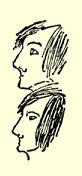
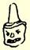
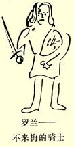

### ２

## 致弗里德里希·格雷培和威廉·格雷培

### 爱北斐特

> ［１８３８年］９月１日［于不来梅］

致巴门的、现住爱北斐特的格雷培兄弟先生。弗·格雷培先生大函已悉，特此略写几行作复。真没想到，事情进行得很顺利！ 我们就从成型艺术说起吧。事情是关于我的一位邻居，名叫乔治·戈里森（乔治是他的名字格奥尔格的英语发音）。此人是汉堡有史以来的头号小丑。请从附上的两幅头像中选一幅适中的，给他接上一个瘦身材、两条长腿，使他的眼睛带着十分呆板的神情，设想他讲起话来和基尔希纳一模一样，只不过讲的是汉堡方言。这样，你们就有了这个蠢货的一张完美的肖像。唉，要是我能够象昨天晚上在一块板上把他画得那么成功就好了。我画得非常象，以至所有的人，甚至女仆都把他认出来了，就连住在我们这幢房子里的那个目空一切的艺术家[^1]看了这张像以后，也认为画得很好。这个乔·戈里森是世界上头号大傻瓜；他每天都胡诌些新玩意，他那些荒诞无稽的念头没完没了，每天至少使我烦恼二十个小时，这个家伙应该感到内疚。

不久前我买了一本雅科布·格林的辩护性小册子２２１；这本小

 册子真不错，写得很有力。最近我在**—家**书店里读了不下七本关于科伦事件２２２的小册子。—— 注意。我在这里读到了一些东西和词

句，—— 我对这种刊物特别感兴趣——，这样的东西我们

这儿是从来[^2]不敢印的，十足的自由主义思想等等；关于

汉诺威那只浑身是虱子的老山羊[^3]的论述，也极为精彩。

这里有些出色的讽刺画。—— 我看到一幅，虽然画得不好， 但面孔画得很有特色。画的是一个裁缝骑在山羊背上，被主人拦住了，一群皮匠在围观。画上的题词说明这是什么意思：

“主人，不要拦住我的马！”

关于这件事，下次再谈吧，因为我无法搞到这张画，而且，主人[^4]正坐在这里。其实，他是一个很好的人，哦，好得你无法想象。

请原谅我写得这么糟：我肚子里灌了三瓶啤酒。好啦，我不能再写了，因为现在就该把信送到邮局去。钟已经敲过三点半了，应该在四点把信送到那里！真该死！你是否发觉，啤酒在我身上作怪？……[^5]

务请随便给我写几句；武尔姆知道我的地址，你们可以把信让他转寄。哎，天啊！我写什么呢？哦，天啊，天啊，真糟糕！老头儿， 就是说，主人，刚刚出去，我却完全弄糊涂了：罗兰—— 我不知道在写什么，两耳嗡嗡响。请向彼·不来梅的骑士

[^1]: Ｇ．Ｗ．法伊斯特科恩。—— 编者注

[^2]: 从这里起到下面“啤酒在我身上作怪”止，用红墨水写在第一页黑墨水信稿的两边。—— 编者注

[^3]: 恩斯特－奥古斯特。—— 编者注

[^4]: 亨利希·洛伊波尔德。—— 编者注

[^5]: 由于信纸损坏，这一句话无法辨认。—— 编者注