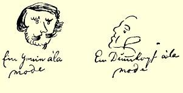

Ａｄｉｅｕ[^1]，亲爱的玛丽亚，我希望能收到你四**大**张纸的来信。

#### 你的哥哥弗里德里希

> 第一次发表于《马克思恩格斯全集》原文是德文 １９３０年国际版第１部分第２卷

### ４

## 致弗里德里希·格雷培和威廉·格雷培

### 巴门[^2]

> ［１８３８年］９月１７—１８日［于不来梅］

**９月１７日**。先用黑墨水写，然后再用红墨水从头写起[^3]。

Ｃａｒｉｓｓｉｍｉ！Ｉｎｖｏｓｔｒａｓｅｐｉｓｔｏｌａｓｈａｅｃｖｏｂｉｓｓｉｔｒｅｓｐｏｎｄｅｎｔｉａ． Ｅｇｏｅｎｉｍｑｕｕｍｌｏｎｇｉｔｅｒｌａｔｉｎｅｎｏｎｓｃｒｉｐｓｉ，ｖｏｂｉｓｐａｕｃｕｍ ｓｃｒｉｂｅｒｏ，ｓｅｄ ｉｎ ｇｅｒｍａｎｉｃｏｉｔａｌｉａｎｉｃｏｌａｔｉｎｏ．Ｑｕａｅ ｑｕｕｍ ｉｔａ ｓｉｎｔ[^4]，你们就再读不到一个拉丁字，而读到的是纯粹的、不掺假的、纯正的、完美的德文。我现在告诉你们一件很重要的事情：我写的西班牙浪漫诗碰壁了，那个家伙显然是一个反对浪漫主义的人，他看上去也正是这样的人；可是我的另一首诗《贝都英人》[^5] （随信抄附），在另一家杂志上发表了，不过这条汉子把我的最后一节诗改动了，造成很大的混乱。看来好象他没有弄懂下面的话： “你们沙漠上的粗布袍，同我们巴黎式的衣衫不相称，你们的歌儿也不属于我们的文学”，因为这两句话好象很古怪。这首诗的主要思想是把贝都英人，甚至把处于目前情况下的贝都英人同跟他们完全异趣的读者作对比。因此，这种对比不应当只通过对这截然不同的双方作赤裸裸的描绘来表现，而是只有在结尾部分通过最后一节诗中的对照和结论才能变得活灵活现。此外，诗中还表现了一些细节：（１）对照作为我们戏剧典范的席勒，把科采布和他的信徒轻轻地讽刺了一下；（２）对照贝都英人原先的处境，表述了他们目前处境的痛苦；这两个次要的方面在两个主要对立面里是平行发展的。如果抽去最后一节诗，整篇诗都散了；但是，如果编辑修饰一下结尾部分而写成“他们跳舞是为了挣钱，不是为了自然的迫切要求，无怪乎你们目光黯淡，都默默无言，只有一个人歌声哀哀”，那么，第一，结尾就黯然失色，因为都是一些以前用过的泛泛之谈，第二，这个结尾毁掉了我的主要思想，代之以次要思想：为贝都英人的处境鸣不平，把它同他们原先的处境加以对比。于是，他造成了这样的损失：完全破坏了（１）主要思想，（２）连贯性。其实，这个家伙还得再花费一个格罗特（半个银格罗申）才行，因为他将得到的是我的训诫。其实，我还不如不写这首诗，因为我根本没有做到用明朗、优美的形式来表达我的主要思想；ｓｔｒ．[^6]的泛泛之谈—— 也只不过是泛泛之谈而已，海枣之乡和 Ｂｉｌｅｄｕｌｄｓｃｈｅｒｉｄ[^7]是一回事，即一个概念用同义的词语表达两次， 而有些句子听起来多么不和谐：“隆隆的笑声”和“可爱的嘴”！看到自己的诗就这样给发表了，定会产生一种奇怪的感觉；这些诗使你感到陌生，而你对这些诗的感受要比它们刚写出来时敏锐得多。

当我看到自己的作品就这样发表时，曾经笑逐颜开，但不久笑容便消逝了；我一发现诗有了改动，便怒不可遏，大发雷霆。—— Ｓａｔｉｓａｕｔｅｍｄｅｈａｃｒｅｌｏｃｕｔｉｓｕｍｕｓ！[^8]

今天上午，我在一个旧书商那里找到一本别具一格的书：《圣行录》一书摘录，可惜只有前半年的，附有圣徒的肖像、传略和祈祷文，但是全都很短。它花了我十二格罗特（六个银格罗申），而维兰德的《西诺普的第欧根尼，或ωｘα[^9]》一书，我也′η  μαιóμ 花了同样多的钱。

我对于自己的诗和创作诗的能力，日益感到绝望，特别是在读了歌德的《向青年诗人进一言》等两篇文章２２３之后更是如此，文章把我这样的人真是刻画得维妙维肖；文章使我看清了我所写的这种押韵的玩意儿对艺术毫无价值；但今后我仍将继续搞这种押韵的把戏，因为正象歌德所说，这是一种“愉快的补充”；我还要让我的诗在一家杂志上发表，因为别的青年人也都是这样做的，他们即使不比我更蠢，至少也是跟我一样蠢的蠢驴，而我这样做既不会提高也不会降低德国文学的水平；可是，每当我读到一首好诗的时候，我内心总是感到苦恼：你就不能写出这样的作品！Ｓａｔｉｓａｕｔｅｍ ｄｅｈａｃｒｅｌｏｃｕｔｉｓｕｍｕｓ！

我的ｃａｒｉａｍｉｃｉ[^10]，我多么惦念你们啊！我想起自己常常到你们房间去的情景：弗里茨舒适地坐在炉边，嘴里叼了一个短烟嘴，而威廉穿着他那件长长的睡袍窸窸作响地在房间里走来走去，他抽的只能是四分尼一支的雪茄烟，而且俏皮话说得整个房间为之哄动；而后，雄赳赳的费尔德曼进来了，就象是δò Ｍα[^11]；接着身穿长礼服、提着手杖的武尔姆来了。我们尽情狂欢，闹得天旋地转；可是现在呢，只能通通信，真够受的。你们在柏林也要勤给我写信，这ｃｏｎｓｔａｔ[^12]，也是ｎａｔｕｒａｌｉｔｅｒ[^13]，信寄到柏林的时间只比寄到巴门多一天。我的地址你们是知道的；如果你们不知道，这也无关紧要，因为我跟邮差的关系挺不错，他常常就把信给我送到商行来。但是，如有必要，你们可以写上“圣马蒂尼公墓街２号”，ｈｏｎ ｏｒｉｓｃａｕｓａ[^14]。跟这位邮差有这样的友谊，起因于我们的姓名相近： 他叫恩格克。—— 我今天写这封信有点不那么容易，因为前天我往比尔克寄了一封信给武尔姆，今天寄了一封信给施特吕克尔。第一封信写了八页，第二封信共七页。而现在你们也应该收到一封。 —— 如果你们在去科伦之前收到这封信，那么，托你们办下面这件事：一到那里就去找军械巷，埃弗拉特印刷所，门牌５１号，替我买几本民间故事书。《齐格弗里特》、《欧伦施皮格尔》、《海伦娜》这几本书我已经有了；我最需要的是：《屋大维》、《席尔达人》（莱比锡版的节本）、《海蒙的儿子》、《浮士德博士》和其他一些附有版画的书； 如果碰到具有神秘色彩的书，也请购买几本，特别是《西维拉占语》。你们不妨破费两三塔勒，然后用快递邮件把书寄给我并告诉我书款多少２２４，我给你们寄去我家老头儿[^15]的期票，他会乐意照付的。或者这样：你们可以把书捎给我家老头儿，我会告诉他事情的原委，而他会把书作为圣诞节礼物送我或者在他认为适当的时候把书送给我。—— 我研究的新课题是雅科布·伯麦，这是一个沉郁而又深邃的人。如果想对他有所了解，非得下一番功夫不可。他的思想富有诗意，是个非常善于讽喻的人；他的语言独标一格，所用词汇不同凡响；他不说存在物，本质〔Ｗｅｓｅｎ，Ｗｅｓｅｎｈｅｉｔ〕，而说痛苦〔Ｑｕａｌ〕；他把上帝叫作无根据〔Ｕｎｇｒｕｎｄ〕和根据〔Ｇｒｕｎｄ〕，因为上帝自身的实存既无根据又无开端，而上帝本身是自己的以及一切其他生命的根据。到目前为止，我只弄到了他的三篇作品；在开始阶段这倒也够了。—— 下面便是我写的关于贝都英人的诗：

铃声一响，

丝幕徐升；

人人凝神静等，

鸦雀无声。

科采布今天没来

逗引诸位发出隆隆的笑声，

席勒这回也不登台

倾吐玉语金声。

沙漠之子骄傲而自由，

到这儿来为诸位解闷，

他们的豪情和自由，

恰似春梦无痕。

他们跳舞是为了挣钱，

少年就这样在沙漠欢跳，

所有的人都默默无言，

只有一个人歌声哀哀。

观众拍手不已，

昨天科采布在这里插科打诨，

今天人们又在这里，

向贝都英人报以雷鸣般的掌声。

沙漠之子敏捷而矫健，

你们顶着正午的炎炎烈日，

穿过摩洛哥的漠漠沙土，

走遍温和的海枣山谷！

你们驰入Ｂｉｌｅｄｕｌｄｓｃｈｅｒｉｄ，

穿越那里的园庭。

勇敢地去袭击，

战马踩征尘！

你们沐浴着月光，

坐在棕榈树的清泉旁，

听一张可爱的嘴，

为你们编出美妙故事的彩色花环。

你们安睡在狭窄的帐幕里，

寻求好梦于爱的怀抱，

直到天际出现晨曦，

骆驼叫声阵阵！

啊，异乡的来客，返回自己的家园，

你们沙漠上的粗布袍，

同我们巴黎式的衣衫不相称，

你们的歌儿也不属于我们的文学！

［９月］１８日

Ｃｕｒｍｅｐｏｅｍａｔｉｂｕｓｅｘａｎｉｍａｓｔｕｉｓ[^16]—— 你们一定会嚷着说。 可是，我现在就是要用这些诗，或者更确切些说，我就是由于这些诗而要更多地折磨你们。威廉那里还有我写的一大本诗。我请求把这本诗寄还给我，而且用这样的办法寄：空白的纸你们可以裁去，然后，你们每来一封信，就附上几张诗稿，这样邮费不会增加。 如果行的话，可再添上一张；只要你们封得巧妙，寄出以前好好压一压，譬如说，把信放在几本字典下压一夜，那么那些家伙就什么也发现不了。请你们务必把封好的诗稿转寄给布兰克。我目前通讯关系非常广泛。我给你们写信寄到柏林，给武尔姆的寄到波恩， 我还往巴门、爱北斐特寄信，要是不这样做，我怎么能把必须呆在商行而又不许看书这段没完没了的时间打发掉呢？前天我在这里的老头儿[^17]，ｉｄｅｓｔｐｒｉｎｃｉｐａｌｉｓ[^18]家里—— 人们称他的妻子为老太太 〔“Ａｌｔｓｃｈｅ”〕（同意大利语ａｌｃｅ（麋）一词的发音相同），—— 他的家在城外，我玩得很满意。老头儿是一个十分可爱的人物，他总是用波兰话骂自己的孩子：唉，你们这些懒鬼〔Ｌｅｄｓｃｈｉａｋｅｎ〕；唉，你们这些卡舒布人〔Ｋａｓｃｈｕｂｅｎ〕！在回来的路上，我竭力想使我的同路人，一个庸人对低地德意志语的优美有所了解，但是我发现，这是不可能的。这种庸人是不幸的人，然而，由于愚蠢，他们同时又幸福之至，因为他们把自己的愚蠢看作是绝顶聪慧。不久前的一个晚上，我去剧院看戏；演的是《哈姆雷特》，可是演得糟糕透顶。所以还是不谈它为好。—— 你们将去柏林，这很好；在艺术方面你们将得到很大的收获，除慕尼黑外，你们平常在任何一所大学都得不到这样的收获。但是，那里缺少大自然的诗意；沙土，沙土！沙土！这儿要好多了。郊外的道路大部分美丽如画，各种各样的树木使得道路更加引人入胜；而群山啊，群山，真是美不胜收！柏林还缺乏大学生生活的诗意，而在波恩，大学生生活饶有诗意，在富有诗情画意的郊区漫步，这种感觉更是有增无已。你们总有一天会到波恩来的。我亲爱的威廉，对你那封妙语横生的来信，我非常乐意也写一封妙语连篇的回信，不过我根本没有什么妙语可谈，特别是眼下也没有这种情趣，情趣是激发不出来的，而没有情趣，一切就是勉强的了。但是我感到，我快不行了，仿佛思想正从我的头脑中逝去，仿佛我的生命正被夺去。我心灵之树的叶儿纷纷飘落，我的妙语费尽思索，它们的内核已从壳中脱落。我的木卡姆[^19]徒有其名，无法同你那些胜过吕凯特的优美诗歌齐名。我的木卡姆患了关节炎，它们一瘸一拐，步履蹒跚，它们摇摇欲坠， 不，已堕入深渊被人遗忘，无法攀缘最高名望。啊，痛苦啊，我坐在自己的小屋，用小锤敲打自己的头颅，从那里淌出来的尽是水，它呼啸、咆哮。然而，这也无济于事，我的灵感还是迟迟不至。昨晚， 我躺下睡觉的时候，撞了头，发出的响声就好象撞了一只水桶，水碰到桶的另一边发出了啪啪声。真理这样粗鲁地出现在我的面前，我不禁哑然失笑。是啊，水，水！我房间里在闹鬼，昨晚我听见小蛀虫在搔墙壁，离我不远的小巷里，鸭、猫、狗、妓女和人群闹闹哄哄。此外，我要求你们写的信即使不比我的信长，至少也要一样长，ｅｄｉｄｐｏｓｔｎｏｔａｓ[^20]，不得有误。

最出色的赞美诗集２２５无疑是这里出版的。这本书包括德国诗坛的所有名家：歌德（歌谣《你，降自天国》）、席勒（《信仰三语》）２２６、 科采布以及许多其他诗人。还有种牛痘歌和其他各种各样荒唐的诗。这简直是世上少有的粗野行径；没有亲自看到这点的人是不会相信的；除此之外，这是骇人听闻地践踏我们所有的优美的诗歌，也是犯罪，克纳普在他的《诗歌荟萃》２２７中就犯了这样的过错。—— 我们把一批火腿运往东印度，值此之际，我想起了下面一件极为有趣的事情：有一次一批火腿运往哈瓦那；寄发货单的信后来才到达，而收货人先发现少了十二只火腿，在发货单上看到这

 样的字样：“因老鼠啃噬而……十二只火腿”。这些老鼠就是商行里的年轻职员，是他们享用了这些火腿。故事就到此为止。—— 我打算用素描和速写（赫博士的外表）来填满剩下的空白，我得告诉你们，我未必能告诉你们很多有关我旅行的情况，因为我答应施特吕克尔和武尔姆首先告诉他们；我担心，我不得不给他们写两次信，把这些废话加上大量无谓的事重复三遍，这未免太多了。但是，如果武尔姆同意把笔记本—— 不过，这笔记本今年年底前他未必能够收到—— 寄给你们，那对我来说就太方便了。否则，你们自己目前又不能来波恩，我可爱莫能助了。

#### 你们最忠实的仆人

时髦的天才        时髦的蠢才

向彼·永豪斯问好；他可以把自己的信附在你们的信内。要不然我也会给他写信的。但是这个小伙子一定已经动身了。

#### 弗里德里希·恩格斯

请速回信。你们在柏林的地址！！！！！！！

> 第一次大加删节发表于１９１３年原文是德文 《新评论》杂志第９期（柏林）；全文发表于《恩格斯早期著作集》１９２０年柏林版

[^1]: 再见。—— 编者注信的背面写着：巴门。邮资已付。格雷培牧师先生收并转弗里德里希·格雷培

[^2]: 先生。—— 编者注９月１７日写的部分用的是黑墨水；９月１８日写的部分用的是红墨水，写在前

[^3]: 一部分信的两边。—— 编者注最亲爱的！对你们的来信，回复如下。由于我好久不用拉丁文书写了，所以给

[^4]: 你们写上几句，不过德文、意大利文、拉丁文交相使用。既然是这样。—— 编者注

[^5]: 见本卷第３—５页。—— 编者注

[^6]: “Ｓｔｒ．”这个不完整的词大概是指恩格斯的同学施特吕克尔（Ｓｔｒｕｃｋｅｒ）。——编者注

[^7]: 这个词的意思是“海枣之乡”，音译为“比莱德－杰里德”。—— 译者注不过，对这一点我们已经谈够了。—— 编者注

[^8]: 

[^9]: 疯狂的苏格拉底。—— 编者注

[^10]: 亲爱的朋友们。—— 编者注金发的麦尼劳斯。—— 编者注

[^11]: 已经是说好了的。—— 编者注

[^12]: 当然的。—— 编者注

[^13]: 

[^14]: 以示尊敬。—— 编者注

[^15]: 恩格斯的父亲老弗里德里希·恩格斯。—— 编者注

[^16]: 你为什么用你的诗折磨我啊？—— 编者注

[^17]: 亨利希·洛伊波尔德。—— 编者注

[^18]: 即商行主人。—— 编者注

[^19]: 信中的这一部分是用韵文写的。恩格斯戏称为“我的木卡姆”。木卡姆指中世纪阿拉伯、波斯和犹太文学中以流浪汉的冒险事迹为题材的小说。—— 译者注

[^20]: 约法三章。—— 编者注