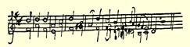

Ａｄｉｅｕ[^1]，亲爱的玛丽亚。

#### 你的弗里德里希

> 第一次发表于《马克思恩格斯全集》原文是德文 １９３０年国际版第１部分第２卷

### ７

## 致玛丽亚·恩格斯

### 巴门

> ［１８３８年１２月底于不来梅］

亲爱的玛丽亚：

你对疾病也太认真了，稍有不适，你这个懒骨头就躺在床上， 这个习惯要改变。收到这封信时，你应该下床了，听见没有？谢谢你给我的漂亮的绣花包：我可以肯定地告诉你，它已经得到最严格的评论家之一、画家Ｇ．Ｗ．法伊斯特科恩先生的最高评价， 不论是图案的选择还是做工，他都十分赞赏。玛丽·特雷维腊努斯也给我绣了一个，不过后来她又拿回去寄往克罗茨纳赫附近的施泰因山麓明斯特，送给赫塞尔牧师先生了，因为她也答应过给他绣一个。为此，她正给我编一个装雪茄的小篮子。牧师太太[^2]给我编织了一个小钱包。洛伊波尔德的男孩们也得到了用纸炮打响的枪和马刀，老头儿[^3]总是对孩子们说：“唉，你这个好打架的家伙！” “你这个卡舒布人！”关于池塘的谜语，我不知道，我另外给你一个

 谜语—— 你知道Ｌｅｄｓｃｈｉａｋ是什么意思吗？（我自己也不知道，这是骂人的话，老头儿经常讲的。）[^4]谜底是：如果你猜不出来，那么就把这个词对着镜子看，然后你就能够读出来了。我刚刚知道洛伊波尔德家添了一口人：一个女孩。

我还想告诉你，我正在谱曲，而且是谱写赞美诗。但是这件事可难了：节拍、升半音以及和声带来很多麻烦。到目前为止，我的进展还不大，但还是想给你看一段样品。这是赞美诗的前两行： “我们的上帝，强大的堡垒。”[^5]

我还不能写出两个声部以上的曲调，因为四个声部的太难了。 但愿乐谱中没有错误，你有功夫试着弹弹这个曲子。

Ａｄｉｅｕ[^6]，亲爱的玛丽亚。

#### 你的哥哥弗里德里希

> 第一次发表于１９２０年《德意志评论》原文是德文杂志第４卷（斯图加特和莱比锡）

[^1]: 再见。—— 编者注玛蒂尔达·特雷维腊努斯。—— 编者注

[^2]: 

[^3]: 亨利希·洛伊波尔德。—— 编者注

[^4]: 在原著中，括号里的句子是对着镜子以次序相反的字母写的。—— 编者注这是马丁·路德的教堂赞美诗的头两行。—— 编者注

[^5]: 

[^6]: 再见。—— 编者注