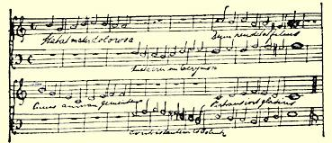
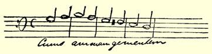

## １８３９年

### ８

## 致玛丽亚·恩格斯

### 巴门

> １８３９年１月７日［于不来梅］

亲爱的玛丽亚：

但愿你的牙已经拔了，或者，没有必要拔。—— 有关池塘的谜语很好，不过你自己可以猜出来。你知道，作曲可不容易，要考虑到许多方面的问题：和声的协调、对位法的正确运用，这一切都要求付出巨大的劳动。不过，我一定设法在最近再给你寄点东西去。目前我正忙于谱写新的赞美诗。有两个声部，男低音和女高音相互交替。请看：

伴奏曲尚未写成，我以后可能还要做些改动。一看便知，除第四行以外，大部分都抄自赞美诗集。歌词是著名的拉丁文赞美诗： “ＳｔａｂａｔｍａｔｅｒｄｏｌｏｒｏｓｓＪｕｘｔａｃｒｕｃｅｍｌａｃｒｙｍｏｓａＤｕｍｐｅｎｄｅｂａｔ ｆｉｌｉｕｓ”[^1]。

今天中午牧师先生[^2]在洗衣房宰了一头猪，牧师太太[^3]最初对这件事情连听都不愿意听，但是，牧师说把猪赠送给她，她才勉强同意。这头猪连叫都没叫一声。猪宰好后，牧师家的女人全都走进来了。老祖母不让任何人取猪血，当时的情况看上去非常滑稽。明天要做香肠，这是老祖母最大的乐趣。

你说你仿佛看见了一只猴子，而这猴子好象是你自己。你在粘信封的封缄纸上写的是：“Ｊｅｄｉｓｌａｖéｒｉｔé[^4]，这点你记得吗？

上面还画了一面镜子。

告诉妈妈，她以后不要再写：“特雷维腊努斯”，她写姓名地址时完全可以不写牧师先生的姓名，邮差知道我住在哪里，因为我每天都到邮局寄信。除此之外，这还会使邮差把我的信送到特雷维腊努斯家，而不是送到商行。这样一来，就要迟好几个钟头，等我回家以后才能收到信。

施特吕克尔给我来信说，海尔曼[^5]在新年前的那个星期天登台演出，扮演了各种角色，如侍役等。他该来信告诉我这件事情。

 —— 施特吕克尔对海尔曼的演技大加赞扬，说他扮演侍役，生动逼真，好象他在旅馆工作过三年。他可能大有进步吧？

别让母亲把我作的曲子给朔尔恩施泰因看，不然他又会说： “真是胡闹”。要知道，你们那里所发生的一切，我都会打听到的。 下次我再去巴门的时候，我要象老头儿[^6]一样，成为不来梅市的领事。

Ａｄｄｉóｓｍｉｈｅｒｍａｎａ[^7]．

#### 你的弗里德里希

男低音声部有不少笔误，你应该原谅我，因为我写音符还不熟练。倒数第二行怕你看不清，我现在把它再抄一遍。

> 第一次略加删节发表于１９２０年《德意志原文是德文评论》杂志第４卷（斯图加特和莱比锡）； 全文发表于《马克思恩格斯全集》１９３０年国际版第１部分第２卷

[^1]: “圣母悲痛地站在十字架下，泪流满面，望着钉在十字架上的儿子”。（这是天主教的圣母赞美诗的开头部分，很多作曲家把它谱成曲于，其中有佩戈莱西、帕勒斯特里纳、罗西尼。）—— 编者注格奥尔格·哥特弗里德·特雷维腊努斯。—— 编者注

[^2]: 玛蒂尔达·特雷维腊努斯。—— 编者注

[^3]: “我说的是真话”。—— 编者注

[^4]: 

[^5]: 海尔曼·恩格斯。—— 编者注

[^6]: 亨利希·洛伊波尔德。—— 编者注

[^7]: 再见，我的妹妹。—— 编者注