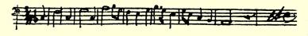

 新诗，勿谓言之不预。武尔姆把信件耽搁了，这是不可饶恕的。

#### 你的弗里德里希·恩格斯

> 第一次摘要发表于１９１３年《新评论》原文是德文杂志第９期（柏林）；全文发表于《恩格斯早期著作集》１９２０年柏林版

### １１

## 致海尔曼·恩格斯

### 巴门

> １８３９年３月１—１２日于不来梅

３月１１日亲爱的海尔曼：

敬请阁下今后写信不要用从里佩先生那里学来的这套开场白折磨我。我现在认为，我们这里每天早上都是冬天，而中午是夏天，因为早上我们这里的气温是零下５度，而中午是１０度。我仍在按部就班地练习唱歌和作曲，看，这就是我所作的一段曲子的样品：

你可以按照这个曲调唱“盲人”，也可以不这样唱。

３月１２日。你很快就要有自己的狗了，这使我很高兴。母狗是什么品种，这只小狗长得怎么样？老古董洛伊波尔德先生现在来到商行。现在我要象伟大的莎士比亚所说的那样，言归正传。这里新