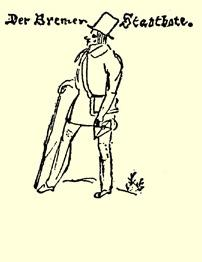

 出了一种报纸，叫《不来梅市信使报》；编辑是阿尔伯特 ·迈耶尔，他是个大笨蛋。 他从前曾以人民的幸福、孩子的教育以及其他题目开过讲座，他想发表这些讲稿，但是可爱的上司不同意，因为这实在太荒唐了。此人天生是个瓷器商，他从该报的第一号就同《杂谈报》[^1]发生争吵。他们彼此大肆攻击，简《市信使报》前直令人捧腹。下文请见给玛走着一个这样模样的人丽亚的信。

#### 你的爱你的哥哥弗里德里希·恩格斯

> 第一次发表于《马克思恩格斯全集》原文是德文 １９３０年国际版第１部分第２卷

### １２

## 致玛丽亚·恩格斯

### 巴门

> １８３９年３月１２日于不来梅

亲爱的玛丽亚：

（续致海尔曼的信）。这家《市信使报》[^2]上登载的全是一些无稽之谈。我在商行写了一些诗，开玩笑地对它赞扬了一番，编造了一些全是胡说八道的东西寄给该报，署名为泰·希尔德布兰特。 该报极其认真地刊载了这些诗。眼下我的抽屉里正有一首准备投寄的诗。诗文如下：

书的智慧２３７

读破万卷书，只汲取了滔滔不绝的词汇，

这种人并不明哲智慧，

纵使他对科学苦苦探索，

也无法揭开存在的面纱。

对植物学课本了如指掌，

也未必能听到小草在生长。

满口仁义道德的人，

不能教会你做好人。

不，萌芽隐藏在心灵深处，

它向人展示生活的艺术，

你为何从早到晚学习，

莫非要学会把激情平息？

他只应倾听自己的心声，

谁听而不闻，谁就死气沉沉，

你的全部词汇内容丰富，

而人的理性一词内容最丰富。

这首诗就这样写下去了，全是嘲弄。通常当我不大清楚该给

[^1]: 《不来梅杂谈报》。—— 编者注

[^2]: 《不来梅市信使报》。—— 编者注