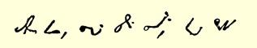
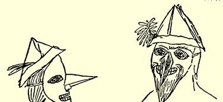
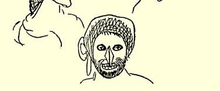

幕和讽刺的段落。这是我最近写的东西，下面该描写巴伐利亚国王[^1]了，可这里出了点毛病。这篇东西不完整又缺少情节。请武尔姆把诗安排在《缪斯年鉴》[^2]上。就此搁笔，因为邮差就要走了。

#### 你的弗里德里希·恩格斯

于３９年５月１日

> 第一次摘要发表于１９１３年《新评论》原文是德文杂志第９期（柏林）；全文发表于《恩格斯早期著作集》１９２０年柏林版

### １６

## 致玛丽亚·恩格斯

### 巴门

> １８３９年４月２８日［于不来梅］

亲爱的玛丽亚：

你也会收到我今天写的一封信，只是不长，这样我就能把要寄给你的喜剧写完。这些先生们吃了满满六盘杏仁饼干，这是千真万确的。信不信由你，那是供六百人吃的。

你得了荨麻疹，这是活该。你的手指总是发痒，你总想做点什么蠢事；现在，你有东西可以抓痒了。你是而且以后一直是一部陈旧的梳棉机。

我还劝你不要在信中留下空白页，因为我会在那上面画漫画， 免得荒疏绘画。

Ｄｉｏｓ[^3]，我亲爱的玛丽亚，你的哥哥

#### 弗里德里希这些草体字叫作速记。

化装。独幕喜剧。为玛丽亚而作。

#### 第一场

> 起居室。母亲坐在桌旁给埃米尔[^4]、海德维希[^5]上课。玛丽亚坐在壁炉旁看书；鲁道夫[^6]在房间里跑来跑去，逗引大家。

母  亲 玛丽亚，别看了。这不是你看的书。你读那么多东西，

对你毫无好处。 玛丽亚 哦，妈妈，还有一个故事，看完就把书给你！ 埃米尔 妈妈，“Ｋｅｗａｔｒｏｚｅ”这个字是什么意思呀？ 母  亲 噢，这个字读 ｑｕａｔｏｒｚｅ，十四，你早就学过了。可不能

老是把一切又忘了。——  海德维希！瞧这孩子，总

是缠着玛丽亚，跟鲁道夫打架。海德维希！你要不要

好好做点事？你们今天都乱了套啦！

> （安娜[^7]和劳拉·坎佩曼上。） 安  娜 妈妈，你看，我们该做的事都做完了。我们现在就上楼

化装，这就是我们要做的事。 母  亲 好吧，可是别吵闹。 海德维希 妈妈，这道题我不会做。 母  亲 那就再想想！我已经跟你计算过一次了。不要这样心

不在焉的！ 海德维希（哭） 我不会做嘛！ 安  娜 妈妈，你也化装吗？ 母  亲 你说什么？走开，让我安静安静。整天妈妈这个，妈妈

那个，真叫人受不了。 安  娜 妈妈，你说呀，你化装吗？ 母  亲 化装，化装，快走开！

> （安娜和劳拉兴高采烈地嚷着下。）

玛丽亚 妈妈，书给你吧，这个故事我已经看完了。我也想化

装，你说，我穿什么衣服好？ 母  亲 你瞧，我刚对安娜说过，叫她安静点，这会儿你又来了！ 鲁道夫（跌倒在地） 哦，妈妈，呜—— 妈妈！（叫喊） 母  亲 你怎么啦！（向他走去） 埃米尔 妈妈，这句话什么意思？ 海德维希 妈妈，这里有个数字真奇怪。 母  亲 你们到底能不能安静点？一个接着一个，我真受不了！ 埃米尔 妈妈，你说呀，能帮我一下吧！哦，妈妈，妈妈，我要上厕

所。 母  亲 那去吧。 玛丽亚 妈妈，你真的要化装吗？ 母  亲 别胡扯了！鲁道夫，你还疼吗？ 海德维希 嗯，妈妈，他头上有个大包！妈妈，这是什么数字呀？ 玛丽亚 真的，你可一定要化装。 安  娜（上） 妈妈，劳拉在厕所里，埃米尔站在门口大声嚷嚷，

使劲敲门。 母  亲 你又来啦！我现在没有功夫。 露伊莎（上） 太太，文德尔要到盖马尔克去，您有事吩咐他

吗？ 母  亲 嗯，让我想想。你们安静一会儿吧。鲁道夫，别哭了。 玛丽亚 安娜，妈妈不是说过，她也要化装吗？ 安  娜 是的，妈妈，你说过的。 玛丽亚 你们倒是安静点呀！都走开！ 埃米尔（哭着上） 哦，妈妈，劳拉不让我进厕所。我……我……

我弄上点…… 孩子们 他把裤子弄上了一点！ 母  亲 还嫌不够似的。一分钟也不让我安逸吗？你们这就一

个个叫吧。（拿起鞭子）来，埃米尔，一、二、三！安娜，玛丽

亚，都走开！叫文德尔自己来一趟。

> （两个戴假面具的人上：一男一女。）

母  亲 这是谁呀？又搞什么名堂啦？

> （男的急忙跑向母亲，轻轻地夺下她手中的鞭子。大家都高兴
>
> 得跳起来。女的站在母亲身旁，给她鼻子上架一副夹鼻眼镜。）

母  亲 胡闹，人家会笑话的。（文德尔上）文德尔，这是要寄的

信，寄给克莱讷斯家的。这些钱寄给裁缝许纳拜恩。就

是这些事。（文德尔下。母亲戴着眼镜坐下。）埃米尔，你先

去让人给你洗一下。

> （戴假面具的孩子抓住张大了嘴站在那里的埃米尔，边叫边打地把他赶到门口。）

海德维希 啊呀，妈妈，我刚发现，我多做了两道题。嗨，嗨！ 玛丽亚 妈妈，听我说，你现在也化装吗？ 母  亲 噢，又在胡扯什么！ 玛丽亚 可是听我说呀，妈妈。我要告诉你一点事（与母亲耳语）。 母  亲 不，这可不行。 玛丽亚 行，完全行。你看着吧！（全体下。）

> （两个小时以后。海德维希穿着鲁道夫的衣服，鲁道夫穿着海德维希的衣服，各人把自己的假面具给对方戴上。接着，其他孩子相继而上，全都乔装打扮得滑稽可笑。） 海尔曼[^8] 呵，奥古斯特[^9]，我的鼻子最长。瞧，约翰，我还有我们

的弗里茨留过的大胡子哪。 奥古斯特 我有这么可爱的绿脸蛋，有灰胡子，还有鼻子也是挺红

挺红的。 玛丽亚 劳拉，你瞧，我成了个可爱的男孩子啦，对不？你戴上这

顶帽子变得这么小，这么年轻，我比你大得多，我这顶

花纸帽子也比你的大。

> （母亲上，穿一件旧长袍，外面套上父亲的皮睡袍，帽子上又戴了一顶尖角睡帽，鼻子上架一副夹鼻眼镜。）

孩子们叫道：哦，妈妈，妈妈。 海尔曼 奥古斯特，这不是我妈妈！ 母  亲 孩子们，安静点，行吗？你们全都坐在桌子旁边等他

来。

> （静场。父亲上。他谅讶地环顾着，直到大家终于取下面具，孩子们叫啊，笑啊，高兴地追逐着。结局：盛宴。）

我本来可以继续把这个东西写下去，但是时间不容许，半小时后邮差要走，就此搁笔。

#### 你的哥哥弗里德里希

> 第一次发表于《马克思恩格斯全集》原文是德文 １９３０年国际版第１部分第２卷

[^1]: 路德维希一世。—— 译者注

[^2]: 《德国缪斯年鉴》。—— 编者注

[^3]: 再见。—— 编者注埃米尔·恩格斯。—— 编者注

[^4]: 海德维希·恩格斯。—— 编者注

[^5]: 鲁道夫·恩格斯。—— 编者注

[^6]: 

[^7]: 安娜·恩格斯。—— 编者注

[^8]: 海尔曼·恩格斯。—— 编者注

[^9]: 奥古斯特·恩格斯。—— 编者注