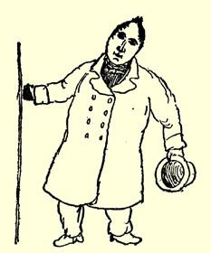

### １８

## 致玛丽亚·恩格斯

### 巴门

> １８３９年５月２３日于不来梅

亲爱的玛丽亚：

现在我每个星期天都要和理·罗特一起骑马远游。上星期一， 我们到过费格萨克和布鲁门塔尔。正当我们想参观有名的不来梅的瑞士（面积很小、满是小沙丘的地段）时，突然升起一大片尘埃，象乌云一样。五分钟以后，几乎完全昏暗不明，因此我们根本不可能观赏所谓的美景。—— 不过，圣灵降临节的第二天，这个地方热闹极了。所有的人都到城外去，不来梅城里死一般的寂静，扬·克鲁斯贝克尔而城门外车水马龙，骑马的和走路的络绎不绝。然而尘土飞扬，令人生畏。因为公路上灰沙很多，几乎有半尺深，尘土自然会在空中弥漫。刚才进来一个经纪人，此人叫扬·克鲁斯贝克尔，我给你把