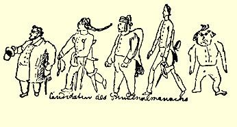

他的像画下来。

他的外表同这里画的一模一样，两只火红明亮的大眼，嘴角总是带着忧郁的笑容。Ａｄｉｅｕ[^1]．

#### 你的哥哥弗里德里希

> 第一次发表于１９２０年《德意志评论》原文是德文杂志第４卷（斯图加特和莱比锡）

### １９

## 致威廉·格雷培

### 柏林

> ［１８３９年］５月２４日—６月１５日
>
> ［于不来梅］

Ｍｙ ｄｅａｒ Ｗｉｌｌｉａｍ！[^2]

今天是５月２４日，仍未收到你一个字。你又一次有资格收不到诗了。我真不能理解你。现在姑且收下几篇有关当代文学的稿子吧。

**路德维希·白尔尼文集**。第一、二卷。《戏剧丛谈》２４６。—— 白尔尼是个为自由和权利而斗争的伟大战士，在书中他谈的是美学问题。即使在这里，他也是得心应手；他所讲的一切是那样确切、 清楚，是那样出自对美的真实感受，而且论证得那样令人信服，使人根本不可能提出异议。这里妙语浩如烟海，坚定而犀利的自由思想，象礁石一样比比皆是。大部分评论（这本书就是由这些评论汇集而成）是在作品刚刚问世即批评界对这些作品的评价还是盲目的和犹豫不决的时候写成的。但是白尔尼看见并洞察了贯穿于这种行为的最内在的东西。最出色的是他的那些评论，评席勒的 《退尔》２４７—— 这是一篇同一般人的观点相反而二十多年来未被驳倒的文章，因为它是驳不倒的。——  评伊默曼的《卡尔德尼奥》 和《霍弗尔》，评劳帕赫的《伊西多尔和奥里珈》，评克劳伦的《羊毛市场》（此书牵涉到其他一些利害关系），评胡瓦尔德的《灯塔》和 《图画》２４８—— 这些书被他否定得那么厉害，真是一无是处，—— 以及评莎士比亚的《哈姆雷特》。白尔尼在各方面都显出是一个伟人，因为他引起了一场后果未可预料的争端，而且就是这两卷书已足以保证白尔尼能同莱辛并驾齐驱；不过，他成了另一领域的莱辛，但愿卡尔·倍克能继他之后成为另一个歌德！

#### 《夜。披甲戴盔的歌》——卡尔·倍克

> 我是粗犷、豪放的苏丹，
>
> 我的诗歌是披甲戴盔的大军；
>
> 忧伤在我的前额添上许多神秘的皱纹，
>
> 宛如缠了一条头巾。[^3]

在引言的第二节诗里就出现这样的形象，诗篇本身２２又会是怎样的呢？一个二十岁的青年头脑里就酝酿着这样的思想，那么当他成熟时会创作出什么样的诗歌呢？—— 卡尔·倍克是个有才华的诗人，席勒以后还没有人能同他相比。我发现席勒的《强盗》和倍克的 《夜》之间有着惊人的相似之处：同样的热爱自由的精神，同样的不可遏制的幻想，同样的年轻人的豪情以及同样的缺点。席勒在《强盗》里追求自由，他的那些强盗都是对他那个奴气十足的时代的严肃警告；不过这种追求在当时还不可能采取一种明确的形式。现在我们通过“青年德意志”５已经有了一个明确的、系统的流派：卡尔 ·倍克挺身而出，大声疾呼，号召同时代人来认识、了解这个流派， 并且归附这个流派。Ｂｅｎｅｄｉｃｔｕｓ，ｑｕｉｖｅｎｉｔｉｎｎｏｍｉｎｅＤｏｍｉｎｉ[^4]．

**《浪游诗人》**。**卡尔·倍克的诗集２９**。青年诗人在第一部作品刚刚问世后，紧接着出版了另一部作品。这部作品在表现力、思想的丰富、抒情的浓厚色彩和刻画的深度等方面丝毫不亚于第一部作品，而在形式的精美和风格的古典等方面，却远远超过第一部作品。从《夜》中的《创造》到《浪游诗人》中关于席勒和歌德的十四行诗，进步是多么大啊！谷兹科夫认为十四行诗的形式损害了诗歌的整体效果，我却认为，对于这种独特的诗歌说来，莎士比亚式的十四行诗恰恰是史诗诗节和单独诗篇之间一种适当的中间形式。这毕竟不是史诗，而是纯粹的抒情诗，它的史诗情节线索联系松散， 比拜伦的《柴尔德·哈罗德》还要微弱。但是，我们德国人庆幸的是有了卡尔·倍克。

**《布拉泽多和他的儿子们》**。**卡尔·谷兹科夫的诙谐小说**。**６４**第一卷。某个当代的唐·吉诃德的思想是这部三卷集小说的基础。 这个思想已不止一次被人采用过，但是多半改编得很糟，当然还远不是已经挖掘完了。当代的唐·吉诃德（布拉泽多，一个乡村牧师）这个人物，谷兹科夫起初构思的时候，是很出色的，但是在执笔时有些地方写得显然不成功。不管怎样，刚刚年满三十（据说小说三年前就已写成）的谷兹科夫写的这部小说，在表达能力上远不如塞万提斯这部已经是成年人的作品。但是次要人物—— 托比安努斯似乎同桑科·判扎不相上下，—— 情景和语言等倒是挺出色的。

我的书评就写这么多。你写了信，我就会继续写。——  你知不知道，你们的信是什么时候送到这里的？——６月１５日！而在此以前的信是４月１５日收到的。这就是说，足足有两个月了！ 这样做合适吗？我正式宣告：在我实行不再给你寄诗的惩罚期间， 要避免武尔姆影响你寄信。如果武尔姆不能按时写完信，就别等他，你们把信寄来！给我写两页四开纸的信，用十四天时间还不够吗？真丢人。你又不注明写信的日期，这也是不合适的。—— 《电讯》上的那篇文章完全是我个人所有，威·布兰克十分喜欢它， 这篇文章在巴门也备受赞扬，此外，纽伦堡的《雅典神殿》也以完全赞许的口吻援引了文章内容。２４９文章中也许个别地方有些夸张，但是从理性的角度来看，整篇文章描绘了一幅真实的图景。当然，如果抱着成见去读它，认为它是一篇杂而无章的东西，倒也象是这样。—— 你对喜剧发表的意见是ｊｕｓｔｕｍ[^5]。

Ｊｕｓｔｕｓ ｊｕｄｅｘ ｕｌｔｉｏｎｉｓ，

Ｄｏｎｕｍ ｆａｃ ｒｅｍｉｓｓｉｏｎｉｓ！[^6] 你们只字不提抒情曲。应予改正。

《缪斯年鉴》[^7]的候补者

至于**莱奥**和**米希勒**，我当然只有从**莱奥**的**《黑格尔门徒》４８**和几篇反驳的文章中了解情况。从这里我弄清了以下几点：（１）按照 **莱奥**自己的叙述，他十一年来没搞任何哲学，因此对哲学毫无判断力；（２）他认为自己致力于哲学，完全是由于他有高度发达的、可以自豪的头脑；（３）他攻击的是借助**黑格尔**所特有的辩证法而从公认的前提中必然得出的那些结论，而不是攻击辩证法本身，既然不攻击辩证法本身，也就不应当去触动这些结论；（４）他对于反驳的文章只会报以粗暴的喊叫以至于谩骂；（５）他认为自己比他的对手高明得多，大摆架子，紧接着又故意摆出一副无比谦恭的样子；（６）他攻击的虽然只有四个人，其实也就攻击了同这四个人不可分割的整个学派，因为**甘斯**和其他人虽然在个别问题上同他们意见不一， 但彼此的联系极为紧密，以致**莱奥**根本无法指出他们有什么重大的分歧；（７）莱奥的谤书中充斥着他所遵从的《福音派教会报》精神。结论是：莱奥还是免开尊口为好。迫使莱奥突然投入争论的 “**最严酷的经历**”究竟是些什么东西呢？他在论**哥雷斯**的小册子２５０ 中不是已经向他们进攻，而且比在《**黑格尔门徒**》中更为激烈么？任何人都有权参加科学争论，只要他具备这方面的知识（莱奥具备这种知识吗？），但是谁想谴责别人，他就应当慎重些，莱奥是这样做的吗？他不是也曾伙同米希勒谴责过马尔海奈凯，而《福音派教会报》则对马尔海奈凯紧紧钉住不放，就象把他置于这家报纸的警察式的监视之下，看看这一切是否正统？如果莱奥的推理首尾一

[^1]: 再见。—— 编者注

[^2]: 我亲爱的威廉：—— 编者注

[^3]: 引自卡尔·倍克的《苏丹》一诗。—— 编者注

[^4]: 祝福以上帝的名义来到的人。—— 编者注

[^x]: 公正的。—— 编者注

[^x]: 正直的法官，请您审判时对我开恩！—— 编者注

[^x]: 《德国缪斯年鉴》。—— 编者注