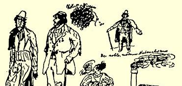
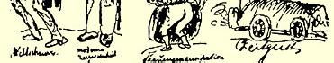
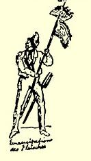

贯，他就应当谴责很多很多的人，但是他没有勇气这样做。谁要攻击黑格尔学派，他本人就必须是黑格尔这样的人物，并且创立一门新的哲学来代替这个学派。可是这个学派对莱奥不屑一顾，它在日益扩大。希尔施贝格的舒巴特５３对黑格尔主义的政治方面的攻击，难道不正象教堂司事对哈雷狮的牧师信条念“阿门”一样吗？ 这个哈雷狮当然不能否认它那猫的本性。Ａ ｐｒｏｐｏｓ[^1]，莱奥是竭力维护门阀贵族的唯一的德国大学教师！莱奥还把沃·门采尔称作自己的朋友！！！

#### 你忠实的朋友弗里德里希·恩格斯青年德意志派

你们参加了甘斯的葬礼吗？这件事为什么你们只字不提呢？

> 第一次大加删节发表于１９１３年原文是德文 《新评论》杂志第９期（柏林）； 全文发表于《恩格斯早期著作集》 １９２０年柏林版

### ２０

## 致弗里德里希·格雷培

### 柏林

> ［１８３９年］６月１５日［于不来梅］

弗里茨·格雷培。仁慈的阁下，这里展现在你们面前的是当代种种人物和现状。[^2]

６月１５日。你们的信已于今天收到。

我决定从今以后不再让武尔姆寄信了。谈

正事吧。你来信提到约瑟的家谱一事，我

已经知道了要点；对此我提出以下几点不

同的看法。

#### １．圣经中有哪些世系把处于类似情况下的女婿也称作儿子，在你没有向我提出

这样的例子以前，我认为这样的解释纯属

牵强附会！

２．路加用希腊文写的东西是给不熟悉这种犹太风俗的希腊人看的，为什么路加不直截了当地把情况说得象你讲的那样呢？

３．约瑟的家谱有什么意义呢？这份东西完全是多余的，因为三部复类福音书不是明明说过约瑟不是耶稣的父亲吗？

４．为什么象拉瓦特尔这样的人也不采用这种解释而听任矛盾存在呢？最后，为什么甚至比施特劳斯更有学问的奈安德本人，也说这是一个无法解决的矛盾，而罪魁祸首就是用希腊文改写希伯来文马太福音的作者？

而且，对于我的其他疑点，你所谓的“可怜的咬文嚼字”，你想撇开不谈，也不是那么容易的。在乌培河谷，词句中的圣灵启示被理解为：上帝甚至给每个字赋予了特别深刻的含意；这一点，我从教堂的讲坛上听得够多了。我相信亨斯滕贝格并不同意这种观点，从《教会报》上可以看出，他根本没有什么明确的观点：他一会儿赞同某个正统主义者的意见，一会儿又把这种意见归罪于某个唯理论者。但是，圣经的圣灵启示作用有多大呢？当然，还没有大到这样的程度：这个人可以迫使基督说：“这是我的血”[^3]，那个人则可以迫使基督说：“这是我血所立的新约”。[^4]确实预见到路德派同改革派之间这场争论的上帝，为什么不稍加干预，防止这场倒霉的争论呢？假定有圣灵启示，那就只有两种可能：要么上帝故意这样做，**以便**引起争论，但是这一点我不能怪罪于上帝；要么上帝没有发觉这个问题，但这样的念头同样是不容许的。不能说这场争论已产生了某种良好的结果，而设想这场争论在造成三百年的基督教分裂以后，将来会产生某种良好的结果，这同样没有任何根据，而且也毫无可能。有关圣餐的一段恰恰具有重要意义。如果这里有什么矛盾，那么，对圣经的全部信仰就将化为乌有。

我只能直率地告诉你，现在我已得出这样的结论：只有能够经受理性检验的学说，才可以算作神的学说。是谁赋予我们盲目地信仰圣经的权利呢？不过是在我们以前就这样做的那些人的威望而已。是的，同圣经相比，可兰经是一部比较有机的作品，因为它要求人们相信它的完整的、**有连续性的**内容。但是，圣经是由许多作者写的许多片断组成的，而作者中很多人甚至**自己**也对神性**无所要求**。难道仅仅因为父母对我们讲过，我们就必须违背自己的理性而相信它吗？圣经教导说，唯理论者注定要永世遭到诅咒。但是，一个为了追求同上帝合一而奋斗了一生的人（白尔尼、斯宾诺莎、康德），或者象谷兹科夫这样的人，他生活的最高目的就是要在实证的基督教同当代文化水平之间找到一个交融点，你能想象这种人死后会永远永远离开上帝，并且应当无止境地在肉体上和精神上忍受上帝的愤怒所带来的最残酷的折磨吗？我们连在糖上叮了一口的苍蝇都不应当加以折磨，而上帝竟可以万倍残酷地、永无休止地惩罚一个同样是无意犯错误的人吗？再说，一个真诚的唯理论者，难道因为他有所怀疑就有罪吗？根本不是这样。可是他会终生遭到最可怕的良心谴责；如果他在寻求真理，基督教就应当用真理的不可抗拒的力量去制服他。但是这样做了没有呢？再说，正统思想对待现代教育的立场又是何等模棱两可。据说基督教每到一处都有教育伴随着；可是，现在正统思想突然要求教育中途停止发展。如果我们相信圣经，相信它那套关于通过理性是不能认识上帝的教义，那么，整个哲学还有什么价值呢？可是，正统思想认为， 有点哲学—— 只是不可太多—— 倒是很有用处的。如果地质学作出的结论不同于摩西的创世史，它就会遭到诽谤（见《福音派教会报》的无聊文章《自然研究的界限》

２５１）；如果它作出的结论似乎和圣经所讲的相同，就会被引用。比方说，如果某个地质学家讲，地球和化石证明了曾经发过一次洪水，这就会被引用；但是如果另一个地质学家发现这些化石属于不同龄期，并证明在不同时期和不同地区都发过洪水，那么，地质学就会遭到谴责。这样做难道正当吗？再说，这里有一本施特劳斯的《耶稣传》１６２，一部无可辩驳的著作；为什么不写篇有说服力的文章来反驳呢？对于这个真正可敬的人为什么要诽谤呢？有多少人象奈安德那样，本人并非正统派， 却用基督教的口吻来反对施特劳斯？不错，确实有不少疑点，我所不能解决的重大疑点。再谈谈有关赎罪的教义吧。为什么人们不从这个教义中得出一条是非原则：如果有人志愿为别人担当责任，他应该受处分吗？你们全都会认为这样不公正；可是人们心目中认为是不公正的，在上帝面前就成了最大的公正吗？此外，基督教说过：我要使你们免罪。但这也是其他人即唯理论者所追求的。 这时基督教进行干涉，不准唯理论者去追求这个目的，因为唯理论者的道路离开目的更远。如果基督教给我们提出哪怕一个人来表明它使此人在一生中那样自由，从来无罪，那么它倒还多少有权利这样讲，否则，它就无权这样说。还有，彼得提到福音的更有理性、 更加纯净的灵奶。２５２这一点我不懂。人们告诉我，这是开明的理性。那就让明白这一点的人给我看看开明的理性吧。直到现在我还没有遇到一个这样的人，甚至对天使们说来这也是一个“巨大的秘密”。—— 我希望你对我的好感不致使你认为这一切都是亵渎神灵的怀疑和大话；我知道我会给自己惹来极大的麻烦，但是由于受信念的力量所驱使，尽管我做了最大的努力，还是不能让自己解脱出来。如果我的粗鲁的措辞触犯了你的信念，恳请原谅；我只是

[^1]: 顺便说一句。—— 编者注

[^x]: 插图下的说明（自左至右）：悲伤厌世、当代的衣衫褴褛、科伦的混乱、高贵的现代唯物主义、妇女解放、时代精神、肉体解放。—— 编者注

[^3]: 圣经《新约·马可福音》第１４章第２４节。—— 译者注

[^4]: 圣经《新约·路加福音》第２２章第２０节。—— 译者注