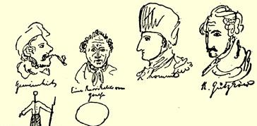
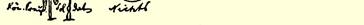

### ２３

## 致威廉·格雷培

> １８３９年７月３０日于不来梅

我亲爱的威廉：

你把我想象得很糟吗？这里既谈不上什么丑角演员，也谈不上什么忠实的埃卡尔特１１９（或如你信上所写的：埃卡尔德特），仅仅涉及逻辑、理性、连贯性、ｐｒｏｐｏｓｉｔｉｏ ｍａｊｏｒ ｅｔ ｍｉｎｏｒ[^1]等等。是的，你说得对，在这里用温良恭顺的态度是什么也办不成的，这些侏儒—— 奴性、贵族的统治、书报检查制度等等，必须用剑来铲除。 我当然是要大发雷霆的，但是因为是和你打交道，所以我得对你温和些，这样当我这种杂乱无章的诗的散文象“野狗”一样跑过你身边时，你就用不着“画十字”了。首先，我反对你强加于我的这种看法，好象我连踢带踹地驱赶着时代精神，要它更好地向前走。可爱的人，你把我这副长着塌鼻子的可怜相想象成多么丑恶的嘴脸呵！ 不，我不会这样做，相反，当时代精神象暴风一样袭来，带动火车在铁轨上疾驰时，我会迅速地跳进车厢乘上一段路，是的，认为卡尔 ·倍克作为一个诗人似乎再也写不出东西了，这种荒唐想法很可能来自那个糟糕的维谢尔豪斯，他的情况，武尔姆已经相当详尽地告诉了我。认为一个曾经写过如此狂放的诗篇的二十二岁青年会突然不再从事创作了，这种想法，不，这种胡思乱想，我从来没有过。你能想象歌德在写了《葛兹》[^2]以后，或者库勒在写了《强盗》以后就不再是天才诗人了吗？除此以外，你以为仿佛历史对“青年德意志”５进行了报复！上帝保佑！当然，如果以为世界历史被亲爱的上帝当作世袭采邑托付给联邦议会，那么它已经以判决谷兹科夫拘留三个月作为报复２５５；但是如果世界历史—— 我们不再怀疑 —— 就在于公众舆论（就是说，在这里就在于文学界的舆论），那么它对“青年德意志”的报复就表现在让“青年德意志”拿起笔杆征服它自己，这样，“青年德意志”现在已作为女王登上了现代德国文学的宝座。白尔尼的命运如何呢？他作为一个英雄于１８３７年２月倒下了，他在自己生命的最终时日，欣慰地看到他培育的人—— 谷兹科夫、蒙特、文巴尔克、博伊尔曼—— 已经茁壮成长；不错，凶险的乌云还笼罩在他们头上，而且德国被一条很长很长的锁链紧紧捆住了，这根锁链在哪儿有可能被拉断，联邦议会就把那儿修补好。 即使是现在，他还是嘲笑各邦君主，而且可能已知道窃取来的王冠什么时候会从他们头上掉下来。我不想为海涅的命运向你担保， 说实在的，这家伙早就沉入泥沼了；我也不愿为倍克的命运担保， 因为他热爱我们亲爱的德国并且为她担忧。这后一种感情我也有，此外，我还面临不少的冲突。但是仁慈的上帝赐给了我绝妙的幽默感，使我得到莫大的安慰。而**你**，小伙子，幸福吗？—— 你对圣灵启示的观点，暂且不要公开，否则你在乌培河谷就当不成牧师了。如果我不是受过极端的正统思想和虔诚主义９教育，如果教堂、 主日学和家庭没有向我灌输要永远最盲目地、无条件地相信圣经， 相信圣经教义、教会教义以至于**每一个**传教士的特殊教义之间的一致性，那我可能还会长时间地保持一些自由主义的超自然主义。 教义中的矛盾相当多—— 圣经的作者有多少，矛盾就有多少，这样一来，乌培河谷的宗教信仰就汲取了十几个人对教义的解释。关于约瑟的家谱，大家知道，是奈安德把《马太福音》中的家谱硬加在把希伯来文原文翻译成希腊文的译者身上；如果我没有弄错， **魏瑟**在他写的耶稣传记中发表的看法，和你的一样，是反对路加的。２５６弗里茨所作的解释终究要归结为一些难以置信的假设，以致这种解释根本不能叫作解释。我当然是个πρ

′μα[^3]，但不是唯理论者，而是自由主义者。对立观点之间正在划清界限，它们彼此是针锋相对的。四个自由主义者（同时也是唯理论者）、一个曾经转向我们、但是由于害怕破坏他从家庭继承下来的那些原则而立即跑回贵族阵营去的贵族、一个正如我们所希望的颇有前途的贵族，以及几个笨蛋，—— 这就是正在进行辩论的那伙人。我是以一个通晓古代、中世纪和现代生活的行家、以一个鲁莽人等等身份参加战斗的。但我进行的这场战斗已经不再是必要的了，因为我的部下做出了好成绩。昨天我向他们解释了１７８９年至１８３９年那段历史的历史必然性，此外，使我感到惊奇的是，我发现我在这场辩论中远远优越于这里所有的毕业班学生。在我彻底战胜了他们中间的两个人—— 已经好久了—— 以后，他们决定非派一个最聪明的人来同我对阵，把我打败不可。不幸的是，当时他正醉心于贺雷西的作品，所以他照样被我打得落花流水。这时他们害怕极了。而这个从前的贺雷西崇拜者现在对我很好，昨天晚上他把这一点告诉了我。如果你读读我正在评论的几本书，你马上就会相信我的评语是正确的。卡·倍克有非凡的才华，何止于此，他是个天才。 象这样的形象：

“听雷霆大声宣告，

> 闪电在乌云上写了什么”２５７， 在他的诗里是大量的。听一听他对自己崇拜的白尔尼讲了些什么吧。他对席勒说：
>
> 你的波扎不是虚无飘缈的幻觉；
>
> 难道白尔尼不是为人类而牺牲？
>
> 他为我们吹响了自由的号角，
>
> 是他，今天的退尔，向人类的高峰攀登。
>
> 在那里，他沉着地把箭削啊削，
>
> 他瞄准，射箭，自由之箭深深
>
> 射入苹果—— 射入了地球。[^4]

他对犹太人的贫困和大学生的生活描绘得多么出色，而《浪游诗人》２９又如何呢？人啊，清醒一点，读读这篇诗吧！你听着，如果你能驳倒白尔尼论述席勒的“退尔”的文章２４７，我就把我翻译雪莱的作品所能得到的稿酬全都给你。你贬低我那篇乌培河谷的文章２４４，我原谅你，因为不久前我重读了这篇文章，对文章的风格大为惊讶。自那时以来我再没有写出这样好的文章。下次可别忘了谈谈莱奥和米希勒。我说过，如果你以为是我们青年德意志派在人为地吹起了时代精神，你就大错特错了。请你想想，既然这股 π μα[^5]在吹，而且顺着我们吹，如果我们不扬帆，岂不就成了蠢驴吗？你们为甘斯送殡的事，是不会被忘掉的。我最近将在《雅士报》提及这件事。我觉得非常可笑的是，为了那么一点喧闹，你们事后全都那么恳切地请求原谅；你们还根本不会大声骂人，可是现在都干起来了：弗里茨打发我下地狱，送我到地狱门口，把我推进去以后鞠一大躬，好让自己重升天堂。你透过晶石眼镜看到一切东西都放大了一倍，你把我的三个伙伴看作来自女神维纳斯山的神灵。小伙子，你在忠实的埃卡尔特１１９问题上嚷什么？瞧，这就是他，小小的个子，侧面是一副严酷的犹太人的轮廓。他叫白尔尼。只要放手让他干，他就会赶走女神维纳斯所有的臣仆。然后你也会毕恭毕敬地告别。瞧，彼得先生[^6]也来了，他半边脸在笑， 半边脸在发怒；他先是朝我发怒，后来又朝我笑。

在我们可爱的巴门，对文学的兴趣现在开始兴起。弗莱里格拉特成立了一个戏剧朗读协会；在协会里，自从弗莱里格拉特离开以后，施特吕克尔和诺伊堡（朗格维舍的店员）就是自由主义思想的πρ

′μα ι′[^7]。艾维希先生现在敏锐地发现：（１）协会里有“青年德意志”的精神在游荡；（２）协会ｉｎ ｐｌｅｎｏ[^8]是《电讯》的乌培河谷来信的作者。他突然发现，弗莱里格拉特的诗仿佛是世界上最枯燥无味的，弗莱里格拉特本人远远不如拉莫特·富凯，在三年之内就会被人忘却。这恰恰象是卡·倍克的观点：

啊，席勒，席勒，你精神振奋，

> 伟大的心在火热的胸膛颤动，
>
> 没有忘记饱尝苦难的人民！
>
> 你呀你是预言家，永葆青春，
>
> 高举自由的旗帜勇敢向前冲！
>
> 当众人逃避斗争，
>
> 胆小鬼乞求上帝，
>
> 你在抛洒热血；
>
> 你把充满热情的生命，充满思想的生命
>
> 奉献给世界，
>
> 面对这种牺牲，它满心欢喜，态度却冷漠； [^9] 彼得·永豪斯。—— 编者注 [^10] 捍卫者。—— 编者注 [^11] 全体成员。—— 编者注

可是它对你的爱是否珍惜？

> 因为你的深重苦难，它不理解，
>
> 当诗歌的波涛在它耳边涌现，
>
> 它听到的只是天上的旋律，
>
> 而这却是你的血泪诗篇。[^12]

这是谁的作品？是卡尔·倍克的《浪游诗人》的片断，他的诗句雄浑有力，形象美好动人，但意思含糊不清，叙述过分夸张，比喻太多。 席勒是我们最伟大的自由主义诗人，这已是定论了。他预感到，法国大革命以后将开始一个新的时代，而歌德甚至在七月革命以后也感觉不到这一点；当事件已近在眼前以致他几乎不得不相信某种新事物正在到来时，他却走进内室，锁上了门，以求安逸。这对歌德十分有害；可是当革命爆发的时候，歌德四十岁了，已经是一个定型的人了，所以不能为此责备他。我想为你画一些东西[^13]

[^1]: 大前提和小前提。—— 编者注

[^2]: 戏剧《葛兹·冯·伯利欣根》。—— 编者注

[^3]: 先锋战士。—— 编者注

[^4]: 引自卡·倍克《席勒在戈利斯的旧居》一诗（《夜。披甲戴盔的歌》。第一个故事。第五夜）。—— 编者注

[^5]: 风。—— 编者注

[^12]: 卡·倍克《浪游诗人》第三首诗第５２节。—— 编者注

[^13]: 插图下的说明（自左至右）：Ｇｅｍｅｉｎｈｅｉｔ（低级趣味）；ＥｉｎｅＫａｒｒｉｋａｔｕｒｖｏｎＧｏｅｔｈｅ（歌德的漫画像）；Ｌ’ｈｏｍｍｅ（人）；Ｋ．Ｇｕｔｚｋｏｗ（卡·谷兹科夫）；Ｋｏｎ．Ｐｒｅｕ．Ｓｏｌｄａｔ（普鲁士王国士兵）；Ｎｉｃｈｔｓ（子虚乌有）。—— 编者注