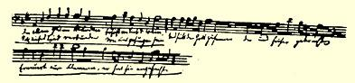

### ２５

## 致威廉·格雷培

### 柏林

> １８３９年１０月８日［于不来梅］

威廉，威廉，威廉啊！终于有了你的消息！小伙子，你现在就听我说：我目前是一个热心的施特劳斯主义者了。你们这就来吧， 现在我可有了武器，有了盾牌和盔甲，现在我有把握了；你们就来吧，别看你们有神学，我也能把你们打得落花流水，使你们不知该往哪儿逃。真的，威廉，ｊａｃｔａ ｅｓｔ ａｌｅａ[^1]，我是施特劳斯主义者，我是个微不足道的诗人，在天才的大卫·弗里德里希·施特劳斯的羽翼下藏身。你听听，这是个多了不起的人啊！这里有芜杂和离奇的四福音书；神秘主义拜倒在它们面前，对它们顶礼膜拜 —— 看，突然间大卫·施特劳斯象一位年轻的神一样出现了，他把乱七八糟的东西都暴露在光天化日之下——Ａｄｉｏｓ[^2]宗教信仰！—— 它原来就象海绵一样漏洞百出。他在某些地方把什么都看成神话，但这只限于无足轻重的事情；不过，总的来说，他不失为一个天才。要是你能驳倒施特劳斯，——ｅｈｂｉｅｎ[^3]，我将再度成为虔诚主义者。—— 其次，很可惜，如果我不幸长期以来不知道门格斯是位艺术巨匠，那我就能从你的信中了解到这一点了。对待 《魔笛》（莫扎特的乐曲）也是这样。设一个阅览室—— 这好极了， 我请你注意下列几部新的文学作品：《扫罗王》

５９，这是谷兹科夫的悲剧；《草稿集》６０也是他的作品；泰·克赖策纳赫（一个犹太人）的 《诗歌集》２５８；博伊尔曼的《德意志和德意志人》１４５；卢·文巴尔克的 《当代剧作家》第一册２７，以及其他作品，我切望听到你对《扫罗》的评价。在《德意志和德意志人》中，博伊尔曼在谈到乌培河谷的地方摘用了我在《电讯》上发表的文章。—— 可是我要提醒你注意斯米特的《波兰起义史（１８３０—１８３１）》１８３９年柏林版２５９，这无疑是直接奉普鲁士国王[^4]之命写的。关于革命开始的那一章引用了修昔的底斯的警句，大意如下：他们毫无理由地突然向我们这些毫无恶意的人宣战了！！！！！！２６０哦，荒谬，荒谬透顶！相反，关于这次光荣起义的历史，索尔蒂克伯爵写得很出色，这本书于１８３４年在斯图加特用德文出版２６１，—— 当然，在你们那里这本书也象其他一切好书一样将被禁止出版。还有一个重要消息，这就是我正在写一篇短篇小说，将在１月份发表，自然，这要看它能否通过书报检查，而这是十分困难的。

我一时不知道要不要再给你寄诗，但是我觉得最后一次寄给你的是《Ｏｄｙｓｓｅｕｓ Ｒｅｄｉｖｉｖｕｓ》[^5]，请你对那次寄给你的东西提出批评。这里现在有一个从你们那里来的见习牧师，弥勒，他将作为随船传教士远航太平洋。他住在我们家里，他对基督教的看法非常放肆大胆；如果我告诉你，最近他是在**戈斯纳**的影响下消磨时间的，你就会理解了。对于祈祷的力量和上帝对生活直接作用的力量持比较激昂的看法，是不容易的。他不说人们可以使自己的感觉、听觉和视觉敏锐，而是说：如果上帝赋予我职责，那么他也必然会赋予我完成这个职责的力量，不言而喻，与此同时，还必须有至诚的祈祷，有本身的努力，否则是不行的。这样一来，他就把人所共有，众所周知的事实局限于教徒之中。即使是某个克鲁马赫尔也不得不向我承认，这样一种世界观实在是太天真幼稚了。—— 我很高兴，你现在对我在《电讯》上发表的那篇文章的意见有所改进。其实，这东西是一时冲动下写成的，因而采用了我只打算写小说时运用的笔法，不过也有些片面性，并且只有部分真实性。大概你也知道，克鲁马赫尔是在美茵河畔法兰克福同谷兹科夫结识的， 据说，关于这一点他还讲了个ｍｉｒａｂｉｌｉａ[^6]—— 证明施特劳斯的神话观点的正确性。我正在专心研究现代风格，这无疑是整个修辞学的理想。海涅的作品，特别是奎纳和谷兹科夫的作品就是这种风格的典范。而文巴尔克则是这种风格的大师。以前的修辞学家中对他特别有影响的是莱辛、歌德、让·保尔，而以白尔尼为最。 啊！白尔尼写作的风格高超绝伦。《吞食法国人的人门采尔》２８，从风格的角度来看是第一部德国文学优秀作品，同时这又是第一部以彻底毁灭一个作者为已任的作品；它在你们那里被禁止，当然是为了不让人们用比皇室文牍体优胜的风格来写作。现代风格包括了文风的全部优点：言简意赅，一语中的，同长长的、平铺直叙的描写相互交织；简洁的语言同闪闪发光的形象和迸发出耀眼火花的妙语相互交织。总之，它就象是头戴玫瑰花、手执刺死皮顿的标枪的年轻力壮的加尼米德。同时，为发挥作者的个性开辟了最广阔的天地，所以尽管有近似的地方，但是谁也不是谁的模仿者。海涅写得光彩照人，文巴尔克热情明快，谷兹科夫贴切精练，不时闪现

 出一缕温暖宜人的阳光，奎纳则写得晓畅通达，有点明亮度过多而暗影过少。劳贝模仿海涅，现在又模仿歌德，但是方法不对头，因为他模仿的是崇拜歌德的万哈根，而蒙特也模仿万哈根。马格拉夫的写作还是过于一般化，象是使出了浑身解数，但是会好起来的。而倍克的散文还没有脱离习作阶段。—— 如果把让·保尔的华丽同白尔尼的精确结合起来，那就构成了现代风格的基本特点。 谷兹科夫善于成功地撷取法国人明快的、轻松的、但是干巴巴的风格。这种法国风格好象蛛丝；而现代的德国风格恰如一束丝绸 （可惜这个比喻不贴切）。我可不是喜新厌旧，我对歌德的神妙的诗歌的研究足以表明这一点。但是必须从音乐上，最好是从不同的乐曲方面加以研究。我想给你引用赖沙特为《联盟之歌》[^7]谱的曲子为例。 我又忘了画小节线，让霍伊泽尔替你填上吧。曲子是动人的，由于和声中始终保持着质朴的气息，没有任何一首歌曲能够同它相比。从Ｅ到Ｄ提高了六度，从Ｂ到Ａ迅速降低了八度，这样处理

[^1]: 已成定局。—— 编者注永别了。—— 编者注

[^2]: 

[^3]: 那好吧。—— 编者注

[^4]: 弗里德里希－威廉三世。—— 编者注

[^5]: 《复活的奥德赛》。—— 编者注

[^6]: 奇迹。—— 编者注

[^7]: 下面是歌词的译文：—— 朋友，爱情和酒把我们联在一起，每当我们见面就唱起这支歌，我们之间的联盟永存，因为上帝把我们联在一起。紧握火把，它是上帝点燃的。（歌德《联盟之歌》（《Ｂｕｎｄｅｓｌｉｅｄ》）的第一节，作曲家赖沙特配曲）。—— 编者注