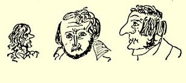
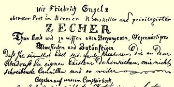
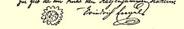

### ２８

## 致威廉·格雷培

### 柏林

> １８３９年１１月１３—２０日［于不来梅］

１８３９年１１月１３日。最亲爱的威廉，你为什么不写信？你们都属于偷懒的和无所事事的一类人。我可是另当别论！我不仅给你们写的信超过了你们应该得到的，我不仅认真地了解世界上的一切文学，我还不声不响地用短篇小说和诗歌为自己建造一座荣誉纪念碑，只要书报检查制度的气息不使锃亮的钢变成丑陋的铁锈，这座纪念碑将以璀璨的青春之光照耀着奥地利以外的所有德意志各邦。我心潮澎湃，我那有时不够冷静的头脑炽烈地燃烧；我竭力探求一种伟大的思想，以启迪我心灵中的纷扰，并使热情燃成熊熊的火焰。现在我正酝酿着一个宏伟的题材，同这个题材相比， 我以前所写的一切东西不过是儿戏。我想用“童话故事”或类似的东西把这种中世纪就已显现的当代预兆表现出来；我想把那些埋没在教堂和地牢的基石下、但在坚硬的地壳下敲击着、力求解放的精灵揭示出来。我想争取完成谷兹科夫给他自己提出的任务，哪怕是一部分：《浮士德》的真正的第二部分还有待写出。在这里，浮士德不再是一个利己主义者，而是一个为人类牺牲自己的人。有 《浮士德》，有《永世流浪的犹太人》，有《粗野的猎人》—— 这就是预期的精神自由的三个典型，它们之间可以很容易联系起来，并且同扬·胡斯相结合。对我来说，这是多么富有诗意的背景，而这三个恶魔就在这个背景下为所欲为！我过去着手写的《粗野的猎人》那

 首诗的想法已经溶化在这里面了。—— 我要独具一格地塑造这三个典型（你们这些家伙为什么不写信呢？要知道已经是１１月１４ 日了）；对亚哈随鲁和《粗野的猎人》的处理，我预计会收到特别的效果。为了使这篇东西诗意更浓、细节的刻画更深，我可以毫不费力地把德国传说中的其他一些成分编进去—— 我手头正好有一些东西。虽然我目前着手写的这篇短篇小说充其量不过是在风格和人物刻画上的一种学习研究，但这些才是我成名的希望之所在。

１１月１５日。今天也没有信来？我该怎么办呢？对于您，我该怎么想呢？我没法理解您。１１月２０日。如果您今天还不写信，我就从思想上把您处以宫刑，并且象您所做的那样，让您等信，以眼还眼，以牙还牙，以信还信。不过，您这个伪君子会说，不要以眼还眼，不要以牙还牙，**不要**以信还信，您要让我继续听您那一套该死的基督教的诡辩。不，宁可做一个好的异教徒，也不做一个坏的基督徒。

悲伤厌世的诗人

出现了一个年轻的犹太人，泰奥多尔·克赖策纳赫，他的长诗写得很好，短诗写得更出色。他写了一出喜剧６８，沃·门采尔及其一伙在剧中遭到百般嘲笑。现在大家都向往新的学派，在伟大的时代观念的基础上建立房舍、宫殿或者茅屋。其余的一切正趋于没落，感伤的小曲逐渐消逝得无声无息；声音响亮的出猎号角正

 期待着猎人来吹奏，以猎取暴君；同时，上帝的暴风雨正掠过树梢， 而德意志的青年在丛林中挥舞利剑，高举着斟满的酒杯，山上，燃烧着的城堡烈焰熊熊，王座摇摇欲坠，祭坛颤动不已，只要主号召我们冲向雷雨和风暴：前进！前进！—— 有谁胆敢阻挡我们？[^1]

柏林有一个青年诗人卡尔·格律恩，最近我读了他的《旅行札记》，一部很好的作品。２６５据说他有二十七岁了，因此他可以写得更好。有时他有很出色的思想，但常有一些黑格尔式的令人讨厌的词句。例如，这是什么意思：

> “索福克勒斯是道德高尚的希腊，它让自己巨大的激情撞在绝对必然性这堵墙上而迸发四射。莎士比亚身上出现了绝对性质的概念。”

前天傍晚我在小酒馆喝了两瓶啤酒和两瓶半１７９４年的吕德斯海姆酒，喝得酩酊大醉。同我在一起的有ｉｎｓｐｅ[^2]出版商和形形色色的庸人。下面是我和一个庸人就不来梅宪法问题进行辩论时的一段话。我：在不来梅，政府的反对派不是真正的反对派，因为他们是由金钱贵族、反对官僚贵族和议会的元老们组成的。他： 您事实上并不能完全断定这一点。我：为什么不能？他：请证明您的论断。—— 在这里，这类事情就算作辩论！啊，庸人去学学希腊语，再来辩论吧。只有懂得希腊语的人，才能ｒｉｔｅ[^3]进行辩论。 这种家伙我一下子就可以驳倒六个，哪怕我喝得半醉，而他们很清醒。这些人没办法把前后必须一贯的某种思想坚持三秒钟，而是一切都是断断续续的；只要让他们谈上半个小时，向他们提几个似乎是很简单的问题，他们就ｓｐｌｅｎｄｉｄａｍｅｎｔｅ[^4]自相矛盾。这些庸人都是一些讨厌的刻板的人物；我刚开始唱歌他们就一致反对我，他们要先吃后唱。这时他们就吃牡蛎，我气得直抽烟，喝酒， 大喊大叫，对他们视而不见，直到我舒舒服服地打起了瞌睡。我现在是给普鲁士大量输入禁书：白尔尼的《吞食法国人的人》２８四册，他的《巴黎来信》２０六卷本，遭到严禁的费奈迭《普鲁士和普鲁士制度》２０４五册，这些书都在我这里，准备送往巴门。《巴黎来信》的最后两卷我还没有读，这两卷书非常好。书中严厉地谴责了希腊的奥托王，例如，书中有一处写道：

> “如果我是上帝，我就要开个大玩笑：我要在一个夜晚，使所有伟大的希腊人都复活。”[^5] 接着出色地描写了伯里克利、亚里士多德等等这些希腊人在雅典游逛的情景。这时传来了奥托王驾到的消息。所有的人都准备前往，第欧根尼点起灯笼，所有的人都急忙奔向比里尤斯。奥托王一上岸，就发表演说如下： “希腊人，请往上看。上天具有了巴伐利亚的民族色彩。〈这篇演说太好了，我应该把它全抄下来。〉因为，希腊在远古时代属于巴伐利亚。皮拉斯基人居住在奥登林山，伊纳科斯生于兰德斯胡特。我到这里来是为了使你们幸福。你们那些蛊惑家、闹事者和报纸文人把你们美好的国家带到了灭亡的边缘。有害的出版自由把一切都搞乱了。你们只要看一看，橄榄树长成了什么样子。我早就应该到你们这里来，我所以不能早来是因为**我来到人世还不久**。现在你们是德意志联邦７７的成员；我的大臣们会把联邦议会最近的决议１７ 通知你们。我会懂得怎样维护我的王位的权利并且使你们逐渐成为幸福的人。作为我的皇室费〈立宪国家中国王的生活费用〉，你们每年要给我六百万披亚斯特，我允许你们付清我的债务。”[^6]

希腊人乱了起来，第欧根尼提着灯笼照国王的脸，希波克拉底则叫人去运六车藜芦来，如此等等。整个这一部讽刺作品是极尽挖苦之能事的杰作，而且有神来之笔。你不大喜欢白尔尼，大概是由于你读了他最早期的最蹩脚的作品之一《巴黎记述》２６６。他的《戏剧丛谈》２４６、批评论文、各种格言，尤其是《巴黎来信》和令人赞叹的《吞食法国人的人》更是高超绝伦。他把画廊写得很枯燥，这一点你是对的。但是优雅的风格，磅礴的气势，深刻的感情，《吞食法国人的人》那种辛辣的俏皮话真可叹为观止。希望我们在复活节或者秋天能在巴门见面，那时你对这个白尔尼就会另眼看待了。—— 关于托尔斯特里克决斗一事，你写的当然同他的说法不一致，不过，无论如何这使他非常不愉快。这是个很好的小伙子，但是他好走极端：有时喝得酩酊大醉，有时又有点迂腐。

续前。如果你认为德国文学已逐渐停滞下来，那你就大错特错了。别以为你象鸵鸟一样把头藏起来不看它，它就不复存在了。 Ａｕｃｏｎｔｒａｉｒｅ[^7]，德国文学发展得并不坏；如果你对它多注意一点， 如果你不是住在普鲁士—— 这里先得有特殊的、很难获得的许可才能看到谷兹科夫等人的作品，—— 你是会明白这一点的。—— 如果你认为我应该回到基督教的怀抱，那你同样也错了。我感到好笑的是，ｐｒｏｐｒｉｍｏ[^8]，你已经不再把我看作是基督教徒；ｐｒｏｓｅ ｃｕｎｄｏ[^9]，你认为，仿佛一个为了观念而摆脱掉正统思想中幻想的东西的人还甘愿再穿上这件约束疯人的拘束衣。类似的情况只有在真正的唯理论者身上才有可能发生，因为他相信，他对奇迹所作的自然解释以及他的肤浅的道德说教是不能令人满意的，但是神话论和思辨思维不可能再从它们的朝霞辉映的雪峰降临正统思想的雾霭迷茫的山谷。—— 我正处于要成为黑格尔主义者的时刻。 我能否成为黑格尔主义者，当然还不知道，但施特劳斯帮助我了解黑格尔的思想，因而这对我来说是完全可信的。何况他的（黑格尔的）历史哲学本来就写出了我的心里话。还请务必搞到施特劳斯的《鉴别和评述》，他的有关施莱艾尔马赫尔和道布的论著真是妙不可言。２６７文章写得如此透彻、明确和风趣，除施特劳斯外，别无他人。顺便说一句，他并不是毫无缺点的；即使他的整本《耶稣传》１６２ 被证实是一堆不折不扣的诡辩，那也无关紧要，因为这部著作之十分重要首先就在于作品的基础是基督教的神话起源的观念；揭露上述错误，丝毫无损于这个观念，因为它永远可以重新用来解释圣经史。但是施特劳斯更大的功绩是：他在提出这个观念的同时，还无可争辩地出色地运用了这个观念。一个好的圣经诠释家总是能发现施特劳斯的某些疏忽之处或者指出施特劳斯所陷入的绝境， 正象路德在细节问题上也不是无可指摘的一样；然而这无关宏旨。 如果托路克关于施特劳斯说的话言之有理２６８，那么，这或者是纯粹出于偶然，或者是成功地运用了回忆联想；托路克的学问太肤浅了，何况，他只不过是接受别人的东西而已，他没有做过任何批判， 更不必说创造了。托路克曾经有一些好思想，这不难列举，可是， 他自己早在十年前就由于同韦格沙伊德尔和盖泽尼乌斯的争吵而对自己论战的科学性丧失了信心。托路克的科学活动决不是持久的，他的时代早已成为往事。亨斯滕贝格至少有一次出现过别出心裁的、虽然是荒唐的思想：关于预测未来的思想。—— 我不明白您为什么对超越亨斯滕贝格和奈安德一点也不感兴趣。奈安德虽然值得多方面的尊敬，但他不是一个有科学性的人。他在自己的著作中不让悟性和理性有自由发挥的余地，即使是和圣经发生了冲突，而每当他担心要出现类似的情况时，就把科学摆在一边， 企图借助于经验或者虔诚的感情。他太虔诚，太善良了，以致没法反驳施特劳斯。正是由于他的《耶稣传略》２６９洋溢着虔诚的感情， 他甚至使自己的真正科学论证锋芒锐减。

Ａｐｒｏｐｏｓ[^10]，几天前，我在报上读到，似乎黑格尔哲学在普鲁士被取缔，似乎哈雷一位著名的持黑格尔主义观点的讲师，由于大

[^1]: 下面复制了原稿中的一段戏言：“敝人，弗里德里希·恩格斯，不来梅市政厅酒家大诗人，享有特权的醉汉，向全体过去的、现在的、缺席的和未来的人们郑重宣布：你们都是蠢驴，懒虫，都是因自己本身存在的空虚而萎靡不振的家伙，不给我写信的坏蛋，如此等等。敝人酒醒时谨书于商行柜台。弗里德里希·恩格斯。”—— 编者注

[^2]: 直译是：希望中的；这里指：未来的。—— 编者注

[^3]: 按照规则。—— 编者注

[^4]: 大大地。—— 编者注

[^5]: 路·白尔尼《巴黎来信》。第八十九封信。—— 编者注

[^6]: 路·白尔尼《巴黎来信》。第八十九封信。—— 编者注

[^7]: 相反。—— 编者注第一。—— 编者注

[^8]: 

[^9]: 第二。—— 编者注

[^10]: 顺便说一下。—— 编者注