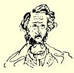
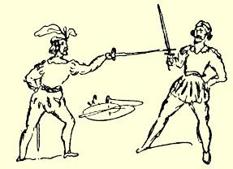
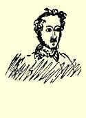
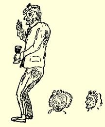
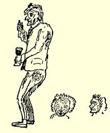

臣的一纸命令，被迫停止讲课，哈雷某些持同一观点的年轻讲师 （大概是卢格等人）明白，他们不能指望得到任何委任。这一纸命令也使柏林《科学评论年鉴》最终被取缔。更多的消息，目前我还没有听到。我不能相信普鲁士政府竟采取如此闻所未闻的粗暴手段，虽然白尔尼在五年前已经预先指出了这一点，而亨斯滕贝格据说是王子[^1]的密友，他同奈安德一样是黑格尔学派的死敌。如果你听到有关这件事的消息，请写信告诉我。现在我打算边喝潘趣酒边钻研黑格尔。Ａｄｉｏｓ[^2]，盼速回信。

#### 弗里德里希·恩格斯

> 第一次摘要发表于１９１３年《新评论》原文是德文杂志第１０期（柏林）；全文发表于《恩格斯早期著作集》１９２０年柏林版

### ２９

## 致弗里德里希·格雷培

> ［１８３９年］１２月９日—［１８４０年］
>
> ２月５日［于不来梅］

**１２月９日**。最亲爱的，刚刚收到你的信；等你们这些家伙的信要这么久，真是令人吃惊。自从收到你和霍伊泽尔从爱北斐特来信后，柏林的情况一点也没有听到。如果确实证明有鬼的话，那么，恨可以使人变成鬼。可是你的信来了，这就很好。

我学你的做法，把神学问题留到最后去谈，以便名副其实地圆满完成我的书信的金字塔。我正在努力从事文学写作；我得到了谷兹科夫的保证，他表示欢迎我投稿，我就给他寄去了关于卡·倍克的文章[^3]；此外，我写了许多诗，但是还得仔细加工，我还在写各种散文以锤炼文风。前天我写了《不来梅情史》，昨天写了《不来梅的犹太人》，明天我想写《不来梅的当代文学》和《学徒》（指商行学徒）或这一类的东西。情绪好的时候，两个星期写出五大张纸是绰绰有余的，尔后润色修辞，间或穿插些诗，使形式多样化，然后以 《不来梅之夜》为书名出版。我的ｉｎｓｐｅ[^4]出版商昨天来我处，我给他读了《ＯｄｙｓｓｅｕｓＲｅｄｉｖｉｖｕｓ》[^5]，使他非常高兴；他有意要我的制造厂出品的第一部小说，昨天还说好一定要一本小诗集。可惜这些诗太少了，况且还有书报检查机关！谁会放过《奥德赛》？我可不让书报检查机关管制我，使我不能自由写作；以后它爱删多少就删多少，**我自己**不愿意扼杀本人的思想。被书报检查机关删减总是不愉快的，不过倒也是光荣的；一个年已三十或写了三本书的作者竟然没有同书报检查机关发生过冲突，那他就不值一提；伤痕斑斑的战士才是最优秀的战士。一本书，拿来一读就应当看出它是同书报检查机关作过斗争的。其实，汉堡的书报检查机关是自由主义的，我最近在《电讯》上发表的关于德国民间故事书的文章[^6]，就对联邦议会和普鲁士书报检查制度极其尖锐地挖苦了一番，可是文章一个字也没有被删去。

**１２月１１日**。—— 噢，弗里茨！我已经很多年没有象现在这样懒惰了。哈，我忽然产生一个想法：我知道，我缺少什么！

**１２月１２日**。—— 这些不来梅人都是些蠢驴，不，我的意思是说都是些好人！目前正是坏天气，街道很滑，他们就在市政厅酒家前撒了沙子，免得醉汉跌交。

旁边画的是一个悲伤厌世的小伙

子；他在巴黎拜访过亨·海涅，受了海

涅的感染，以后他又到泰奥多尔·蒙

特那儿去，学会了蒙特的某些词句，没

有这些词句，悲伤厌世的人是无法生

活的。从那时起，他明显地消瘦了，正打算写一本书来论述悲伤厌世是预防肥胖的唯一有效方法。

**１月２０日［１８４０年］**。我在没有解决在这里的去留问题以前， 不想给你写信。现在终于可以告诉你，我暂时还是留在这里。

**２１日**。我跟你实说吧，我对继续进行神学辩论没有特殊兴趣。 在这些争论中，彼此都不太理解；当回答问题时，对所涉及的问题， 早已忘了ｉｐｓｉｓｓｉｍａｖｅｒｂａ[^7]；这样是不会有什么结果的。要比较扎实地探讨一个问题，就得占更多的篇幅，而我常常不能在后一封信中再肯定前一封信中的看法，因为这种看法太接近于在此期间我已经放弃了的观点。由于施特劳斯，我现在走上了通向黑格尔主义的阳关大道。我当然不会成为象欣里克斯等人那样顽固的黑格尔主义者，但是我应当汲取这个精深博大的体系中最重要的要素。黑格尔关于神的观念已经成了我的观念，于是，我加入了莱奥和亨斯滕贝格所谓的“现代泛神论者”的行列，我很清楚，泛神论这个词本身就会引起不会思考的牧师们的大惊小怪。今天白天，《福音派教会报》反对梅尔克林的虔诚主义的冗长讲道稿２７０，使我很感

 兴趣。善良的《教会报》不仅认为把它归入虔诚主义者的营垒是极为奇怪的，而且还发现了其他一些希奇古怪的东西。现代泛神论， 也就是说，黑格尔，在中国人和祆教徒那里已经可以找到，除此之外，它在加尔文与之斗争过的自由思想家宗派中也明显地表现出来。２７１这一发现确实是非常独特的。而更为独特的是对这一发现的论证。要从被《教会报》硬说成是黑格尔观点的那些东西中认清黑格尔，已经是很费劲的了，而这些东西又被牵强附会地说成是同加尔文关于自由思想家的那个措辞十分含糊的命题有相似之处。论证是非常可笑的，《不来梅教会信使》表现得更妙，它说黑格尔否定历史的真理！人们力求表明挡住自己的路而又无法避开的哲学是违背基督教的，这真是荒谬绝伦。有些人只是听说过黑格尔的名字，而且只读过莱奥的《黑格尔门徒》４８的注释，就想破坏这种不用**任何**夹子夹紧而自成**一**体的体系。—— 这封信写得很不顺遂。天知道为什么，我一坐下来写信，鬼差使就来了—— 我总是有商行的工作要干。

这是两个傀儡，它们呆板的样子，并非我的本意。否则，它们就是人了！

你读过施特劳斯的《鉴别和评述》２６７吗？你要尽力把书弄到手， 那里所有的文章都很出色。论施莱艾尔马赫尔和道布的文章是篇杰作。在论述维尔腾堡的狂人那些文章里，有大量心理学的东西。 其他神学的和美学的文章也很有意思。—— 此外，我正在钻研黑格尔的《历史哲学》，一部巨著；这本书我每晚必读，它的宏伟思想完全把我吸引住了。—— 不久前托路克的播弄是非的老手《文献通报》愚蠢地提出了一个问题：为什么“现代泛神论”不能产生抒情诗，可是古波斯泛神论等等却产生了抒情诗？２７２就请该杂志等一等吧，等我和其他一些人把这种泛神论弄清楚的时候，就会有抒情诗出现了。顺便说一下，《文献通报》承认道布，并且谴责思辨哲学，这倒是很好的。似乎道布不承认黑格尔关于人和上帝本质上是同一的这一原则。这种肤浅的见解令人讨厌；他们不太关心施特劳斯和道布的观点是否基本一致。但是，如果施特劳斯不相信迦拿的婚宴２７３，而道布却相信，那么，人们就会把一个捧上天， 把另一个看作是入地狱的候补者。奥斯温特·马尔巴赫，民间故事书出版商，是个头脑最糊涂的人，特别是（ｃｕｍ－ｔｕｍ[^8]）一个头脑最糊涂的黑格尔主义者。我简直不可理解，黑格尔的信徒怎么会说：

> 天堂也就在这大地上；
>
> 我清楚地感到上帝之成为人就体现在我身上，

因为黑格尔明显地把整体同不完善的单一的东西区别开来。—— 对黑格尔的损害莫过于他自己的学生；只有几个人，如甘斯，罗

 生克兰茨，卢格等才配称为黑格尔的学生。而某个奥斯渥特·马尔巴赫是所有糊涂人中 ｎｏｎ ｐｌｕｓ ｕｌｔａ[^9]。多么了不起的人物！—— 牧师马莱特先生在《不来梅教会信使》杂志上称黑格尔体系为“松散的语言”。９７如果确实如此，牧师本人就糟了，因为要是这些大块大块的东西，这些花岗岩思想散落下来，哪怕是这座巨石建筑的一块石头都会不仅把牧师马莱特先生砸碎，而且能把整个不来梅砸碎。例如，要是把世界历史是自由概念的发展这一思想强加在某一个不来梅牧师的身上，他会发出什么样的悲鸣啊！

**２月１日**。今天无论如何一定要把信发出去。

俄国人开始变得天真起来；他们宣称，似乎同切尔克斯人打这一仗而牺牲的人还没有拿破仑的一次不大的战役所牺牲的人多。我没有料到，象尼让他亲自给你讲古拉这样野蛮的人竟会如此天真。他的生平吧。

我听说，柏林人十分恨我。我在给他们的信中，把托路克和奈安德骂了几句，我也没有把兰克列入ｓｕｐｅｒｏｓ[^10]，这使他们气坏了。 而且，我还写信给霍伊泽尔，大讲特讲贝多芬。—— 我读了维也纳的格里尔帕尔策写的很可爱的喜剧《谁撒谎，谁倒霉！》２７４，它比我们现在的老一套喜剧高明得多。深受奥地利书报检查机关的沉重压迫的善良而自由的精神处处可见。你可以清楚地看到，作者花了多少功夫把豪门贵族描写得不致有损贵族检查官的体面。Ｏｔｅｍ

 ｐｏｒｅｓ，ｏ ｍｏｒｉａ，Ｄｏｎｎｅｒ ｕｎｄ Ｄｏｒｉａ[^11]，今天是２月５日，很惭愧，我太懒了，ｂｕｔ Ｉ ｃａｎｎｏｔ ｈｅｌｐ ｉｔ[^12]，上帝作证，我现在什么也不干。好几篇文章已经动笔写了，可是没有进展，每当我在晚上想写诗的时候，往往由于吃得太饱而无法抗拒睡意。—— 要是今年夏天我能去丹麦，霍尔施坦，日德兰半岛，西兰岛和吕根岛旅行，我会十分满意的。我要争取让我的老头儿把弟弟[^13]送到这里来，我将把他带在身边。我渴望看看大海，我会写出多有趣的旅行随笔呀！可以把这些随笔和一些诗一起出版。现在天气好极了，可是我不能出游，我十分想出去，多倒霉呀！

这胖子是糖业经纪人，他刚从屋里

出来，他的口头禅是：“根据我的意见。”

当他在交易所和某人谈完话，要离开时

一定要说：“祝你健康！”他的姓名是约

·赫·贝格曼。

这里也有令人感动的人物。我这就给你描绘另一幅生活景象：

这个老头儿每天早晨喝得醉醺醺，站在自己家门口，捶着胸口大叫：“Ｉｃｋ ｂｉｎ Ｂｏｒｇｅｒ！”[^14]；这就是说，感谢你，上帝，我不象那些汉诺威人，奥登堡人，更不象那些法国人，我是一个不来梅 Ｂｏｒｇｅｒｔａｇｅｎ ｂａｒｅｎ Ｂｒｅｍｅｒ Ｋｉｎｄ！[^15]

本地各种类型老太婆的面部表情确

实令人讨厌。特别是右面那个翘鼻子的

面部表情，纯粹是不来梅式的。

艾勒特主教在授勋典礼２７５上的讲话

有一大优点：现在任何一个人都知道应

当怎样对待国王[^16]，而且他的背誓罪

行得到了正式的证明。就是这个国王，

ａｎｎｏ １８１５[^17]，当他感到不安的时候，在

他的内阁法令中许下诺

言：如果臣民能使他摆脱

困境，他将授予他们宪法，

就是这个坏透了的、可恶

的、受上帝诅咒的国王现在通过艾勒特宣告，谁也别想从他那里得到宪法，因为“大家为一人和一人为大家，这是普鲁士的国家原则”，“谁也不会用旧布补新衣”。你知道吗，为什么罗泰克的第四卷２７６在普鲁士被禁止？因为这卷书里谈到，１８１４年我们柏林的那位至高无上的没出息的人承认了１８１２年的西班牙宪法１２０，而１８２３年他竟派法国人到西班牙去消灭这部宪法，并且回送西班牙人一份厚礼—— 宗教裁判所和拷打。１８２６年，里波尔在瓦伦西亚被宗教裁判所烧死，他的血连同因自由主义的和异教的观点而在监牢被折磨至死的二万三千名高贵的西班牙人的血一起流淌在普鲁士的弗里德里希－威廉三世 “““公正大王”””的良心上。我憎恨他，除了他，我可能还憎恨两、 三个人；我恨死了他；如果我不是对这个恶棍极端卑视，我会恨得更厉害。同他相比，拿破仑是一个天使，如果说，我们的国王是一个人，那么汉诺威国王[^18]就是神。没有哪个时期比１８１６年到１８３０ 年这个时期更充满王室罪行了；几乎每一个在当时掌握统治权的国君都应处以死刑。笃信宗教的查理十世，阴险的西班牙斐迪南七世，奥地利的弗兰茨—— 一架机器，只会签署死刑判决书并且到处看到的都是烧炭党人２７７；唐·米格尔是一个比法国革命的全体英雄还要伟大的流氓，可是当他血洗优秀的葡萄牙人时，普鲁士、 俄国和奥地利都高兴地承认了他；还有俄国的杀父犯亚历山大以及不愧为他的弟弟的尼古拉，要谈他们的骇人听闻的罪行，简直是多费口舌。啊，我可以给你讲一大堆关于国君爱自己臣民这一主题的滑稽故事。只有国君被人民打了耳光而脑袋嗡嗡响时，只有他的宫殿的窗户被革命的鹅卵石砸得粉碎时，我才能期待国君做些好事。祝你健康。

#### 你的弗里德里希·恩格斯

> 第一次摘要发表于１９１３年《新评论》原文是德文杂志第１０期（柏林）；全文发表于《恩格斯早期著作集》１９２０年柏林版

[^1]: 未来的国王弗里德里希－威廉四世。—— 编者注

[^2]: 再见。—— 编者注

[^3]: 见本卷第２４—３０页。—— 编者注直译是：希望中的；这里指：未来的。—— 编者注

[^4]: 《复活的奥德赛》。—— 编者注

[^5]: 

[^6]: 见本卷第１４—２３页。—— 编者注

[^7]: 自己的话。—— 编者注

[^8]: 既一般地是—— 又特别是。—— 编者注

[^9]: 糊涂透顶的人。—— 编者注

[^10]: 伟人。—— 编者注

[^11]: 著名的拉丁词语：“Ｏ ｔｅｍｐｏｒａ，ｏ ｍｏｒｅｓ”（“哦，时代，哦，风尚”）。这里，恩格斯为了同德语“Ｄｏｎｎｅｒ ｕｎｄ Ｄｏｒｉａ”押韵，改变了拉丁语的词尾而写成：“哦，时代，哦，风尚，见鬼去吧”。—— 编者注可是我没办法。—— 编者注

[^12]: 海尔曼·恩格斯。—— 编者注

[^13]: “我是一个公民！”—— 编者注

[^14]: 

[^15]: 公民，不来梅嫡亲的后裔。—— 编者注

[^16]: 指弗里德里希－威廉三世。—— 编者注

[^17]: 于１８１５年。—— 编者注

[^18]: 恩斯特－奥古斯特。—— 编者注