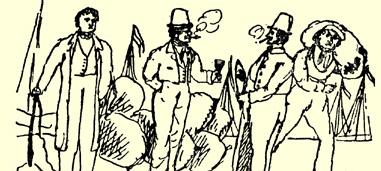
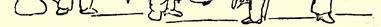
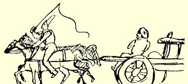

### ３５

## 致玛丽亚·恩格斯

### 曼海姆

> １８４０年９月１８—１９日［于不来梅］
>
> １８４０年９月１８日

我最亲爱的：

这场秋分时节的暴风雨来势非常凶猛。昨天夜里，我们住房的一扇窗敲打破，树木折断，真使人惊恐失色。明后天可能要有船舶失事的消息传来！老头儿[^1]站在窗口发愁，因为轮船出海已经三天了，船上载有价值三千塔勒的麻布，而且没有保险。你为什么只字不提给伊达[^2]的信，我是把它附在前一封信内的，或者我忘了把它放进去？—— 我确实要在此地留到复活节，不过，由于各种原因，这对我倒是适得其所。伊达已经走了，你大概感到很苦恼吧。

我们这里也有一处大约可容三千人的很有气派的兵营。里面驻着奥登堡、不来梅、卢卑克和汉堡部队。前几天我到过那里，见到一件很有趣的事。在帐篷的门口（有个酒馆老板在那里开了一个很大的帐篷酒馆）坐着一个法国人，喝得酩酊大醉，站立不住。 侍者给他戴上一个大花冠，他就开始喊叫：“用可爱的绿叶高脚杯加冕吧！”[^3]后来侍者把他拖到停尸房，即干草房，他躺下就睡着了。到他醒过来时，他向人借了一匹马骑上，在营房边来回奔驰。 他每次都象快要从马上掉下来，姿态是那么优美。我们在那里过得非常愉快，喝了上等好酒。上星期天，我骑马去费格萨克。这次旅游途中，我四次饱尝淋得湿透的滋味，可是我仍然感到身体内部有一团火，每次都好象要烧干一样。倒霉的是，我骑的一匹马糟糕透了，很难小跑，该死的颠簸震透了我的骨髓。刚才又给我们拿来六瓶啤酒，这些啤酒马上就会遇到一个兴奋的过程—— 当时我想抽雪茄了，应当说这是一个感到空虚的过程。我差不多把整整一瓶喝光了，而且还抽了一支雪茄。我们的年轻主人唐· 威廉[^4]不久又要外出了，到时候我们一切再从头开始。

１８４０年９月１９日。你们的生活毕竟比我们枯燥些。昨晚没有再做任何工作。老头儿走了，威廉·洛伊波尔德也几乎没有露面。 于是我抽起烟来，先给你写了上面的一段，然后从办公桌里拿出莱诺的《浮士德》２８５读了一会儿。后来我喝了一瓶啤酒，七时半去找罗特。我们一同到联谊会去，我读了一会劳麦的《霍亨斯陶芬王朝的历史》２８６，吃了一盘煎牛排，一盘凉拌黄瓜。我十时半回家，当时不想睡，就读起了狄茨的《罗马语语法》２８７。况且明天又是星期天， 而星期三是不来梅的忏悔祈祷日，这样，我们将渐渐拖到冬天。今年冬天，我将跟埃伯莱因上舞蹈课，以便使我这笨拙的双腿能变得稍微优美一点。

这里可以看到一个会战的场面，也就是街头即景，这是威悉河畔的一条沿岸大街，货物就卸在这里。拿鞭子的小伙子是马车夫， 他马上要装运堆放在后面的一袋袋咖啡豆。右边扛袋子的小伙子是脚夫，正在搬运咖啡豆。脚夫旁边是酿酒师，刚刚取了样品，拿

 在手上；酿酒师旁边是船夫，咖啡豆就是从他船上卸下的。你无法否认，这些人都十分有趣。马车夫赶车时，他骑在一匹没有马鞍、马镫和马刺的马背上，一直把他双脚的后跟紧紧夹住马的肋骨，象这样：

此时又在下雨，这对周末的晚上来说，真是大煞风景。说实在的，最好是在一周内的其他日子下雨，而从星期六中午起，就应该是好天气。你知不知道，优质、中等、普通的多米尼加咖啡豆是什么？这又是商人哲学中常见的深奥概念之一，这类概念是你的智

[^1]: 亨利希·洛伊波尔德。—— 编者注伊达·恩格斯。—— 编者注

[^2]: 

[^3]: 马蒂亚斯·克劳狄乌斯《莱茵葡萄酒之歌》。—— 编者注

[^4]: 威廉·洛伊波尔德。—— 编者注