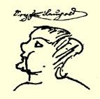

力无法理解的。优质、中等、普通的多米尼加咖啡豆，是一种产自海地岛的咖啡豆，呈淡绿色，一般说是灰色的。你买到这种咖啡豆时，就会发现每十粒好咖啡豆就有四颗坏豆粒，六颗小石子和四分之一洛特的脏东西，土等等。我想，现在你完全明白了。这种咖啡豆每磅卖９１

２格罗特，即４银格罗申加８１２３

１３７分尼。这类商业秘密其实不应泄漏，因为家丑不可外扬，不过对于你却作为例外。——  刚才，我们的职员说[^1]：德克希姆先生，如果您同这些年轻学生在一起，请自重些，否则他们会给您小鞋穿。亨利希是个坏孩子，他给我找过不少麻烦，您最好别同他多玩，而应当狠狠地给他一记耳光，不然无济于事。如果您去找老头儿，他对这个淘气孩子也毫无办法，只会说：别理睬这个小伙子。你现在能稍微用用我们的低地德意志方言了。今后，

#### 我仍然是完全忠于你的弗里德里希

> 第一次发表于１９２０年《德意志评论》原文是德文杂志第４卷（斯图加特和莱比锡）

### ３６

## 致玛丽亚·恩格斯

### 曼海姆[^2]

> １８４０年１０月２９日于不来梅

亲爱的玛丽亚：

你下次给我写信别再经由巴门转了：妈妈会把信搁下来直到

 她自己写信时才寄出，这样往往会耽搁很久。我想告诉你一件事 —— 不过你写信回家时别提起它，因为我想在来年春天使他们感到意外，—— 我现在留了大胡子，而且正准备再蓄起亨利四世型的山羊胡子。这样一来，当门口突然出现这样一个又高又黑的黑胡子叔叔时，妈妈一定会大吃一惊。明年如果我去意大利，我一定要使人觉得我是意大利人。

这是小索菲娅·洛伊波尔德画的，她刚才到商行来看望过我。老头儿[^3]和在家里用饭的埃伯莱因这时正在参加盛大的午宴。啊，我本来可以向你讲一些有关这次午宴，有关未经宣布的订婚礼和偷偷接吻的趣闻，但这些事不宜讲给女子寄宿学校的女孩子们听。等我回家时，你很快就会知道这些事。那时我在花园里坐着，你给我拿来一大罐啤酒和几片夹香肠的黄油面包，我就说：好吧！我亲爱的妹妹，因为你给我拿来了啤酒，加之今晚是一个如此迷人的夏天的傍晚，所以我现在向你讲述一次盛宴的情况，那是 １８４０年１０月２９日在不来梅马蒂尼街１１号王国萨克森领事馆举行的。我能告诉你的暂时只是：在这天的宴会上，喝了大量的马德腊酒、波尔图酒、普亚克酒、上索泰恩酒和莱茵葡萄酒。虽然那里一共只有五个男人，他们的酒量全都不错，差不多同我一样。—— 因此，我们在那里毫无拘束。我虽然未蒙引见给一位大公夫人殿下和许多最尊贵的公爵夫人，但我们仍然很愉快。幸运得很，我是如此的近视，以致完全不知道从我身边走过的那些尊贵的、十分尊贵的和最尊贵的大人物是什么样子。如果下次你有幸被引见给这样一位最仁慈的大人物，你一定要写信告诉我，她漂亮吗，否则这些大人物完全不使我发生兴趣。我们高贵的市政厅酒家，现在设备非常好，在那里可以很舒服地在酒桶之间闲坐。上个星期天我们在小酒馆里举行过一次小胡子宴会。事情是这样：我发了一个通知给全体能够蓄胡子的年轻人说，消除这一切庸人偏见的时候终于到来了，我们能做到这一点的最好方法，就是我们一致蓄胡子。 谁有足够的勇气起来反对庸俗偏见并且蓄胡子，谁就签名。我立刻就征集到十来个小胡子，并将１０月２５日这一天—— 那时我们蓄胡子已经一个月了—— 定为集体蓄胡子纪念日。我仔细地考虑过这件事将如何进行，我买了一点染胡子药水带在身边。后来发现，有的人胡子很美，可惜完全是灰白的；有人则接到自己保护人的命令，要他剃掉这种犯法的修饰。但是不管怎样，当天晚上我们一定得有随便什么样的胡子；谁要是没有，就要他给自己描上。后来我起身致祝酒词如下：

男人蓄胡子，

是英勇的大丈夫。

举起刀剑保卫过祖国的人，

总是蓄着黄色或黑色的胡子。

在这充满战争危险的日子里，

我们应当骄傲地蓄胡子。

庸人当然不喜欢，

他们随时准备剃光胡子。

我们不是庸人，我们是另一种人，

我们要蓄浓密密的大胡子。

对于善良的基督教徒，

没有什么更美的修饰胜似蓄大胡子。

但愿庸人们统统死光，

他们不懂得什么是美。

朗诵完这几行蹩脚的诗句以后，大家就兴高采烈地相互碰杯， 然后是下一个人讲话。此人的房主不肯把大门钥匙给他，因此他到十点钟就得回去，不然他就进不去了。许多倒霉的人在这里往往只好忍受这样的事。他吟道：

房主们不得好死！

他们竟不给大门钥匙！

让他们在晚餐盘中发现头发和苍蝇，

躺在床上彻夜不得安宁！

吟罢，我们又相互碰杯。这样一直继续到十点钟，这时，没有大门钥匙的人不得不回去，而我们这些随身带了钥匙的幸运者，则留下来吃牡蛎。我吃了八只，再也吃不下了，直到现在，我对牡蛎仍是食而不知其味。

因为你很爱好计算，甚至愿意为此奖给我一枚黄封套勋章， 那我就施惠于你，告诉你：现在的牌价为１０６１

２％，而去年则为 １１４％。金路易猛跌，一个人一年前在不来梅这里拥有一百万塔勒， 现在只有九十万了，即少了十万塔勒。这难道不是个很大的数目吗？

你对转给伊达[^4]的信仍然只字未提，你收到那封信了吗？转给

[^1]: 以下是用低地德意志方言讲的。—— 编者注

[^2]: 信的背面写着：曼海姆市大公女子中学 玛丽亚·恩格斯小姐收。—— 编者注

[^3]: 亨利希·洛伊波尔德。—— 编者注

[^4]: 伊达·恩格斯。—— 编者注