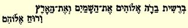

新蓄起胡子了，因为我哪儿也不能露面。在歌咏学校只有我一个人留着胡子，我总是觉得一些庸夫俗子很可笑，他们怎么也不能容忍我连胡子都不刮就这样满不在乎地出现在体面的社交界。其实，太太们非常喜欢我这种样子，老头儿也喜欢。仅仅在昨晚的音乐会上，就有六个衣着入时的年轻人把我围住了，他们都穿着燕尾服，戴着细软的羊皮手套，而我穿的是普通的常礼服，不戴手套。 这些家伙整个晚上都在取笑我，取笑我的唇髭。可是最有意思的是三个月以前这里谁也不认识我，而现在大家都认识了我，就因为我这胡子。啊，这些庸夫俗子！

#### 你的弗里德里希

> 第一次发表于１９２０年《德意志评论》原文是德文杂志第４卷（斯图加特和莱比锡）

### ４１

## 致弗里德里希·格雷培

> １８４１年２月２２日于不来梅

尊敬的ｉｎｓｐｅ[^1]牧师先生：

ｈａｂｅｎ ｄｉｅ Ｇｎａｄｅ ｇｅｈａｂｔ，ｈａｂｕｅｒｕｎｔ ｇｒａｔｉａｍ ｍｉｒ ｚｕｓｃｈｒｅｉｂｅｎ ｍｉｈｉ ｓｃｒｉｂｅｎｄｉ ｓｃ．ｌｉｔｅｒａｓ．Ｍｕｌｔｕｍ ｇａｕｄｅｏ，ｔｉｂｉ ａｄｊｕｖａｓｓｅ ａｄ ｇｒａｔｉｆｉｃａｔｉｏｎｅｍ ｔｒｉｇｉｎｔａ ｔｈａｌｅｒｏｒｕｍ，ｓｐｅｒｏ ｑｕｅＲ，ｔｅ ｉｓｔａｇｒａｔｉｆｉｃａｔｉｏｎｅ ｕｓｕｍ ｅｓｓｅ ａｄ ｂｉｂｅｎｄｕｍ ｉｎ ｓａｎｉｔａｔｅｍ ｍｅａｍ．αιρ， ρισιαισμ ，μ

′ αξ

′ α ρασσμασιξ，α

’′σρ  η ’ρ δξι′α，πασι η ω  πι ι′

 σω   η

′πη，βασι’ξη η′σω！；！；！； [^2]飘悬在弗·格雷培的头上，因为他做成了不可能的事并且证明二乘二等于五。啊，你，追猎鸵鸟们[^3]的伟大猎手， 恳求你以整个正统派的名义去捣毁该死的鸵鸟们的巢穴并用自己的圣乔治长矛刺破孵了一半的鸵鸟蛋！英勇的斩龙者，请你到泛神论的沙漠中去同ｒｕｇｉｅｎｓ[^4]莱奥的卢格交战，因为卢格正在到处搜索和寻找可以吞食的对象；把该死的鸵鸟的徒子徒孙通通消灭并且在思辨神学这个西奈半岛上竖起十字旗帜！恳求你这样做吧， 你看，信教的人已经等候了五年，期待着有人能把施特劳斯这条蛇的头压得粉碎；他们感到精疲力尽，他们曾经用石头、污泥、甚至用牲口的粪便向它扔去，可是注满毒素的头越翘越高；既然你能这样容易地把一切都驳倒，仿佛能使所有的漂亮建筑物自行倒塌，那么就请你集中力量批驳《耶稣传》１６２和《教义学》１５９第一卷吧；要知道， 危险越来越严重了，《耶稣传》的出版量已经超过了亨斯滕贝格和托路克的全部著作的总和，这本书已经成为把每一个非施特劳斯主义者逐出文坛的常规。而《哈雷年鉴》是北德意志最畅销的杂志，其销路之广，使普鲁士国王[^5]陛下虽欲百般查禁而不能。要查禁每天对他言出不逊的《哈雷年鉴》，就会把成百万还不知道如何判断他的普鲁士人变成自己的敌人。因此，你们切莫延误时机，否则，尽管普鲁士国王有虔诚的信念，我们将骂得你们永远哑口无言。总之，你们不妨再鼓足一点勇气，以便战斗能真正开始。但是你们写得这么平静和超然，似乎正统基督教的股票比票面价值高出百分之百，似乎哲学的溪流就象在经院哲学时代那样在自己的教会堤坝之间平平稳稳地流动，似乎在教义的月亮与真理的太阳之间没有挤进一个无耻的地球而造成可怕的月食。难道你们没有注意到，旋风在森林中翻卷，摧折了所有的枯树；代替衰老的、 ａｄ ａｃｔａ[^6]魔鬼而兴起的，是已经拥有成批信徒的、批判地思辨的魔鬼？我们没有一天不在傲慢地、嘲弄地号召你们起来战斗；难道我们不是一个劲地在刺着你们的厚皮—— 不错，这张皮已经有一千八百年了，并且与熟皮有点相似，—— 迫使你们骑上战马吗？ 可是你们的奈安德们，托路克们，尼茨施们，布莱克们，埃尔德曼们，还有一些叫什么来着的人—— 所有这些人全都是软弱、敏感的人物，他们佩带的剑令人发笑；他们无一例外地都是如此谨小慎微，那么害怕出乱子，对他们简直毫无办法。纵使亨斯滕贝格和莱奥还有点勇气，但亨斯滕贝格已经多次落马，以致完全失去了战斗力，而莱奥在上次同黑格尔门徒４８的搏斗中，所有的胡子都被揪掉了，弄得现在见不得人。其实，施特劳斯绝对没有出丑， 因为，如果说几年前他还认为他的《耶稣传》丝毫无损于教会的学说，那么，他当然用不着牺牲什么就可以阅读“正统神学体系”， 如同另一个正统主义者可以阅读“黑格尔哲学体系”一样；但是，如果他，正象《耶稣传》所表明的那样，确实认为教义学不会由于他的观点而遭到损害，那么任何人都可以预料到，一旦他认真地研究教义学，他很快就会与这种思想分道扬镳。他在他的《教义学》中就已经直言不讳地说出他所设想的教会的学说是什么。无论如何， 他定居柏林是件好事，那里是他应当去的地方，他在那里讲话和写作要比在斯图加特更有效。

有一种看法，认为我作为一个诗人已经完了，许多人正在为此争论不休。此外，弗莱里格拉特之所以没有刊载我的诗，并不是由于诗的原因，而是由于诗的观点以及版面不够。第一，他并不是自由主义的；第二，诗收到得太迟了；第三，版面有限，以致不得不从原定放在最后一个印张上的诗篇中抽去一些佳作。话又说回来， 尼·贝克尔的《莱茵河之歌》是相当平庸的东西，它已经名声不佳， 没有一种刊物愿意再去赞扬它。罗·爱·普鲁茨的诗歌《莱茵河》２８９完全属于另外一种类型，贝克尔的其他诗歌就好得多了。他在举行火炬游行时发表的演说是我所听过的一次最糟糕的演说。 我对国王们赠予的各种荣誉奖品，敬谢不敏。这一切有什么用呢？ 国王送的勋章也罢，金烟盒也罢，荣誉奖杯也罢，在我们的时代里这一切与其说是荣誉，不如说是耻辱。对这种东西我们大家都谢绝啦！谢天谢地，由于这些东西，我们反而得到了保险：自从我在 《电讯》上发表了一篇关于恩·莫·阿伦特的文章[^7]以来，甚至连发疯的巴伐利亚国王[^8]也没有想起要给我扣上一顶系着铃铛的傻瓜帽子，或者在我的背上盖一个奴颜婢膝的印记。现在，一个人越是卑鄙龌龊、卑躬屈节、阿谀逢迎，就越能获得更多的勋章。

我现在热衷于击剑，而且在不久的将来可能把你们全部击溃。

[^1]: 未来的。—— 编者注

[^2]: 承蒙赐函，荣幸之至。我能帮助你三十塔勒，深感欣慰，希望你用这笔钱为我的健康干杯。致意，基督教的卫士，追猎施特劳斯们的伟大猎手，正统派的明星，忧郁的虔诚主义者的安慰者，圣经注释大王！；！；！；一开始，上帝创造了天和地，而且上帝的精神。—— 编者注文字游戏：“Ｓｔｒａｕ”—— 一是指姓氏（暗指大·施特劳斯，《耶稣传》的作

[^3]: 者），一是指鸵鸟。—— 编者注

[^4]: 指责。—— 编者注

[^5]: 弗里德里希－威廉四世。—— 编者注

[^6]: 无能为力的。—— 编者注

[^7]: 见本卷第１４４—１６０页。—— 编者注

[^8]: 路德维希一世。—— 编者注