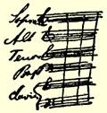
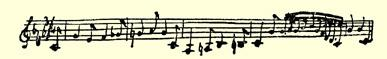

近一个月来我在这里进行了两次决斗：第一个对手收回了自己的侮辱性的话（“傻小子”），这是他在挨了我一记耳光之后骂的，耳光之仇还没报呢；第二个对手，我是昨天同他格斗的，我给他的额上划了一道漂亮的伤痕，正好从上到下，这一剑我击得非常出色。

Ｆａｒｅｗｅｌｌ[^1]！

#### 你的弗·恩格斯

> 第一次发表于１９１３年《新评论》原文是德文杂志第１０期（柏林）

### ４２

## 致玛丽亚·恩格斯

### 曼海姆

> １８４１年３月８—１１日于不来梅

１８４１年３月８日亲爱的玛丽亚：

“某某谨启”，这是我在公函中写的最后几个字，以此结束了我今天的商行事务，以便—— 以便—— 以便，你看，该怎么表达才能更得体呢？怎么办呢，现在又没有诗兴；为了给你写信，最好还是有什么就说什么吧。由于我正在消化我的午饭，所以没有时间多作考虑，势必想到什么就给你写什么。可是我首先想到的是一支雪茄，我现在就把它点着，因为陛下不在，陛下就是老头儿[^2]，他已经获得这个称号，因为我们决定练习宫廷礼节。要知道，洛伊波

尔德商行的全体人员在不久的将来都将成

为大臣和枢密侍从，这是十分肯定的、毫无

疑问的。当你看到我穿上挂着金钥匙的黑

色燕尾服的时候，你会感到吃惊，当然，我

仍然保持我的老样子，不亢不卑，也不会为

了取悦于任何一个国王而剃掉胡子。我的

胡子现在正欣欣向荣，而且还在长，我毫不

怀疑，如果春天我有幸在曼海姆同你饮酒，

那时你将因它的丰姿神采而大吃一惊。

理查·罗特在一个星期以前离开这里

到南德意志和瑞士等地作一次长途旅行。 感谢上帝，我将离开这个沉闷的小城市，在这里，没有别的事可做， 只有击剑、吃、喝、睡和刻苦用功，ｖｏｉｌａｔｏｕｔ[^3]。不知你是否已经听说我和父亲在４月底可能到意大利去，届时我将拜访你，以示敬意。如果你的举止大方，我或许会带一些东西给你，但是，如果你神气活现、不可一世，那你就要吃苦头。如果你又写信胡说一通，就象在上一封信中以剑术课挖苦我那样，你必然逃脱不了公正的惩罚。我知道了Ｓｔａｂａｔｍａｔｅｒ[^4]是佩戈莱西写的，感到很高兴。你无论如何应当把改编的钢琴曲连同所有的声乐分谱抄一份给我，要象改编的歌剧钢琴曲一样，使各个声部同和声上下对齐。我记得，在佩戈莱西的Ｓｔａｂａｔｍａｔｅｒ里

 好象没有男高音部和男低音部，倒是有许多女高音部和女中音部。 不过，这没有关系。

如果今年春天我真的去米兰，就能在那里会见罗特和爱北斐特人威廉·布兰克。因为有土耳其烟草和ＬａｃｒｉｍｅｄｉＣｈｒｉｓｔｏ[^5]，在那里我们会过得很惬意。我们要使自己名不虚传，让意大利人半年之后还会想起三个愉快的德国人。

我很喜欢你对你们那有益无害的狂欢节的一番描写。我真想看看你的打扮。这里除了一些我不参加的、乏味的化装舞会，没有任何愉快的东西。柏林的狂欢节又遭到可耻的失败。这种事情到底还是科伦人搞得最好。

但是，你有一点不能与我相比。今天，３月１０日，星期三，你听不到贝多芬的Ｃ小调交响曲，而我能听到。这首交响曲，以及英雄交响曲，是我喜爱的作品。你要好好地练习演奏贝多芬的奏鸣曲和交响曲，免得让我将来为你害臊。我要听的不是改编的钢琴曲， 而是整个乐队的演奏。

３月１１日。昨天晚上听的才是真正的交响乐呢！如果你没有听过这部宏伟壮丽的作品，那么你一生就根本没有听过任何音乐。 第一乐章中这种充满绝望的悲哀，柔板中表现的那种哀诗般的忧伤，那种温柔的爱的倾诉，而在第三和第四乐章中由长号奏出的这种坚强有力的、富有青春气息的自由的欢乐！此外，昨天我还听到一个可怜的法国人的演唱，他唱的大致是这样：

[^1]: 再见！—— 编者注

[^2]: 亨利希·洛伊波尔德。—— 编者注

[^3]: 这就是一切。—— 编者注

[^4]: 见本卷第５８６—５８７页。—— 编者注

[^5]: 基督之泪（酒名）。—— 编者注