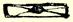

 如此等等，没有任何旋律，也谈不上什么和谐，法语歌词也很糟糕， 这整个可笑的东西就叫作“Ｌ’ＥｘｉｌéｄｅＦｒａｎｃｅ”[^1]。如果法国所有的流浪者都举行这种猫叫式的音乐会，谁都不愿意听。这个粗野人还唱了一首歌：“Ｌｅｔｏｒéａｄｏｒ”，意思是斗牛士，而且老是不断地重复一句唱词：“Ａｈｑｕｅｊ’ａｉｍｅｌ’Ｅｓｐａｇｎｅ！”[^2]。这首歌也许唱得更糟，抽抽搐搐地一会儿跳了五度，一会儿走了调，仿佛要表达肚子绞痛似的。如果后面不是演奏精彩的交响曲，我就会跑出来，让这只乌鸦哇哇叫去，因为他的男中音实在细得太可怜了。顺便说一下，请你以后把信封粘得牢一些。这种形状很不实用，很不美观。信应当是这种     或者这种形状，请你注意。

ＳｅｍｐｅｒＴｕａｓ[^3]

#### 弗里德里希

> 第一次发表于《马克思恩格斯全集》原文是德文 １９３０年国际版第１部分第２卷

### ４３

## 致玛丽亚·恩格斯

### 曼海姆

> １８４１年４月５日于巴门２９０

为什么你往不来梅给我写信？你真不值得让我现在再给你写

[^1]: 《法国流浪者》。—— 编者注“啊，我多么喜爱西班牙！”—— 编者注

[^2]: 

[^3]: 永远是你的。—— 编者注