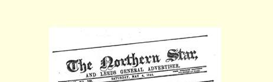
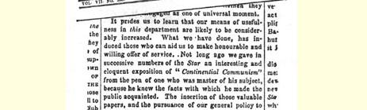
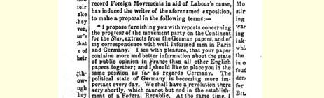
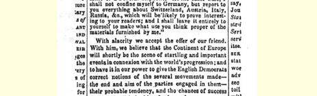

# 报刊和德国暴君

> ８３

我们的读者意识到共和主义和共产主义的原理正在德国迅速传播开来，这种进展近来在戴王冠的强盗们以及他们的伟大联邦８４的顾问们中间引起了少有的惊慌。因此，他们就采取进一步的镇压措施来制止这些“危险的学说”的发展，特别是制止它们在普鲁士的发展。看来，１８３４年曾经在维也纳举行过一次秘密的全权代表会议，当时通过了一个议定书，不过只在最近才予以公布；议定书对报刊实行极严格的限制，并强行宣称，君主们的“神权”凌驾于一切立法团体和任何其他民间团体之上。我们不妨援引第十八条来表明这个极其恶毒的议定书是实行“神圣同盟”原则的样板； 条文写道：８５

> “君主们由于他们的等级议会违反１８３２年联邦议会法令的规定而受到威胁时，应解散这些议会，并从联邦的其他成员那里获得军事援助。”

为了证明报刊的正义性和自由在普鲁士是怎样被理解的，我们可以再补充一点，那就是科伦、闵斯德和其他天主教城市的检查官都接到严格的指令，不准转载任何有关目前正在爱尔兰进行的审判案８６的材料。一家德国报纸打算派一名记者或通讯员前往都柏林，可是就连他的书信也别想获准发表。没有关系，尽管他们有地牢和刺刀，自由还是会胜利的。

> 弗·恩格斯写于１８４４年１月底—原文是英文 ２月初载于１８４４年２月３日《北极星报》 第３２５号，未署名

> １８４４年５月４日《北极星报》编辑部文章援引的
>
> 弗·恩格斯给该报的信的片断