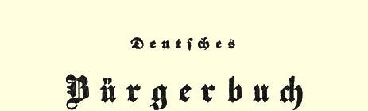
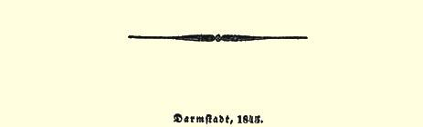

## 弗·恩格斯

# 大陆社会主义

> １１３

看来大陆社会主义目前值得受到社会上相当多人的注意。现寄上《新道德世界》前撰稿人从普鲁士的巴门来信的几段摘要。

“我在回家途中，在巴黎１１４访问了神秘主义学派的共产主义俱乐部。是一位俄国人[^1]介绍我去的，他能讲极好的法语和德语，并且十分巧妙地提出费尔巴哈的论据[^2]来反驳神秘主义学派。他们所说的神这一术语正是罕考门派社会主义者１１５所说的**爱的精神**。 不过，他们宣称，这是次要问题，实际上是和我们一致的，并且说， ‘ｅｎｆｉｎｌ’ａｔｈéｉｓｍｅ，ｃ’ｅｓｔｖｏｔｒｅｒｅｌｉｇｉｏｎ’—— 总之，无神论是你们的宗教。在法语中，‘宗教’的意思是**深信**，**感觉**，而不是崇拜。他们断言，**资产阶级**即中等阶级反对英国的叫嚣和喧闹都是无谓之举； 他们急于使我们相信，他们丝毫没有民族偏见，法国工人并不关心摩洛哥，１１６他们只知道全世界的ｌｅｓｏｕｖｒｉｅｒｓ—— 工人—— 由于具有共同的利益而都是盟友。法国中等阶级正象英国中等阶级一样， 是十分自私、贪婪的，是完全不能见容于社会的，而法国**工人**是非常好的人。我们在巴黎的俄国人中间工作取得了很大成绩。有三四个正在巴黎的贵族和农奴主成了激进共产主义者和无神论者。 我们在巴黎有一家每周出版两次的德文的共产主义报纸《前进报》。在比利时，正在进行积极的共产主义鼓动工作，并且有一家报纸《社会辩论报》已经在布鲁塞尔出版了。在巴黎，大约有六家共产主义报纸。**社会主义的**，**社会化的**等词在法国十分流行；而路易菲力浦这个头号**资产者**靠金钱和庇护来支持《和平民主日报》。法国社会主义者的表面的宗教信仰大半是虚假的；人民是完全不信教的，下一次革命的第一批牺牲者将是教士。科伦人有了长足的进步。当我们在一家旅店集会时，房间里坐满了我们的朋友，大部分是律师、医生、艺术家等，还有三四个骑兵中尉，其中一个是位非常聪明的人。在杜塞尔多夫，我们有几个人，其中有一位颇有才气的诗人[^3]。在爱北斐特，大约有我的六个朋友以及其他几个人都是共产主义者。事实上，在北德意志，几乎每一座城市我们都有几个反对私有制和主张无神论的激进党人。柏林的埃德加尔·鲍威尔由于他最近写的一本书刚被判处三年徒刑。”

我想上述事实会使您的读者感兴趣，特此寄上供贵报刊载。

> 弗·恩格斯约写于１８４４年９月２０日原文是英文载于１８４４年１０月５日《新道德世界》 第１５号署名：盎格鲁德意志人

> 载有弗·恩格斯《现代兴起的今日尚存的共产主义移民区记述》
>
> 一文的《１８４５年德国公民手册》年鉴的封面

[^1]: 显然指米·亚·巴枯宁。—— 编者注

[^2]: 把神的观念归结为人。

[^3]: 大概指威廉·弥勒。—— 编者注